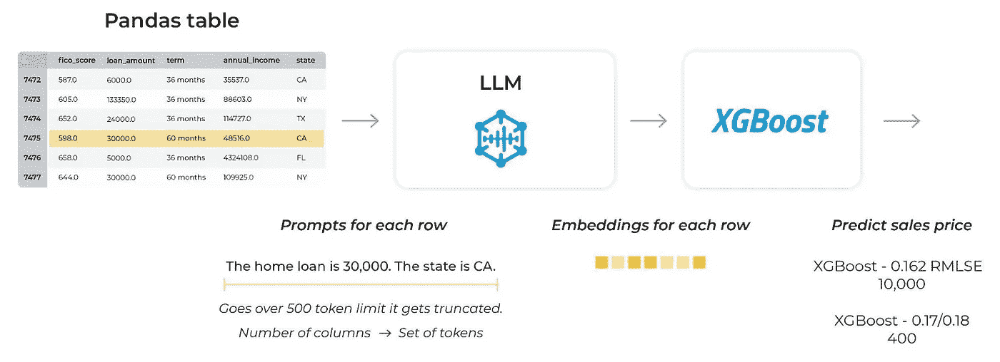

# 使用大型语言模型提升表格数据预测

> 原文：[`towardsdatascience.com/boosting-tabular-data-predictions-with-large-language-models-531337f834dc?source=collection_archive---------0-----------------------#2023-04-06`](https://towardsdatascience.com/boosting-tabular-data-predictions-with-large-language-models-531337f834dc?source=collection_archive---------0-----------------------#2023-04-06)

作者提供的图像

## 当你将 GPT-4 应用于表格型 Kaggle 竞赛以预测房价时会发生什么？

 [Aparna Dhinakaran](https://aparnadhinak.medium.com/?source=post_page-----531337f834dc--------------------------------)

·

[关注](https://medium.com/m/signin?actionUrl=https%3A%2F%2Fmedium.com%2F_%2Fsubscribe%2Fuser%2Ff32f85889f3a&operation=register&redirect=https%3A%2F%2Ftowardsdatascience.com%2Fboosting-tabular-data-predictions-with-large-language-models-531337f834dc&user=Aparna+Dhinakaran&userId=f32f85889f3a&source=post_page-f32f85889f3a----531337f834dc---------------------post_header-----------) 发表在 [Towards Data Science](https://towardsdatascience.com/?source=post_page-----531337f834dc--------------------------------) ·9 min read·2023 年 4 月 6 日

--

***跟随本博客的*** [***配套 Colab***](https://colab.research.google.com/gist/PubliusAu/3c0b73ecf5558e4dda2a483693be2b93/arize-wide-llm-kaggle-example-v2-0-1.ipynb)**.**

*本博客与 Arize AI 的 CEO 和联合创始人 Jason Lopatecki 以及 Decision Patterns 的 CEO 和创始人 Christopher Brown 合作完成*

# 引言

在机器学习生态系统中，有两个明显不同的群体。一类处理的是高度组织化的表格数据——即以表格数据为重点的数据科学家。另一类则致力于深度学习应用，包括视觉、音频、大型语言模型（LLMs）等。为了本文的目的，我们称前者为“表格”或“传统”群体，后者为“LLM”群体。每个群体都使用自己独特的技术和模型，这些技术和模型在很大程度上是独立发展的。鉴于大型语言模型如 OpenAI 的 GPT-4 等最近的成功，我们希望看看是否可以利用现代 LLM 的结果来帮助对表格数据集进行预测。

为了证明这种方法的有效性，我们向几个盲测的 Kaggle 竞赛提交了结果（包括受欢迎的“房价——高级回归技术”[竞赛](https://www.kaggle.com/competitions/house-prices-advanced-regression-techniques)）。典型的 Kaggle 竞赛提供表格数据，并且通常由传统的机器学习方法主导。然而，我们发现，即便在几乎没有背景知识、无需数据清洗和特征开发的情况下，LLMs 也能够返回具有预测能力的结果。LLM 的预测结果虽然无法与经过长时间和广泛的表格方法得到的领先模型竞争，但足够强大，能够在排行榜上显著高于中位数分数。

我们预计这将是多种使用 LLM 处理表格数据技术的开端，不会感到惊讶如果看到它们的使用范围扩大，并与更传统的模型开发过程进行有利的竞争。

本文中包括了我们见过的第一个将传统表格数据集和 XGBoost 模型与 LLM 使用潜在结构嵌入相结合的方法，使得表格方法能够基于 LLM 内部生成的数值“特征”进行工作。

到目前为止，我们还没有见过以这种方式使用 LLM 的案例，希望这将是一个令人兴奋的开端。

# 将深度学习应用于表格数据的挑战

典型的机器学习应用涉及清洗和训练通常由组织收集、保存或获取的狭窄数据集。从高层次来看，这个过程可以被认为是开发一个“上下文”，在这个上下文中只能提出特定类型的问题。当这种类型的问题出现时，机器学习模型会生成一个或多个预测。进一步改善模型来自三个方面：增加数据、改进方法或获取更多不同的特征。最后一点通常最为有趣，因为数据科学家通常会问自己：“我能获取哪些不同的数据来改善我的预测？”

分区、提升和/或袋装模型已经在这个领域得到了开发并表现出色。尽管付出了很多努力，深度学习在这一领域的效果却没有那么显著。观察显示，XGBoost 及其类似模型在生产中更具泛化能力，而深度学习模型往往容易过拟合。许多团队尝试改进在表格数据集上的深度学习，但这些努力大多落后于已建立的高性能表格方法。

## 使用狭窄数据进行训练的问题

一种常见的深度学习方法是将神经网络和多层感知器（MLP）应用于由组织数据组成的相对“小”数据集。这个方法已多次证明需要更多的工作（数据科学家时间）、资源消耗（训练时间）和参数调优，以获得类似或更差的性能，相比于表格方法。深度学习的失败可能是由于方法与其可用的狭窄数据之间的不匹配。深度学习似乎在从狭窄数据中学习的能力上受到了一定的限制。

图片来源于作者

在上图中，一个大型参数神经网络模型在一个单一公司的“小数据”上进行了训练。在相对较小的数据集上训练大型模型会导致模型几乎总是过度参数化。这是因为用于做出决策的信息量不大，与数据相关的“错误面”也有限。

# 将大型语言模型应用于表格数据集：进入提示工程

大型语言模型（LLMs）通过两项创新走到了前台。第一项是由谷歌等公司首创的变压器架构。第二项是将这些架构应用于规模达到数十或数百 TB 的巨大数据集。一个合理的假设是，这些 LLMs 能够绕过困扰深度学习方法的“狭窄”数据问题。通过在互联网规模的数据上进行训练，LLMs 构建了许多应用背景的内部表示。这是为了拥有一个能够回应各种提示的模型所必需的步骤。一个令人愉快且必要的结果是，LLMs 可能已经发展出了回答与组织预测问题或 Kaggle 竞赛相关的问题的背景。

类比而言，LLMs 以类似于传统/表格机器学习在其训练步骤中理解问题背景的方式来理解你的问题。令人惊讶的是，这些模型使用的是更广泛的数据来源，而不是组织特定的数据。另一种看法是，LLMs 训练了一个能够从其他地方获得的数据进行预测的模型。对于数据科学家来说，这提供了对多样化数据集和潜在信息宝库的访问——或者它们可能只是噪声。

解锁 LLM 在表格模型中的信息面临两个障碍。第一个是 LLM 是通过提示而不是表格数据（DataFrames）来访问的。第二个是 LLM 主要生成文本输出。

为了克服第一个障碍，我们通过提示提供表格数据。这里的提示是在表格的每一行上创建的。提示的构造相当简单：一个由句子组成的段落，每个句子对应表格行中的一个单元格，如下所示：

图片来源：作者

“行”提示由以下内容组成：

*“<列名> 是 <单元格值>。<列名> 是 <单元格值>。……”*

需要注意两点：

1.  不必为训练数据生成提示，只需生成关于需要进行预测的数据的提示；

1.  不必严格要求对数据进行预测。

第二个障碍是 LLM 生成文本响应。在某些情况下，LLM 可以提供预测。目前，预测效果不是很好——可能是因为 LLM 没有针对特定预测进行训练。与其访问 LLM 预测，我们更倾向于使用 LLM 生成的特征。在 LLM 的术语中，这些特征是潜在结构嵌入或简单的“[嵌入](https://arize.com/blog-course/embeddings-meaning-examples-and-how-to-compute/)”。这些嵌入可以通过 LLM API 访问。需要注意的是，嵌入向量通常是按行值的。一旦我们提取了嵌入，就可以将其通过表格模型（XGBoost）进行处理。

嵌入将用于两个示例：首先，是在 Kaggle 数据竞赛中预测房价（[这个博客](https://arize.com/blog-course/applying-large-language-models-to-tabular-data/)）；其次，是通过嵌入漂移来测量多变量漂移和异常检测（即将发布的博客）。

工作流程：表格 -> 提示 -> LLM -> 嵌入 -> XGboost -> 预测（图片来源：作者）

LLM 提供了一个极为简单的特征工程工具，可用于任何表格数据集，本质上可以在几乎不进行特征工程或参数化的情况下提升性能。

## 朝着利用大数据和大型语言模型的方向前进

在大多数公司中，你所训练的数据相对于互联网上的信息来说是很小的。

让我们以房价预测为例。假设你训练的模型从数据中学习到某个邮政编码的房价较高。它还可能学习到一些与其他特征的有趣关系，例如，带游泳池的房子售价更高。但是，试想一下，如果通过收集全球关于该邮政编码的所有知识，并将其与当前定价模型并行应用，你能对该邮政编码的房价说些什么？

作者提供的图片

大型语言模型在大量数据上进行训练，并通过这些数据学习结构和关系。在内部，它们学习嵌入/激活空间中的流形和表面，这些流形和表面与概念和知识相关，可以应用于几乎所有事物。

# 结果

以下方法可以应用于任何 pandas 数据框，无需特征工程。在这种情况下，结果为 0.14 RLMSE，使我们在结果中处于一个值得尊敬的位置，且付出了很少的努力。

它是如何工作的？数据流经模型生成嵌入，嵌入表示提示中的数据。这些嵌入表示流经模型的数据的潜在结构。它们捕捉了大量的训练数据，然后将其投影到我们在表格数据集中查看的特定数据上。

作者提供的图片

上面的图片展示了 Kaggle 房价数据集的嵌入空间。你可以通过附带的[Colab](https://colab.research.google.com/gist/PubliusAu/3c0b73ecf5558e4dda2a483693be2b93/arize-wide-llm-kaggle-example-v2-0-1.ipynb) 生成这个视图。在这里，预测被映射到 [Kaggle 数据集](https://www.kaggle.com/competitions/house-prices-advanced-regression-techniques) 的 UMAP 视图上。

作者提供的图片

LLM 的嵌入具有巨大的结构，这些结构通过 UMAP 视图进行表示。可以通过将原始特征映射到数据中的预测上来查看一些包含的信息。

# 最终房价预测

为了进行预测，嵌入值从 LLM 流出，并传送到在嵌入潜在结构空间上训练的 XGBoost 模型。XGBoost 模型然后预测房价。这一切都无需特征工程。

# 为什么不使用 VAE？

我们开始这个过程时考虑将变分自编码器（VAEs）应用于表格数据。然而，我们最终发现 VAE 训练的数据量太少，并且对参数的敏感性太高，无法生成有用的价值。

# GPT-4

我们还测试了将数据直接粘贴到 GPT-4 中，以查看其在没有直接对数据进行训练的情况下对数据集进行预测的效果。在许多情况下，结果令人印象深刻。我们预计会有方法将表格数据更直接地连接到 GPT-4，以帮助直接进行这些预测。

*“以下是一组行和列数据：*

*Id MSSubClass MSZoning …*

*1 60 RL …”*

一旦数据的行和列被粘贴到上下文中，你可以对数据进行提问。

查找示例（作者提供的图片）

它确实理解数据，以下是数据集中确切 ID 的查找。

预提示（作者提供的图片）

上述示例是在粘贴数据以进行预测之前的预提示。

GPT-4 预测（作者提供的图片）

上述 GPT-4 预测在没有模型或训练数据的情况下已经相当不错。实际销售价格为 130,250 美元。显然，未来将会有方法将数据与 GPT-4 连接，并在没有任何训练或结合最新技术（SOTA）的情况下获得相当不错的估计。

## **展望未来**

鉴于优化这些结果所投入的努力非常少，因此可以合理预期，[大型语言模型（LLMs）将在越来越多的环境中用于表格数据](https://arize.com/blog-course/applying-large-language-models-to-tabular-data/)。LLMs 很可能会在某个不久的将来，在小数据集上优于传统技术。随着 LLMs 和[提示工程](https://arize.com/blog-course/prompt-engineering/)的不断发展，数据科学的许多领域，包括表格数据问题，也不可避免地受到影响。
