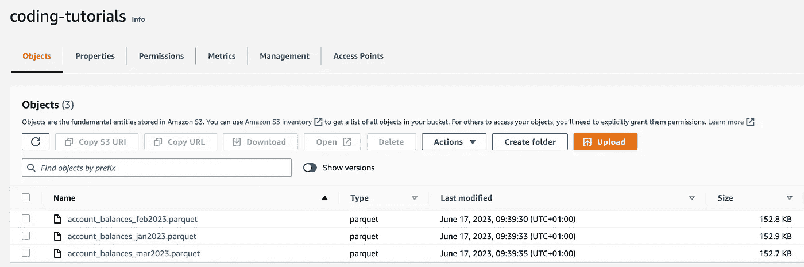
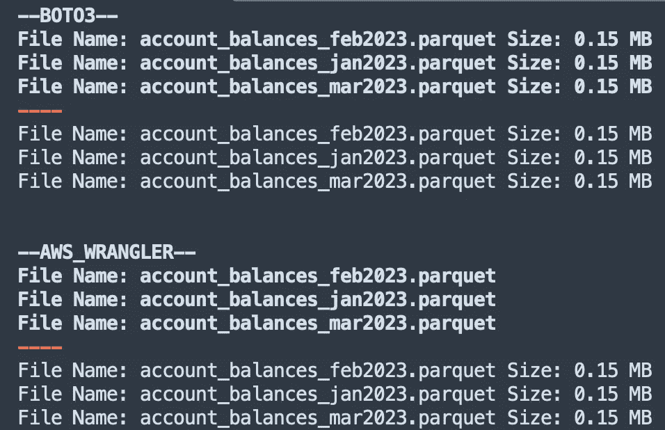
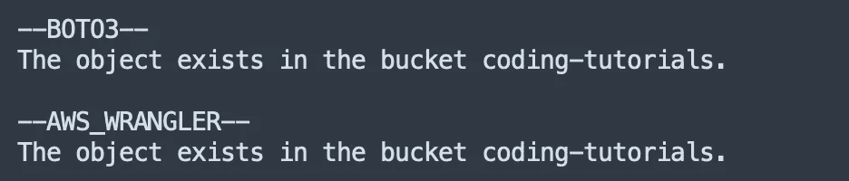
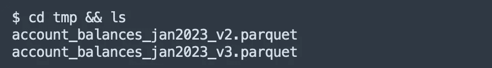
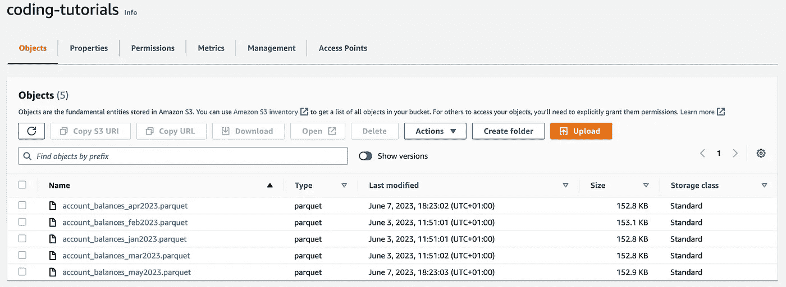
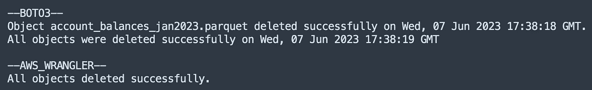
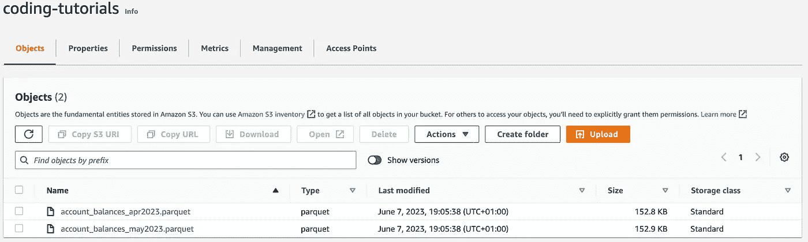
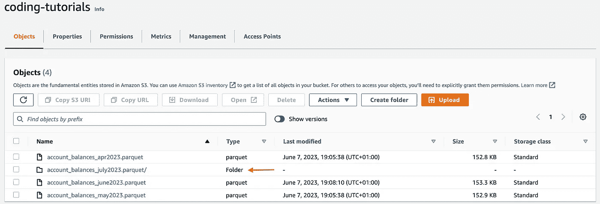
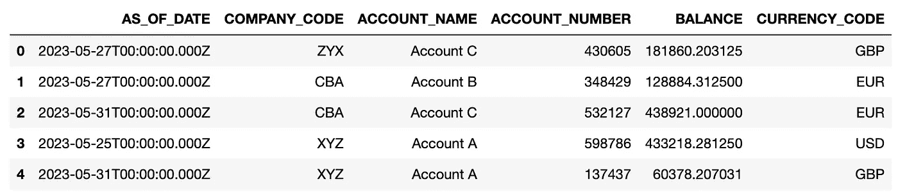

# Boto3 与 AWS Wrangler：使用 Python 简化 S3 操作

> 原文：[`towardsdatascience.com/boto3-vs-aws-wrangler-simplifying-s3-operations-with-python-596bdf021ef2`](https://towardsdatascience.com/boto3-vs-aws-wrangler-simplifying-s3-operations-with-python-596bdf021ef2)

## 针对 AWS S3 开发的比较分析

[](https://anbento4.medium.com/?source=post_page-----596bdf021ef2--------------------------------)[](https://towardsdatascience.com/?source=post_page-----596bdf021ef2--------------------------------) [Antonello Benedetto](https://anbento4.medium.com/?source=post_page-----596bdf021ef2--------------------------------)

·发表于 [Towards Data Science](https://towardsdatascience.com/?source=post_page-----596bdf021ef2--------------------------------) ·阅读时间 10 分钟·2023 年 6 月 20 日

--


图片由 [Hemerson Coelho](https://unsplash.com/photos/_HFP0eMwYWY) 提供，[来自 Unsplash](https://unsplash.com/)

# 按需课程 | 推荐

*一些读者联系我，询问是否有按需课程帮助你* ***成为*** *一个扎实的* ***数据工程师***。这些是我推荐的 3 个绝佳资源：

+   [**数据工程纳米学位 (UDACITY)**](https://imp.i115008.net/zaX10r)

+   [**使用 Apache Kafka 和 Apache Spark 进行数据流处理纳米学位 (UDACITY)**](https://imp.i115008.net/zaX10r)

+   [**大数据与 PySpark 的 Spark 和 Python (UDEMY)**](https://click.linksynergy.com/deeplink?id=533LxfDBSaM&mid=39197&murl=https%3A%2F%2Fwww.udemy.com%2Fcourse%2Fspark-and-python-for-big-data-with-pyspark%2F)

***还不是 Medium 会员？*** *考虑通过我的* [*推荐链接*](https://anbento4.medium.com/membership) *注册，低至每月 5 美元即可访问 Medium 的所有内容！*

# 介绍

在本教程中，我们将通过探索和比较两个强大的库：`boto3` 和 `awswrangler`，深入了解 AWS S3 的 Python 开发。

如果你曾经想过

> “哪个 Python 工具最适合与 AWS S3 存储桶交互？”
> 
> “如何以最有效的方式执行 S3 操作？”

那么你来对地方了。

的确，在这篇文章中，我们将涵盖一系列处理 AWS S3 存储桶的常见操作，其中包括：

1.  **列出对象**，

1.  **检查对象存在性**，

1.  **下载对象**，

1.  **上传对象**，

1.  **删除对象**，

1.  **写入对象**，

1.  **读取对象（标准方式或使用 SQL）**

通过比较这两个库，我们将识别它们的相似性、差异以及每个操作的最佳用例。到最后，你将清楚了解哪个库更适合特定的 S3 任务。

此外，对于那些读到最后的人，我们还将探讨如何利用`boto3`和`awswrangler`通过友好的 SQL 查询从 S3 读取数据。

所以让我们深入了解，发现与 AWS S3 交互的最佳工具，并学习如何使用这两个库高效地执行这些操作。

# 先决条件与数据

本教程中使用的软件包版本为：

+   `boto3==1.26.80`

+   `awswrangler==2.19.0`

此外，三个初始文件，包括[随机生成的](https://github.com/anbento0490/projects/blob/main/boto3_vs_awswrangler/generator.py)`account_balances`数据，已上传到名为`coding-tutorials`的 S3 桶中：



尽管你应该知道有多种方法可以与 S3 桶建立连接，但在这种情况下，我们将使用`boto3`的`setup_default_session()`：

```py
# CONNECTING TO S3 BUCKET
import os
import io
import boto3
import awswrangler as wr
import pandas as pd

boto3.setup_default_session(aws_access_key_id = 'your_access_key',
                            aws_secret_access_key = 'your_secret_access_key')

bucket = 'coding-tutorials'
```

这种方法很方便，因为一旦设置了会话，它可以被`boto3`和`awswrangler`共享，这意味着我们不需要再传递任何秘密信息。

# 比较分析

现在让我们比较一下`boto3`和`awswrangler`在执行一些常见操作时，找出最适合的工具。

包含以下代码的完整笔记本可以在[这个 GitHub 文件夹](https://github.com/anbento0490/projects/blob/main/boto3_vs_awswrangler/AWS%20Wrangler%20vs%20Boto3.ipynb)中找到。

## # 1 列出对象

列出对象可能是我们在探索新 S3 桶时应该执行的第一个操作，也是检查会话是否正确设置的简单方法。

使用`boto3`可以通过以下方式列出对象：

+   `boto3.client('s3').list_objects()`

+   `boto3.resource('s3').Bucket().objects.all()`

```py
print('--BOTO3--') 
# BOTO3 - Preferred Method
client = boto3.client('s3')

for obj in client.list_objects(Bucket=bucket)['Contents']:
    print('File Name:', obj['Key'], 'Size:', round(obj['Size']/ (1024*1024), 2), 'MB')

print('----') 
# BOTO3 - Alternative Method
resource = boto3.resource('s3')

for obj in resource.Bucket(bucket).objects.all():
    print('File Name:', obj.key, 'Size:', round(obj.size/ (1024*1024), 2), 'MB')
```

尽管`client`和`resource`类做得都不错，但`client`类应当优先选择，因为它更优雅，并提供了大量的[*易于访问*]低级元数据，作为嵌套的`JSON`（其中包括对象的`size`）。

另一方面，`awswrangler`仅提供了一个列出对象的方法：

+   `wr.s3.list_objects()`

作为一种高级方法，这不会返回任何*低级*的对象元数据，因此要找到文件的`size`，我们需要调用：

+   `wr.s3.size_objects`

```py
print('--AWS_WRANGLER--') 
# AWS WRANGLER

for obj in wr.s3.list_objects("s3://coding-tutorials/"):
    print('File Name:', obj.replace('s3://coding-tutorials/', ''))

print('----') 
for obj, size in wr.s3.size_objects("s3://coding-tutorials/").items():
    print('File Name:', obj.replace('s3://coding-tutorials/', '') , 'Size:', round(size/ (1024*1024), 2), 'MB')
```

上述代码返回：



## 比较 → Boto3 胜出

尽管`awswrangler`使用起来更为直观，但在列出 S3 对象时，`boto3`胜出。实际上，其底层实现意味着可以使用其类检索更多的对象元数据。这些信息在以编程方式访问 S3 桶时非常有用。

## # 2 检查对象存在性

当我们希望触发附加操作时，检查对象的存在性是必要的，这些操作是基于对象是否已经存在于 S3 中。

使用 `boto3` 可以通过以下方式执行这些检查：

+   `boto3.client('s3').head_object()`

```py
object_key = 'account_balances_jan2023.parquet'

# BOTO3
print('--BOTO3--') 
client = boto3.client('s3')
try:
    client.head_object(Bucket=bucket, Key = object_key)
    print(f"The object exists in the bucket {bucket}.")
except client.exceptions.NoSuchKey:
    print(f"The object does not exist in the bucket {bucket}.")
```

相反，`awswrangler` 提供了一个专用的方法：

+   `wr.s3.does_object_exist()`

```py
# AWS WRANGLER
print('--AWS_WRANGLER--') 
try:
    wr.s3.does_object_exist(f's3://{bucket}/{object_key}')
    print(f"The object exists in the bucket {bucket}.")
except:
    print(f"The object does not exist in the bucket {bucket}.")
```

上述代码返回：



## 比较 → AWSWrangler 胜出

让我们承认：`boto3` 的方法名 [`head_object()`] 并不是那么直观。

另外，拥有专用方法无疑是 `awswrangler` 在这场比赛中的优势。

## # 3 D**ownloading Objects**

使用以下方法，在本地下载对象在 `boto3` 和 `awswrangler` 中都非常简单：

+   `boto3.client('s3').download_file()` 或

+   `wr.s3.download()`

唯一的区别是 `download_file()` 需要 `bucket`、`object_key` 和 `local_file` 作为输入变量，而 `download()` 只需要 S3 `path` 和 `local_file`：

```py
object_key = 'account_balances_jan2023.parquet'

# BOTO3
client = boto3.client('s3')
client.download_file(bucket, object_key, 'tmp/account_balances_jan2023_v2.parquet')

# AWS WRANGLER
wr.s3.download(path=f's3://{bucket}/{object_key}', local_file='tmp/account_balances_jan2023_v3.parquet')
```

执行代码时，确实会将同一个对象的两个版本下载到本地的 `tmp/` 文件夹中：



## 比较 → 平局

在下载文件方面，我们可以认为两个库是等效的，因此我们称其为平局。

## # 4 U**ploading Objects**

上传本地环境中的文件到 S3 时，同样的推理适用。可以使用的方法有：

+   `boto3.client('s3').upload_file()` 或

+   `wr.s3.upload()`

```py
object_key_1 = 'account_balances_apr2023.parquet'
object_key_2 = 'account_balances_may2023.parquet'

file_path_1 = os.path.dirname(os.path.realpath(object_key_1)) + '/' + object_key_1
file_path_2 = os.path.dirname(os.path.realpath(object_key_2)) + '/' + object_key_2

# BOTO3
client = boto3.client('s3')
client.upload_file(file_path_1, bucket, object_key_1)

# AWS WRANGLER
wr.s3.upload(local_file=file_path_2, path=f's3://{bucket}/{object_key_2}')
```

执行代码，将两个新的 `account_balances` 对象（*2023 年 4 月和 5 月*）上传到 `coding-tutorials` 存储桶：



## 比较 → 平局

这仍然是平局。到目前为止，这两个库之间完全平等！

## # 5 D**eleting Objects**

现在假设我们希望删除以下对象：

```py
#SINGLE OBJECT
object_key = ‘account_balances_jan2023.parquet’

#MULTIPLE OBJECTS
object_keys = [‘account_balances_jan2023.parquet’, 
               ‘account_balances_feb2023.parquet’, 
               ‘account_balances_mar2023.parquet’]
```

`boto3` 允许通过以下方法逐个或批量删除对象：

+   `boto3.client('s3').delete_object()`

+   `boto3.client('s3').delete_objects()`

两种方法都返回一个包含 `ResponseMetadata` 的 `response`，可以用来验证对象是否成功删除。例如：

+   在删除单个对象时，`HTTPStatusCode==204` 表示操作已成功完成（*如果 S3 存储桶中找到对象*）；

+   在删除多个对象时，会返回一个包含成功删除项目名称的 `Deleted` 列表。

```py
# BOTO3
print('--BOTO3--')
client = boto3.client('s3')

# Delete Single object
response = client.delete_object(Bucket=bucket, Key=object_key)
deletion_date = response['ResponseMetadata']['HTTPHeaders']['date']

if response['ResponseMetadata']['HTTPStatusCode'] == 204:
    print(f'Object {object_key} deleted successfully on {deletion_date}.')
else:
    print(f'Object could not be deleted.')

# Delete Multiple Objects
objects = [{'Key': key} for key in object_keys]

response = client.delete_objects(Bucket=bucket, Delete={'Objects': objects})
deletion_date = response['ResponseMetadata']['HTTPHeaders']['date']

if len(object_keys) == len(response['Deleted']):
    print(f'All objects were deleted successfully on {deletion_date}')
else:
    print(f'Object could not be deleted.')
```

另一方面，`awswrangler` 提供了一个可以用于单个和批量删除的方法：

+   `wr.s3.delete_objects()`

由于 `object_keys` 可以作为 `list_comprehension` 递归传递给方法，而不需要像以前那样先转换成字典，使用这种语法确实令人愉快。

```py
# AWS WRANGLER
print('--AWS_WRANGLER--')
# Delete Single object
wr.s3.delete_objects(path=f's3://{bucket}/{object_key}')

# Delete Multiple Objects
try:
    wr.s3.delete_objects(path=[f's3://{bucket}/{key}' for key in object_keys])
    print('All objects deleted successfully.')
except:
    print(f'Objects could not be deleted.')
```

执行上述代码，会删除 S3 中的对象，然后返回：



## 比较 → Boto3 胜出

这有点棘手：`awswrangler`在删除多个对象时有更简单的语法，因为我们可以直接将完整的列表传递给该方法。

然而，`boto3`在`response`中返回大量有用的日志信息，这在编程删除对象时非常有用。

因为在生产环境中，低级别的元数据总比几乎没有元数据要好，`boto3`赢得了这场挑战，现在领先 2–1。

## # 6 写入对象

在将文件写入 S3 时，`boto3`甚至没有提供一个*开箱即用*的方法来执行这些操作。

例如，如果我们想用`boto3`创建一个新的`parquet`文件，我们首先需要将对象保存到本地磁盘（*使用*`pandas`的`to_parquet()` *方法*），然后使用`upload_fileobj()`方法将其上传到 S3。

与`upload_file()`（*在第 4 点中探讨*）不同，`upload_fileobj()`方法 [是一种托管传输，将在必要时在多个线程中执行分块上传](https://boto3.amazonaws.com/v1/documentation/api/latest/reference/services/s3/client/upload_fileobj.html)：

```py
object_key_1 = 'account_balances_june2023.parquet'

# RUN THE GENERATOR.PY SCRIPT

df.to_parquet(object_key_1)

# BOTO3
client = boto3.client('s3')

# Upload the Parquet file to S3
with open(object_key_1, 'rb') as file:
    client.upload_fileobj(file, bucket, object_key_1)
```

另一方面，`awswrangler`库的主要优点之一（*在与`pandas`一起使用时*）是它可以直接将对象写入 S3 桶（*而无需将其保存到本地磁盘*），这既优雅又高效。

此外，`awswrangler` [提供了极大的灵活性](https://aws-sdk-pandas.readthedocs.io/en/stable/stubs/awswrangler.s3.to_parquet.html)，允许用户：

+   应用特定的压缩算法，如`snappy`、`gzip`和`zstd`；

+   通过`mode`参数在`dataset = True`时`append`到或`overwrite`现有文件；

+   通过`partitions_col`参数指定一个或多个分区列。

```py
object_key_2 = 'account_balances_july2023.parquet'

# AWS WRANGLER   
wr.s3.to_parquet(df=df, 
                 path=f's3://{bucket}/{object_key_2}', 
                 compression = 'gzip', 
                 partition_cols = ['COMPANY_CODE'], 
                 dataset=True)
```

一旦执行，上述代码将`account_balances_june2023`写入为一个单独的`parquet`文件，并将`account_balances_july2023`写入为一个包含四个文件的文件夹，这些文件已按`COMPANY_CODE`分区：



## 比较 → AWSWrangler 获胜

如果使用`pandas`是一个选项，`awswrangler`在将文件写入 S3 时提供了更高级的操作集，特别是与`boto3`相比，在这种情况下，`boto3`并不是最好的工具。

## # 7.1 读取对象（Python）

在尝试使用`boto3`从 S3 读取对象时，同样的推理适用：由于该库没有内置的读取方法，我们能做的最佳选择是执行 API 调用（`get_object()`），读取`response`的`Body`，然后将`parquet_object`传递给`pandas`。

请注意，`pd.read_parquet()`方法期望一个*类文件*对象作为输入，这就是为什么我们需要将从`parquet_object`读取的内容作为二进制流传递。

实际上，通过使用`io.BytesIO()`，我们在内存中创建了一个临时的*类文件*对象，从而避免了在读取之前将 Parquet 文件保存到本地。这反过来提高了性能，特别是在处理大型文件时：

```py
object_key = 'account_balances_may2023.parquet'

# BOTO3
client = boto3.client('s3')

# Read the Parquet file
response = client.get_object(Bucket=bucket, Key=object_key)
parquet_object = response['Body'].read()

df = pd.read_parquet(io.BytesIO(parquet_object))
df.head()
```

正如预期的那样，`awswrangler` 在读取 S3 对象方面表现出色，返回一个 `pandas` df 作为输出。

它支持多种输入格式，如 `csv`、`json`、`parquet` 和最近的 `delta` 表。此外，传递 `chunked` 参数可以以 *内存友好的* 方式读取对象：

```py
# AWS WRANGLER
df = wr.s3.read_parquet(path=f's3://{bucket}/{object_key}')
df.head()

# wr.s3.read_csv()
# wr.s3.read_json()
# wr.s3.read_parquet_table()
# wr.s3.read_deltalake()
```

执行上述代码会返回一个包含 5 月数据的 `pandas` df：



## 比较 → AWSWrangler 胜出

是的，有办法绕过 `boto3` 中缺乏适当方法的问题。然而，`awswrangler` 是一个旨在高效读取 S3 对象的库，因此它也赢得了这个挑战。

## # 7.2 读取对象（SQL）

读到这里的读者值得一个奖励，那就是使用纯 SQL 从 S3 读取对象。

假设我们希望使用下面的 `query` 从 `account_balances_may2023.parquet` 对象中获取数据（*通过* `AS_OF_DATE` *进行数据过滤*）：

```py
object_key = 'account_balances_may2023.parquet'
query = """SELECT * FROM s3object s 
           WHERE AS_OF_DATE > CAST('2023-05-13T' AS TIMESTAMP)"""
```

在 `boto3` 中，可以通过 `select_object_content()` 方法实现。注意，我们还需要指定 `inputSerialization` 和 `OutputSerialization` 格式：

```py
# BOTO3
client = boto3.client('s3')

resp = client.select_object_content(
        Bucket=bucket,
        Key=object_key,
        Expression= query,
        ExpressionType='SQL',
        InputSerialization={"Parquet": {}},
        OutputSerialization={'JSON': {}},
)

records = []

# Process the response
for event in resp['Payload']:
    if 'Records' in event:
        records.append(event['Records']['Payload'].decode('utf-8'))

# Concatenate the JSON records into a single string
json_string = ''.join(records)

# Load the JSON data into a Pandas DataFrame
df = pd.read_json(json_string, lines=True)

# Print the DataFrame
df.head() 
```

如果使用 `pandas` df 是一个选项，那么 `awswrangler` 还提供了一个非常方便的 `select_query()` 方法，只需最少的代码：

```py
# AWS WRANGLER
df = wr.s3.select_query(
        sql=query,
        path=f's3://{bucket}/{object_key}',
        input_serialization="Parquet",
        input_serialization_params={}
)
df.head()
```

对于这两个库，返回的 df 将如下所示：


# 结论

在本教程中，我们探讨了 **7 种常见操作**，这些操作可以在 S3 存储桶上执行，并对 `boto3` 和 `awswrangler` 库进行了比较分析。

两种方法都允许我们与 S3 存储桶进行交互，但主要区别在于 `boto3` 客户端提供了对 AWS 服务的低级访问，而 `awswrangler` 提供了一个简化的、更高级的数据工程任务接口。

总体而言，`awswrangler` 以 3 分（*检查对象是否存在*、*写入对象*、*读取对象*）战胜了 `boto3` 的 2 分（*列出对象*、*删除对象*）。*上传/下载对象* 类别平局，因此没有得分。

尽管结果如上，但事实是这两个库在可以互换使用时表现最佳，能够在它们所设计的任务中表现出色。

## 资源

+   [AWS Wrangler 文档](https://aws-sdk-pandas.readthedocs.io/en/stable/index.html)

+   [Boto3 S3 客户端文档](https://boto3.amazonaws.com/v1/documentation/api/latest/reference/services/s3.html)

*除非另有说明，所有图片均由作者提供。*
