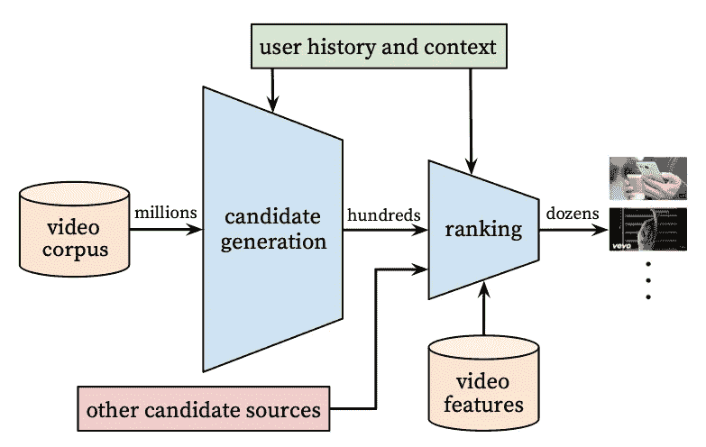

# 解构 YouTube 的推荐算法

> 原文：[`towardsdatascience.com/breaking-down-youtubes-recommendation-algorithm-94aa3aa066c6`](https://towardsdatascience.com/breaking-down-youtubes-recommendation-algorithm-94aa3aa066c6)

## 打开“窍门箱”，让现代推荐系统得以运作

 [Samuel Flender](https://medium.com/@samuel.flender?source=post_page-----94aa3aa066c6--------------------------------)

·发表在[Towards Data Science](https://towardsdatascience.com/?source=post_page-----94aa3aa066c6--------------------------------) ·阅读时间 7 分钟·2023 年 4 月 17 日

--

(Logo 设计 [Eyestetix Studio](https://unsplash.com/photos/LskCjwwJBEQ)，背景设计 [Dan Cristian Pădureț](https://unsplash.com/photos/h3kuhYUCE9A))

推荐系统已成为我们时代最普遍的工业机器学习应用之一，但关于它们在实践中如何运作的出版物却很少。

一个显著的例外是 Paul Covington 的论文“[深度神经网络用于 YouTube 推荐](https://research.google/pubs/pub45530/)”，其中充满了关于 YouTube 深度学习驱动的推荐算法的许多实际见解和学习，提供了一个罕见的视角，不仅揭示了现代工业推荐系统的内部工作，还揭示了今天的机器学习工程师正在尝试解决的问题。

如果你想深入了解现代推荐系统，为机器学习设计面试做准备，或者只是对 YouTube 如何吸引用户感到好奇，请继续阅读。在这篇文章中，我们将探讨论文中的 8 个关键见解，帮助解释 YouTube（以及任何现代推荐系统）的成功。

让我们开始吧。

## 1 — 推荐 = 候选生成 + 排序

YouTube 的推荐系统分为两个阶段：候选生成阶段，将数十亿的视频筛选到几百个，并且排序阶段，进一步缩小和排序最终展示给用户的候选视频。

从技术上讲，这两个阶段都包含一个双塔神经网络——一种具有两个分支分别处理用户 ID 和视频 ID 的特殊架构——但它们的训练目标不同：

+   对于候选生成模型，学习问题被表述为一个极端多类分类问题：在所有现有视频中，预测用户互动的视频。

+   对于排名模型，学习问题被表述为一个（加权的）逻辑回归问题：给定一个用户/视频对，预测用户是否与该视频互动。

这一设计选择的动机是将找到最佳内容的问题分解为召回优化和精度优化：候选生成优化召回，即确保我们捕捉到所有相关内容，而排名优化精度，即确保我们首先展示最佳内容。以这种方式分解问题是使推荐系统能够在数十亿用户和视频的规模上运行的关键。

YouTube 的两阶段推荐漏斗。来自 Covington 2016，[YouTube 推荐的深度神经网络](https://research.google/pubs/pub45530/)

## 2 — 隐式标签比显式标签效果更好

显式用户反馈，如点赞、分享或评论，非常稀少：在所有观看特定视频的用户中，只有少数人会留下显式反馈。因此，仅根据点赞训练的模型会留下大量信息未被利用。

隐式标签，如用户点击和观看时间，稍微有些噪声——用户可能会偶然点击——但数量级上要多得多。在 YouTube 的规模下，标签数量优于标签质量，因此在他们的模型中使用隐式反馈作为训练目标效果更好。

## 3 — 观看顺序很重要

特定用户的观看历史形成的序列不是随机的，而是包含具有不对称共同观看概率的特定模式。例如，在观看了两个来自同一创作者的视频之后，用户很可能会观看来自该创作者的另一个视频。一个简单地学习预测一个展示的视频是否会被观看的模型，忽略了用户最近的观看历史表现不好：同样，它也留下了信息未被利用。

相反，YouTube 的模型通过给定用户最新的观看（和搜索）历史来学习预测下一个观看的视频。从技术上讲，它通过将用户最新的 50 个观看视频和 50 个搜索查询作为特征输入到模型中来实现这一点。

## 4 — 排名模型使用加权逻辑回归进行训练

正面训练示例（点击的展示）根据其观察到的观看时间进行加权，而负面训练示例（没有点击的展示）则收到单位权重。这个加权方案的目的是减少点击诱饵内容的权重，增加导致更有意义和更长时间参与的内容的权重。

从数学上讲，这样的加权逻辑回归模型学到的赔率大致等于预期观看时间。在推理时，我们可以通过应用指数函数将预测的赔率转换为观看时间。能够预测观看时间可以得出下一个关键洞察：

## 5 — 通过预测观看时间排名优于通过点击率排名

这是因为点击率排名会促进低观看时间的点击诱饵内容：用户点击但很快返回。通过预测观看时间进行排名可以降低点击诱饵内容的排名，从而提供更具吸引力的推荐。

## 6 — 多样的特征集是高模型性能的关键

深度学习相对于线性或树模型的优势在于它可以处理多样的输入信号。YouTube 的模型会考虑：

+   观看历史：用户最近观看了哪些视频？

+   搜索历史：用户最近搜索了哪些关键词？

+   人口统计特征，例如用户性别、年龄、地理位置和设备，这些特征为“冷启动”用户，即没有历史记录的用户，提供了先验信息。

确实，特征多样性是实现高模型性能的关键：作者们展示了，使用所有这些特征训练的模型相较于仅使用观看历史训练的模型，持出 MAP 从 6%提高到 13%。

YouTube 的排名神经网络模型接受多样的特征集。从 Covington 2016，[Deep Neural Networks for YouTube Recommendations](https://research.google/pubs/pub45530/)

## 7 — 由于“示例年龄”特征，内容保持新鲜

ML 系统往往对过去有偏见，因为它们是在历史数据上训练的。对于 YouTube 来说，这是一个问题，因为用户通常更喜欢最近上传的“新鲜”内容，而不是很久以前上传的内容。

为了修复这种“过去偏见”，YouTube 将训练示例的年龄作为模型中的一个特征，并在推理时将其设置为 0，以反映模型在训练窗口的最后阶段进行预测。例如，如果训练数据包含 30 天的数据窗口，这一“示例年龄”特征会从 31（训练数据中的第一天）变化到 1（最后一天）。

作者们展示了引入这一特性使得模型更倾向于推荐新内容，这正是 YouTube 所希望的。

## 8 — 稀疏特征被编码为低维嵌入

YouTube 的排名模型使用了大量高维度（“稀疏”）的分类特征，例如

+   视频 ID 和用户 ID，

+   分词搜索查询，

+   用户最近观看的最后 50 个视频，或

+   启动当前观看会话的“种子”视频。

这些稀疏特征被独热编码，并映射到在模型训练过程中学习的 32 维嵌入中，然后作为嵌入表存储用于推理。

为了限制嵌入表所造成的内存占用，ID 空间被截断，只包括最常见的 ID。例如，如果一个视频在训练期间只被观看过一次，那么它不值得在嵌入表中占有一席之地，因此会被视为与从未观看过的视频相同。

另一个值得注意的技巧是，相同 ID 空间内的稀疏特征共享相同的基础嵌入。例如，存在一个全球性的、用于许多不同特征的单一视频 ID 嵌入，例如印象的视频 ID、用户最近观看的视频 ID 或当前会话的种子视频 ID。以这种方式共享嵌入有 3 个好处：

1.  它节省了内存，因为需要存储的嵌入表更少，

1.  它加快了模型训练，因为需要学习的参数更少，并且

1.  它提高了泛化能力，因为它使模型能够获得有关每个 ID 的更多上下文。

## 附录：技巧包

总结来说，YouTube 的推荐系统没有真正让它特别的单一因素。它是一个“技巧包”，每个技巧解决一个特定的问题：

+   2 阶段漏斗设计解决了可扩展性问题，

+   使用加权逻辑回归和按预期观看时间排序解决了点击诱饵问题，

+   添加“示例年龄”特征解决了过去偏见问题。

+   添加人口统计特征解决了冷启动问题，

+   预测“下一次观看”（而不是随机观看）解决了不对称共同观看概率问题，

+   在具有相同 ID 的类别特征之间共享嵌入解决了有限内存问题，

等等。

这个技巧包不仅为现代推荐系统的内部运作提供了极大的洞察力，也展示了现代 ML 工程师的工作：我们解决问题以使模型更好。最优秀的 ML 工程师是那些随着时间积累了最佳技巧包的人。

最后，Covington 的论文现在已经好几年了，肯定有些技巧已经被更新更好的技巧所取代。有编码稀疏特征的新技巧，也有[去偏排名模型的新技巧](https://medium.com/towards-data-science/biases-in-recommender-systems-top-challenges-and-recent-breakthroughs-edcda59d30bf)。这是工业 ML 应用程序固有的另一个方面：随着新突破的出现，我们的模型不断演变。

ML 工程师永远不会“完成”。

*想扩展你的个人 ML “技巧包”？想深入了解现代工业 ML 应用背后的原理？查看我的电子书，* [*《地面上的机器学习：现实世界 ML 应用的设计与操作》*](https://samflender.gumroad.com/l/mlontheground)*。*
