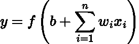
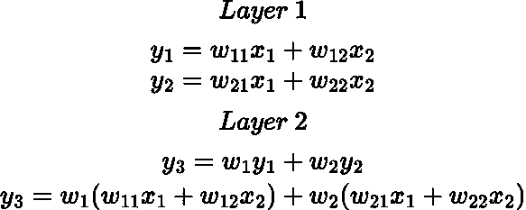
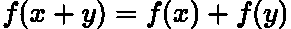
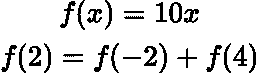
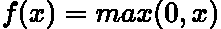
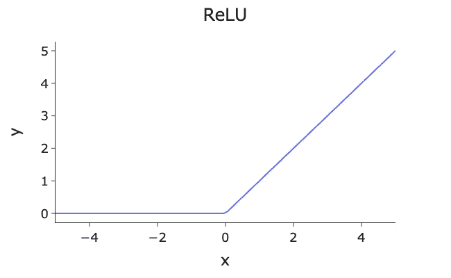
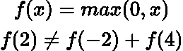
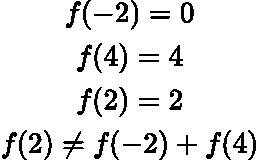

# 用 ReLU 打破线性

> 原文：[`towardsdatascience.com/breaking-linearity-with-relu-d2cfa7ebf264`](https://towardsdatascience.com/breaking-linearity-with-relu-d2cfa7ebf264)

## 解释 ReLU 激活函数如何以及为何是非线性的

 [Egor Howell](https://medium.com/@egorhowell?source=post_page-----d2cfa7ebf264--------------------------------)

·发表于 [数据科学前沿](https://towardsdatascience.com/?source=post_page-----d2cfa7ebf264--------------------------------) ·阅读时间 4 分钟·2023 年 3 月 1 日

--

图片由 [Alina Grubnyak](https://unsplash.com/@alinnnaaaa?utm_source=medium&utm_medium=referral) 提供，来源于 [Unsplash](https://unsplash.com/?utm_source=medium&utm_medium=referral)

# 介绍

[***神经网络***](https://en.wikipedia.org/wiki/Artificial_neural_network) 和 [***深度学习***](https://en.wikipedia.org/wiki/Deep_learning) 是人们转行进入数据科学的最受欢迎的原因之一。然而，这种兴奋可能会导致忽视神经网络的核心概念。在这篇文章中，我想讨论神经网络的一个关键特性，我认为大多数从业者应该了解，以充分理解其内部运作。

# 我们为什么需要激活函数？

[***激活函数***](https://en.wikipedia.org/wiki/Activation_function) 在数据科学和机器学习中无处不在。它们通常指的是应用于神经网络中神经元的 [***线性***](https://en.wikipedia.org/wiki/Linear_equation) 输入的变换***：***

作者在 LaTeX 中的方程。

其中 ***f*** 是激活函数，***y*** 是输出，***b*** 是偏置，***w_i*** 和 ***x_i*** 是 [***权重***](https://en.wikipedia.org/wiki/Weighting) 和它们对应的特征值。

但是，我们为什么需要激活函数呢？

简单的答案是，它们使我们能够建模复杂的模式，且通过使神经网络变得 [***非线性***](https://en.wikipedia.org/wiki/Nonlinear_system) 来实现。如果网络中没有非线性激活函数，那么整个模型就会变成一个 [***线性回归***](https://en.wikipedia.org/wiki/Linear_regression) 模型！

> 非线性是指输入的变化与相应输出的变化不成比例。

例如，考虑一个前馈的两层神经网络，中间层有两个神经元（忽略偏置项）：

作者用 LaTeX 写的方程。

我们已经成功将我们的两层网络简化为单层网络！上述推导中的最终方程仅仅是一个具有特征 ***x_1*** 和 ***x_2*** 及其对应系数的线性回归模型***。***

因此，我们的“深度神经网络”将会简化为单层，变成传统的线性回归模型！这不好，因为神经网络将无法对数据建模或拟合复杂函数。

> 神经网络能够计算任何函数，这要归功于所谓的 [**通用近似定理**](https://en.wikipedia.org/wiki/Universal_approximation_theorem)。如果你想了解更多，可以查看[这篇文章](http://mcneela.github.io/machine_learning/2017/03/21/Universal-Approximation-Theorem.html)！

线性函数的正式数学定义是：

作者用 LaTeX 写的方程。

这是一个非常简单的例子：

作者用 LaTeX 写的方程。

所以函数 ***f(x) = 10x*** 是线性的！

> 注意，如果我们在上面的方程中添加一个偏置项，它就不再是线性函数，而是一个 [**仿射函数**](https://en.wikipedia.org/wiki/Affine_transformation)。请参阅[这个状态交换讨论](https://math.stackexchange.com/questions/275310/what-is-the-difference-between-linear-and-affine-function)讨论为什么会这样。

# ReLU

[***整流线性单元 (ReLU)***](https://en.wikipedia.org/wiki/Rectifier_%28neural_networks%29) 是最流行的激活函数，因为它计算高效，并且解决了[***梯度消失问题***](https://en.wikipedia.org/wiki/Vanishing_gradient_problem)。

数学上，该函数表达为：

作者用 LaTeX 写的方程。

我们可以用 Python 进行图形化展示：

由作者用 Python 生成的图。

# 为什么 ReLU 是非线性的？

ReLU 函数可能看起来是线性的，因为有两条直线。实际上，它是[***分段线性***](https://en.wikipedia.org/wiki/Piecewise_linear_function)的。然而，正是这两条不同的直线使其成为非线性。

我们可以通过执行与上述相同的示例但使用 ReLU 函数来证明它是非线性的：

作者用 LaTeX 写的方程。

让我们分解一下：

作者用 LaTeX 写的方程。

> 因此，ReLU 是非线性的！
> 
> 我已经在[这里](https://www.linkedin.com/pulse/rectified-linear-unit-non-linear-mukesh-manral/?trk=pulse-article_more-articles_related-content-card)链接了一篇很好的文章，展示了如何使用 ReLU 创建任何函数。

# 总结和进一步的思考

非线性在神经网络中是至关重要的，因为它允许算法推断数据中的复杂模式。非线性是通过激活函数来实现的，其中最著名的是 ReLU，它在计算效率和解决训练神经网络时已知的问题方面表现优异。ReLU 函数是分段线性的，这就是它如上所述在数学上表现为非线性的原因。

完整的代码可以在我的 GitHub 上找到：

 [## Medium-Articles/relu.py at main · egorhowell/Medium-Articles

### 你现在不能执行该操作。你在另一个标签页或窗口中登录了。你在另一个标签页或窗口中登出了……

github.com](https://github.com/egorhowell/Medium-Articles/blob/main/Data%20Science%20Basics/relu.py?source=post_page-----d2cfa7ebf264--------------------------------)

# 另一个事项！

我有一个免费的通讯，[**Dishing the Data**](https://dishingthedata.substack.com/)，在其中我每周分享成为更好的数据科学家的技巧。没有“虚浮内容”或“点击诱饵”，只有来自实际数据科学家的纯粹可操作的见解。

 [## Dishing The Data | Egor Howell | Substack

### 如何成为更好的数据科学家。点击阅读《Dishing The Data》，作者为 Egor Howell，这是一个 Substack 出版物……

[newsletter.egorhowell.com](https://newsletter.egorhowell.com/?source=post_page-----d2cfa7ebf264--------------------------------)

# 与我联系！

+   [**YouTube**](https://www.youtube.com/@egorhowell)

+   [**LinkedIn**](https://www.linkedin.com/in/egor-howell-092a721b3/)

+   [**Twitter**](https://twitter.com/EgorHowell)

+   [**GitHub**](https://github.com/egorhowell)
