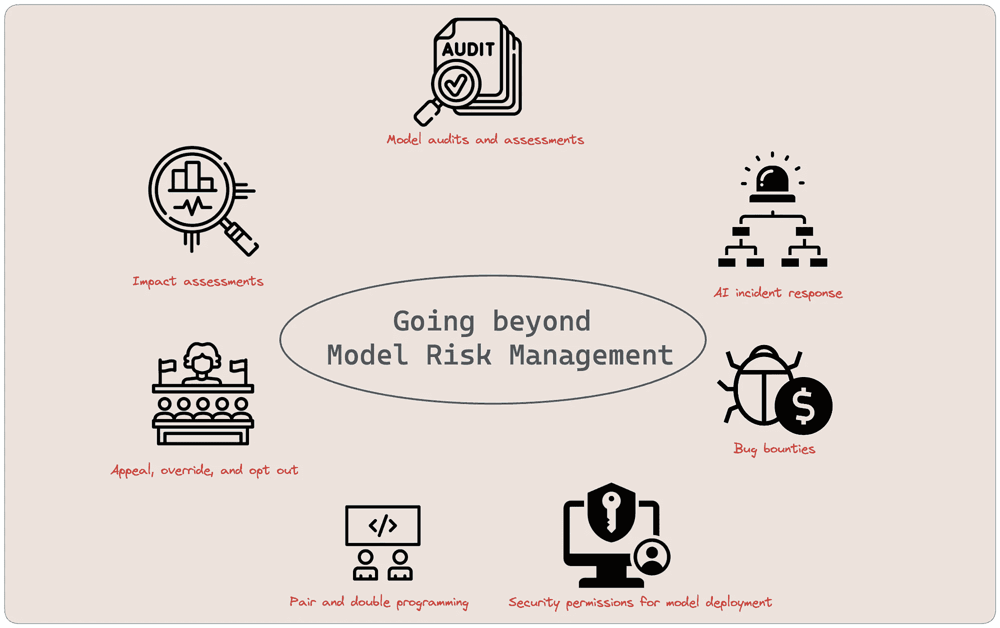
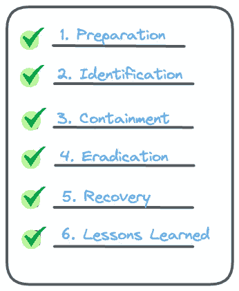
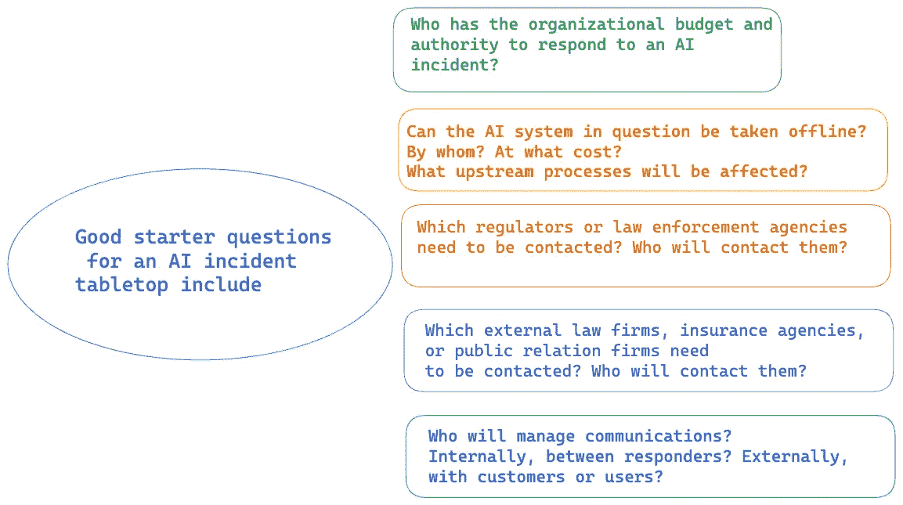
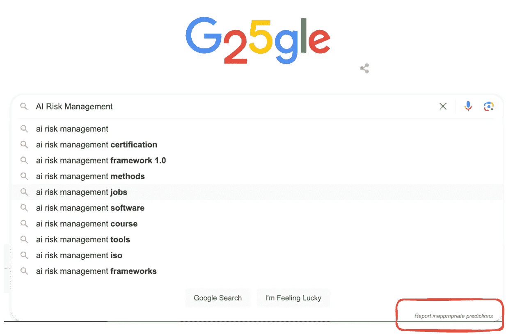
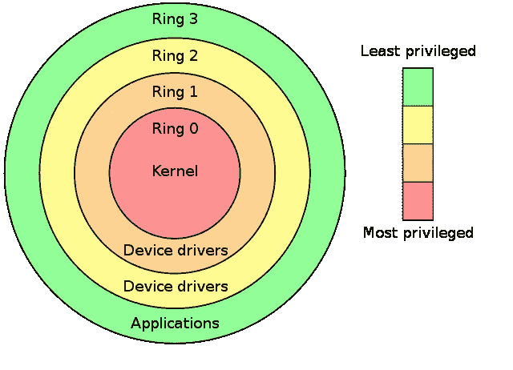
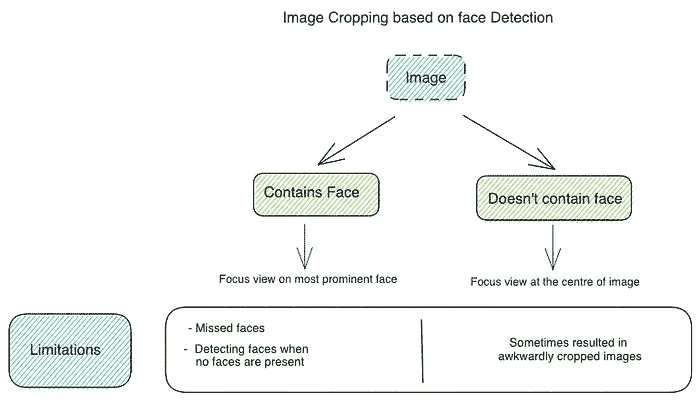

# 跨领域桥接：将金融、隐私和软件最佳实践融入机器学习风险管理

> 原文：[`towardsdatascience.com/bridging-domains-infusing-financial-privacy-and-software-best-practices-into-ml-risk-management-3de1fa1e6dd2`](https://towardsdatascience.com/bridging-domains-infusing-financial-privacy-and-software-best-practices-into-ml-risk-management-3de1fa1e6dd2)

## 负责任的人工智能

## *理解超越传统模型风险管理的策略*

 [Parul Pandey](https://pandeyparul.medium.com/?source=post_page-----3de1fa1e6dd2--------------------------------)

·发表于 [Towards Data Science](https://towardsdatascience.com/?source=post_page-----3de1fa1e6dd2--------------------------------) ·阅读时间 10 分钟·2023 年 10 月 10 日

--

作者图像 | 图标：[Flaticon](https://www.flaticon.com/)（个人及商业用途免费）

> “航空法则是以血的代价写成的。我们不应当用人工智能再现这种方法论” — [Siméon Campos](https://oecd.ai/en/community/simeon-campos)

在 2018 年，彭博社的报道“[***Zillow 的算法驱动的购买狂潮使其房屋翻转实验注定失败***](https://www.bloomberg.com/news/articles/2021-11-08/zillow-z-home-flipping-experiment-doomed-by-tech-algorithms)”引起了广泛关注。报道概述了 Zillow 大胆进入**iBuying**领域，寄希望于其基于机器学习的**Zestimate**算法来革新房屋翻转的盈利模式。尽管开始时结构安排得很周密，聘请了本地房地产专家来验证算法定价，Zillow 还是转向完全算法驱动的方法以追求更快的报价。然而，这一举动并没有取得预期的效果。

照片由 [Tierra Mallorca](https://unsplash.com/@tierramallorca?utm_source=medium&utm_medium=referral) 提供，来源于 [Unsplash](https://unsplash.com/?utm_source=medium&utm_medium=referral)

Zestimate 试图适应 2021 年房地产市场的快速通货膨胀，这促使 Zillow 采取行动以增强其报价的吸引力。该公司开始了一场雄心勃勃的购房狂潮，报告称每季度收购多达 10,000 套房产。然而，人力资源难以跟上这些收购的庞大规模和速度，这一挑战因疫情的同时爆发而加剧。在面临不断增加的困难，包括未售出的房产积压时，Zillow 决定在 2021 年 10 月暂停其报价。随后几个月，房产以亏损价被转售，导致超过 5 亿美元的大规模库存减记。

> *除了其失败的投资所造成的巨大财务损失，Zillow 宣布将裁员约 2,000 名员工——公司的四分之一。*

我们从一个相当不幸的事件开始讨论，因为 Zillow 的 iBuying 风险投资的崩溃嵌入了一个复杂的原因框架中。尽管无法将这一事件与 2020 年全球大流行从住房市场中剥离开来，但它确实为深入分析铺平了道路。在本文中，我们将以此为例，揭示我们系列中讨论的治理和风险管理原则如何可能避免未来类似的不幸事件。

## ***在继续阅读之前***

> 在继续之前，请注意这是我们 AI 风险管理系列的第三篇文章。建议阅读前两篇文章，以便全面理解。
> 
> • 第一篇文章展开了 **机器学习风险管理的文化能力**，探讨了在这一复杂领域中所需的人文维度。

/ ## 机器学习风险管理的文化能力

### 组织的文化是负责任 AI 的一个重要方面。

[towardsdatascience.com

> • 第二篇文章将重点转向 ML 系统背景下的另一个重要元素：**组织流程**。与我们一起踏上这段启发之旅，以更好地掌握 AI 和风险管理的交织领域。

/ ## 机器学习风险管理的组织流程

### 组织流程是 ML 系统可靠性的一个关键非技术性决定因素。

[towardsdatascience.com

# *超越模型风险管理*

在上一篇文章中，我们详细讨论了**机器学习风险管理（MRM）**如何构成一个全面的框架，以及一系列旨在识别、评估、缓解和监控与机器学习系统的开发、部署和操作相关的风险的程序。在这一部分，我们将探索超越传统模型风险管理的各种策略和实践，这些策略和实践在 ML 安全方面表现尤为出色。我们将从讨论 AI 事件响应开始。

## 📝AI 事件响应计划

Zillow 事件突显了 AI 失败的一个事件，展示了一个精心设计的算法如何无法跟上快速变化的房地产市场，导致重大财务和声誉损失。尽管经过最佳的模型训练和验证测试，但即便在[SR-11 指南](https://www.federalreserve.gov/supervisionreg/srletters/sr1107a1.pdf)中也提到，消除模型风险是不可能的，这突显了制定可靠事件响应计划的紧迫性。

**AI 事件计划**是一个预先制定的策略，旨在快速有效地解决 AI 问题，帮助组织迅速识别、遏制和消除 AI 事件，并防止代价高昂或危险的情况，这对较小或新兴的组织尤其重要。这是计算机安全中的一项受认可的做法，像[NIST](https://www.nist.gov/)和[SANS](https://www.sans.org/in_en/)等组织强调了它在管理机器学习和人工智能复杂性方面的重要性。与计算机事件响应一样，AI 事件计划分为六个明确的阶段，每个阶段都对降低 AI 风险至关重要。

人工智能事件计划的六个阶段 | 图片来源：作者

+   **阶段 1：准备**

为有效准备 AI 事件，组织应定义事件参数，分配响应预算，制定沟通计划，并实施技术保障措施。通过与关键人员进行桌面演练来模拟场景可以提高准备程度。

AI 事件准备阶段的起始问题 | 图片来源：作者

+   **阶段 2：识别**

识别涉及检测系统故障、攻击或滥用。它结合了一般安全方法和专门的 AI 监控，如检测概念漂移或算法歧视。一旦发现问题，将会提醒相关利益相关者，包括管理层。

+   **阶段 3：遏制**

控制指的是减轻事件造成的直接危害，目标是减少初始损害。事件可能会有蔓延的趋势，影响业务和客户的其他方面。解决这些问题的方法可能会根据其根本原因而有所不同，无论是外部攻击、内部错误还是 AI 系统的误用。在必要时，建议在控制阶段与公众进行沟通。

+   **第四阶段：根除**

根除意味着修复受影响的系统以停止问题。这可能通过阻止被攻击的系统以防止进一步的损害，或关闭故障的 AI 系统并暂时使用一个可信的、更简单的系统来实现。根除之后，事件不应再造成任何进一步的伤害。

+   **第五阶段：恢复**

恢复过程涉及修复受影响的系统、预防未来的问题，并且可能需要审查或改进技术程序，尤其是当问题是由于错误或恶意行为引起时。

+   **第六阶段：经验教训**

经验教训意味着根据在当前问题中有效和无效的措施，对我们对 AI 事件的响应进行更改或改进。这些改进可以涉及过程或使用的技术。

## 从 Zillow iBuying 事件中获得的经验：AI 事件响应的见解

在审查我们的 AI 事件响应计划后，让我们回到 Zillow iBuying 的事件中。我们能从这一章节中关于 Zillow iBuying 情况中获得什么见解呢？根据对此话题的公开报告，显然存在潜在的警示信号🚩。这些包括 Zillow 缺乏人工监督、对财务风险的评估不足，以及缺乏适当的治理结构。虽然关于 Zillow 的具体答案仍不确定，但这突显了从这一案例中提取有价值的经验以提高我们对 AI 相关挑战的准备和响应的重要性，包括：

+   ***经验教训 1：与领域专家验证。***

+   ***经验教训 2：预见失败模式。***

+   ***经验教训 3：治理至关重要。***

+   ***经验教训 4：AI 事件可能会迅速扩大。***

+   ***经验教训 5：新兴技术总是伴随风险。***

# 提升风险管理的额外实践

除了上述讨论的 AI 事件响应，来自财务审计、数据隐私、软件开发最佳实践和 IT 安全的实践对这一领域也带来了重要价值。

## 🔍*模型审计和评估*

模型审计是针对机器学习系统的正式评估过程，确保符合特定政策、法规或法律。这些正式评估通常由独立第三方进行，重点关注透明性和全面测试。模型评估类似但更加非正式，可能由内部或外部团队进行，检查各种问题，如偏见、安全、数据隐私危害和安全漏洞。

想深入了解模型审计和评估，可以参考两篇论文：[**算法偏见和风险评估：实践经验的教训**](https://link.springer.com/content/pdf/10.1007/s44206-022-00017-z.pdf) 和 [**弥合人工智能问责制缺口：定义内部算法审计的端到端框架**](https://dl.acm.org/doi/abs/10.1145/3351095.3372873)，这些论文提供了进行这些审计和评估的宝贵见解和框架。

## 📈*影响评估*

影响评估在机器学习政策和拟议法律中越来越受到重视，用于预测和记录系统可能面临的挑战。这些评估使得人工智能设计师和操作员更容易理解和对其系统可能造成的问题负责。然而，这只是一个初步步骤。它们应定期进行，并与其他因素一起考虑，以全面了解风险。由非机器学习团队成员进行评估尤为重要，以避免任何偏见并确保彻底检查。

> 虽然影响评估在风险管理和治理策略中发挥了关键作用，但由独立专业人员执行以及与其他风险因素结合至关重要，以确保整体效能。

## ⚖️*上诉、覆盖和选择退出*

你是否见过 Google 搜索栏中的 [**举报不当预测**](https://support.google.com/websearch/answer/106230?hl=en&co=GENIE.Platform%3DDesktop) 功能？这是用户指出问题的基本方式。这个功能允许用户对机器学习系统的决策进行挑战或更正。这一想法，也被称为可操作的补救或救济，可能有所不同。另一种方法是 **选择退出** 选项，允许用户跳过自动处理。这两个选项被许多数据隐私和美国消费者金融法律认可，对于保护消费者权益免受自动化机器学习错误至关重要。然而，由于需要规划和资源来从一开始就集成这些功能，许多机器学习系统仍然缺乏这些功能。

通过 Google 举报不当预测 | 图片作者

## 👩‍💻👨‍💻*对编程和双重编程*

机器学习算法可能复杂且不可预测，使得确保它们正常工作变得困难。一些顶级机器学习组织使用两种主要方法来进行双重检查：

+   **对编程**

    — 两名专家分别编写相同的算法。

    — 然后，他们合作解决任何差异，确保两个版本的工作方式相同。

> 有趣的是，大型语言模型（LLMs）现在正在被纳入对编程的配对编程中。最近的一门课程标题为[与大型语言模型的配对编程](https://www.deeplearning.ai/short-courses/pair-programming-llm/?utm_content=teaser&utm_source=youtube&utm_medium=video&utm_campaign=palm-launch)深入探讨了与 LLMs 在实时编码场景中协作的细节。

+   **双重编程**

    — 一个人用不同的编程语言两次编写相同的算法。

    — 然后，他们比较并调和两个版本之间的任何差异。

两种方法都有助于早期发现和修复漏洞，确保算法在实际应用前是可靠的。

## 🔒*模型部署的安全权限*

IT 安全中有一个概念叫做**最小权限**，它强调系统用户不应拥有过多权限。尽管其重要性，但在机器学习系统中常常被忽视，这可能导致安全和性能问题。公认的做法是，让产品经理或高管等不同角色做出软件发布的最终决定，以避免偏见并确保全面评估。

**最小权限原则通过** [**Intel x86**](https://en.wikipedia.org/wiki/Intel_x86)| [由 Hertzsprung 于英语维基百科，CC BY-SA 3.0](https://commons.wikimedia.org/w/index.php?curid=8950144) **演示**。

在开发冲刺期间，数据科学家和工程师必须对他们的环境拥有完全的控制权。然而，随着重要发布或审查的临近，IT 权限应转移给组织内的其他角色。此控制权的转移作为一个检查点，确保未经批准或有缺陷的代码不会被部署，从而增强系统的安全性和可靠性。

## 💰漏洞奖励

漏洞奖励是组织提供给发现其软件问题的人，包括机器学习系统的奖励。它们不仅仅用于发现安全问题，还包括与安全性、隐私和可靠性等相关的问题。

通过提供金钱或其他奖励，组织鼓励人们反馈意见并发现他们机器学习系统中的问题，从而使这些系统更加可靠和安全。如果组织担心公开其漏洞奖励，他们可以举办内部活动，让不同团队在机器学习系统中寻找问题。关键是提供良好的激励措施以获得最佳结果。

> *通过漏洞奖励，我们使用货币奖励来激励社区反馈，形成标准化的过程。*

许多公司已经推出了漏洞奖励计划，以检测和修复其系统中的漏洞。以下是一些例子：

1.  在 2021 年，**Twitter**（现在称为**X**）宣布了首个 [**算法偏见悬赏挑战**](https://hackerone.com/twitter-algorithmic-bias?type=team)，以探索其图像裁剪算法中的潜在偏见。该算法使用了一种名为显著性图的 XAI 技术来确定用户上传图像中最吸引人的部分。

*图像裁剪算法* *由 Twitter（现在称为 X）* 用于展示时间线上的图像。该算法后来被弃用| 作者图片

一些用户观察到基于机器学习的图像裁剪工具似乎偏向白人图像，并且不成比例地放大了女性的胸部和腿部等区域，这暗示了**男性凝视**的偏见。此外，当这些问题被指出时，用户没有机制来修改自动裁剪。挑战的目的是识别这样的算法可能带来的潜在危害。

 ## 你看到的就是你会得到的 — Twitter 在时间线中展示图像的新策略

### 总结 Twitter 关于其图像裁剪算法的论文

towardsdatascience.com

2\. 在 2023 年 4 月 11 日，[**OpenAI 宣布了一个漏洞悬赏计划**](https://openai.com/blog/bug-bounty-program)，邀请安全研究社区参与。发现问题的奖励从 $200（低严重性问题）到最高 $20,000（特殊发现）。

3\. **Meta** 在其平台上有运行漏洞悬赏计划的历史。然而，当他们在 2023 年 2 月推出**LLaMA 2**——他们的开源大语言模型时，他们也发布了一个责任使用指南。该指南包括 [报告漏洞和安全问题的选项](https://www.facebook.com/whitehat/info)。

# 结论

这篇文章强调了在负责任的人工智能开发中，治理、事件响应和专家验证的重要性。当我们深入探讨超越传统模型风险管理的策略，包括人工智能事件响应计划以及借鉴金融审计、数据隐私、软件开发和 IT 安全的做法时，显然，一个多方面的方法对于以负责任和安全的方式应对人工智能不断变化的挑战至关重要。从 Zillow 的经验中得到的教训提醒我们需要在人工智能中实施强有力的风险管理，这将引导我们在未来创建更可靠和更具伦理的人工智能系统。

# 参考资料

+   [高风险应用的机器学习，第一章 — 超越模型风险管理](https://www.amazon.in/Machine-Learning-High-Risk-Applications-Responsible/dp/1098102436)
