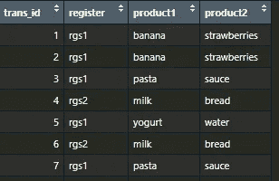
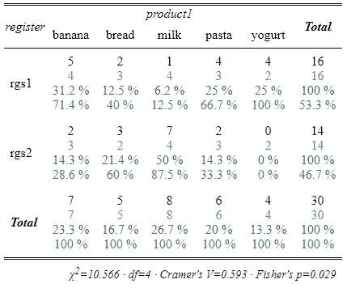
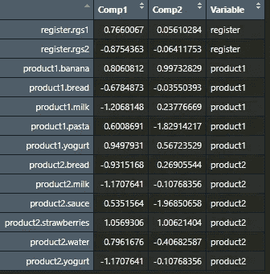
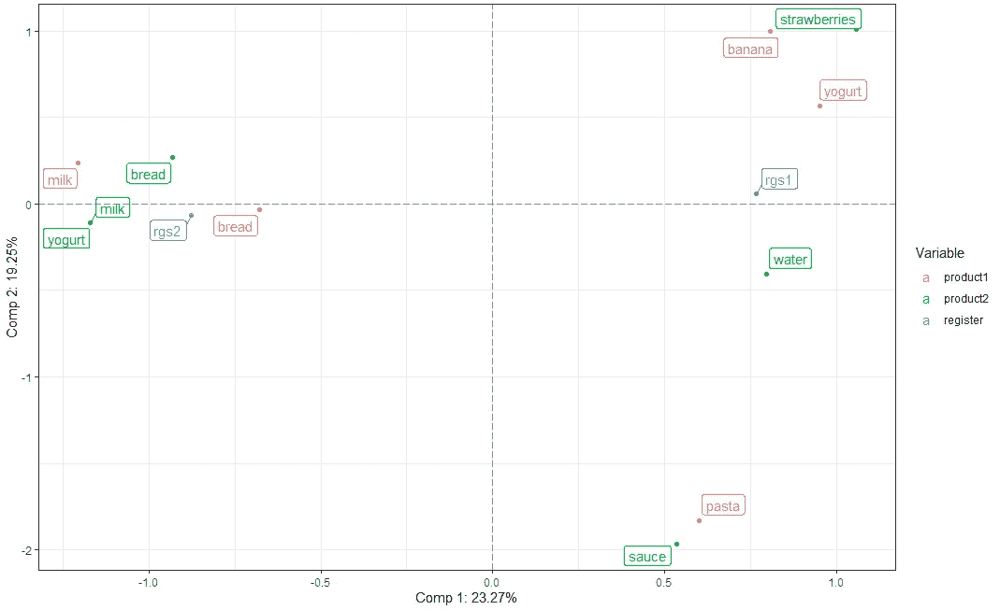

# 对应分析简要介绍

> 原文：[`towardsdatascience.com/brief-introduction-to-correspondence-analysis-a88297ebba2a`](https://towardsdatascience.com/brief-introduction-to-correspondence-analysis-a88297ebba2a)

## 学习如何在 R 中运行多重对应分析的基本步骤

[](https://gustavorsantos.medium.com/?source=post_page-----a88297ebba2a--------------------------------)[](https://towardsdatascience.com/?source=post_page-----a88297ebba2a--------------------------------) [Gustavo Santos](https://gustavorsantos.medium.com/?source=post_page-----a88297ebba2a--------------------------------)

·发布在[Towards Data Science](https://towardsdatascience.com/?source=post_page-----a88297ebba2a--------------------------------) ·阅读时间 7 分钟·2023 年 1 月 16 日

--


图片由[John Barkiple](https://unsplash.com/@barkiple?utm_source=unsplash&utm_medium=referral&utm_content=creditCopyText)拍摄，来源于[Unsplash](https://unsplash.com/photos/l090uFWoPaI?utm_source=unsplash&utm_medium=referral&utm_content=creditCopyText)

# 介绍

数据集由数字和/或文本组成。因此，我们应该预期，并非所有变量都仅涉及数字，数字变量有许多技术可以进行分析、测试和处理。

当我们处理数值变量时，有像相关性、PCA、缩放、归一化以及一系列测试等工具。另一方面，如果我们处理文本，更具体地说，是类别，我们应该寻找其他技术来应用于我们的数据分析。

其中一个工具是对应分析[CA]。

> 对应分析是一种统计技术，可以显示**基于给定的列联表数据，两个变量内类别之间的关系**。

正如定义所示，它是一种统计工具。概念上，它类似于主成分分析[PCA]，但应用于分类数据，因为它使我们能够以 2D 图形展示数据集，显示哪些类别对应（或相关）于什么。

对于数据科学家来说，CA 可以在许多方面发挥作用，例如了解不同类型的客户如何购买一组产品、每个年龄段偏好的电影类型，或者本教程的示例：哪些产品在注册 1 和注册 2 中被购买。

# 导入和创建一些数据

我们将从导入必要的库和创建一些数据开始。

```py
# Imports
library(tidyverse)
library(ggrepel)
library(sjPlot) #contigency tables
library(FactoMineR) #CA functions
library(ade4) # Create CA
```

创建数据。

```py
# Dataset

df <- data.frame(
  trans_id = 1:30,
  register = as.factor(c('rgs1', 'rgs1', 'rgs1', 'rgs2', 'rgs1', 'rgs2', 
                         'rgs1', 'rgs2', 'rgs1', 'rgs2', 'rgs1', 'rgs2', 
                         'rgs1', 'rgs2', 'rgs1', 'rgs2', 'rgs1', 'rgs2', 
                         'rgs1', 'rgs2', 'rgs1', 'rgs2', 'rgs1', 'rgs2',
                         'rgs1', 'rgs2', 'rgs1', 'rgs2', 'rgs1', 'rgs2')),
  product1 = as.factor(c('banana', 'banana', 'pasta', 'milk', 'yogurt', 
                         'milk', 'pasta', 'milk', 'pasta', 'milk', 'banana',
                         'milk', 'banana', 'banana', 'pasta', 'bread', 'bread',
                         'milk', 'yogurt', 'bread', 'banana', 'pasta', 'yogurt','milk',
                         'yogurt', 'bread', 'bread', 'pasta', 'milk', 'banana')),
  product2 = as.factor(c('strawberries', 'strawberries', 'sauce', 'bread', 'water',
                         'bread', 'sauce', 'bread', 'sauce', 'bread', 'strawberries',
                         'bread', 'strawberries', 'bread', 'water', 'bread', 'water', 
                         'bread', 'bread', 'yogurt','strawberries', 'sauce', 
                         'strawberries', 'bread', 'strawberries', 'milk', 'bread',
                         'sauce', 'bread', 'strawberries'))
)
```

这是数据的一个样本。所以我们有注册号和每次交易的一对产品。



创建的数据集样本。图片由作者提供。

# 统计数据

执行 CA 的第一步是进行统计检验。由于我们正在处理多个变量对，因此我们必须为每对变量执行卡方检验，所有的检验结果都必须在至少一对变量上具有统计显著性。例如，product1 必须与 product2 或 register 之一通过检验。

要执行的测试是一个假设检验，其中：

> **Ho (*p-value > 0.05*) 意味着变量之间没有关联**。
> 
> **Ha (p-value ≤ 0.05) 意味着变量之间存在关联**。

一种快速测试变量对的方法是使用 for 循环。

```py
for (var1 in 2:4){
  for (var2 in 4:2) {
  contingency <- table(df[,var1], df[, var2])
  chi2 <- chisq.test(contingency)
  writeLines( paste("p-Value for",
                    colnames(df)[var1], "and", colnames(df)[var2],
                    chi2$p.value))
  }
}

p-Value for register and product2 0.0271823155904414
p-Value for register and product1 0.0318997966416755
p-Value for register and register 3.2139733725587e-07
p-Value for product1 and product2 9.51614574849618e-06
p-Value for product1 and product1 5.49284039685425e-18
p-Value for product1 and register 0.0318997966416755
p-Value for product2 and product2 8.43312760405718e-20
p-Value for product2 and product1 9.51614574849618e-06
p-Value for product2 and register 0.0271823155904414
```

结果显示所有的卡方检验都低于 p-Value < 0.05 的阈值，因此我们可以拒绝原假设，支持替代假设，并理解变量之间存在统计学上显著的关联。

另一种选择是使用 sjPlot 库中的 `stj.xtab()` 函数。

```py
# Register x product1
sjt.xtab(var.row = df$register,
         var.col = df$product1,
         show.exp = TRUE,
         show.row.prc = TRUE,
         show.col.prc = TRUE)
```

它展示了一个格式良好的表格，已经包含了观察值、用绿色表示的期望值，以及每个类别的百分比、p 值和卡方统计量。



来自 stj.xtab() 函数的结果。图片由作者提供。

# 多重对应分析

现在是创建我们的多重对应分析（MCA）的时间。我们可以使用 **ade4** 库中的 `dudi.acm()` 函数。`scannf= FALSE` 参数只是为了防止显示特征值条形图。

```py
# Creating the Multiple Correspondence Analysis
ACM <- dudi.acm(df[,2:4], 
                scannf = FALSE)
```

一旦运行这个，输出将是 R 中的一个包含 12 个对象的 `List`。例如，如果我们运行 `ACM$co`，我们将看到为计算出的两个主成分的每个类别的坐标。这意味着 X 和 Y 坐标，或者每个点在二维图形上的位置。

```py
ACM$co

                           Comp1       Comp2
register.rgs1          0.7660067  0.05610284
register.rgs2         -0.8754363 -0.06411753
product1.banana        0.8060812  0.99732829
product1.bread        -0.6784873 -0.03550393
product1.milk         -1.2068148  0.23776669
product1.pasta         0.6008691 -1.82914217
product1.yogurt        0.9497931  0.56723529
product2.bread        -0.9315168  0.26905544
product2.milk         -1.1707641 -0.10768356
product2.sauce         0.5351564 -1.96850658
product2.strawberries  1.0569306  1.00621404
product2.water         0.7961676 -0.40682587
product2.yogurt       -1.1707641 -0.10768356
```

如果我们运行 `ACM$cw`，可以看到数据集中每个类别的百分比。

```py
ACM$cw

        register.rgs1         register.rgs2       product1.banana        product1.bread         product1.milk 
           0.17777778            0.15555556            0.07777778            0.05555556            0.08888889 
       product1.pasta       product1.yogurt        product2.bread         product2.milk        product2.sauce 
           0.06666667            0.04444444            0.13333333            0.01111111            0.05555556 
product2.strawberries        product2.water       product2.yogurt 
           0.08888889            0.03333333            0.01111111 
```

在 MCA 中，我们将能够提取 `n = num_categories — n_variables` 维度。在这个练习中，我们有 3 个变量（`register1, register2`，`product1` 和 `product2`）和 13 个类别（`banana, bread, milk, yogurt, sauce, water, strawberries, pasta, sauce`，一些类别在 product 1 和 2 中重复）。因此，`13–3 = 10` 维度。

因此，我们可以使用`ACM$eig`查看每个类别的 10 个 *特征值*。这些值表示每个类别所捕获的方差量，以一种简单的方式表示。

```py
ACM$eig
 [1] 0.77575767 0.64171051 0.54102510 0.44643851 0.33333333 0.25656245 0.15516469 0.10465009 0.05690406 0.02178693

# Variance from each dimension
perc_variance <- (ACM$eig / sum(ACM$eig)) * 100

[1] 23.272730 19.251315 16.230753 13.393155 10.000000  7.696873  4.654941  3.139503  1.707122  0.653608
```

# 创建感知图

最后一步是创建感知图，我们将在图形上看到类别的绘制。为此，我们必须创建一个基础数据框来保存类别名称及其相应的 X 和 Y 坐标。首先，让我们检查每个变量包含多少个类别。

```py
# How many categories by variable
qty_categories <- apply( df[,2:4], 2, function(x) nlevels(as.factor(x)) )

register product1 product2 
       2        5        6
```

很好。现在我们将创建一个 `data.frame` 对象，获取坐标 `ACM$co`，该对象将加载类别名称及 X 和 Y 坐标，并且包含一个 `Variable` 列，列出变量的名称（product1 或 product2）以便标记。

```py
# Create the df with coordinates
df_ACM <- data.frame(ACM$co, 
                     Variable = rep(names(qty_categories),
                                          qty_categories) )
```



X 和 Y 坐标。图片由作者提供。

从这里开始，现在只需要使用 ggplot2 创建图表即可。

我们将从 `df_ACM` 对象开始，提取行名并将其创建为一列（`rownames_to_column()`），然后将该列重命名为 `Category`。接下来，我们将名称如 `product1.banana` 变更为仅 `banana`。然后，我们将这个新数据框与 ggplot 函数进行管道操作，提供 `x=Comp1` 和 `y=Comp2`，标签为 `Category`，每个变量有不同的颜色。将创建一个散点图（`geom_point`），并使用 `geom_label_repel` 使名称不覆盖点。`vline` 和 `hline` 用于创建 0 的参考线。

```py
# Plotting the perceptual map

df_ACM %>%
  rownames_to_column() %>%
  rename(Category = 1) %>%
  mutate(Category = gsub("register.","", Category),
         Category = gsub("product1.","", Category),
         Category = gsub("product2.","", Category)) %>%
  ggplot(aes(x = Comp1, y = Comp2, label = Category, color = Variable)) +
  geom_point() +
  geom_label_repel() +
  geom_vline(aes(xintercept = 0), linetype = "longdash", color = "grey48") +
  geom_hline(aes(yintercept = 0), linetype = "longdash", color = "grey48") +
  labs(x = paste("Dimensão 1:", paste0(round(perc_variancia[1], 2), "%")),
       y = paste("Dimensão 2:", paste0(round(perc_variancia[2], 2), "%"))) +
  theme_bw()
```

这是结果。



MCA 的感知图。图片由作者提供。

结果给我们一些有趣的见解：

+   Register 1 收到更多的水果，如草莓和香蕉，一些水，少量意大利面和酱料。

+   Register 2 处理了更多的面包和牛奶或酸奶交易。

+   请注意，意大利面和酱料在两个收银台的距离较远。这是因为在 register1 上有 4 笔交易，而在 register2 上有 2 笔。其他组合要么由 rgs1 处理，要么由 rgs2 处理。

# 在你离开之前

MCA 是一个强大的工具。如果你处理的是分类数据，应该查阅并尽可能使用它来进行良好的分析。然而，请记住，随着变量和类别数量的增加，它的应用会变得更困难。

例如，想象一个包含 30 个变量、每个变量有 5 个类别的数据集！这需要进行大量测试和分析。在这种情况下，其他技术可能更好，或者对数据进行一些变换以减少类别数量，或创建一个子集进行分析。

如果你喜欢这些内容，请关注我的博客以获取更多信息。

[## Gustavo Santos - Medium](http://gustavorsantos.medium.com/?source=post_page-----a88297ebba2a--------------------------------)

### 在 Medium 上阅读 Gustavo Santos 的文章。数据科学家。我从数据中提取见解，以帮助个人和公司……

[gustavorsantos.medium.com](http://gustavorsantos.medium.com/?source=post_page-----a88297ebba2a--------------------------------)

# 参考

[## 特征值和特征向量 - 维基百科](https://en.wikipedia.org/wiki/Eigenvalues_and_eigenvectors?source=post_page-----a88297ebba2a--------------------------------)

### 在线性代数中，特征向量（Eigenvector）或特征向量是线性变换的一个非零向量……

[## 对应分析 - 维基百科](https://en.wikipedia.org/wiki/Eigenvalues_and_eigenvectors?source=post_page-----a88297ebba2a--------------------------------)

### 对应分析（CA）是一种由赫尔曼·奥托·哈特利（Hirschfeld）提出的多变量统计技术……

[en.wikipedia.org](https://en.wikipedia.org/wiki/Correspondence_analysis?source=post_page-----a88297ebba2a--------------------------------)  [## ade4 包 - RDocumentation

### 多变量数据分析工具。提供了几种方法用于分析（即排序）单表数据……

[www.rdocumentation.org](https://www.rdocumentation.org/packages/ade4/versions/1.7-20?source=post_page-----a88297ebba2a--------------------------------)
