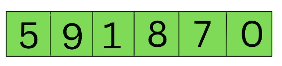
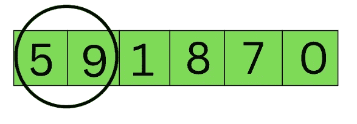
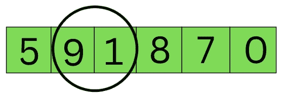
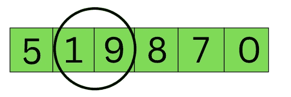
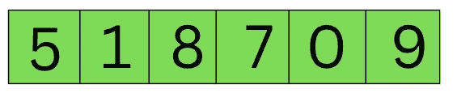

# 冒泡排序解释——数据科学家的算法指南

> 原文：[`towardsdatascience.com/bubble-sort-explained-a-data-scientists-algorithm-guide-853b2286e5ab`](https://towardsdatascience.com/bubble-sort-explained-a-data-scientists-algorithm-guide-853b2286e5ab)

## 冒泡排序的直观解释及其在 Python 中的实现

[](https://richmondalake.medium.com/?source=post_page-----853b2286e5ab--------------------------------)[](https://towardsdatascience.com/?source=post_page-----853b2286e5ab--------------------------------) [Richmond Alake](https://richmondalake.medium.com/?source=post_page-----853b2286e5ab--------------------------------)

·发表于 [Towards Data Science](https://towardsdatascience.com/?source=post_page-----853b2286e5ab--------------------------------) ·阅读时间 10 分钟·2023 年 1 月 5 日

--

作为软件工程师和数据科学家，我们经常理所当然地看待排序函数。这些算法可能不是我们工作中最光鲜亮丽或讨论最多的方面，但它们在我们每天使用的技术中发挥着至关重要的作用。例如，想象一下在没有按字母顺序排序的功能时，如何整理手机上的联系人列表，或者如何在电子商务网站上按价格和类别排序产品。很容易忽视排序算法的重要性，但它们对我们作为程序员的工作至关重要。

尽管大多数编程语言，如 Java、Python、C# 等，内置了常见排序算法的函数，但我们仍然需要对这些算法的工作原理有基本的了解。这些知识使我们能够根据算法的空间和时间复杂度做出明智的决策，特别是当数据科学家处理大型数据集时。因此，不要小看那些不起眼的排序函数——它们可能不是焦点，但却是科技行业的无名英雄。

在这篇文章中，我们将深入探讨冒泡排序算法，考察其在 Python 和 JavaScript 中的实现。我们还将更详细地了解算法背后的直觉，并讨论时间和空间复杂度的考虑因素。阅读完这篇文章，你将对何时在程序中使用冒泡排序算法有一个扎实的理解，并了解其空间和时间复杂度的概述。

> 在免费的电子书 [硬件 > 软件 > 过程](https://www.nvidia.com/en-us/ai-data-science/resources/hardware-software-process-book/?nvid=nv-int-tblg-423746#cid=dl13_nv-int-tblg_en-us) 中，详细了解硬件创新如何改变数据团队构建分析和机器学习应用的方式。

# 冒泡排序直观理解

在试图理解并回忆一个算法时，首先掌握概念总是更有帮助。在跳入实现之前，通过熟悉这个概念，你将更好地保留信息以备将来使用。冒泡排序也不例外。

为了使用冒泡排序算法将数组[2, 3, 4, 5, 1]按升序排序，我们从第一个元素[2]开始，并将其与第二个元素[3]进行比较。如果第一个元素大于第二个元素，我们交换它们。我们继续比较元素对，直到到达数组的末尾。这样，最大的元素将被移到数组的末尾，最小的元素将被移到数组的开头。

“冒泡排序”这个名字指的是较大的元素在被反复比较和交换较小元素时，“冒泡”到数组的顶部或末端。排序过程结束时，数组将完全按升序排序。

# 冒泡排序算法逐步解释

以下是我们将使用冒泡排序进行组织的无序数字列表：



作者提供的图片

第一步是只关注前两个数字，在这个例子中是 5 和 9。你可以将只考虑这两个元素 5 和 9 的过程可视化，如下图所示：



作者提供的图片

然后，你必须确定气泡中的数字是否按顺序排列。如果它们的顺序不正确，则需要进行交换以使其正确。幸运的是，它们已经按升序排列。5 小于 9，所以它在 9 之前。这意味着我们无需做更多的操作——我们将气泡再移动一步，如下所示：



作者提供的图片

在数组的下一次迭代中，我们进行相同的步骤。然而，这一次 9 大于 1，但它也在 1 的前面。因此，为了纠正这个问题，我们交换了这两个元素的位置。现在列表的样子如下：



作者提供的图片

现在元素已经交换，冒泡排序将继续处理后续的元素对。这个过程会重复进行，直到数组中的最后一对元素也被检查和交换。第一次遍历数组的结果如下：



作者提供的图片

冒泡排序算法是一种简单但有效的排序方法。它通过反复遍历数组，比较元素对的顺序，如果顺序错误则交换位置。这一过程会重复进行，直到整个数组被排序完成。

需要记住的一点是，对数组进行排序所需的遍数等于数组中的元素个数。例如，一个 6 个元素的数组需要进行 6 次遍历才能完全按升序排序。

然而，通过限制对数组进行的操作次数或遍历次数，可以使冒泡排序算法更高效。这是因为数组的最后一个元素始终是最大值，因此在未来的遍历中不需要继续比较这个位置之后的所有元素。我们将在下面的 Python 和 JavaScript 实现中看到这种优化的实际效果。

# 用 Python 实现的冒泡排序算法

本节使用 Python 编程语言实现冒泡排序算法。我们将观察到一种朴素的实现方式和一种更高效的冒泡排序算法。

初始化一个包含整数元素的 Python 数组

```py
unsortedData = [20, 33, 12, 53, 24, 65, 23, 4, 53, 1];
```

定义一个名为‘bubbleSort’的函数，该函数接受一个名为‘data’的数组作为参数。首先，我们尝试遍历数组，并交换满足条件的元素，即在特定索引处的左边元素大于右边元素时，我们对这两个元素执行交换操作。

需要注意的一点是，在任何迭代中，将左边元素分配给临时变量‘tempValue’，然后将右边元素分配给临时变量。

```py
def bubbleSort(data):

    for i in range(0, len(data)):
        if i+1 < len(data):
            if data[i] > data[i+1]:
                tempValue = data[i]
                data[i] = data[i+1]
                data[i+1] = tempValue

    return data
```

上述代码片段在用未排序的数组作为参数调用时，将对数组进行一次冒泡排序函数的遍历。在大多数情况下，可能不会完全将数组排序为升序。

```py
sortedData = bubbleSort(unsortedData)
print(sortedData)
>>>[20, 12, 33, 24, 53, 23, 4, 53, 1, 65]
```

为了解决这个问题，我们必须按照配对组合的次数来遍历我们想要排序的数组。简单来说，进行的迭代次数是未排序数组长度的平方（len(unsortedArrray)²）。这是一种朴素的实现方式。

```py
def bubbleSort(data):

    # Iterate through the array enough times to consider every possible swap pairs
    for _ in range(0, len(data)): 
        for i in range(0, len(data)):
            if i+1 < len(data):
                if data[i] > data[i+1]:
                    tempValue = data[i]
                    data[i] = data[i+1]
                    data[i+1] = tempValue

    return data 
```

再次运行冒泡排序函数，并将未排序的数组作为参数传递，将得到一个升序排列的数组作为输出。

```py
sortedData = bubbleSort(unsortedData)
print(sortedData)
>>> [1, 4, 12, 20, 23, 24, 33, 53, 53, 65] 
```

## **优化版冒泡排序**

虽然朴素版的冒泡排序算法有效，但存在一些不必要和冗余的操作。特别是，它比较了数组末尾已经是最大值的元素。这是因为在每次遍历数组时，冒泡排序算法将最大元素值移动到数组末尾。

为了优化冒泡排序算法，我们可以通过跟踪我们想要比较的数组部分来减少所需的交换操作次数。我们可以通过从数组的最大长度开始，并在每次遍历后将其减少 1，从而减少交换操作作用的数组区域。这样，我们可以避免在每次遍历时与数组末尾的元素进行比较，因为这些元素已经在正确的位置。

通过使用这种优化，我们可以使冒泡排序算法更高效，并减少其执行的多余操作次数。

```py
unsortedData = [20, 33, 12, 53, 24, 65, 23, 4, 53, 1];
end = len(unsortedData)

def bubbleSort(data):
    global end
    for _ in range(0, end):
        for i in range(0, end):
            if i+1 < end:
                if data[i] > data[i+1]:
                    tempValue = data[i]
                    data[i] = data[i+1]
                    data[i+1] = tempValue
    end = end - 1
    return data

sortedData = bubbleSort(unsortedData)
print(sortedData)
>>> [1, 4, 12, 20, 23, 24, 33, 53, 53, 65]
```

> 可以进一步重构以确保上述代码可读且高效。此外，正如 [Robert Kübler 博士](https://medium.com/u/6d6b5fb431bf?source=post_page-----853b2286e5ab--------------------------------) 在评论中指出的，通过检查是否发生了交换操作，可以进一步优化该算法。如果没有发生交换操作，我们可以中断循环以避免不必要的数组遍历。

```py
unsortedData = [20, 33, 12, 53, 24, 65, 23, 4, 53, 1]
n = len(unsortedData)

def bubbleSort(data):
    for i in range(n):
        swapped = False
        for j in range(0, n-i-1):
            if data[j] > data[j+1]:
                data[j], data[j+1] = data[j+1], data[j]
                swapped = True
        if not swapped:
            break
    return data

sortedData = bubbleSort(unsortedData)
print(sortedData)
```

以下是用 JavaScript 实现的相同算法，JavaScript 是一种受到数据从业者和软件工程师欢迎的编程语言。

# 用 JavaScript 实现的冒泡排序算法

```py
const unsortedData = [20, 33, 12, 53, 24, 65, 23, 4, 53, 1];
let end = unsortedData.length - 1

const bubbleSort = (data) => {

    for (let i = 0; i < end; i++) {
        if (data[i] > data[i + 1]) {
            const valueInRight = data[i]
            data[i] = data[i+1]
            data[i+1] = valueInRight
        }
    }
    end--
}

for (let i = 0; i < unsortedData.length; i++) {
    bubbleSort(unsortedData)
}

console.log(unsortedData)
```

# 时间和空间复杂度（大 O 记号）

数据科学家必须了解排序算法的性能及其所需的时间/空间。这使你能够根据具体情况选择最佳的排序算法，因为有很多选项可供选择。

当冒泡排序用于已经按升序排列的数组时，只需遍历整个数组一次。这被视为最佳情况。然而，实际上，这种情况只偶尔发生，冒泡排序通常需要 n(n-1)/2 次交换或比较才能实现排序数组。

冒泡排序算法的平均/最坏时间复杂度为 O(n²)，因为我们需要通过数组多次，与提供的数组中的对数一样。因此，当时间是一个因素时，可能会有更好的选择。

+   时间复杂度 最坏情况：O(n²)

+   时间复杂度 平均情况：O(n²)

+   时间复杂度 最佳情况：O(n)，数组已经排序

在空间复杂度方面，由于我们只是交换了元素而没有存储任何东西，我们不需要额外的空间来运行算法。这非常了不起，因为这意味着空间复杂度为常数，即 O(1)。这使得它成为一个 [原地](https://www.techiedelight.com/in-place-vs-out-of-place-algorithms/) 算法，通过直接修改输入来工作。

# 关键要点

冒泡排序算法可能不是最知名或评价最高的排序算法，但正如我们所见，它也不是一个糟糕的选择。其时间复杂度为 O(n²)，空间复杂度为 O(1)，这是一个简单的算法，容易为初学者理解。然而，它的慢速度可能使得它在某些应用中不够实际。

尽管有其局限性，冒泡排序算法可以作为学习排序算法和数据结构的一个有用起点。这是一个很好地理解这些算法如何工作的基础方式，并且可以帮助你为以后学习更复杂的算法奠定基础。

话虽如此，冒泡排序算法可能不是处理时间敏感材料的最佳选择，因为其速度较慢可能会成为限制。然而，如果你愿意为了时间牺牲一些空间，它可能会对你有用。最终，排序算法的选择将取决于你的具体需求和目标。通过了解冒泡排序算法，你可以做出更明智的决策，选择最适合你需求的算法。

# 常见问题解答

+   **冒泡排序是什么？**

冒泡排序是一种排序算法，它使用比较方法来排序数组。该算法比较数组中一对对的元素，并在左侧对（位置）大于右侧对（位置+1）时交换它们。这个过程重复进行，直到整个数组排序完成。

+   **冒泡排序需要多少次遍历？**

冒泡排序需要 n(n-1)/2 次遍历所有元素，以便最终数组按升序排列。

+   **冒泡排序的最坏时间复杂度是多少？**

冒泡排序的最坏时间复杂度是 O(n2)。

+   **冒泡排序的最坏时间复杂度是多少？**

冒泡排序的最佳时间复杂度是 O(n)，当数组已经排序时会出现这种情况。

+   **冒泡排序的空间复杂度是多少？**

冒泡排序具有 O(1) 的空间复杂度，因为它通过直接修改输入来原地操作。

# 我希望你觉得这篇文章有用。

要与我联系或找到更多类似于这篇文章的内容，请执行以下操作：

1.  [**支持我的写作**](https://richmondalake.medium.com/membership) 成为推荐的 Medium 会员

1.  订阅我的 [**YouTube 频道**](https://www.youtube.com/channel/UCNNYpuGCrihz_YsEpZjo8TA)

1.  订阅我的播客 [**Apple Podcasts**](https://apple.co/3tbXlIa) **|** [**Spotify**](https://spoti.fi/38IIC06) **|** [**Audible**](https://amzn.to/3m62Vb3)

1.  订阅我的 [**邮件列表**](https://richmond-alake.ck.page/c8e63294ee) 获取我的新闻通讯

## 接下来读什么 👇🏾

[](/merge-sort-explained-a-data-scientists-algorithm-guide-2f79d5034ba3?source=post_page-----853b2286e5ab--------------------------------) ## 合并排序解释–数据科学家的算法指南

### 一种合并排序算法的解释及其在 Python 中的实现

towardsdatascience.com
