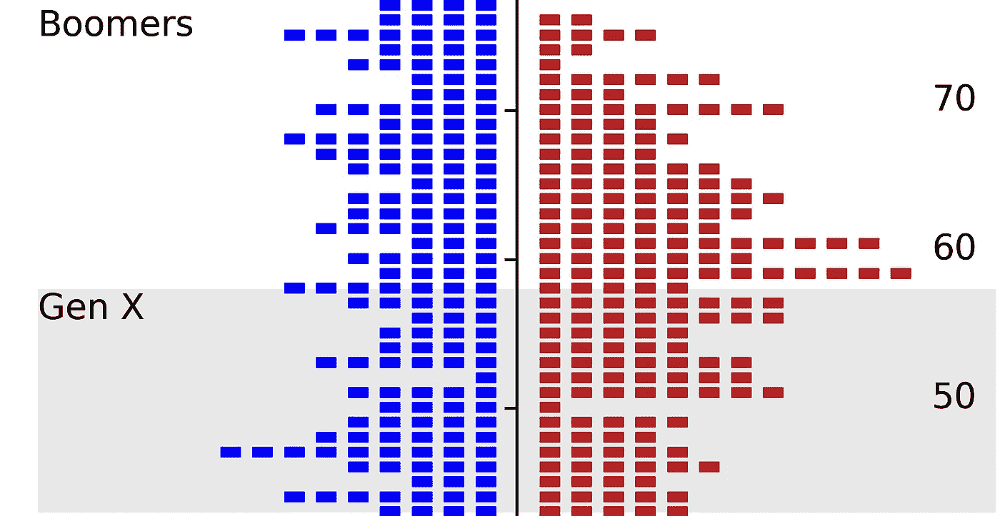
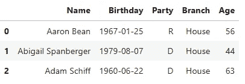
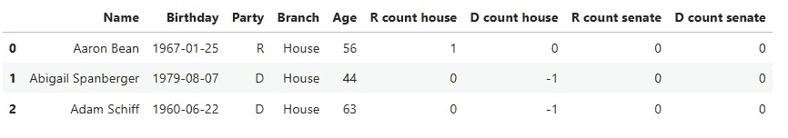
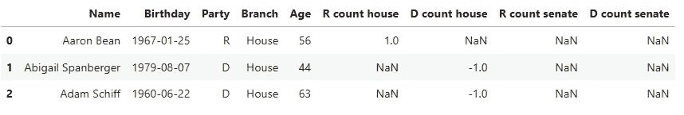
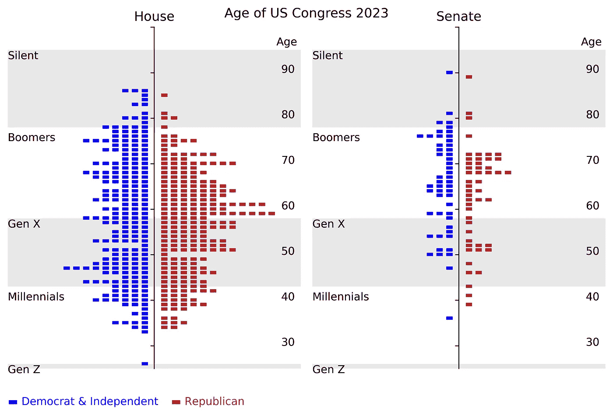

# 使用这个技巧构建更好的条形图

> 原文：[`towardsdatascience.com/build-a-better-bar-chart-with-this-trick-c66979cb17e1`](https://towardsdatascience.com/build-a-better-bar-chart-with-this-trick-c66979cb17e1)

## （这实际上是一个 seaborn 散点图！）

[](https://medium.com/@lee_vaughan?source=post_page-----c66979cb17e1--------------------------------)[](https://towardsdatascience.com/?source=post_page-----c66979cb17e1--------------------------------) [Lee Vaughan](https://medium.com/@lee_vaughan?source=post_page-----c66979cb17e1--------------------------------)

·发布在 [Towards Data Science](https://towardsdatascience.com/?source=post_page-----c66979cb17e1--------------------------------) ·7 min read·2023 年 8 月 26 日

--



“国会年龄”散点图的一部分（所有图片由作者提供）

每当我需要寻找有效的可视化灵感时，我都会浏览 [*经济学人*](https://www.economist.com/)、[*视觉资本家*](https://www.visualcapitalist.com/) 或 [*华盛顿邮报*](https://www.washingtonpost.com/)。在其中一次探索中，我发现了一个有趣的信息图表——类似于上面展示的图表——它绘制了每个美国国会议员的年龄与他们的代际群体之间的关系。

我的第一印象是这是一个 *水平条形图*，但仔细观察发现每个条形图由多个 *标记* 组成，使其成为一个 *散点图*。每个标记代表一个国会成员。

在这个 *快速成功数据科学* 项目中，我们将使用 Python、pandas 和 seaborn 重建这个吸引人的图表。在这个过程中，我们将揭示一些你可能不知道存在的标记类型。

# 数据集

由于美国有 [*候选资格年龄*](https://en.wikipedia.org/wiki/Age_of_candidacy_laws_in_the_United_States) 法律，国会成员的生日属于公开记录。你可以在多个地方找到它们，包括 [*美国国会传记名录*](https://bioguideretro.congress.gov/) 和 [维基百科](https://en.wikipedia.org/wiki/List_of_current_members_of_the_United_States_House_of_Representatives)。

为了方便，我已经编制了一个包含当前国会议员姓名、生日、政府分支和政党的 CSV 文件，并将其存储在这个 [Gist](https://gist.github.com/rlvaugh/35069885b74ca52a63aab217863440e0) 中。

# 代码

以下代码是在 Jupyter Lab 中编写的，并且由单元格描述 *描述*。

## 导入库

```py
from collections import defaultdict  # For counting members by age.
import numpy as np
import matplotlib.pyplot as plt
from matplotlib import patches  # For drawing boxes on the plot.
import pandas as pd
import seaborn as sns
```

## 为代际数据分配常量

我们将对图表进行标注，以突出显示诸如*婴儿潮一代*和*X 世代*等代际群体。以下代码计算每个群体的当前年龄范围，并包含代际名称和突出显示颜色的列表。因为我们希望将这些列表视为*常量*，所以我们将名称大写，并使用下划线作为前缀。

```py
# Prepare generational data for plotting as boxes on chart:
CURRENT_YEAR = 2023
_GEN_NAMES = ['Silent', 'Boomers', 'Gen X', 'Millennials', 'Gen Z']
_GEN_START_YR = [1928, 1946, 1965, 1981, 1997]
_GEN_END_YR = [1945, 1964, 1980, 1996, 2012]  
_GEN_START_AGE = [CURRENT_YEAR - x for x in _GEN_END_YR]
_GEN_END_AGE = [CURRENT_YEAR - x for x in _GEN_START_YR]
_GEN_COLORS = ['lightgray', 'white', 'lightgray', 'white', 'lightgray']
```

## 将生日转换为年龄

为了计算每位成员的年龄，我们首先必须将参考日期（8/25/2023）和 DataFrame 的“Birthday”列转换为*datetime*格式，使用 pandas 的`to_datetime()`方法。

现在我们有了兼容的、"日期感知"格式，我们可以通过减去这两个值，提取天数，然后将天数除以 365.25 来生成一个"年龄"列。

```py
# Load the data:
df = pd.read_csv('https://bit.ly/3EdQrai')

# Assign the current date:
current_date = pd.to_datetime('8/25/2023')

# Convert "Birthday" column to datetime:
df['Birthday'] = pd.to_datetime(df['Birthday'])

# Make a new "Age" column in years:
df['Age'] = ((current_date - df['Birthday']).dt.days) / 365.25
df['Age'] = df['Age'].astype(int)

df.head(3)
```



初始 DataFrame 的头部

## 计算成员的年龄

我们最终希望按*党派*和*政府分支*对成员进行分组。这意味着我们需要生成*四个*单独的图表。（我们将与民主党一起包含 3 位独立人士，他们与民主党一起开会）。

与简单的*条形图*不同，我们需要知道的不仅仅是，比如说，57 岁共和党参议员的*总数*。由于我们想为特定年龄类别的*每个成员*绘制*单独的标记*，我们需要一个*累计*总数。这样，我们可以使用（计数，年龄）值作为散点图中的（x，y）坐标。因此，第一位 57 岁共和党参议员将在*计数*列中标记为“1”，第二位参议员标记为“2”，以此类推。

为了管理这一点，我们将首先设置四个 DataFrame 列来保存计数，然后制作四个相应的字典来记录初始计数。我们将使用`collections`模块的`[defaultdict()](https://docs.python.org/3/library/collections.html#defaultdict-objects)`容器，而不是标准字典，因为它会为不存在的键提供*默认*值，而不是引发令人烦恼的`KeyError`。

接下来，我们将遍历 DataFrame，按“Branch”和“Party”列进行过滤。每次我们增加字典时，我们将更新“Age”列。这使我们能够保持匹配年龄的累积计数。

请注意，我们使用*负数*值来表示民主党计数，因为我们希望它们绘制在中央轴的左侧，而共和党的值绘制在右侧。

```py
# Initialize count columns:
df['R count house'] = 0
df['D count house'] = 0
df['R count senate'] = 0
df['D count senate'] = 0

# Create dictionaries with default values of 0:
r_count_h_dict = defaultdict(int)
d_count_h_dict = defaultdict(int)
r_count_s_dict = defaultdict(int)
d_count_s_dict = defaultdict(int)

# Iterate through the DataFrame and update counts:
for index, row in df.iterrows():
    age = row['Age']
    if row['Branch'] == 'House':
        if row['Party'] == 'R':
            r_count_h_dict[age] += 1
            df.at[index, 'R count house'] = r_count_h_dict[age]
        elif row['Party'] == 'D':
            d_count_h_dict[age] -= 1
            df.at[index, 'D count house'] = d_count_h_dict[age]
    elif row['Branch'] == 'Senate':
        if row['Party'] == 'R':
            r_count_s_dict[age] += 1
            df.at[index, 'R count senate'] = r_count_s_dict[age]
        elif row['Party'] == 'D':
            d_count_s_dict[age] -= 1
            df.at[index, 'D count senate'] = d_count_s_dict[age]
        elif row['Party'] == 'I':
            d_count_s_dict[age] -= 1
            df.at[index, 'D count senate'] = d_count_s_dict[age]

df.head(3)
```



## 遮蔽零计数

我们不想绘制零值，因此我们将使用掩码将这些值转换为 DataFrame 中的`NaN`（*非数字*）值。

```py
# Filter out zero values:
mask = df != 0

# Apply the mask to the DataFrame:
df = df[mask]

df.head(3)
```



## 定义绘图函数

如前所述，我们将制作*四个*图表。为了避免重复代码，我们将把绘图指令封装到一个可重用的函数中。

这个函数将接受一个 DataFrame、一个 matplotlib 轴对象的名称、作为 x 坐标的列、一个颜色和一个标题作为参数。我们会关闭 seaborn 的大部分默认设置，比如轴刻度和标签，以便我们的图形尽可能干净和简洁。

这个图的一个重要组成部分是用于每个国会议员的*矩形*标记（`marker=$\u25AC$`）。这个标记不是标准 matplotlib [集合](https://matplotlib.org/stable/api/markers_api.html)的一部分，而是*STIX 字体符号*的一部分。你可以在[这里](http://mirrors.ibiblio.org/CTAN/fonts/stix/doc/stix.pdf)找到这些替代标记的列表。

```py
def make_plot(data, ax, x, color, title):
    """Make a custom seaborn scatterplot with annotations."""
    sns.scatterplot(data=data, 
                    x=x, 
                    y='Age', 
                    marker='$\u25AC$', 
                    color=color, 
                    edgecolor=color, 
                    ax=ax, 
                    legend=False)

    # Set the border positions and visibility:
    ax.spines.left.set_position('zero')
    ax.spines.right.set_color('none')
    ax.spines.top.set_color('none')
    ax.spines.bottom.set_color('none')

    # Set x and y limits, ticks, labels, and title:
    ax.set_xlim(-15, 15)
    ax.set_ylim(25, 100)
    ax.tick_params(bottom=False)
    ax.set(xticklabels=[])
    ax.set(yticklabels=[])
    ax.set_xlabel('')
    ax.set_ylabel('')
    ax.set_title(title)

    # Manually annotate the y-axis along the right border:
    ax.text(x=12.5, y=96, s='Age')
    ax.set_yticks(np.arange(30, 101, 10))
    ylabels = [30, 40, 50, 60, 70, 80, 90]
    for label in ylabels:
        ax.text(x=13, y=label, s=str(label))

    # Add shading and annotation for each generation:
    for _, (name, start_age, end_age, gcolor) in enumerate(zip(_GEN_NAMES, 
                                                               _GEN_START_AGE,
                                                               _GEN_END_AGE, 
                                                               _GEN_COLORS)):
        rect = patches.Rectangle((-15, start_age), 
                                 width=30, 
                                 height=end_age - start_age, 
                                 facecolor=gcolor, 
                                 alpha=0.3)
        rect.set_zorder(0)  # Move shading below other elements.
        ax.add_patch(rect)
        ax.text(x=-15, y=end_age - 2, s=name)

    plt.tight_layout()
```

## 绘制图形

以下代码设置了图形并调用了`make_plot()`函数四次。最后添加了超级标题和自定义图例。

```py
# Make the figure and call the plotting function:
fig, (ax0, ax1) = plt.subplots(nrows=1, ncols=2, figsize=(8, 5))
make_plot(df, ax0, 'D count house', 'blue', 'House' )
make_plot(df, ax0, 'R count house', 'firebrick', 'House')
make_plot(df, ax1, 'D count senate', 'blue', 'Senate')
make_plot(df, ax1, 'R count senate', 'firebrick', 'Senate')

# Add figure title and custom legend:
fig.suptitle('Age of US Congress 2023')
ax0.text(x=-15, y=17, s='$\u25AC$ Democrat & Independent', color='blue')
ax0.text(x=1.7, y=17, s='$\u25AC$ Republican', color='firebrick');

# Optional line to save figure:
# plt.savefig('age_of_congress.png', bbox_inches='tight', dpi=600)
```



最终的图形。

# 结论

最佳信息图以干净、引人注目的风格讲述故事。正如写得很好的 Python 代码几乎不需要注释一样，优秀的信息图也不需要很多标签或注释。

在这个项目中，我们使用 pandas 加载和准备数据，并使用 seaborn 生成一个模仿条形图的散点图。这个图的一个关键特性是使用*STIX 字体符号*作为矩形标记。

对于具有许多低计数值的数据集，这种散点图方法比标准条形图更具视觉吸引力，因为条形图中的许多条形会很短。此外，用不同的标记表示每个成员比为多个成员显示单一条形图更能“个性化”数据。

# 谢谢！

感谢阅读，请关注我以获取更多*快速成功数据科学*项目。
