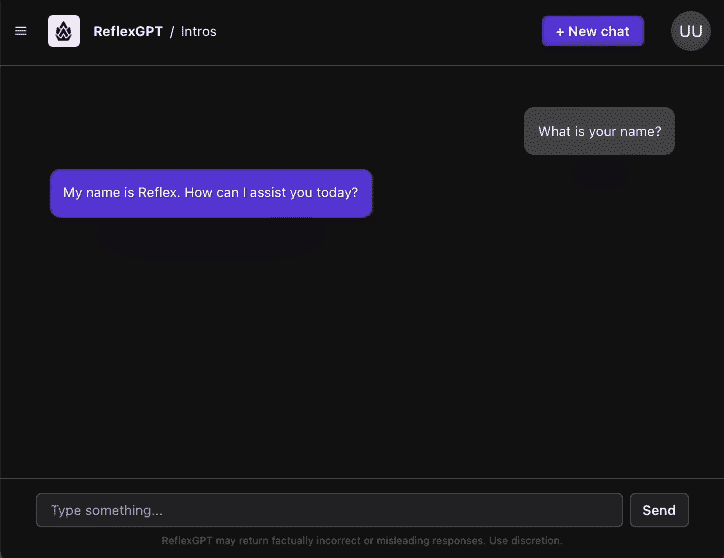
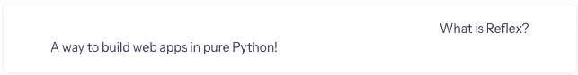
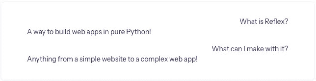
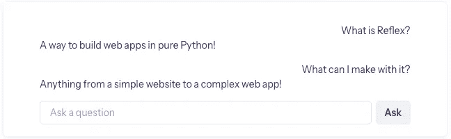
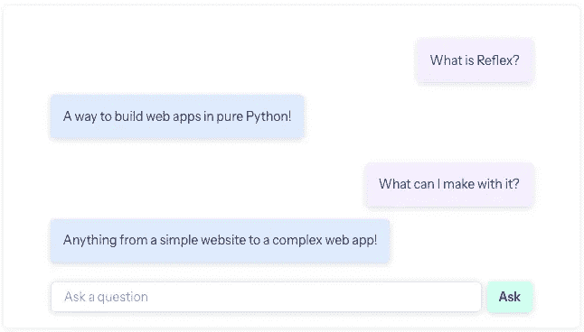
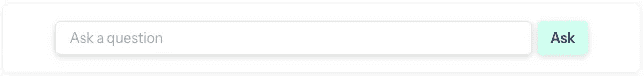

# 使用 Reflex 在纯 Python 中构建一个类似 ChatGPT 的 Web 应用

> 原文：[`towardsdatascience.com/build-a-chatgpt-esque-web-app-in-pure-python-using-reflex-bdc585038110?source=collection_archive---------6-----------------------#2023-11-07`](https://towardsdatascience.com/build-a-chatgpt-esque-web-app-in-pure-python-using-reflex-bdc585038110?source=collection_archive---------6-----------------------#2023-11-07)

## 使用 OpenAI 的 API 在纯 Python 中构建一个聊天 Web 应用，部署只需一行代码

[](https://medium.com/@tgotsman12?source=post_page-----bdc585038110--------------------------------)[](https://towardsdatascience.com/?source=post_page-----bdc585038110--------------------------------) [Tom Gotsman](https://medium.com/@tgotsman12?source=post_page-----bdc585038110--------------------------------)

·

[关注](https://medium.com/m/signin?actionUrl=https%3A%2F%2Fmedium.com%2F_%2Fsubscribe%2Fuser%2F9e381e082139&operation=register&redirect=https%3A%2F%2Ftowardsdatascience.com%2Fbuild-a-chatgpt-esque-web-app-in-pure-python-using-reflex-bdc585038110&user=Tom+Gotsman&userId=9e381e082139&source=post_page-9e381e082139----bdc585038110---------------------post_header-----------) 发表在 [Towards Data Science](https://towardsdatascience.com/?source=post_page-----bdc585038110--------------------------------) ·8 分钟阅读·2023 年 11 月 7 日[](https://medium.com/m/signin?actionUrl=https%3A%2F%2Fmedium.com%2F_%2Fvote%2Ftowards-data-science%2Fbdc585038110&operation=register&redirect=https%3A%2F%2Ftowardsdatascience.com%2Fbuild-a-chatgpt-esque-web-app-in-pure-python-using-reflex-bdc585038110&user=Tom+Gotsman&userId=9e381e082139&source=-----bdc585038110---------------------clap_footer-----------)

--

[](https://medium.com/m/signin?actionUrl=https%3A%2F%2Fmedium.com%2F_%2Fbookmark%2Fp%2Fbdc585038110&operation=register&redirect=https%3A%2F%2Ftowardsdatascience.com%2Fbuild-a-chatgpt-esque-web-app-in-pure-python-using-reflex-bdc585038110&source=-----bdc585038110---------------------bookmark_footer-----------)

聊天应用 GIF 由作者提供

在过去的几个月里，我一直在玩各种令人惊叹的新 LLM 聊天机器人，包括 Llama 2、GPT-4、Falcon 40B 和 Claude 2。一个始终困扰我的问题是，我如何构建自己的聊天机器人界面，调用所有这些出色的 LLM 作为 API？

现在有无数的选项可以用来构建美丽的用户界面，但作为一名机器学习工程师，我对 JavaScript 或任何前端语言都没有经验。我在寻找一种只使用我目前知道的语言——Python 来构建我的 Web 应用的方法！

我决定使用一个相对较新的开源框架 Reflex，它允许我完全用 Python 构建后端和前端。

***免责声明：*** *我在 Reflex 担任创始工程师，负责对开源框架做出贡献。*

在本教程中，我们将讲解如何从头开始使用纯 Python 构建一个完整的 AI 聊天应用——你还可以在这个 [Github 仓库](https://github.com/reflex-dev/reflex-chat) 找到所有代码。

你将学到如何：

1.  安装 `reflex` 并设置你的开发环境。

1.  创建组件来定义和设计你的 UI。

1.  使用状态为你的应用添加交互性。

1.  使用一行命令部署你的应用，与你人分享。

## **设置你的项目**

我们将从创建一个新项目和设置开发环境开始。首先，为你的项目创建一个新目录并进入该目录。

```py
~ $ mkdir chatapp
~ $ cd chatapp
```

接下来，我们将为我们的项目创建一个虚拟环境。在这个示例中，我们将使用 [venv](https://docs.python.org/3/library/venv.html) 来创建虚拟环境。

```py
chatapp $ python3 -m venv .venv
$ source .venv/bin/activate
```

现在，我们将安装 Reflex 并创建一个新项目。这将创建项目目录中的新目录结构。

```py
chatapp $ pip install reflex
chatapp $ reflex init
────────────────────────────────── Initializing chatapp ───────────────────────────────────
Success: Initialized chatapp
chatapp $ ls
assets          chatapp         rxconfig.py     .venv
```

你可以运行模板应用来确保一切正常。

```py
chatapp $ reflex run
─────────────────────────────────── Starting Reflex App ───────────────────────────────────
Compiling:  ━━━━━━━━━━━━━━━━━━━━━━━━━━━━━━━━━━━━━━━━ 100% 1/1 0:00:00
─────────────────────────────────────── App Running ───────────────────────────────────────
App running at: http://localhost:3000
```

你应该能在 [`localhost:3000`](http://localhost:3000/) 看到你的应用运行。

Reflex 还会启动后台服务器，处理所有状态管理和与前端的通信。你可以通过访问 [`localhost:8000/ping`](http://localhost:8000/ping) 来测试后台服务器是否正在运行。

现在我们已经设置好了项目，开始构建我们的应用吧！

## 基本前端

让我们从定义聊天应用的前端开始。在 Reflex 中，前端可以拆分为独立的、可重用的组件。有关更多信息，请查看 [组件文档](https://reflex.dev/docs/components/overview)。

**显示问题和答案**

我们将修改 `chatapp/chatapp.py` 文件中的 `index` 函数，以返回一个显示单个问题和答案的组件。



作者提供的图片（代码如下）

```py
# chatapp.py

import reflex as rx

def index() -> rx.Component:
    return rx.container(
        rx.box(
            "What is Reflex?",
            # The user's question is on the right.
            text_align="right",
        ),
        rx.box(
            "A way to build web apps in pure Python!",
            # The answer is on the left.
            text_align="left",
        ),
    )

# Add state and page to the app.
app = rx.App()
app.add_page(index)
app.compile()
```

组件可以相互嵌套以创建复杂的布局。在这里，我们创建了一个父容器，其中包含两个框，用于显示问题和答案。

我们还为组件添加了一些基本的样式。组件接受关键字参数，称为 [props](https://reflex.dev/docs/components/props)，这些参数可以修改组件的外观和功能。我们使用 `text_align` 属性将文本对齐到左侧和右侧。

**重用组件**

现在我们有了一个显示单个问题和答案的组件，我们可以重用它来显示多个问题和答案。我们将把该组件移动到一个单独的函数 `question_answer` 中，并从 `index` 函数中调用它。



作者提供的图片（代码如下）

```py
def qa(question: str, answer: str) -> rx.Component:
    return rx.box(
        rx.box(question, text_align="right"),
        rx.box(answer, text_align="left"),
        margin_y="1em",
    )

def chat() -> rx.Component:
    qa_pairs = [
        (
            "What is Reflex?",
            "A way to build web apps in pure Python!",
        ),
        (
            "What can I make with it?",
            "Anything from a simple website to a complex web app!",
        ),
    ]
    return rx.box(
        *[
            qa(question, answer)
            for question, answer in qa_pairs
        ]
    )

def index() -> rx.Component:
    return rx.container(chat())
```

**聊天输入**

现在我们希望用户能够输入一个问题。为此，我们将使用[input](https://reflex.dev/docs/library/forms/input)组件让用户添加文本，并使用[button](https://reflex.dev/docs/library/forms/button)组件来提交问题。



作者提供的图片（下面的代码）

```py
def action_bar() -> rx.Component:
    return rx.hstack(
        rx.input(placeholder="Ask a question"),
        rx.button("Ask"),
    )

def index() -> rx.Component:
    return rx.container(
        chat(),
        action_bar(),
    )
```

**样式**

让我们给应用添加一些样式。有关样式的更多信息可以在[styling docs](https://reflex.dev/docs/styling/overview)中找到。为了保持代码的整洁，我们将样式移动到一个单独的文件`chatapp/style.py`中。

```py
# style.py

# Common styles for questions and answers.
shadow = "rgba(0, 0, 0, 0.15) 0px 2px 8px"
chat_margin = "20%"
message_style = dict(
    padding="1em",
    border_radius="5px",
    margin_y="0.5em",
    box_shadow=shadow,
    max_width="30em",
    display="inline-block",
)
# Set specific styles for questions and answers.
question_style = message_style | dict(
    bg="#F5EFFE", margin_left=chat_margin
)
answer_style = message_style | dict(
    bg="#DEEAFD", margin_right=chat_margin
)
# Styles for the action bar.
input_style = dict(
    border_width="1px", padding="1em", box_shadow=shadow
)
button_style = dict(bg="#CEFFEE", box_shadow=shadow)
```

我们将导入`chatapp.py`中的样式并在组件中使用它们。此时，应用应该如下所示：



作者提供的图片

```py
# chatapp.py
import reflex as rx

from chatapp import style

def qa(question: str, answer: str) -> rx.Component:
    return rx.box(
        rx.box(
            rx.text(question, style=style.question_style),
            text_align="right",
        ),
        rx.box(
            rx.text(answer, style=style.answer_style),
            text_align="left",
        ),
        margin_y="1em",
    )

def chat() -> rx.Component:
    qa_pairs = [
        (
            "What is Reflex?",
            "A way to build web apps in pure Python!",
        ),
        (
            "What can I make with it?",
            "Anything from a simple website to a complex web app!",
        ),
    ]
    return rx.box(
        *[
            qa(question, answer)
            for question, answer in qa_pairs
        ]
    )

def action_bar() -> rx.Component:
    return rx.hstack(
        rx.input(
            placeholder="Ask a question",
            style=style.input_style,
        ),
        rx.button("Ask", style=style.button_style),
    )

def index() -> rx.Component:
    return rx.container(
        chat(),
        action_bar(),
    )

app = rx.App()
app.add_page(index)
app.compile()
```

应用看起来不错，但还不是很有用！现在让我们添加一些功能。

## 状态

现在让我们通过添加状态来使聊天应用变得互动。状态是我们定义应用中所有可以变化的变量以及所有可以修改这些变量的函数的地方。你可以在[state docs](https://reflex.dev/docs/state/overview)中了解更多关于状态的信息。

**定义状态**

我们将在`chatapp`目录中创建一个名为`state.py`的新文件。我们的状态将跟踪当前提出的问题和聊天记录。我们还将定义一个事件处理程序`answer`，它将处理当前的问题并将答案添加到聊天记录中。

```py
# state.py

import reflex as rx

class State(rx.State):
    # The current question being asked.
    question: str
    # Keep track of the chat history as a list of (question, answer) tuples.
    chat_history: list[tuple[str, str]]
    def answer(self):
        # Our chatbot is not very smart right now...
        answer = "I don't know!"
        self.chat_history.append((self.question, answer))
```

**将状态绑定到组件**

现在我们可以在`chatapp.py`中导入状态，并在前端组件中引用它。我们将修改`chat`组件，以使用状态代替当前固定的问题和答案。



作者提供的图片

```py
# chatapp.py

from chatapp.state import State

...

def chat() -> rx.Component:
    return rx.box(
        rx.foreach(
            State.chat_history,
            lambda messages: qa(messages[0], messages[1]),
        )
    )

...

def action_bar() -> rx.Component:
    return rx.hstack(
        rx.input(
            placeholder="Ask a question",
            on_change=State.set_question,
            style=style.input_style,
        ),
        rx.button(
            "Ask",
            on_click=State.answer,
            style=style.button_style,
        ),
    )
```

普通的 Python `for` 循环无法用于遍历状态变量，因为这些值可能会变化且在编译时未知。相反，我们使用[foreach](https://reflex.dev/docs/library/layout/foreach)组件来遍历聊天记录。

我们还将输入框的`on_change`事件绑定到`set_question`事件处理程序，这将更新`question`状态变量，而用户在输入框中输入时。我们将按钮的`on_click`事件绑定到`answer`事件处理程序，这将处理问题并将答案添加到聊天记录中。`set_question`事件处理程序是一个内置的隐式定义事件处理程序。每个基础变量都有一个。更多信息请查看[events docs](https://reflex.dev/docs/state/events)中的 Setters 部分。

**清空输入框**

目前，用户点击按钮后输入框不会清空。我们可以通过将输入框的值绑定到`question`，设置为`value=State.question`，并在运行`answer`事件处理程序时将其清空，使用`self.question = ''`来解决这个问题。

```py
# chatapp.py

def action_bar() -> rx.Component:
    return rx.hstack(
        rx.input(
            value=State.question,
            placeholder="Ask a question",
            on_change=State.set_question,
            style=style.input_style,
        ),
        rx.button(
            "Ask",
            on_click=State.answer,
            style=style.button_style,
        ),
    )
```

```py
# state.py

def answer(self):
    # Our chatbot is not very smart right now...
    answer = "I don't know!"
    self.chat_history.append((self.question, answer))
    self.question = ""
```

**流式文本**

通常，状态更新会在事件处理程序返回时发送到前端。然而，我们希望在生成的过程中流式传输来自聊天机器人的文本。我们可以通过从事件处理程序中生成来实现。有关更多信息，请参见[事件生成文档](https://reflex.dev/docs/state/events#yielding-multiple-updates)。

```py
# state.py
import asyncio

...

async def answer(self):
    # Our chatbot is not very smart right now...
    answer = "I don't know!"
    self.chat_history.append((self.question, ""))
    # Clear the question input.
    self.question = ""
    # Yield here to clear the frontend input before continuing.
    yield
    for i in range(len(answer)):
        # Pause to show the streaming effect.
        await asyncio.sleep(0.1)
        # Add one letter at a time to the output.
        self.chat_history[-1] = (
            self.chat_history[-1][0],
            answer[: i + 1],
        )
        yield
```

## 使用 API

我们将使用 OpenAI 的 API 为我们的聊天机器人提供一些智能。我们需要修改事件处理程序以向 API 发送请求。

```py
# state.py

import os
import openai

openai.api_key = os.environ["OPENAI_API_KEY"]

...

def answer(self):
    # Our chatbot has some brains now!
    session = openai.ChatCompletion.create(
        model="gpt-3.5-turbo",
        messages=[
            {"role": "user", "content": self.question}
        ],
        stop=None,
        temperature=0.7,
        stream=True,
    )

    # Add to the answer as the chatbot responds.
    answer = ""
    self.chat_history.append((self.question, answer))

    # Clear the question input.
    self.question = ""
    # Yield here to clear the frontend input before continuing.
    yield

    for item in session:
        if hasattr(item.choices[0].delta, "content"):
            answer += item.choices[0].delta.content
            self.chat_history[-1] = (
                self.chat_history[-1][0],
                answer,
            )
            yield
```

最后，我们有了我们的 AI 聊天机器人！

## 结论

按照这个教程，我们已经成功创建了使用 OpenAI API 密钥的聊天应用，完全用 Python 编写。

要现在运行这个应用，我们可以运行简单的命令：

```py
$ reflex run
```

要部署它，以便我们可以与其他用户分享，我们可以运行以下命令：

```py
$ reflex deploy
```

我希望这个教程能激发你们构建自己的 LLM 基础应用。我迫不及待想看到你们最终开发出什么，所以请在社交媒体或评论中与我联系。

如果你有问题，请在下方评论或者通过 Twitter 上的[@tgotsman12](https://twitter.com/tgotsman12)或[LinkedIn](https://www.linkedin.com/in/tom-gotsman/)给我发消息。分享你的应用创作到社交媒体并标记我，我很乐意提供反馈或帮助转发！
