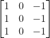
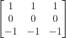
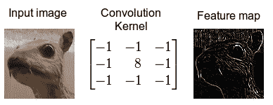
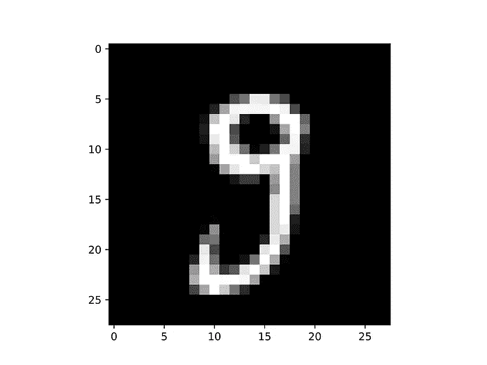
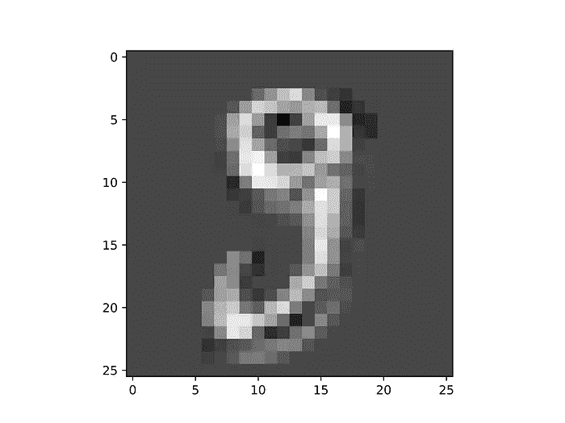
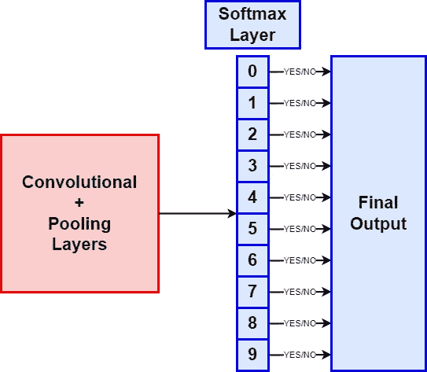

# 使用 Numpy 从零开始构建卷积神经网络

> 原文：[`towardsdatascience.com/build-a-convolutional-neural-network-from-scratch-using-numpy-139cbbf3c45e`](https://towardsdatascience.com/build-a-convolutional-neural-network-from-scratch-using-numpy-139cbbf3c45e)

## 通过从零开始构建 CNN 来掌握计算机视觉

[](https://medium.com/@riccardo.andreoni?source=post_page-----139cbbf3c45e--------------------------------)[](https://towardsdatascience.com/?source=post_page-----139cbbf3c45e--------------------------------) [Riccardo Andreoni](https://medium.com/@riccardo.andreoni?source=post_page-----139cbbf3c45e--------------------------------)

·发表于[Towards Data Science](https://towardsdatascience.com/?source=post_page-----139cbbf3c45e--------------------------------)·8 分钟阅读·2023 年 11 月 23 日

--


这些彩色窗户让我想起了 CNN 的层及其过滤器。图片来源：[unsplash.com](https://unsplash.com/photos/photo-of-green-leafed-plants-inside-building-CuEvrPd3NYc)。

由于**计算机视觉**应用现在无处不在，每个数据科学从业者都必须**了解其工作原理**和**熟悉它们**。

在这篇文章中，我在不依赖流行的现代深度学习库如 Tensorflow、Pytorch 和 Keras 的情况下构建了**深度神经网络**。我随后用它对手写数字进行分类。尽管取得的结果未达到最先进的水平，但仍然令人满意。现在，我想在使用 Python 库[**Numpy**](https://numpy.org/)的情况下迈出**进一步一步**，开发一个[**卷积神经网络**](https://en.wikipedia.org/wiki/Convolutional_neural_network)（CNN）。

Python 深度学习库，如上所述，**是极其强大的工具**。然而，作为一个缺点，它们使数据科学从业者无法理解神经网络的低级工作原理。这一点在 CNN 中尤其明显，因为它们的**过程比经典的全连接网络更不直观**。解决这一问题的唯一方法就是亲自动手实现 CNN：这就是这项任务的动机。

这篇文章旨在作为一个实用的、**动手指南**，而不是一个全面的 CNN 工作原理指南。因此，理论部分简明扼要，主要服务于实际部分的理解。为此，你会在本文末尾找到一份详尽的资源列表。我热情邀请你去查看它们！

# 卷积神经网络

卷积神经网络使用一种特定的架构和操作，使其**非常适合与图像相关的任务**，例如图像分类、目标定位、图像分割等。它们的设计大致**反映了人类视觉皮层**，其中每个生物神经元仅响应视觉场的一个小部分。此外，更高级的神经元对低级神经元的输出做出反应。

虽然经典的全连接网络可以处理与图像相关的任务，但当应用于中等或大型图像时，由于所需的参数数量众多，它们的效果会显著下降。例如，一个 200x200 像素的图像包含 40,000 个像素，如果网络的第一层有 1,000 个单元，仅这一层就需要 4000 万个权重。这个挑战通过 CNN 得到了极大的缓解，因为它们实现了**部分连接层**和**权重共享**。

卷积神经网络的**主要组件**是：

+   **卷积层**

+   **池化层**

## 卷积层

卷积层由一组**滤波器**组成，也称为**内核**。当应用于层的输入时，这些滤波器**以特定方式修改原始图像**。

一个滤波器可以描述为一个矩阵，其元素值定义了对原始图像应用的修改类型。例如，如下的 3x3 内核突出了图像的垂直边缘：



这个内核则强调水平边缘：



来源: [维基百科](https://en.wikipedia.org/wiki/Kernel_(image_processing)).

需要注意的是，这些内核的元素值不是手动选择的，而是网络在训练过程中学习的参数。

卷积的主要功能是隔离并突出图像中存在的不同特征。稍后，密集层将使用这些特征。

## 池化层

池化层**比卷积层更简单**。它们的目的是最小化网络的计算负担和内存使用。它们通过**缩小输入图像的尺寸**来实现这一目标。降低维度会减少 CNN 需要学习的参数数量。

池化层也使用一个通常为 2x2 维度的内核，将输入图像的一部分汇聚成一个值。例如，一个 2x2 的最大池化内核从输入图像中提取 4 个像素，并只输出值最大的像素。

# Python 实现

你可以在[我的 GitHub 仓库](https://github.com/andreoniriccardo/CNN-from-scratch)中找到本节中展示的所有代码。

[](https://github.com/andreoniriccardo/CNN-from-scratch?source=post_page-----139cbbf3c45e--------------------------------) [## GitHub - andreoniriccardo/CNN-from-scratch: 从零开始构建卷积神经网络

### 从零开始构建卷积神经网络。通过创建一个…来贡献到 andreoniriccardo/CNN-from-scratch 的开发。

github.com](https://github.com/andreoniriccardo/CNN-from-scratch?source=post_page-----139cbbf3c45e--------------------------------)

该实现的概念是创建**Python 类**，代表**卷积层和最大池化层**。此外，由于此 CNN 将应用于著名的开源 [MNIST](https://datahub.io/machine-learning/mnist_784#readme) 数据集，我还创建了一个用于 Softmax 层的特定类。

在每个类中，我定义了执行前向传播和反向传播步骤的方法。

作为最后一步，将这些层附加到一个列表中以构建最终的卷积神经网络。

## 卷积层实现

定义**卷积层**的代码如下：

```py
class ConvolutionLayer:
    def __init__(self, kernel_num, kernel_size):
        self.kernel_num = kernel_num
        self.kernel_size = kernel_size        
        self.kernels = np.random.randn(kernel_num, kernel_size, kernel_size) / (kernel_size**2)

    def patches_generator(self, image):
        image_h, image_w = image.shape
        self.image = image
        for h in range(image_h-self.kernel_size+1):
            for w in range(image_w-self.kernel_size+1):
                patch = image[h:(h+self.kernel_size), w:(w+self.kernel_size)]
                yield patch, h, w

    def forward_prop(self, image):
        image_h, image_w = image.shape
        convolution_output = np.zeros((image_h-self.kernel_size+1, image_w-self.kernel_size+1, self.kernel_num))
        for patch, h, w in self.patches_generator(image):
            convolution_output[h,w] = np.sum(patch*self.kernels, axis=(1,2))
        return convolution_output

    def back_prop(self, dE_dY, alpha):
        dE_dk = np.zeros(self.kernels.shape)
        for patch, h, w in self.patches_generator(self.image):
            for f in range(self.kernel_num):
                dE_dk[f] += patch * dE_dY[h, w, f]
        self.kernels -= alpha*dE_dk
        return dE_dk
```

`**ConvolutionLayer**`类的构造函数接收卷积层的内核数量及其大小作为输入。我假设只使用大小为`**kernel_size**`乘`**kernel_size**`的方形内核**。

然后，我生成形状为`**(kernel_num, kernel_size, kernel_size)**`的随机滤波器，并通过将每个元素除以平方的内核大小进行归一化。

`**patches_generator()**`方法是一个生成器。它生成要进行每个卷积步骤的图像部分。

`**forward_prop()**`方法对上述方法生成的每个补丁执行卷积操作。

最后，`**back_prop()**`方法负责计算损失函数相对于每层权重的梯度。它还相应地更新权重值。请注意，这里提到的损失函数不是网络的全局损失，而是由最大池化层传递给前一个卷积层的损失函数。

为了演示此类的实际效果，我创建了一个 `**ConvolutionLayer**` 实例，具有 32 个滤波器，每个滤波器的大小为 3x3。然后，我在一张图像上应用前向传播方法，得到由 32 张稍小的图像组成的输出。

初始输入图像的大小为 28x28 像素，如下图所示：



图片来源于作者。

一旦我应用了卷积层的`**forward_prop()**`方法，我得到 32 张 26x26 像素的图像。其中之一如下：



图片由作者提供。

正如你所见，图像的尺寸被缩小了，手写数字的清晰度更差了。需要注意的是，这一操作是由一个包含随机值的滤波器执行的，因此，它并不准确代表经过训练的 CNN 实际执行的步骤。尽管如此，你可以理解这些卷积如何产生较小的图像，在这些图像中对象的特征被分离出来。

## Max Pooling 层实现

我使用 Numpy 定义了 Max Pooling 层类，如下所示：

```py
class MaxPoolingLayer:
    def __init__(self, kernel_size):
        self.kernel_size = kernel_size

    def patches_generator(self, image):
        output_h = image.shape[0] // self.kernel_size
        output_w = image.shape[1] // self.kernel_size
        self.image = image

        for h in range(output_h):
            for w in range(output_w):
                patch = image[(h*self.kernel_size):(h*self.kernel_size+self.kernel_size), (w*self.kernel_size):(w*self.kernel_size+self.kernel_size)]
                yield patch, h, w

    def forward_prop(self, image):
        image_h, image_w, num_kernels = image.shape
        max_pooling_output = np.zeros((image_h//self.kernel_size, image_w//self.kernel_size, num_kernels))
        for patch, h, w in self.patches_generator(image):
            max_pooling_output[h,w] = np.amax(patch, axis=(0,1))
        return max_pooling_output

    def back_prop(self, dE_dY):
        dE_dk = np.zeros(self.image.shape)
        for patch,h,w in self.patches_generator(self.image):
            image_h, image_w, num_kernels = patch.shape
            max_val = np.amax(patch, axis=(0,1))

            for idx_h in range(image_h):
                for idx_w in range(image_w):
                    for idx_k in range(num_kernels):
                        if patch[idx_h,idx_w,idx_k] == max_val[idx_k]:
                            dE_dk[h*self.kernel_size+idx_h, w*self.kernel_size+idx_w, idx_k] = dE_dY[h,w,idx_k]
            return dE_dk
```

构造方法仅分配内核大小值。接下来的方法与卷积层中定义的方法类似，主要的区别在于`**back_prop()**`方法不会更新任何权重值。实际上，池化层**不依赖于权重**来执行聚合操作。

## Softmax 层实现

最后，我定义了**Softmax 层**。它的目的是**展平**从最终 Max Pooling 层获得的输出体积。Softmax 层输出 10 个值，这些值可以被解释为图像对应于 0 到 9 数字的概率。

实现具有与上述相同的结构：

```py
class SoftmaxLayer:
    def __init__(self, input_units, output_units):
        self.weight = np.random.randn(input_units, output_units)/input_units
        self.bias = np.zeros(output_units)

    def forward_prop(self, image):
        self.original_shape = image.shape
        image_flattened = image.flatten()
        self.flattened_input = image_flattened
        first_output = np.dot(image_flattened, self.weight) + self.bias
        self.output = first_output
        softmax_output = np.exp(first_output) / np.sum(np.exp(first_output), axis=0)
        return softmax_output

    def back_prop(self, dE_dY, alpha):
        for i, gradient in enumerate(dE_dY):
            if gradient == 0:
                continue
            transformation_eq = np.exp(self.output)
            S_total = np.sum(transformation_eq)

            dY_dZ = -transformation_eq[i]*transformation_eq / (S_total**2)
            dY_dZ[i] = transformation_eq[i]*(S_total - transformation_eq[i]) / (S_total**2)

            dZ_dw = self.flattened_input
            dZ_db = 1
            dZ_dX = self.weight

            dE_dZ = gradient * dY_dZ

            dE_dw = dZ_dw[np.newaxis].T @ dE_dZ[np.newaxis]
            dE_db = dE_dZ * dZ_db
            dE_dX = dZ_dX @ dE_dZ

            self.weight -= alpha*dE_dw
            self.bias -= alpha*dE_db

            return dE_dX.reshape(self.original_shape)
```



图片由作者提供。

# 结论

在这篇文章中，我们看到对基本 CNN 架构元素如卷积层和池化层的**理论介绍**。我相信，逐步的 Python 实现将为你提供**实际理解**这些理论概念如何转化为代码的途径。

我邀请你克隆包含代码的[GitHub 仓库](https://github.com/andreoniriccardo/CNN-from-scratch)并尝试`**main.py**`脚本。当然，这个网络并没有达到最先进的性能，因为它不是为了这个目标而构建的，但在经过几个训练周期后，仍然达到了**96%的准确率**。

最后，为了扩展你对 CNN 和计算机视觉的知识，我建议你查看下面列出的一些资源。

如果你喜欢这个故事，请考虑关注我，以便了解我即将推出的项目和文章！

# 参考文献

+   [“深度学习”由 Ian Goodfellow, Yoshua Bengio, 和 Aaron Courville](https://www.deeplearningbook.org/)

+   [“动手机器学习：Scikit-Learn, Keras 和 TensorFlow”由 Aurélien Géron](https://www.oreilly.com/library/view/hands-on-machine-learning/9781492032632/)

+   [“ImageNet 分类与深度卷积神经网络”由 Alex Krizhevsky, Ilya Sutskever, 和 Geoffrey Hinton](https://proceedings.neurips.cc/paper/4824-imagenet-classification-with-deep-convolutional-neural-networks.pdf)

+   [“《用于大规模图像识别的深度卷积网络》” 作者：Karen Simonyan 和 Andrew Zisserman (VGGNet)](https://arxiv.org/abs/1409.1556)

+   [“《Python 机器学习》” 作者：Sebastian Raschka 和 Vahid Mirjalili](https://www.amazon.com/Python-Machine-Learning-scikit-learn-TensorFlow/dp/1789955750)

+   [“《Python 中的卷积神经网络：掌握数据科学和机器学习，现代深度学习方法，使用 Python、Theano 和 TensorFlow》” 作者：Jason Brownlee](https://zlibrary-asia.se/book/2740843/d253d5?dsource=recommend)

+   [“《动手实践卷积神经网络与 TensorFlow 2》” 作者：Alex Gotev](https://www.amazon.com/Hands-Neural-Networks-TensorFlow-2-0/dp/1789615550)
