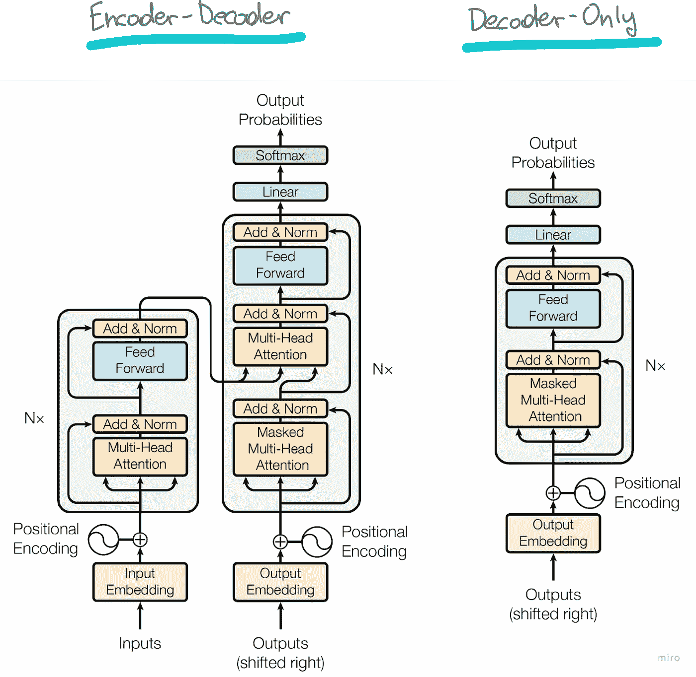
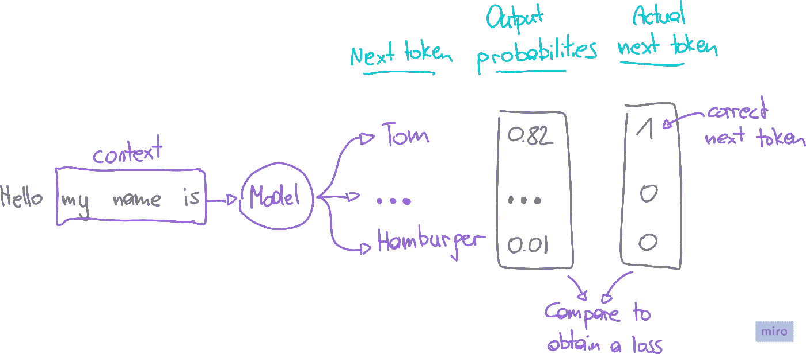
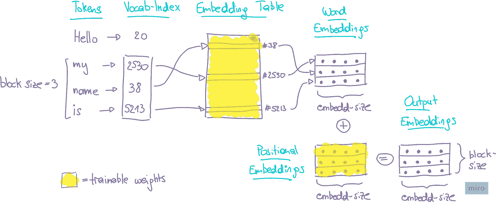
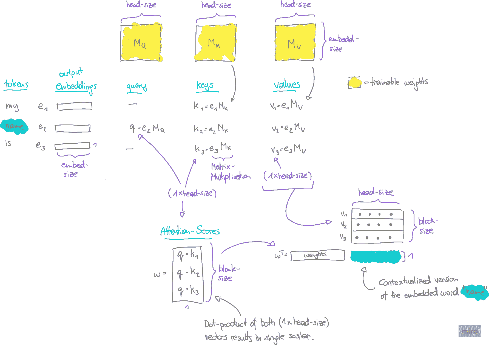
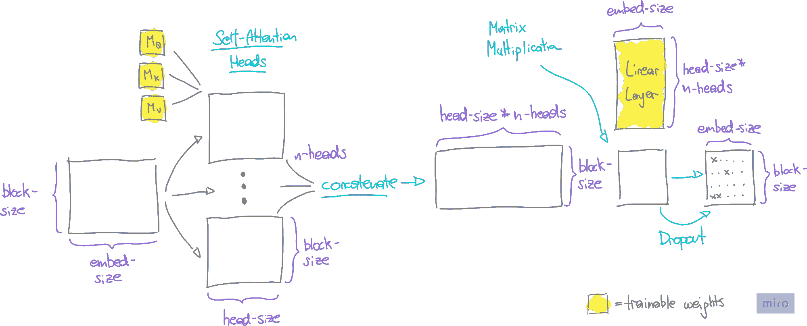
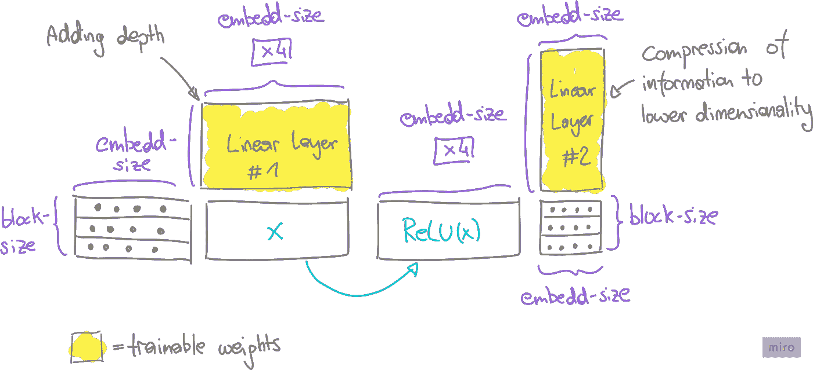
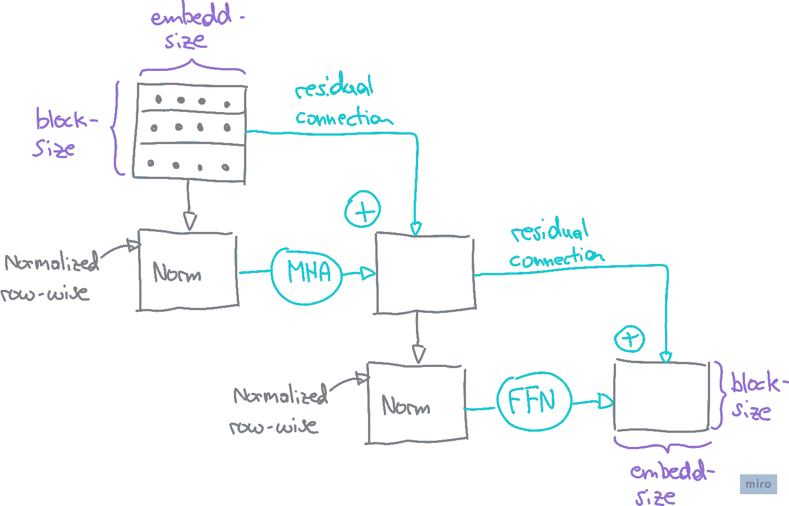
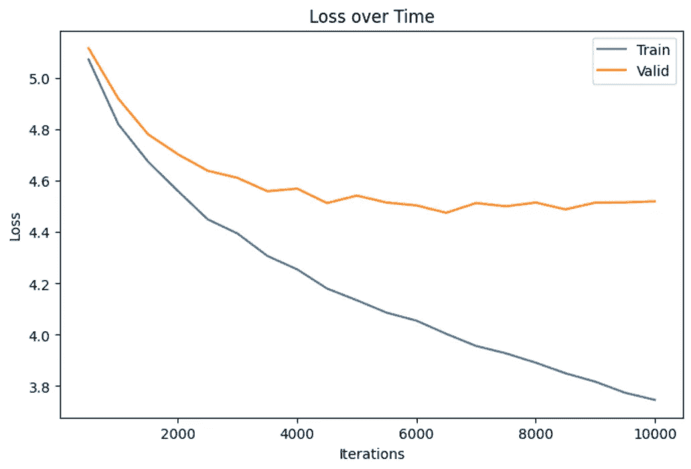
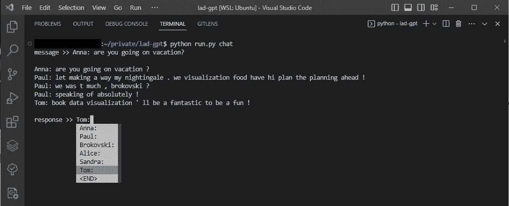

# 在你的 WhatsApp 聊天中构建一个语言模型

> 原文：[`towardsdatascience.com/build-a-language-model-on-your-whatsapp-chats-31264a9ced90?source=collection_archive---------1-----------------------#2023-11-21`](https://towardsdatascience.com/build-a-language-model-on-your-whatsapp-chats-31264a9ced90?source=collection_archive---------1-----------------------#2023-11-21)

## 通过应用程序了解 GPT 架构的视觉指南

[](https://bernhard-pfann.medium.com/?source=post_page-----31264a9ced90--------------------------------)[](https://towardsdatascience.com/?source=post_page-----31264a9ced90--------------------------------) [Bernhard Pfann, CFA](https://bernhard-pfann.medium.com/?source=post_page-----31264a9ced90--------------------------------)

·

[关注](https://medium.com/m/signin?actionUrl=https%3A%2F%2Fmedium.com%2F_%2Fsubscribe%2Fuser%2Fb2add0f92c53&operation=register&redirect=https%3A%2F%2Ftowardsdatascience.com%2Fbuild-a-language-model-on-your-whatsapp-chats-31264a9ced90&user=Bernhard+Pfann%2C+CFA&userId=b2add0f92c53&source=post_page-b2add0f92c53----31264a9ced90---------------------post_header-----------) 发表在 [Towards Data Science](https://towardsdatascience.com/?source=post_page-----31264a9ced90--------------------------------) ·16 分钟阅读·2023 年 11 月 21 日[](https://medium.com/m/signin?actionUrl=https%3A%2F%2Fmedium.com%2F_%2Fvote%2Ftowards-data-science%2F31264a9ced90&operation=register&redirect=https%3A%2F%2Ftowardsdatascience.com%2Fbuild-a-language-model-on-your-whatsapp-chats-31264a9ced90&user=Bernhard+Pfann%2C+CFA&userId=b2add0f92c53&source=-----31264a9ced90---------------------clap_footer-----------)

--

[](https://medium.com/m/signin?actionUrl=https%3A%2F%2Fmedium.com%2F_%2Fbookmark%2Fp%2F31264a9ced90&operation=register&redirect=https%3A%2F%2Ftowardsdatascience.com%2Fbuild-a-language-model-on-your-whatsapp-chats-31264a9ced90&source=-----31264a9ced90---------------------bookmark_footer-----------)

图片由 [Volodymyr Hryshchenko](https://unsplash.com/@lunarts?utm_source=medium&utm_medium=referral) 提供，来自 [Unsplash](https://unsplash.com/?utm_source=medium&utm_medium=referral)

聊天机器人无疑改变了我们与数字平台的互动。尽管基础语言模型在处理复杂任务方面取得了令人印象深刻的进展，但用户体验仍然常常显得不够个人化和疏离。

为了使对话更加贴近实际，我设想了一个可以模拟我随意写作风格的聊天机器人，就像在 WhatsApp 上给朋友发短信一样。

在这篇文章中，我将带你了解我构建一个（小型）语言模型的过程，该模型生成合成对话，使用我的 WhatsApp 聊天记录作为输入数据。过程中，我尝试以可视化且希望易于理解的方式解开 GPT 架构的内部工作机制，并附有实际的 Python 实现。你可以在我的 [GitHub](https://github.com/bernhard-pfann/lad-gpt) 上找到完整项目。

**注意：** [模型类](https://github.com/bernhard-pfann/lad-gpt/blob/main/src/model.py) 本身大块取自 [Andrej Karpathy 的视频系列](https://www.youtube.com/watch?v=VMj-3S1tku0&list=PLAqhIrjkxbuWI23v9cThsA9GvCAUhRvKZ&pp=iAQB)，并根据我的需要进行了调整。我强烈推荐他的教程。

[](https://github.com/bernhard-pfann/lad-gpt?source=post_page-----31264a9ced90--------------------------------) [## lad-gpt

### 从头开始训练一个语言模型，完全基于你的 WhatsApp 群聊。

github.com](https://github.com/bernhard-pfann/lad-gpt?source=post_page-----31264a9ced90--------------------------------)

## 目录

1.  选定的方法

1.  数据来源

1.  分词

1.  索引

1.  模型架构

1.  模型训练

1.  聊天模式

# 1. 选定的方法

在将语言模型定制为特定语料库时，可以采取几种方法：

1.  **模型构建：** 这涉及从头开始构建和训练模型，在模型架构和训练数据选择方面提供了最大的灵活性。

1.  **微调：** 这种方法利用现有的预训练模型，调整其权重以更紧密地与手头的特定数据对齐。

1.  **提示工程：** 这也利用了现有的预训练模型，但在这里，独特的语料库直接融入提示中，而不改变模型的权重。

由于我对这个项目的动机主要是自我教育，并且对现代语言模型的架构非常感兴趣，我选择了第一种方法。然而，这种选择带来了明显的限制。鉴于我的数据量和可用计算资源，我并没有期望与任何最先进的预训练模型相当的结果。

尽管如此，我仍希望我的模型能发现一些有趣的语言模式，最终它确实做到了。探索第二种选项（微调）可能会成为未来文章的重点。

# 2. 数据来源

WhatsApp，作为我的主要沟通渠道，是捕捉我的对话风格的理想来源。导出超过六年的群聊记录，总计超过 150 万字是非常简单的。

数据使用正则表达式模式解析成包含日期、联系人姓名和聊天消息的元组列表。

```py
pattern = r'\[(.*?)\] (.*?): (.*)'
matches = re.findall(pattern, text)
text = [(x1, x2.lower()) for x0, x1, x2 in matches]
```

```py
[
    (2018-03-12 16:03:59, "Alice", "Hi, how are you guys?"),
    (2018-03-12 16:05:36, "Tom", "I am good thanks!"),
    ...
]
```

现在，每个元素都被单独处理。

+   **发送日期：** 除了将其转换为日期时间对象外，我没有利用这些信息。然而，可以查看时间差异以区分话题讨论的开始和结束。

+   **联系人姓名：** 在分词文本时，每个联系人姓名被视为一个唯一的标记。这确保了名和姓的组合仍被视为一个整体。

+   **聊天消息：** 在每条消息的末尾添加了一个特殊的“<END>”标记。

# 3\. 分词

为了训练语言模型，我们需要将语言分解成片段（所谓的标记），并逐步输入模型。分词可以在多个层次上进行。

+   **字符级别：** 文本被视为一系列单独的字符（包括空格）。这种细粒度的方法允许从字符序列中形成每一个可能的单词。然而，捕捉单词之间的语义关系会更困难。

+   **词级别：** 文本被表示为一个单词序列。然而，模型的词汇量受到训练数据中现有单词的限制。

+   **子词级别：** 文本被拆分成比单词小但比字符大的子词单元。

虽然我最初使用的是字符级别的分词器，但我觉得训练时间被浪费在了学习重复单词的字符序列上，而不是关注句子中单词之间的语义关系。

为了概念上的简洁，我决定切换到词级别的分词器，暂时搁置了用于更复杂分词策略的现有库。

```py
from nltk.tokenize import RegexpTokenizer

def custom_tokenizer(txt: str, spec_tokens: List[str], pattern: str="|\d|\\w+|[^\\s]") -> List[str]:
    """
    Tokenize text into words or characters using NLTK's RegexpTokenizer, considerung 
    given special combinations as single tokens.

    :param txt: The corpus as a single string element.
    :param spec_tokens: A list of special tokens (e.g. ending, out-of-vocab).
    :param pattern: By default the corpus is tokenized on a word level (split by spaces).
                    Numbers are considered single tokens.

    >> note: The pattern for character level tokenization is '|.'
    """
    pattern = "|".join(spec_tokens) + pattern
    tokenizer = RegexpTokenizer(pattern)
    tokens = tokenizer.tokenize(txt)
    return tokens
```

```py
["Alice:", "Hi", "how", "are", "you", "guys", "?", "<END>", "Tom:", ... ]
```

结果显示我的训练数据有大约 70,000 个独特的单词。然而，由于许多单词仅出现一次或两次，我决定用“<UNK>”特殊标记替代这些稀有单词。这减少了词汇量至大约 25,000 个单词，从而得到一个较小的模型，后续训练也会更简单。

```py
from collections import Counter

def get_infrequent_tokens(tokens: Union[List[str], str], min_count: int) -> List[str]:
    """
    Identify tokens that appear less than a minimum count.

    :param tokens: When it is the raw text in a string, frequencies are counted on character level.
                   When it is the tokenized corpus as list, frequencies are counted on token level.
    :min_count: Threshold of occurence to flag a token.
    :return: List of tokens that appear infrequently. 
    """
    counts = Counter(tokens)
    infreq_tokens = set([k for k,v in counts.items() if v<=min_count])
    return infreq_tokens

def mask_tokens(tokens: List[str], mask: Set[str]) -> List[str]:
    """
    Iterate through all tokens. Any token that is part of the set, is replaced by the unknown token.

    :param tokens: The tokenized corpus.
    :param mask: Set of tokens that shall be masked in the corpus.
    :return: List of tokenized corpus after the masking operation.
    """
    return [t.replace(t, unknown_token) if t in mask else t for t in tokens]

infreq_tokens = get_infrequent_tokens(tokens, min_count=2)
tokens = mask_tokens(tokens, infreq_tokens)
```

```py
["Alice:", "Hi", "how", "are", "you", "<UNK>", "?", "<END>", "Tom:", ... ]
```

# 4\. 索引

在分词之后，下一步是将单词和特殊标记转换为数值表示。使用固定的词汇表，每个单词按其位置进行了索引。编码后的单词随后被准备为 PyTorch 张量。

```py
import torch

def encode(s: list, vocab: list) -> torch.tensor:
    """
    Encode a list of tokens into a tensor of integers, given a fixed vocabulary. 
    When a token is not found in the vocabulary, the special unknown token is assigned. 
    When the training set did not use that special token, a random token is assigned.
    """
    rand_token = random.randint(0, len(vocab))

    map = {s:i for i,s in enumerate(vocab)}
    enc = [map.get(c, map.get(unknown_token, rand_token)) for c in s]
    enc = torch.tensor(enc, dtype=torch.long)
    return enc
```

```py
torch.tensor([8127, 115, 2363, 3, ..., 14028])
```

由于我们需要评估模型在一些未见数据上的质量，我们将张量分成两部分。这样，我们就得到了训练集和验证集，可以准备好喂给语言模型。


作者提供的图片

# 5\. 模型架构

我决定应用 GPT 架构，这一架构在具有影响力的论文“[Attention is All you Need](https://arxiv.org/abs/1706.03762)”中得到了推广。由于我试图构建的是语言生成器而不是问答机器人，因此仅使用解码器（右侧）架构足以满足这一目的。



“[Attention is All you Need](https://arxiv.org/abs/1706.03762)” 由 A. Vaswani 等人撰写（取自 arXiv: 1706.03762）

在接下来的部分中，我将分解 GPT 架构的每个组件，解释其作用以及基础的矩阵运算。从准备好的训练测试开始，我将追踪一个示例上下文的 3 个词，通过模型，直到它预测下一个令牌。

## 5.1\. 模型目标

在深入技术细节之前，了解我们模型的主要目标至关重要。在仅解码器的设置中，我们的目标是解码语言的结构，以准确预测序列中的下一个令牌，前提是给定前面的令牌上下文。



图片由作者提供

当我们将索引的令牌序列输入模型时，它会经历一系列与各种权重矩阵的矩阵乘法运算。输出是一个向量，表示每个令牌在序列中作为下一个令牌的概率，这个概率基于输入上下文。

**模型评估：**

我们的模型性能通过训练数据来评估，其中实际的下一个令牌是已知的。目标是最大化正确预测这个下一个令牌的概率。

然而，在机器学习中，我们常常关注“损失”这一概念，它量化了错误或不正确预测的可能性。为了计算这一点，我们将模型的输出概率与实际的下一个令牌进行比较（使用[cross-entropy](https://en.wikipedia.org/wiki/Cross-entropy)）。

**优化：**

通过了解当前的损失，我们旨在通过[反向传播](https://en.wikipedia.org/wiki/Backpropagation)来最小化它。这个过程涉及迭代地将令牌序列输入模型，并调整权重矩阵以提升性能。

在每张图中，我将用黄色标出在该过程中将被优化的权重矩阵。

## 5.2\. 输出嵌入

到目前为止，我们序列中的每个令牌都由一个整数索引表示。然而，这种简单的形式无法反映单词之间的关系或相似性。为了解决这个问题，我们将一维索引提升到更高维度的空间中，通过嵌入实现。

+   **词嵌入：** 单词的本质由一个 n 维的浮点向量来捕捉。

+   **位置嵌入：** 这些嵌入强调了单词在句子中的位置的重要性，也表示为 n 维的浮点向量。

对于每个令牌，我们查找其词嵌入和位置嵌入，然后逐元素相加。这就得出了每个令牌在上下文中的输出嵌入。

在下面的示例中，上下文包含 3 个令牌。在嵌入过程结束时，每个令牌由一个 n 维向量表示（其中 n 是嵌入大小，一个可调的超参数）。



图片由作者提供

PyTorch 提供了专门的类来处理这些嵌入。在我们的模型类中，我们定义了词嵌入和位置嵌入，如下所示（传递矩阵维度作为参数）：

```py
self.word_embedding = nn.Embedding(vocab_size, embed_size)
self.pos_embedding = nn.Embedding(block_size, embed_size)
```

## 5.3. 自注意力头

虽然词嵌入提供了词语相似性的整体感觉，但一个词的真实含义往往取决于其周围的上下文。例如，“bat”可能指的是动物或运动器材，这取决于句子。这就是自注意力机制（GPT 架构的关键组成部分）发挥作用的地方。

自注意力机制关注三个主要概念：查询（Q）、键（K）和值（V）。

1.  **查询（Q）：** 查询本质上是当前标记的表示，注意力需要计算它。就像在问：“作为当前标记，我应该关注上下文中的什么？”

1.  **键（K）：** 键是输入序列中每个标记的表示。它们与查询配对，以确定注意力分数。这种比较衡量了查询标记应将多少关注放在上下文中的其他标记上。高分意味着应该更多关注。 

1.  **值（V）：** 值也是输入序列中每个标记的表示。然而，它们的作用不同，因为它们对注意力分数施加最终加权。



作者提供的图像

**示例：**

在我们的示例中，上下文中的每个标记已经是嵌入形式，作为 n 维向量（e1, e2, e3）。自注意力头将它们作为输入，以逐一输出每个标记的上下文化版本。

1.  在评估“name”这个标记时，通过将其嵌入向量**v2**与可训练矩阵**M_Q**相乘，得到一个查询向量**q**。

1.  同时，为上下文中的每个标记计算键向量**(k1, k2, k3)**，通过将每个嵌入向量**(e1, e2, e3)**与可训练矩阵**M_K**相乘。

1.  值向量**(v1, v2, v3)** 以相同的方式获得，只是乘以不同的可训练矩阵**M_V**。

1.  注意力分数**w**通过查询向量与每个键向量之间的点积来计算。

1.  最后，我们将所有值向量堆叠成一个矩阵，并将其与注意力分数相乘，以获得标记“name”的**上下文化向量**。

```py
class Head(nn.Module):
    """
    This module performs self-attention operations on the input tensor, producing 
    an output tensor with the same time-steps but different channels. 

    :param head_size: The size of the head in the multi-head attention mechanism.
    """
    def __init__(self, head_size):
        super().__init__()
        self.key = nn.Linear(embed_size, head_size, bias=False)
        self.query = nn.Linear(embed_size, head_size, bias=False)
        self.value = nn.Linear(embed_size, head_size, bias=False)

    def forward(self, x):
        """
        # input of size (batch, time-step, channels)
        # output of size (batch, time-step, head size)
        """
        B,T,C = x.shape
        k = self.key(x)                                     
        q = self.query(x)                                   

        # compute attention scores
        wei = q @ k.transpose(-2,-1)                        
        wei /= math.sqrt(k.shape[-1])                       

        # avoid look-ahead
        tril = torch.tril(torch.ones(T, T))
        wei = wei.masked_fill(tril == 0, float("-inf"))    
        wei = F.softmax(wei, dim=-1)

        # weighted aggregation of the values
        v = self.value(x)    
        out = wei @ v
        return out
```

## 5.4. 掩蔽多头注意力

语言是复杂的，捕捉其所有的细微差别并不简单。一组注意力计算通常不足以捕捉词语如何相互作用的细微之处。这就是 GPT 模型中的多头注意力的理念派上用场的地方。

你可以把多头注意力想象成多个“眼睛”以不同的方式观察数据，每个“眼睛”注意到独特的细节。这些独立的观察结果然后被整合成一个大图景。为了使这个大图景易于管理并与我们模型的其余部分兼容，我们使用线性层（可训练权重）将其压缩回原始的嵌入大小。

最后，为了确保我们的模型不仅仅记住训练数据，还能在新文本上进行良好的预测，我们使用了一个 dropout 层。这个层在训练过程中随机关闭数据的部分内容，帮助模型变得更加适应。



作者提供的图片

```py
class MultiHeadAttention(nn.Module):
    """
    This class contains multiple `Head` objects, which perform self-attention 
    operations in parallel.
    """
    def __init__(self):
        super().__init__()
        head_size = embed_size // n_heads
        heads_list = [Head(head_size) for _ in range(n_heads)]

        self.heads = nn.ModuleList(heads_list)
        self.linear = nn.Linear(n_heads * head_size, embed_size)
        self.dropout = nn.Dropout(dropout)

    def forward(self, x):
        heads_list = [h(x) for h in self.heads]
        out = torch.cat(heads_list, dim=-1)
        out = self.linear(out)
        out = self.dropout(out)
        return out
```

## 5.5\. 前馈

多头注意力层最初捕捉了序列中的上下文关系。通过两个连续的线性层为网络添加了更多深度，这两个层共同构成了前馈神经网络。



作者提供的图片

在**初始线性层**中，我们增加了维度（在我们的例子中是增加了 4 倍），这有效地拓宽了网络学习和表示更复杂特征的能力。对结果矩阵的每个元素应用[ReLU](https://en.wikipedia.org/wiki/Rectifier_(neural_networks))函数，使得非线性模式能够被识别。

随后，**第二个线性层**作为一个压缩器，将扩展的维度减少回原始形状（块大小 x 嵌入大小）。**Dropout 层**结束了这个过程，随机地停用矩阵的部分元素，以实现模型的泛化。

```py
class FeedFoward(nn.Module):
    """
    This module passes the input tensor through a series of linear transformations 
    and non-linear activations.
    """
    def __init__(self):
        super().__init__()
        self.net = nn.Sequential(
            nn.Linear(embed_size, 4 * embed_size), 
            nn.ReLU(),
            nn.Linear(4 * embed_size, embed_size),
            nn.Dropout(dropout),
        )

    def forward(self, x):
        return self.net(x)
```

## 5.6\. Add & Norm

现在，我们通过引入两个关键元素，将多头注意力和前馈组件连接在一起：

+   **残差连接（Add）：** 这些连接执行层输出与其未更改输入的逐元素加法。在训练过程中，模型根据层变换的有用性调整对层变换的重视程度。如果某个变换被认为是不必要的，其权重和相应的层输出将趋向于零。在这种情况下，至少未更改的输入会通过残差连接传递。这种技术有助于缓解[梯度消失问题](https://en.wikipedia.org/wiki/Vanishing_gradient_problem)。

+   **层归一化（Norm）：** 这种方法通过减去嵌入向量的均值并除以其标准差来归一化上下文中的每个嵌入向量。这个过程还确保了在反向传播过程中梯度不会爆炸或消失。



作者提供的图片

多头注意力和前馈层的链条，通过“Add & Norm”连接，合并成一个块。这种模块化设计使我们能够形成一系列块。这些块的数量是一个超参数，它决定了模型架构的深度。

```py
class Block(nn.Module):
    """
    This module contains a single transformer block, which consists of multi-head 
    self-attention followed by feed-forward neural networks.
    """
    def __init__(self):
        super().__init__()

        self.sa = MultiHeadAttention()
        self.ffwd = FeedFoward()
        self.ln1 = nn.LayerNorm(embed_size)
        self.ln2 = nn.LayerNorm(embed_size)

    def forward(self, x):
        x = x + self.sa(self.ln1(x))
        x = x + self.ffwd(self.ln2(x))
        return x
```

## 5.7\. Softmax

在遍历多个块组件后，我们获得了一个维度为（块大小 x 嵌入大小）的矩阵。为了将这个矩阵重塑为所需的维度（块大小 x 词汇表大小），我们将其通过一个最终的线性层。这个形状表示了上下文中每个位置词汇表中每个词的一个条目。

最后，我们对这些值应用 soft-max 变换，将其转换为概率。我们成功地获得了上下文中每个位置的下一个标记的概率分布。

# 6\. 模型训练

为了训练语言模型，我从训练数据中的随机位置选择了令牌序列。鉴于 WhatsApp 对话的快节奏，我确定 32 个词的上下文长度足够。因此，我选择了随机的 32 词块作为上下文输入，并使用相应的向量（向后移动一个词）作为比较的目标。

训练过程循环执行以下步骤：

1.  对多个批次的上下文进行采样。

1.  将这些样本输入模型，以计算当前损失。

1.  根据当前的损失和模型权重应用反向传播。

1.  每 500 次迭代更全面地评估损失。

一旦所有其他模型超参数（如嵌入大小、自注意力头数量等）确定后，我最终选择了一个具有 250 万参数的模型。考虑到我对输入数据大小和计算资源的限制，我发现这是对我而言的**最佳**设置。

训练过程大约花费了 12 小时，完成了 10,000 次迭代。可以看到，训练本可以更早停止，因为验证集和训练集上的损失差距在扩大。



作者提供的图片

```py
import json

import torch

from config import eval_interval, learn_rate, max_iters
from src.model import GPTLanguageModel
from src.utils import current_time, estimate_loss, get_batch

def model_training(update: bool) -> None:
    """
    Trains or updates a GPTLanguageModel using pre-loaded data.

    This function either initializes a new model or loads an existing model based
    on the `update` parameter. It then trains the model using the AdamW optimizer
    on the training and validation data sets. Finally the trained model is saved.

    :param update: Boolean flag to indicate whether to update an existing model.
    """
    # LOAD DATA -----------------------------------------------------------------

    train_data = torch.load("assets/output/train.pt")
    valid_data = torch.load("assets/output/valid.pt")

    with open("assets/output/vocab.txt", "r", encoding="utf-8") as f:
        vocab = json.loads(f.read())

    # INITIALIZE / LOAD MODEL ---------------------------------------------------

    if update:
        try:
            model = torch.load("assets/models/model.pt")
            print("Loaded existing model to continue training.")
        except FileNotFoundError:
            print("No existing model found. Initializing a new model.")
            model = GPTLanguageModel(vocab_size=len(vocab))

    else:
        print("Initializing a new model.")
        model = GPTLanguageModel(vocab_size=len(vocab))

    # initialize optimizer
    optimizer = torch.optim.AdamW(model.parameters(), lr=learn_rate)

    # number of model parameters
    n_params = sum(p.numel() for p in model.parameters())
    print(f"Parameters to be optimized: {n_params}\n", )

    # MODEL TRAINING ------------------------------------------------------------

    for i in range(max_iters):

        # evaluate the loss on train and valid sets every 'eval_interval' steps
        if i % eval_interval == 0 or i == max_iters - 1:
            train_loss = estimate_loss(model, train_data)
            valid_loss = estimate_loss(model, valid_data)

            time = current_time()
            print(f"{time} | step {i}: train loss {train_loss:.4f}, valid loss {valid_loss:.4f}")

        # sample batch of data
        x_batch, y_batch = get_batch(train_data)

        # evaluate the loss
        logits, loss = model(x_batch, y_batch)
        optimizer.zero_grad(set_to_none=True)
        loss.backward()
        optimizer.step()

    torch.save(model, "assets/models/model.pt")
    print("Model saved")
```

# 7\. 聊天模式

为了与训练好的模型进行交互，我创建了一个函数，允许通过下拉菜单选择联系人姓名，并输入消息供模型响应。参数“n_chats”决定模型一次生成的响应数量。当模型预测<END>标记为下一个标记时，模型结束生成消息。

```py
import json
import random

import torch
from prompt_toolkit import prompt
from prompt_toolkit.completion import WordCompleter

from config import end_token, n_chats
from src.utils import custom_tokenizer, decode, encode, print_delayed

def conversation() -> None:
    """
    Emulates chat conversations by sampling from a pre-trained GPTLanguageModel.

    This function loads a trained GPTLanguageModel along with vocabulary and 
    the list of special tokens. It then enters into a loop where the user specifies 
    a contact. Given this input, the model generates a sample response. The conversation 
    continues until the user inputs the end token.
    """
    with open("assets/output/vocab.txt", "r", encoding="utf-8") as f:
        vocab = json.loads(f.read())

    with open("assets/output/contacts.txt", "r", encoding="utf-8") as f:
        contacts = json.loads(f.read())   

    spec_tokens = contacts + [end_token]
    model = torch.load("assets/models/model.pt")
    completer = WordCompleter(spec_tokens, ignore_case=True)

    input = prompt("message >> ", completer=completer, default="")
    output = torch.tensor([], dtype=torch.long)
    print()

    while input != end_token:
        for _ in range(n_chats):

            add_tokens = custom_tokenizer(input, spec_tokens)
            add_context = encode(add_tokens, vocab)
            context = torch.cat((output, add_context)).unsqueeze(1).T

            n0 = len(output)
            output = model.generate(context, vocab)
            n1 = len(output)

            print_delayed(decode(output[n0-n1:], vocab))
            input = random.choice(contacts)

        input = prompt("\nresponse >> ", completer=completer, default="")
        print()
```

**结论：**

由于个人聊天的隐私，我无法在这里展示示例提示和对话。

尽管如此，你可以期待这样规模的模型能够成功学习句子的总体结构，产生有意义的输出，尤其是在词序方面。在我的案例中，它也掌握了训练数据中某些重要话题的上下文。例如，由于我的个人聊天经常围绕网球展开，网球运动员的名字和与网球相关的词通常会一起输出。

然而，在评估生成句子的连贯性时，我承认结果并没有达到我已经很低的期望。当然，我也可以责怪我的朋友们聊了太多无聊的话，限制了模型学习有用内容的能力...

为了在结尾展示至少一些示例输出，你可以查看虚拟模型在 200 条训练虚拟消息上的表现 ;)



作者提供的图片
