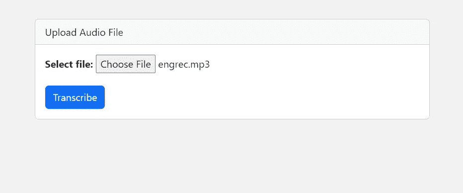
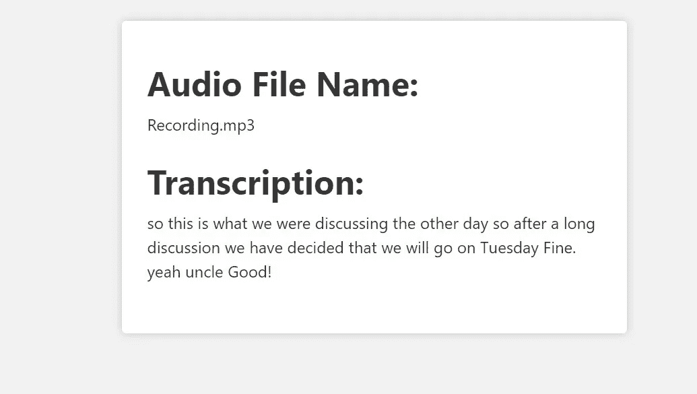
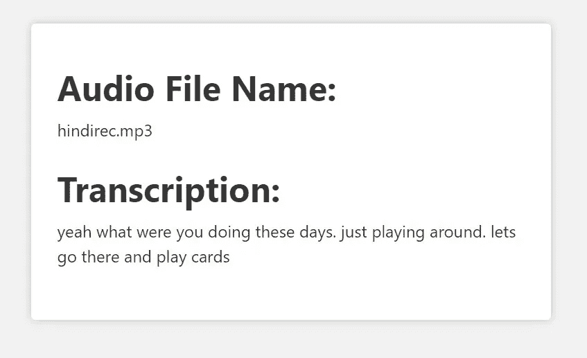

# 使用 Node.js 构建语音转文本网页应用

> 原文：[`towardsdatascience.com/build-a-speech-to-text-web-app-using-node-js-210f8c054d79`](https://towardsdatascience.com/build-a-speech-to-text-web-app-using-node-js-210f8c054d79)

## 我们来构建一个使用 OpenAI 的 Whisper 模型来转录和翻译音频的网页应用

[](https://shubhamstudent5.medium.com/?source=post_page-----210f8c054d79--------------------------------)[](https://towardsdatascience.com/?source=post_page-----210f8c054d79--------------------------------) [Kumar Shubham](https://shubhamstudent5.medium.com/?source=post_page-----210f8c054d79--------------------------------)

·发表于 [Towards Data Science](https://towardsdatascience.com/?source=post_page-----210f8c054d79--------------------------------) ·阅读时间 11 分钟·2023 年 3 月 27 日

--


图片由 [AltumCode](https://unsplash.com/@altumcode?utm_source=medium&utm_medium=referral) 提供，来源于 [Unsplash](https://unsplash.com/?utm_source=medium&utm_medium=referral)

大家好！希望你们一切都好。今天，我们将使用 Node.js 和 OpenAI 的 API 构建一个语音转文本网页应用。我们将使用 OpenAI 的 API 来使用其 Whisper 模型，该模型允许我们上传 mp3 格式的音频文件，并提供其文字稿。它甚至可以将其他语言的音频翻译成英文文本，实在令人惊叹。

首先，我们将设置一个新的 Node.js 项目，以便我们可以开始构建我们的应用。因此，我们将创建一个文件夹，在其中构建我们的项目，并使用命令行进入该文件夹，然后我们可以使用以下命令来设置一个新的 Node.js 项目：

```py
npm init
```

运行此命令后，它将询问一些问题，例如应用程序的名称、入口点等。我们现在可以将其保留为默认设置。之后，你会看到它创建了一个`package.json`文件。该文件包含有关我们应用程序的信息以及我们为该应用程序安装了哪些包。

接下来的一步是将必要的 Node 模块，即包，安装到我们的应用中，以便我们可以开始构建应用。我们可以通过运行以下命令来完成：

```py
npm install express multer openai cors --save
```

我们安装这四个包，并使用`--save`将这些包添加到`package.json`文件中。这使得克隆仓库的人只需运行一次`npm install`命令即可轻松安装所有所需的包。

我们还希望在应用程序中使用 nodemon 包，以帮助我们在检测到代码更改时自动刷新和重新加载服务器，这样我们就不需要在每次更改后手动重新启动服务器。因此，我们将其添加为开发依赖项，因为它只用于开发中的帮助，我们不会直接在代码中使用它。我们可以使用以下命令安装它：

```py
npm install --save-dev nodemon
```

现在我们拥有了开始开发所需的所有包。正如我们在`package.json`文件中看到的，里面列出了我们安装的所有模块和包，以及一些关于应用程序的细节。`package.json`文件应如下所示：

```py
{
  "name": "speechtext",
  "version": "1.0.0",
  "description": "",
  "main": "index.js",
  "scripts": {
    "test": "echo \"Error: no test specified\" && exit 1"
  },
  "author": "",
  "license": "ISC",
  "dependencies": {
    "cors": "².8.5",
    "express": "⁴.18.2",
    "multer": "¹.4.5-lts.1",
    "openai": "³.2.1"
  },
  "devDependencies": {
    "nodemon": "².0.22"
  }
}
```

所以，如我们所见，`index.js`是写在`main`中，表示`index.js`文件是我们应用程序的入口点。如果你还记得，这在我们运行`npm init`命令时的设置过程中有所要求。如果你将其留作默认设置，你将拥有相同的入口点；否则，你将拥有当时定义的入口点。

现在，我们将创建一个名为`index.js`的新文件。你可以根据自己定义的入口点命名文件。我们考虑使用`index.js`。

## index.js

所以，我们现在将开始构建`index.js`文件。我们将从将所需模块导入到我们的应用程序开始。对于索引文件，我们需要`express`和`cors`。因此，我们首先需要这两个模块：

```py
const express = require('express');
const cors = require('cors');
```

接下来，我们将创建一个新的`express`应用程序实例。同时，我们将设置应用程序以使用 cors，处理 json 数据，并使`public`文件夹包含静态文件，这些文件可以由客户端或前端访问。

```py
const app = express();
app.use(express.static('public'));
app.use(express.json());
app.use(cors());
```

接下来，我们希望有一个单独的文件来定义 API。我们将创建一个名为`routes`的文件夹，并在其中创建一个名为`api.js`的文件，在该文件中定义应用程序所需的 GET 和 POST API。为了让应用程序知道这一点，我们将添加这一行代码，以定义基本 URL 和所有 API 定义文件的位置。这是一个中间件，帮助我们设置应用程序的路由。

```py
app.use('/', require('./routes/api'));
```

接下来，我们使用一个错误处理的中间件函数，该函数将用于处理应用程序中发生的任何错误。

```py
app.use(function(err,req,res,next){
    res.status(422).send({error: err.message});
});
```

最后，我们设置应用程序以监听指定端口号的传入请求，我们可以通过使用环境变量来设置，或者直接定义。

```py
app.listen(process.env.PORT || 4000, function(){
    console.log('Ready to Go!');
});
```

我们为我们的应用程序使用了 4000 端口。我们还在其中添加了一个简单的`console.log`，当应用程序准备好接收请求时，它会在控制台上打印一条消息。

完整的`index.js`文件：

```py
const express = require('express');
const cors = require('cors');

const app = express();
app.use(express.static('public'));
app.use(express.json());
app.use(cors());

app.use('/', require('./routes/api'));

app.use(function(err,req,res,next){
    res.status(422).send({error: err.message});
});

app.listen(process.env.PORT || 4000, function(){
    console.log('Ready to Go!');
});
```

接下来，我们将转到`api.js`文件，该文件位于`routes`文件夹内。

## api.js

所以，我们现在将开始构建`api.js`文件。我们将通过将所需模块导入文件来开始。我们将导入`express`、`multer`和`openai`库。

```py
const express = require("express");
const multer = require("multer");
const { Configuration, OpenAIApi } = require("openai");
```

[Multer](https://www.npmjs.com/package/multer) 是一个中间件，我们使用它来处理 `multipart/form-data`，因为我们将处理音频文件的上传。

从 `openai` 中，我们需要 `Configuration` 和 `OpenAIApi` 模块，用于向 Whisper 模型发送 API 请求。

然后，我们将设置 express 路由器，并创建一个 multer 中间件的实例。

```py
const router = express.Router();
const upload = multer();
```

接下来，我们将配置 OpenAI 并创建一个新的配置实例。我们需要一个 OpenAI 密钥，我们必须在这里将其作为 API 密钥。你可以从 [这里](https://platform.openai.com/account/api-keys) 获取密钥。

```py
const configuration = new Configuration({
    apiKey: process.env.OPENAI_KEY,
});
```

现在，我们创建一个异步函数，该函数接受一个包含歌曲数据的缓冲区，并返回当我们调用 OpenAI 的 Whisper 模型 API 时收到的响应。

```py
async function transcribe(buffer) {
    const openai = new OpenAIApi(configuration);
    const response = await openai.createTranscription(
        buffer, // The audio file to transcribe.
        "whisper-1", // The model to use for transcription.
        undefined, // The prompt to use for transcription.
        'json', // The format of the transcription.
        1, // Temperature
        'en' // Language
    )
    return response;
}
```

如上所示，我们首先通过使用在代码中之前定义的配置创建 OpenAI 类的新实例。然后我们调用 OpenAI 的 `createTranscription` 函数，并在其中使用 `await` 关键字，以便我们在继续之前等待响应。

我们在函数中传递所需的参数，其中包括包含歌曲数据的缓冲区，以及用于转录的模型，在我们的情况下是 `whisper-1`。然后我们将 prompt 留空。如果愿意，你也可以提供一个 prompt，这将帮助模型通过提供与 prompt 类似的风格来更好地转录音频。我们将接收的数据类型定义为 `json`，将温度设置为 1，并定义我们希望输出的语言。

接下来，我们将定义 GET 请求。我们使用 `sendFile` 发送一个包含我们表单的 HTML 文件，用户可以在其中上传音频文件。我们稍后将构建这些 HTML 文件。我们将它提供在基本 URL 上。

```py
router.get("/", (req, res) => {
    res.sendFile(path.join(__dirname, "../public", "index.html"));
});
```

接下来，我们定义 POST 请求，它将处理音频文件的上传。我们使用 multer 中间件来管理文件上传部分。然后我们从音频文件创建一个缓冲区，该缓冲区将包含可以发送到 OpenAI API 的音频文件数据。我们使用上传音频文件的原始名称为缓冲区设置一个名称。

然后我们调用 `transcribe` 函数，一旦获得响应，我们将 JSON 数据发送回客户端。我们将转录文本和音频文件名返回到前端。我们还有一个 catch 方法来处理任何错误。

```py
router.post("/", upload.any('file'), (req, res) => {
    audio_file = req.files[0];
    buffer = audio_file.buffer;
    buffer.name = audio_file.originalname;
    const response = transcribe(buffer);
    response.then((data) => {
        res.send({ 
            type: "POST", 
            transcription: data.data.text,
            audioFileName: buffer.name
        });
    }).catch((err) => {
        res.send({ type: "POST", message: err });
    });
});
```

最后，我们导出 `router` 模块，这样其他文件就可以导入它们。

```py
module.exports = router;
```

所以，`api.js` 文件的完整代码是：

```py
const express = require("express");
const multer = require("multer");
const { Configuration, OpenAIApi } = require("openai");

const router = express.Router();
const upload = multer();

const configuration = new Configuration({
    apiKey: process.env.OPENAI_KEY,
});

async function transcribe(buffer) {
    const openai = new OpenAIApi(configuration);
    const response = await openai.createTranscription(
        buffer, // The audio file to transcribe.
        "whisper-1", // The model to use for transcription.
        undefined, // The prompt to use for transcription.
        'json', // The format of the transcription.
        1, // Temperature
        'en' // Language
    )
    return response;
}

router.get("/", (req, res) => {
    res.sendFile(path.join(__dirname, "../public", "index.html"));
});

router.post("/", upload.any('file'), (req, res) => {
    audio_file = req.files[0];
    buffer = audio_file.buffer;
    buffer.name = audio_file.originalname;
    const response = transcribe(buffer);
    response.then((data) => {
        res.send({ 
            type: "POST", 
            transcription: data.data.text,
            audioFileName: buffer.name
        });
    }).catch((err) => {
        res.send({ type: "POST", message: err });
    });
});

module.exports = router;
```

现在，我们已经完成了所有的后端部分。接下来我们将编写 HTML 文件和一些前端 JavaScript 代码，以处理表单提交和数据保存在 [本地存储](https://developer.mozilla.org/en-US/docs/Web/API/Window/localStorage) 以及从本地存储中检索数据。

我们创建一个 `public` 文件夹，在其中我们将创建两个 HTML 文件——`index.html` 和 `transcribe.html`。

我们将从 `index.html` 文件开始：

## index.html

在这个文件中，我们将构建一个页面，展示上传音频文件的表单。我们将使用 Bootstrap CSS，通过 CDN 引入它。我们还在 HTML 文件的末尾通过 CDN 引入 Bootstrap JS。

然后，我们创建了一个简单的卡片，要求用户上传音频文件。我确保提交的文件格式为`.mp3`，因为这是 OpenAI 的 API 唯一接受的格式。我们显示一个按钮，点击后提交表单。

然后，我们有了处理表单提交的 JavaScript 代码。所以，首先，我们通过阻止表单提交事件的默认行为来停止页面刷新。然后，我们获取表单数据，即音频文件，并将其作为 POST 请求发送到后台。接着，我们等待响应并将其存储在数据变量中。

如果数据中有可用的转录文本，我们将转录文本和音频文件名存储在本地存储中，以便在需要显示转录文本的下一页访问它们。虽然有多种方法可以传递信息，比如通过 URI 传递信息，但在这里我们使用本地存储来实现。

保存数据到本地存储后，我们更改窗口位置以加载`transcribe.html`文件。

```py
<!DOCTYPE html>
<html>
<head>
 <title>Speech to Text</title>
 <link href="https://cdn.jsdelivr.net/npm/bootstrap@5.3.0-alpha1/dist/css/bootstrap.min.css" rel="stylesheet" integrity="sha384-GLhlTQ8iRABdZLl6O3oVMWSktQOp6b7In1Zl3/Jr59b6EGGoI1aFkw7cmDA6j6gD" crossorigin="anonymous">
</head>

<body style="background-color: #f2f2f2;">
 <div class="container mt-5">
  <div class="row justify-content-center">
   <div class="col-md-6">
    <div class="card">
     <div class="card-header">
      Upload Audio File
     </div>
     <div class="card-body">
      <form id="transcription-form" enctype="multipart/form-data">
          <div class="form-group">
           <label for="file-upload"><b>Select file:</b></label>
           <input id="file-upload" type="file" name="file" class="form-control-file" accept=".mp3" style="margin-bottom: 20px">
          </div>
          <input type="submit" value="Transcribe" class="btn btn-primary"></input>
      </form>
     </div>
    </div>
   </div>
  </div>
 </div>

 <script>
        document.getElementById("transcription-form").addEventListener("submit", async function (event) {
            event.preventDefault();

            const formData = new FormData(event.target);
            const response = await fetch("/", {
                method: "POST",
                body: formData,
            });
            const data = await response.json();

            if (data.transcription) {
                localStorage.setItem("transcription", data.transcription);
                localStorage.setItem("audioFileName", data.audioFileName);
                window.location.href = "/transcribe.html";
            } 
   else {
                console.error("Error:", data.message);
            }
        });
    </script>

    <script src="https://cdn.jsdelivr.net/npm/bootstrap@5.3.0-alpha1/dist/js/bootstrap.bundle.min.js" integrity="sha384-w76AqPfDkMBDXo30jS1Sgez6pr3x5MlQ1ZAGC+nuZB+EYdgRZgiwxhTBTkF7CXvN" crossorigin="anonymous"></script>
</body>
</html>
```

所以上述代码构建了`index.html`文件，该文件将向用户显示一个表单，用户可以通过这个表单上传音频文件。

这是其中一个截图的效果：



音频上传页面 — index.html

接下来，我们将构建`transcribe.html`文件。

## transcribe.html

在这个文件中，我们将显示用户上传的音频文件的转录文本。因此，我们将再次使用 Bootstrap CSS 和 JS，通过 CDN 引入这些资源。

然后，我们定义了一些自定义 CSS 来美化元素，使其看起来更好。我们在一个容器中显示音频文件名和该音频文件的转录文本。

在此页面底部的 JavaScript 代码中，我们从本地存储中获取音频文件名和转录文本，并使用 id 将这些数据推送到相应的 HTML 元素中。

```py
<!DOCTYPE html>
<html>
<head>
 <title>Transcription</title>
 <link href="https://cdn.jsdelivr.net/npm/bootstrap@5.3.0-alpha1/dist/css/bootstrap.min.css" rel="stylesheet" integrity="sha384-GLhlTQ8iRABdZLl6O3oVMWSktQOp6b7In1Zl3/Jr59b6EGGoI1aFkw7cmDA6j6gD" crossorigin="anonymous">

 <style>
  h1 {
   margin-top: 20px;
   margin-bottom: 10px;
   font-size: 2.5rem;
   font-weight: bold;
   color: #333;
  }

  p {
   font-size: 1.2rem;
   color: #333;
   margin-bottom: 30px;
  }

  .container {
   margin-top: 50px;
   margin-bottom: 50px;
   max-width: 600px;
   padding: 30px;
   background-color: #fff;
   box-shadow: 0 0 10px rgba(0,0,0,0.2);
   border-radius: 5px;
  }
 </style>
</head>

<body style="background-color: #f2f2f2;">
 <div class="container">
  <h1>Audio File:</h1>
  <p id="audioFileName"></p>

  <h1>Transcription:</h1>
  <p id="transcription"></p>
 </div>

 <script src="https://cdn.jsdelivr.net/npm/bootstrap@5.3.0-alpha1/dist/js/bootstrap.bundle.min.js" integrity="sha384-w76AqPfDkMBDXo30jS1Sgez6pr3x5MlQ1ZAGC+nuZB+EYdgRZgiwxhTBTkF7CXvN" crossorigin="anonymous"></script>

 <script>
     const audioFileName = localStorage.getItem("audioFileName");
     const transcription = localStorage.getItem("transcription");
     document.getElementById("audioFileName").innerHTML = audioFileName;
     document.getElementById("transcription").innerHTML = transcription;
 </script>
</body>
</html>
```

我尝试了两个不同的小音频文件，一个是英语录制的，另一个是印地语录制的。虽然第二个音频文件是用印地语录制的，但我希望看到英语的输出，从而测试其翻译能力。它在转录两个音频文件时都非常准确。不过，在多次运行中，有时会产生不正确的模糊转录，但许多时候，转录结果大多是正确的。

我在下面附上了转录的屏幕截图。这些截图并不完全正确，但我认为它们的转录准确率大约为 85%–90%。



英语音频文件的转录



印地语音频文件的英语转录

因此，我们已经成功使用 OpenAI 的 API 和 Node.js 构建了一个语音转文本的 Web 应用程序。希望你喜欢构建这个应用，并从这篇文章中学到了一些新东西。你还可以调整参数进行实验，并比较结果，以更好地了解在不同场景下什么效果更好。

感谢阅读本文。接下来你必须阅读的一些文章包括：

[](https://javascript.plainenglish.io/build-a-simple-todo-app-using-next-js-f88b68761e27?source=post_page-----210f8c054d79--------------------------------) [## 使用 Next.js 构建一个简单的 Todo 应用

### 让我们使用 Next.js 构建一个简单的 Todo 应用，这将教会你 CRUD（创建、读取、更新和...

[如何使用 Next.js 构建一个简单的 Todo 应用](https://javascript.plainenglish.io/build-a-simple-todo-app-using-next-js-f88b68761e27?source=post_page-----210f8c054d79--------------------------------) [](https://medium.com/geekculture/how-to-implement-multiple-user-types-in-django-b72df7a98dc3?source=post_page-----210f8c054d79--------------------------------) [## 如何在 Django 中实现多用户类型

### 学习如何在 Django 中实现多用户类型，处理认证，并根据用户类型进行重定向。

[如何在 Django 中实现多用户类型](https://medium.com/geekculture/how-to-implement-multiple-user-types-in-django-b72df7a98dc3?source=post_page-----210f8c054d79--------------------------------) [](/build-a-simple-todo-app-using-react-a492adc9c8a4?source=post_page-----210f8c054d79--------------------------------) [## 使用 React 构建一个简单的 Todo 应用

### 让我们使用 React 构建一个简单的 Todo 应用，这将教会你 CRUD（创建、读取、更新和...

[使用 React 构建一个简单的 Todo 应用](https://towardsdatascience.com/build-a-simple-todo-app-using-react-a492adc9c8a4?source=post_page-----210f8c054d79--------------------------------) [](/build-a-social-media-website-using-django-setup-the-project-part-1-6e1932c9f221?source=post_page-----210f8c054d79--------------------------------) [## 使用 Django 构建一个社交媒体网站 — 项目设置（第一部分）

### 在第一部分中，我们专注于设置项目和安装所需组件，通过设置密码...

[构建一个社交媒体网站使用 Django — 项目设置（第一部分）](https://towardsdatascience.com/build-a-social-media-website-using-django-setup-the-project-part-1-6e1932c9f221?source=post_page-----210f8c054d79--------------------------------)
