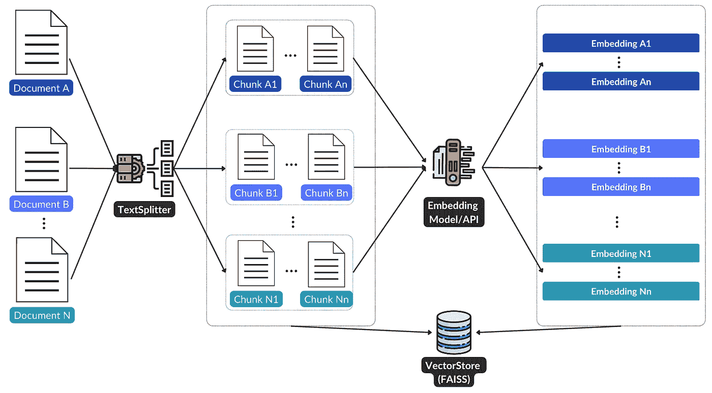
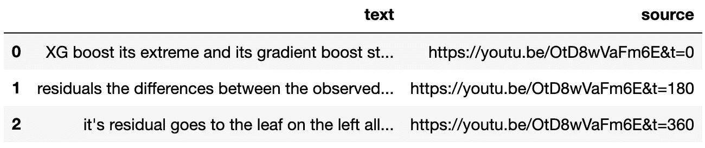
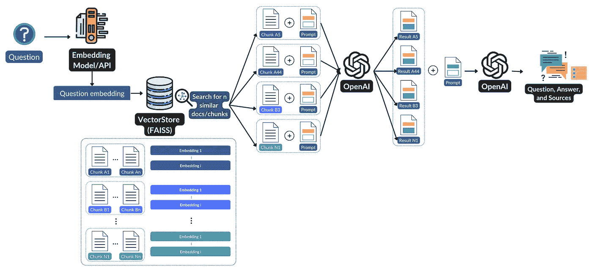

# 使用 LangChain 和 GPT-3 构建一个透明的文档问答机器人

> 原文：[`towardsdatascience.com/build-a-transparent-question-answering-bot-for-your-documents-with-langchain-and-gpt-3-7f6a71f379f8`](https://towardsdatascience.com/build-a-transparent-question-answering-bot-for-your-documents-with-langchain-and-gpt-3-7f6a71f379f8)

## 开发一个信息丰富的问答机器人指南，并显示所使用的来源

[](https://konstantin-rink.medium.com/?source=post_page-----7f6a71f379f8--------------------------------)[](https://towardsdatascience.com/?source=post_page-----7f6a71f379f8--------------------------------) [Konstantin Rink](https://konstantin-rink.medium.com/?source=post_page-----7f6a71f379f8--------------------------------)

·发表于[Towards Data Science](https://towardsdatascience.com/?source=post_page-----7f6a71f379f8--------------------------------) ·阅读时间 11 分钟·2023 年 7 月 22 日

--


图片由[Justin Ha](https://unsplash.com/@mekanizm?utm_source=unsplash&utm_medium=referral&utm_content=creditCopyText)拍摄，来源于[Unsplash](https://unsplash.com/de/fotos/XNn3SpMhiNE?utm_source=unsplash&utm_medium=referral&utm_content=creditCopyText)。

问答系统在分析大量数据或文档时可以大有帮助。然而，模型用来生成答案的来源（即文档的部分内容）通常不会在最终答案中显示。

理解回应的背景和来源不仅对寻求准确信息的用户有价值，也对希望持续改进其 QA 机器人（问答机器人的开发者）有帮助。通过回答中包含的来源，开发者可以深入了解模型的决策过程，从而促进迭代改进和微调。

**本文展示了如何使用 LangChain 和 GPT-3（text-davinci-003）创建一个透明的问答机器人，通过两个示例展示了生成答案时所使用的来源。**

在第一个示例中，你将学习如何创建一个透明的 QA 机器人，利用你的网站内容回答问题。在第二个示例中，我们将探讨使用来自不同 YouTube 视频的转录文本，包括带有和不带有时间戳的文本。

# 处理数据并创建向量存储

在我们能够利用像 GPT-3 这样的语言模型的能力之前，我们需要将文档（例如网站内容或 YouTube 转录文本）以正确的格式（首先分块，然后生成嵌入）处理，并将其存储在向量存储中。下图 1 展示了从左到右的处理流程。



图 1\. 数据处理和向量存储创建的流程图（图像来源于作者）。

## 网站内容示例

在这个示例中，我们将处理网络门户[*It’s FOSS*](https://itsfoss.com/)的内容，该门户专注于开源技术，特别是 Linux。

首先，我们需要获取一个**所有待处理的文章列表**并存储在我们的向量存储中。下面的代码读取了*sitemap-posts.xml*文件，该文件包含了所有文章的链接列表。

```py
import xmltodict
import requests

r = requests.get("https://news.itsfoss.com/sitemap-posts.xml")
xml = r.text
rss = xmltodict.parse(xml)

article_links = [entry["loc"] for entry in rss["urlset"]["url"]]
```

在本文撰写时，列表中包含了超过 969 个文章链接。

有了链接列表，我们现在可以编写一个小的**辅助函数**，称为`extract_content`，它使用`BeautifulSoup`从文章页面中提取包含相关内容的特定元素。

```py
from bs4 import BeautifulSoup
from tqdm.notebook import tqdm

def extract_content(url):
    html = requests.get(url).text
    soup = BeautifulSoup(html, features="html.parser")

    elements = [
        soup.select_one(".c-topper__headline"),
        soup.select_one(".c-topper__standfirst"),
        soup.select_one(".c-content"),
    ]

    text = "".join([element.get_text() for element in elements])

    return text

articles = []
# Limited the list of > 900 articles to 10 for this example
for url in tqdm(article_links[0:10], desc="Extracting article content"):
    articles.append({"source": url, "content": extract_content(url)})
```

最后一步，我们遍历链接列表，并将我们的辅助函数`extract_content`应用于每个 URL。为了演示目的，我将列表限制为 10 个元素。如果你想爬取所有文章，只需从`article_links[0:10]`中删除`[0:10]`。

`articles`列表现在包含每篇文章的字典，字典中包括`"source"`（文章链接）和`"content"`（文章内容）。文章的链接将在最终答案中作为来源显示。

由于 GPT-3 有一个**令牌限制**（4,096 个令牌），因此将长文章分成**块**是有意义的。这些块将被组合在一起并发送给 GPT-3。

下面的代码将文章内容拆分成几个块。

```py
from langchain.text_splitter import RecursiveCharacterTextSplitter

rec_splitter = RecursiveCharacterTextSplitter(chunk_size=1500, 
                                              chunk_overlap=150)

web_docs, meta = [], []

for article in tqdm(articles, desc="Splitting articles into chunks"):
    splits = rec_splitter.split_text(article["content"])
    web_docs.extend(splits)
    meta.extend([{"source": article["source"]}] * len(splits))
```

我们在这里使用`RecursiveCharacterTextSplitter`，因为它旨在尽可能长时间地**将语义相关的内容保持在一起**。

一旦完成，我们只需执行以下命令，将文章及其来源存储到我们的向量存储中。

```py
import os
from langchain.embeddings import OpenAIEmbeddings
from langchain.vectorstores import FAISS

os.environ["OPENAI_API_KEY"] = "YOUR KEY"

article_store = FAISS.from_texts(
    texts=web_docs, embedding=OpenAIEmbeddings(), metadatas=meta
)
```

在这个示例中，我们使用[FAISS](https://github.com/facebookresearch/faiss)作为**向量存储**，并使用`OpenAIEmbeddings`作为我们的嵌入模型。当然，也可以探索其他向量存储选项，例如[Chroma](https://github.com/chroma-core/chroma)，并尝试 Hugging Face 的嵌入模型解决方案。

> **注意**：你还可以通过运行`article_store.save_local("your_name")`来保存你的向量存储，这样你就不必每次使用时都重新创建它。更多详情见[这里](https://python.langchain.com/docs/modules/data_connection/vectorstores/integrations/faiss#saving-and-loading)。

如果你**不想处理 YouTube 转录内容**，你可以**跳过下面的部分**并**继续到下一节**“运行透明问答”。

## YouTube 转录示例

转录内容可以通过两种不同且独立的方式处理。**第一个选项**演示了如何处理 YouTube 转录内容，同时**保留视频链接**作为来源（例如，[`youtu.be/XYZ`](https://youtu.be/XYZ)。）。

**第二部分**做了同样的事情，但说明了如何**保留链接**，**包括时间戳**（例如，`https://youtu.be/XYZ&t=60`）以获取更详细的信息。

对于这两种方法，使用了来自频道[StatQuest](https://www.youtube.com/@statquest/featured)的以下 YouTube 视频的转录：

+   [XGBoost 第一部分（共 4 部分）：回归](https://youtu.be/OtD8wVaFm6E)

+   [XGBoost 第二部分（共 4 部分）：分类](https://youtu.be/8b1JEDvenQU)

+   [XGBoost 第三部分（共 4 部分）：数学细节](https://www.youtube.com/watch?v=ZVFeW798-2I)

+   [XGBoost 第四部分（共 4 部分）：疯狂酷炫的优化](https://youtu.be/oRrKeUCEbq8)

## **YouTube 转录示例（不带时间戳）**

第一部分非常直接。下面的代码利用了 LangChain 的 DocumentLoader `YoutubeLoader`，它集成了[youtube-transcript-api](https://pypi.org/project/youtube-transcript-api/)和[pytube](https://pytube.io/en/latest/)。

```py
from langchain.document_loaders import YoutubeLoader
from langchain.embeddings import OpenAIEmbeddings
from langchain.text_splitter import CharacterTextSplitter
from langchain.vectorstores import FAISS
import os

os.environ["OPENAI_API_KEY"] = "YOUR KEY"

yt_ids = [
    "OtD8wVaFm6E",  # XGBoost Part 1 (of 4): Regression
    "8b1JEDvenQU",  # XGBoost Part 2 (of 4): Classification
    "ZVFeW798-2I",  # XGBoost Part 3 (of 4): Mathematical Details
    "oRrKeUCEbq8",  # XGBoost Part 4 (of 4): Crazy Cool Optimizations
]

yt_docs = []

for yt_id in tqdm(yt_ids, desc="Retrieving transcripts"):
    splitter = CharacterTextSplitter(chunk_size=1500, chunk_overlap=150, 
                                     separator=" ")
    yt_loader = YoutubeLoader(yt_id, add_video_info=True)
    yt_docs.extend(yt_loader.load_and_split(splitter))
```

为了避免与令牌限制发生冲突，我们使用`CharacterTextSplitter`将数据拆分为几个块。`add_video_info`设置为*True*，以**接收视频的标题和作者信息**。

返回的分块转录是[文档](https://api.python.langchain.com/en/latest/schema/langchain.schema.document.Document.html?highlight=document#langchain.schema.document.Document)对象。在创建嵌入并将其存储在向量存储中之前，我们通过添加有关*标题*、*作者*和*视频链接*的信息来操作或扩展它们的元数据。

```py
# Manipulate / extend source attribute
for doc in yt_docs:
    doc.metadata["source"] = (
        doc.metadata["title"]
        + " ["
        + doc.metadata["author"]
        + "] "
        + "https://youtu.be/"
        + doc.metadata["source"]
    )

# Vector store
yt_store = FAISS.from_documents(yt_docs, OpenAIEmbeddings())
```

## YouTube 转录示例（带时间戳）

第二种方法稍微**复杂一些**。在这里，我们使用名为[youtube-transcript-api](https://pypi.org/project/youtube-transcript-api/)的不同包来检索转录。输出是一个包含文本、开始时间和持续时间的字典列表。我们需要切换到不同的包，因为`YoutubeLoader`包不返回时间戳。

示例可以在这里看到：

```py
[
 {'text': "gonna talk about XG boost part 1 we're",
  'start': 14.19,
  'duration': 6.21},
 {'text': 'gonna talk about XG boost trees and how',
  'start': 17.91,
  'duration': 6.66},
...
]
```

从每个文本条目创建文档对象没有多大意义，因为条目**太短**（例如，上述示例中每个条目只有 8 个单词），不便于后续使用。在向量存储中搜索时，只返回有限数量的匹配文档（例如，4 个），信息内容不足。

因此，我们需要首先将文本条目聚合或合并成适当的文本块。下面的代码片段包含一个自定义助手函数。

```py
# Create transcript df
def create_transcript_df(yt_transcript: list, yt_id: str):
    return (
        pd.DataFrame(yt_transcript)
        .assign(start_dt=lambda x: pd.to_datetime(x["start"], unit="s"))
        .set_index("start_dt")
        .resample("3min")
        .agg({"text": " ".join})
        .reset_index()
        .assign(start_dt=lambda x: x["start_dt"].dt.minute * 60)
        .assign(
            source=lambda x: "https://youtu.be/"
            + yt_id
            + "&t="
            + x["start_dt"].astype("str")
        )
        .drop(columns=["start_dt"])
    )
```

该助手应用**重采样**来调整时间**维度为 3 分钟步长**。换句话说，它**将转录合并为 3 分钟的文本部分**。有了这个功能，我们现在可以开始获取和处理转录。

```py
from youtube_transcript_api import YouTubeTranscriptApi

yt_ids = [
    "OtD8wVaFm6E",  # XGBoost Part 1 (of 4): Regression
    "8b1JEDvenQU",  # XGBoost Part 2 (of 4): Classification
    "ZVFeW798-2I",  # XGBoost Part 3 (of 4): Mathematical Details
    "oRrKeUCEbq8",  # XGBoost Part 4 (of 4): Crazy Cool Optimizations
]
transcript_dfs = []
for yt_id in tqdm(yt_ids, desc="Fetching transcription"):
    yt_transcript = YouTubeTranscriptApi.get_transcript(yt_id)
    transcript_dfs.append(create_transcript_df(yt_transcript, yt_id))

transcripts_df = pd.concat(transcript_dfs).reset_index(drop=True)
```

结果的摘录可以在下图中看到。



图 2. 转录数据框的摘录（图片由作者提供）。

由于合并的 3 分钟部分现在可能会导致令牌限制问题，我们需要在生成嵌入并将其存储在向量存储中之前，使用**分割器**再次处理它们。

```py
from langchain.embeddings import OpenAIEmbeddings
from langchain.text_splitter import CharacterTextSplitter
from langchain.vectorstores import FAISS
import os

os.environ["OPENAI_API_KEY"] = "YOUR KEY"

text_splitter = CharacterTextSplitter(separator=" ", chunk_size=1500, 
                                      chunk_overlap=150)

yt_docs, yt_meta = [], []

for index, row in tqdm(transcripts_df.iterrows(), total=len(transcripts_df)):
    splits = text_splitter.split_text(row["text"])
    yt_docs.extend(splits)
    yt_meta.extend([{"source": row["source"]}] * len(splits))
    print(f"Split {row['source']} into {len(splits)} chunks")

yt_ts_store = FAISS.from_texts(yt_docs, OpenAIEmbeddings(), metadatas=yt_meta)
```

# 运行透明问答

有了填充的向量存储后，我们现在可以专注于**透明问答**。下面的图给出了该过程的概述。



图 3\. 透明问答过程概述（图片由作者提供）。

我们首先**定义一个问题**，然后由嵌入模型或 API**转换**为嵌入。向量存储利用这个问题嵌入来搜索存储中的’n’（默认：4）**相似文档或片段**。随后，将**每个文档或片段的内容与提示组合**并发送到 GPT-3。

GPT-3 返回的结果然后**与另一个提示组合**，在**最后一步再次发送回 GPT-3**以获取最终答案，包括来源。

## 网站内容示例

在使用`RetrievalQAWithSourcesChain`之前，我们确保通过实施记忆使我们的机器人**记住**之前的对话。这增强了与用户的上下文相关互动。

```py
from langchain.memory import ConversationBufferMemory

memory = ConversationBufferMemory(
    memory_key="chat_history",
    input_key="question",
    output_key="answer",
    return_messages=True,
)
```

为了将之前的聊天记录整合到使用的提示中，我们需要修改现有的模板。

```py
from langchain import PromptTemplate

template = """You are a chatbot having a conversation with a human.
Given the following extracted parts of a long document and a question, 
create a final answer.
{context}
{chat_history}
Human: {question}
Chatbot:"""

question_prompt = PromptTemplate(
    input_variables=["chat_history", "question", "context"], template=template
)
```

之后，我们可以利用 `RetrievalQAWithSourcesChain` 来提问。在这个示例中，我们设置**k=4**，这意味着我们将查询向量存储以获取 4 个最相似的文档。

```py
from langchain.chains import RetrievalQAWithSourcesChain

article_chain = RetrievalQAWithSourcesChain.from_llm(
    llm=OpenAI(temperature=0.0),
    retriever=article_store.as_retriever(k=4),
    memory=memory,
    question_prompt=question_prompt,
)

result = article_chain({"question": "What is Skiff?"}, 
                        return_only_outputs=True)
```

结果以字典形式返回：

```py
{'question': 'What is Skiff?',
 'answer':   'Skiff is a privacy-focused email service with unique 
              functionalities such as the ability to manage multiple 
              sessions, appearance tweaks, dark mode, white theme, 
              two layouts, supporting imports from Gmail, Outlook, 
              Proton Mail, and more, creating and managing aliases, 
              and connecting a crypto wallet from Coinbase, BitKeep, 
              Brave, and others to send/receive email utilizing Web3\. 
              It also includes Pages to create/store documents securely, 
              the ability to use Skiff's server or IPFS (decentralized 
              technology) for file storage, and Skiff Pages, 
              Encrypted Cloud Storage With IPFS Support.\n',
 'sources': 'https://news.itsfoss.com/skiff-mail-review/'}
```

我们可以观察到，结果包含了回答给定问题所用的来源。为了生成这个最终答案，API 被调用了**5 次**：4 次提取最相似的 4 个片段中的相关信息，额外 1 次生成最终答案。

我们还可以提出引用**之前问题**的问题。

```py
article_chain(
    {"question": "What are its functionalities?"},
    return_only_outputs=True,
)
```

结果将如下所示。

```py
{
'answer': "Skiff offers a range of functionalities, 
including Web3 integration, IPFS decentralized storage, 
creating and managing aliases, connecting crypto wallets, 
getting credits to upgrade your account, importing from Gmail, 
Outlook, Proton Mail, and more, Pages to create/store documents securely, 
encrypted cloud storage with IPFS support, and the ability to use 
Skiff's server or IPFS (decentralized technology) for file storage.\n",
 'sources': 'https://news.itsfoss.com/anytype-open-beta/, 
             https://news.itsfoss.com/skiff-mail-review/'
}
```

**请记住，对于这些问题，API 也被调用了 5 次。**

## YouTube 转录示例（有时间戳和没有时间戳）

YouTube 转录示例的代码与网站的代码非常相似。首先，我们初始化 ConversationBufferMemory，并创建一个自定义问题提示模板。

```py
from langchain.memory import ConversationBufferMemory

memory = ConversationBufferMemory(
    memory_key="chat_history",
    input_key="question",
    output_key="answer",
    return_messages=True,
)

template = """You are a chatbot having a conversation with a human.
    Given the following extracted parts of a long document and a question, 
    create a final answer.
    {context}
    {chat_history}
    Human: {question}
    Chatbot:"""

question_prompt = PromptTemplate(
    input_variables=["chat_history", "question", "context"], template=template
)
```

然后我们创建带有来源的 QA 链。

```py
# Use yt_store for YouTube transcripts without timestamps or
# yt_ts_store with timestamps as sources.
yt_chain = RetrievalQAWithSourcesChain.from_llm(
    llm=OpenAI(temperature=0.0),
    retriever=yt_store.as_retriever(k=4),
    memory=memory,
    question_prompt=question_prompt,
)
```

让我们问一个问题。

```py
result = yt_chain(
    {
        "question": "What is the difference in building a tree for a 
                     regression case compared to a classification case?"
    },
    return_only_outputs=True
)
```

不带时间戳的示例结果：

```py
{'answer': ' The main difference between building a tree for a regression case 
              and a classification case is that in a regression case, the goal 
              is to predict a continuous value, while in a classification case,
              the goal is to predict a discrete value. In a regression case, 
              the tree is built by splitting the data into subsets based on 
              the value of a certain feature, while in a classification case, 
              the tree is built by splitting the data into subsets based on 
              the value of a certain feature and the class label. 
              Additionally, in a regression case, 
              the weights are all equal to one, 
              while in a classification case, the weights are the previous 
              probability times one minus the previous probability.\n',
 'sources': 'XGBoost Part 2 (of 4): Classification [StatQuest with Josh Starmer] https://youtu.be/8b1JEDvenQU, 
             XGBoost Part 3 (of 4): Mathematical Details [StatQuest with Josh Starmer] https://youtu.be/ZVFeW798-2I, 
             XGBoost Part 4 (of 4): Crazy Cool Optimizations [StatQuest with Josh Starmer] https://youtu.be/oRrKeUCEbq8'
}
```

带时间戳的示例结果：

```py
{'answer': 'The difference in building a tree for a regression case compared 
            to a classification case is that in a regression case, the goal 
            is to predict a continuous value, while in a classification case, 
            the goal is to predict a probability that the drug will be 
            effective. Additionally, the numerator for classification is the 
            same as the numerator for regression, but the denominator 
            contains a regularization parameter. The denominator for 
            classification is different from the denominator for regression, 
            and is the sum for each observation of the previously predicted 
            probability times 1 minus the previously predicted probability. 
            The only difference between building a tree for a regression case 
            and a classification case is the loss function.\n',
 'sources': 'https://youtu.be/ZVFeW798-2I&t=0 
             https://youtu.be/8b1JEDvenQU&t=180
             https://youtu.be/OtD8wVaFm6E&t=0'
}
```

# 结论

LangChain 的 RetrievalQAWithSourcesChain 和 GPT-3 的结合非常适合提高问答的透明度。正如过程图所示（图 3），获取最终答案需要**多次调用** OpenAI。

根据你使用服务的情况和需要处理的类似文档数量，调用次数可能会增加，**导致更高的费用**。这确实值得关注。不过，对于你的爱好项目来说，这不应该太关键。为了更好地关注费用和发送的提示，可以考虑使用 [Promptlayer](https://promptlayer.com/home) 或 [TruLens](https://medium.com/towards-artificial-intelligence/evaluate-and-monitor-the-experiments-with-your-llm-app-df391c0f51c9)。

Colab 笔记本可以在这里找到：

+   [网站示例](https://github.com/darinkist/Medium-Article-Transparent-Question-Answering-Bot/blob/main/CodeForArticleWebsiteExample.ipynb)

+   [YouTube 示例](https://github.com/darinkist/Medium-Article-Transparent-Question-Answering-Bot/blob/main/CodeForArticleYouTubeExample.ipynb)

# 资料来源

+   **LangChain RetrievalQAWithSourcesChain API 文档** [`api.python.langchain.com/en/latest/chains/langchain.chains.qa_with_sources.retrieval.RetrievalQAWithSourcesChain.html`](https://api.python.langchain.com/en/latest/chains/langchain.chains.qa_with_sources.retrieval.RetrievalQAWithSourcesChain.html)

*所有者或创作者已经提前询问是否允许我将他们的内容/数据用作本文的示例。*

+   It’s FOSS., “It’s FOSS”, [`itsfoss.com/`](https://itsfoss.com/)

+   StatQuest. “XGBoost 第一部分（共 4 部分）：回归” *YouTube,* Joshua Starmer, 2019 年 12 月 16 日, [`youtu.be/OtD8wVaFm6E`](https://youtu.be/OtD8wVaFm6E)。

+   StatQuest. “XGBoost 第二部分（共 4 部分）：分类” *YouTube,* Joshua Starmer, 2020 年 1 月 13 日, [`youtu.be/8b1JEDvenQU`](https://youtu.be/8b1JEDvenQU)。

+   StatQuest. “XGBoost 第三部分（共 4 部分）：数学细节” *YouTube,* Joshua Starmer, 2020 年 2 月 10 日, [`youtu.be/ZVFeW798-2I`](https://youtu.be/ZVFeW798-2I)。

+   StatQuest. “XGBoost 第四部分（共 4 部分）：疯狂炫酷的优化” *YouTube,* Joshua Starmer, 2020 年 3 月 2 日, [`youtu.be/oRrKeUCEbq8`](https://youtu.be/oRrKeUCEbq8)。
