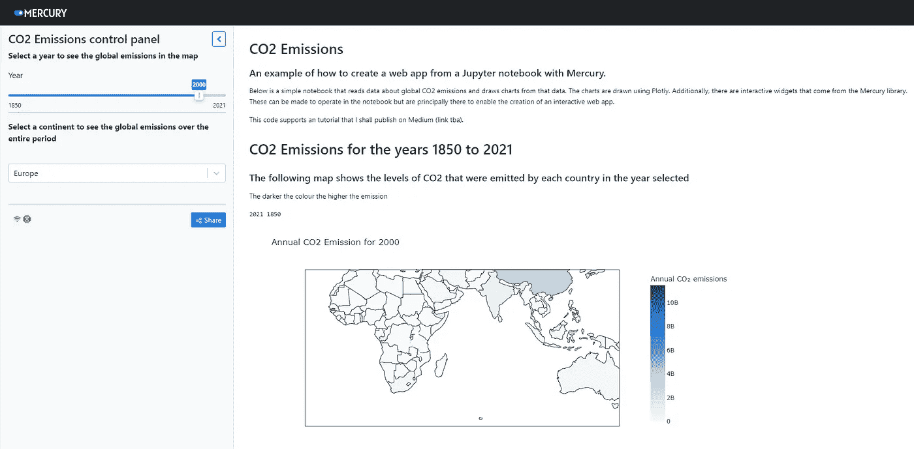
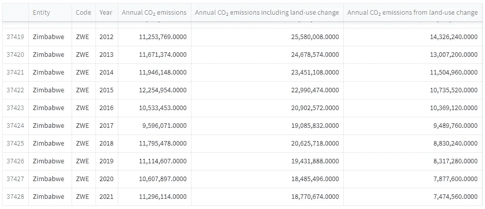
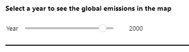
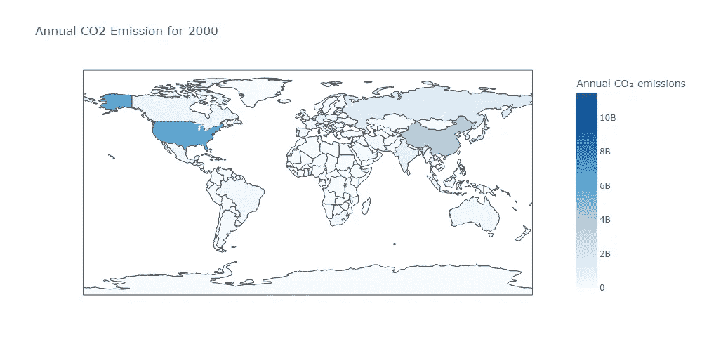
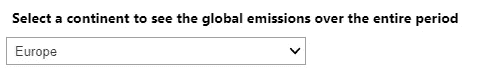
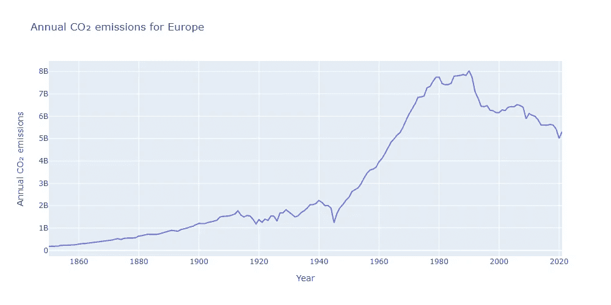
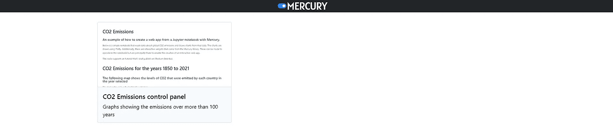
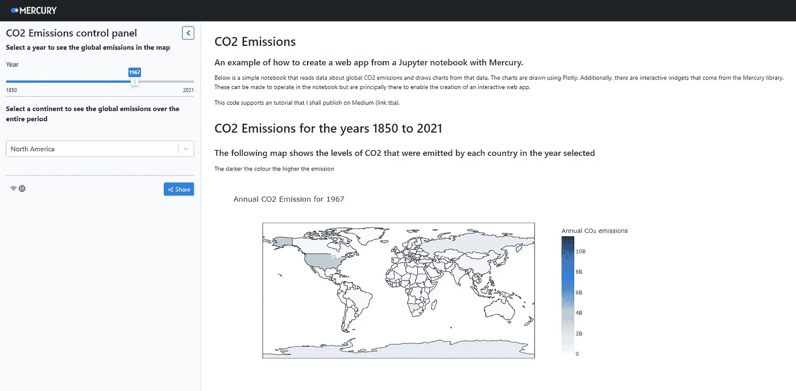

# 用 Jupyter 和 Mercury 构建 Web 应用

> 原文：[`towardsdatascience.com/build-a-web-app-with-jupyter-and-mercury-9d59661441b7`](https://towardsdatascience.com/build-a-web-app-with-jupyter-and-mercury-9d59661441b7)

## 教程

## Mercury 提供了一种简单的方法，将 Jupyter Notebooks 转换为互动式 Web 应用。

[](https://medium.com/@alan-jones?source=post_page-----9d59661441b7--------------------------------)[](https://towardsdatascience.com/?source=post_page-----9d59661441b7--------------------------------) [Alan Jones](https://medium.com/@alan-jones?source=post_page-----9d59661441b7--------------------------------)

·发布于 [Towards Data Science](https://towardsdatascience.com/?source=post_page-----9d59661441b7--------------------------------) ·阅读时间 10 分钟·2023 年 5 月 9 日

--


我在提及代码开发还是 CO2 排放？照片由 [Etienne Girardet](https://unsplash.com/@etiennegirardet?utm_source=medium&utm_medium=referral) 供稿于 [Unsplash](https://unsplash.com/?utm_source=medium&utm_medium=referral)

如果没有 Jupyter Notebooks，我们将会处于何地？它们无疑是数据科学社区的基石之一。

它们非常适合原型设计和/或逐步构建和展示数据科学应用，但在演示方面不太好。

如果你想将你的工作结果展示给利益相关者，但不想展示所有聪明的代码，那么你可以用 Streamlit 或 Dash 重新编码所有内容，或者用 Flask 或 Django 构建一个 Web 应用。

但还有一种替代方案。

Mercury 是一个可以将你的 Notebook 转换为完全互动的 Web 应用的系统。你可以添加滑块和选择框等控件，制作一个完全互动的应用程序。

这完全是 100% Python 和相当简单，尽管结果比起其他工具可能少了些复杂性，但如果你寻找的是一个简单的解决方案，值得一看。

# 一个示例应用

我们将创建的应用将如下图所示。



图片由作者提供

你可以看到它由两部分组成：一个包含文本和输入控件的小侧边栏——一个滑块和一个选择框；以及一个包含笔记本代码输出的主窗口。所有 Mercury 应用都遵循这种模式，即小侧边栏包含控件，而主窗口显示代码输出。

你看到的地图是一个显示国家 CO2 排放量随时间变化的分级图。侧边栏中的滑块用于选择正确的年份。

在主窗口向下滚动，你将看到一条折线图，展示了某个大陆随时间变化的排放输出。大陆可以从侧边栏的选择框中选择。

每当输入组件的值发生变化时，代码会重新运行，并显示图表的新版本。

# Mercury V.2

我在大约一年前首次查看了 Mercury，并喜欢从你已经用 Jupyter 编写的代码创建 Web 应用程序的简单性。

在过去的一年里有很多分心的事物（PyScript、Streamlit 以及一些大家似乎都在谈论的 AI 应用程序），但我终于重新审视了 Mercury，并且有了一些变化。

主要的是，版本 2 具有支持与应用程序交互的组件。这些替代了版本 1 中有些笨重的 YAML 定义，并且与版本 1 不同，它们可以在 Jupyter Notebook 以及应用程序中操作。

在这篇文章中，我将使用开源版本构建一个应用程序，这意味着你的应用程序将带有 Mercury 品牌（也提供商业许可证）。

# 首先，编写一个 Notebook

我们将逐步构建 Notebook 单元格，然后将其转换为 Web 应用程序。

但首先，安装 Mercury 库。

```py
pip install mercury
```

我将在最后提供源代码和数据的链接，但如果你想跟随教程，你需要创建一个新的 Jupyter Notebook 并安装以下库：

```py
import mercury as mr
import plotly.express as px
import pandas as pd
```

这，当然，是你的第一个单元格。

下一个完全关注于 Mercury，并且在 Notebook 中不会输出任何重要内容。

```py
# set Application parameters
app = mr.App(title="CO2 Emissions control panel",
        description="Graphs showing the emissions over more than 100 years",
        show_code=False,
        show_prompt=False,
        continuous_update=True,
        static_notebook=False,
        show_sidebar=True,
        full_screen=True,
        allow_download=False)
```

此单元格在 Mercury 创建应用程序的 Web 版本时设置一些信息。前两个字段是不言而喻的，这些数据会在 Mercury 版本中显示。如果你愿意接受其余字段的默认值，那么这些就是你需要包括的唯一字段。

作为参考，这里列出了所有参数及其用途。

+   **title** (*string*) — 应用程序的标题

+   **description** (*string*) — 应用程序的描述

+   **show_code** (*boolean*) — 设置为`True`以在应用程序中显示 Notebook 代码。默认值为`False`。

+   **show_prompt** (*boolean*) — 如果你希望在应用程序中显示 Notebook 提示，请将此值设置为`True` — `show_code`也需要设置为`True`。默认值为`False`。

+   **continuous_update** (*boolean*) — 默认值为`True`，意味着在输入组件值变化后，应用程序会重新运行。如果设置为`False`，将显示一个*运行*按钮，用于用更新后的组件数据重新运行应用程序。

+   **static_notebook** (*boolean*) — 设置为`True`时，应用程序在组件值变化时不会重新运行，Notebook 是静态的。默认值为`False`，即为交互式应用程序。

+   **show_sidebar** (*boolean*) — 应用程序由主显示和侧边栏组成，默认情况下在启动时显示。用户在应用程序运行时可以随时打开或关闭侧边栏。

+   **full_screen** (*布尔值*)——默认值为`True`，表示笔记本全宽显示。设置为`False`将笔记本宽度限制为 1140px。

+   **allow_download** (*布尔值*)——默认情况下有一个*下载*按钮，可以将结果导出为 PDF 或 HTML。你可以通过设置`allow_download=False`来隐藏这个按钮。

现在，我们需要下载一些数据。这里是下一个单元格。

```py
# Get the data
def get_countries_data(): 
    url = "./data/countries_df.csv"
    return pd.read_csv(url)
def get_continent_data():
    url = './data/continents_df.csv'
    return pd.read_csv(url)
def get_world_data():
    url = './data/world_df.csv'
    return pd.read_csv(url)
def get_group_data():
    url = './data/income_types_df.csv'
    return pd.read_csv(url)

df_countries= get_countries_data()
df_continents= get_continent_data()
df_world = get_world_data()
df_groups = get_group_data()
```

我们从本地目录加载数据到 Pandas 数据框中。这些数据记录了几十年来的二氧化碳排放情况，按国家、洲和收入组分类。

每个数据框看起来类似于下面的表格。



作者提供的图片

它们包含以下列：

+   *实体*：国家、大洲、收入组或‘世界’

+   *代码*：ISO 国家代码（如果它是国家）

+   *年份*

+   *年度二氧化碳排放量*：来自燃烧化石燃料和工业过程

+   *包括土地利用变化的年度二氧化碳排放量*：前一列和下一列的总和

+   *土地利用变化导致的年度二氧化碳排放量*

这是公开可用的数据，你可以从多个来源下载，例如，*我们的世界数据*¹。

这里的数据比我们实际需要的稍多——我们将在这个练习中使用前两个数据框，并仅使用部分列。

## **小部件**

有许多可用于输入和输出的小部件。我们只会查看其中的几个，但完整列表可以在[Mercury 文档](https://runmercury.com/docs/)中找到。

这是包含选择年份滑块的小部件的单元格。

```py
mr.Note(text="__Select a year to see the global emissions in the map__")

ymax = df_countries['Year'].max()
ymin = df_countries['Year'].min()

yearSlider = mr.Slider(value=2000, min=ymin, max=ymax, label="Year", step=1)

mr.Note(text="---")
```

在第一行，我们看到一个输出小部件`mr.Note`，它简单地显示 Markdown 文本。这里我们用它来提示用户从滑块中选择一个年份。然后我们计算数据中的年份范围，并使用这些值来显示滑块。

滑块小部件的参数比较自解释：我们从默认值开始，然后是最大值和最小值，标签，最后是步长值。

从小部件返回的值实际上是一个小部件对象。要从该对象中获取值，我们必须使用`.value`属性，如下所示。

最后一行是另一条 Markdown 字符串——一条将滑块与下方的小部件分开的线。

在 Jupyter 中，输出位于单元格下方，通常，你会看到文本和一个完全可操作的简单滑块，值会按预期变化。



笔记本中的滑块小部件——作者提供的图片

当我们将其转换为应用程序时，滑块将位于侧边栏中。

下一个单元格显示地图。我们首先从滑块对象中获取年份值，然后计算二氧化碳排放范围的最大值和最小值。然后，我们使用 Plotly 计算分级地图并显示它。

```py
# Get the year and find the maximum and minimum values to set the range for the choropleth
year = yearSlider.value
max = df_countries['Annual CO₂ emissions'].max()
min = df_countries['Annual CO₂ emissions'].min()

fig1 = px.choropleth(df_countries[df_countries['Year']==year], 
                    locations="Code",
                    color="Annual CO₂ emissions",
                    hover_name="Entity",
                    range_color=(min,max),
                    color_continuous_scale=px.colors.sequential.Blues,
                    width=1000, height=500,
                    title = f"Annual CO2 Emission for {year}")

fig1.show()
```

地图看起来如下图所示。



作者提供的图片

## 另一个小部件

按照之前类似的模式。首先是一个指令，然后我们从数据框的*Entity*列中计算出所有大陆的唯一列表。

这次我们使用选择小部件`mr.Select`

该功能接受一个默认值、一个可供选择的列表和一个标签作为参数。

```py
mr.Note(text=f"__Select a continent to see the global emissions over the entire period__")

continents = df_continents['Entity'].unique()

select = mr.Select(value="Europe", choices=continents, label="")
selected_continent = select.value
```

单元格的输出如下图所示。但同样，在应用程序中，它将出现在侧边栏中。



笔记本中的选择框小部件——由作者提供的图片

然后我们使用选择框中的值来绘制适当的折线图。我们通过使用该值过滤数据框，以便仅返回所选大陆的数据。然后使用这些数据绘制图表。

```py
df = df_continents[df_continents['Entity'] == selected_continent]

fig2 = px.line(df,"Year","Annual CO₂ emissions", 
               width=1000, height=500,
               title=f"Annual CO₂ emissions for {selected_continent}")

fig2.show()
```

图表看起来像下面的图片。



由作者提供的图片

这可能听起来很明显，但如果你运行整个笔记本，你将得到与小部件的默认值对应的结果。要更改小部件值并获得具有新值的相应图表，你需要逐个单元格运行笔记本。

还有其他小部件，如输入文本或数字值的字段、按钮和复选框——详情请参见[文档](https://runmercury.com/docs/)。

这就是 Jupyter Notebook 的所有内容。现在来创建一个网络应用程序。

# 创建一个网络应用程序

从命令提示符导航到包含笔记本的目录并输入：

```py
mercury run
```

这将拾取该目录中的所有笔记本，并运行一个类似下面的网页，其中包含每个笔记本的面板。



由作者提供的图片

在我的情况下，只有一个笔记本——我们刚刚看到的那个——当你点击它时，它将运行应用程序。

提醒你它是这样的。



由作者提供的图片

你可以看到，小部件比笔记本中显示的要更具吸引力，并且它们出现在侧边栏中。

应用程序是完全交互式的：当你更改小部件值时，小部件下方的所有笔记本单元都会重新运行。因此，改变滑块会更新地图，选择框的选择更改时，图表会重新绘制。

我不得不承认这里有点作弊。Mercury 复制了一些演示应用程序，并创建了一个名为*welcome.md*的文件，其中包含欢迎信息。虽然这些对初学者很有用，但为了清晰和简单，我已经删除了笔记本文件夹中的笔记本，并从*welcome.md*中删除了所有内容。

## 结果

结果是一个简单但功能齐全的应用程序。

缺点是 Mercury 应用程序始终具有相同的布局——一个包含小部件的侧边栏和一个显示代码结果的主窗口。此外，主窗口有一个简单的线性布局，无法更改。

这并不是很灵活，虽然对许多目的来说足够，但你可以通过像 Streamlit 或 Dash 这样的替代应用构建工具创建更复杂的布局。

总的来说，如果你乐意在 Jupyter Notebooks 中编写 Python，那么 Mercury 的学习曲线几乎可以忽略不计。而且，尽管结果不如其他应用构建器那样灵活，但转换为应用的过程和在终端窗口中输入一个命令一样简单。

当然，我们的应用正在我们本地机器上的专用服务器上运行。在网上发布则是另一回事，我会在以后查看发布选项。

与此同时，感谢阅读，希望这对你有帮助。本文的代码和数据可以在我的[网页](http://alanjones2.github.io)上找到，此外还有一个演示应用的链接和如何在 Mercury Cloud 上发布应用的说明。你也可以在那里看到我其他工作的链接，并且可以注册我的偶尔新闻通讯。

# 说明

[1] [我们的数据世界](https://ourworldindata.org/) 是一个信息宝库，其使命是发布*“研究和数据以应对世界上最大的难题”*。他们的所有工作都在[创作共用 BY 许可协议](https://creativecommons.org/licenses/by/4.0/)下提供。

*免责声明：我与 Mercury 没有关联。*
