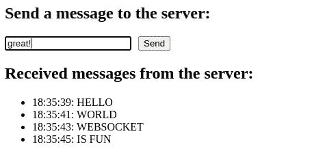

# 使用 FastAPI 和 Angular 构建 WebSocket 应用程序

> 原文：[`towardsdatascience.com/build-a-websocket-application-with-fastapi-and-angular-988157dce554`](https://towardsdatascience.com/build-a-websocket-application-with-fastapi-and-angular-988157dce554)

## 学习如何使用 WebSocket 协议构建双向交互通信应用程序

[](https://lynn-kwong.medium.com/?source=post_page-----988157dce554--------------------------------)[](https://towardsdatascience.com/?source=post_page-----988157dce554--------------------------------) [Lynn G. Kwong](https://lynn-kwong.medium.com/?source=post_page-----988157dce554--------------------------------)

·发表在 [Towards Data Science](https://towardsdatascience.com/?source=post_page-----988157dce554--------------------------------) ·7 分钟阅读·2023 年 1 月 30 日

--


图片由 geralt 提供（移动智能手机股票交易）在 Pixabay

类似于 HTTP，WebSocket 也是一种用于客户端-服务器通信的协议。然而，与 HTTP 不同的是，WebSocket 是一种双向交互协议，允许客户端向服务器发送消息，并且可以被动地从服务器接收事件驱动的响应，而无需向服务器发出请求。

WebSocket 广泛应用于聊天和游戏中，这些场景需要实时数据。它也可以用于其他需要实时或近实时数据的领域。例如，使用历史价格预测未来价格的应用程序可以从 WebSocket 中受益。当来自客户端的数据流中出现新数据时，使用某些机器学习或深度学习模型预测的结果可以自动发送到客户端。

在本文中，我们将使用 FastAPI 和 Angular 构建一个简单的 WebSocket 应用程序，其中前者用于构建 WebSocket 服务器，后者用于客户端。这个概念可能对你来说全新，并且构建这样的应用程序可能看起来很令人畏惧。然而，正如你将在本文中看到的，它实际上并没有那么复杂，我们可以用几行代码快速构建一个 WebSocket 应用程序。

## 使用 FastAPI 构建 WebSocket 服务器

FastAPI 使用 Starlette 作为底层框架，支持 WebSocket，并提供了一些标准方法来接受客户端连接，接收和发送数据。

在本文中，我们将把后端和前端代码放在同一个代码库中，分别位于 `backend` 和 `frontend` 文件夹中。FastAPI 代码将放在 `backend/app` 文件夹里：

```py
# backend/app/main.py
import asyncio
import logging
from datetime import datetime

from fastapi import FastAPI, WebSocket, WebSocketDisconnect

logging.basicConfig(level=logging.INFO)
logger = logging.getLogger("FastAPI app")

app = FastAPI()

async def heavy_data_processing(data: dict):
    """Some (fake) heavy data processing logic."""
    await asyncio.sleep(2)
    message_processed = data.get("message", "").upper()
    return message_processed

# Note that the verb is `websocket` here, not `get`, `post`, etc.
@app.websocket("/ws")
async def websocket_endpoint(websocket: WebSocket):
    # Accept the connection from a client.
    await websocket.accept()

    while True:
        try:
            # Receive the JSON data sent by a client.
            data = await websocket.receive_json()
            # Some (fake) heavey data processing logic.
            message_processed = await heavy_data_processing(data)
            # Send JSON data to the client.
            await websocket.send_json(
                {
                    "message": message_processed,
                    "time": datetime.now().strftime("%H:%M:%S"),
                }
            )
        except WebSocketDisconnect:
            logger.info("The connection is closed.")
            break
```

该代码片段的关键点：

1.  在 WebSocket 端点的路径装饰器中，使用的是 `@app.websocket`，而不是像 `@app.get`、`@app.post` 等具有 HTTP 动词的装饰器。

1.  `WebSocket` 对象可以在路径操作函数中注入，它可以用来接受客户端连接，接收来自客户端的数据以及通过一些标准方法（`accept`、`receive_json` 和 `send_json`）向客户端发送数据。代码实际上相当自解释，你可以在你的应用中类似地使用它。

现在你可以使用 `uvicorn` 启动 WebSocket 服务器：

```py
uvicorn main:app --reload --host 0.0.0.0 --port 8000
```

与 HTTP 端点不同，独立测试 WebSocket 端点没有客户端时并不那么简单。设置一个客户端并从那里进行测试更为容易。在这篇文章中，我们将使用 Angular 构建一个 WebSocket 客户端，并从那里与 WebSocket 服务器进行交互。

## 设置 Angular 项目

在这篇文章中，使用的是 Node.js 18.13.0 和 Angular v15.1.2。如果你想跟随并看到展示的确切结果，建议使用这些版本。然而，旧版本或新版本也应该能够正常工作。

要安装 Angular CLI，请运行：

```py
npm install -g @angular/cli@15.1.2
```

然后，我们可以使用 *ng* 命令创建一个工作区：

```py
ng new frontend
```

我们不会为这个简单的演示项目添加路由，所有其他设置可以保持默认。

我们不会创建新的组件，而是直接更新现有的 `app` 组件。

不过，我们将创建一个新的服务文件来管理与 WebSocket 相关的代码。

Angular 中的服务类只是一个普通的类加上一些设置，通常只有 `Injectable` 装饰器中的 `providedIn` 设置。我们可以直接在 `app` 文件夹中创建服务文件（`websocket.service.ts`）。

## 创建 WebSocket 服务

多亏了 RxJS 库，在 Angular 中使用 WebSocket 非常简单。我们可以从 RxJS 中导入 `WebSocket` 工厂函数，并使用它创建一个 `WebSocketSubject`，然后可以用来向 WebSocket 服务器发送数据和接收数据。

服务文件的代码如下：

```py
// frontend/src/app/websocket.service.ts
import { Injectable } from '@angular/core';
import { webSocket, WebSocketSubject } from 'rxjs/webSocket';
import { environment } from '../environments/environment';

interface MessageData {
  message: string;
  time?: string;
}

@Injectable({
  providedIn: 'root',
})
export class WebSocketService {
  private socket$!: WebSocketSubject<any>;
  public receivedData: MessageData[] = [];

  public connect(): void {
    if (!this.socket$ || this.socket$.closed) {
      this.socket$ = webSocket(environment.webSocketUrl);

      this.socket$.subscribe((data: MessageData) => {
        this.receivedData.push(data);
      });
    }
  }

  sendMessage(message: string) {
    this.socket$.next({ message });
  }

  close() {
    this.socket$.complete();
  }
}
```

此文件的重点：

1.  `webSocket` 工厂函数和 `WebSocketSubject` 主题是 Angular 中使用 WebSocket 的关键。

1.  要创建 `WebSocketSubject`，我们需要传入 WebSocket 服务器的 URL，在这个示例中是 `ws://localhost:8000/ws`。请注意协议是 `ws`，而不是 `http`。这是我们在上面的 FastAPI 应用中设置的，并作为环境变量保存在 `environment.ts` 中。

1.  `WebSocketSubject` 的工作方式与普通的 RxJS `Subject` 相同。因此，它可以被订阅以接收来自服务器的数据，我们也可以使用 `next()` 向服务器发送消息。

1.  当我们不再需要与 WebSocket 服务器交互，或当相应的组件被销毁时，我们可以在 `WebSocketSubject` 上调用 `complete()` 来完成它，从而关闭连接。我们应该在后端代码中妥善处理连接关闭事件，否则会引发异常。

1.  接收到的数据被保存到一个数组中，稍后会一起显示给用户。

## 在组件中使用 WebSocket 服务

现在 WebSocket 服务已创建，我们可以在组件中使用它。我们应有一些机制来打开和关闭与 WebSocket 服务器的连接。我们还将实现向服务器发送消息和显示接收消息的功能。

这是组件文件的代码：

```py
// frontend/src/app/app.component.ts
import { Component, OnDestroy } from '@angular/core';
import { WebSocketService } from './websocket.service';

@Component({
  selector: 'app-root',
  templateUrl: './app.component.html',
  styleUrls: ['./app.component.css'],
})
export class AppComponent implements OnDestroy {
  message = '';

  constructor(public webSocketService: WebSocketService) {
    this.webSocketService.connect();
  }

  sendMessage(message: string) {
    this.webSocketService.sendMessage(message);
  }

  ngOnDestroy() {
    this.webSocketService.close();
  }
}
```

如我们所见，所有的数据逻辑都封装在`WebSocketService`中。

这个模板文件演示了如何发送数据和显示接收到的数据：

```py
<!-- frontend/src/app/app.component.html -->
<h2>Send a message to the server:</h2>
<form (ngSubmit)="sendMessage(message); message = ''">
  <input [(ngModel)]="message" name="message" type="text" autocomplete="off" />
  <button type="submit" style="margin-left: 10px;">Send</button>
</form>

<h2>Received messages from the server:</h2>
<ul>
  <li *ngFor="let data of webSocketService.receivedData">
    {{ data.time }}: {{ data.message }}
  </li>
</ul>
```

注意，为了使用`ngModel`，我们需要在`app.module.ts`中导入`FormsModule`。

一切设置好后，我们可以运行`ng serve`在本地启动 Angular 应用程序，并访问 http://127.0.0.1:4200。尝试依次发送一些消息，看看会发生什么：



如演示的那样，我们可以不断地向服务器发送消息，当后台处理的数据准备好时会弹出，无需轮询服务器回复。

## 对后端和前端代码进行 Docker 化

为了使代码更容易在不同平台上共享，我们将后端和前端代码进行 Docker 化。

对于 FastAPI 代码，我们需要创建一个包含`Dockerfile`的自定义 Docker 镜像：

```py
# backend/Dockerfile
FROM python:3.11

WORKDIR /app

COPY ./requirements.txt /app/requirements.txt

RUN pip install --no-cache-dir --upgrade -r /app/requirements.txt

COPY ./app /app

CMD ["uvicorn", "main:app", "--host", "0.0.0.0", "--port", "8000"]
```

`requirements.txt` 包含了应用程序的依赖项：

```py
# backend/requirements.txt
fastapi>=0.89.0,<0.90.0
uvicorn[standard]>=0.20.0,<0.21.0
```

注意，你必须安装`uvicorn[standard]`而不仅仅是`uvicorn`，否则 WebSocket 无法在 FastAPI 中使用。

然后，我们需要创建一个`docker-compose.yaml`文件，以便更轻松地启动后端和前端代码：

```py
# ./docker-compose.yaml
version: "3.9"

services:
  fastapi_app:
    build:
      context: ./backend
    image: fastapi_app:latest
    ports:
      - target: 8000
        published: 8000
    volumes:
      - type: bind
        source: ./backend/app
        target: /app
    networks:
      - websocket

  angular:
    image: node:18.13.0-alpine
    working_dir: /frontend
    ports:
      - target: 4200
        published: 4200
    volumes:
      - type: bind
        source: ./frontend
        target: /frontend
    networks:
      - websocket
    command: npm start

networks:
  websocket:
    name: websocket
    driver: bridge
```

端口设置的方式使得一切与上述示例中的工作完全一致，而不需要使用 Docker。

整个项目的代码可以在[这里](https://github.com/lynnkwong/websocket-fastapi-angular)找到。欢迎下载并自行测试。

当一切设置好后，可以使用`docker-compose`启动服务：

```py
docker-compose build
docker-compose up -d
```

如果遇到端口冲突问题，可以使用以下命令找出哪些应用程序正在使用端口（4200 和 8000），并在适用时终止它们：

```py
sudo lsof -i -P -n | grep LISTEN
```

如果一切正常，你可以像以前一样在 http://localhost:4200 访问 WebSocket Web 应用程序。一切应该与以前完全相同。

在这篇文章中，我们介绍了如何编写后端和前端代码，使用 WebSocket 设置一个简单的实时互动 Web 应用程序。WebSocket 服务器使用 FastAPI 创建，网页用户界面使用 Angular。FastAPI 和 Angular（通过 RxJS）都提供了简单的方式来实现 WebSocket 协议，使得使用 WebSocket 连接创建 Web 应用程序变得非常容易。

这篇文章可以帮助你开始使用 WebSocket 构建低延迟或实时的 Web 应用程序。它也可以成为数据处理的有价值工具。例如，大多数机器学习模型在构建和预测结果时需要时间。利用 WebSocket，我们可以构建一个接近实时的应用程序，使机器学习预测的数据在后台变得可用时不断弹出。

相关文章：

+   [使用 Python 的 FastAPI 构建 API — 开始所需的所有必备知识](https://levelup.gitconnected.com/build-apis-with-fastapi-in-python-all-essentials-you-need-to-get-started-6bf9fa90c6b8)

+   [如何使用 Angular Material 创建一个简单的对话框](https://javascript.plainenglish.io/how-to-create-a-simple-dialog-box-with-angular-material-8cd68440ddd1)
