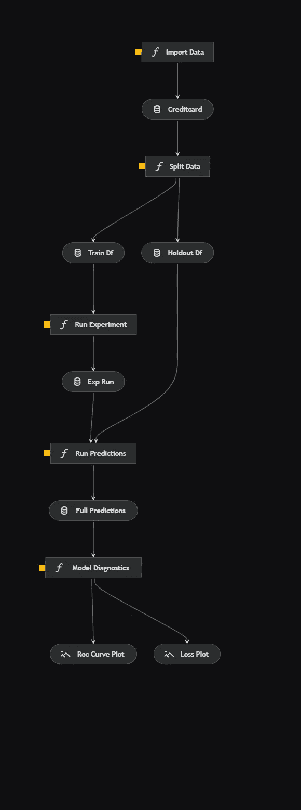
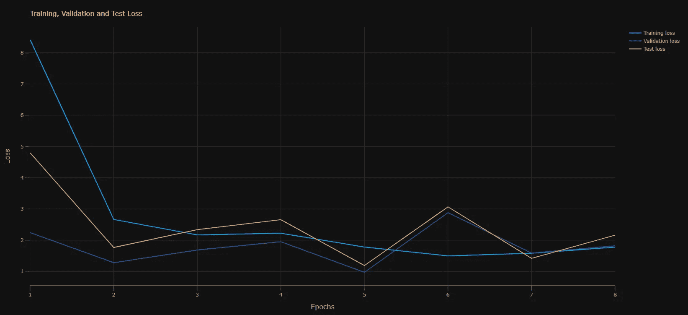
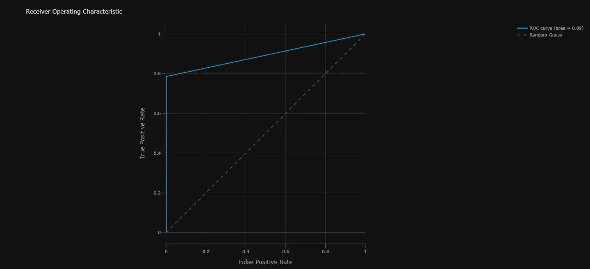

# 构建可部署的机器学习管道

> 原文：[`towardsdatascience.com/build-deployable-machine-learning-pipelines-a6d7035816a6`](https://towardsdatascience.com/build-deployable-machine-learning-pipelines-a6d7035816a6)

## 利用 Kedro 构建生产就绪的机器学习管道

[](https://johnadeojo.medium.com/?source=post_page-----a6d7035816a6--------------------------------)[](https://towardsdatascience.com/?source=post_page-----a6d7035816a6--------------------------------) [John Adeojo](https://johnadeojo.medium.com/?source=post_page-----a6d7035816a6--------------------------------)

·发表于[Towards Data Science](https://towardsdatascience.com/?source=post_page-----a6d7035816a6--------------------------------) ·8 分钟阅读·2023 年 6 月 30 日

--


作者提供的图片：使用 Midjourney 生成

# 背景 — 笔记本不能“部署”

许多数据科学家最初接触编码的方式是通过笔记本风格的用户界面。笔记本对于探索至关重要——这是我们工作流程的一个关键方面。然而，它们并不是为生产环境准备的。这是我在众多客户中观察到的一个关键问题，其中一些人询问如何将笔记本投入生产。与其将笔记本投入生产，最优的生产准备路径是编写模块化、可维护和可重复的代码。

在本文中，我展示了一个用于训练模型以分类欺诈信用卡交易的模块化机器学习管道示例。希望在本文结束时，你能：

1.  了解和掌握模块化机器学习管道。

1.  感到受启发，自己动手构建一个吧。

如果你想最大化地发挥机器学习模型的效益，编写模块化代码是一个重要的步骤。

首先对[模块化](https://en.wikipedia.org/wiki/Modular_programming)代码进行一个简要定义。模块化代码是一种软件设计范式，强调将程序分解为独立的、可互换的模块。我们应该力求在我们的机器学习管道中达到这种状态。

## 快速绕道 — 项目、数据和方法

该机器学习项目的数据来源于[Kaggle](https://www.kaggle.com/datasets/mlg-ulb/creditcardfraud)。数据集包含 284,807 个匿名信用卡交易记录，其中 492 个为欺诈交易。任务是构建一个分类器来检测欺诈交易。

本项目的数据在[开放数据公共许可证](https://opendatacommons.org/licenses/dbcl/1-0/)下许可用于任何目的，包括商业用途。

我使用了利用[Ludwig](https://ludwig.ai/latest/)的深度学习方法，这是一个开源的声明式深度学习框架。我在这里不会详细介绍 Ludwig，不过我之前写过一篇关于[框架](https://medium.com/towards-data-science/ludwig-a-friendlier-deep-learning-framework-946ee3d3b24)的文章。

Ludwig 深度神经网络通过**.yaml**文件进行配置。对那些感兴趣的人，你可以在[模型注册 GitHub](https://github.com/john-adeojo/Credit-Card-Fraud-Model-Registry/blob/main/model%20yaml%20files/model_1a.yaml)找到它。

# 使用 Kedro 构建模块化管道

使用开源工具使得构建模块化机器学习管道变得更加容易，我最喜欢的工具之一是[Kedro](https://kedro.org/)。不仅因为我见证了它在行业中的成功应用，还因为它帮助我提升了我的软件工程技能。

Kedro 是一个开源框架（根据 Apache 2.0 许可证）用于创建可重复、可维护和模块化的数据科学代码。我是在为一家银行开发 AI 策略时发现它的，考虑到我的团队可以利用哪些工具来构建生产就绪的代码。

*免责声明：我与 Kedro 或 McKinsey 的 QuantumBlack（该开源工具的创建者）没有任何关联。*

# 模型训练管道



作者提供的图片：使用 Kedro 可视化生成的端到端模型训练管道

Kedro 方便地允许你可视化你的管道，这是一个很棒的功能，可以帮助你清晰地理解你的代码。这个管道在机器学习中是标准的，因此我只会简单介绍每个方面。

1.  **导入数据**：从外部来源导入信用卡交易数据。

1.  **拆分数据**：使用随机拆分将数据分成训练集和保留集。

1.  **运行实验**：使用 Ludwig 框架在训练数据集上训练深度神经网络。Ludwig 实验 API 方便地为每次实验运行保存模型工件。

1.  **运行预测**：使用前一步训练的模型对保留数据集进行预测。

1.  **模型诊断**：生成两个诊断图表。首先是跟踪每个周期的交叉熵损失。其次是测量模型在保留数据集上的性能的[ROC 曲线](https://en.wikipedia.org/wiki/Receiver_operating_characteristic)。



作者提供的图片：模型训练过程中的损失曲线



作者提供的图片：在保留数据集上模型评估的 ROC 曲线

# 管道的核心组件

现在我们已经建立了一个高层次的视图，让我们深入探讨这个管道的一些核心组件。

## 项目结构

```py
C:.
├───conf
│   ├───base
│   │   └───parameters
│   └───local
├───data
│   ├───01_raw
│   ├───02_intermediate
│   ├───03_primary
│   ├───04_feature
│   ├───05_model_input
│   ├───06_models
│   │   ├───experiment_run
│   │   │   └───model
│   │   │       ├───logs
│   │   │       │   ├───test
│   │   │       │   ├───training
│   │   │       │   └───validation
│   │   │       └───training_checkpoints
│   │   └───experiment_run_0
│   │       └───model
│   │           ├───logs
│   │           │   ├───test
│   │           │   ├───training
│   │           │   └───validation
│   │           └───training_checkpoints
│   ├───07_model_output
│   └───08_reporting
├───docs
│   └───source
│  
└───src
    ├───fraud_detection_model
    │   ├───pipelines
    │       ├───train_model
    └───tests
        └───pipelines
```

Kedro 提供了一个模板化的目录结构，这个结构在你启动项目时就已经建立。从这个基础上，你可以以编程方式将更多的管道添加到你的目录结构中。这种标准化的结构确保了每个机器学习项目的一致性和易于文档化，从而便于维护。

## 数据管理

数据在机器学习中扮演着至关重要的角色。当在商业环境中使用机器学习模型时，跟踪数据的能力变得尤为重要。你经常会面临审计，或者需要在他人的机器上生产化或重现你的管道。

Kedro 提供了两种方法来强制执行数据管理的最佳实践。第一种是目录结构，专为机器学习工作负载设计，为数据转换过程中生成的中间表和模型工件提供了明确的位置。第二种方法是[data catalogue](https://github.com/john-adeojo/kedro-project/blob/main/fraud-detection/conf/base/catalog.yml)。作为 Kedro 工作流的一部分，你需要在 .yaml 配置文件中注册数据集，从而在管道中利用这些数据集。这种方法初看可能不寻常，但它使你和其他参与管道工作的人员能够轻松跟踪数据。

## 调度 — 节点和管道

这就是魔法发生的地方。Kedro 提供了开箱即用的管道功能。

管道的初始构建块是[nodes](https://github.com/john-adeojo/kedro-project/blob/main/fraud-detection/src/fraud_detection_model/pipelines/train_model/nodes.py)。每个可执行的代码片段可以封装在一个节点中，节点只是一个接受输入并产生输出的 Python 函数。然后，你可以将一个[管道](https://github.com/john-adeojo/kedro-project/blob/main/fraud-detection/src/fraud_detection_model/pipelines/train_model/pipeline.py)结构化为一系列节点。通过调用节点并指定输入和输出，可以轻松构建管道。Kedro 会确定执行顺序。

一旦管道构建完成，它们会被注册在提供的**pipeline_registry.py**文件中。这种方法的美妙之处在于，你可以创建多个管道。这在机器学习中尤其有用，你可能会有一个数据处理管道、一个模型训练管道、一个推理管道等。

一旦设置完成，修改管道的各个方面就会变得相当简单。

显示 nodes.py 脚本示例的代码片段

显示 Pipeline 脚本示例的代码片段

## 配置

Kedro 的最佳实践规定所有配置应通过提供的 [**parameters.yml**](https://github.com/john-adeojo/kedro-project/blob/main/fraud-detection/conf/base/parameters.yml) 文件来处理。从机器学习的角度来看，超参数也属于这一类别。这种方法简化了实验过程，因为你可以简单地用另一组超参数替换一个 **parameters.yml** 文件，这也更容易追踪。

我还在 **parameters.yml** 配置中包含了我的 Ludwig 深度神经网络 [**model.yaml**](https://github.com/john-adeojo/Credit-Card-Fraud-Model-Registry/blob/main/model%20yaml%20files/model_1a.yaml) 和数据源的位置。如果模型或数据位置发生变化——例如，在开发者之间转移时——调整这些设置会非常简单。

显示`parameters.yml`文件内容的代码片段

## 可复现性

Kedro 包含一个 [**requirements.txt**](https://github.com/john-adeojo/kedro-project/blob/main/fraud-detection/src/requirements.txt) 文件作为模板结构的一部分。这使得监控你的环境和确切的库版本变得非常简单。然而，如果你愿意，你可以使用其他环境管理方法，如 **environment.yml** 文件。

# 建立工作流

如果你正在开发机器学习管道并考虑使用 Kedro，起初可能会有陡峭的学习曲线，但采用标准工作流会简化这一过程。以下是我建议的工作流：

1.  **建立你的工作环境**：我更喜欢使用 Anaconda 来完成这项任务。我通常使用一个 [**environment.yml**](https://github.com/john-adeojo/kedro-project/blob/main/environment.yml) 文件，其中包含我环境所需的所有依赖项，并使用 Anaconda Powershell 命令行来 [创建](https://gist.github.com/john-adeojo/fa22082328e65d0260fefd9b149e4b69) 我的环境。

1.  **创建 Kedro 项目**：一旦你安装了 Kedro——希望它已在你的 **environment.yml** 中声明——你可以通过 [Anaconda](https://www.anaconda.com/) 命令行界面 [创建](https://docs.kedro.org/en/stable/get_started/new_project.html) 一个 Kedro 项目。

1.  **在 Jupyter Notebooks 中探索**：我在 Jupyter notebooks 中构建初始管道，这个过程对大多数数据科学家来说都很熟悉。唯一的不同之处在于，一旦你的管道构建完成，你应该整理它，以便每个单元格可以作为你 Kedro 管道中的一个节点。

1.  **注册你的数据**：在数据 [catalogue](https://github.com/john-adeojo/kedro-project/blob/main/fraud-detection/conf/base/catalog.yml) 中记录每个数据处理或数据摄取步骤的输入和输出。

1.  **添加你的管道**：在笔记本中进行探索后，你会想要 [创建一个管道](https://docs.kedro.org/en/stable/tutorial/create_a_pipeline.html#:~:text=Note,the%20starter%20project.)。这是通过命令行界面完成的。运行此命令将会在 ‘pipelines’ 中添加一个额外的文件夹，文件夹名称为你刚刚创建的管道名称。在这个文件夹中，你将构建你的节点和管道。

1.  **定义你的管道**：这是将代码从你的 Jupyter 笔记本迁移到你管道文件夹中的 [**node.py**](https://github.com/john-adeojo/kedro-project/blob/main/fraud-detection/src/fraud_detection_model/pipelines/train_model/nodes.py) 文件的阶段，确保你希望成为管道一部分的节点都有输入和输出。一旦节点设置完毕，接下来在 [**pipeline.py**](https://github.com/john-adeojo/kedro-project/blob/main/fraud-detection/src/fraud_detection_model/pipelines/train_model/pipeline.py) 文件中定义你的管道。

1.  **注册你的管道**： [**pipeline_registry.py**](https://github.com/john-adeojo/kedro-project/blob/main/fraud-detection/src/fraud_detection_model/pipeline_registry.py) 文件提供了一个模板，用于注册你新创建的管道。

1.  **运行你的项目**：一旦建立完成，你可以通过 CLI [运行](https://docs.kedro.org/en/stable/nodes_and_pipelines/run_a_pipeline.html) 任何管道，还可以 [可视化](https://docs.kedro.org/en/stable/visualisation/index.html) 你的项目。

生产就绪的管道适应于更广泛的机器学习操作生态系统。阅读我的关于 MLOps 的文章，进行更深入的了解。

[](/building-machine-learning-operations-for-businesses-6d0bfbbf2139?source=post_page-----a6d7035816a6--------------------------------) ## 为企业构建机器学习操作

### 支持你的 AI 战略的有效 MLOps 蓝图

towardsdatascience.com

# 结论

Kedro 是一个出色的框架，用于交付生产就绪的机器学习管道。除了本文讨论的功能外，还有许多与其他开源库的集成，以及用于文档和测试的包。Kedro 并不能解决与模型部署相关的所有问题——例如，模型版本控制可能更适合使用其他工具如 DVC 处理。然而，它将帮助商业环境中的数据科学家生成更可维护、模块化和可重复的生产就绪代码。对于完全的新手来说，学习曲线相对较陡，但文档清晰，并包括引导教程。与这些包中的任何一个一样，最好的学习方法是直接动手试验。

完整的 [GitHub 仓库](https://github.com/john-adeojo/kedro-project/tree/main) 链接

*在* [*LinkedIn*](https://www.linkedin.com/in/john-adeojo/) *上关注我*

*订阅 medium 以获得更多我的见解：*

[## 通过我的推荐链接加入 Medium — 约翰·阿德约](https://johnadeojo.medium.com/membership?source=post_page-----a6d7035816a6--------------------------------)

### 我分享数据科学项目、经验和专业知识，以帮助你在旅程中前行。你可以通过以下方式注册 medium…

[johnadeojo.medium.com](https://johnadeojo.medium.com/membership?source=post_page-----a6d7035816a6--------------------------------)

*如果你有兴趣将 AI 或数据科学整合到你的业务运营中，我们邀请你安排一次免费的初步咨询：*

[## 在线预约 | 数据驱动解决方案](https://www.data-centric-solutions.com/book-online?source=post_page-----a6d7035816a6--------------------------------)

### 通过免费咨询，发现我们在帮助企业实现雄心勃勃的目标方面的专业知识。我们的数据科学家和…

[www.data-centric-solutions.com](https://www.data-centric-solutions.com/book-online?source=post_page-----a6d7035816a6--------------------------------)
