# 使用 Mercury 从 Jupyter Notebook 直接构建优雅的 Web 应用程序。

> 原文：[`towardsdatascience.com/build-elegant-web-apps-right-from-jupyter-notebook-with-mercury-78d9ebcbbcaf?source=collection_archive---------4-----------------------#2023-04-17`](https://towardsdatascience.com/build-elegant-web-apps-right-from-jupyter-notebook-with-mercury-78d9ebcbbcaf?source=collection_archive---------4-----------------------#2023-04-17)

## 瞬间将 Notebook 转换为美丽的 Web 应用程序

[](https://medium.com/@avi_chawla?source=post_page-----78d9ebcbbcaf--------------------------------)[](https://towardsdatascience.com/?source=post_page-----78d9ebcbbcaf--------------------------------) [Avi Chawla](https://medium.com/@avi_chawla?source=post_page-----78d9ebcbbcaf--------------------------------)

·

[关注](https://medium.com/m/signin?actionUrl=https%3A%2F%2Fmedium.com%2F_%2Fsubscribe%2Fuser%2F5d33decdf4c4&operation=register&redirect=https%3A%2F%2Ftowardsdatascience.com%2Fbuild-elegant-web-apps-right-from-jupyter-notebook-with-mercury-78d9ebcbbcaf&user=Avi+Chawla&userId=5d33decdf4c4&source=post_page-5d33decdf4c4----78d9ebcbbcaf---------------------post_header-----------) 发表在 [Towards Data Science](https://towardsdatascience.com/?source=post_page-----78d9ebcbbcaf--------------------------------) · 7 分钟阅读 · 2023 年 4 月 17 日[](https://medium.com/m/signin?actionUrl=https%3A%2F%2Fmedium.com%2F_%2Fvote%2Ftowards-data-science%2F78d9ebcbbcaf&operation=register&redirect=https%3A%2F%2Ftowardsdatascience.com%2Fbuild-elegant-web-apps-right-from-jupyter-notebook-with-mercury-78d9ebcbbcaf&user=Avi+Chawla&userId=5d33decdf4c4&source=-----78d9ebcbbcaf---------------------clap_footer-----------)

--

[](https://medium.com/m/signin?actionUrl=https%3A%2F%2Fmedium.com%2F_%2Fbookmark%2Fp%2F78d9ebcbbcaf&operation=register&redirect=https%3A%2F%2Ftowardsdatascience.com%2Fbuild-elegant-web-apps-right-from-jupyter-notebook-with-mercury-78d9ebcbbcaf&source=-----78d9ebcbbcaf---------------------bookmark_footer-----------)

[NASA](https://unsplash.com/@nasa?utm_source=medium&utm_medium=referral)的照片，发布于[Unsplash](https://unsplash.com/?utm_source=medium&utm_medium=referral)。

有效的沟通在所有数据驱动的项目中都至关重要。数据专业人员常常需要向包括业务领导、技术团队和其他数据科学家在内的利益相关者传达他们的发现和见解。

尽管传统的数据见解沟通方法，如 PowerPoint 演示和静态报告被广泛偏爱，但它们通常耗时较长。

更重要的是，这些服务要求用户离开 Jupyter Notebook 的舒适环境——这是数据科学家们大多数时间的工作场所。

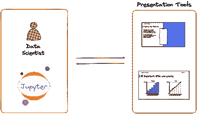

分离展示工具和 Jupyter（作者提供的图像）

如果我们能通过从 Jupyter Notebook 创建互动且优雅的网页应用来分享我们的发现，那岂不是很好吗？

为此，[Mercury](https://github.com/mljar/mercury) 是一个开源工具，它简化了从 Jupyter Notebook 舒适环境中创建网页应用的过程。

因此，在本文中，我将演示如何使用 Mercury 创建令人惊叹的网页应用并与他人分享。

你可以在这里找到这个博客的代码：[GitHub](https://github.com/ChawlaAvi/Mercury-Web-App)。

让我们开始 🚀！

# 开始使用 Mercury

Mercury 创建的网页应用主要由两个因素驱动：

## #1) Jupyter Notebook：

这里是你开发网页应用的地方。我们使用 Mercury 的 [input](https://runmercury.com/docs/input-widgets/) 和 [output](https://runmercury.com/docs/output-widgets/) 小部件来实现互动。

输入小部件允许用户提供输入并与应用互动。Mercury 支持的一些输入小部件如下所示：

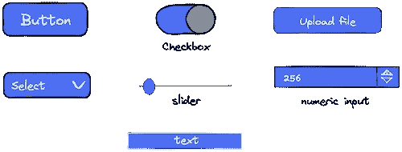

Mercury 的小部件（作者提供的图像）

输出小部件用于展示输出。这包括 Markdowns（带变量）、JSON 等。此外，Jupyter 单元格的输出也由 Mercury 渲染。

因此，如果你的应用创建了图表或打印了数据框等，它们将出现在网页应用的输出面板中。

## #2) Mercury 服务器

服务器将 Jupyter Notebook 渲染为网页应用。

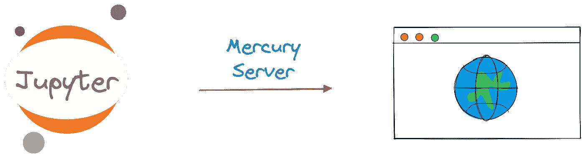

使用 Mercury 部署应用（作者提供的图像）

正如我们将看到的，渲染笔记本只需运行一个命令。你只需在笔记本中创建你的网页应用。

使用 Mercury 设置网页应用需要几个简单步骤。

## 安装 Mercury

首先，通过 pip 安装库：

```py
pip install mercury
```

完成！

现在我们可以使用输入和输出小部件创建我们的网页应用。

# 使用 Mercury 开发网页应用

如上所述，使用 Mercury 创建的网页应用主要由其小部件驱动。

## #1) 导入库

要使用它们，我们首先导入库。再重申一次，我们将从 Jupyter Notebook 开始一切。

```py
## mercury_app.ipynb

import mercury as mr
```

此外，你可以根据需要导入其他任何库。对于这个博客，我将创建一个网页应用来分析一个自创的虚拟员工数据框。因此，我还将使用以下库：

```py
## mercury_app.ipynb

import pandas as pd
import seaborn as sns
from matplotlib import pyplot as plt

sns.set()
```

## #2) 配置应用

接下来，我们通过提供 `title` 和 `description` 来实例化一个 Mercury 应用。

```py
## mercury_app.ipynb

app = mr.App(title="Employee Data Analysis", 
             description="Employee Report in Mercury")
```

## #3) 用小部件填充应用

接下来，让我们添加一些小部件，以允许用户与以下虚拟数据进行互动：

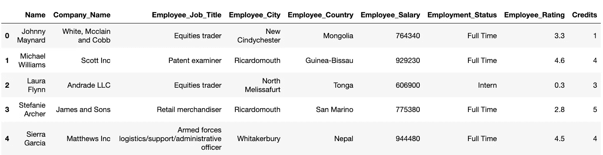

虚拟数据集（作者提供的图像）

从本质上讲，我们将执行以下操作：

+   添加一个小部件以上传 CSV 文件。

+   让用户根据`Company_Name`列中的条目过滤数据。这将是一个`MultiSelect`小部件。

+   此外，用户还可以使用`Slider`根据`Credits`过滤数据。

一旦数据被过滤，我们将显示以下内容：

+   过滤后数据框的维度。

+   `Employee_Salary`和`Employee_Rating`的散点图。

+   显示`Employee_Status`列分布的条形图。

让我们现在来构建它！

首先，我们添加文件上传小部件。

```py
## mercury_app.ipynb

data_file = mr.File(label="Upload CSV")
```

文件的名称可以通过`data_file`对象的`filepath`属性访问。因此，一旦文件上传成功，我们将使用 Pandas 读取它，如下所示：

```py
## mercury_app.ipynb

emp_df = pd.read_csv(data_file.filepath)
```

现在，我们将添加两个小部件——`Company_Name`上的`MultiSelect`小部件和`Credits`列上的`Slider`。

```py
## mercury_app.ipynb

company = mr.MultiSelect(value=emp_df.Company_Name.unique(), 
                         choices=emp_df.Company_Name.unique(),
                         label="Select Companies")
```

此处，`value`参数指的是初始值，`choices`以可供选择的值列表显示，而`label`是出现在小部件旁边的自定义文本。

接下来，我们有滑块小部件。

```py
## mercury_app.ipynb

credits_filter = mr.Slider(value=1,
                           min=emp_df.Credits.min(), 
                           max=emp_df.Credits.max(), 
                           label="Credits Filter", step=1)
```

此处，`value`参数定义初始值，`min`和`max`指的是值的范围，`label`如之前所述，是自定义文本。最后，`step`定义滑块小部件的步长值。

到此为止，我们完成了交互性的小部件添加。最后一步是根据小部件中的值创建图表。

## #4) 填充输出面板

首先，我们根据从小部件接收的值过滤数据框。您可以使用`WidgetObj.value`属性访问它。

换句话说，要检索`company`小部件的值，我们可以引用`company.value`属性。

```py
## mercury_app.ipynb

new_df = emp_df[(emp_df.Company_Name.isin(company.value)) &
                (emp_df.Credits>=int(credits_filter.value))]
```

接下来，使用 Markdown 输出小部件，我们打印过滤后的数据框的维度。

```py
## mercury_app.ipynb

mr.Md(f"""The DataFrame has {new_df.shape[0]} rows
          and {new_df.shape[1]} columns.""")
```

Mercury 的 Markdown 有一个很酷的功能，那就是您还可以使用 f-strings，如上所示。

最后，我们创建图表：

```py
## mercury_app.ipynb

fig, ax = plt.subplots(1, 2, figsize = (16, 9))

sns.scatterplot(data = new_df, ax = ax[0], 
                x = "Employee_Rating", y = "Employee_Salary") ## scatter plot

sns.countplot(x = new_df.Employment_Status, ax = ax[1]) ## count plot
plt.show();
```

就这样。现在我们的 Mercury 应用已经准备好了。

## #5) 运行网络应用

要运行应用，请在命令行中导航到应用的文件夹并运行以下命令：

```py
mercury run
```

因此，我们看到了以下内容：

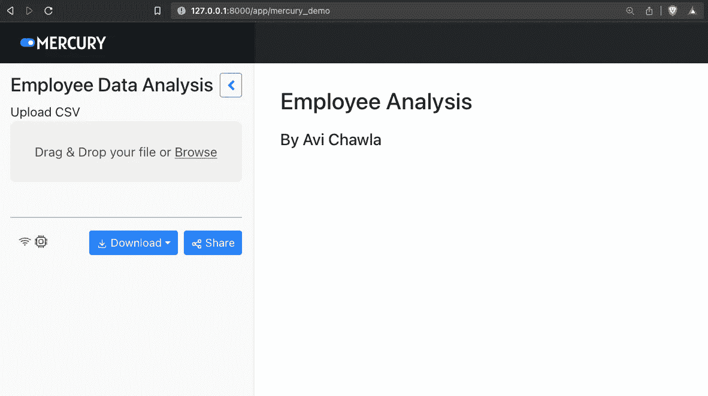

首次查看网络应用（作者图片）

正如预期的那样，我们有一个上传文件的小部件。让我们在这里上传虚拟数据集。

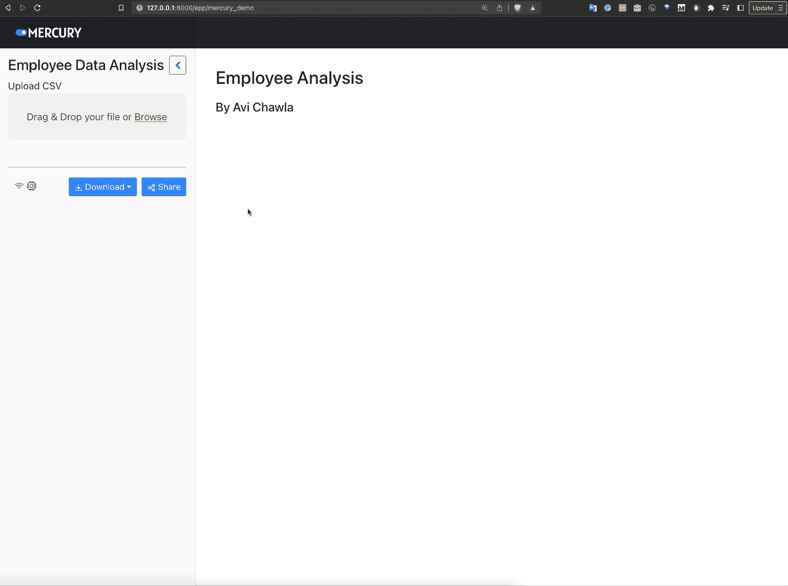

上传数据集（作者图片）

一旦我们上传了 CSV，图表立即显示出来。

现在，我们可以操控输入小部件来分析数据。

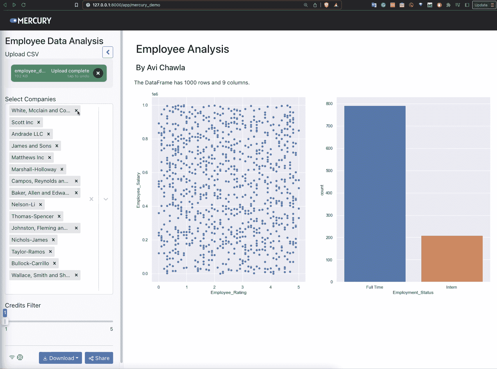

数据集分析（作者图片）

随着我们更新过滤器，图表和行数也会更新。这是通过 Mercury 服务器实现的，它在笔记本和应用之间保持持续的交互。

实际上，如果我们更新笔记本，变化会立即反映出来。

# Mercury 与 Streamlit

此时一个相关的问题是水银相对于 Streamlit 的表现如何，Streamlit 是我在许多之前的博客中使用过的，如这里和这里。

Streamlit 确实已成为创建网页应用的最常见选择之一。尽管整体体验非常棒，但 Streamlit 也确实有很多限制：

## #1) 无 Jupyter 支持

由 Streamlit 驱动的应用程序主要由 Python 脚本提供支持，而不是互动的 Python 内核。因此，在使用 Streamlit 开发应用程序时，必须重复运行脚本以查看进展。

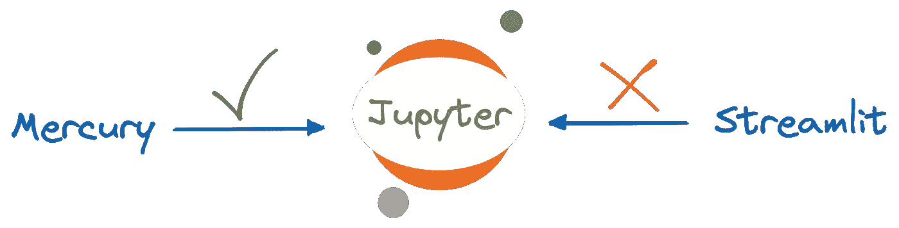

水银与 Streamlit — Jupyter 支持（图片来源：作者）

然而，使用水银创建的应用程序由 Jupyter Notebook 驱动，每次更新都会立即反映在网页应用中。

## #2) 导出为 PDF/HTML

使用水银创建的网页应用可以通过点击按钮轻松导出。

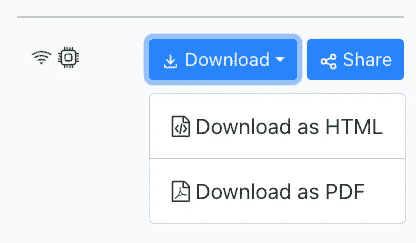

水银与 Streamlit — 导出应用程序（图片来源：作者）

这使您可以轻松地通过电子邮件、聊天等方式与他人分享您的应用程序，接收者不一定需要安装 Mercury。

然而，Streamlit 并不提供这种支持。

## #3) 创建演示文稿

最后，使用水银创建的网页应用可以轻松地作为[互动演示](https://runmercury.com/tutorials/presentation-python-jupyter-notebook/)运行。

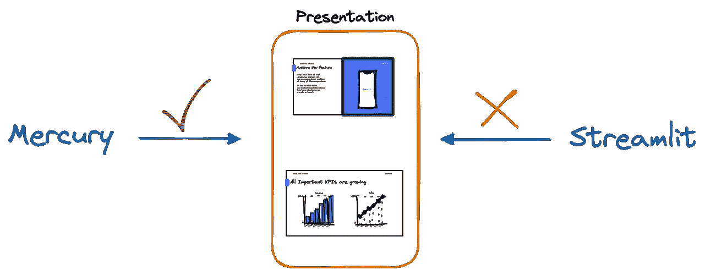

水银与 Streamlit — 演示（图片来源：作者）

然而，Streamlit 应用程序并不提供这样的支持。

## #4) 使用认证保护应用程序

有时候，确保只有授权用户才能访问您的应用程序可能非常重要。这可能是由于存在敏感信息。

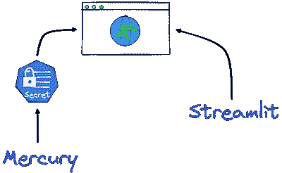

水银与 Streamlit — 安全性（图片来源：作者）

使用水银，您可以立即[启用认证以保护您的网页应用](https://runmercury.com/docs/authentication/)。Streamlit 原生不支持认证。

因此，当有人运行您的网页应用时，他们将被提示验证其详细信息，如下所示：

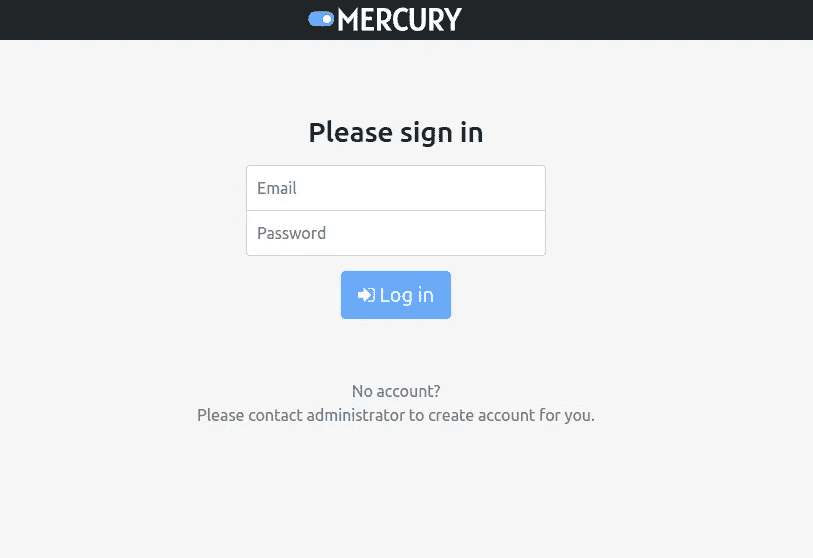

水银认证窗口（图片来源：作者）

# 结论

这样，我们就结束了这篇博客。

在这篇文章中，我们学习了如何从 Jupyter Notebook 的舒适环境中使用水银构建一个简单的网页应用。

最后，我们查看了水银与 Streamlit 的比较以及它如何服务于各种数据通信用例。

作为结尾，您还可以通过[Mercury Cloud](https://cloud.runmercury.com/)将您的笔记本托管在云端。只需上传笔记本即可完成。

如果您不希望将网页应用专门托管在 Mercury Cloud 上，也可以将其部署在任何带有 Docker 的服务器上。

感谢阅读！
