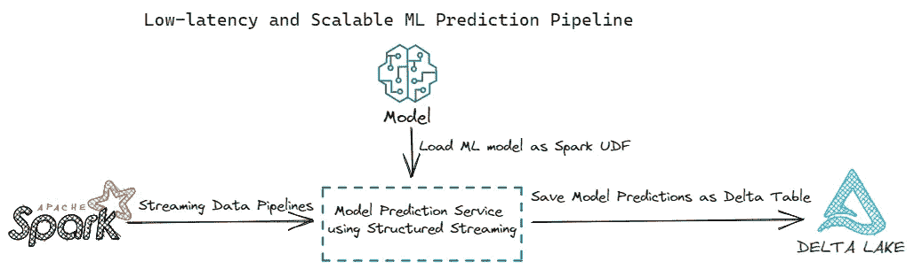

# 构建低延迟和可扩展的 ML 模型预测管道，使用 Spark Structured Streaming 和 MLflow

> 原文：[`towardsdatascience.com/build-low-latency-and-scalable-ml-model-prediction-pipelines-using-spark-structured-streaming-and-535ae5244877`](https://towardsdatascience.com/build-low-latency-and-scalable-ml-model-prediction-pipelines-using-spark-structured-streaming-and-535ae5244877)

## MLOps 实践系列——分享关键 MLOps 组件的设计和实施模式。今天的文章重点是构建模型预测管道。

[](https://medium.com/@weiyunna91?source=post_page-----535ae5244877--------------------------------)[](https://towardsdatascience.com/?source=post_page-----535ae5244877--------------------------------) [YUNNA WEI](https://medium.com/@weiyunna91?source=post_page-----535ae5244877--------------------------------)

·发布于 [Towards Data Science](https://towardsdatascience.com/?source=post_page-----535ae5244877--------------------------------) ·阅读时间 8 分钟·2023 年 1 月 10 日

--

为了使 ML 模型在实际生产环境中工作，最关键的步骤之一是将训练好的模型部署以进行预测。模型部署（发布）是一个过程，使你能够将训练好的 ML 模型集成到生产环境中，以对实际数据做出决策。谈到模型部署，通常有两种类型：

+   一种是批量预测，即在某个时间间隔（如每天一次或每周一次，具体取决于模型在特定业务背景下的使用方式）调用训练好的模型，并将一批数据输入模型，以定期生成预测结果。

+   另一种是在线预测，即将训练好的模型打包成 REST API 或容器化微服务，模型通过响应 API 请求返回预测结果（通常为 JSON 格式）。使用在线预测，模型实时生成预测结果，即一旦 API 被调用，模型预测结果将立即返回。此外，模型 REST API 通常作为 web 应用的一部分集成，以供最终用户或下游应用进行交互。

然而，在批量预测和在线预测之间，我们已经看到越来越多的场景，其中模型不需要打包成 REST API，但模型预测所需的延迟非常低。因此，为了满足这些场景的需求，我想分享一个解决方案——使用 Spark Structured Streaming 和 MLflow 构建低延迟和可扩展的 ML 模型预测管道。

今天文章的内容是：

+   快速介绍 Spark Structured Streaming 和 mlflow；

+   低延迟和可扩展的机器学习预测管道的关键架构组件；

+   使用 Spark Structured Streaming 和 mlflow 构建低延迟和可扩展的机器学习预测管道的实现细节；

让我们开始吧！


照片由 [Jen Theodore](https://unsplash.com/@jentheodore?utm_source=medium&utm_medium=referral) 提供，来源于 [Unsplash](https://unsplash.com/?utm_source=medium&utm_medium=referral)

## Spark Structured Streaming 和 mlflow 简介

Spark Structured Streaming — [Structured Streaming](https://spark.apache.org/docs/latest/structured-streaming-programming-guide.html#structured-streaming-programming-guide) 是一个基于 Spark SQL 引擎构建的可扩展且容错的流处理引擎。内部默认情况下，Structured Streaming 查询通过微批处理引擎进行处理，该引擎将数据流处理为一系列小批量作业，从而实现低至 100 毫秒的端到端延迟和精确一次的容错保证。

MLflow — [MLflow](https://mlflow.org/) 是一个用于管理整个机器学习生命周期的开源平台。

+   **跟踪** — MLflow 的跟踪组件是一个用于记录参数、代码版本、指标和输出文件的 API 和 UI，当运行机器学习代码时以及后续可视化结果时使用。

+   **模型** — MLflow 模型是一种标准格式，用于打包机器学习模型，可以在各种下游工具中使用。该格式定义了一种约定，使你可以以不同的“风味”保存模型，以便不同的下游工具理解。内置模型风味可以在[这里](https://mlflow.org/docs/latest/models.html#built-in-model-flavors.)找到。值得一提的是，[python_function](https://mlflow.org/docs/latest/models.html#python-function-python-function)模型风味作为 MLflow Python 模型的默认模型接口。任何 MLflow Python 模型都应该能够被加载为 python_function 模型。在今天演示的解决方案中，我们将训练好的模型加载为 python 函数。此外，我们还利用了[*log_model()*](https://mlflow.org/docs/latest/python_api/mlflow.models.html#mlflow.models.Model.log) 和 [*load_model()*](https://mlflow.org/docs/latest/python_api/mlflow.models.html#mlflow.models.Model.load)*.* 的模型 API 调用。

+   **模型注册表** — MLflow 的模型注册表组件是一个集中的模型存储库，包含一组 API 和 UI，用于协作管理 MLflow 模型的完整生命周期。它提供模型血统（提供对训练好的 ML 模型的可见性和可追溯性，这些模型来源于特定 MLflow 实验和运行的组合）、模型版本控制、阶段转换（例如从测试阶段到生产阶段）以及注释。

+   **项目** — MLflow 项目是一种以可重用和可再现的方式打包数据科学代码的格式，主要基于约定。每个项目实际上是一个包含代码的文件目录或 Git 仓库。

如果你对了解更多关于 Spark Structured Streaming 感兴趣，你可以查看我另一篇[文章](https://medium.com/@weiyunna91/continuously-ingest-and-load-csv-files-into-delta-using-spark-structure-streaming-ce5faaadd1e7?sk=6cc4f4d31488f2d2420ec40592ea8bd0)，专门讨论如何构建流数据管道。

现在让我们深入探讨构建低延迟和可扩展 ML 预测管道的关键架构组件。

## 低延迟和可扩展 ML 预测管道的关键架构组件



低延迟和可扩展 ML 预测管道 | 作者提供的图片

如上图所示，构建低延迟和可扩展 ML 预测管道需要 3 个关键架构组件：

+   第一步是构建一个流数据管道，以摄取原始数据，将原始数据转换为 ML 特征，并以低延迟将 ML 特征输入到 ML 模型中；

+   第二步是将训练和注册的 ML 模型加载为 Spark 用户定义函数（UDF），以便模型可以并行进行预测，利用 Spark 的分布式计算能力。当需要进行预测的数据量很大时，这一点尤其有用。

+   第三步是将模型预测结果保存到存储在 AWS S3 桶中的 Delta 表中。然后，这些模型预测结果可以用于下游数据消费者和应用程序。例如，你可以在模型预测结果基础上构建一个商业智能（BI）仪表板，以支持业务决策。你还可以构建实时监控机制，根据模型预测生成通知和警报，以提高操作效率。

在展示如何构建低延迟和可扩展 ML 预测管道的实现之前，我们首先需要设置一些前提条件。

+   首先是训练模型的模式，如下文件所示：

```py
{"model_purpose" : "predicts the quality of wine using wine attributes",

"model_flavor" : ["python_function","sklearn"],
# The python_function model flavor serves as a default model interface for MLflow Python models. 
# Any MLflow Python model is expected to be loadable as a python_function model.
# This enables other MLflow tools to work with any python model regardless of 
# which persistence module or framework was used to produce the model.

"model_algorithm" : "sklearn.linear_model.ElasticNet",

{"model_signature" :
"model_input_schema":[
{"name": "fixed acidity", "type": "string"}, 
{"name": "volatile acidity", "type": "string"}, 
{"name": "citric acid", "type": "string"}, 
{"name": "residual sugar", "type": "string"},
{"name": "chlorides", "type": "string"},
{"name": "free sulfur dioxide", "type": "string"},
{"name": "total sulfur dioxide", "type": "string"},
{"name": "density", "type": "string"},
{"name": "pH", "type": "string"},
{"name": "sulphates", "type": "string"},
{"name": "alcohol", "type": "string"}],

"model_output_schema" [
{"type": "tensor", "tensor-spec": {"dtype": "float64", "shape": [-1]}}
]
},

"model_registry_location" : "runs:/<RUN_ID>/<MODEL_NAME>", 
# If you are using mlflow to manage the lifecycle of your models,
# the model is loggged as an artifact in the current run using MLflow Tracking

"model_stage" : "Production",
# With mlflow, you can transition a registered model to one of the stages: 
# Staging, Production or Archived.
# In the demo of this article, the model is alreay transitioned to the "production" stage.

"model_owner" : "<MODEL_OWNER_EMAIL/MODEL_OWNER_GROUP_EMAIL>"

}
```

+   第二个是训练数据和测试数据的模式。确保输入模型的数据模式与模型输入模式匹配对于避免因模式不匹配而导致的预测错误至关重要。数据模式如下所示：

```py
StructType([
StructField('fixed acidity', StringType(), True), 
StructField('volatile acidity', StringType(), True), 
StructField('citric acid', StringType(), True), 
StructField('residual sugar', StringType(), True), 
StructField('chlorides', StringType(), True), 
StructField('free sulfur dioxide', StringType(), True), 
StructField('total sulfur dioxide', StringType(), True), 
StructField('density', StringType(), True), 
StructField('pH', StringType(), True), 
StructField('sulphates', StringType(), True), 
StructField('alcohol', StringType(), True), 
StructField('quality', StringType(), True)
])
```

本文中使用的数据来自[这里](http://archive.ics.uci.edu/ml/datasets/Wine+Quality)。请随意了解有关数据的更多细节。

现在我们对模型模式和数据模式有了清晰的理解，我们可以开始使用 Spark Structured Streaming 和 MLflow 实现 ML 预测管道。完整的解决方案将在下一节中详细解释。

## 完整解决方案 — 使用 Spark 结构化流处理和 MLflow 构建低延迟且可扩展的机器学习预测管道

+   第 1 步 — 构建一个流数据摄取管道，以低延迟加载用于预测的数据。结构化流处理允许你通过设置微批间隔来定义数据处理的速度。在今天的演示中，我们将微批间隔设置为 5 分钟，这意味着每 5 分钟，流处理管道将拉取原始数据并调用已部署的机器学习模型进行预测。以下是一个样本流数据摄取管道，将原始数据（CSV 格式）加载到 Spark 流数据框中。

```py
streamingDF = (spark 
    .readStream
    .option("sep",",")     
    .option("header", "True") 
    .option("enforceSchema", "True")
    .schema(csvSchema) 
    .csv(<YOUR-CSV-DATA-LOCATION>))
```

+   第 2 步 — 将注册的模型加载为 Spark 用户定义函数（UDF）函数。

```py
import mlflow

logged_model = 'runs:/<RUN_ID>/<MODEL_NAME>'

# Load model as a Spark UDF. 
# Override result_type if the model does not return double values.
loaded_model = mlflow.pyfunc.spark_udf(spark, model_uri=logged_model, result_type='double')
```

+   第 3 步 — 对流数据框进行预测，并将机器学习模型预测结果保存到 Delta 表中供下游消费者使用。

```py
# Predict on a Spark DataFrame.
from pyspark.sql.functions import struct, col

streamingDF.withColumn('predictions', loaded_model(struct(*map(col, streamingDF.columns))))
```

## 完整解决方案

```py
import mlflow
from pyspark.sql.functions import struct, col
from pyspark.sql.types import StructType
```

```py
logged_model = 'runs:/<RUN_ID>/<MODEL_NAME>'
loaded_model = mlflow.pyfunc.spark_udf(spark, model_uri=logged_model, result_type='double')
checkpointLocation = <STREAMING_CHECKPOINT_LOCATION>
deltaLocation = <PREDICTION_STORAGE_LOCATION>
```

```py
streamingDF = (spark 
    .readStream
    .option("sep",",")     
    .option("header", "True") 
    .option("enforceSchema", "True")
    .schema(csvSchema) 
    .csv(<YOUR-CSV-DATA-LOCATION>)
    .withColumn('predictions', loaded_model(struct(*map(col, streamingDF.columns)))))
```

```py
(streamingDF.writeStream 
    .format("delta")
    .outputMode("append") # .outputMode("complete"), .outputMode("update")
    .option("checkpointLocation",checkpointLocation)
    .option("path", deltaLocation)
    .trigger(processingTime='5 minutes') # trigger(availableNow=True), .trigger(once=True), .trigger(continuous='1 second')
    .queryName("streaming csv files")
    .start())
```

## 总结

感谢阅读今天的文章。希望你可以在你的机器学习驱动的应用程序中利用这一模型部署模式。

在我之前的文章中，MLOps 实践 — 将机器学习解决方案架构拆解为 10 个组件，我将端到端的机器学习解决方案架构拆解为 10 个组件。今天的文章着重解释构建机器学习服务管道的热门模式之一。

我将继续分享 MLOps 实践系列文章，解释关键 MLOps 组件的设计和实现模式。

如果你想在这些文章发布时获得通知，请随时在 Medium 上关注我。我一般每周发布 1 到 2 篇关于数据和 AI 的文章。

如果你想查看更多指南、深入探讨和关于现代高效数据+AI 堆栈的见解，请订阅我的免费通讯 — [***高效的数据+AI 堆栈***](https://yunnawei.substack.com/)，谢谢！

## 参考文献

+   [`mlflow.org/`](https://mlflow.org/)

+   [`mlflow.org/docs/latest/index.html#mlflow-documentation`](https://mlflow.org/docs/latest/index.html#mlflow-documentation)

+   [`spark.apache.org/docs/latest/structured-streaming-programming-guide.html#structured-streaming-programming-guide`](https://spark.apache.org/docs/latest/structured-streaming-programming-guide.html#structured-streaming-programming-guide)

+   [`archive.ics.uci.edu/ml/datasets/Wine+Quality`](http://archive.ics.uci.edu/ml/datasets/Wine+Quality)

注意：如果你还没有成为 Medium 会员，而且你真的应该成为会员，因为这样你可以无限制访问 Medium，你可以使用我的 [推荐链接](https://medium.com/@weiyunna91/membership) 注册！

非常感谢你的支持！
