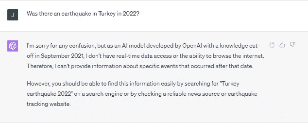

# 使用检索增强生成构建更强大的 LLM

> 原文：[`towardsdatascience.com/build-more-capable-llms-with-retrieval-augmented-generation-99d5f86e9779?source=collection_archive---------6-----------------------#2023-08-09`](https://towardsdatascience.com/build-more-capable-llms-with-retrieval-augmented-generation-99d5f86e9779?source=collection_archive---------6-----------------------#2023-08-09)

## 如何通过整合知识库来增强你的 LLM 的检索增强生成

 [John Adeojo](https://johnadeojo.medium.com/?source=post_page-----99d5f86e9779--------------------------------)

·

[关注](https://medium.com/m/signin?actionUrl=https%3A%2F%2Fmedium.com%2F_%2Fsubscribe%2Fuser%2Ff933e1637e40&operation=register&redirect=https%3A%2F%2Ftowardsdatascience.com%2Fbuild-more-capable-llms-with-retrieval-augmented-generation-99d5f86e9779&user=John+Adeojo&userId=f933e1637e40&source=post_page-f933e1637e40----99d5f86e9779---------------------post_header-----------) 发表在 [Towards Data Science](https://towardsdatascience.com/?source=post_page-----99d5f86e9779--------------------------------) · 12 分钟阅读 · 2023 年 8 月 9 日

--

图片由作者提供：使用 Midjourney 生成

# **ChatGPT 的局限性**

ChatGPT 在代码生成之外的许多实际业务用例中存在局限性。这个局限性源于训练数据以及模型的幻觉倾向。在撰写时，如果你尝试询问 Chat-GPT 关于 2021 年 9 月之后发生的事件，你可能会收到这样的回复：

图片由作者提供

这并没有帮助，那我们该如何纠正呢？

**选项 1 — 在最新数据上训练或微调模型。**

微调或训练模型可能不切实际且成本高昂。撇开成本不谈，准备数据集所需的努力足以放弃这一选项。

**选项 2 — 使用检索增强生成（RAG）方法。**

RAG 方法使我们能够让大型语言模型访问最新的知识库。这比从头开始训练模型或进行微调便宜得多，而且…
