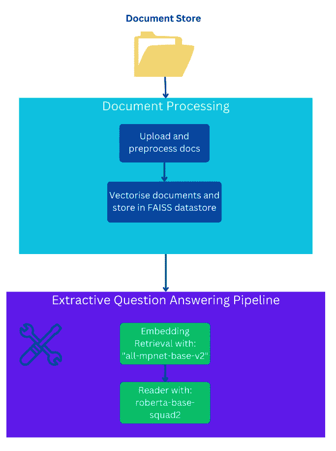
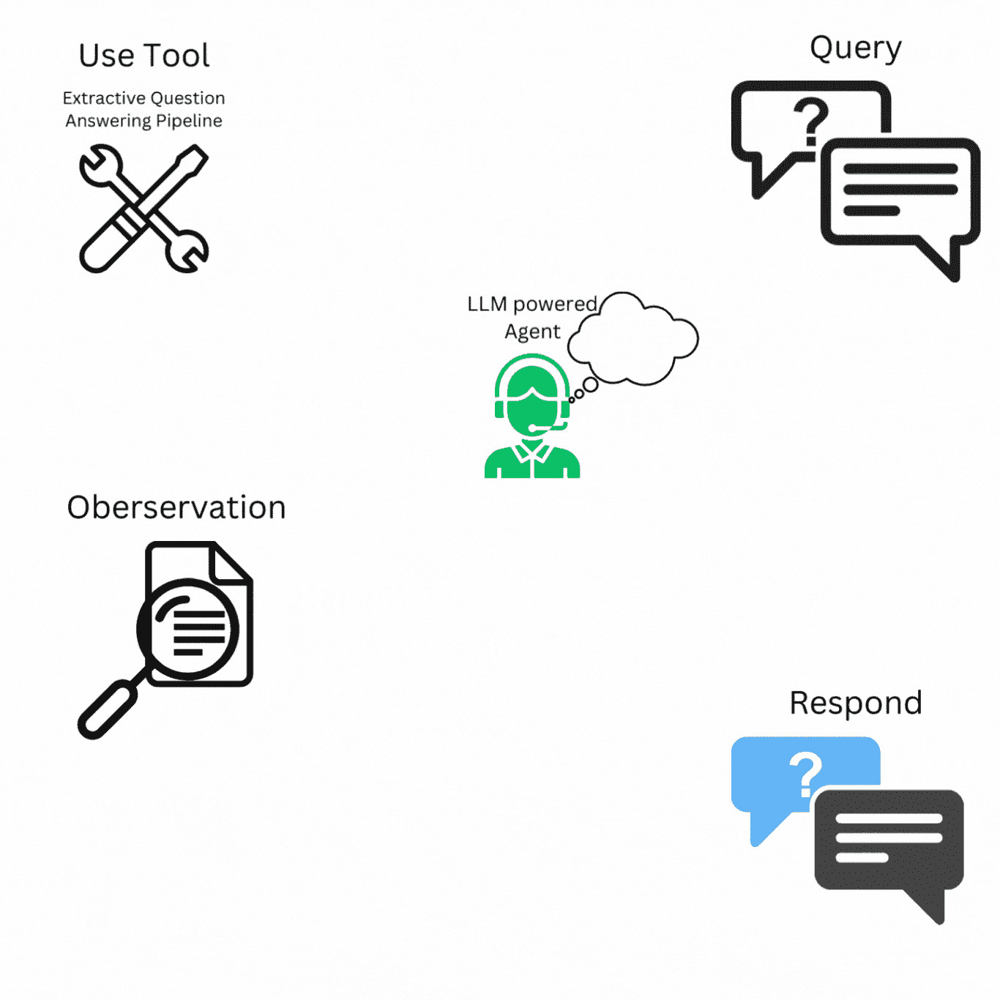
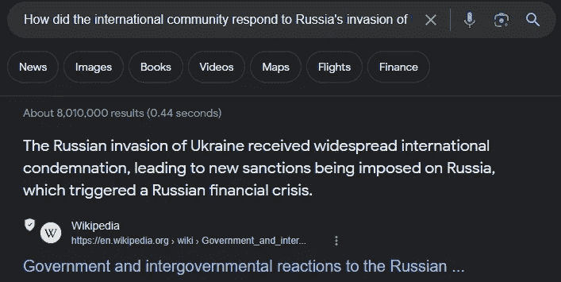
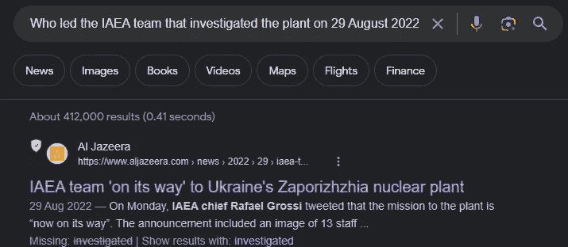

# 使用检索增强生成构建更强大的大型语言模型

> 原文：[`towardsdatascience.com/build-more-capable-llms-with-retrieval-augmented-generation-99d5f86e9779`](https://towardsdatascience.com/build-more-capable-llms-with-retrieval-augmented-generation-99d5f86e9779)

## 检索增强生成如何通过整合知识库提升您的大型语言模型

[](https://johnadeojo.medium.com/?source=post_page-----99d5f86e9779--------------------------------)[](https://towardsdatascience.com/?source=post_page-----99d5f86e9779--------------------------------) [John Adeojo](https://johnadeojo.medium.com/?source=post_page-----99d5f86e9779--------------------------------)

·发表于 [Towards Data Science](https://towardsdatascience.com/?source=post_page-----99d5f86e9779--------------------------------) ·阅读时间 12 分钟·2023 年 8 月 9 日

--


作者提供的图片：使用 Midjourney 生成

# **ChatGPT 的局限性**

ChatGPT 在生成代码以外的许多实际业务场景中是有限的。这些局限性源自训练数据以及模型的幻觉倾向。在撰写时，如果你询问 Chat-GPT 关于 2021 年 9 月之后发生的事件，你很可能会收到如下回应：


作者提供的图片

这并没有帮助，那么我们如何解决这个问题呢？

**选项 1 — 对模型进行训练或微调，以使用最新的数据。**

微调或训练模型可能不切实际且昂贵。撇开成本不谈，准备数据集所需的工作量也足以使这一选项不被考虑。

**选项 2 — 使用检索增强生成（RAG）方法。**

RAG 方法使我们可以让大型语言模型访问最新的知识库。这比从头训练模型或进行微调便宜得多，而且实现起来也更简单。在这篇文章中，我将展示如何使用 RAG 来利用你的 OpenAI 模型。我们将通过对模型进行短期测试，以分析其回答有关 2022 年俄罗斯-乌克兰冲突的问题的能力，知识库来源于 [维基百科](https://en.wikipedia.org/wiki/Russian_invasion_of_Ukraine)。

*注意：尽管这个话题比较敏感，但由于当前 ChatGPT 模型对此没有相关知识，因此被选择作为讨论的内容。*

# **库和前置条件**

你需要一个 OpenAI API 密钥，你可以直接从他们的网站获取，或者按照这个 [教程](https://www.howtogeek.com/885918/how-to-get-an-openai-api-key/)。RAG 使用的框架是 Deepset 的 [Haystack](https://haystack.deepset.ai/)，它是开源的。他们提供了 API，允许你在大型语言模型之上构建应用程序。我们还利用了来自 [Hugging Face](https://huggingface.co/) 的句子变换器和变换器库。

# **句子嵌入帮助模型理解文本**

在深入技术细节之前，我们应简要介绍句子嵌入。理解这个概念对获得 RAG 方法如何工作的直觉至关重要。

这可能是一个陈词滥调，尤其是对于那些有数据科学背景的人，但模型实际上并不理解文本，它们只理解数字。语言建模的大部分内容是关于制定有效地将文本编码为数字的方式，目前我们通过句子嵌入来做到这一点。

句子嵌入是一种将句子表示为密集向量的方式，同时保留其语义结构。嵌入是从深度神经网络中的密集层中学习的，该网络的结构可以因网络而异。

更简单地说，句子嵌入可以被认为是我们句子的数字表示，保留了它们的语义信息。我们可以从预训练模型中获取句子嵌入。Hugging Face 通过他们的句子变换器库提供了开源模型。

# **预处理和存储**

在我们可以构建 RAG 启用的模型之前，我们需要预处理和存储文档。让我们探索一下如何做到这一点，但首先注意这个过程的架构，以帮助你理解。

*注意：架构图也适用于我们在下一节中定义的抽取式问答管道。*



图片由作者提供：高层次架构预处理、向量存储和抽取式问答管道

## 预处理我们的文档

Haystack 为我们提供了方便的工具来预处理大多数类型的文本文件（包括 .pdf、.txt、.docx）。预处理步骤很简单；我们使用 [convert_files_to_docs()](https://docs.haystack.deepset.ai/reference/utils-api#convert_files_to_docs:~:text=Module%20preprocessing-,convert_files_to_docs,-Python) 函数读取知识库，该函数可以自动检测文件类型并将其转换为我们需要的下游格式。

Haystack 还提供了一个 [PreProcessor](https://docs.haystack.deepset.ai/reference/preprocessor-api#preprocessor::text=Module%20preprocessor-,PreProcessor,-Python:~:text=Module%20preprocessor-,PreProcessor,-Python) 类，使我们能够对文档应用预处理步骤。你应用的步骤将很大程度上取决于你的具体应用。

*注意：处理器将允许你将长文档拆分为较小的文档列表，定义为句子。对于问答应用，一个常见的方法是句子之间有一些重叠；我将其设置为大约 30%。*

## **向量存储**

我们利用了[FAISS](https://engineering.fb.com/2017/03/29/data-infrastructure/faiss-a-library-for-efficient-similarity-search/)，这是 Meta 开发的一个库，用于在我们的句子嵌入中进行高效的相似性搜索。这一点在接下来的章节中将变得更加明显。下面的脚本展示了我们如何为文本文档设置预处理，并建立 FAISS 向量存储。

完整的预处理脚本如下：

作者脚本：文档预处理和 FAISS 向量存储

# **定义抽取式问答管道**

下一步是构建我们的抽取式问答管道。我们的管道由按顺序运行的节点组成，形成一个有向无环图（DAG）。在这种情况下，管道由两个节点组成，一个检索器和一个阅读器。

## 检索器

检索是根据用户的查询从知识库中找到相关信息的方法。在定义我们的检索器节点时，我们从句子变换器库中指定一个句子嵌入模型，这里我们使用[all-mpnet-base-v2](https://huggingface.co/sentence-transformers/all-mpnet-base-v2)，它生成 768 维的嵌入。

一旦我们完全定义了检索节点，我们可以在 FAISS 向量存储中计算并存储句子嵌入。相同的句子嵌入模型用于生成用户查询的句子嵌入。

*注意：在选择句子嵌入模型时，计算效率和信息损失之间存在权衡。通常，维度更高的句子嵌入模型能捕捉更多信息，但计算效率较低。*

记住，检索器节点的最终目的是找到与查询在语义上相关的信息。这是通过在查询的句子嵌入和我们向量存储中的文档之间执行相似性搜索来完成的。此节点返回最相关的前 k 个句子嵌入作为输出。

## 阅读器

阅读器节点是一个经过微调的大型语言模型，用于问答任务。在我们的用例中，我们利用[Roberta-base-squad2](https://huggingface.co/deepset/roberta-base-squad2)作为我们的阅读器模型。阅读器处理来自检索器的输出和用户的初始查询，并返回相关的文本片段以回答查询。阅读器会对检索器输出中的每个文档进行处理，为每个文档分配一个置信度分数。答案按分数排序，返回前 k 个答案。

管道的完整脚本如下：

作者脚本：定义我们的抽取式问答管道

# **利用 LLM 驱动的代理**

现在我们已经预处理了文档并定义了我们的管道，我们可以构建我们的代理。一个代理由大型语言模型提供支持，在我们的案例中，是 OpenAI 的 gpt-4（或 gpt-3.5-turbo）。

我们使用的代理基于 Zero-shot [ReAcT](https://www.promptingguide.ai/techniques/react)（Reason + Act）提示。我们提示大型语言模型返回任务的口头推理轨迹和行动。代理可以根据我们提供的工具集对口头推理轨迹进行“行动”。代理可以观察并推理使用工具后的输出，帮助它决定下一步行动。

下面的动画展示了我们 ReAct 代理工作的简化视图。



作者 GIF：我们代理工作的简化视图

*注意：* [*研究*](https://arxiv.org/pdf/2210.03629.pdf) *表明 ReAct 提示已被证明能够有效减少 LLM 的幻觉。*

以下脚本展示了我们如何构建我们的代理：

作者脚本：定义我们的零-shot ReAct 代理

在这个用例中，我们为代理提供的工具是我们之前定义的提取式问答管道。本质上，代理可以解释我们的查询，使用我们的管道作为工具在知识库中找到相关回答，推理是否回答了查询，选择响应，或再次执行该操作以获得更好的答案。

## 工具简要说明

明确地定义我们的工具非常重要。对于我们的特定用例，我们只有一个工具，但我们需要提供该工具的描述，以便 LLM 驱动的代理知道如何以及何时使用该工具。当一个代理可以访问的不仅仅是一个工具时，这一点变得更加重要。

# **测试实施**

我们已经定义了我们的 RAG 启用模型；让我们通过向它提问关于 2022 年俄乌冲突的琐事来进行测试。我选择了两个问题，每个问题都可以通过维基百科知识库中的信息来回答。除了提供的回答，我还提供了每个代理的工作流程跟踪，你应该仔细检查这些以更好地了解 ReAct 提示如何与代理协同工作。

> 国际社会如何回应 2022 年俄罗斯入侵乌克兰的事件？

RAG 启用模型的回应：

> 国际社会对 2022 年俄罗斯入侵乌克兰的反应是谴责并施加新的制裁。这些制裁是全面的，涉及个人、银行、企业以及包括货币交换、银行转账、出口和进口在内的各种经济活动。具体措施之一包括最高 15 年的监禁。

*注意：最高 15 年的监禁似乎是一个幻觉。模型错误地将其建议为制裁措施。*


作者提供的 Gif：回应“国际社会如何回应俄罗斯在 2022 年入侵乌克兰？”的问题。

来自 Google 搜索的回应：



作者提供的图片：来自 Google 搜索的回应：“国际社会如何回应俄罗斯在 2022 年入侵乌克兰？”

以下是追踪代理工作流的记录：

```py
Agent custom-at-query-time started with 
{'query':
'How did the international community respond to
Russia’s invasion of Ukraine in 2022?', 'params': None}
The 'transcript' parameter is missing from
the Agent's prompt template. All ReAct agents
that go through multiple steps to reach
a goal require this parameter. Please append
{transcript} to the end of the Agent's
prompt template to ensure its proper functioning.
A temporary prompt template with {transcript} appended
will be used for this run.
find out the details about the international
community's response to Russia's invasion of Ukraine
in 2022.
I don't have this information readily available,
so I will use the document_qa tool to
find it.
Tool: document_qa
Tool Input: "International community response to Russia's invasion of Ukraine
in 2022"
Batches: 100%|███████████████████████████████████████████████████████████████████████████████████████████████████████| 1/1 [00:00<00:00, 13.05it/s]
Inferencing Samples: 100%|█████████████████████████████████████████████████████████████████████████████████████| 1/1 [00:09<00:00, 9.98s/ Batches]
Observation: 308
Thought: The document_qa tool provided a response
code of 308, which is not informative.
I need to try again to get
the required information.
Tool: document_qa
Tool Input: "How did the international community respond to Russia's invasion
of Ukraine in 2022?"
Batches: 100%|███████████████████████████████████████████████████████████████████████████████████████████████████████| 1/1 [00:00<00:00, 9.72it/s]
Inferencing Samples: 100%|█████████████████████████████████████████████████████████████████████████████████████| 1/1 [00:07<00:00, 7.78s/ Batches]
Observation: condemnation
Thought: The document_qa tool responded with "condemnation".
This suggests that the international community condemned
Russia's invasion of Ukraine in 2022\. However,
this is a very broad response and
doesn't provide specific details about the actions
taken by the international community. I need
to find more detailed information.
Tool: document_qa
Tool Input: "What specific actions did the international community take in response to Russia's invasion of Ukraine in 2022?"
Batches: 100%|███████████████████████████████████████████████████████████████████████████████████████████████████████| 1/1 [00:00<00:00, 13.41it/s]
Inferencing Samples: 100%|█████████████████████████████████████████████████████████████████████████████████████| 1/1 [00:07<00:00, 7.95s/ Batches]
Observation: new sanctions
Thought: The document_qa tool responded with "new
sanctions". This suggests that the international community
imposed new sanctions on Russia in response
to their invasion of Ukraine in 2022.
However, this still doesn't provide a comprehensive
picture of the international community's response. I
need to find more detailed information.
Tool: document_qa
Tool Input: "What were the new sanctions imposed by the international community on Russia in 2022?"
Batches: 100%|███████████████████████████████████████████████████████████████████████████████████████████████████████| 1/1 [00:00<00:00, 12.66it/s]
Inferencing Samples: 100%|█████████████████████████████████████████████████████████████████████████████████████| 1/1 [00:10<00:00, 10.77s/ Batches]
Observation: prison sentences of up to 15 years
Thought: The document_qa tool responded with "prison
sentences of up to 15 years". This
suggests that part of the sanctions imposed
by the international community on Russia in
2022 included prison sentences of up to
15 years. However, this seems to be
a specific measure and may not represent
the full range of sanctions. I need
to find more detailed information.
Tool: document_qa
Tool Input: "What other sanctions were imposed by the international community on Russia in 2022?"
Observation: individuals, banks, businesses, monetary     exchanges,
bank transfers, exports, and imports
Observation: individuals, banks, businesses, monetaryexchanges, bank transfers,
exports, and importsThought: The document_qa tool responded
with "individuals, banks, businesses, monetary exchanges, bank
transfers, exports, and imports". This suggests that
the sanctions imposed by the international community
on Russia in 2022 were comprehensive, affecting
individuals, banks, businesses, and various types of
economic activity including monetary exchanges, bank transfers,
exports, and imports.
Final Answer: The international community responded
to Russia's invasion of Ukraine in 2022
with condemnation and the imposition of new
sanctions. These sanctions were comprehensive, affecting individuals,
banks, businesses, and various types of economic
activity including monetary exchanges, bank transfers, exports,
and imports. Some of the specific measures
included prison sentences of up to 15 years.
```

> 谁领导了 2022 年 8 月 29 日调查该工厂的 IAEA 团队？

RAG 支持的模型的回应：

> **拉斐尔·格罗西**领导了 2022 年 8 月 29 日调查该工厂的国际原子能机构（IAEA）团队。


作者提供的 Gif：回应“谁领导了 2022 年 8 月 29 日调查该工厂的 IAEA 团队？”的问题。

来自 Google 搜索的回应：



作者提供的图片：来自 Google 搜索的回应：“谁领导了 2022 年 8 月 29 日调查该工厂的 IAEA 团队？”

以下是追踪代理工作流的记录：

```py
Agent custom-at-query-time started with {'query': 'Who
led the IAEA team that investigated the
plant on 29 August\xa02022?', 'params': None}The 'transcript'
parameter is missing from the Agent's prompt
template. All ReAct agents that go through
multiple steps to reach a goal require
this parameter. Please append {transcript} to the
end of the Agent's prompt template to
ensure its proper functioning.
A temporary prompt template with {transcript} appended will
be used for this run.
find out what the IAEA is and
what plant was investigated on 29 August 2022.
Then, I need to find out who led
the IAEA team during this investigation.
I don't have this information at hand,
so I will use the document_qa tool
to find it.
Tool: document_qa
Tool Input: Who led the IAEA team that
investigated the plant on 29 August 2022?
Observation: Rafael Grossi
Thought: The document_qa tool has provided the name
Rafael Grossi in response to the query.
This suggests that Rafael Grossi led the
IAEA team that investigated the plant on
29 August 2022.
Final Answer: Rafael Grossi led the IAEA team
that investigated the plant on 29 August 2022.
```

出于你的好奇，可以查看[ChatGPT 的回应](https://chat.openai.com/share/af96d7f7-1408-422a-923f-ced160313828)，你也可以尝试自己提问以确认回应。

# **结论**

检索增强生成（RAG）使大型语言模型能够连接到现有的知识库。支持 RAG 的语言模型可以访问最新的信息，使其在各种使用场景中更为实用。

检索增强生成（RAG）方法使模型能够查询大量文本，从而克服了大型语言模型自身面临的上下文限制问题。像 Haystack 这样的开源框架使得快速构建 RAG 支持的 LLM 原型变得简单。

需要注意的一些关键点是，该方法的性能仅与提供的知识库的质量相当。此外，通过在合适的基础设施上部署模型，可以显著加快推理时间。

对于更复杂的查询，代理可能会遇到无法在分配的步骤数量内回应的情况。观察增加步骤数量或加入记忆组件以使流程更具对话性会很有趣。利用更高效的句子嵌入模型也可能有助于提高整体性能。

代码库在[GitHub](https://github.com/john-adeojo/haystack-lfqa)仓库中（包括前端），你可以在这里进行实验。

这里还有一个项目的[YouTube](https://youtu.be/-3MLqZppSCY)演示。

感谢阅读。

如果你希望提升人工智能技能，可以加入[我的课程](https://www.data-centric-solutions.com/course)的等待名单，在那里我将引导你开发基于大型语言模型的应用程序。

如果你希望为你的业务实现 AI 转型，今天就预约一次发现电话。

[](https://www.brainqub3.com/?source=post_page-----99d5f86e9779--------------------------------) [## Brainqub3 | 人工智能软件开发

### 在 Brainqub3，我们开发定制的人工智能软件。我们使用最新的人工智能技术创建 qub3s，即先进的人工智能大脑，以…

www.brainqub3.com](https://www.brainqub3.com/?source=post_page-----99d5f86e9779--------------------------------)

欲了解更多关于人工智能、数据科学和大型语言模型的见解，您可以订阅[YouTube](https://www.youtube.com/channel/UCkXe-exqi25V4GnZendgEaA)频道。
