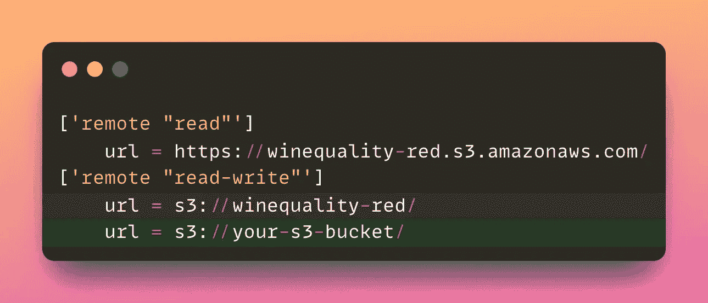

# 使用持续集成构建可靠的机器学习管道

> 原文：[`towardsdatascience.com/build-reliable-machine-learning-pipelines-with-continuous-integration-ea822eb09bf6`](https://towardsdatascience.com/build-reliable-machine-learning-pipelines-with-continuous-integration-ea822eb09bf6)

## 使用持续集成自动化机器学习工作流程

[](https://khuyentran1476.medium.com/?source=post_page-----ea822eb09bf6--------------------------------)[](https://towardsdatascience.com/?source=post_page-----ea822eb09bf6--------------------------------) [Khuyen Tran](https://khuyentran1476.medium.com/?source=post_page-----ea822eb09bf6--------------------------------)

·发表于 [Towards Data Science](https://towardsdatascience.com/?source=post_page-----ea822eb09bf6--------------------------------) ·阅读时长 8 分钟·2023 年 4 月 6 日

--

# 情境

作为数据科学家，你负责改进当前在生产中的模型。在花费几个月时间微调模型后，你发现了一个比原始模型更准确的模型。

对你的突破感到兴奋，你创建了一个拉取请求，将你的模型合并到主分支中。


作者提供的图片

不幸的是，由于众多的变更，你的团队需要超过一周的时间来评估和分析这些变更，这最终阻碍了项目进展。

此外，在部署模型后，你发现由于代码错误导致的意外行为，使公司损失了金钱。


作者提供的图片

回顾来看，**在提交拉取请求后自动化代码和模型测试**本可以避免这些问题，并节省时间和金钱。

持续集成（CI）为这一问题提供了简单的解决方案。

# 什么是 CI？

CI 是将代码更改持续合并和测试到共享仓库中的实践。在机器学习项目中，CI 因多种原因非常有用：

+   **尽早捕获错误**：CI 通过自动测试任何代码更改来促进早期错误的识别，从而在开发阶段实现及时的问题检测

+   **确保可重复性**：CI 通过建立明确且一致的测试程序来帮助确保可重复性，使得复制机器学习项目结果变得更容易。

+   **更快的反馈和决策**：通过提供明确的指标和参数，CI 使得反馈和决策更加迅速，释放了审阅者的时间以处理更关键的任务。


作者提供的图片

本文将展示如何为机器学习项目创建一个 CI 流水线。

随意尝试和分叉本文的源代码：

[](https://github.com/khuyentran1401/cicd-mlops-demo/?source=post_page-----ea822eb09bf6--------------------------------) [## GitHub - khuyentran1401/cicd-mlops-demo: 机器学习项目中的 CI/CD 演示

### 这是文章《构建可靠的机器学习流水线与持续集成》的一个示例项目。CI/CD…

github.com](https://github.com/khuyentran1401/cicd-mlops-demo/?source=post_page-----ea822eb09bf6--------------------------------)

# CI 流水线概述

为机器学习项目构建 CI 流水线的方法可以根据每个公司的工作流程有所不同。在本项目中，我们将创建一个最常见的工作流程来构建 CI 流水线：

1.  数据科学家对代码进行更改，在本地创建一个新模型。

1.  数据科学家将新模型推送到远程存储。

1.  数据科学家为更改创建一个拉取请求。

1.  CI 流水线被触发以测试代码和模型。

1.  如果更改被批准，它们将合并到主分支中。


作者提供的图片

让我们基于这个工作流程举一个例子。

# 构建工作流

假设实验 C 在尝试了各种处理技术和机器学习模型后表现异常出色。因此，我们的目标是将代码和模型合并到主分支中。


作者提供的图片

为了实现这一点，我们需要执行以下步骤：

1.  对实验的输入和输出进行版本控制。

1.  将模型和数据上传到远程存储。

1.  创建测试文件以测试代码和模型。

1.  创建一个 GitHub 工作流。


作者提供的图片

现在，让我们详细探讨这些步骤。

## 对实验的输入和输出进行版本控制

我们将使用 DVC 对流水线实验的输入和输出进行版本控制，包括代码、数据和模型。

[](/dvc-github-actions-automatically-rerun-modified-components-of-a-pipeline-a3632519dc42?source=post_page-----ea822eb09bf6--------------------------------) ## DVC + GitHub Actions: 自动重新运行流水线中修改过的组件

### 快速迭代你的数据科学项目的完美组合

towardsdatascience.com

流水线是根据项目中的文件位置定义的：


作者提供的图片

我们将在 `dvc.yaml` 文件中描述流水线的[阶段](https://dvc.org/doc/command-reference/stage)及其之间的数据依赖关系：

```py
stages:
  process:
    cmd: python src/process_data.py
    deps:
      - data/raw
      - src/process_data.py
    params:
      - process
      - data
    outs:
      - data/intermediate
  train:
    cmd: python src/train.py
    deps:
      - data/intermediate
      - src/train.py
    params:
      - data
      - model
      - train
    outs:
      - model/svm.pkl
  evaluate:
    cmd: python src/evaluate.py
    deps:
      - model
      - data/intermediate 
      - src/evaluate.py
    params:
      - data
      - model
    metrics:
      - dvclive/metrics.json
```

要运行在 `dvc.yaml` 中定义的实验流水线，请在终端中输入以下命令：

```py
dvc exp run
```

我们将获得以下输出：

```py
'data/raw.dvc' didn't change, skipping                                                                                               
Running stage 'process':                                                                                                             
> python src/process_data.py

Running stage 'train':                                                                                                               
> python src/train.py
Updating lock file 'dvc.lock'                                                                                                        

Running stage 'evaluate':                                                                                                            
> python src/evaluate.py
The model's accuracy is 0.65
Updating lock file 'dvc.lock'                                                                                                        

Ran experiment(s): drear-cusp
Experiment results have been applied to your workspace.

To promote an experiment to a Git branch run:

        dvc exp branch <exp> <branch>
```

运行将自动生成`dvc.lock`文件，该文件存储数据、代码和它们之间依赖项的**精确版本**。使用相同版本的输入和输出可以确保将来可以重现相同的实验。

```py
schema: '2.0'
stages:
  process:
    cmd: python src/process_data.py
    deps:
    - path: data/raw
      md5: 84a0e37242f885ea418b9953761d35de.dir
      size: 84199
      nfiles: 2
    - path: src/process_data.py
      md5: 8c10093c63780b397c4b5ebed46c1154
      size: 1157
    params:
      params.yaml:
        data:
          raw: data/raw/winequality-red.csv
          intermediate: data/intermediate
        process:
          feature: quality
          test_size: 0.2
    outs:
    - path: data/intermediate
      md5: 3377ebd11434a04b64fe3ca5cb3cc455.dir
      size: 194875
      nfiles: 4
```

## 将数据和模型上传到远程存储

DVC 使得将管道阶段产生的数据文件和模型上传到`dvc.yaml`文件中的远程存储位置变得简单。

[](/introduction-to-dvc-data-version-control-tool-for-machine-learning-projects-7cb49c229fe0?source=post_page-----ea822eb09bf6--------------------------------) ## DVC 简介：机器学习项目的数据版本控制工具

### 就像 Git 一样，但带有数据！

towardsdatascience.com

在上传文件之前，我们将在文件`.dvc/config`中指定远程存储位置：

```py
['remote "read"']
    url = https://winequality-red.s3.amazonaws.com/
['remote "read-write"']
    url = s3://winequality-red/
```

确保将 S3 桶的 URI 替换为“读写”远程存储 URI。



图片由作者提供

将文件推送到名为“读写”的远程存储位置：

```py
dvc push -r read-write
```

## 创建测试

我们还将生成测试，以验证处理数据、训练模型以及模型本身的代码性能，确保代码和模型符合我们的期望。


图片由作者提供

> 查看所有测试文件 [这里](https://github.com/khuyentran1401/cicd-mlops-demo/tree/ci-main/tests)。

## 创建 GitHub 工作流

现在进入激动人心的部分：创建一个 GitHub 工作流以自动化测试您的数据和模型！如果您不熟悉 GitHub 工作流，我建议阅读[这篇文章](https://docs.github.com/en/actions/learn-github-actions/understanding-github-actions)以获得快速概述。

我们将在文件`.github/workflows/run_test.yaml`中创建名为`Test code and model`的工作流：


图片由作者提供

```py
name: Test code and model
on:
  pull_request:
    paths:
      - conf/**
      - src/**
      - tests/**
      - params.yaml

jobs:
  test_model:
    name: Test processed code and model
    runs-on: ubuntu-latest
    steps:
      - name: Checkout
        id: checkout
        uses: actions/checkout@v2

      - name: Environment setup
        uses: actions/setup-python@v2
        with:
          python-version: 3.8

      - name: Install dependencies
        run: pip install -r requirements.txt

      - name: Pull data and model
        env:
          AWS_ACCESS_KEY_ID: ${{ secrets.AWS_ACCESS_KEY_ID }}
          AWS_SECRET_ACCESS_KEY: ${{ secrets.AWS_SECRET_ACCESS_KEY }}
        run: dvc pull -r read-write

      - name: Run tests
        run: pytest 

      - name: Evaluate model
        run: dvc exp run evaluate

      - name: Iterative CML setup
        uses: iterative/setup-cml@v1

      - name: Create CML report
        env:
          REPO_TOKEN: ${{ secrets.TOKEN_GITHUB }}
        run: |
          # Add the metrics to the report
          dvc metrics show --show-md >> report.md
          # Add the parameters to the report
          cat dvclive/params.yaml >> report.md
          # Create a report in PR
          cml comment create report.md 
```

`on`字段指定管道在拉取请求事件时触发。

`test_model`作业包括以下步骤：

+   查看代码

+   设置 Python 环境

+   安装依赖项

+   使用 DVC 从远程存储位置提取数据和模型

+   使用 pytest 运行测试

+   使用 DVC 实验评估模型

+   设置[Iterative CML](https://cml.dev/)（持续机器学习）环境

+   使用 CML 创建包含指标和参数的报告，并在拉取请求中评论该报告。

请注意，为了使作业正常运行，需要以下内容：

+   AWS 凭证以提取数据和模型

+   [GitHub token](https://docs.github.com/en/authentication/keeping-your-account-and-data-secure/creating-a-personal-access-token)用于评论拉取请求。

为了确保在我们的仓库中安全存储敏感信息，并允许 GitHub Actions 访问它们，我们将使用[加密密钥](https://docs.github.com/en/actions/security-guides/encrypted-secrets)。


图片来自作者

就这样！现在让我们尝试这个项目，看看它是否按照我们预期的方式工作。

# 尝试一下

## 设置

要尝试这个项目，首先创建一个新的仓库，使用项目模板。


克隆仓库到本地机器：

```py
git clone https://github.com/your-username/cicd-mlops-demo
```

设置环境：

```py
# Go to the project directory
cd cicd-mlops-demo

# Create a new branch
git checkout -b experiment

# Install dependencies
pip install -r requirements.txt
```

从名为“read”的远程存储位置拉取数据：

```py
dvc pull -r read
```

## 创建实验

如果对`params.yaml`文件或`src`和`tests`目录中的文件进行任何更改，将触发 GitHub 工作流。为了说明这一点，我们将对`params.yaml`文件进行一些小改动：


图片来自作者

接下来，让我们创建一个带有更改的新实验：

```py
dvc exp run
```

将修改后的数据和模型推送到名为“read-write”的远程存储：

```py
dvc push -r read-write
```

添加、提交并推送更改到仓库：

```py
git add .
git commit -m 'add 100 for C'
git push origin experiment
```

## 创建拉取请求

接下来，通过点击 Contribute 按钮创建拉取请求。


图片来自作者

在仓库中创建拉取请求后，将触发 GitHub 工作流来对代码和模型进行测试。

如果所有测试都通过，将会在拉取请求中添加一个评论，包含新实验的度量和参数。


图片来自作者

这些信息使得审查更容易理解对代码和模型所做的更改。因此，他们可以快速评估这些更改是否符合预期的性能标准，并决定是否批准将 PR 合并到主分支。这是多么酷啊？

# 结论

恭喜！你刚刚学会了如何为你的机器学习项目创建 CI 管道。我希望这篇文章能激励你创建自己的 CI 管道，以确保可靠的机器学习工作流程。

我喜欢写关于数据科学的概念，并玩各种数据科学工具。你可以通过[LinkedIn](https://www.linkedin.com/in/khuyen-tran-1401/)和[Twitter](https://twitter.com/KhuyenTran16)与我联系。

如果你想查看我写的文章中的代码，请给[这个仓库](https://github.com/khuyentran1401/Data-science)加星。关注我在 Medium 上的账号，以便接收我最新的数据科学文章：

[](/build-a-full-stack-ml-application-with-pydantic-and-prefect-915f00fe0c62?source=post_page-----ea822eb09bf6--------------------------------) [## 使用 Pydantic 和 Prefect 构建全栈机器学习应用程序

### 用一行代码创建一个机器学习特征工程的 UI

[如何构建一个 ML 项目以确保可重复性和可维护性](https://towardsdatascience.com/how-to-structure-an-ml-project-for-reproducibility-and-maintainability-54d5e53b4c82?source=post_page-----ea822eb09bf6--------------------------------)

### [如何构建一个全栈 ML 应用程序与 Pydantic 和 Prefect](https://towardsdatascience.com/build-a-full-stack-ml-application-with-pydantic-and-prefect-915f00fe0c62?source=post_page-----ea822eb09bf6--------------------------------)

[4 个 pre-commit 插件以自动化 Python 代码审查和格式化](https://towardsdatascience.com/4-pre-commit-plugins-to-automate-code-reviewing-and-formatting-in-python-c80c6d2e9f5?source=post_page-----ea822eb09bf6--------------------------------)

### **使用此模板开始您的下一个机器学习项目**

[Pytest for Data Scientists](https://towardsdatascience.com/pytest-for-data-scientists-2990319e55e6?source=post_page-----ea822eb09bf6--------------------------------)

### **数据科学项目的 Pytest 完整指南**

**使用 black, flake8, isort 和 interrogate 编写高质量代码**
