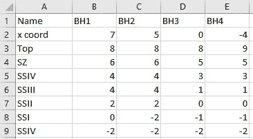
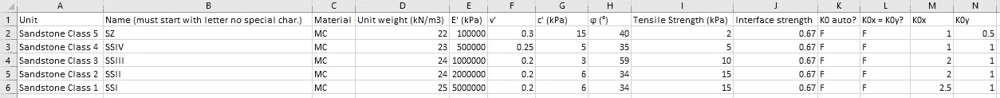
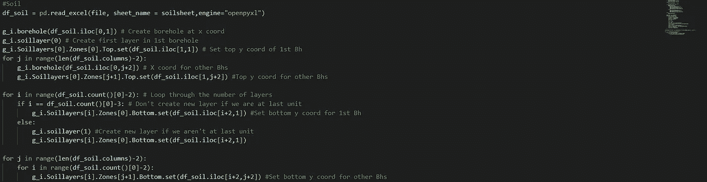
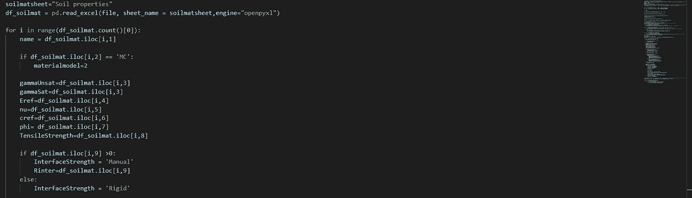
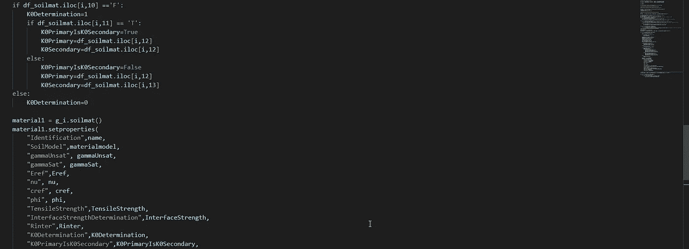
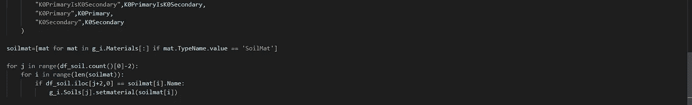
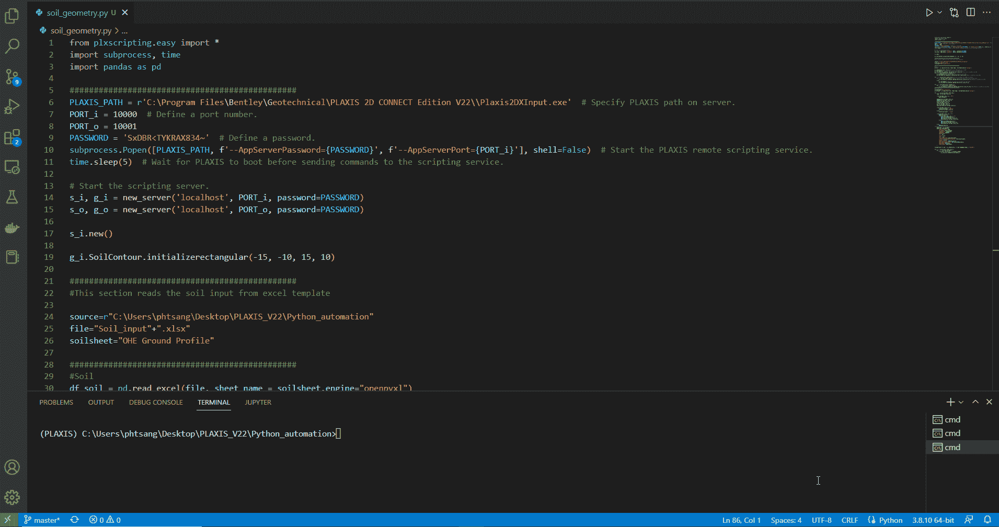
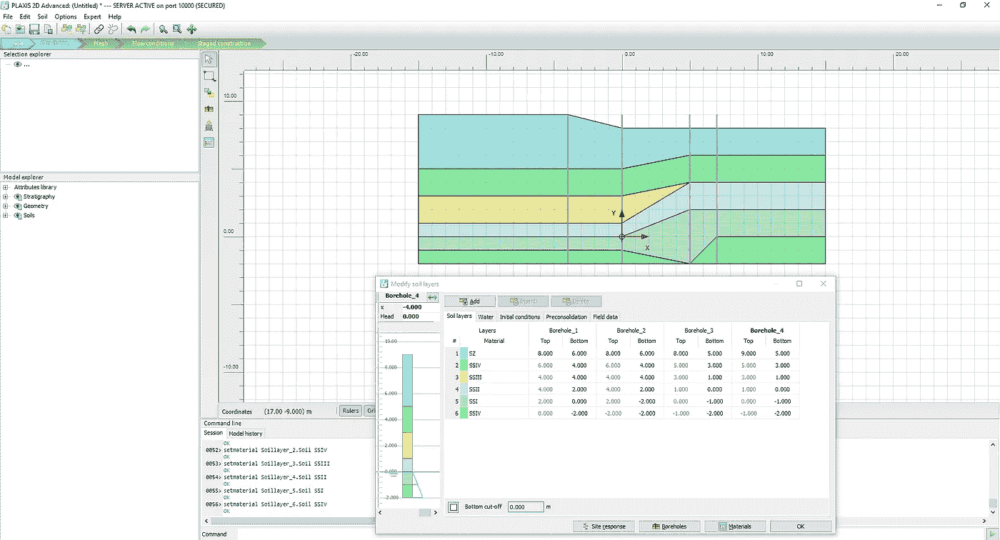
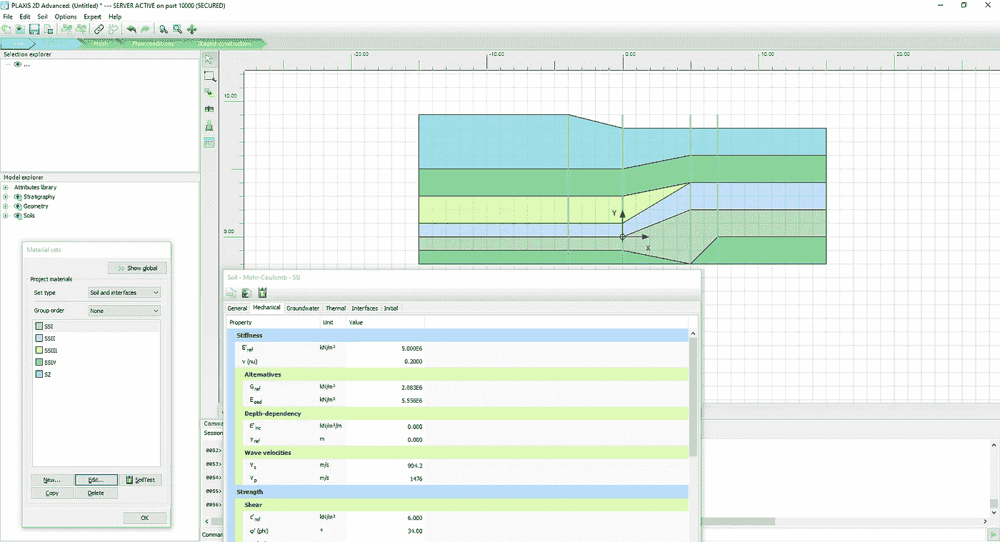

# 使用 Python 自动化 PLAXIS 中的土壤剖面

> 原文：[`towardsdatascience.com/build-soil-profile-in-plaxis-using-python-a9c870e253c7`](https://towardsdatascience.com/build-soil-profile-in-plaxis-using-python-a9c870e253c7)

## PLAXIS 自动化系列

## 自动化的逐步指南

[](https://medium.com/@philip.studio11?source=post_page-----a9c870e253c7--------------------------------)[](https://towardsdatascience.com/?source=post_page-----a9c870e253c7--------------------------------) [Philip Tsang](https://medium.com/@philip.studio11?source=post_page-----a9c870e253c7--------------------------------)

·发表于 [Towards Data Science](https://towardsdatascience.com/?source=post_page-----a9c870e253c7--------------------------------) ·10 分钟阅读·2023 年 1 月 4 日

--


[Kevin Ku](https://unsplash.com/@ikukevk?utm_source=unsplash&utm_medium=referral&utm_content=creditCopyText) 拍摄的照片，来源于 [Unsplash](https://unsplash.com/photos/w7ZyuGYNpRQ?utm_source=unsplash&utm_medium=referral&utm_content=creditCopyText)

作为一名岩土工程师，最重要的 PLAXIS 工作流之一是建立土壤剖面并分配正确的土壤属性。虽然土壤输入界面对用户友好，但这个过程可能会耗时。

可能有改进的空间：

1.  在一个表格中创建多个钻孔。

1.  自动分配每一层的土壤属性。

1.  能够使用重复的土壤属性。当然，这也可以通过 PLAXIS 内置的“.matXdb”来存储材料数据库来实现。然而，Excel 格式提供了更多的灵活性，以根据项目更改材料属性，并且可以链接到其他主电子表格。

本教程旨在扩展从 **第四个教程** 中学到的内容。我们将进一步开发我们的 Excel 界面，以定义土壤剖面并在 PLAXIS 中分配土壤属性。

1.  使用 Pandas 从 Excel 中读取值。

1.  使用 Excel 输入土壤深度并创建土壤剖面

1.  使用 Excel 输入土壤属性并分配材料

与之前一样，本教程要求读者安装 VS Code 和 PLAXIS 环境。如果你对这个页面不熟悉，请按照下面文章中的说明进行操作。

[](/start-using-python-to-automate-plaxis-35a5297321e7?source=post_page-----a9c870e253c7--------------------------------) ## 开始使用 Python 自动化 PLAXIS

### 自动化的逐步指南

towardsdatascience.com

此外，我们还需要在 PLAXIS 环境中安装 *pandas*。如果还未安装外部模块，请按照以下说明进行安装。

## PLAXIS 输出可视化使用 Python

### 自动化的逐步指南

towardsdatascience.com

# Excel 输入界面

类似于第 4 个教程，我们希望创建一个 Excel 输入模板，并在 PLAXIS 中创建土壤剖面。

我们将创建一个空的 Excel 表格，命名为“Soil_input”。该界面包含两个工作表：

+   OHE Ground Profile

+   土壤属性


作者提供的 Excel 截图

创建工作表时，确保它们遵循上述相同的名称，因为名称是区分大小写的。

## OHE Ground Profile

“OHE Ground Profile”工作表的目的是定义土壤单元的名称和深度。这些值将用于在 PLAXIS 中创建相应的钻孔。它涉及以下四个输入值：

1.  名称：指定每个钻孔的名称。此行不会被 Python 提取，但它是我们工作的钻孔的良好跟踪器。例如，B 列包含“BH1”的所有输入值。

1.  x 坐标：定义每个钻孔的 x 坐标。

1.  顶部：定义每个钻孔顶部的 y 坐标。换句话说，就是地质工程中的顶部 R.L.。

1.  土壤单元名称及层级坐标：从第 4 行开始，我们首先在 A 列定义土壤单元名称。然后我们在每个钻孔下方输入每个单元的**底部 y 坐标**。

应强调的是，这个模板旨在输入每个单元的底部坐标。另一个重要说明是，我们应在 A 列中输入所有钻孔的所有单元。类似于 PLAXIS 界面的逻辑，如果我们遇到一个在钻孔中不存在的单元，我们将使用与前一个单元相同的 y 坐标。

以“BH1”为例，我们为“SSIV”和“SSIII”都设置 4 米，这意味着“SSIII”在“BH1”中不存在。



作者提供的 Excel 截图

## 土壤属性

该工作表的目的是定义每个单元的土壤属性。这包括以下列：

+   名称

+   材料

+   单位重量（kN/m³）

+   杨氏模量，E’（kPa）

+   泊松比，v（nu）（-）

+   粘聚力，c’（kPa）

+   摩擦角，phi（度）

+   拉伸强度（kPa）

+   界面强度（-）

+   K0 自动？：T/F 确定 K0 是否在 PLAXIS 中自动计算

+   K0x = K0y？：T/F 确定 K0x 是否等于 K0y

+   K0x（-）

+   K0y（-）



作者提供的 Excel 截图

这些是 PLAXIS 2D 中 Mohr-Coulomb 模型的典型材料属性，只是为了确保所有输入属性都在正确的单位中。还应注意，此模板仅设计用于**排水**条件。

确保你已经创建了包含上述工作表和数值的 Excel 电子表格。

输入文件创建后，我们准备进入下一步。

# 步骤 1：使用 Pandas 从 Excel 中读取值

步骤 1 的主要目标是设置土壤轮廓并读取 Excel 输入模板。

首先，我们创建一个空的 Python 文件，并将其命名为 “soil_geometry.py”。

## 导入模块并启动服务器

与之前的教程类似，我们将首先导入相关模块并启动服务器。

```py
from plxscripting.easy import *
import subprocess, time
import pandas as pd

###############################################
PLAXIS_PATH = r'C:\Program Files\Bentley\Geotechnical\PLAXIS 2D CONNECT Edition V22\\Plaxis2DXInput.exe'  # Specify PLAXIS path on server.
PORT_i = 10000  # Define a port number.
PORT_o = 10001
PASSWORD = 'SxDBR<TYKRAX834~'  # Define a password.
subprocess.Popen([PLAXIS_PATH, f'--AppServerPassword={PASSWORD}', f'--AppServerPort={PORT_i}'], shell=False)  # Start the PLAXIS remote scripting service.
time.sleep(5)  # Wait for PLAXIS to boot before sending commands to the scripting service.

# Start the scripting server.
s_i, g_i = new_server('localhost', PORT_i, password=PASSWORD)
s_o, g_o = new_server('localhost', PORT_o, password=PASSWORD)

s_i.new()

g_i.SoilContour.initializerectangular(-15, -10, 15, 10)
```

## 读取 Excel 文件

文件位置：C:\Users\phtsang\Desktop\PLAXIS_V22\Python_automation

文件名：我们之前创建的电子表格，即 “Soil_input.xlsx”

由于我们要从 “OHE Ground Profile” 中提取值，我们将使用 “pd.read_excel()” 并通过 “sheet_name” 指定要读取的工作表。

```py
source=r"C:\Users\phtsang\Desktop\PLAXIS_V22\Python_automation"
file="Soil_input"+".xlsx"
soilsheet="OHE Ground Profile"
```

一旦我们设置好 Excel 模板，就可以使用这些值创建土壤剖面。

# 步骤 2：使用 Excel 输入土壤深度并创建土壤剖面

在步骤 2 中，我们将从 “OHE Ground Profile” 工作表中提取钻孔值，并相应地创建土壤剖面。

输入表格涉及的信息如下所示。我们需要这些信息来参考我们的代码。


作者从 Excel 截图

我们将使用**pandas**的方法从 Excel 中提取值。详细说明请参阅以下文章。

[](/using-python-to-interact-with-excel-plaxis-input-a2124f6ebc72?source=post_page-----a9c870e253c7--------------------------------) ## 使用 Python 与 Excel (PLAXIS 输入) 交互

### 自动化的逐步指南

[towardsdatascience.com

+   首先，我们需要从 “OHE Ground Profile” 工作表中提取值，并将其存储为 “df_soil”。

```py
#Soil
df_soil = pd.read_excel(file, sheet_name = soilsheet,engine="openpyxl")
```

+   然后，我们需要使用 “BH1” 列中的 X 坐标（即 df_soil.iloc[0,1]）创建第一个钻孔。需要注意的是，数据框的第一行被跳过了。

```py
g_i.borehole(df_soil.iloc[0,1]) # Create borehole at x coord
```

+   使用 PLAXIS 命令 ‘g_i.soillayer(0)’ 创建第一个土壤层

```py
g_i.soillayer(0) # Create first layer in 1st borehole
```

+   之后，我们将使用如下命令设置第一个钻孔的顶部 y 坐标。

Soillayers[0]：表示第一个土壤层。Soillayers[1] 将表示第二层，依此类推。

Zones[0]：表示第一个钻孔。

Top.set：允许我们指定土壤单元的顶部 y 坐标。只需为第一层设置一次，因为随后的层将自动从前一层获取底部 y 坐标作为其顶部 y 坐标（类似于 PLAXIS 的做法）。

```py
g_i.Soillayers[0].Zones[0].Top.set(df_soil.iloc[1,1]) # Set top y coord of 1st Bh
```

+   接下来，我们将遍历其他钻孔列（即 BH2–4），以 (1) 创建具有给定 x 坐标的钻孔，并 (2) 设置顶部 y 坐标。

```py
for j in range(len(df_soil.columns)-2):
    g_i.borehole(df_soil.iloc[0,j+2]) # X coord for other Bhs
    g_i.Soillayers[0].Zones[j+1].Top.set(df_soil.iloc[1,j+2]) #Top y coord for other Bhs
```

+   一旦我们设置了每个钻孔的顶部坐标，我们就遍历其余的层，并为第一个钻孔设置相应的底部坐标。

+   这里我们需要检查循环是否到达最后一层。如果没有到达最后一层，需要使用命令 ‘g_i.soillayer(1)’ 创建新层，否则，不创建新层。

```py
for i in range(df_soil.count()[0]-2): # Loop through the number of layers
    if i == df_soil.count()[0]-3: # Don't create new layer if we are at last unit
        g_i.Soillayers[i].Zones[0].Bottom.set(df_soil.iloc[i+2,1]) #Set bottom y coord for 1st Bh
    else:
        g_i.soillayer(1) #Create new layer if we aren't at last unit
        g_i.Soillayers[i].Zones[0].Bottom.set(df_soil.iloc[i+2,1])
```

+   最后，我们遍历其余的钻孔（除第一个钻孔外），并使用以下代码设置底部坐标。

```py
for j in range(len(df_soil.columns)-2):
    for i in range(df_soil.count()[0]-2):
        g_i.Soillayers[i].Zones[j+1].Bottom.set(df_soil.iloc[i+2,j+2]) #Set bottom y coord for other Bhs
```

最终脚本应如下所示：

```py
df_soil = pd.read_excel(file, sheet_name = soilsheet,engine="openpyxl")

g_i.borehole(df_soil.iloc[0,1])
g_i.soillayer(0)
g_i.Soillayers[0].Zones[0].Top.set(df_soil.iloc[1,1])
for j in range(len(df_soil.columns)-2):
    g_i.borehole(df_soil.iloc[0,j+2])
    g_i.Soillayers[0].Zones[j+1].Top.set(df_soil.iloc[1,j+2])

for i in range(df_soil.count()[0]-2):
    if i == df_soil.count()[0]-3:
        g_i.Soillayers[i].Zones[0].Bottom.set(df_soil.iloc[i+2,1])
    else:
        g_i.soillayer(1)
        g_i.Soillayers[i].Zones[0].Bottom.set(df_soil.iloc[i+2,1])

for j in range(len(df_soil.columns)-2):
    for i in range(df_soil.count()[0]-2):
        g_i.Soillayers[i].Zones[j+1].Bottom.set(df_soil.iloc[i+2,j+2])
```



作者提供的 VS Code 截图

创建土壤剖面后，我们可以为每个土壤单元定义土壤属性。

# 第 3 步：用 Excel 输入土壤属性并分配材料

在第 3 步中，我们旨在从 “土壤属性” 工作表中提取土壤属性，并将这些属性分配给前一节中在 A 列指定的层对象（即 “SZ”，“SSIV”等）。

输入表中涉及的信息如下所示。


作者提供的 Excel 截图

+   与之前的步骤类似，我们首先从 “土壤属性” 中读取值并将其存储为 dataframe。

```py
soilmatsheet="Soil properties"
df_soilmat = pd.read_excel(file, sheet_name = soilmatsheet,engine="openpyxl")
```

+   “Excel 输入界面” 下提到的典型土壤属性为 Mohr-Coulomb 模型所用。我们将遍历表中的行，使用 iloc 查找每个值并将其分配给相应的变量。

+   要在 PLAXIS 中使用 Python 访问土壤模型，应使用在 PLAXIS 中显示的数字值。例如，“线性弹性”模型用 1 表示，“莫尔-库仑”模型用 2 表示，以此类推。

```py
for i in range(df_soilmat.count()[0]):
    name = df_soilmat.iloc[i,1]

    if df_soilmat.iloc[i,2] == 'MC':
        materialmodel=2

    gammaUnsat=df_soilmat.iloc[i,3]
    gammaSat=df_soilmat.iloc[i,3]
    Eref=df_soilmat.iloc[i,4]
    nu=df_soilmat.iloc[i,5]
    cref=df_soilmat.iloc[i,6]
    phi= df_soilmat.iloc[i,7]
    TensileStrength=df_soilmat.iloc[i,8]
```

+   然后，如果 Excel 模板中提供了值，我们将分配一个界面强度比。为此，我们需要将 “手动” 作为字符串分配给 ‘InterfaceStrength’，并将给定的比率分配给 ‘Rinter’。如果没有提供值，“刚性” 将自动分配给 ‘InterfaceStrength’。

```py
 if df_soilmat.iloc[i,9] >0:
        InterfaceStrength = 'Manual'
        Rinter=df_soilmat.iloc[i,9]
    else:
        InterfaceStrength = 'Rigid'
```

+   土壤属性的最后一个组件是 K0 条件。我们需要决定 K0 确定是 “手动” 还是 “自动”。在 PLAXIS-Python 环境中，“自动”和“手动”分别用 0 和 1 表示。

+   我们还需要根据用户输入检查 K0x 是否等于 K0y。Python 中 “K0x = K0y” 的选中和未选中框分别用 True 和 False 表示。

```py
 if df_soilmat.iloc[i,10] =='F':
        K0Determination=1
        if df_soilmat.iloc[i,11] == 'T':
            K0PrimaryIsK0Secondary=True
            K0Primary=df_soilmat.iloc[i,12]
            K0Secondary=df_soilmat.iloc[i,12]
        else:
            K0PrimaryIsK0Secondary=False
            K0Primary=df_soilmat.iloc[i,12]
            K0Secondary=df_soilmat.iloc[i,13]
    else:
        K0Determination=0
```

+   然后，使用 PLAXIS 命令 ‘setproperties()’ 设置材料属性，类似于第 4 个教程。

```py
 material1 = g_i.soilmat()
    material1.setproperties(
        "Identification",name,
        "SoilModel",materialmodel,
        "gammaUnsat", gammaUnsat,
        "gammaSat", gammaSat,
        "Eref",Eref,
        "nu", nu,
        "cref", cref,
        "phi", phi,
        "TensileStrength",TensileStrength,
        "InterfaceStrengthDetermination",InterfaceStrength,
        "Rinter",Rinter,
        "K0Determination",K0Determination,
        "K0PrimaryIsK0Secondary",K0PrimaryIsK0Secondary,
        "K0Primary",K0Primary,
        "K0Secondary",K0Secondary
    )
```

+   之后，我们将土壤材料存储为 ‘soilmat’ 对象。

```py
soilmat=[mat for mat in g_i.Materials[:] if mat.TypeName.value == 'SoilMat']
```

+   最后一步是根据 “OHE 地面剖面” 工作表中的 “名称” 列（即 A 列）将材料设置到土壤层。我们需要使用 if 检查表中提供的材料名称。如果材料名称与现有材料对象匹配，则使用 ‘Soils.setmaterial()’ 将该材料分配给土壤层。

```py
for j in range(df_soil.count()[0]-2):
    for i in range(len(soilmat)):
        if df_soil.iloc[j+2,0] == soilmat[i].Name:
            g_i.Soils[j].setmaterial(soilmat[i])
```

最终脚本如下所示：

```py
soilmatsheet="Soil properties"
df_soilmat = pd.read_excel(file, sheet_name = soilmatsheet,engine="openpyxl")

for i in range(df_soilmat.count()[0]):
    name = df_soilmat.iloc[i,1]

    if df_soilmat.iloc[i,2] == 'MC':
        materialmodel=2

    gammaUnsat=df_soilmat.iloc[i,3]
    gammaSat=df_soilmat.iloc[i,3]
    Eref=df_soilmat.iloc[i,4]
    nu=df_soilmat.iloc[i,5]
    cref=df_soilmat.iloc[i,6]
    phi= df_soilmat.iloc[i,7]
    TensileStrength=df_soilmat.iloc[i,8]

    if df_soilmat.iloc[i,9] >0:
        InterfaceStrength = 'Manual'
        Rinter=df_soilmat.iloc[i,9]
    else:
        InterfaceStrength = 'Rigid'

    if df_soilmat.iloc[i,10] =='F':
        K0Determination=1
        if df_soilmat.iloc[i,11] == 'T':
            K0PrimaryIsK0Secondary=True
            K0Primary=df_soilmat.iloc[i,12]
            K0Secondary=df_soilmat.iloc[i,12]
        else:
            K0PrimaryIsK0Secondary=False
            K0Primary=df_soilmat.iloc[i,12]
            K0Secondary=df_soilmat.iloc[i,13]
    else:
        K0Determination=0

    material1 = g_i.soilmat()
    material1.setproperties(
        "Identification",name,
        "SoilModel",materialmodel,
        "gammaUnsat", gammaUnsat,
        "gammaSat", gammaSat,
        "Eref",Eref,
        "nu", nu,
        "cref", cref,
        "phi", phi,
        "TensileStrength",TensileStrength,
        "InterfaceStrengthDetermination",InterfaceStrength,
        "Rinter",Rinter,
        "K0Determination",K0Determination,
        "K0PrimaryIsK0Secondary",K0PrimaryIsK0Secondary,
        "K0Primary",K0Primary,
        "K0Secondary",K0Secondary
    )

soilmat=[mat for mat in g_i.Materials[:] if mat.TypeName.value == 'SoilMat']

for j in range(df_soil.count()[0]-2):
    for i in range(len(soilmat)):
        if df_soil.iloc[j+2,0] == soilmat[i].Name:
            g_i.Soils[j].setmaterial(soilmat[i])
```



作者在 VS Code 中的截图

使用以下脚本运行。

```py
(PLAXIS) C:\Users\phtsang\Desktop\PLAXIS_V22\Python_automation>python soil_geometry.py
```

你应该会看到在 PLAXIS 2D 中创建了如下内容。从土壤窗口中可以看到，所有钻孔都是根据 Excel 输入创建的。



作者在 PLAXIS 中的截图



作者在 PLAXIS 中的截图

在土壤属性方面，所有土壤单元都已根据我们在输入表中指定的属性创建。



太棒了！我们刚刚通过 PLAXIS 2D 的用户界面创建了一个带有材料定义的土壤剖面。

# 结论

这就是第五个关于使用 Python 创建土壤剖面（包括材料定义）的教程。完成此教程后，你应该能够从 Excel 获取土壤输入并创建剖面，同时在 PLAXIS 中分配土壤属性。

如果你喜欢阅读这种内容，可以随时关注我的页面。我会继续发布关于使用 Python 自动化 PLAXIS 的系列教程。除此之外，我还热衷于分享如何使用 Python 自动化工程工作流程的知识。

[](https://medium.com/@philip.studio11/membership?source=post_page-----a9c870e253c7--------------------------------) [## 通过我的推荐链接加入 Medium - Philip Tsang

### 阅读 Philip Tsang 的每一个故事（以及 Medium 上其他成千上万的作者）。你的会员费用直接支持…

medium.com](https://medium.com/@philip.studio11/membership?source=post_page-----a9c870e253c7--------------------------------)
