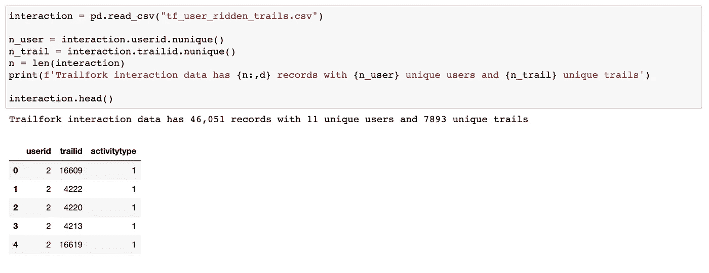

# 为 TrailForks 构建推荐系统

> 原文：[`towardsdatascience.com/build-trail-recommender-for-trailforks-8ea64b1a2fe4?source=collection_archive---------13-----------------------#2023-01-04`](https://towardsdatascience.com/build-trail-recommender-for-trailforks-8ea64b1a2fe4?source=collection_archive---------13-----------------------#2023-01-04)

## 我是如何赢得 Outside 2022 创新日奖的

[](https://medium.com/@wen_yang?source=post_page-----8ea64b1a2fe4--------------------------------)[](https://towardsdatascience.com/?source=post_page-----8ea64b1a2fe4--------------------------------) [Wen Yang](https://medium.com/@wen_yang?source=post_page-----8ea64b1a2fe4--------------------------------)

·

[关注](https://medium.com/m/signin?actionUrl=https%3A%2F%2Fmedium.com%2F_%2Fsubscribe%2Fuser%2Fcbb5383bd438&operation=register&redirect=https%3A%2F%2Ftowardsdatascience.com%2Fbuild-trail-recommender-for-trailforks-8ea64b1a2fe4&user=Wen+Yang&userId=cbb5383bd438&source=post_page-cbb5383bd438----8ea64b1a2fe4---------------------post_header-----------) 发表在 [Towards Data Science](https://towardsdatascience.com/?source=post_page-----8ea64b1a2fe4--------------------------------) · 11 分钟阅读 · 2023 年 1 月 4 日 [](https://medium.com/m/signin?actionUrl=https%3A%2F%2Fmedium.com%2F_%2Fvote%2Ftowards-data-science%2F8ea64b1a2fe4&operation=register&redirect=https%3A%2F%2Ftowardsdatascience.com%2Fbuild-trail-recommender-for-trailforks-8ea64b1a2fe4&user=Wen+Yang&userId=cbb5383bd438&source=-----8ea64b1a2fe4---------------------clap_footer-----------)

--

[](https://medium.com/m/signin?actionUrl=https%3A%2F%2Fmedium.com%2F_%2Fbookmark%2Fp%2F8ea64b1a2fe4&operation=register&redirect=https%3A%2F%2Ftowardsdatascience.com%2Fbuild-trail-recommender-for-trailforks-8ea64b1a2fe4&source=-----8ea64b1a2fe4---------------------bookmark_footer-----------)

摄影：[Kristin Snippe](https://unsplash.com/@frausnippe?utm_source=medium&utm_medium=referral) 摄于 [Unsplash](https://unsplash.com/?utm_source=medium&utm_medium=referral)

# 长背景故事

当我在 2021 年 5 月首次加入 [Outside Inc](https://www.outsideinc.com/) 时，我的工作是构建一个个性化推荐系统，以驱动 Outside Feed。Outside Feed 包含各种户外和活跃生活方式的内容，以文章、视频、Outside 电影和播客等混合媒介格式呈现。我们的目标是激励人们走出户外。

快进到 17 个月后，我们对 Outside Feed 的推荐系统进行了两次重大改造：

1.  从逆时间顺序的动态信息流到由混合推荐器驱动的动态信息流，其中包括三种经典的推荐系统功能：协同过滤、基于内容的过滤和热门与趋势。模型训练和推理是基于批次的。使用 80–20 法则，这种系统可以让你在提供个性化推荐时，借助相对较少的努力达到 80%。这里的“低”努力主要是指算法复杂性方面。

1.  从基于批次的混合推荐系统到实时推荐系统。我们开始集成 [Miso.ai](https://miso.ai/) —— 一个第三方工具，用来充分利用 MetaRouter 收集的点击流事件数据，并生成实时推荐。由于我们使用 GraphQL，关于在 Apollo 中封装 REST API 以及在 DataDog 中进行监控，我们学到了很多经验，这些经验值得另写一篇文章。

在这篇文章中，我记录了我参加 Outside Innovation Day 的经验，在一天内使用 Trailforks 数据构建了一个原型小径推荐系统。（PS：是的，Trailforks 现在是 Outside 家族的一部分！）也许因为我的很多同事都是热衷的徒步旅行者、山地自行车爱好者和户外运动爱好者，他们亲身体验了有一个小径推荐系统来帮助发现探索小径的乐趣和放松。他们都友好地为我的项目投了票，我赢得了 Outside Innovation Day 最能体现我们使命的奖项！（非常幸运和开心 😁 ~~~）。

以下是我将分享的三件事：

🏔️ 1\. 如何以 20% 的努力构建 80% 个性化的推荐系统（使用 Trailforks 数据）？

🏔️ 2\. 为准备黑客马拉松类型的项目考虑的事项

🏔️ 3\. 生产化推荐系统的进一步考虑

# 🏔️ 1\. Trail Recommender 的 80–20 法则

有很多高级推荐系统，但协同过滤 + 基于内容的推荐系统的混合真的是个性化推荐系统的最佳选择。它可以以约 20% 的工程努力覆盖 80% 的内容。

协同过滤涉及分析其他具有相似口味的用户的偏好，并基于这些用户的偏好推荐小径。


由 Wen Yang 创建的图像

另一方面，基于内容的过滤涉及分析小径本身的特征，并推荐与用户偏好相似的小径。


Wen Yang 制作的图像

构建一个 80–20 小径推荐系统涉及三个步骤。

**步骤 1：首先，你需要收集数据。**

有两种数据对于构建推荐系统特别有用。

+   **交互数据集**：包括 `userid`、`trailid` 和 `activitytype`。前两个最为重要，而第三个特征 `activitytype` 在我的项目中未使用。



预览 Trailforks 互动数据集

+   **目录数据集**: 包括选定小径的信息，如小径的位置、长度、难度等级、全球排名分数等。


**步骤 2: 使用 Altair 进行数据可视化**

从互动数据集中，只有 10 个用户，其中一个用户（userid = 454369）探索了 2524 条独特的小径。（PS：他的名字是 Trevor，他是 TrailForks 的创始工程师——这完全合理！）

```py
import altair as alt

bars = alt.Chart(df_raw).mark_bar().encode(
    x='n_trails_interacted:Q',
    y='userid:O')

text = bars.mark_text(
    align='left',
    baseline='middle',
    dx=3  # Nudges text to right so it doesn't appear on top of the bar
).encode(
    text='n_trails_interacted:Q'
)

(bars + text).properties(height=400)
```


以下代码可以为每个变量名生成一个柱状图：

```py
def plot_variable(variable):
    source = df_trail_sub
    bar = alt.Chart(source).mark_bar().encode(
        x='count():Q',
        y=alt.Y(f'{variable}:N', sort='-x')
    )
    return bar
```

比如，我们来看看小径方向、物理评分难度标题和国家名称：


起初，我尝试使用 `global_rank_score` 作为“流行度”特征，但有太多记录缺少这个特征。幸运的是，`rating` 与 `global_rank_score` 存在正相关。下面是我最喜欢的可视化类型之一，使用 `altair` 可以很容易地完成。

```py
def plot_points_bar():
    brush = alt.selection(type='interval')
    points = alt.Chart(df_trail_sub).mark_point().encode(
    x='global_rank_score',
    y='rating',
    color=alt.condition(brush, 'difficulty_title', alt.value('lightgray'))
).add_selection(
    brush
)

    bars = alt.Chart(df_trail_sub).mark_bar().encode(
        y='difficulty_title',
        color='difficulty_title',
        x='count(difficulty_title)'
    ).transform_filter(
        brush
    )

    return points & bars
```


同样，我们可以使用 `difficulty_title` 替代 `physical_rating` 来表示难度等级，因为前者的缺失值比后者少。

+   中等 → 蓝色，黑钻

+   困难 → 黑钻，蓝色

+   极端 → 双黑钻

+   简单 → 绿色

```py
alt.Chart(dt).mark_circle().encode(
    x='difficulty_title:O',
    y='physical_rating:O',
    size= alt.Size('pct:Q',scale=alt.Scale(range=[10, 2000])),
    color= 'physical_rating'
).properties(width=400, height=300)
```


**步骤 3a: 使用** `**implicit**` **构建协同过滤模型**

对于协同过滤，你所需要的唯一数据集是互动数据集。这里我计算了三个其他特征：

+   `n_times_interacted` : 该用户与此小径互动了多少次

+   `n_trails_interacted` : 该用户探索了多少条小径

+   `n_users_interacted` : 多少独特用户探索了这条小径

思路是使用 `n_times_interacted` 作为隐式反馈特征：用户探索某条小径的次数越多，就越能确定用户喜欢这条小径。


模型训练：

```py
import implicit
import scipy.sparse as sparse

n_user = df_raw.userid.nunique()
n_item = df_raw.trailid.nunique()

# Prepare ALS training data
sparse_user_item = sparse.csr_matrix((df_raw['n_times_interacted'].astype(float), 
                                      (df_raw['userid'], df_raw['trailid'])))

# initialize a model: set random_state for reproducibility!
model = implicit.als.AlternatingLeastSquares(factors=40, 
                                             regularization=0.1, 
                                             iterations=15, 
                                             random_state=10)
# train the model on a sparse matrix of user/item/confidence weights
model.fit(sparse_user_item)
```

推理的有用函数：

```py
import requests
from ipywidgets import Image

def get_recommendations(userid, n):
    rec, relevance = model.recommend(userid, sparse_user_item[userid], 
                                     N=n, 
                                     filter_already_liked_items=True
                                    )

    df_rec = df_trail.loc[df_trail['trailid'].isin(rec)]
    return df_rec

def show_photo(df_rec):
    photo_url = df_rec['cover_photo_url'].iloc[0]
    image = Image(value=requests.get(photo_url).content)
    return image

def show_map(df_rec):
    map_url = df_rec['static_map_url'].iloc[0]
    image = Image(value=requests.get(map_url).content)
    return image
```

🌄 DEMO: 使用协同过滤为 Trevor 推荐小径

我使用了 `pandas-profiling` 来了解 Trevor 对小径的偏好，以下是观察结果：

+   physical_rating: 中等，困难

+   difficulty_title: 蓝色，黑钻

+   trailtype: 单轨

+   方向：仅限下坡

+   最多被探索的小径：Fitzsimmons Connector（319 次！）


让我们从协同过滤模型中获取推荐 →


以及第一个推荐小径的照片和地图：


**步骤 3b: 基于内容的过滤**

由于协同过滤基于交互数据集，这意味着它在冷启动用户场景下不起作用。如果新用户没有探索任何路线，我们将无法找到与该新用户相似的用户。这就是为什么我们需要基于内容的过滤来填补这个空白。

基于内容的过滤完全是关于寻找“相似的路线”，因此我们需要决定两件事：

+   在什么特征上相似

+   如何测量相似性

第一个问题是特征工程问题。以下特征被选为路线特征：

+   数值特征：`stat_climb` 、`stat_descent` 、`stat_distance` 、`rating`

+   文本特征：`title`、`difficulty_title`、`trailtype`、`direction` 和 `country_title`

对于第二个问题，我们使用余弦相似度，这是在推荐系统实践中常用的度量方法。

💻 特征工程和相似度计算的代码示例

```py
from sklearn.feature_extraction.text import TfidfVectorizer,CountVectorizer
from sklearn.metrics.pairwise import cosine_similarity
from sklearn.preprocessing import StandardScaler
from sklearn.metrics import pairwise_distances

def model_tfidf_num(trail_data):

    # scale numerical data (continuous) : global_rank_score missing values
    trail_data_numerical = trail_data[['stat_climb', 'stat_descent',
                                       'stat_distance','rating']]
    scaler_num = StandardScaler().fit(trail_data_numerical)
    df_num_scaled = scaler_num.transform(trail_data_numerical)

    # vectorize text data
    tfidf = TfidfVectorizer()
    tfidf_matrix = tfidf.fit_transform(trail_data['comb_text_clean']).toarray()

    # concatenate and get similarity
    all_features = np.concatenate([tfidf_matrix,df_num_scaled],axis=1)
    #cosine_sim = cosine_similarity(all_features, all_features)

    return all_features

def get_similar(idx, n):

#idx: target item's index

    # 1\. compute distance
    target_feature = all_features[idx]
    couple_dist = pairwise_distances(all_features,
                                     target_feature, metric='cosine')
    # 2\. get similar dataframe: no need to filter out the first
    # because the first won't be the unseen url
    indices = list(
        map(lambda x: x.item(), np.argsort(couple_dist.ravel())))
    # similar_score
    cosine_similarity = 1 - couple_dist[indices].ravel()

    df_sim_all = pd.DataFrame(
        {"tfidf_index": indices, "similar_score": cosine_similarity})

    df_sim = df_sim_all[1:n+1]
    df_out = df_sim.merge(df_mapper, on='tfidf_index')

    return df_out
```

🌄 DEMO：使用基于内容的过滤为 Trevor 推荐路线

让我们找到与 Trevor 的第二条最常探索的路线（‘A-Line — Lower’）相似的路线


哇！基于内容的推荐器非常令人印象深刻，它推荐了大多数中等到困难难度的山地车路线和下坡方向的路线。我的同事 Trevor 是一个资深的山地车骑行者，他对这样的推荐非常满意！

好吧，现在艰苦的工作已经完成。我想分享一些反思。

# 🏔️ 2. 准备黑客马拉松类型项目时需要考虑的事项

从参与黑客马拉松类型的项目中我学到的最大教训是“少即是多”。尽管很诱人去构建一个包括数据科学组件、后端数据库组件以及前端或只是用于更好演示的 streamlit 组件的推荐系统，但黑客马拉松通常时间有限，你需要意识到哪些部分你愿意稍微牺牲一点，以便留出时间做其他事情。对我来说，这些部分是：

+   EDA 和数据可视化：探索性数据分析就像一个黑洞，它可以把你吸进去，并且没有明显的结束点。数据可视化也是如此，你可能会花费无尽的时间来美化一个图表，但这只会将你的项目从 80 提升到 82，这与 80-20 规则相反。我的解决方案是`pandas-profiling` 和 `altair`。在进行任何数据分析之前，我会使用 `pandas-profiling` 来检查缺失值、总体分布和相关性，这将帮助我缩小可以保留的数据范围并为特征工程做准备。`altair` 使用起来非常简单，通过几行紧凑的代码，你可以轻松制作出漂亮的条形图和散点+分布图。我有一个小技巧，就是提前在笔记本中复制几个代码片段，只使用已经在笔记本中的那些代码，以避免任何进一步的诱惑。

+   演示是关于讲故事的。你可以熬夜制作最华丽和最复杂的黑客松项目，但你需要留出足够的时间来准备如何讲述这个故事。一个故事可以从 Why（你为什么要做这个项目的动机和背景）、What（发生了什么，什么令人惊讶，什么有效）、一点点 How（保持在高层次，方程式和代码本身很令人印象深刻，但它会给那些只有 5 分钟时间理解你的项目的人带来不必要的威慑和疲惫）开始。例如，这篇文章绝对过长，细节过多，不符合演示标准。最后，加入一些戏剧性和幽默感总是一个优势。

# 🏔️ 3\. 将推荐系统生产化的进一步考虑

最后，如果你已经看到这里，并且真的想将原型推荐系统投入生产，我有三点幽灵知识*想与大家分享：

*幽灵知识 (*[*来源*](https://vickiboykis.com/2021/03/26/the-ghosts-in-the-data/)*) :*

> 知识存在于某个认知社区中，也许某个社区的核心成员很容易获得，但实际上并没有被写下来，也不清楚如何获取它。

1.  批量 vs 实时推荐系统：批量系统听起来简单直接，但它有其自身的复杂性。如果你使用`implicit`进行协同过滤并使用`cosine similarity`检索类似内容，很可能延迟无法满足你的前端 API 要求。你可以尝试使用像 FAISS 这样的索引来提高速度，但它可能仍然高于 500ms。这就是为什么你可能考虑对每个用户和每个项目进行批量计算。根据用户和项目的规模，批量推荐可能需要超过 4 小时，并且直到你重新训练模型才会刷新。一个快速提示是，仅使用过去 90 天内有任何互动的用户，或仅对过去 90 天内发布的项目进行批量更新。

1.  “Cold-Start” 可能并不像你想象的那么严重：我记得当我第一次学习推荐系统时，书籍和讲座总是强调“cold-start”问题，好像这是最难解决的场景。然而，对于 Outside Feed 来说，这个问题甚至不在前 3 名。原因是很多人习惯于在 Outside Feed 上阅读最新的内容，因此通过发布日期对内容进行排序，以便展示新项（冷项）是相当容易的，从而能够保证新项获得页面浏览（互动）数据。对我们来说，更难的问题实际上是“如何推荐永恒的内容”？如果我们推荐一篇最初于 2016 年撰写的全时热门文章，即使这篇内容可能符合用户的口味，用户可能会觉得我们没有新鲜的内容可以推荐。

1.  第三个知识点是我从另一位推荐系统从业者（Andy - 来自[miso.ai](https://miso.ai/)的 CTO）那里听到的趣闻：他曾经为一个服装网站构建了一个主页推荐系统。尽管学习排名的系统了解到“黑色”可能是最受欢迎的颜色，因此推荐了首页上全是黑色的不同风格的服装。好吧，模型并没有错，但乍一看效果很糟糕，并且在吸引人们购买衣物方面表现不佳。他开玩笑说，他研究推荐系统已经很多年了，但没有人提到好的颜色搭配设计可能会有很大的影响。

这就是我在 2022 年的最后一篇中等帖子。非常感谢你的支持。如果你有任何想法或反思，或者更好——更多的推荐系统趣闻，请发送给我！我很乐意将它们编入我梦想写的迷人书籍《构建推荐系统的乐趣与悲哀》中 < The Pleasure and Sorrow of Building RecSys> 🐳~~~
