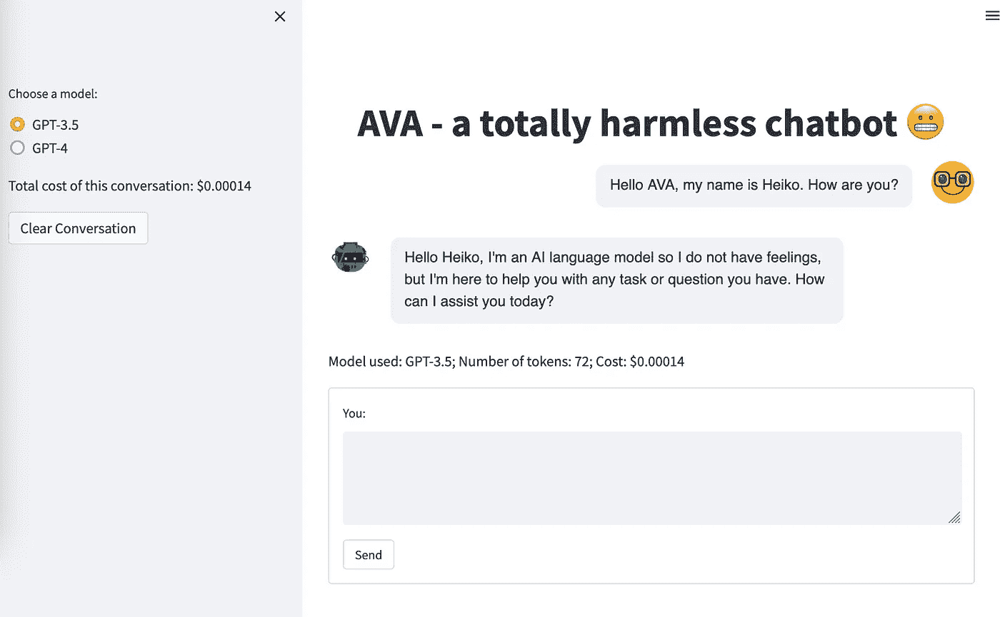
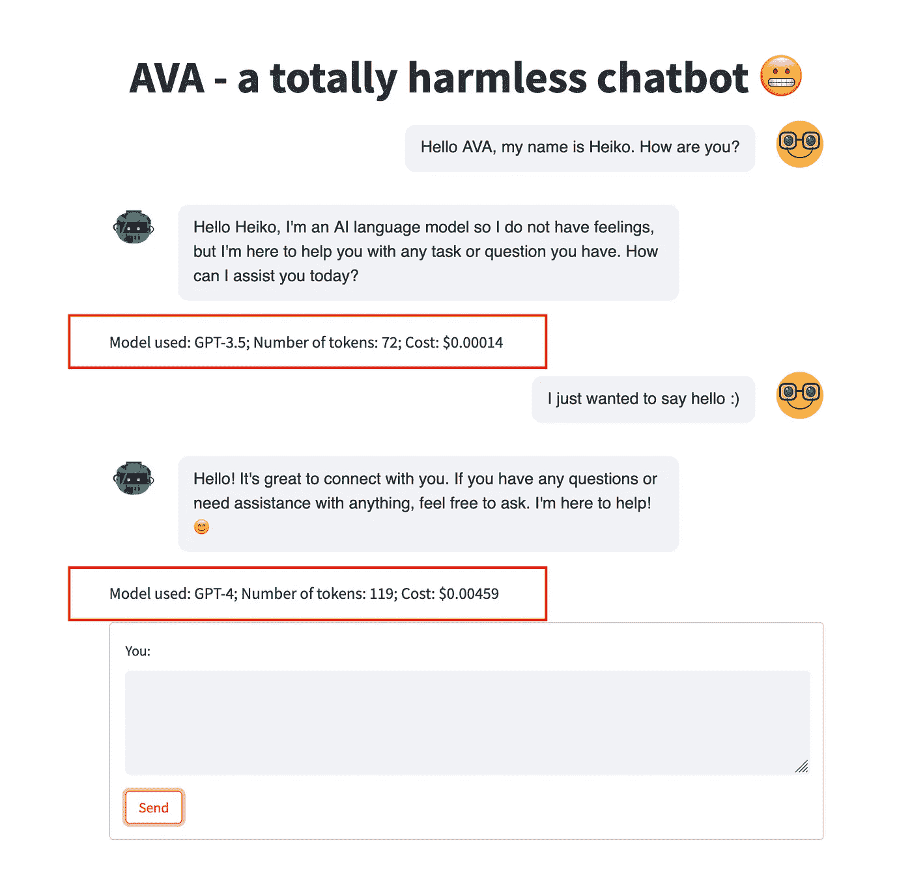
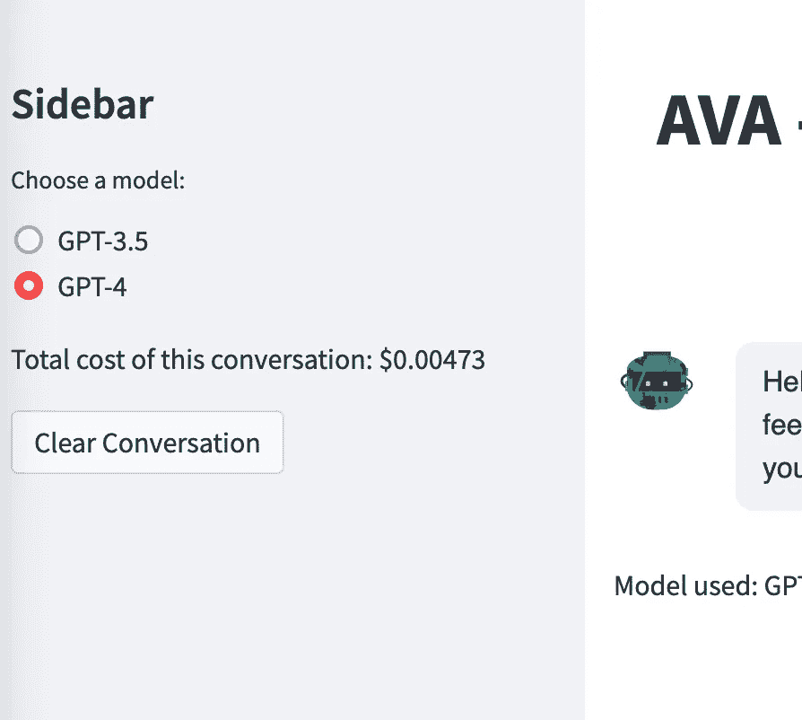

# 使用 Streamlit 创建你自己的类似 ChatGPT 的应用

> 原文：[`towardsdatascience.com/build-your-own-chatgpt-like-app-with-streamlit-20d940417389?source=collection_archive---------1-----------------------#2023-04-03`](https://towardsdatascience.com/build-your-own-chatgpt-like-app-with-streamlit-20d940417389?source=collection_archive---------1-----------------------#2023-04-03)

## 利用 OpenAI 的 API 绕过官方 ChatGPT 应用

[](https://heiko-hotz.medium.com/?source=post_page-----20d940417389--------------------------------)[](https://towardsdatascience.com/?source=post_page-----20d940417389--------------------------------) [Heiko Hotz](https://heiko-hotz.medium.com/?source=post_page-----20d940417389--------------------------------)

·

[关注](https://medium.com/m/signin?actionUrl=https%3A%2F%2Fmedium.com%2F_%2Fsubscribe%2Fuser%2F993c21f1b30f&operation=register&redirect=https%3A%2F%2Ftowardsdatascience.com%2Fbuild-your-own-chatgpt-like-app-with-streamlit-20d940417389&user=Heiko+Hotz&userId=993c21f1b30f&source=post_page-993c21f1b30f----20d940417389---------------------post_header-----------) 发布于 [Towards Data Science](https://towardsdatascience.com/?source=post_page-----20d940417389--------------------------------) ·6 分钟阅读·2023 年 4 月 3 日[](https://medium.com/m/signin?actionUrl=https%3A%2F%2Fmedium.com%2F_%2Fvote%2Ftowards-data-science%2F20d940417389&operation=register&redirect=https%3A%2F%2Ftowardsdatascience.com%2Fbuild-your-own-chatgpt-like-app-with-streamlit-20d940417389&user=Heiko+Hotz&userId=993c21f1b30f&source=-----20d940417389---------------------clap_footer-----------)

--

[](https://medium.com/m/signin?actionUrl=https%3A%2F%2Fmedium.com%2F_%2Fbookmark%2Fp%2F20d940417389&operation=register&redirect=https%3A%2F%2Ftowardsdatascience.com%2Fbuild-your-own-chatgpt-like-app-with-streamlit-20d940417389&source=-----20d940417389---------------------bookmark_footer-----------)

作者提供的图像 — 使用 Stable Diffusion 创建

# 这是什么？

当 GPT-4 在 2023 年 3 月 14 日宣布时，我立即注册了 ChatGPT Plus——这是 ChatGPT 应用程序中的一个付费层级，可以立即访问新模型。它每月花费 20 美元，最初非常值得。然而，几天后，我的使用量减少了——别误解我：我仍然经常使用，只是我不确定是否会使用到足以证明其成本的程度。然后，几天前，我通过 OpenAI 的 API 获得了 GPT-4 的访问权限，尽管新模型比其前身 GPT-3.5 贵得多，但我仍然认为通过 API 互动可能对我来说更经济。

但我确实希望在与模型互动时保持类似聊天的体验。虽然已经有相当多的开源应用提供流畅的用户体验，但我不想使用 React 或类似的前端框架——它们非常适合构建出色的网页应用，但这不是我喜欢做的事情。相反，我决定用 Streamlit 构建自己的聊天界面，它提供了一个更基本的用户体验，并且功能远不如其他框架丰富——但对我来说，从零开始开发自己的 UI（而且是用 Python）要有趣得多。😃



作者图片

在本教程中，我将带你了解这个应用程序——所有代码也可以在这个[GitHub 仓库](https://github.com/marshmellow77/streamlit-chatgpt-ui)中找到。

# 为什么这很重要？

## 通过实践学习

除了我已经提到的成本方面，还有一些额外的优势在于构建自己的聊天界面。首先，它迫使我更深入地研究 Chat API，因为到目前为止，我只使用过文本生成 API。使用 Chat API 类似，但有一些关键区别需要注意。

## 独立性

其次，这使我完全独立于 ChatGPT 应用程序。无论应用程序是否出现了[重大故障](https://openai.com/blog/march-20-chatgpt-outage)或者应用程序限制了我可以向模型发送的推理请求数量（目前每 3 小时限制 25 条消息），这些都不适用于我运行自己的应用程序时。

## 数据隐私

第三，数据隐私。默认情况下，ChatGPT 会收集数据并用于改进服务（尽管可以选择退出）。然而，在使用 API 时，默认情况下不会收集数据，除非我们特别选择加入。更多信息请参见 OpenAI 的[API 使用文档](https://openai.com/policies/api-data-usage-policies)。

## 有趣多了！

最后，如前所述，构建这样的东西要有趣得多（至少对像我这样的极客来说🤓）。我已经在应用中加入了一些功能，例如显示令牌数量和每次对话的价格。也许在某个时候，我可以扩展应用以利用其他模型（例如来自 Hugging Face）🤗。

让我们开始行动吧！💪

# 构建应用程序

## 先决条件

为了开发这个应用程序，我们需要确保已安装*openai*、*streamlit*和*streamlit-chat*包：

```py
pip install openai streamlit streamlit-chat
```

## 跟踪对话历史

[聊天完成指南](https://platform.openai.com/docs/guides/chat/introduction)提到，我们需要将对话历史传递给 API，以便模型理解背景；换句话说，我们必须管理聊天模型的记忆，因为 API 不会为我们处理这一点。为此，我们创建了一个会话状态列表，在会话开始时存储系统消息，然后附加与模型的互动。

```py
if 'messages' not in st.session_state:
    st.session_state['messages'] = [
        {"role": "system", "content": "You are a helpful assistant."}
    ]

def generate_response(prompt):
    st.session_state['messages'].append({"role": "user", "content": prompt})

    completion = openai.ChatCompletion.create(
        model=model,
        messages=st.session_state['messages']
    )
    response = completion.choices[0].message.content
    st.session_state['messages'].append({"role": "assistant", "content": response})
```

## 显示对话

为了展示对话，我们利用了*message*函数，这个函数来自*streamlit-chat*包。我们遍历存储的互动，并按时间顺序展示对话，从最早的对话开始（就像在 ChatGPT 中一样）。

```py
from streamlit_chat import message

if st.session_state['generated']:
    with response_container:
        for i in range(len(st.session_state['generated'])):
            message(st.session_state["past"][i], is_user=True, key=str(i) + '_user')
            message(st.session_state["generated"][i], key=str(i))
```

## 打印附加信息

我认为一个额外有用的功能是打印每次互动的一些元数据。为此，我们可以，例如，打印使用的模型（这可能会在不同互动之间变化）、这次互动使用了多少令牌及其成本（根据[OpenAI 的定价页面](https://openai.com/pricing#language-models)）。

```py
total_tokens = completion.usage.total_tokens
prompt_tokens = completion.usage.prompt_tokens
completion_tokens = completion.usage.completion_tokens

if model_name == "GPT-3.5":
    cost = total_tokens * 0.002 / 1000
else:
    cost = (prompt_tokens * 0.03 + completion_tokens * 0.06) / 1000

st.write(
    f"Model used: {st.session_state['model_name'][i]}; Number of tokens: {st.session_state['total_tokens'][i]}; Cost: ${st.session_state['cost'][i]:.5f}")
```



图片由作者提供

请注意，随着对话的延长，令牌的数量（从而价格）会增加。这是因为我们需要提交所有先前的问题和回答，以便模型理解互动的背景。

**为了节省开支，因此建议在开始新的聊天话题时清除对话记录。**

## 侧边栏

在侧边栏中，我们提供了切换模型和清除对话历史的选项。此外，我们还可以显示当前对话的累计费用：



图片由作者提供

# 结论

通过这些步骤，我们成功地开发了一个易于使用且可定制的聊天界面，使我们能够与基于 GPT 的模型互动，而无需依赖像 ChatGPT 这样的应用程序。我们现在可以使用以下命令运行应用程序：

```py
streamlit run app.py
```

## 这如何改变了我的工作流程

我现在实际上已经取消了 ChatGPT Plus 的订阅，并且我专门使用我的应用程序与 GPT 模型进行互动。默认情况下，我使用 GPT-3.5 模型，这使得使用这些模型非常实惠。只有在处理更复杂的任务时，或者当我对 GPT-3.5 的结果不完全满意时，我才会切换到 GPT-4。很可能，我会继续随着时间推移向应用程序中添加新功能，因为这是我最喜欢做的事情——敬请期待未来的更新😊

## 进一步改进的想法

希望这对你有所帮助——请使用本教程作为起点来构建你自己的聊天 UI。我很想了解你正在构建的内容，所以请在评论中与我联系。这里有一些关于如何改进这个应用的想法，供你参考：

+   [实现令牌流](https://platform.openai.com/docs/api-reference/chat/create#chat/create-stream)

+   保存和展示之前的对话

+   按天显示使用情况和成本

+   实现更多的[控制参数](https://platform.openai.com/docs/api-reference/chat/create)，例如温度、重复惩罚等

编程愉快！

# 海科·霍茨

👋 关注我在[Medium](https://heiko-hotz.medium.com/)和[LinkedIn](https://www.linkedin.com/in/heikohotz/)上的内容，了解更多关于生成式 AI、机器学习和自然语言处理的信息。

👥 如果你在伦敦，可以加入我们的[NLP London Meetups](https://www.meetup.com/nlp_london/)。


