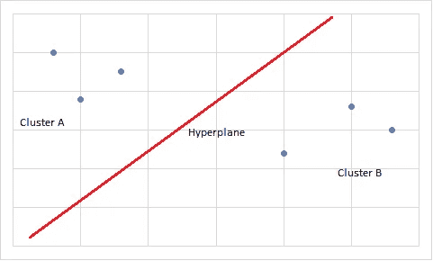
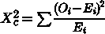

# 在 Python 中构建基础机器学习模型

> 原文：[`towardsdatascience.com/building-a-basic-machine-learning-model-in-python-d7cca929ee62?source=collection_archive---------2-----------------------#2023-01-02`](https://towardsdatascience.com/building-a-basic-machine-learning-model-in-python-d7cca929ee62?source=collection_archive---------2-----------------------#2023-01-02)

## *关于如何选择合适问题和如何开发基础分类器的详细论文*

[](https://medium.com/@juras.jursenas?source=post_page-----d7cca929ee62--------------------------------)[](https://towardsdatascience.com/?source=post_page-----d7cca929ee62--------------------------------) [Juras Juršėnas](https://medium.com/@juras.jursenas?source=post_page-----d7cca929ee62--------------------------------)

·

[点击查看](https://medium.com/m/signin?actionUrl=https%3A%2F%2Fmedium.com%2F_%2Fsubscribe%2Fuser%2F3041473d9e3c&operation=register&redirect=https%3A%2F%2Ftowardsdatascience.com%2Fbuilding-a-basic-machine-learning-model-in-python-d7cca929ee62&user=Juras+Jur%C5%A1%C4%97nas&userId=3041473d9e3c&source=post_page-3041473d9e3c----d7cca929ee62---------------------post_header-----------) 发布于 [Towards Data Science](https://towardsdatascience.com/?source=post_page-----d7cca929ee62--------------------------------) ·20 min 阅读·2023 年 1 月 2 日[](https://medium.com/m/signin?actionUrl=https%3A%2F%2Fmedium.com%2F_%2Fvote%2Ftowards-data-science%2Fd7cca929ee62&operation=register&redirect=https%3A%2F%2Ftowardsdatascience.com%2Fbuilding-a-basic-machine-learning-model-in-python-d7cca929ee62&user=Juras+Jur%C5%A1%C4%97nas&userId=3041473d9e3c&source=-----d7cca929ee62---------------------clap_footer-----------)

--

[](https://medium.com/m/signin?actionUrl=https%3A%2F%2Fmedium.com%2F_%2Fbookmark%2Fp%2Fd7cca929ee62&operation=register&redirect=https%3A%2F%2Ftowardsdatascience.com%2Fbuilding-a-basic-machine-learning-model-in-python-d7cca929ee62&source=-----d7cca929ee62---------------------bookmark_footer-----------)

照片由 [charlesdeluvio](https://unsplash.com/@charlesdeluvio?utm_source=medium&utm_medium=referral) 提供，来源于 [Unsplash](https://unsplash.com/?utm_source=medium&utm_medium=referral)

目前，我们都见过各种基础机器学习（ML）模型的结果。互联网充斥着展示计算机如何识别各种动物的图像、视频和文章，无论识别是否正确。

尽管我们已经朝着更复杂的机器学习模型迈进，例如生成或提升图像的模型，但这些基础模型仍然构成了这些努力的基础。掌握基础知识可以成为未来更大事业的跳板。

所以，我决定自己重新审视基础知识，并构建一个具有几个警告的基本机器学习模型——它必须具有一定的实用性，尽可能简单，并返回合理准确的结果。

然而，与互联网上的许多其他教程不同，我想从头到尾展示我的整个思考过程。因此，编码部分将会稍晚开始，因为理论和实践领域中的问题选择同样重要。最后，我相信理解*为什么*比*如何*更为重要。

# 选择适合机器学习的问题

尽管机器学习可以解决许多挑战，但它并不是一种万能的解决方案。即使我们暂时忽略财务、时间和其他资源成本，机器学习模型在某些方面仍然表现出色，而在其他方面则表现糟糕。

分类是机器学习可能发挥作用的一个很好的例子。每当我们处理真实世界的数据（即我们不处理代码中创建的类别）时，找出定义现象的所有可能规则几乎是不可能的。

正如我之前所写的，如果我们尝试使用基于规则的方法来分类一个物体是否是猫，我们会很快遇到问题。似乎没有定义任何物理对象的特征——有些猫没有尾巴、毛发、耳朵、一只眼睛、不同数量的腿等等，但它们仍然都属于同一类别。

列举所有可能的规则及其例外可能是不可能的，也许甚至没有某种永恒的清单，我们只能在过程中逐步制定。机器学习在某种程度上通过消耗大量数据来进行预测，模仿了我们的思维。

换句话说，我们应该在尝试确定哪种模型最合适、需要多少数据以及开始任务后关注的其他事项之前，仔细考虑我们要解决的问题。

# 寻求实际应用

制作区分狗和猫的模型确实有趣且有趣，但即使我们将操作规模扩大到巨大的程度，也不太可能获得任何好处。此外，已经有数以百万计的此类模型教程在网上创建。

我决定选择词汇分类，因为它相对较少被写到，并且具有一定的实际应用。我们的 SEO 团队提出了一个有趣的提议——他们需要根据三种类型来分类关键词：

1.  **信息型** — 寻找关于某个主题的知识的用户（例如，“什么是代理”）

1.  **交易型** — 寻找产品或服务的用户（例如，“最佳代理”）

1.  **导航型**——用户寻找特定品牌或其分支（例如，“Oxylabs”）

手动分类成千上万的关键词有点麻烦。这样的任务（几乎）完美适合机器学习，尽管存在一个几乎无法解决的固有问题，我将在后面详细说明。

最终，它使数据收集和管理变得比其他情况下要简单得多。SEO 专家使用各种工具来跟踪关键词，其中大多数可以将它们导出到 CSV 表中。只需将类别分配给关键词即可。

# 构建一个预 MVP

在建立模型之前决定需要多少数据点几乎是不可能的。虽然有一些依赖于既定目标（即，更多或更少的类别），但精确计算这些数据几乎是不可能的。选择一个足够大的数字（例如，1000 条记录）是一个好的起点。

我建议不要一开始就处理整个数据集。由于这是你第一次开发模型，很多事情可能会出错。一般来说，最好先编写代码并在小样本（例如总数据的 10%）上运行，以确保没有语义错误或其他问题。

一旦你得到所需的结果，就开始处理整个数据集。虽然你可能不会完全放弃项目，但你不希望花费几个小时（枯燥）的工作却没有任何成果。

无论如何，有了一些样本，我们可以正式开始开发过程。我选择了 Python，因为它是一种相当常见的语言，并且通过众多库为机器学习提供了不错的支持。

# 库

1.  [Pandas](https://pypi.org/project/pandas/)。虽然不是绝对必要，但读取和导出 CSV 文件将大大简化我们的工作。

1.  [SciKit-Learn](https://pypi.org/project/scikit-learn/)。这是一个相当强大且灵活的机器学习库，它将成为我们分类模型的基础。在整个教程中，我们将使用各种 *sklearn* 功能。

1.  [NLTK](https://pypi.org/project/nltk/)（自然语言工具包）。由于我们将处理自然语言，NLTK 完美地完成了这个任务。*停用词* 是包中绝对必要的内容。

# 导入

```py
import pandas as pd
from sklearn.feature_extraction.text import TfidfVectorizer
from sklearn.linear_model import LogisticRegression
from sklearn.pipeline import Pipeline
from sklearn.feature_selection import SelectKBest, chi2
from nltk.corpus import stopwords
```

## 第 1 行

相当自解释。*Pandas* 允许我们通过创建数据框来读取和写入 CSV 以及其他电子表格文件。由于我们将处理关键词，大多数 SEO 工具会将它们导出为 CSV，这将减少我们需要手动处理的数据。

## 第 2 行

从 SciKit-Learn 库中，我们将挑选几个东西，*TfidfVectorizer* 是我们的首选。

向量化器将我们的字符串转换为特征向量，这会导致两个重要的变化。首先，字符串被转换为数值表示。每个唯一的字符串被转换为一个索引，然后转化为向量（矩阵的衍生物）。

**句子 #1**：“狗是棕色的。”

**句子 #2**：“狗是黑色的。”

向量化将处理这两个句子并创建一个索引：

```py
E(w) = 
[0, if "the"
1, if "dog"
2, if "is"
3, if "brown"
4, if "black"]
```

除了将字符串转换为数值外，向量化还优化了数据处理。与其多次处理相同的字符串，不如使用相同的索引，类似于文件压缩。

最后，TFIDF（词频-逆文档频率）是衡量文档中词语重要性的一种方法。简单来说，它对每个词进行处理，评估其频率与文档长度的比值，并分配一个加权值。因此，重复出现的词语被认为更重要。

## 第三行

*LogisticRegression* 是发现变量之间关系的一种方法。由于我们的任务是经典的分类问题，逻辑回归非常适合，因为它接受某些输入变量 *x*（关键字），并将其分配一个值 *y*（信息性/交易性/导航性）。

还有其他选项，例如 *LinearSVC*，它涉及到更复杂的数学运算。极其简单地说，SVC 会对多个数据点簇进行处理，找到每个簇中最接近对方簇的值。这些值称为支持向量。

一个超平面（即在 *n+1 维* 空间中的 *n 维* 几何对象）被绘制成使其与每个支持向量的距离最大化。



作者提供的图片

[已有研究表明使用支持向量机](https://link.springer.com/chapter/10.1007/BFb0026683) 可能在文本分类中产生更好的结果，但这可能是由于任务的复杂性显著增加。这些优势在我们的情况下并不完全相关，因为它们在特征数量达到极高水平时才会显现，因此线性回归应该也能很好地工作。

## 第四行

*Pipeline* 是一个灵活的机器学习工具，它让你创建一个对象，将整个过程的多个步骤组合成一个。它有许多好处——从帮助你编写更整洁的代码到防止数据泄漏。

## 第五行

虽然在我们的情况下并不是绝对必要的，*SelectKBest* 和 *chi2* 通过提高准确性和减少训练时间来优化模型。*SelectKBest* 允许我们设置最大特征数量。

*Chi2*（或*卡方检验*）是一种用于变量独立性的统计测试，有助于我们选择最佳特征（因此，*SelectKBest*）进行训练：



作者提供的图片。

```py
where: c is degrees of freedom (i.e. sample size minus one)
O is the observed value(s)
E is the expected value(s)
```

期望值是通过接受原假设（变量独立）来计算的。这些值然后与我们的观测值进行对比。如果观测值与期望值有显著偏差，我们可以拒绝原假设，这迫使我们接受变量之间的依赖关系。

如果变量是相关的，它们对于机器学习模型是可接受的，因为这正是我们所寻找的 —— 对象之间的关系。反过来，*SelectKBest* 获取所有 *chi2* 结果，并选择那些具有最强关系的结果。

在我们的情况下，由于特征数量相对较少，*SelectKBest* 可能无法带来我们感兴趣的优化，但一旦数量开始增加，它就变得至关重要。

## 行 6

我们最终的导入来自 NLTK，我们将仅将其用于 *stopwords* 列表。不幸的是，默认列表不适合我们当前的任务。大多数这样的列表包含像“how”，“what”，“why”等词，这些词在常规分类中无用，但能指示搜索意图。

事实上，可以说这些词比“如何构建网页抓取器”这样的关键词中的任何剩余词更重要。由于我们对句子的类别感兴趣而非其他值，*stopwords* 是决定它可能是什么的最佳途径。

因此，删除一些停用词列表中的条目是至关重要的。幸运的是，NLTK 的停用词只是文本文件，你可以使用任何文字处理器进行编辑。

[NLTK 下载默认存储在用户目录](https://sites.pitt.edu/~naraehan/python3/faq.html#Q-where-nltk-data)中，但可以通过使用 *download_dir=* 进行更改（如果需要的话）。

# 数据框和停用词

所有机器学习模型都从数据准备和处理开始。由于我们处理的是 SEO 关键词，这些关键词可以通过流行的性能测量工具轻松导出为 CSV。

选择一个随机样本，其中应包括接近相等数量的各类别，这一点是值得注意的。由于我们正在制作一个前期 MVP，这不应该成为问题，因为如果模型提供了我们需要的结果，可以随时添加数据。

在继续之前，明智的做法是从 CSV 文件中选择几打关键词并进行标注。一旦我们得到一个有效的模型，就可以标注其余的。由于 *Pandas* 以表格格式创建数据框，最简单的方法是添加一个新列，“Category” 或 “Label”，并将每个关键词行标记为 *Informational, Transactional, or Navigational*。

```py
df = pd.read_csv('[KEYWORD_LIST].csv')
data = pd.DataFrame(df)

words = stopwords.words('english_adjusted')
```

## 行 1 和 2

每当我们有任何形式的 CSV 时，*Pandas* 要求我们创建一个数据框。首先，我们将读取由 SEO 工具提供的关键词列表。请记住，CSV 文件应该已经包含一些关键词分类，否则将没有东西可以用于训练模型。

阅读文件后，我们从 CSV 文件创建一个数据框对象。

## 行 3

我们将使用 NLTK 获取停用词文件，不过我们不能直接使用它。NLTK 的默认列表包含许多我们认为对关键词分类至关重要的词（例如，“what”，“how”，“where”等）。因此，它必须调整以适应我们的目的。

虽然在这种情况下没有硬性规定，但不定冠词和定冠词可以保留（例如，“a”，“an”，“the”等），因为它们不提供信息。然而，所有可能显示用户意图的内容都必须从默认文件中删除。

我创建了一个名为‘english_adjusted’的副本，以便于操作。此外，以防万一我需要原始版本，它将始终可用，无需重新下载。

最后，你可能需要运行一次 NLTK，使用常规参数‘english’来下载文件，这可以在任何阶段完成。否则，你会收到错误。

# 设置管道

在所有这些准备步骤之后，我们终于可以进入实际的机器学习部分。这些是模型中最重要的部分。你可能会花费相当多的时间调整这些参数，以找到最佳选项。

不幸的是，没有很多指导方针适用于所有情况。需要进行一些实验和推理，以减少所需的测试量，但完全消除测试是不可能的。

```py
pipeline = Pipeline([('vect', TfidfVectorizer(ngram_range=(1, 3), stop_words=words)),
                    ('chi', SelectKBest(chi2, k='all')),
                    ('clf', LogisticRegression(C=1.0, penalty='l2', max_iter=1000, dual=False))])
```

有些人可能会注意到我没有通过*scikit-learn*将数据集拆分为训练集和测试集。这是问题的性质所赋予的奢侈。SEO 工具可以在不到一分钟的时间内导出数千个（未标记的）关键字，这意味着你可以单独采购测试集而不费吹灰之力。

因此，出于优化原因，我将使用没有标签的第二个数据集作为我们的测试基础。然而，由于*train_test_split* 非常普遍，我将在文章末尾的附录中展示一个使用它的相同模型版本。

## 第 1 行

管道允许我们将长时间的过程简化为一个对象，使处理模型设置变得更加容易。它还将减少出错的可能性。

我们将从定义我们的向量化器开始。我在上面提到过我们将使用*TFIDFVectorizer*，因为它根据文档中单词的权重来产生更好的结果。*CountVectorizer* 是一个选项，但你需要导入它，结果可能会有所不同。

*Ngram_range* 是一个有趣的推理挑战。为了获得最佳结果，你必须决定要计算多少个词元（在我们的情况下是单词）。*Ngram_range* 为 (1, 1) 会计算单个词（单词），(1, 2) 会计算单个词和两个相邻的词（双词组）的组合，(1, 3) 会计算单个词、两个词和三个词（三词组）的组合。

我选择了*ngram_range(1, 3)*，有几个原因。首先，由于模型相对简单，性能不是问题，我可以运行更大范围的 n-gram，因此下限可以设置为最小。

另一方面，一旦我们去除停用词，我们应该考虑什么样的 ngram 上限足以从关键词中提取意义。如果可能，我发现从数据集中选择最难和最简单的例子更容易。在我们的情况下，最简单的例子是任何问题（“如何获取代理”），最难的是名词（“网络爬虫”）或名称（“Oxylabs”）。

由于我们将移除像“to”这样的词，我们会在问题案例中得到三元组（“how get proxies”），这是完全清晰的。事实上，你可以认为二元组（“how get”）也足够，因为意图仍然清晰。

然而，最难的例子通常会比三元组短，因为理解搜索意图的难易程度与查询长度相关。因此，*ngram_range (1, 3)* 应该在性能和准确性之间取得一个不错的平衡。

最后，对于 *sublinear_tf* 有一个论点，即它是常规 TF-IDF 计算的一个修改。如果设置为 *True*，权重通过对数函数计算：*1 + log(tf)*。换句话说，词频会获得递减的回报。

使用 *sublinear_tf* 时，频繁出现且出现在多个文档中的词语不会被赋予过重的权重。由于我们有一组相对随机的关键词，我们无法知道哪些会得到优待，但这些通常是像“how”，“what”等我们希望被赋予较重权重的词。

在测试过程中，我发现模型在没有 *sublinear_tf* 的情况下表现更好，但我建议稍微调整一下，看看是否会带来任何好处。

*Stopwords* 参数现在已经不言自明，因为我们之前已经讨论过了。

## 第 2 行

虽然不严格来说是新的一行，但我将为清晰和简洁的目的将其分开。我们现在将调用 *SelectKBest*，我在上面已经对其进行了相当详细的描述。我们的关注点是 *k* 值。

这些会有所不同，具体取决于你的数据集的大小。*SelectKBest* 旨在优化性能和准确性。在我的情况下，使用“all”是有效的，但你通常需要选择一个足够大的 *N* 来匹配你自己的数据集。

## 第 3 行

最后，我们来到将用于模型的方法。*LogisticRegression* 是我们的选择，如前所述，但需要对参数进行大量的调整。

“C”值是一个超参数，它告诉模型应该选择哪些参数。超参数是模型中非常复杂的部分，对最终结果有着巨大的影响。

从极其简单的角度来看，*C* 值是你训练数据的信任分数。较高的 *C* 值意味着在拟合时，对训练数据的权重会较高，而对惩罚的权重较低。较低的 C 值则将更多强调惩罚，训练数据的权重较低。

应始终存在一定的惩罚，因为训练永远无法完全代表现实世界的值（因为它只是一个小的子集，无论你收集多少）。此外，如果存在异常值而不进行惩罚，模型[将会越来越贴近过拟合](https://medium.com/p/7aeef64755d2)。

*penalty* 参数是用于超参数的操作。*SciKit-Learn* 提供了三种类型的惩罚——*‘l1’*、*‘l2’*和*‘elasticnet’*。‘*None*’也是一个选项，但如果使用的话应该尽量少。

‘*L1*’ 是所有系数的绝对值之和。简单来说，它将所有系数拉向某个中心点。如果施加了大的惩罚，一些数据点可能会变成零（即被消除）。

在存在多重共线性（多个变量相关）或需要简化模型的情况下，应该使用‘*L1*’。由于*L1*会消除一些数据点，因此模型几乎总是变得更简单。然而，当数据点的分布已经相对简单时，它的效果不如预期。

‘*L2*’ 是类似过程的不同版本。它不是绝对和，而是所有系数值的平方和。因此，所有系数都按相同的值缩小，但没有被消除。‘*L2*’ 是默认设置，因为它最灵活且很少引发问题。

‘*Elasticnet*’ 是上述两种方法的结合。关于是否应该将‘*elasticnet*’作为默认方法，[已有相当广泛的评论](https://stats.stackexchange.com/questions/184029/what-is-elastic-net-regularization-and-how-does-it-solve-the-drawbacks-of-ridge)，然而，并不是所有的求解器都支持它。在我们的情况下，我们需要切换到“saga”求解器，它是为大型数据集设计的。

在教程级别的机器学习模型中使用‘*elasticnet*’可能收益甚微。只需记住，将来它可能会有益。

继续讨论*‘max_iter’*，该参数将设置模型在收敛之前执行的最大迭代次数。简单来说，收敛是指进一步迭代不太可能发生的点，作为停止点。

较高的值会增加计算复杂性，但可能会导致更好的整体表现。在数据集相对简单的情况下，*‘max_iter’* 可以设置为数千及以上，因为这对系统的负担不会太大。

如果值过低且收敛失败，将显示警告消息。因此，找到最低可能的值并从中开始并不困难。

# 拟合模型并输出数据

我们接近教程的结束，最终进入模型拟合和接收输出的阶段。

```py
model = pipeline.fit(data.Keyword, data.Type)
chi = model.named_steps['chi']
clf = model.named_steps['clf']

doutput = pd.read_csv('[TEST_KEYWORD_LIST].csv')

doutput['Type'] = model.predict(doutput['Keyword'])

doutput.to_csv('[RESULT_LIST].csv')
##print('Accuracy score ' + str(model.score(x_test, y_test)))
```

## 第 1-3 行

在第 1 行中，我们使用我们建立的管道将模型拟合到训练数据中。如果需要进行调试或额外的分析，管道允许我们创建命名的步骤，这些步骤可以在后续调用。

## 第 4–8 行

我们从一个只包含关键词的 CSV 文件中创建另一个数据框。我们将使用新创建的模型来预测每个关键词及其类别。

由于我们的数据框仅包含关键词，我们添加了一个新的列“类型”，并运行*model.predict*以提供输出结果。

最终，所有结果被移动到一个输出的 CSV 文件中，该文件将在本地目录中创建。通常，你会想设置一些目标，但为了测试目的，通常没有必要这样做。

有一行被注释掉的代码我想提一下，它调用了*score*函数。*SciKit*为我们提供了多种方法来估计模型的预测能力。这些方法不应被视为绝对真理，因为预测准确度与实际准确度通常可能有所偏差。

然而，得分作为经验法则和快速评估参数对模型的影响是有用的。虽然有很多评分方法，但基本的*model.score*使用*R 平方*，在调整参数时通常很有帮助。

# 结果分析

我的训练数据仅有 1300 条条目，包含三种不同的类别，如上所述。即使在这样的小数据集中，模型仍然达到了约 80%的不错准确度。

其中一些，如预期的那样，是有争议的，甚至 Google 也这么认为。例如，“网页抓取”是一个经常被搜索的关键词。是否查询是交易性的还是信息性的没有明确的指示。Google 的搜索结果页面显示，前 5 条结果中有产品和信息文章。

模型在一个领域遇到了困难——导航关键词。如果我要猜测，模型大约 5-10%的时间能正确预测类别。出现这种情况有几个原因。

数据集的分布可能是一个问题，因为它严重不平衡：

+   **交易型** — 0.457353%

+   **信息型** — 0.450735%

+   **导航型** — 0.091912%

虽然实际世界场景会呈现出类似的分布（由于导航关键词的固有稀有性），但训练数据过于稀疏，无法进行适当的拟合。此外，导航关键词的频率非常低，以至于模型通过总是分配其他两个类别可以获得更高的准确性。

然而，我认为展示更多的导航关键词的训练数据不会产生更好的结果。这是一个通过文本分析解决的极其困难的问题，无论我们选择哪种方法。

导航关键词主要由品牌名称组成，这些名称是新造词或其他新产生的词。它们中没有任何内容遵循自然语言，因此，它们之间的联系只能*事后*发现。换句话说，我们必须首先从其他数据源知道这是一个品牌名称，才能正确分配类别。

如果我得猜测，谷歌和其他搜索引擎可能通过用户查询新词时的行为来发现品牌名称。他们可能会查找域名匹配或其他数据，但在没有人工互动的情况下预测某个词是导航关键词是极其困难的。

特征工程可能是解决问题的潜在方案。我们需要发现导航类别和其他类别之间的新联系，并通过其他方法实施分配。

由于特征工程是一个完全不同的主题，并且值得单独写一篇文章，所以我将提供一个示例。导航关键词很少会以问题的形式被查询（除了“什么是”），否则它们没有意义（例如，“如何使用 Oxylabs”，“如何获取 Oxylabs”）。

是否将“如何获取 Oxylabs 代理”视为交易型还是导航型存在争议。然而，它确实符合交易型类别，因此可以被认为是交易型。

通过知道相对较少的导航关键词会以问题的形式出现，我们可以构建一个模型来过滤掉大多数问题，留下较小的潜在目标子集。

此外，许多导航关键词的查询长度显著较短，通常由单个词组成，而其他类别的查询长度相对较少。

这些方法及其他许多方法可以组合使用，以提高选择导航关键词时模型的准确性。然而，深入特征工程要比基础教程覆盖的内容复杂得多。

目前，词汇分类应通过对机器学习模型如何工作的整体更好理解来覆盖。希望对众多参数和工具的解释能让你从一开始就创建一个功能性的模型。

# 结论

即使文章非常长，你可能已经注意到，编写机器学习模型并不那么困难。事实上，可以说，在这个案例中，这只是项目的一小部分。

机器学习在很大程度上依赖于准备，我们可以概述几个部分：

1.  **选择正确的问题**。有些问题用其他方法解决可能更好。不要被炒作所迷惑，尝试通过机器学习解决所有问题。使用基于规则的系统，你可能能够节省时间和资源，同时产生更好的结果。

1.  **准备数据**。一个模型的好坏取决于数据。如果你的数据标记不正确、缺乏真实性或其他方面存在问题，那么再多的开发和资源也无法创建出可靠的输出。

1.  **选择模型**。由于你已经做过很多次，可能很容易选择逻辑回归或其他模型。*Sci-Kit Learn*还有其他选项，比如我没有提到的*PassiveAggressiveClassifier*，它们使用不同的数学方法。再次强调，选择正确的问题非常重要，因为它应该决定你选择什么建模方法。

我希望这篇文章能为许多机器学习新手提供帮助，不仅提供实践部分，还提供处理问题的思路。

# 附录：原始完整代码块

```py
import pandas as pd
from sklearn.feature_extraction.text import TfidfVectorizer
from nltk.corpus import stopwords
from sklearn.linear_model import LogisticRegression
from sklearn.pipeline import Pipeline
from sklearn.feature_selection import SelectKBest, chi2

df = pd.read_csv('[KEYWORD_LIST].csv')
data = pd.DataFrame(df)

words = stopwords.words('english_adjusted')

pipeline = Pipeline([('vect', TfidfVectorizer(ngram_range=(1, 3), stop_words=words)),
                    ('chi', SelectKBest(chi2, k='all')),
                    ('clf', LogisticRegression(C=1.0, penalty='l2', max_iter=1000))])

model = pipeline.fit(data.Keyword, data.Type)
chi = model.named_steps['chi']
clf = model.named_steps['clf']

doutput = pd.read_csv('[TEST_KEYWORD_LIST].csv')

doutput['Type'] = model.predict(doutput['Keyword'])

doutput.to_csv('[RESULT_LIST].csv')
##print('accuracy score ' + str(model.score(x_test, y_test)))
```

# 附录 II：Train_test_split

## 导入

```py
import pandas as pd
from sklearn.feature_extraction.text import TfidfVectorizer
from sklearn.linear_model import LogisticRegression
from sklearn.pipeline import Pipeline
from sklearn.model_selection import train_test_split
from sklearn.feature_selection import SelectKBest, chi2
from nltk.corpus import stopwords
```

按照惯例，我们需要导入*train_test_split*本身（第 5 行）。

## 设置拆分

```py
x_train, x_test, y_train, y_test = train_test_split(data.Keyword, data.Type, test_size=0.3)

pipeline = Pipeline([('vect', TfidfVectorizer(ngram_range=(1, 3), stop_words=words)),
                    ('chi', SelectKBest(chi2, k='all')),
                    ('clf', LogisticRegression(C=1.0, penalty='l2', max_iter=1000, dual=False))])
```

## 第 1 行

由于我们的数据集只有两个特征（*keyword*和*category*），我们需要为每个特征准备两个变量。其中一个用于存储训练数据，另一个用于测试目的。

我们将使用之前步骤中创建的数据框，并指定列名（在我的数据集中，它们被称为“Keyword”和“Type”，如参数所示）。

最后，*SciKit-Learn*通过允许对两个数据集进行自动分割来解决数据拆分问题。*train_test_split*接受表示测试集大小或训练集大小百分比的浮点和整数值。如果两个值都设置为*None*，默认值将为 0.25。

需要进行一些调整才能获得最佳结果。我尝试了许多不同的拆分，其中 0.3 产生了最佳结果。一般来说，你会发现许多模型在 0.2 到 0.3 范围内的拆分效果最佳。

特定的拆分对准确性的影响较小，当数据点数量增加时更是如此。实际上，在极大的数据集上，拆分为 0.1 可能会提高计算性能。

统计单位之间的关系很复杂，但是可以建立的连接的抽象领域是有限的，因此准确性可以理解为对一定数量的数据点的要求，而不是特定的比例。换句话说，有一个*N*，在这个点上结果不会再变得更好，因此如果数据集很大，较小的比例可能更为优化。

有一些[关于这个主题的高度技术文章](https://link.springer.com/article/10.1007/s41664-018-0068-2)深入解释了这个想法，并提供了计算最佳拆分的方法。

此代码块中的其他部分遵循与原始教程相同的步骤。

## 拟合模型并输出数据（再次）

```py
model = pipeline.fit(x_train, y_train)
chi = model.named_steps['chi']
clf = model.named_steps['clf']

doutput = pd.DataFrame({'Keyword': x_test, 'Type': model.predict(x_test)})

doutput.to_csv('[RESULT_LIST].csv')
##print('Accuracy score ' + str(model.score(x_test, y_test)))
```

## 第 1 行

我们不会直接在标记数据集上训练模型，而是在之前拆分的那个数据集上进行训练，命名为*x_train*和*y_train*。第 2 行和第 3 行保持不变。

## 第 4 行

由于没有单独的数据集，我们将使用初始数据集中的测试部分进行预测。因此，我们创建一个数据框，其中包含*关键词*这一列，我们将在该列中输出测试数据集中的所有关键词。在第二列*类型*中，我们将使用模型来预测关键词的类别，依然使用相同的数据集。

最终，按照原始版本，所有结果将输出到一个结果文件中。如果有人对模型的表现如何感兴趣，也可以选择打印准确率分数。
