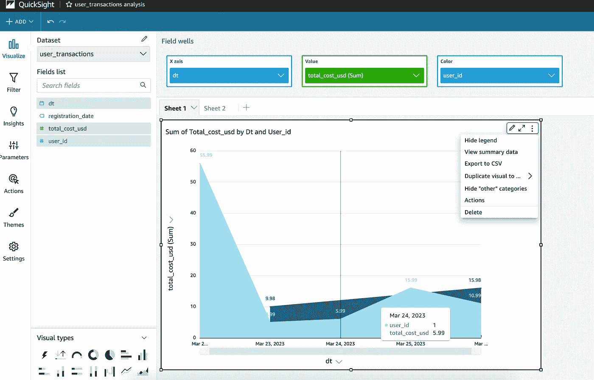
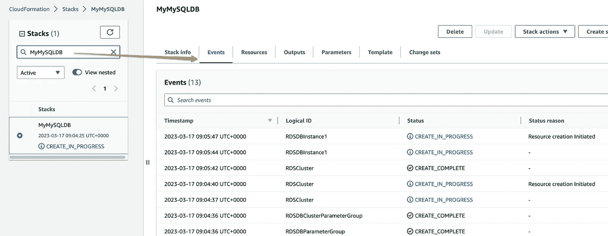
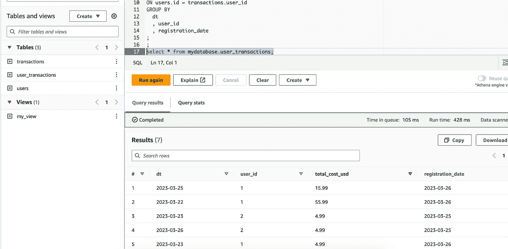
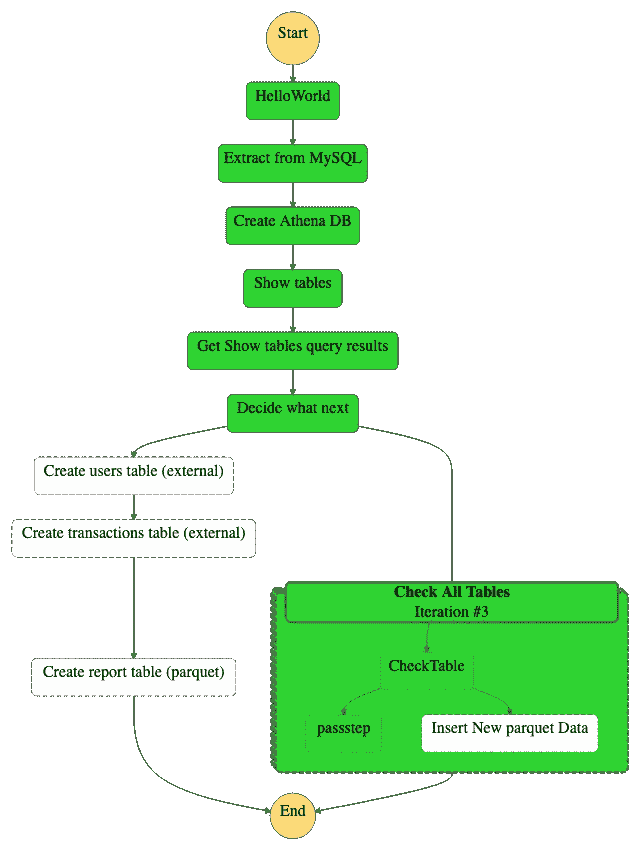
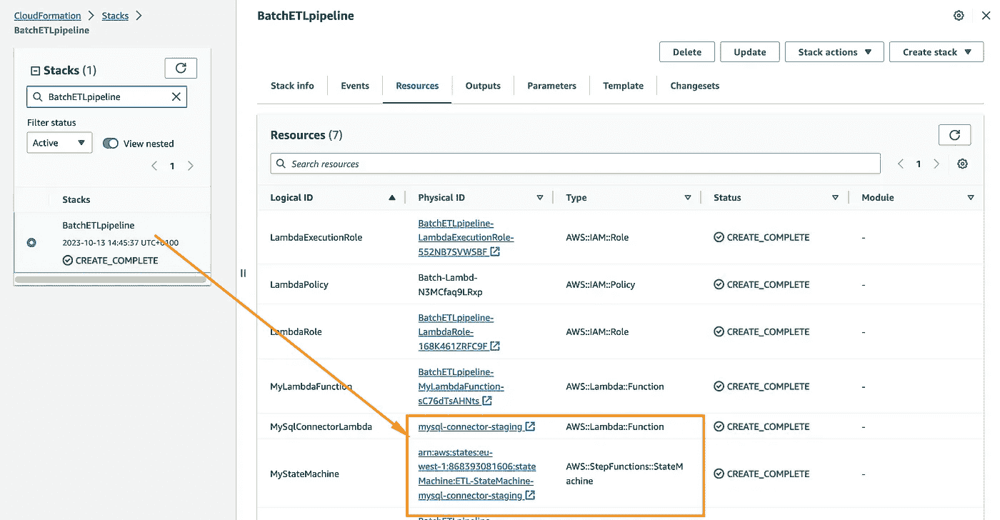
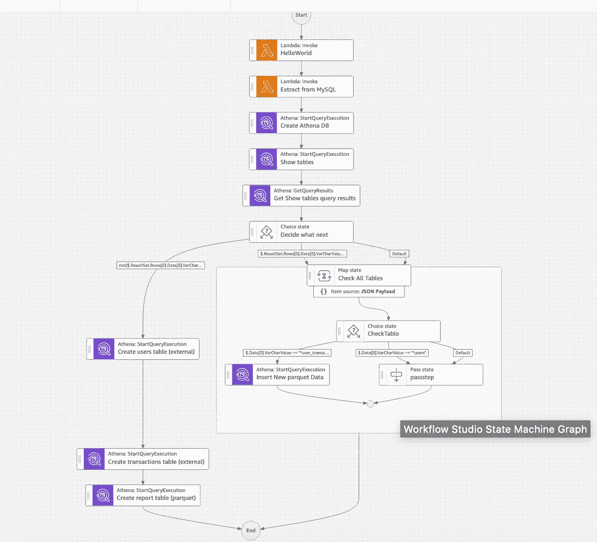
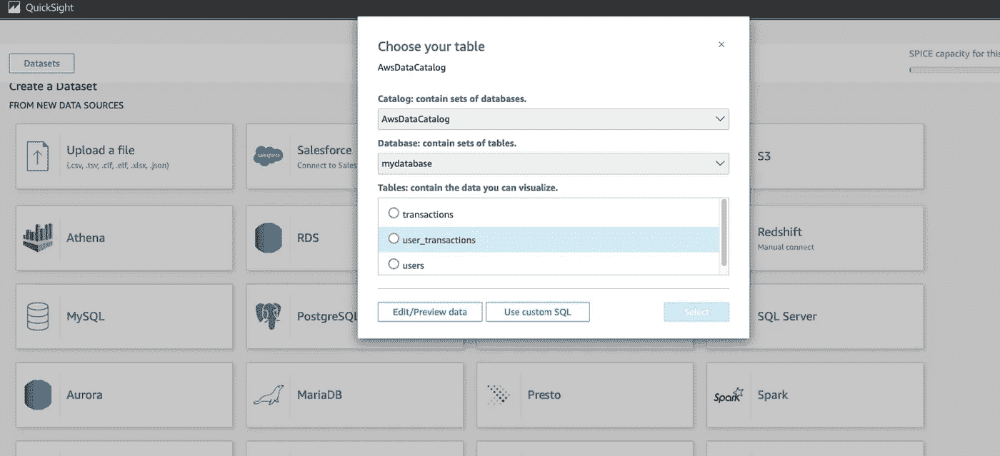
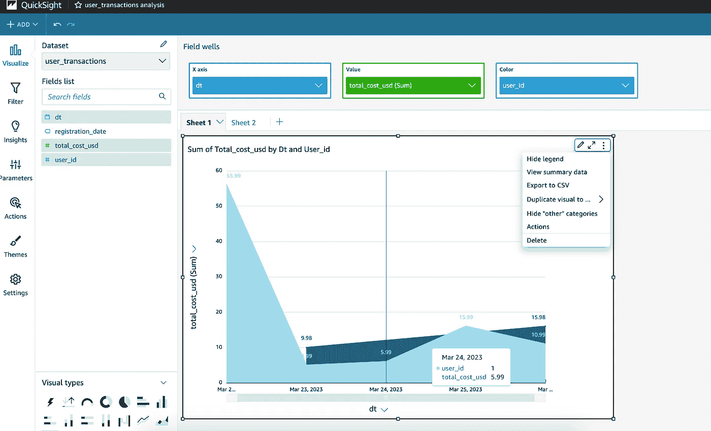

# 使用 Athena 和 MySQL 构建批量数据管道

> 原文：[`towardsdatascience.com/building-a-batch-data-pipeline-with-athena-and-mysql-7e60575ff39c`](https://towardsdatascience.com/building-a-batch-data-pipeline-with-athena-and-mysql-7e60575ff39c)

## 初学者的端到端教程

[](https://mshakhomirov.medium.com/?source=post_page-----7e60575ff39c--------------------------------)[](https://towardsdatascience.com/?source=post_page-----7e60575ff39c--------------------------------) [💡Mike Shakhomirov](https://mshakhomirov.medium.com/?source=post_page-----7e60575ff39c--------------------------------)

·发布于 [Towards Data Science](https://towardsdatascience.com/?source=post_page-----7e60575ff39c--------------------------------) ·16 min 阅读·2023 年 10 月 20 日

--


图片由 [Redd F](https://unsplash.com/@raddfilms?utm_source=medium&utm_medium=referral) 提供，来自 [Unsplash](https://unsplash.com/?utm_source=medium&utm_medium=referral)

在这个故事中，我将讲述一种非常流行的数据转换任务执行方式——批量数据处理。当我们需要以块状方式处理数据时，这种数据管道设计模式变得极其有用，非常适合需要调度的 ETL 作业。我将通过使用 MySQL 和 Athena 构建数据转换管道来展示如何实现这一目标。我们将使用基础设施即代码在云中部署它。

想象一下，你刚刚作为数据工程师加入了一家公司。他们的数据堆栈现代、事件驱动、成本效益高、灵活，并且可以轻松扩展以满足不断增长的数据资源。你数据平台中的外部数据源和数据管道由数据工程团队管理，使用具有 CI/CD GitHub 集成的灵活环境设置。

作为数据工程师，你需要创建一个业务智能仪表板，展示公司收入来源的地理分布，如下所示。原始支付数据存储在服务器数据库（MySQL）中。你想构建一个批量管道，从该数据库中每日提取数据，然后使用 AWS S3 存储数据文件，并使用 Athena 进行处理。



收入仪表板。图像由作者提供。

## 批量数据管道

数据管道可以被视为一系列数据处理步骤。由于这些阶段之间的***逻辑数据流连接***，每个阶段生成的**输出**作为下一个阶段的**输入**。

> 只要在点 A 和点 B 之间进行数据处理，就存在数据管道。

数据管道可能因其概念和逻辑性质而有所不同。我之前在这里写过 [1]：

[数据管道设计模式](https://towardsdatascience.com/data-pipeline-design-patterns-100afa4b93e3?source=post_page-----7e60575ff39c--------------------------------)

### 选择合适的架构及其示例

[数据管道设计模式](https://towardsdatascience.com/data-pipeline-design-patterns-100afa4b93e3?source=post_page-----7e60575ff39c--------------------------------)

我们希望创建一个数据管道，在以下 **步骤** 中转换数据：

1\. 使用 Lambda 函数将数据从 MySQL 数据库表 `myschema.users` 和 `myschema.transactions` 提取到 S3 数据湖桶中。

2\. 添加一个具有 Athena 资源的状态机节点以启动执行 (`arn:aws:states:::athena:startQueryExecution.sync`) 并创建一个名为 `mydatabase` 的数据库

3\. 创建另一个数据管道节点以显示 Athena 数据库中的现有表。使用该节点的输出执行所需的数据转换。

如果表不存在，我们希望我们的管道在 Athena 中根据来自数据湖 S3 桶的数据创建它们。我们希望创建两个 **外部表**，数据来自 MySQL：

+   mydatabase.users (LOCATION ‘s3://<YOUR_DATALAKE_BUCKET>/data/myschema/users/’)

+   mydatabase.transactions (LOCATION ‘s3://<YOUR_DATALAKE_BUCKET>/data/myschema/transactions/’)

然后我们希望创建一个 **优化的 ICEBERG** 表：

+   mydatabase.user_transactions (‘table_type’=’ICEBERG’, ‘format’=’parquet’) 使用以下 SQL：

```py
SELECT 
      date(dt) dt
    , user_id
    , sum(total_cost) total_cost_usd
    , registration_date
  FROM mydatabase.transactions 
  LEFT JOIN mydatabase.users
  ON users.id = transactions.user_id
  GROUP BY
    dt
    , user_id
    , registration_date
;
```

+   我们还将使用 MERGE 来更新此表。

MERGE 是一种非常有用的 SQL 技巧，用于表中的增量更新。查看我之前的故事 [3] 以获取更高级的示例：

[高级 SQL 技巧](https://towardsdatascience.com/advanced-sql-techniques-for-beginners-211851a28488?source=post_page-----7e60575ff39c--------------------------------)

### 从 1 到 10，你的数据仓库技能有多好？

[高级 SQL 技巧](https://towardsdatascience.com/advanced-sql-techniques-for-beginners-211851a28488?source=post_page-----7e60575ff39c--------------------------------)

Athena 可以通过运行有吸引力的即席 SQL 查询来分析存储在 Amazon S3 中的结构化、非结构化和半结构化数据，无需管理基础设施。

> 我们不需要加载数据，这使得它成为我们任务的完美选择。

它可以轻松地与 Business Intelligence (BI) 解决方案如 QuickSight 集成以生成报告。

ICEBERG 是一种非常有用且高效的表格格式，多个独立程序可以同时且一致地处理相同的数据集 [2]。我之前在这里写过：

[介绍 Apache Iceberg 表](https://towardsdatascience.com/introduction-to-apache-iceberg-tables-a791f1758009?source=post_page-----7e60575ff39c--------------------------------)

### 选择 Apache Iceberg 作为数据湖的几个有力理由

[介绍 Apache Iceberg 表](https://towardsdatascience.com/introduction-to-apache-iceberg-tables-a791f1758009?source=post_page-----7e60575ff39c--------------------------------)

## MySQL 数据连接器

让我们创建一个 AWS Lambda 函数，它能够在 MySQL 数据库中执行 SQL 查询。

> 代码非常简单且通用。它可以在任何无服务器应用程序中与任何云服务提供商一起使用。

我们将使用它将收入数据提取到数据湖中。建议的 Lambda 文件夹结构如下所示：

```py
.
└── stack
    ├── mysql_connector
    │   ├── config       # config folder with environment related settings
    │   ├── populate_database.sql  # sql script to create source tables
    │   ├── export.sql   # sql script to export data to s3 datalake
    │   └── app.py       # main application file
    ├── package          # required libraries
    │   ├── PyMySQL-1.0.2.dist-info
    │   └── pymysql
    ├── requirements.txt # required Python modules
    └── stack.zip        # Lambda package
```

我们将通过 AWS Step Functions 将这个小服务集成到管道中，以便于 **编排和可视化**。

为了创建一个能够从 MySQL 数据库中提取数据的 Lambda 函数，我们需要先为我们的 Lambda 创建一个文件夹。首先创建一个名为 stack` 的新文件夹，然后在其中创建一个名为 `mysql_connector` 的文件夹：

```py
mkdir stack
cd stack
mkdir mysql_connector
```

然后我们可以使用下面的代码（将数据库连接设置替换为你的设置）来创建 `app.py`：

```py
 import os
import sys
import yaml
import logging
import pymysql

from datetime import datetime
import pytz

ENV = os.environ['ENV']
TESTING = os.environ['TESTING']
LAMBDA_PATH = os.environ['LAMBDA_PATH']
print('ENV: {}, Running locally: {}'.format(ENV, TESTING))

def get_work_dir(testing):
    if (testing == 'true'):
        return LAMBDA_PATH
    else:
        return '/var/task/' + LAMBDA_PATH

def get_settings(env, path):
    if (env == 'staging'):
        with open(path + "config/staging.yaml", "r") as f:
            config = yaml.load(f, Loader=yaml.FullLoader)
    elif (env == 'live'):
        with open(path + "config/production.yaml", "r") as f:
            config = yaml.load(f, Loader=yaml.FullLoader)
    elif (env == 'test'):
        with open(path + "config/test.yaml", "r") as f:
            config = yaml.load(f, Loader=yaml.FullLoader)
    else:
        print('No config found')
    return config

work_dir = get_work_dir(TESTING)
print('LAMBDA_PATH: {}'.format(work_dir))
config=get_settings(ENV, work_dir)
print(config)
DATA_S3 = config.get('S3dataLocation') # i.e. datalake.staging.something. Replace it with your unique bucket name.

logger = logging.getLogger()
logger.setLevel(logging.INFO)

# rds settings
rds_host  = config.get('Mysql')['rds_host'] # i.e. "mymysqldb.12345.eu-west-1.rds.amazonaws.com"
user_name = "root"
password = "AmazingPassword"
db_name = "mysql"

# create the database connection outside of the handler to allow connections to be
# re-used by subsequent function invocations.
try:
    conn = pymysql.connect(host=rds_host, user=user_name, passwd=password, db=db_name, connect_timeout=5)

except pymysql.MySQLError as e:
    logger.error("ERROR: Unexpected error: Could not connect to MySQL instance.")
    logger.error(e)
    sys.exit()

logger.info("SUCCESS: Connection to RDS MySQL instance succeeded")

def lambda_handler(event, context):
    processed = 0
    print("")
    try:
        _populate_db()
        _export_to_s3()
    except Exception as e:
        print(e)
    message = 'Successfully populated the database and created an export job.'
    return {
        'statusCode': 200,
        'body': { 'lambdaResult': message }
    }

# Helpers:

def _now():
    return datetime.utcnow().replace(tzinfo=pytz.utc).strftime('%Y-%m-%dT%H:%M:%S.%f')

def _populate_db():
    try:
        # Generate data and populate database:
        fd = open(work_dir + '/populate_database.sql', 'r')
        sqlFile = fd.read()
        fd.close()
        sqlCommands = sqlFile.split(';')
        # Execute every command from the input file
        for command in sqlCommands:
            try:
                with conn.cursor() as cur:
                    cur.execute(command)
                    print('---')
                    print(command)
            except Exception as e:
                print(e)

    except Exception as e:
        print(e)

def _export_to_s3():
    try:
        # Generate data and populate database:
        fd = open(work_dir + '/export.sql', 'r')
        sqlFile = fd.read()
        fd.close()
        sqlCommands = sqlFile.split(';')
        # Execute every command from the input file
        for command in sqlCommands:
            try:
                with conn.cursor() as cur:
                    cur.execute(command.replace("{{DATA_S3}}", DATA_S3))
                    print('---')
                    print(command)
            except Exception as e:
                print(e)

    except Exception as e:
        print(e)
```

要使用 AWS CLI 部署我们的微服务，请在命令行中运行以下命令（假设你在 ./stack 文件夹中）：

```py
# Package Lambda code:
base=${PWD##*/}
zp=$base".zip" # This will return stack.zip if you are in stack folder.
echo $zp

rm -f $zp # remove old package if exists

pip install --target ./package pymysql 

cd package
zip -r ../${base}.zip .

cd $OLDPWD
zip -r $zp ./mysql_connector
```

确保在运行下一部分之前 AWS Lambda 角色已经存在 ` — role arn:aws:iam::<your-aws-account-id>:role/my-lambda-role`。

```py
# Deploy packaged Lambda using AWS CLI:
aws \
lambda create-function \
--function-name mysql-lambda \
--zip-file fileb://stack.zip \
--handler <path-to-your-lambda-handler>/app.lambda_handler \
--runtime python3.12 \
--role arn:aws:iam::<your-aws-account-id>:role/my-lambda-role

# # If already deployed then use this to update:
# aws --profile mds lambda update-function-code \
# --function-name mysql-lambda \
# --zip-file fileb://stack.zip;
```

我们的 MySQL 实例必须具备 **S3 集成**，以便 **将数据导出到 S3** 桶。这可以通过运行以下 SQL 查询实现：

```py
-- Example query
-- Replace table names and S3 bucket location
SELECT * FROM myschema.transactions INTO OUTFILE S3 's3://<YOUR_S3_BUCKET>/data/myschema/transactions/transactions.scv' FIELDS TERMINATED BY ',' LINES TERMINATED BY '\n' OVERWRITE ON;
```

## 如何创建 MySQL 实例

我们可以使用 CloudFormation 模板和基础设施即代码来创建 MySQL 数据库。考虑这个 AWS 命令：

```py
aws \
cloudformation deploy \
--template-file cfn_mysql.yaml \
--stack-name MySQLDB \
--capabilities CAPABILITY_IAM
```

它将使用 `cfn_mysql.yaml` 模板文件来创建名为 MySQLDB 的 CloudFormation 堆栈。我之前在这里写过有关它的内容 [4]：

[](/create-mysql-and-postgres-instances-using-aws-cloudformation-d3af3c46c22a?source=post_page-----7e60575ff39c--------------------------------) ## 使用 AWS CloudFormation 创建 MySQL 和 Postgres 实例

### 数据库从业人员的基础设施即代码

towardsdatascience.com

我们的 `cfn_mysql.yaml` 应该如下所示：

```py
AWSTemplateFormatVersion: 2010-09-09
Description: >-
  This
  template creates an Amazon Relational Database Service database instance. You
  will be billed for the AWS resources used if you create a stack from this
  template.
Parameters:
  DBUser:
    Default: root
    NoEcho: 'true'
    Description: The database admin account username
    Type: String
    MinLength: '1'
    MaxLength: '16'
    AllowedPattern: '[a-zA-Z][a-zA-Z0-9]*'
    ConstraintDescription: must begin with a letter and contain only alphanumeric characters.
  DBPassword:
    Default: AmazingPassword
    NoEcho: 'true'
    Description: The database admin account password
    Type: String
    MinLength: '8'
    MaxLength: '41'
    AllowedPattern: '[a-zA-Z0-9]*'
    ConstraintDescription: must contain only alphanumeric characters.
Resources:
### Role to output into s3
  MySQLRDSExecutionRole:
    Type: "AWS::IAM::Role"
    Properties:
      AssumeRolePolicyDocument:
        Version: "2012-10-17"
        Statement:
          - Effect: "Allow"
            Principal:
              Service:
                - !Sub rds.amazonaws.com
            Action: "sts:AssumeRole"
      Path: "/"
      Policies:
        - PolicyName: MySQLRDSExecutionPolicy
          PolicyDocument:
            Version: "2012-10-17"
            Statement:
              - Effect: Allow
                Action:
                  - "s3:*"
                Resource: "*"
###

  RDSCluster: 
    Properties: 
      DBClusterParameterGroupName: 
        Ref: RDSDBClusterParameterGroup
      Engine: aurora-mysql
      MasterUserPassword: 
        Ref: DBPassword
      MasterUsername: 
        Ref: DBUser

### Add a role to export to s3
      AssociatedRoles:
        - RoleArn: !GetAtt [ MySQLRDSExecutionRole, Arn ]
###
    Type: "AWS::RDS::DBCluster"
  RDSDBClusterParameterGroup: 
    Properties: 
      Description: "CloudFormation Sample Aurora Cluster Parameter Group"
      Family: aurora-mysql5.7
      Parameters: 
        time_zone: US/Eastern
        ### Add a role to export to s3
        aws_default_s3_role: !GetAtt [ MySQLRDSExecutionRole, Arn ]
        ###
    Type: "AWS::RDS::DBClusterParameterGroup"
  RDSDBInstance1:
    Type: 'AWS::RDS::DBInstance'
    Properties:
      DBClusterIdentifier: 
        Ref: RDSCluster
      # AllocatedStorage: '20'
      DBInstanceClass: db.t2.small
      # Engine: aurora
      Engine: aurora-mysql
      PubliclyAccessible: "true"
      DBInstanceIdentifier: MyMySQLDB
  RDSDBParameterGroup:
    Type: 'AWS::RDS::DBParameterGroup'
    Properties:
      Description: CloudFormation Sample Aurora Parameter Group
      # Family: aurora5.6
      Family: aurora-mysql5.7
      Parameters:
        sql_mode: IGNORE_SPACE
        max_allowed_packet: 1024
        innodb_buffer_pool_size: '{DBInstanceClassMemory*3/4}'
# Aurora instances need to be associated with a AWS::RDS::DBCluster via DBClusterIdentifier without the cluster you get these generic errors 
```

如果一切顺利，我们将看到 Amazon 账户中出现一个新的堆栈：



带有 MySQL 实例的 CloudFormation 堆栈。图片由作者提供。

现在我们可以在我们的数据管道中使用这个 MySQL 实例。我们可以在任何 SQL 工具中尝试我们的 SQL 查询，例如 SQL Workbench，以填充表数据。这些表将用于稍后使用 Athena 创建外部表，可以通过 SQL 创建：

```py
CREATE TABLE IF NOT EXISTS
  myschema.users AS
SELECT
  1 AS id,
  CURRENT_DATE() AS registration_date
UNION ALL
SELECT
  2 AS id,
  DATE_SUB(CURRENT_DATE(), INTERVAL 1 day) AS registration_date;

CREATE TABLE IF NOT EXISTS
  myschema.transactions AS
SELECT
  1 AS transaction_id,
  1 AS user_id,
  10.99 AS total_cost,
  CURRENT_DATE() AS dt
UNION ALL
SELECT
  2 AS transaction_id,
  2 AS user_id,
  4.99 AS total_cost,
  CURRENT_DATE() AS dt
UNION ALL
SELECT
  3 AS transaction_id,
  2 AS user_id,
  4.99 AS total_cost,
  DATE_SUB(CURRENT_DATE(), INTERVAL 3 day) AS dt
UNION ALL
SELECT
  4 AS transaction_id,
  1 AS user_id,
  4.99 AS total_cost,
  DATE_SUB(CURRENT_DATE(), INTERVAL 3 day) AS dt
UNION ALL
SELECT
  5 AS transaction_id,
  1 AS user_id,
  5.99 AS total_cost,
  DATE_SUB(CURRENT_DATE(), INTERVAL 2 day) AS dt
UNION ALL
SELECT
  6 AS transaction_id,
  1 AS user_id,
  15.99 AS total_cost,
  DATE_SUB(CURRENT_DATE(), INTERVAL 1 day) AS dt
UNION ALL
SELECT
  7 AS transaction_id,
  1 AS user_id,
  55.99 AS total_cost,
  DATE_SUB(CURRENT_DATE(), INTERVAL 4 day) AS dt
;
```

## 使用 Athena 处理数据

现在我们希望添加一个数据管道工作流，该工作流触发我们的 Lambda 函数以从 MySQL 提取数据，将其保存到数据湖中，然后在 Athena 中开始数据转换。

我们希望使用 MySQL 中的数据创建两个外部 Athena 表：

+   myschema.users

+   myschema.transactions

然后我们希望创建一个优化的 ICEBERG 表 **myschema.user_transactions**，将其连接到我们的 BI 解决方案。

我们希望使用 MERGE 语句将新数据插入到该表中。

```py
CREATE EXTERNAL TABLE mydatabase.users (
    id                bigint
  , registration_date string
) 
ROW FORMAT DELIMITED
FIELDS TERMINATED BY ',' 
STORED AS INPUTFORMAT   'org.apache.hadoop.mapred.TextInputFormat'
OUTPUTFORMAT   'org.apache.hadoop.hive.ql.io.HiveIgnoreKeyTextOutputFormat' 
LOCATION  's3://<YOUR_S3_BUCKET>/data/myschema/users/' TBLPROPERTIES (  'skip.header.line.count'='0')
;
select * from mydatabase.users;

CREATE EXTERNAL TABLE mydatabase.transactions (
    transaction_id    bigint
  , user_id           bigint
  , total_cost        double
  , dt                string
) 
ROW FORMAT DELIMITED
FIELDS TERMINATED BY ',' 
STORED AS INPUTFORMAT   'org.apache.hadoop.mapred.TextInputFormat'
OUTPUTFORMAT   'org.apache.hadoop.hive.ql.io.HiveIgnoreKeyTextOutputFormat' 
LOCATION  's3://<YOUR_S3_BUCKET>/data/myschema/transactions/' TBLPROPERTIES (  'skip.header.line.count'='0')
;
select * from mydatabase.transactions;

CREATE TABLE IF NOT EXISTS mydatabase.user_transactions (
  dt date,
  user_id int,
  total_cost_usd float,
  registration_date string
) 
PARTITIONED BY (dt)
LOCATION 's3://<YOUR_S3_BUCKET>/data/myschema/optimized-data-iceberg-parquet/' 
TBLPROPERTIES (
  'table_type'='ICEBERG',
  'format'='parquet',
  'write_target_data_file_size_bytes'='536870912',
  'optimize_rewrite_delete_file_threshold'='10'
)
;

MERGE INTO mydatabase.user_transactions  as ut
USING (
  SELECT 
      date(dt) dt
    , user_id
    , sum(total_cost) total_cost_usd
    , registration_date
  FROM mydatabase.transactions 
  LEFT JOIN mydatabase.users
  ON users.id = transactions.user_id
  GROUP BY
    dt
    , user_id
    , registration_date
) as ut2
ON (ut.dt = ut2.dt and ut.user_id = ut2.user_id)
WHEN MATCHED
    THEN UPDATE
        SET total_cost_usd = ut2.total_cost_usd, registration_date = ut2.registration_date
WHEN NOT MATCHED 
THEN INSERT (
 dt
,user_id
,total_cost_usd
,registration_date
)
  VALUES (
 ut2.dt
,ut2.user_id
,ut2.total_cost_usd
,ut2.registration_date
)
;
```

当新表准备好后，我们可以通过运行 `SELECT *` 来检查它：



mydatabase.user_transactions。图片由作者提供。

## 使用 Step Functions（状态机）编排数据管道

在之前的步骤中，我们学习了如何分别部署数据管道的每一步并进行测试。在这一段中，我们将了解如何使用基础设施代码和管道编排工具如 AWS Step Functions（状态机）创建一个完整的数据管道。当我们完成时，管道图将如下所示：



使用 Step Functions 进行数据管道编排。图像由作者提供。

数据管道编排是一种很好的数据工程技术，它为我们的数据管道增加了互动性。这个想法在我之前的一篇故事中已经解释过[5]：

[](/data-pipeline-orchestration-9887e1b5eb7a?source=post_page-----7e60575ff39c--------------------------------) ## 数据管道编排

### 数据管道管理得当可以简化部署并提高数据的可用性和可访问性……

[towardsdatascience.com

要部署完整的**编排器解决方案**，包括所有必要的资源，我们可以使用 CloudFormation（基础设施即代码）。考虑下面这个可以在`/stack`文件夹中从命令行运行的脚本。确保<YOUR_S3_BUCKET>存在，并将其替换为您的实际 S3 桶：

```py
#!/usr/bin/env bash
# chmod +x ./deploy-staging.sh
# Run ./deploy-staging.sh
PROFILE=<YOUR_AWS_PROFILE>
STACK_NAME=BatchETLpipeline
LAMBDA_BUCKET=<YOUR_S3_BUCKET> # Replace with unique bucket name in your account
APP_FOLDER=mysql_connector

date

TIME=`date +"%Y%m%d%H%M%S"`

base=${PWD##*/}
zp=$base".zip"
echo $zp

rm -f $zp

pip install --target ./package -r requirements.txt
# boto3 is not required unless we want a specific version for Lambda
# requirements.txt:
# pymysql==1.0.3
# requests==2.28.1
# pytz==2023.3
# pyyaml==6.0

cd package
zip -r ../${base}.zip .

cd $OLDPWD

zip -r $zp "./${APP_FOLDER}" -x __pycache__ 

# Check if Lambda bucket exists:
LAMBDA_BUCKET_EXISTS=$(aws --profile ${PROFILE} s3 ls ${LAMBDA_BUCKET} --output text)
#  If NOT:
if [[ $? -eq 254 ]]; then
    # create a bucket to keep Lambdas packaged files:
    echo  "Creating Lambda code bucket ${LAMBDA_BUCKET} "
    CREATE_BUCKET=$(aws --profile ${PROFILE} s3 mb s3://${LAMBDA_BUCKET} --output text)
    echo ${CREATE_BUCKET}
fi

# Upload the package to S3:
aws --profile $PROFILE s3 cp ./${base}.zip s3://${LAMBDA_BUCKET}/${APP_FOLDER}/${base}${TIME}.zip

aws --profile $PROFILE \
cloudformation deploy \
--template-file stack.yaml \
--stack-name $STACK_NAME \
--capabilities CAPABILITY_IAM \
--parameter-overrides \
"StackPackageS3Key"="${APP_FOLDER}/${base}${TIME}.zip" \
"AppFolder"=$APP_FOLDER \
"S3LambdaBucket"=$LAMBDA_BUCKET \
"Environment"="staging" \
"Testing"="false"
```

它将使用 stack.yaml 创建一个名为 BatchETLpipeline 的 CloudFormation 堆栈。它将打包我们的 Lambda 函数，创建一个包并将其上传到 S3 桶中。如果该桶不存在，它将创建它。然后将部署管道。

```py
AWSTemplateFormatVersion: '2010-09-09'
Description: An example template for a Step Functions state machine.
Parameters:

  DataLocation:
    Description: Data lake bucket with source data files.
    Type: String
    Default: s3://your.datalake.aws/data/
  AthenaResultsLocation:
    Description: S3 location for Athena query results.
    Type: String
    Default: s3://your.datalake.aws/athena/
  AthenaDatabaseName:
    Description: Athena schema names for ETL pipeline.
    Type: String
    Default: mydatabase
  S3LambdaBucket:
    Description: Use this bucket to keep your Lambda package.
    Type: String
    Default: your.datalake.aws
  StackPackageS3Key:
    Type: String
    Default: mysql_connector/stack.zip
  ServiceName:
    Type: String
    Default: mysql-connector
  Testing:
    Type: String
    Default: 'false'
    AllowedValues: ['true','false']
  Environment:
    Type: String
    Default: 'staging'
    AllowedValues: ['staging','live','test']
  AppFolder:
    Description: app.py file location inside the package, i.e. mysql_connector when ./stack/mysql_connector/app.py.
    Type: String
    Default: mysql_connector

Resources:
  LambdaExecutionRole:
    Type: "AWS::IAM::Role"
    Properties:
      AssumeRolePolicyDocument:
        Version: "2012-10-17"
        Statement:
          - Effect: Allow
            Principal:
              Service: lambda.amazonaws.com
            Action: "sts:AssumeRole"

  MyLambdaFunction:
    Type: "AWS::Lambda::Function"
    Properties:
      Handler: "index.handler"
      Role: !GetAtt [ LambdaExecutionRole, Arn ]
      Code:
        ZipFile: |
          exports.handler = (event, context, callback) => {
              callback(null, "Hello World!");
          };
      Runtime: "nodejs18.x"
      Timeout: "25"

### MySQL Connector Lmabda ###
  MySqlConnectorLambda:
    Type: AWS::Lambda::Function
    DeletionPolicy: Delete
    DependsOn: LambdaPolicy
    Properties:
      FunctionName: !Join ['-', [!Ref ServiceName, !Ref Environment] ]
      Handler: !Sub '${AppFolder}/app.lambda_handler'
      Description: Microservice that extracts data from RDS.
      Environment:
        Variables:
          DEBUG: true
          LAMBDA_PATH: !Sub '${AppFolder}/'
          TESTING: !Ref Testing
          ENV: !Ref Environment
      Role: !GetAtt LambdaRole.Arn
      Code:
        S3Bucket: !Sub '${S3LambdaBucket}'
        S3Key:
          Ref: StackPackageS3Key
      Runtime: python3.8
      Timeout: 360
      MemorySize: 128
      Tags:
        -
          Key: Service
          Value: Datalake

  StatesExecutionRole:
    Type: "AWS::IAM::Role"
    Properties:
      AssumeRolePolicyDocument:
        Version: "2012-10-17"
        Statement:
          - Effect: "Allow"
            Principal:
              Service:
                - !Sub states.${AWS::Region}.amazonaws.com
            Action: "sts:AssumeRole"
      Path: "/"
      Policies:
        - PolicyName: StatesExecutionPolicy
          PolicyDocument:
            Version: "2012-10-17"
            Statement:
              - Effect: Allow
                Action:
                  - "lambda:InvokeFunction"
                Resource: "*"
              - Effect: Allow
                Action:
                  - "athena:*"

                Resource: "*"
              - Effect: Allow
                Action:
                  - "s3:*"
                Resource: "*"
              - Effect: Allow
                Action:
                  - "glue:*"
                Resource: "*"

  MyStateMachine:
    Type: AWS::StepFunctions::StateMachine
    Properties:
      # StateMachineName: ETL-StateMachine
      StateMachineName: !Join ['-', ['ETL-StateMachine', !Ref ServiceName, !Ref Environment] ]
      DefinitionString:
        !Sub
          - |-
            {
              "Comment": "A Hello World example using an AWS Lambda function",
              "StartAt": "HelloWorld",
              "States": {
                "HelloWorld": {
                  "Type": "Task",
                  "Resource": "${lambdaArn}",
                  "Next": "Extract from MySQL"
                },
                "Extract from MySQL": {
                  "Resource": "${MySQLLambdaArn}",
                  "Type": "Task",
                  "Next": "Create Athena DB"
                },
                "Create Athena DB": {
                  "Resource": "arn:aws:states:::athena:startQueryExecution.sync",
                  "Parameters": {
                    "QueryString": "CREATE DATABASE if not exists ${AthenaDatabaseName}",
                    "WorkGroup": "primary",
                    "ResultConfiguration": {
                      "OutputLocation": "${AthenaResultsLocation}"
                    }
                  },
                  "Type": "Task",
                  "Next": "Show tables"
                },
                "Show tables": {
                  "Resource": "arn:aws:states:::athena:startQueryExecution.sync",
                  "Parameters": {
                    "QueryString": "show tables in ${AthenaDatabaseName}",
                    "WorkGroup": "primary",
                    "ResultConfiguration": {
                      "OutputLocation": "${AthenaResultsLocation}"
                    }
                  },
                  "Type": "Task",
                  "Next": "Get Show tables query results"
                },
                "Get Show tables query results": {
                  "Resource": "arn:aws:states:::athena:getQueryResults",
                  "Parameters": {
                    "QueryExecutionId.$": "$.QueryExecution.QueryExecutionId"
                  },
                  "Type": "Task",
                  "Next": "Decide what next"
                },
                "Decide what next": {
                  "Comment": "Based on the input table name, a choice is made for moving to the next step.",
                  "Type": "Choice",
                  "Choices": [
                    {
                      "Not": {
                        "Variable": "$.ResultSet.Rows[0].Data[0].VarCharValue",
                        "IsPresent": true
                      },
                      "Next": "Create users table (external)"
                    },
                    {
                      "Variable": "$.ResultSet.Rows[0].Data[0].VarCharValue",
                      "IsPresent": true,
                      "Next": "Check All Tables"
                    }
                  ],
                  "Default": "Check All Tables"
                },
                "Create users table (external)": {
                  "Resource": "arn:aws:states:::athena:startQueryExecution.sync",
                  "Parameters": {
                    "QueryString": "CREATE EXTERNAL TABLE ${AthenaDatabaseName}.users ( id                bigint , registration_date string ) ROW FORMAT DELIMITED FIELDS TERMINATED BY ',' STORED AS INPUTFORMAT   'org.apache.hadoop.mapred.TextInputFormat' OUTPUTFORMAT   'org.apache.hadoop.hive.ql.io.HiveIgnoreKeyTextOutputFormat' LOCATION  's3://datalake.staging.liveproject/data/myschema/users/' TBLPROPERTIES (  'skip.header.line.count'='0') ;",
                    "WorkGroup": "primary",
                    "ResultConfiguration": {
                      "OutputLocation": "${AthenaResultsLocation}"
                    }
                  },
                  "Type": "Task",
                  "Next": "Create transactions table (external)"
                },
                "Create transactions table (external)": {
                  "Resource": "arn:aws:states:::athena:startQueryExecution.sync",
                  "Parameters": {
                    "QueryString": "CREATE EXTERNAL TABLE ${AthenaDatabaseName}.transactions ( transaction_id    bigint , user_id           bigint , total_cost        double , dt                string ) ROW FORMAT DELIMITED FIELDS TERMINATED BY ',' STORED AS INPUTFORMAT   'org.apache.hadoop.mapred.TextInputFormat' OUTPUTFORMAT   'org.apache.hadoop.hive.ql.io.HiveIgnoreKeyTextOutputFormat' LOCATION  's3://datalake.staging.liveproject/data/myschema/transactions/' TBLPROPERTIES (  'skip.header.line.count'='0') ;",
                    "WorkGroup": "primary",
                    "ResultConfiguration": {
                      "OutputLocation": "${AthenaResultsLocation}"
                    }
                  },
                  "Type": "Task",
                  "Next": "Create report table (parquet)"
                },
                "Create report table (parquet)": {
                  "Resource": "arn:aws:states:::athena:startQueryExecution.sync",
                  "Parameters": {
                    "QueryString": "CREATE TABLE IF NOT EXISTS ${AthenaDatabaseName}.user_transactions ( dt date, user_id int, total_cost_usd float, registration_date string ) PARTITIONED BY (dt) LOCATION 's3://datalake.staging.liveproject/data/myschema/optimized-data-iceberg-parquet/' TBLPROPERTIES ( 'table_type'='ICEBERG', 'format'='parquet', 'write_target_data_file_size_bytes'='536870912', 'optimize_rewrite_delete_file_threshold'='10' ) ;",
                    "WorkGroup": "primary",
                    "ResultConfiguration": {
                      "OutputLocation": "${AthenaResultsLocation}"
                    }
                  },
                  "Type": "Task",
                  "End": true
                },
                "Check All Tables": {
                  "Type": "Map",
                  "InputPath": "$.ResultSet",
                  "ItemsPath": "$.Rows",
                  "MaxConcurrency": 0,
                  "Iterator": {
                    "StartAt": "CheckTable",
                    "States": {
                      "CheckTable": {
                        "Type": "Choice",
                        "Choices": [
                          {
                            "Variable": "$.Data[0].VarCharValue",
                            "StringMatches": "*users",
                            "Next": "passstep"
                          },
                          {
                            "Variable": "$.Data[0].VarCharValue",
                            "StringMatches": "*user_transactions",
                            "Next": "Insert New parquet Data"
                          }
                        ],
                        "Default": "passstep"
                      },
                      "Insert New parquet Data": {
                        "Resource": "arn:aws:states:::athena:startQueryExecution.sync",
                        "Parameters": {
                          "QueryString": "MERGE INTO ${AthenaDatabaseName}.user_transactions  as ut USING ( SELECT date(dt) dt , user_id , sum(total_cost) total_cost_usd , registration_date FROM ${AthenaDatabaseName}.transactions LEFT JOIN ${AthenaDatabaseName}.users ON users.id = transactions.user_id GROUP BY dt , user_id , registration_date ) as ut2 ON (ut.dt = ut2.dt and ut.user_id = ut2.user_id) WHEN MATCHED THEN UPDATE SET total_cost_usd = ut2.total_cost_usd, registration_date = ut2.registration_date WHEN NOT MATCHED THEN INSERT ( dt ,user_id ,total_cost_usd ,registration_date ) VALUES ( ut2.dt ,ut2.user_id ,ut2.total_cost_usd ,ut2.registration_date ) ;",
                          "WorkGroup": "primary",
                          "ResultConfiguration": {
                            "OutputLocation": "${AthenaResultsLocation}"
                          }
                        },
                        "Type": "Task",
                        "End": true
                      },
                      "passstep": {
                        "Type": "Pass",
                        "Result": "NA",
                        "End": true
                      }
                    }
                  },
                  "End": true
                }
              }
            }
          - {
            lambdaArn: !GetAtt [ MyLambdaFunction, Arn ],
            MySQLLambdaArn: !GetAtt [ MySqlConnectorLambda, Arn ],
            AthenaResultsLocation: !Ref AthenaResultsLocation,
            AthenaDatabaseName: !Ref AthenaDatabaseName
          }
      RoleArn: !GetAtt [ StatesExecutionRole, Arn ]
      Tags:
        -
          Key: "keyname1"
          Value: "value1"
        -
          Key: "keyname2"
          Value: "value2"

# IAM role for mysql-data-connector Lambda:
  LambdaRole:
    Type: AWS::IAM::Role
    Properties:
      AssumeRolePolicyDocument:
        Version: "2012-10-17"
        Statement:
          -
            Effect: Allow
            Principal:
              Service:
                - "lambda.amazonaws.com"
            Action:
              - "sts:AssumeRole"

  LambdaPolicy:
    Type: AWS::IAM::Policy
    DependsOn: LambdaRole
    Properties:
      Roles:
        - !Ref LambdaRole
      PolicyName: !Join ['-', [!Ref ServiceName, !Ref Environment, 'lambda-policy']] 
      PolicyDocument:
        {
            "Version": "2012-10-17",
            "Statement": [
                {
                    "Effect": "Allow",
                    "Action": [
                        "logs:CreateLogGroup",
                        "logs:CreateLogStream",
                        "logs:PutLogEvents"
                    ],
                    "Resource": "*"
                }
            ]
        }
```

如果一切顺利，我们的新数据管道的堆栈将被部署：



BatchETLpipeline 堆栈和资源。图像由作者提供。

如果我们点击状态机资源，然后点击‘编辑’，我们将看到我们的 ETL 管道作为图形展示：



批量数据管道的工作流工作室。图像由作者提供。

现在我们可以执行管道以运行所有必要的数据转换步骤。点击‘开始执行’。


成功执行。图像由作者提供。

现在我们可以将我们的 Athena 表连接到我们的**BI 解决方案**。连接我们最终的 Athena 数据集`mydataset.user_transactions`以创建仪表盘。



连接 Quicksight 中的数据集。图像由作者提供。

我们只需调整几个设置，使我们的仪表盘看起来像这样：



Quicksight 仪表盘。图像由作者提供。

我们希望使用`dt`作为维度，`total_cost_usd`作为指标。我们还可以为每个`user_id`设置一个拆分维度。

## 结论

批处理数据管道很受欢迎，因为历史上工作负载主要是批处理型的数据环境。我们刚刚建立了一个 ETL 数据管道，从 MySQL 中提取数据并在数据湖中转换。该模式最适用于数据集不大且需要持续处理的情况，因为 Athena 根据扫描的数据量收费。这种方法在将数据转换为列式格式如 Parquet 或 ORC 时表现良好，结合几个小文件成较大的文件，或进行分桶和添加分区。我以前在我的一个故事中写过这些大数据文件格式[6]。

[](/big-data-file-formats-explained-275876dc1fc9?source=post_page-----7e60575ff39c--------------------------------) ## 大数据文件格式解析

### Parquet 与 ORC 与 AVRO 与 JSON。该选择哪一个，如何使用它们？

towardsdatascience.com

我们学习了如何使用 Step Functions 来编排数据管道，视觉化数据流从源头到最终用户，并使用基础设施即代码进行部署。这个设置使得我们可以对数据管道应用 CI/CD 技术[7]。

希望这个教程对你有帮助。如果你有任何问题，请告诉我。

## 推荐阅读

[1] `towardsdatascience.com/data-pipeline-design-patterns-100afa4b93e3`

[2] [`medium.com/towards-data-science/introduction-to-apache-iceberg-tables-a791f1758009`](https://medium.com/towards-data-science/introduction-to-apache-iceberg-tables-a791f1758009)

[3] [`medium.com/towards-data-science/advanced-sql-techniques-for-beginners-211851a28488`](https://medium.com/towards-data-science/advanced-sql-techniques-for-beginners-211851a28488)

[4] [`medium.com/towards-data-science/create-mysql-and-postgres-instances-using-aws-cloudformation-d3af3c46c22a`](https://medium.com/towards-data-science/create-mysql-and-postgres-instances-using-aws-cloudformation-d3af3c46c22a)

[5] [`medium.com/towards-data-science/data-pipeline-orchestration-9887e1b5eb7a`](https://medium.com/towards-data-science/data-pipeline-orchestration-9887e1b5eb7a)

[6] [`medium.com/towards-data-science/big-data-file-formats-explained-275876dc1fc9`](https://medium.com/towards-data-science/big-data-file-formats-explained-275876dc1fc9)

[7] [`medium.com/towards-data-science/continuous-integration-and-deployment-for-data-platforms-817bf1b6bed1`](https://medium.com/towards-data-science/continuous-integration-and-deployment-for-data-platforms-817bf1b6bed1)
