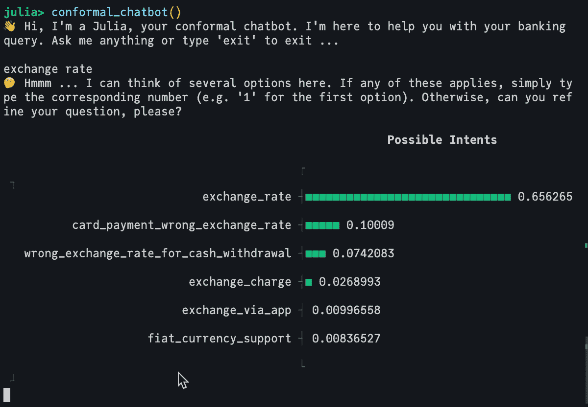

# 在 Julia 中构建一个符合预测的聊天机器人

> 原文：[`towardsdatascience.com/building-a-conformal-chatbot-in-julia-1ed23363a280`](https://towardsdatascience.com/building-a-conformal-chatbot-in-julia-1ed23363a280)

## 符合预测、LLMs 和 HuggingFace — 第一部分

[](https://medium.com/@patrick.altmeyer?source=post_page-----1ed23363a280--------------------------------)[](https://towardsdatascience.com/?source=post_page-----1ed23363a280--------------------------------) [Patrick Altmeyer](https://medium.com/@patrick.altmeyer?source=post_page-----1ed23363a280--------------------------------)

·发表于[Towards Data Science](https://towardsdatascience.com/?source=post_page-----1ed23363a280--------------------------------) ·阅读时间 7 分钟·2023 年 7 月 5 日

--

大型语言模型（LLM）目前非常受关注。它们被用于各种任务，包括文本分类、问答和文本生成。在本教程中，我们将展示如何使用`[ConformalPrediction.jl](https://juliatrustworthyai.github.io/ConformalPrediction.jl/dev/)`将变换器语言模型符合化，以进行文本分类。

# 👀 一览

我们特别关注意图分类任务，如下图所示。首先，我们将客户查询输入到 LLM 中以生成嵌入。接着，我们训练一个分类器，将这些嵌入与可能的意图匹配。当然，对于这个监督学习问题，我们需要由输入——查询——和输出——指示真实意图的标签——组成的训练数据。最后，我们应用符合预测来量化分类器的预测不确定性。

> 符合预测（CP）是一种快速发展的预测不确定性量化方法。如果你不熟悉 CP，建议你首先查看我关于这一主题的三部分介绍系列，从这篇[文章](https://medium.com/towards-data-science/conformal-prediction-in-julia-351b81309e30)开始。


符合化意图分类器的高级概述。图片由作者提供。

# 🤗 HuggingFace

我们将使用[Banking77](https://arxiv.org/abs/2003.04807)数据集（Casanueva 等，2020），该数据集包含 77 个与银行相关的意图中的 13,083 个查询。在模型方面，我们将使用[DistilRoBERTa](https://huggingface.co/mrm8488/distilroberta-finetuned-banking77)模型，它是[RoBERTa](https://arxiv.org/abs/1907.11692)（Liu 等，2019）的蒸馏版，并在 Banking77 数据集上进行了微调。

可以使用 `[Transformers.jl](https://github.com/chengchingwen/Transformers.jl/tree/master)` 包将模型从 HF 直接加载到我们正在运行的 Julia 会话中。

> 这个包使得在 Julia 中使用 HF 模型变得非常简单。向开发者们致敬！*🙏*

下面我们加载分词器`tkr`和模型`mod`。分词器用于将文本转换为整数序列，然后将其输入模型。模型输出一个隐藏状态，然后将其输入分类器，以获得每个类别的 logits。最后，这些 logits 通过 softmax 函数以获得相应的预测概率。下面我们运行几个查询来查看模型的表现。

```py
# Load model from HF 🤗:
tkr = hgf"mrm8488/distilroberta-finetuned-banking77:tokenizer"
mod = hgf"mrm8488/distilroberta-finetuned-banking77:ForSequenceClassification"

# Test model:
query = [
    "What is the base of the exchange rates?",
    "Why is my card not working?",
    "My Apple Pay is not working, what should I do?",
]
a = encode(tkr, query)
b = mod.model(a)
c = mod.cls(b.hidden_state)
d = softmax(c.logit)
[labels[i] for i in Flux.onecold(d)]
```

```py
3-element Vector{String}:
 "exchange_rate"
 "card_not_working"
 "apple_pay_or_google_pay"
```

# 🔁 `MLJ`接口

由于我们的包与 `[MLJ.jl](https://alan-turing-institute.github.io/MLJ.jl/dev/)` 接口对接，我们需要定义一个符合`MLJ`接口的包装模型。为了将模型添加到通用使用中，我们可能会通过 `[MLJFlux.jl](https://github.com/FluxML/MLJFlux.jl)` 来实现，但在本教程中，我们将简化操作，直接重载`MLJBase.fit`和`MLJBase.predict`方法。

由于 HF 的模型已经是预训练的，我们不打算进一步微调，因此我们将在`MLJBase.fit`方法中简单地返回模型对象。`MLJBase.predict`方法将接收模型对象和查询，并返回预测概率。我们还需要定义`MLJBase.target_scitype`和`MLJBase.predict_mode`方法。前者告诉`MLJ`模型的输出类型是什么，后者可以用来检索具有最高预测概率的标签。

```py
struct IntentClassifier <: MLJBase.Probabilistic
    tkr::TextEncoders.AbstractTransformerTextEncoder
    mod::HuggingFace.HGFRobertaForSequenceClassification
end

function IntentClassifier(;
    tkr::TextEncoders.AbstractTransformerTextEncoder, 
    mod::HuggingFace.HGFRobertaForSequenceClassification,
)
    IntentClassifier(tkr, mod)
end

function get_hidden_state(clf::IntentClassifier, query::Union{AbstractString, Vector{<:AbstractString}})
    token = encode(clf.tkr, query)
    hidden_state = clf.mod.model(token).hidden_state
    return hidden_state
end

# This doesn't actually retrain the model, but it retrieves the classifier object
function MLJBase.fit(clf::IntentClassifier, verbosity, X, y)
    cache=nothing
    report=nothing
    fitresult = (clf = clf.mod.cls, labels = levels(y))
    return fitresult, cache, report
end

function MLJBase.predict(clf::IntentClassifier, fitresult, Xnew)
    output = fitresult.clf(get_hidden_state(clf, Xnew))
    p̂ = UnivariateFinite(fitresult.labels,softmax(output.logit)',pool=missing)
    return p̂
end

MLJBase.target_scitype(clf::IntentClassifier) = AbstractVector{<:Finite}

MLJBase.predict_mode(clf::IntentClassifier, fitresult, Xnew) = mode.(MLJBase.predict(clf, fitresult, Xnew))
```

为了测试一切是否按预期工作，我们拟合了模型并为测试数据的子集生成了预测：

```py
clf = IntentClassifier(tkr, mod)
top_n = 10
fitresult, _, _ = MLJBase.fit(clf, 1, nothing, y_test[1:top_n])
@time ŷ = MLJBase.predict(clf, fitresult, queries_test[1:top_n]);
```

```py
6.818024 seconds (11.29 M allocations: 799.165 MiB, 2.47% gc time, 91.04% compilation time)
```

注意，即使我们使用的 LLM 并不大，但即使是简单的前向传递也需要相当的时间。

# 🤖 合成聊天机器人

为了将包装好的预训练模型转变为合成意图分类器，我们现在可以依靠标准 API 调用。我们首先包装我们的原子模型，并指定所需的覆盖率和方法。由于即使是简单的前向传递对我们（小）LLM 来说也非常计算密集，我们依赖于简单归纳合成分类。

```py
conf_model = conformal_model(clf; coverage=0.95, method=:simple_inductive, train_ratio=train_ratio)
mach = machine(conf_model, queries, y)
```

最后，我们使用合成 LLM 构建一个简单而强大的聊天机器人，直接在 Julia REPL 中运行。在不详细探讨细节的情况下，`conformal_chatbot` 的工作原理如下：

1.  提示用户解释他们的意图。

1.  通过合成 LLM 处理用户输入，并将输出呈现给用户。

1.  如果合成预测集包含多个标签，请提示用户要么细化输入，要么选择预测集中的选项之一。

以下代码实现了这些想法：

```py
function prediction_set(mach, query::String)
    p̂ = MLJBase.predict(mach, query)[1]
    probs = pdf.(p̂, collect(1:77))
    in_set = findall(probs .!= 0)
    labels_in_set = labels[in_set]
    probs_in_set = probs[in_set]
    _order = sortperm(-probs_in_set)
    plt = UnicodePlots.barplot(labels_in_set[_order], probs_in_set[_order], title="Possible Intents")
    return labels_in_set, plt
end

function conformal_chatbot()
    println("👋 Hi, I'm a Julia, your conformal chatbot. I'm here to help you with your banking query. Ask me anything or type 'exit' to exit ...\n")
    completed = false
    queries = ""
    while !completed
        query = readline()
        queries = queries * "," * query
        labels, plt = prediction_set(mach, queries)
        if length(labels) > 1
            println("🤔 Hmmm ... I can think of several options here. If any of these applies, simply type the corresponding number (e.g. '1' for the first option). Otherwise, can you refine your question, please?\n")
            println(plt)
        else
            println("🥳 I think you mean $(labels[1]). Correct?")
        end

        # Exit:
        if query == "exit"
            println("👋 Bye!")
            break
        end
        if query ∈ string.(collect(1:77))
            println("👍 Great! You've chosen '$(labels[parse(Int64, query)])'. I'm glad I could help you. Have a nice day!")
            completed = true
        end
    end
end
```

下面我们展示了两个示例查询的输出。第一个查询非常模糊（而且刚刚发现拼写错误）：“transfer mondey？”。因此，预测集的大小很大。

```py
ambiguous_query = "transfer mondey?"
prediction_set(mach, ambiguous_query)[2]
```

```py
 Possible Intents              
                                           ┌                                        ┐ 
                   beneficiary_not_allowed ┤■■■■■■■■■■■■■■■■■■■■■■■■■■■■■■ 0.150517   
   balance_not_updated_after_bank_transfer ┤■■■■■■■■■■■■■■■■■■■■■■ 0.111409           
                     transfer_into_account ┤■■■■■■■■■■■■■■■■■■■ 0.0939535             
        transfer_not_received_by_recipient ┤■■■■■■■■■■■■■■■■■■ 0.091163               
            top_up_by_bank_transfer_charge ┤■■■■■■■■■■■■■■■■■■ 0.089306               
                           failed_transfer ┤■■■■■■■■■■■■■■■■■■ 0.0888322              
                           transfer_timing ┤■■■■■■■■■■■■■ 0.0641952                   
                      transfer_fee_charged ┤■■■■■■■ 0.0361131                         
                          pending_transfer ┤■■■■■ 0.0270795                           
                           receiving_money ┤■■■■■ 0.0252126                           
                         declined_transfer ┤■■■ 0.0164443                             
                           cancel_transfer ┤■■■ 0.0150444                             
                                           └                                        ┘ 
```

以下是更精炼的提示版本：“我试图给朋友转账，但失败了。” 由于不那么模糊的提示会导致较低的预测不确定性，因此它产生了较小的预测集。

```py
refined_query = "I tried to transfer money to my friend, but it failed."
prediction_set(mach, refined_query)[2]
```

```py
 Possible Intents              
                                           ┌                                        ┐ 
                           failed_transfer ┤■■■■■■■■■■■■■■■■■■■■■■■■■■■■■■■ 0.59042   
                   beneficiary_not_allowed ┤■■■■■■■ 0.139806                          
        transfer_not_received_by_recipient ┤■■ 0.0449783                              
   balance_not_updated_after_bank_transfer ┤■■ 0.037894                               
                         declined_transfer ┤■ 0.0232856                               
                     transfer_into_account ┤■ 0.0108771                               
                           cancel_transfer ┤ 0.00876369                               
                                           └                                        ┘ 
```

下面的视频展示了 REPL 基础聊天机器人在实际应用中的表现。你可以自己重现这个过程，并直接从你的终端运行机器人。为此，请查看我博客上的原始[帖子](https://www.paltmeyer.com/blog/posts/conformal-llm/)以获取完整的源代码。



REPL 基础的符合性聊天机器人的演示。由作者创建。

# 🌯 总结

这项工作是与 ING 的同事合作完成的，作为 ING Analytics 2023 实验周的一部分。我们的团队展示了符合性预测提供了对顶级-*K*意图分类的强大而有原则的替代方案。我们通过大众投票赢得了第一名。

当然，这里还有很多可以改进的地方。就大型语言模型而言，我们使用了一个较小的模型。在符合性预测方面，我们只关注了简单的归纳符合性分类。这是一个好的起点，但还有更高级的方法可用，这些方法已经在软件包中实现，并在竞赛中进行了研究。另一个我们没有考虑的方面是我们有许多结果类别，实际上可能希望实现类别条件覆盖。请关注未来的帖子了解更多内容。

如果你对在 Julia 中了解更多关于符合性预测的内容感兴趣，请查看[代码库](https://github.com/JuliaTrustworthyAI/ConformalPrediction.jl)和[文档](https://juliatrustworthyai.github.io/ConformalPrediction.jl/dev/)。

> 🎉 JuliaCon 2023 即将到来，今年我将进行一场关于*ConformalPrediction.jl*的[讲座](https://pretalx.com/juliacon2023/talk/JQWNNP/)。请查看我的讲座[详细信息](https://pretalx.com/juliacon2023/talk/JQWNNP/)，并浏览内容丰富的会议[日程](https://pretalx.com/juliacon2023/schedule/)。

# 🎓 参考文献

Casanueva, Iñigo, Tadas Temčinas, Daniela Gerz, Matthew Henderson, 和 Ivan Vulić. 2020\. “使用双句子编码器的高效意图检测。” *第二届对话 AI 自然语言处理研讨会论文集* , 38–45\. 在线：计算语言学协会. [`doi.org/10.18653/v1/2020.nlp4convai-1.5`](https://doi.org/10.18653/v1/2020.nlp4convai-1.5)。

Liu, Yinhan, Myle Ott, Naman Goyal, Jingfei Du, Mandar Joshi, Danqi Chen, Omer Levy, Mike Lewis, Luke Zettlemoyer, 和 Veselin Stoyanov. 2019\. “RoBERTa：一种稳健优化的 BERT 预训练方法。” arXiv. [`doi.org/10.48550/arXiv.1907.11692`](https://doi.org/10.48550/arXiv.1907.11692)。

## 💾 数据和模型

[Banking77](https://arxiv.org/abs/2003.04807) 数据集是从 HuggingFace 获取的。它在知识共享署名 4.0 国际许可协议（CC BY 4.0）下发布，由 [PolyAI](https://github.com/PolyAI-LDN) 策划，并由 Casanueva 等人（2020 年）最初发布。还要感谢 [Manuel Romero](https://twitter.com/mrm8488) 为 HuggingFace 贡献了经过微调的 [DistilRoBERTa](https://huggingface.co/mrm8488/distilroberta-finetuned-banking77)。

*最初发布于* [*https://www.paltmeyer.com*](https://www.paltmeyer.com/blog/posts/conformal-llm/) *于 2023 年 7 月 5 日。*
