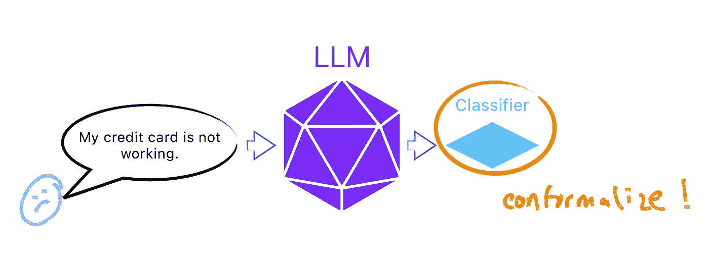

# 在 Julia 中构建保形聊天机器人

> 原文：[`towardsdatascience.com/building-a-conformal-chatbot-in-julia-1ed23363a280?source=collection_archive---------14-----------------------#2023-07-05`](https://towardsdatascience.com/building-a-conformal-chatbot-in-julia-1ed23363a280?source=collection_archive---------14-----------------------#2023-07-05)

## 保形预测、LLMs 和 HuggingFace — 第一部分

 [Patrick Altmeyer](https://medium.com/@patrick.altmeyer?source=post_page-----1ed23363a280--------------------------------)

·

[关注](https://medium.com/m/signin?actionUrl=https%3A%2F%2Fmedium.com%2F_%2Fsubscribe%2Fuser%2F916e26fa956e&operation=register&redirect=https%3A%2F%2Ftowardsdatascience.com%2Fbuilding-a-conformal-chatbot-in-julia-1ed23363a280&user=Patrick+Altmeyer&userId=916e26fa956e&source=post_page-916e26fa956e----1ed23363a280---------------------post_header-----------) 发表在 [Towards Data Science](https://towardsdatascience.com/?source=post_page-----1ed23363a280--------------------------------) ·7 分钟阅读·2023 年 7 月 5 日

--

大型语言模型（LLM）目前非常火热。它们用于各种任务，包括文本分类、问答和文本生成。在本教程中，我们将演示如何使用 `[ConformalPrediction.jl](https://juliatrustworthyai.github.io/ConformalPrediction.jl/dev/)` 将变换器语言模型进行保形化以实现文本分类。

# 👀 一览

我们特别关注意图分类任务，如下图所示。首先，我们将客户查询输入到 LLM 中生成嵌入。接着，我们训练一个分类器，将这些嵌入匹配到可能的意图。当然，对于这个监督学习问题，我们需要包含输入（查询）和输出（指示真实意图的标签）的训练数据。最后，我们应用符合规范的预测方法来量化分类器的预测不确定性。

> 符合规范的预测（CP）是一种迅速发展的预测不确定性量化方法。如果你不熟悉 CP，你可能想先查看我关于该主题的三部分入门系列，首先是这篇[文章](https://medium.com/towards-data-science/conformal-prediction-in-julia-351b81309e30)。

高级概述一个符合规范的意图分类器。图片由作者提供。

# 🤗 HuggingFace

我们将使用[Banking77](https://arxiv.org/abs/2003.04807)数据集（Casanueva 等，2020），该数据集包含来自 77 个...
