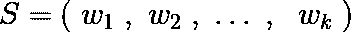
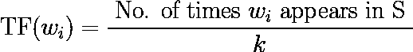
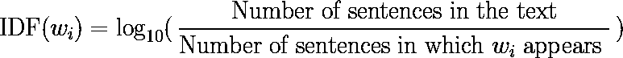
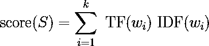

# 在 Rust 中构建跨平台 TFIDF 文本摘要器

> 原文：[`towardsdatascience.com/building-a-cross-platform-tfidf-text-summarizer-in-rust-7b05938f4507?source=collection_archive---------4-----------------------#2023-12-14`](https://towardsdatascience.com/building-a-cross-platform-tfidf-text-summarizer-in-rust-7b05938f4507?source=collection_archive---------4-----------------------#2023-12-14)

## 跨平台的 Rust NLP

## 使用 Rayon 进行优化，并支持 C/C++、Android、Python

[](https://equipintelligence.medium.com/?source=post_page-----7b05938f4507--------------------------------)[](https://towardsdatascience.com/?source=post_page-----7b05938f4507--------------------------------) [Shubham Panchal](https://equipintelligence.medium.com/?source=post_page-----7b05938f4507--------------------------------)

·

[关注](https://medium.com/m/signin?actionUrl=https%3A%2F%2Fmedium.com%2F_%2Fsubscribe%2Fuser%2Fd45a9465f044&operation=register&redirect=https%3A%2F%2Ftowardsdatascience.com%2Fbuilding-a-cross-platform-tfidf-text-summarizer-in-rust-7b05938f4507&user=Shubham+Panchal&userId=d45a9465f044&source=post_page-d45a9465f044----7b05938f4507---------------------post_header-----------) 发布于 [Towards Data Science](https://towardsdatascience.com/?source=post_page-----7b05938f4507--------------------------------) · 12 分钟阅读 · 2023 年 12 月 14 日 [](https://medium.com/m/signin?actionUrl=https%3A%2F%2Fmedium.com%2F_%2Fvote%2Ftowards-data-science%2F7b05938f4507&operation=register&redirect=https%3A%2F%2Ftowardsdatascience.com%2Fbuilding-a-cross-platform-tfidf-text-summarizer-in-rust-7b05938f4507&user=Shubham+Panchal&userId=d45a9465f044&source=-----7b05938f4507---------------------clap_footer-----------)

--

[](https://medium.com/m/signin?actionUrl=https%3A%2F%2Fmedium.com%2F_%2Fbookmark%2Fp%2F7b05938f4507&operation=register&redirect=https%3A%2F%2Ftowardsdatascience.com%2Fbuilding-a-cross-platform-tfidf-text-summarizer-in-rust-7b05938f4507&source=-----7b05938f4507---------------------bookmark_footer-----------)

照片由 [Patrick Tomasso](https://unsplash.com/@impatrickt?utm_source=medium&utm_medium=referral) 提供，来自 [Unsplash](https://unsplash.com/?utm_source=medium&utm_medium=referral)

NLP 工具和实用程序在 Python 生态系统中得到了广泛发展，使得各级开发者能够大规模地构建高质量的语言应用。Rust 是 NLP 的新兴领域，像 [HuggingFace](https://huggingface.co/) 这样的组织正在采用它来构建机器学习包。

[](https://medium.com/@Aaron0928/hugging-face-has-written-a-new-ml-framework-in-rust-now-open-sourced-1afea2113410?source=post_page-----7b05938f4507--------------------------------) [## Hugging Face 已经用 Rust 编写了一个新的机器学习框架，现在已开源！

### 最近，Hugging Face 开源了一个重量级的机器学习框架 Candle，这与通常的 Python 有所不同…

medium.com](https://medium.com/@Aaron0928/hugging-face-has-written-a-new-ml-framework-in-rust-now-open-sourced-1afea2113410?source=post_page-----7b05938f4507--------------------------------)

在这篇博客中，我们将探讨如何利用 TFIDF 的概念构建一个文本总结器。我们首先将了解 TFIDF 总结的工作原理，以及为什么 Rust 可能是实现 NLP 管道的好语言，以及如何在其他平台如 C/C++、Android 和 Python 上使用我们的 Rust 代码。此外，我们将讨论如何利用 [Rayon](https://github.com/rayon-rs/rayon) 进行并行计算来优化总结任务。

这是 GitHub 项目：

[](https://github.com/shubham0204/tfidf-summarizer.rs?source=post_page-----7b05938f4507--------------------------------) [## GitHub - shubham0204/tfidf-summarizer.rs: 简单、高效且跨平台的基于 TFIDF 的文本…

### 简单、高效且跨平台的基于 TFIDF 的 Rust 文本总结器 - GitHub - shubham0204/tfidf-summarizer.rs…

github.com](https://github.com/shubham0204/tfidf-summarizer.rs?source=post_page-----7b05938f4507--------------------------------)

开始吧 ➡️

# 目录

1.  动机

1.  提取式和抽象式文本总结

1.  使用 TFIDF 理解文本总结

1.  Rust 实现

1.  与 C 的使用

1.  未来展望

1.  结论

# 动机

我在 2019 年使用相同的技术构建了一个文本总结器，使用 Kotlin 并称之为 [Text2Summary](https://github.com/shubham0204/Text2Summary-Android)。它主要为 Android 应用程序设计，作为一个副项目，使用 Kotlin 进行所有计算。快进到 2023 年，我现在正在处理 C、C++ 和 Rust 代码库，并且在 Android 和 Python 中使用了这些 *本地* 语言构建的模块。

我选择用 Rust 重新实现 `Text2Summary`，因为这将是一个很好的学习经验，同时也是一个小巧高效的文本总结工具，可以轻松处理大文本。Rust 是一种编译语言，具有智能的借用和引用检查器，帮助开发者编写无 bug 的代码。用 Rust 编写的代码可以通过 `jni` 与 Java 代码库集成，并转换为 C 头文件/库，用于 C/C++ 和 Python。

# 提取式和抽象式文本总结

文本总结一直是自然语言处理（NLP）中长期研究的问题。从文本中提取重要信息并生成文本摘要是文本总结器需要解决的核心问题。解决方案分为两类，即提取式总结和抽象式总结。

[](/understanding-automatic-text-summarization-1-extractive-methods-8eb512b21ecc?source=post_page-----7b05938f4507--------------------------------) ## 理解自动文本摘要-1: 抽取方法

### 我们如何自动总结文档？

[towardsdatascience.com

在抽取式文本总结中，短语或句子直接从句子中提取。我们可以使用评分函数对句子进行排名，并根据它们的分数从文本中选择最合适的句子。与抽象总结中生成新文本不同，摘要是从文本中选择的句子的集合，从而避免了生成模型所展示的问题。

+   在抽取式总结中，文本的精确度得以保持，但由于选择的文本粒度仅限于句子，信息丢失的可能性较高。如果一条信息分散在多个句子中，评分函数必须考虑包含这些句子的关系。

+   抽象式文本总结需要更大的深度学习模型来捕捉语言的语义，并建立适当的文档到摘要的映射。训练此类模型需要大量数据集和较长的训练时间，这会重负计算资源。预训练模型可能解决了更长训练时间和数据需求的问题，但仍然固有地偏向于其训练的文本领域。

+   抽取式方法可能有不带参数的评分函数，无需任何学习。它们属于无监督学习的 ML 领域，有用的是它们需要的计算较少且不偏向于文本领域。总结在新闻文章和小说摘录中可能同样有效。

使用我们的基于 TFIDF 的技术，我们不需要任何训练数据集或深度学习模型。我们的评分函数基于不同句子中词汇的相对频率。

# 使用 TFIDF 理解文本总结

为了对每个句子进行排序，我们需要计算一个分数来量化句子中信息的量。TF-IDF 包含两个术语——TF，表示*词频*，以及 IDF，表示*逆文档频率*。

[](/tf-term-frequency-idf-inverse-document-frequency-from-scratch-in-python-6c2b61b78558?source=post_page-----7b05938f4507--------------------------------) ## 从头开始使用 python 创建 TF（词频）-IDF（逆文档频率）。

### 从头开始创建 TF-IDF 模型

[towardsdatascience.com

我们认为每个句子由词汇（单词）组成，



表达式 1：句子 S 表示为单词元组

每个单词在句子 ***S*** 中的词频定义为，



表达式 2：**k** 代表句子中的总词数。

每个单词在句子 S 中的逆文档频率定义为，



表达式 3：逆文档频率量化了该词在其他句子中的出现情况。

每个句子的分数是该句子中所有单词的 TFIDF 分数之和，



表达式 4：每个句子的分数 **S** 决定了它是否包含在最终总结中。

## 重要性与直觉

正如你可能已经观察到的，词频对于句子中较少出现的单词来说会更低。如果同一个词在其他句子中的出现也较少，那么 IDF 分数也会更高。因此，一个包含重复单词（较高 TF）且这些单词仅在该句子中较为独特（较高 IDF）的句子将具有更高的 TFIDF 分数。

# Rust 实现

我们通过创建将给定文本转换为 `Vec` 句子的函数来开始实现我们的技术。这个问题被称为句子分词，它在文本中识别句子边界。使用像 `nltk` 这样的 Python 包，`punkt` 句子分词器可用于此任务，并且也存在 [Punkt](https://www.askpython.com/python-modules/nltk-punkt) 的 Rust 移植版。`[rust-punkt](https://github.com/ferristseng/rust-punkt)` 不再维护，但我们在这里仍然使用它。还编写了另一个将句子拆分为单词的函数，

```py
use punkt::{SentenceTokenizer, TrainingData};
use punkt::params::Standard;

static STOPWORDS: [ &str ; 127 ] = [ "i", "me", "my", "myself", "we", "our", "ours", "ourselves", "you", 
    "your", "yours", "yourself", "yourselves", "he", "him", "his", "himself", "she", "her", "hers", "herself", 
    "it", "its", "itself", "they", "them", "their", "theirs", "themselves", "what", "which", "who", "whom", "this",
     "that", "these", "those", "am", "is", "are", "was", "were", "be", "been", "being", "have", "has", "had", "having", 
     "do", "does", "did", "doing", "a", "an", "the", "and", "but", "if", "or", "because", "as", "until", "while", "of", 
     "at", "by", "for", "with", "about", "against", "between", "into", "through", "during", "before", "after", "above",
     "below", "to", "from", "up", "down", "in", "out", "on", "off", "over", "under", "again", "further", "then", "once",
       "here", "there", "when", "where", "why", "how", "all", "any", "both", "each", "few", "more", "most", "other", 
       "some", "such", "no", "nor", "not", "only", "own", "same", "so", "than", "too", "very", "s", "t", "can",
        "will", "just", "don", "should", "now" ] ;

/// Transform a `text` into a list of sentences
/// It uses the popular Punkt sentence tokenizer from a Rust port: 
/// <`/`>https://github.com/ferristseng/rust-punkt<`/`>
pub fn text_to_sentences( text: &str ) -> Vec<String> {
    let english = TrainingData::english();
    let mut sentences: Vec<String> = Vec::new() ; 
    for s in SentenceTokenizer::<Standard>::new(text, &english) {
        sentences.push( s.to_owned() ) ; 
    }
    sentences
}

/// Transforms the sentence into a list of words (tokens)
/// eliminating stopwords while doing so
pub fn sentence_to_tokens( sentence: &str ) -> Vec<&str> {
    let tokens: Vec<&str> = sentence.split_ascii_whitespace().collect() ; 
    let filtered_tokens: Vec<&str> = tokens
                                .into_iter()
                                .filter( |token| !STOPWORDS.contains( &token.to_lowercase().as_str() ) )
                                .collect() ;
    filtered_tokens
}
```

在上述代码片段中，我们删除停用词，即在语言中常见且对文本信息内容没有重要贡献的词汇。

[](/text-pre-processing-stop-words-removal-using-different-libraries-f20bac19929a?source=post_page-----7b05938f4507--------------------------------) ## 文本预处理：使用不同库删除停用词

### 关于在 Python 中删除英文停用词的实用指南！

towardsdatascience.com

接下来，我们创建一个计算语料库中每个单词频率的函数。此方法将用于计算句子中每个单词的词频。`(word, freq)` 对存储在 `[Hashmap](https://doc.rust-lang.org/std/collections/struct.HashMap.html)` 中，以便在后续阶段快速检索。

```py
use std::collections::HashMap;

/// Given a list of words, build a frequency map
/// where keys are words and values are the frequencies of those words
/// This method will be used to compute the term frequencies of each word
/// present in a sentence
pub fn get_freq_map<'a>( words: &'a Vec<&'a str> ) -> HashMap<&'a str,usize> {
    let mut freq_map: HashMap<&str,usize> = HashMap::new() ; 
    for word in words {
        if freq_map.contains_key( word ) {
            freq_map
                .entry( word )
                .and_modify( | e | { 
                    *e += 1 ; 
                } ) ; 
        }
        else {
            freq_map.insert( *word , 1 ) ; 
        }
    }
    freq_map
}
```

接下来，我们编写了一个计算句子中单词词频的函数，

```py
// Compute the term frequency of tokens present in the given sentence (tokenized)
// Term frequency TF of token 'w' is expressed as,
// TF(w) = (frequency of w in the sentence) / (total number of tokens in the sentence)
fn compute_term_frequency<'a>(
    tokenized_sentence: &'a Vec<&str>
) -> HashMap<&'a str,f32> {
    let words_frequencies = Tokenizer::get_freq_map( tokenized_sentence ) ;
    let mut term_frequency: HashMap<&str,f32> = HashMap::new() ;  
    let num_tokens = tokenized_sentence.len() ; 
    for (word , count) in words_frequencies {
        term_frequency.insert( word , ( count as f32 ) / ( num_tokens as f32 ) ) ; 
    }
    term_frequency
}
```

另一个函数计算了分词句子中单词的 IDF（逆文档频率），

```py
// Compute the inverse document frequency of tokens present in the given sentence (tokenized)
// Inverse document frequency IDF of token 'w' is expressed as,
// IDF(w) = log( N / (Number of documents in which w appears) )
fn compute_inverse_doc_frequency<'a>(
    tokenized_sentence: &'a Vec<&str> ,
    tokens: &'a Vec<Vec<&'a str>>
) -> HashMap<&'a str,f32> {
    let num_docs = tokens.len() as f32 ; 
    let mut idf: HashMap<&str,f32> = HashMap::new() ; 
    for word in tokenized_sentence {
        let mut word_count_in_docs: usize = 0 ; 
        for doc in tokens {
            word_count_in_docs += doc.iter().filter( |&token| token == word ).count() ;
        }
        idf.insert( word , ( (num_docs) / (word_count_in_docs as f32) ).log10() ) ;
    }
    idf
}
```

我们现在已经添加了计算句子中每个单词的 TF 和 IDF 分数的函数。为了计算每个句子的最终分数，也就是决定其排名的分数，我们必须计算句子中所有单词的 TFIDF 分数总和。

```py
pub fn compute( 
    text: &str , 
    reduction_factor: f32
 ) -> String {
    let sentences_owned: Vec<String> = Tokenizer::text_to_sentences( text ) ; 
    let mut sentences: Vec<&str> = sentences_owned
                                            .iter()
                                            .map( String::as_str )
                                            .collect() ; 
    let mut tokens: Vec<Vec<&str>> = Vec::new() ; 
    for sentence in &sentences {
        tokens.push( Tokenizer::sentence_to_tokens(sentence) ) ; 
    }

    let mut sentence_scores: HashMap<&str,f32> = HashMap::new() ; 

    for ( i , tokenized_sentence ) in tokens.iter().enumerate() {
        let tf: HashMap<&str,f32> = Summarizer::compute_term_frequency(tokenized_sentence) ; 
        let idf: HashMap<&str,f32> = Summarizer::compute_inverse_doc_frequency(tokenized_sentence, &tokens) ; 
        let mut tfidf_sum: f32 = 0.0 ; 

        // Compute TFIDF score for each word
        // and add it to tfidf_sum
        for word in tokenized_sentence {
            tfidf_sum += tf.get( word ).unwrap() * idf.get( word ).unwrap() ; 
        }
        sentence_scores.insert( sentences[i] , tfidf_sum ) ; 
    }

    // Sort sentences by their scores
    sentences.sort_by( | a , b | 
        sentence_scores.get(b).unwrap().total_cmp(sentence_scores.get(a).unwrap()) ) ; 

    // Compute number of sentences to be included in the summary
    // and return the extracted summary
    let num_summary_sents = (reduction_factor * (sentences.len() as f32) ) as usize;
    sentences[ 0..num_summary_sents ].join( " " )
}
```

## 使用 Rayon

对于较大的文本，我们可以在多个 CPU 线程上并行执行一些操作，即使用流行的 Rust crate `[rayon-rs](https://github.com/rayon-rs/rayon)`。在上面的 `compute` 函数中，我们可以并行执行以下任务，

+   将每个句子转换为 tokens 并移除停用词

+   计算每个句子的 TFIDF 分数总和

这些任务可以独立地在每个句子上执行，并且互相之间没有依赖，因此它们可以被并行化。为了确保不同线程访问共享容器时的互斥性，我们使用 `[Arc](https://doc.rust-lang.org/rust-by-example/std/arc.html)` [(原子引用计数指针)](https://doc.rust-lang.org/rust-by-example/std/arc.html) 和 `[Mutex](https://fongyoong.github.io/easy_rust/Chapter_43.html)`，这是确保原子访问的基本同步原语。

`Arc` 确保被引用的 `Mutex` 对所有线程都是可访问的，而 `Mutex` 本身只允许单线程访问它所包装的对象。这里有另一个函数 `par_compute`，它使用 Rayon 并行执行上述任务，

```py
pub fn par_compute( 
    text: &str , 
    reduction_factor: f32
 ) -> String {
    let sentences_owned: Vec<String> = Tokenizer::text_to_sentences( text ) ; 
    let mut sentences: Vec<&str> = sentences_owned
                                            .iter()
                                            .map( String::as_str )
                                            .collect() ; 

    // Tokenize sentences in parallel with Rayon
    // Declare a thread-safe Vec<Vec<&str>> to hold the tokenized sentences
    let tokens_ptr: Arc<Mutex<Vec<Vec<&str>>>> = Arc::new( Mutex::new( Vec::new() ) ) ; 
    sentences.par_iter()
             .for_each( |sentence| { 
                let sent_tokens: Vec<&str> = Tokenizer::sentence_to_tokens(sentence) ; 
                tokens_ptr.lock().unwrap().push( sent_tokens ) ; 
             } ) ; 
    let tokens = tokens_ptr.lock().unwrap() ; 

    // Compute scores for sentences in parallel
    // Declare a thread-safe Hashmap<&str,f32> to hold the sentence scores
    let sentence_scores_ptr: Arc<Mutex<HashMap<&str,f32>>> = Arc::new( Mutex::new( HashMap::new() ) ) ; 
    tokens.par_iter()
          .zip( sentences.par_iter() )
          .for_each( |(tokenized_sentence , sentence)| {
        let tf: HashMap<&str,f32> = Summarizer::compute_term_frequency(tokenized_sentence) ; 
        let idf: HashMap<&str,f32> = Summarizer::compute_inverse_doc_frequency(tokenized_sentence, &tokens ) ; 
        let mut tfidf_sum: f32 = 0.0 ; 

        for word in tokenized_sentence {
            tfidf_sum += tf.get( word ).unwrap() * idf.get( word ).unwrap() ; 
        }
        tfidf_sum /= tokenized_sentence.len() as f32 ; 
        sentence_scores_ptr.lock().unwrap().insert( sentence , tfidf_sum ) ; 
    } ) ; 
    let sentence_scores = sentence_scores_ptr.lock().unwrap() ;

    // Sort sentences by their scores
    sentences.sort_by( | a , b | 
        sentence_scores.get(b).unwrap().total_cmp(sentence_scores.get(a).unwrap()) ) ; 

    // Compute number of sentences to be included in the summary
    // and return the extracted summary
    let num_summary_sents = (reduction_factor * (sentences.len() as f32) ) as usize;
    sentences[ 0..num_summary_sents ].join( ". " ) 
}
```

# 跨平台使用

## C 和 C++

为了在 C 中使用 Rust 结构体和函数，我们可以使用 `cbindgen` 生成包含结构体/函数原型的 C 风格头文件。生成头文件后，我们可以将 Rust 代码编译成基于 C 的 [动态或静态库](https://domiyanyue.medium.com/c-development-tutorial-4-static-and-dynamic-libraries-7b537656163e#:~:text=At%20runtime%2C%20the%20dynamic%20library,library%20code%20to%20the%20memory.)，这些库包含头文件中声明的函数的实现。为了生成基于 C 的静态库，我们需要在 `Cargo.toml` 中将 `[crate_type](https://doc.rust-lang.org/cargo/reference/cargo-targets.html)` 参数设置为 `staticlib`，

```py
[lib]
name = "summarizer"
crate_type = [ "staticlib" ]
```

接下来，我们添加 FFIs 以在 `src/lib.rs` 的 ABI ([应用程序二进制接口](https://en.wikipedia.org/wiki/Application_binary_interface)) 中暴露总结器的功能，

```py
/// functions exposing Rust methods as C interfaces
/// These methods are accessible with the ABI (compiled object code)
mod c_binding {

    use std::ffi::CString;
    use crate::summarizer::Summarizer;

    #[no_mangle]
    pub extern "C" fn summarize( text: *const u8 , length: usize , reduction_factor: f32 ) -> *const u8 {
        ...  
    }

    #[no_mangle]
    pub extern "C" fn par_summarize( text: *const u8 , length: usize , reduction_factor: f32 ) -> *const u8 {
        ...
    }

}
```

我们可以使用 `cargo build` 构建静态库，`libsummarizer.a` 将在 `target` 目录中生成。

## 安卓

使用 [Android 的本地开发工具包 (NDK)](https://developer.android.com/ndk)，我们可以为 `armeabi-v7a` 和 `arm64-v8a` 目标编译 Rust 程序。我们需要使用 Java Native Interface (JNI) 编写特殊的接口函数，这些函数可以在 `src/lib.rs` 的 `android` 模块中找到。

[](https://matt-moore.medium.com/kotlin-jni-for-native-code-835e93af7ddf?source=post_page-----7b05938f4507--------------------------------) [## Kotlin JNI for Native Code

### 如何从 Kotlin 调用本地代码。

[matt-moore.medium.com](https://matt-moore.medium.com/kotlin-jni-for-native-code-835e93af7ddf?source=post_page-----7b05938f4507--------------------------------)

## Python

使用 Python 的 `ctypes` 模块，我们可以加载共享库（`.so` 或 `.dll`）并使用与 C 兼容的数据类型来执行库中定义的函数。代码尚未在 GitHub 项目上提供，但很快会提供。

[](https://realpython.com/python-bindings-overview/?source=post_page-----7b05938f4507--------------------------------) [## Python 绑定：从 Python 调用 C 或 C++ - Real Python

### 什么是 Python 绑定？你应该使用 ctypes、CFFI 还是其他工具？在这篇逐步教程中，你将获得…

[realpython.com](https://realpython.com/python-bindings-overview/?source=post_page-----7b05938f4507--------------------------------)

# 未来展望

该项目可以以多种方式扩展和改进，我们将在下面讨论：

1.  当前的实现要求使用 `[nightly](https://doc.rust-lang.org/book/appendix-07-nightly-rust.html)` [Rust 构建](https://doc.rust-lang.org/book/appendix-07-nightly-rust.html)，仅仅是因为一个依赖项 `punkt`。`punkt` 是一个句子分词器，用于确定文本中的句子边界，之后进行其他计算。如果 `punkt` 可以使用稳定版 Rust 构建，那么当前实现将不再需要 `nightly` Rust。

1.  添加新的度量标准来排名句子，特别是那些捕捉句子间依赖关系的度量。TFIDF 不是最准确的评分函数，并且有其自身的局限性。构建句子图并利用它们对句子进行评分，大大提高了提取摘要的整体质量。

1.  摘要生成器尚未在已知数据集上进行基准测试。[Rouge 分数](https://en.wikipedia.org/wiki/ROUGE_(metric)) `[R1](https://en.wikipedia.org/wiki/ROUGE_(metric))` [,](https://en.wikipedia.org/wiki/ROUGE_(metric)) `[R2](https://en.wikipedia.org/wiki/ROUGE_(metric))` [和](https://en.wikipedia.org/wiki/ROUGE_(metric)) `[RL](https://en.wikipedia.org/wiki/ROUGE_(metric))` 常用于评估生成的摘要与标准数据集如 [纽约时报数据集](https://paperswithcode.com/dataset/new-york-times-annotated-corpus) 或 [CNN 日报数据集](https://paperswithcode.com/dataset/cnn-daily-mail-1)的质量。与标准基准进行性能测量将为开发者提供更清晰、更可靠的实现参考。

# 结论

使用 Rust 构建 NLP 工具具有显著优势，考虑到由于性能和未来前景，语言在开发者中的受欢迎程度不断上升。我希望这篇文章对你有所帮助。请查看 GitHub 项目：

[## GitHub - shubham0204/tfidf-summarizer.rs: 简单、高效且跨平台的基于 TFIDF 的文本摘要工具](https://github.com/shubham0204/tfidf-summarizer.rs?source=post_page-----7b05938f4507--------------------------------)

### 简单、高效且跨平台的基于 TFIDF 的文本摘要工具，使用 Rust 编写 - GitHub - [shubham0204/tfidf-summarizer.rs](https://github.com/shubham0204/tfidf-summarizer.rs?source=post_page-----7b05938f4507--------------------------------)

[github.com](https://github.com/shubham0204/tfidf-summarizer.rs?source=post_page-----7b05938f4507--------------------------------)

如果你觉得有改进的空间，可以考虑提出问题或提交拉取请求！继续学习，祝你有美好的一天。
