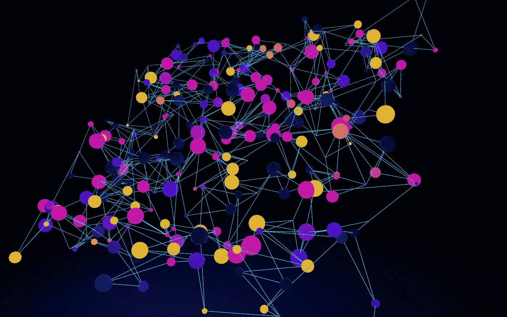
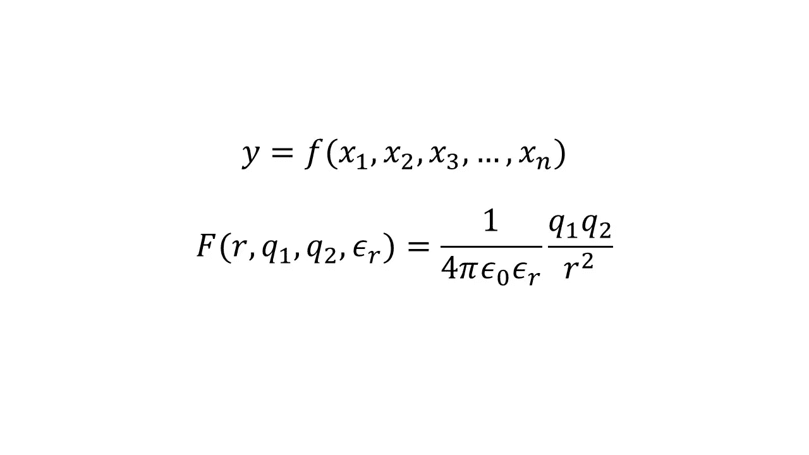
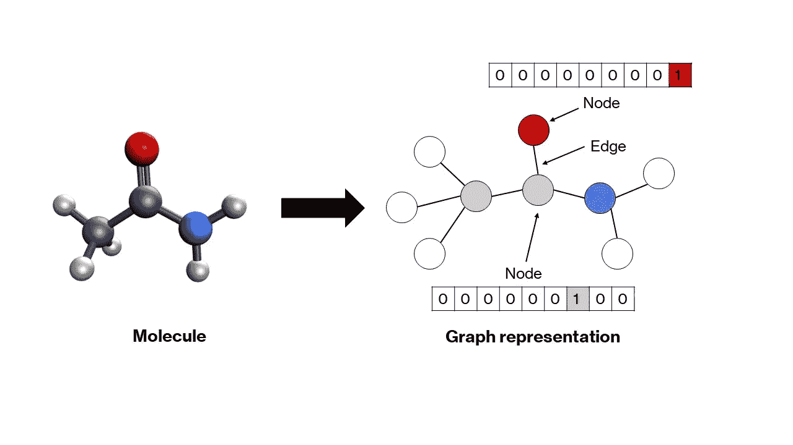
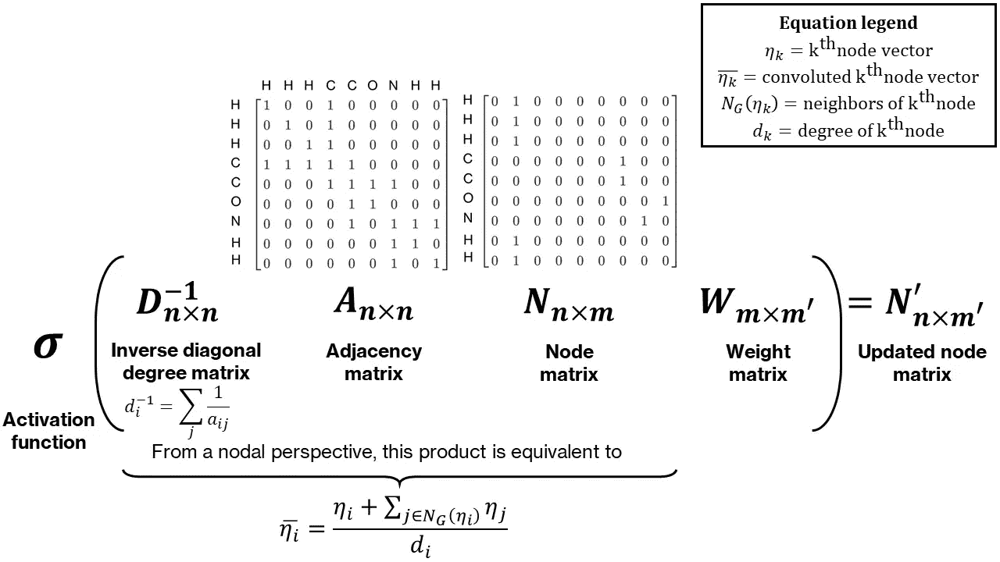
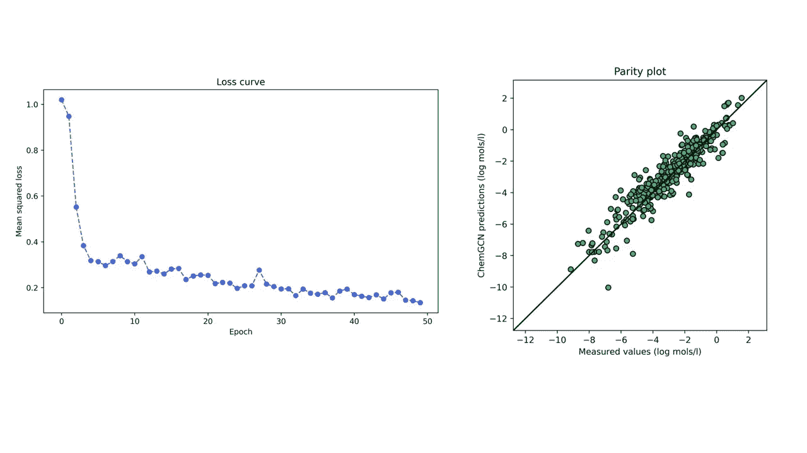

# 构建分子属性预测的图卷积网络

> 原文：[`towardsdatascience.com/building-a-graph-convolutional-network-for-molecular-property-prediction-978b0ae10ec4?source=collection_archive---------2-----------------------#2023-12-23`](https://towardsdatascience.com/building-a-graph-convolutional-network-for-molecular-property-prediction-978b0ae10ec4?source=collection_archive---------2-----------------------#2023-12-23)

## 人工智能

## 制作分子图和开发一个基于 PyTorch 的简单 GCN 的教程

[](https://medium.com/@ChemAndCode?source=post_page-----978b0ae10ec4--------------------------------)[](https://towardsdatascience.com/?source=post_page-----978b0ae10ec4--------------------------------) [Gaurav Deshmukh](https://medium.com/@ChemAndCode?source=post_page-----978b0ae10ec4--------------------------------)

·

[关注](https://medium.com/m/signin?actionUrl=https%3A%2F%2Fmedium.com%2F_%2Fsubscribe%2Fuser%2F5a75283b2c71&operation=register&redirect=https%3A%2F%2Ftowardsdatascience.com%2Fbuilding-a-graph-convolutional-network-for-molecular-property-prediction-978b0ae10ec4&user=Gaurav+Deshmukh&userId=5a75283b2c71&source=post_page-5a75283b2c71----978b0ae10ec4---------------------post_header-----------) 发表在 [Towards Data Science](https://towardsdatascience.com/?source=post_page-----978b0ae10ec4--------------------------------) ·17 分钟阅读·2023 年 12 月 23 日[](https://medium.com/m/signin?actionUrl=https%3A%2F%2Fmedium.com%2F_%2Fvote%2Ftowards-data-science%2F978b0ae10ec4&operation=register&redirect=https%3A%2F%2Ftowardsdatascience.com%2Fbuilding-a-graph-convolutional-network-for-molecular-property-prediction-978b0ae10ec4&user=Gaurav+Deshmukh&userId=5a75283b2c71&source=-----978b0ae10ec4---------------------clap_footer-----------)

--

[](https://medium.com/m/signin?actionUrl=https%3A%2F%2Fmedium.com%2F_%2Fbookmark%2Fp%2F978b0ae10ec4&operation=register&redirect=https%3A%2F%2Ftowardsdatascience.com%2Fbuilding-a-graph-convolutional-network-for-molecular-property-prediction-978b0ae10ec4&source=-----978b0ae10ec4---------------------bookmark_footer-----------)

照片由 [BoliviaInteligente](https://unsplash.com/@boliviainteligente?utm_source=medium&utm_medium=referral) 提供，来源于 [Unsplash](https://unsplash.com/?utm_source=medium&utm_medium=referral)

人工智能在全球范围内引起了轰动。每周都会出现新的模型、工具和应用程序，承诺推动人类努力的边界。开放源代码工具的可用性使得用户能够在少量代码中训练和使用复杂的机器学习模型，真正实现了人工智能的民主化；同时，尽管许多这些现成的模型可能提供了出色的预测能力，但它们作为黑箱模型的使用可能会剥夺了对人工智能深入理解的好奇学生。特别是在自然科学中，这种理解尤为重要，因为知道一个模型准确是不够的——还必须了解它与其他物理理论的联系、其局限性以及它对其他系统的普遍适用性。在本文中，我们将通过化学的视角探讨一种特定的机器学习模型——图卷积网络。这并不是一个数学严格的探讨；相反，我们将尝试将网络的特征与传统自然科学模型进行比较，并思考它为何表现如此出色。

# 1\. 对图形和图神经网络的需求

在化学或物理学中，模型通常是一个连续函数，比如 *y=f(x₁, x₂, x₃, …, xₙ)*，其中 *x₁, x₂, x₃, …, xₙ* 是输入，*y* 是输出。这样的模型的一个例子是决定两个点电荷 *q₁* 和 *q₂* 之间的静电相互作用（或力）的方程，这两个点电荷在相对介电常数为 *εᵣ* 的介质中，相隔距离为 *r*，通常称为库仑定律。



图 1：库仑方程作为点电荷之间静电相互作用的模型（图像来源：作者）

如果我们不知道这种关系，但假设有多个数据点，每个数据点包括点电荷之间的相互作用（输出）和相应的输入，我们可以拟合一个人工神经网络来预测任何给定点电荷在指定介质中的任何给定分离下的相互作用。在这个问题的情况下，虽然忽略了一些重要的警告，但创建一个数据驱动的物理问题模型是相对简单的。

现在考虑从分子的结构预测某一特定性质的问题，比如在水中的溶解度。首先，没有明显的输入集来描述一个分子。你可以使用各种特征，如键长、键角、不同类型元素的数量、环的数量等等。然而，没有保证任何这样的任意集合对所有分子都有效。

其次，与点电荷的例子不同，输入可能不一定存在于连续空间中。例如，我们可以将甲醇、乙醇和丙醇视为一组链长逐渐增加的分子；然而，它们之间并不存在任何概念——链长是一个离散参数，没有办法在甲醇和乙醇之间进行插值以得到其他分子。拥有一个连续的输入空间对于计算模型的导数是至关重要的，这些导数随后可以用于优化所选属性。

为了克服这些问题，已经提出了各种编码分子的方法。其中一种方法是使用 SMILES 和 SELFIES 等方案进行文本表示。这种表示方法有大量文献资料，我推荐感兴趣的读者阅读这篇[有用的综述](https://www.cell.com/patterns/pdf/S2666-3899(22)00206-9.pdf)。第二种方法涉及将分子表示为图形。虽然每种方法都有其优点和缺点，但图形表示对化学更直观。

图是由节点通过边连接组成的数学结构，边表示节点之间的关系。分子自然适应这种结构——原子成为节点，键成为边。图中的每个节点由一个向量表示，该向量编码了相应原子的属性。通常，一位编码方案就足够了（更多内容见下一节）。这些向量可以堆叠起来形成一个*节点矩阵*。节点之间的关系——由边表示——可以通过一个方形的*邻接矩阵*来划分，其中每个元素*aᵢⱼ* 取值为 1 或 0，取决于两个节点*i* 和 *j* 是否由边连接。对角线上的元素设置为 1，表示自连接，这使得矩阵适合卷积（如你将在下一节看到的）。可以开发更复杂的图形表示，其中边的属性也在一个单独的矩阵中进行一位编码，但我们将这些留待另一篇文章。这些节点和邻接矩阵将作为我们模型的输入。



图 2：将乙酰胺分子表示为图形，节点的原子序号通过一位编码表示（图片来源：作者）

通常，人工神经网络模型接受的是一维输入向量。对于多维输入，比如图像，开发了一类叫做卷积神经网络的模型。在我们的情况下，我们有二维矩阵作为输入，因此需要一个修改过的网络来接受这些输入。图神经网络是为了处理这样的节点和邻接矩阵而开发的，它们将这些矩阵转换为适当的一维向量，这些向量可以通过普通的人工神经网络的隐藏层来生成输出。图神经网络有许多类型，比如图卷积网络、消息传递网络、图注意力网络等等，它们主要在于节点和边之间交换信息的函数上有所不同。由于图卷积网络相对简单，我们将更详细地了解它们。

# 2\. 图卷积和池化层

考虑你输入的初始状态。节点矩阵表示了每个原子的独热编码。为了简化起见，我们考虑原子序数的独热编码，其中原子序数为*n*的原子在*nᵗʰ*索引处有一个 1，其余位置都是 0。邻接矩阵表示节点之间的连接。在当前状态下，节点矩阵不能作为人工神经网络的输入，原因有以下几点：(1) 它是二维的，(2) 它不是排列不变的，(3) 它不是唯一的。这里的排列不变性意味着无论你如何排列节点，输入应该保持不变；目前，相同的分子可以由相同节点矩阵的多个排列表示（假设邻接矩阵也有适当的排列）。这是一个问题，因为网络会将不同的排列视为不同的输入，而它们应该被视为相同的。

对于前两个问题，有一个简单的解决方案——池化。如果节点矩阵沿列维度进行池化，那么它将被减少到一个排列不变的一维向量。通常，这种池化是简单的均值池化，这意味着最终池化后的向量包含节点矩阵中每一列的均值。然而，这仍然无法解决第三个问题——池化两个异构体的节点矩阵，例如正戊烷和新戊烷，将产生相同的池化向量。

为了使最终的池化向量具有唯一性，我们需要在节点矩阵中加入一些邻居信息。以同分异构体为例，虽然它们的化学式相同，但它们的结构却不同。加入邻居信息的一个简单方法是对每个节点及其邻居进行某种操作，例如求和。这可以表示为节点矩阵与邻接矩阵的乘法（试着在纸上计算：*邻接矩阵与节点矩阵的乘积生成一个更新后的节点矩阵，其中每个节点向量等于它自身与邻居节点向量的和*）。通常，通过用对角度矩阵的逆进行预乘，对每个节点的度（或邻居数量）进行归一化，从而使这一和值成为邻居的均值。最后，这个乘积会被一个权重矩阵后乘，以使这个操作具有参数化特性。这个完整的操作称为图卷积。**图 3** 显示了一种直观而简单的图卷积形式。一个数学上更严格且数值上更稳定的形式可以在[Thomas Kipf 和 Max Welling 的研究](https://arxiv.org/abs/1609.02907)中找到，该研究对邻接矩阵进行了修改的归一化。卷积和池化操作的组合也可以解释为一种*非线性的经验群体贡献方法*。



图 3：用于乙酰胺分子的图卷积（作者提供的图片）

图卷积网络的最终结构如下——首先，为给定的分子计算节点和邻接矩阵。然后对这些矩阵应用多次图卷积，并进行池化以生成一个包含所有分子信息的单一向量。随后，这个向量通过标准人工神经网络的隐藏层产生输出。隐藏层、池化层和卷积层的权重通过对基于回归的损失函数（如均方误差）应用反向传播同时确定。

# 3\. 代码实现

在讨论了与图卷积网络相关的所有关键概念之后，我们准备开始使用 PyTorch 构建一个网络。虽然存在一个名为 PyTorch Geometric 的灵活且高性能的 GNN 框架，但我们不会使用它，因为我们的目标是深入了解其内部机制并发展我们的理解。

本教程分为四个主要部分——（1）使用 RDKit 自动创建图形，（2）将图形打包成 PyTorch 数据集，（3）构建图卷积网络架构，以及（4）训练网络。完整的代码以及安装和导入所需包的说明可以在文章末尾提供的 GitHub 仓库中找到链接。

## 3.1\. 使用 RDKit 创建图形

RDKit 是一个化学信息学库，允许高通量访问小分子的性质。我们将需要它来完成两个任务——获取分子中每个原子的原子序数以进行节点矩阵的独热编码，并获取邻接矩阵。我们假设分子是通过其 SMILES 字符串提供的（这对于大多数化学信息学数据来说是正确的）。此外，为了确保所有分子的节点和邻接矩阵的大小一致——默认情况下它们的大小不一致，因为它们的大小依赖于分子中的原子数——我们用 0 填充这些矩阵。最后，我们将对上面提出的卷积进行小修改——我们将邻接矩阵中的“1”替换为相应的键长的倒数。这样，网络将获得更多关于分子几何的信息，并且还会根据邻居的键长来加权每个节点周围的卷积。

```py
class Graph:
    def __init__(
        self, molecule_smiles: str,
        node_vec_len: int,
        max_atoms: int = None
      ):
        # Store properties
        self.smiles = molecule_smiles
        self.node_vec_len = node_vec_len
        self.max_atoms = max_atoms

        # Call helper function to convert SMILES to RDKit mol
        self.smiles_to_mol()

        # If valid mol is created, generate a graph of the mol
        if self.mol is not None:
            self.smiles_to_graph()

    def smiles_to_mol(self):
        # Use MolFromSmiles from RDKit to get molecule object
        mol = Chem.MolFromSmiles(self.smiles)

        # If a valid mol is not returned, set mol as None and exit
        if mol is None:
            self.mol = None
            return

        # Add hydrogens to molecule
        self.mol = Chem.AddHs(mol)

    def smiles_to_graph(self):
        # Get list of atoms in molecule
        atoms = self.mol.GetAtoms()

        # If max_atoms is not provided, max_atoms is equal to maximum number 
        # of atoms in this molecule. 
        if self.max_atoms is None:
            n_atoms = len(list(atoms))
        else:
            n_atoms = self.max_atoms

        # Create empty node matrix
        node_mat = np.zeros((n_atoms, self.node_vec_len))

        # Iterate over atoms and add to node matrix
        for atom in atoms:
            # Get atom index and atomic number
            atom_index = atom.GetIdx()
            atom_no = atom.GetAtomicNum()

            # Assign to node matrix
            node_mat[atom_index, atom_no] = 1

        # Get adjacency matrix using RDKit
        adj_mat = rdmolops.GetAdjacencyMatrix(self.mol)
        self.std_adj_mat = np.copy(adj_mat)

        # Get distance matrix using RDKit
        dist_mat = molDG.GetMoleculeBoundsMatrix(self.mol)
        dist_mat[dist_mat == 0.] = 1

        # Get modified adjacency matrix with inverse bond lengths
        adj_mat = adj_mat * (1 / dist_mat)

        # Pad the adjacency matrix with 0s
        dim_add = n_atoms - adj_mat.shape[0]
        adj_mat = np.pad(
            adj_mat, pad_width=((0, dim_add), (0, dim_add)), mode="constant"
        )

        # Add an identity matrix to adjacency matrix
        # This will make an atom its own neighbor
        adj_mat = adj_mat + np.eye(n_atoms)

        # Save both matrices
        self.node_mat = node_mat
        self.adj_mat = adj_mat
```

## 3.2\. 在 Dataset 中打包图

PyTorch 提供了一个便捷的*Dataset*类来存储和访问各种数据。我们将使用它来存储每个分子的节点和邻接矩阵及输出。请注意，使用这个*Dataset*接口来处理数据不是强制性的；不过，使用这个抽象会使后续步骤更加简单。我们需要为继承自*Dataset*类的*GraphData*类定义两个主要方法：一个是**__len__**方法来获取数据集的大小，另一个是**__getitem__**方法来获取给定索引的输入和输出。

```py
class GraphData(Dataset):
    def __init__(self, dataset_path: str, node_vec_len: int, max_atoms: int):
        # Save attributes
        self.node_vec_len = node_vec_len
        self.max_atoms = max_atoms

        # Open dataset file
        df = pd.read_csv(dataset_path)

        # Create lists
        self.indices = df.index.to_list()
        self.smiles = df["smiles"].to_list()
        self.outputs = df["measured log solubility in mols per litre"].to_list()

    def __len__(self):
        return len(self.indices)

    def __getitem__(self, i: int):
        # Get smile
        smile = self.smiles[i]

        # Create MolGraph object using the Graph abstraction
        mol = Graph(smile, self.node_vec_len, self.max_atoms)

        # Get node and adjacency matrices
        node_mat = torch.Tensor(mol.node_mat)
        adj_mat = torch.Tensor(mol.adj_mat)

        # Get output
        output = torch.Tensor([self.outputs[i]])

        return (node_mat, adj_mat), output, smile
```

由于我们已经定义了自己定制的节点和邻接矩阵、输出以及 SMILES 字符串的返回方式，我们需要定义一个自定义函数来整理数据，即将数据打包成一个批次，然后传递给网络。通过传递数据批次而不是单个数据点，并使用小批量梯度下降来训练神经网络，可以在准确性和计算效率之间取得微妙的平衡。我们将在下面定义的整理函数本质上会收集所有数据对象，将它们按类别分层，堆叠在列表中，转换为 PyTorch 张量，并重新组合这些张量，以便以与我们的*GraphData*类相同的方式返回它们。

```py
def collate_graph_dataset(dataset: Dataset):
    # Create empty lists of node and adjacency matrices, outputs, and smiles
    node_mats = []
    adj_mats = []
    outputs = []
    smiles = []

    # Iterate over list and assign each component to the correct list
    for i in range(len(dataset)):
        (node_mat,adj_mat), output, smile = dataset[i]
        node_mats.append(node_mat)
        adj_mats.append(adj_mat)
        outputs.append(output)
        smiles.append(smile)

    # Create tensors
    node_mats_tensor = torch.cat(node_mats, dim=0)
    adj_mats_tensor = torch.cat(adj_mats, dim=0)
    outputs_tensor = torch.stack(outputs, dim=0)

    # Return tensors
    return (node_mats_tensor, adj_mats_tensor), outputs_tensor, smiles
```

## 3.3\. 构建图卷积网络架构

完成数据处理部分的代码后，我们现在转向构建模型本身。为了清晰起见，我们将构建自己的卷积层和池化层，但你们中更高级的开发者可以轻松地用 PyTorch Geometric 模块中更复杂的预定义层替换这些层。*ConvolutionLayer*本质上做三件事——（1）从邻接矩阵计算逆对角度矩阵，（2）对四个矩阵（D⁻¹ANW）进行乘法运算，以及（3）对层输出应用非线性激活函数。与其他 PyTorch 类一样，我们将从已经定义了*forward*方法等方法的*Module*基类继承。

```py
class ConvolutionLayer(nn.Module):
    def __init__(self, node_in_len: int, node_out_len: int):
        # Call constructor of base class
        super().__init__()

        # Create linear layer for node matrix
        self.conv_linear = nn.Linear(node_in_len, node_out_len)

        # Create activation function
        self.conv_activation = nn.LeakyReLU()

    def forward(self, node_mat, adj_mat):
        # Calculate number of neighbors
        n_neighbors = adj_mat.sum(dim=-1, keepdims=True)
        # Create identity tensor
        self.idx_mat = torch.eye(
            adj_mat.shape[-2], adj_mat.shape[-1], device=n_neighbors.device
        )
        # Add new (batch) dimension and expand
        idx_mat = self.idx_mat.unsqueeze(0).expand(*adj_mat.shape)
        # Get inverse degree matrix
        inv_degree_mat = torch.mul(idx_mat, 1 / n_neighbors)

        # Perform matrix multiplication: D^(-1)AN
        node_fea = torch.bmm(inv_degree_mat, adj_mat)
        node_fea = torch.bmm(node_fea, node_mat)

        # Perform linear transformation to node features 
        # (multiplication with W)
        node_fea = self.conv_linear(node_fea)

        # Apply activation
        node_fea = self.conv_activation(node_fea)

        return node_fea
```

接下来，我们构造*PoolingLayer*。该层只执行一个操作，即沿第二维度（节点数量）计算均值。

```py
class PoolingLayer(nn.Module):
    def __init__(self):
        # Call constructor of base class
        super().__init__()

    def forward(self, node_fea):
        # Pool the node matrix
        pooled_node_fea = node_fea.mean(dim=1)
        return pooled_node_fea
```

最后，我们将定义一个*ChemGCN*类，包含卷积层、池化层和隐藏层的定义。通常，这个类应该有一个构造函数来定义这些层的结构和顺序，以及一个*forward*方法，接受输入（在我们的情况下是节点和邻接矩阵）并生成输出。我们将对所有层的输出应用*LeakyReLU*激活函数。此外，我们还将使用 dropout 来减少过拟合。

```py
class ChemGCN(nn.Module):
    def __init__(
        self,
        node_vec_len: int,
        node_fea_len: int,
        hidden_fea_len: int,
        n_conv: int,
        n_hidden: int,
        n_outputs: int,
        p_dropout: float = 0.0,
    ):
        # Call constructor of base class
        super().__init__()

        # Define layers
        # Initial transformation from node matrix to node features
        self.init_transform = nn.Linear(node_vec_len, node_fea_len)

        # Convolution layers
        self.conv_layers = nn.ModuleList(
            [
                ConvolutionLayer(
                    node_in_len=node_fea_len,
                    node_out_len=node_fea_len,
                )
                for i in range(n_conv)
            ]
        )

        # Pool convolution outputs
        self.pooling = PoolingLayer()
        pooled_node_fea_len = node_fea_len

        # Pooling activation
        self.pooling_activation = nn.LeakyReLU()

        # From pooled vector to hidden layers
        self.pooled_to_hidden = nn.Linear(pooled_node_fea_len, hidden_fea_len)

        # Hidden layer
        self.hidden_layer = nn.Linear(hidden_fea_len, hidden_fea_len)

        # Hidden layer activation function
        self.hidden_activation = nn.LeakyReLU()

        # Hidden layer dropout
        self.dropout = nn.Dropout(p=p_dropout)

        # If hidden layers more than 1, add more hidden layers
        self.n_hidden = n_hidden
        if self.n_hidden > 1:
            self.hidden_layers = nn.ModuleList(
                [self.hidden_layer for _ in range(n_hidden - 1)]
            )
            self.hidden_activation_layers = nn.ModuleList(
                [self.hidden_activation for _ in range(n_hidden - 1)]
            )
            self.hidden_dropout_layers = nn.ModuleList(
                [self.dropout for _ in range(n_hidden - 1)]
            )

        # Final layer going to the output
        self.hidden_to_output = nn.Linear(hidden_fea_len, n_outputs)

    def forward(self, node_mat, adj_mat):
        # Perform initial transform on node_mat
        node_fea = self.init_transform(node_mat)

        # Perform convolutions
        for conv in self.conv_layers:
            node_fea = conv(node_fea, adj_mat)

        # Perform pooling
        pooled_node_fea = self.pooling(node_fea)
        pooled_node_fea = self.pooling_activation(pooled_node_fea)

        # First hidden layer
        hidden_node_fea = self.pooled_to_hidden(pooled_node_fea)
        hidden_node_fea = self.hidden_activation(hidden_node_fea)
        hidden_node_fea = self.dropout(hidden_node_fea)

        # Subsequent hidden layers
        if self.n_hidden > 1:
            for i in range(self.n_hidden - 1):
                hidden_node_fea = self.hidden_layersi
                hidden_node_fea = self.hidden_activation_layersi
                hidden_node_fea = self.hidden_dropout_layersi

        # Output
        out = self.hidden_to_output(hidden_node_fea)

        return out
```

# 3.4\. 网络训练

我们已经构建了训练模型和进行预测所需的工具。在这一部分，我们将编写辅助函数来训练和测试我们的模型，并编写脚本以运行生成图表、构建网络和训练模型的工作流程。

首先，我们定义一个*Standardizer*类来标准化我们的输出。神经网络更喜欢处理相对较小且相互之间变化不大的数字。标准化有助于达到这一点。

```py
class Standardizer:
    def __init__(self, X):
        self.mean = torch.mean(X)
        self.std = torch.std(X)

    def standardize(self, X):
        Z = (X - self.mean) / (self.std)
        return Z

    def restore(self, Z):
        X = self.mean + Z * self.std
        return X

    def state(self):
        return {"mean": self.mean, "std": self.std}

    def load(self, state):
        self.mean = state["mean"]
        self.std = state["std"]
```

其次，我们定义一个函数来执行每个 epoch 的以下步骤：

+   从数据加载器中解包输入和输出，并将其传输到 GPU（如果可用）。

+   通过网络传递输入并获得预测结果。

+   计算预测值与输出之间的均方误差。

+   执行反向传播并更新网络的权重。

+   对其他批次重复上述步骤。

该函数返回批量平均损失和均值绝对误差，可用于绘制损失曲线。一个类似的没有反向传播的函数用于测试模型。

```py
def train_model(
    epoch,
    model,
    training_dataloader,
    optimizer,
    loss_fn,
    standardizer,
    use_GPU,
    max_atoms,
    node_vec_len,
):
    # Create variables to store losses and error
    avg_loss = 0
    avg_mae = 0
    count = 0

    # Switch model to train mode
    model.train()

    # Go over each batch in the dataloader
    for i, dataset in enumerate(training_dataloader):
        # Unpack data
        node_mat = dataset[0][0]
        adj_mat = dataset[0][1]
        output = dataset[1]

        # Reshape inputs
        first_dim = int((torch.numel(node_mat)) / (max_atoms * node_vec_len))
        node_mat = node_mat.reshape(first_dim, max_atoms, node_vec_len)
        adj_mat = adj_mat.reshape(first_dim, max_atoms, max_atoms)

        # Standardize output
        output_std = standardizer.standardize(output)

        # Package inputs and outputs; check if GPU is enabled
        if use_GPU:
            nn_input = (node_mat.cuda(), adj_mat.cuda())
            nn_output = output_std.cuda()
        else:
            nn_input = (node_mat, adj_mat)
            nn_output = output_std

        # Compute output from network
        nn_prediction = model(*nn_input)

        # Calculate loss
        loss = loss_fn(nn_output, nn_prediction)
        avg_loss += loss

        # Calculate MAE
        prediction = standardizer.restore(nn_prediction.detach().cpu())
        mae = mean_absolute_error(output, prediction)
        avg_mae += mae

        # Set zero gradients for all tensors
        optimizer.zero_grad()

        # Do backward prop
        loss.backward()

        # Update optimizer parameters
        optimizer.step()

        # Increase count
        count += 1

    # Calculate avg loss and MAE
    avg_loss = avg_loss / count
    avg_mae = avg_mae / count

    # Print stats
    print(
        "Epoch: [{0}]\tTraining Loss: [{1:.2f}]\tTraining MAE: [{2:.2f}]"\
           .format(
                    epoch, avg_loss, avg_mae
           )
    )

    # Return loss and MAE
    return avg_loss, avg_mae
```

最后，我们编写整体工作流程。这个脚本将调用我们之前定义的所有内容。

```py
#### Fix seeds
np.random.seed(0)
torch.manual_seed(0)
use_GPU = torch.cuda.is_available()

#### Inputs
max_atoms = 200
node_vec_len = 60
train_size = 0.7
batch_size = 32
hidden_nodes = 60
n_conv_layers = 4
n_hidden_layers = 2
learning_rate = 0.01
n_epochs = 50

#### Start by creating dataset
main_path = Path(__file__).resolve().parent
data_path = main_path / "data" / "solubility_data.csv"
dataset = GraphData(dataset_path=data_path, max_atoms=max_atoms, 
                        node_vec_len=node_vec_len)

#### Split data into training and test sets
# Get train and test sizes
dataset_indices = np.arange(0, len(dataset), 1)
train_size = int(np.round(train_size * len(dataset)))
test_size = len(dataset) - train_size

# Randomly sample train and test indices
train_indices = np.random.choice(dataset_indices, size=train_size, 
                                                            replace=False)
test_indices = np.array(list(set(dataset_indices) - set(train_indices)))

# Create dataoaders
train_sampler = SubsetRandomSampler(train_indices)
test_sampler = SubsetRandomSampler(test_indices)
train_loader = DataLoader(dataset, batch_size=batch_size, 
                          sampler=train_sampler, 
                          collate_fn=collate_graph_dataset)
test_loader = DataLoader(dataset, batch_size=batch_size, 
                         sampler=test_sampler,
                         collate_fn=collate_graph_dataset)

#### Initialize model, standardizer, optimizer, and loss function
# Model
model = ChemGCN(node_vec_len=node_vec_len, node_fea_len=hidden_nodes,
                hidden_fea_len=hidden_nodes, n_conv=n_conv_layers, 
                n_hidden=n_hidden_layers, n_outputs=1, p_dropout=0.1)
# Transfer to GPU if needed
if use_GPU:
    model.cuda()

# Standardizer
outputs = [dataset[i][1] for i in range(len(dataset))]
standardizer = Standardizer(torch.Tensor(outputs))

# Optimizer
optimizer = torch.optim.Adam(model.parameters(), lr=learning_rate)

# Loss function
loss_fn = torch.nn.MSELoss()

#### Train the model
loss = []
mae = []
epoch = []
for i in range(n_epochs):
    epoch_loss, epoch_mae = train_model(
        i,
        model,
        train_loader,
        optimizer,
        loss_fn,
        standardizer,
        use_GPU,
        max_atoms,
        node_vec_len,
    )
    loss.append(epoch_loss)
    mae.append(epoch_mae)
    epoch.append(i)

#### Test the model
# Call test model function
test_loss, test_mae = test_model(model, test_loader, loss_fn, standardizer,
                                 use_GPU, max_atoms, node_vec_len)

#### Print final results
print(f"Training Loss: {loss[-1]:.2f}")
print(f"Training MAE: {mae[-1]:.2f}")
print(f"Test Loss: {test_loss:.2f}")
print(f"Test MAE: {test_mae:.2f}")
```

就这样！运行这个脚本应该会输出训练和测试的损失和错误。

# 4\. 结果

具有给定架构和超参数的网络在开源的[DeepChem 库](https://github.com/deepchem/deepchem)上训练，该库包含约 1000 种小分子的水溶性。下图显示了一个特定训练-测试划分的训练损失曲线和测试集的对比图。训练集和测试集上的平均绝对误差分别为 0.59 和 0.58（以 log mol/l 为单位），低于线性模型的 0.69 log mol/l（基于数据集中的预测）。神经网络表现优于线性回归模型并不令人意外；尽管如此，这种粗略的比较使我们确信模型的预测是合理的。此外，我们仅通过在图中包含基本的结构描述符——原子序数和键长——来实现这一点，让卷积和池化函数建立这些描述符之间更复杂的关系，从而得出最准确的分子性质预测。



图 4：测试集的训练损失曲线（左）和对比图（右）（图像由作者提供）

# 5\. 最后的说明

这绝不是解决所选问题的最终模型。改进模型的方式有很多，包括：

+   优化超参数

+   使用早停策略找到具有最低验证损失的模型

+   使用更复杂的卷积和池化函数

+   收集更多数据

尽管如此，本教程的目标是通过一个简单的例子阐述化学领域图卷积网络的基础知识。在掌握了基础知识后，你在 GCN 模型构建之旅中的可能性是无限的。

# 仓库和有用的参考资料

+   完整的代码（包括创建图形的脚本）提供在[GitHub 仓库](https://github.com/gauravsdeshmukh/ChemGCN)中。安装所需模块的说明也提供在那里。用于训练模型的数据集来自开源的[DeepChem 库](https://github.com/deepchem/deepchem)，该库在 MIT 许可下（允许商业使用）。仓库中的原始数据集文件名为 delaney_processed.csv。

+   [关于分子字符串表示的综述](https://www.cell.com/patterns/pdf/S2666-3899(22)00206-9.pdf)

+   [关于图卷积网络的研究文章](https://arxiv.org/abs/1609.02907)。本文介绍的卷积函数是本文中给出的函数的简化和更直观的形式。

+   [关于消息传递神经网络的研究文章](https://arxiv.org/abs/1704.01212)。这些是更为通用和富有表现力的图神经网络。可以证明，图卷积网络是具有特定类型消息函数的消息传递神经网络。

+   [关于分子深度学习的在线书籍](https://dmol.pub/)。这是一个极好的资源，可以帮助你学习化学深度学习的基础知识，并通过动手编码练习应用所学。

如果你有任何问题、评论或建议，请随时通过电子邮件联系我或通过[X 联系我](https://twitter.com/ChemAndCode)。
