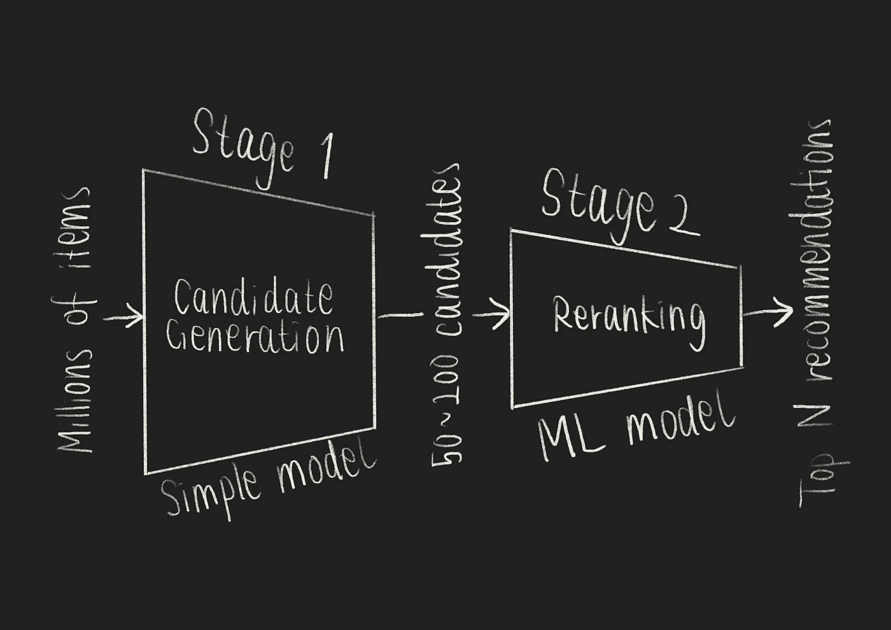
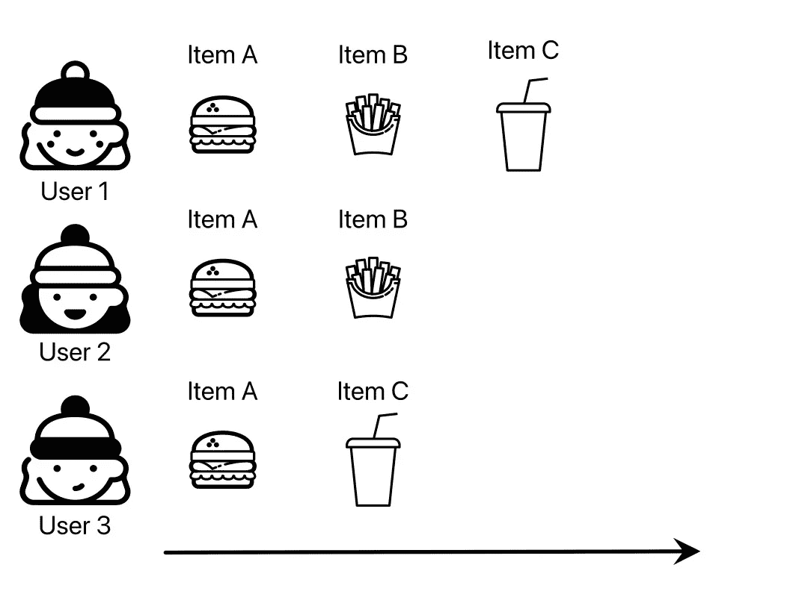
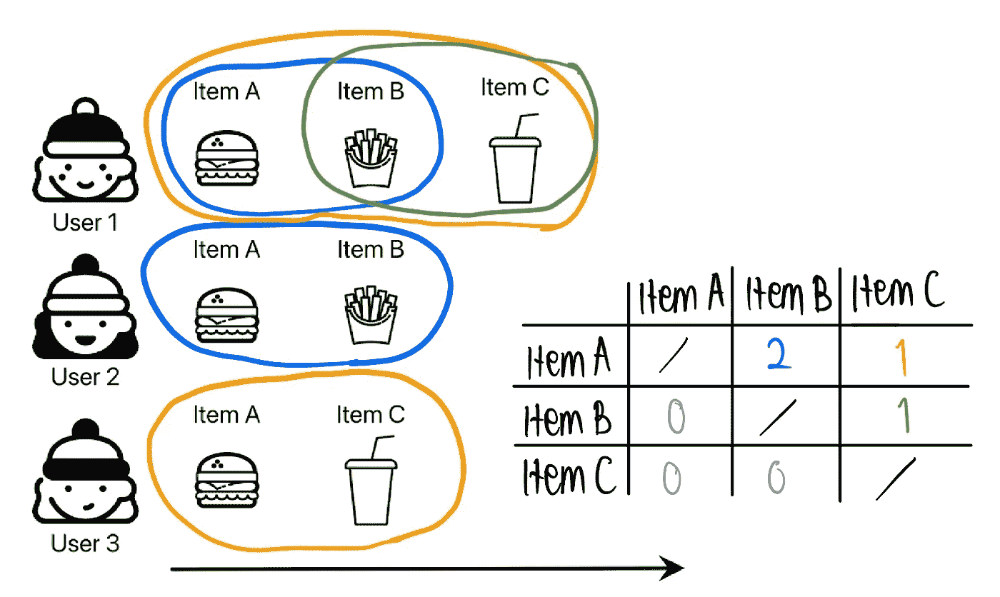
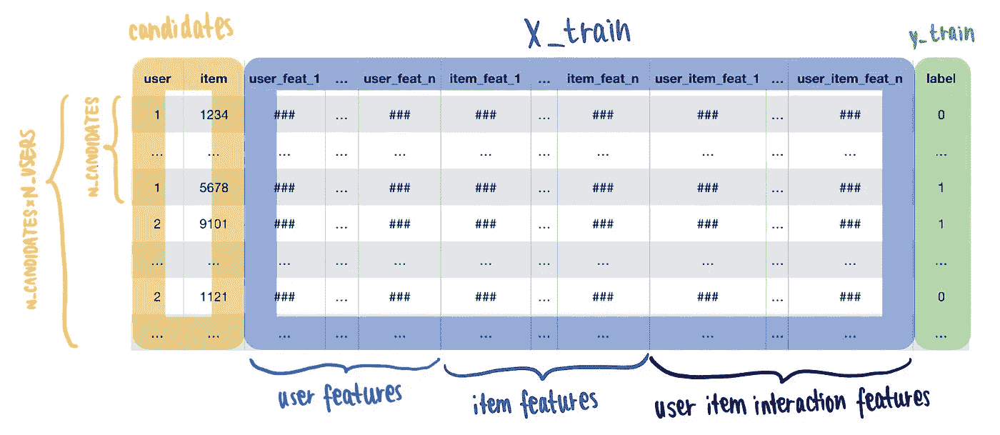

# 使用机器学习构建推荐系统

> 原文：[`towardsdatascience.com/building-a-recommender-system-using-machine-learning-2eefba9a692e`](https://towardsdatascience.com/building-a-recommender-system-using-machine-learning-2eefba9a692e)

## Kaggle 蓝图

## 在 Python 中使用共访矩阵和 GBDT 排名模型的“候选项重排序”方法

 [Leonie Monigatti](https://medium.com/@iamleonie?source=post_page-----2eefba9a692e--------------------------------)

·发表于[Towards Data Science](https://towardsdatascience.com/?source=post_page-----2eefba9a692e--------------------------------) ·阅读时长 6 分钟·2023 年 3 月 1 日

--


“一个绝佳的选择，女士！我们的汉堡非常适合配菜和饮料。我可以推荐一些选项吗？”（作者提供的图像）

欢迎来到新文章系列的第一版，称为“Kaggle 蓝图”，在这里我们将分析[Kaggle](https://www.kaggle.com/)比赛的顶级解决方案，以便提取可以应用于我们自己数据科学项目的经验教训。

本期内容将回顾[“OTTO — 多目标推荐系统”](https://www.kaggle.com/competitions/otto-recommender-system/)比赛中的技术和方法，该比赛于 2023 年 1 月底结束。

# 问题陈述：多目标推荐系统

[“OTTO — 多目标推荐系统”](https://www.kaggle.com/competitions/otto-recommender-system/)比赛的目标是构建**基于大量隐式用户数据的多目标推荐系统（RecSys）**。

具体来说，在电子商务的使用案例中，竞争者们处理了以下细节：

+   多目标：点击、购物车添加和订单

+   大型数据集：超过 2 亿个事件，涉及约 180 万项

+   隐式用户数据：用户会话中的先前事件

[## OTTO — 多目标推荐系统](https://www.kaggle.com/competitions/otto-recommender-system/?source=post_page-----2eefba9a692e--------------------------------)

### 基于真实世界电子商务会话构建推荐系统

[www.kaggle.com](https://www.kaggle.com/competitions/otto-recommender-system/?source=post_page-----2eefba9a692e--------------------------------)

# 如何处理大量项目的推荐系统

这次比赛的主要挑战之一是选择项目的数量众多。将所有可用的信息输入复杂模型需要大量计算资源。

因此，大多数竞争者遵循的通用基线是**两阶段**[**候选生成/重新排序技术**](https://www.kaggle.com/competitions/otto-recommender-system/discussion/364721)[3]：

1.  阶段：候选生成——这一步将每个用户的潜在推荐（候选项）数量从数百万减少到大约 50 到 200 个[2]。为了处理数据量，通常使用简单模型。

1.  阶段：重新排序——你可以在这一步使用更复杂的模型，例如机器学习（ML）模型。一旦你对减少后的候选项进行排名，你可以选择排名最高的项目作为推荐。



两阶段推荐候选生成/重新排序技术（图像来源于作者，灵感来自[3]）

# 第一阶段：使用共访矩阵生成候选项

两阶段方法的第一步是将潜在推荐（候选项）的数量从数百万减少到大约 50 到 200 个[2]。为了处理大量项目，第一阶段的模型应保持简单[5]。

你可以选择和结合不同的策略来减少项目数量[3]：

+   通过用户历史

+   通过流行度——这种策略也可以作为一个强有力的基线[5]

+   通过基于共访矩阵的共现

生成候选项的最直接方法是利用**用户历史**：如果用户查看过某个项目，他们很可能也会购买它。

然而，如果用户查看的项目数（例如五个项目）少于我们希望为每个用户生成的候选项数量（例如 50 到 200），我们可以通过项目流行度或共现来填充候选项列表[7]。由于基于流行度的选择较为直接，我们将在本节中重点关注基于共现的候选项生成。

**通过共现**生成的候选项可以通过**共访矩阵**进行处理：如果`user_1`购买了`item_a`，并且在不久后购买了`item_b`，我们会存储这些信息[6, 7]。



推荐系统的用户购买行为的最小示例（图像来源于作者）

1.  对于每个项目，计算在指定时间框架内每个其他项目的出现次数。



共访矩阵的最小示例（图像来源于作者）

2\. 对于每个项目，找到在该项目之后最常访问的 50 到 200 个项目。

如上图所示，共访矩阵不一定是对称的。例如，购买了汉堡的人也很可能会购买饮料——但相反的情况可能不成立。

你还可以根据接近度为共访矩阵分配权重。例如，同一会话中一起购买的项目可能比用户在不同购物会话中购买的项目有更高的权重。

共访矩阵类似于通过计数进行的**矩阵分解** [6]。矩阵分解是推荐系统的常用技术。具体来说，它是一种协同过滤方法，用于发现项目和用户之间的关系。

[](/recommendation-system-matrix-factorization-d61978660b4b?source=post_page-----2eefba9a692e--------------------------------) ## 推荐系统 — 矩阵分解

### 矩阵分解推荐系统的步骤

towardsdatascience.com

# 阶段 2：使用 GBDT 模型重新排序

第二步是**重新排序**。虽然你可以通过手工规则 [1] 达到良好的效果，但理论上使用 ML 模型应该更有效 [5]。

你可以使用不同的梯度提升决策树（GBDT）排名器，如 [XGBRanker](https://medium.com/predictly-on-tech/learning-to-rank-using-xgboost-83de0166229d) 或 [LGBMRanker](https://lightgbm.readthedocs.io/en/latest/pythonapi/lightgbm.LGBMRanker.html) [2, 3, 4]。

## 训练数据和特征工程的准备

GBDT 排名模型的训练数据应包含以下列类别 [2]：

+   **来自候选生成的用户和项目对** — 数据框的基础将是第一阶段生成的候选列表。对于每个用户，你应该得到 `N_CANDIDATES` 个项目，因此起点应该是形状为 `(N_USERS * N_CANDIDATES, 2)` 的数据框。

+   **用户特征** — 计数、聚合特征、比例特征等。

+   **项目特征** — 计数、聚合特征、比例特征等。

+   **用户-项目特征**（可选）— 你可以创建用户-项目互动特征，如‘点击的项目’

+   **标签** — 对于每个用户-项目对，合并标签（例如，‘购买’或‘未购买’）。

生成的训练数据框应如下所示。



用于训练推荐系统 GDBT 排名模型的训练数据结构（作者提供的图片）

## GBDT 排名模型

此步骤旨在训练 GBDT 排名模型以选择 `top_N` 推荐。

GBDT 排名器将接受三个输入：

+   `X_train`，`X_val`：包含 `FEATURES` 的训练和验证数据框

+   `y_train`，`y_val`：包含 `LABELS` 的训练和验证数据框

+   `group` ：注意 `FEATURES` **不包含** `user`，`item` 列 [2]。因此，模型需要知道在何种组内对项目进行排名：`group = [N_CANDIDATES] * (len(train_df) // N_CANDIDATES)`

以下是使用 [XGBRanker](https://medium.com/predictly-on-tech/learning-to-rank-using-xgboost-83de0166229d) [2] 的示例代码。

```py
import xgboost as xgb

dtrain = xgb.DMatrix(X_train,
                     y_train, 
                     group = group) 

# Define model
xgb_params = {'objective' : 'rank:pairwise'} 

# Train
model = xgb.train(xgb_params, 
                  dtrain = dtrain,
                  num_boost_round = 1000)
```

以下是带有[LGBMRanker](https://lightgbm.readthedocs.io/en/latest/pythonapi/lightgbm.LGBMRanker.html)的示例代码[4]：

```py
from lightgbm.sklearn import LGBMRanker

# Define model
ranker = LGBMRanker(
    objective="lambdarank",
    metric="ndcg",
    n_estimators=1000)

# Train
model = ranker.fit(X_train, 
                   y_train,
                   group = group)
```

GBDT 排名模型将对指定组内的项目进行排序。要检索`top_N`推荐项，您只需按用户对输出进行分组，并按项目的排名排序即可。

# 总结

从回顾 Kagglers 在[“OTTO——多目标推荐系统”](https://www.kaggle.com/competitions/otto-recommender-system/)比赛过程中创建的学习资源中，还可以学到更多的课程。对于这种类型的问题陈述，还有许多不同的解决方案。

在本文中，我们集中讨论了在许多竞争者中流行的一般方法：**通过协同访问矩阵进行候选生成，以减少潜在推荐项目的数量，然后进行 GBDT 重排序。**

# 享受这个故事了吗？

[*免费订阅*](https://medium.com/subscribe/@iamleonie) *以在我发布新故事时获得通知。*

[](https://medium.com/@iamleonie/subscribe?source=post_page-----2eefba9a692e--------------------------------) [## 当 Leonie Monigatti 发布新内容时，获取电子邮件通知。

### 当 Leonie Monigatti 发布新内容时，您将收到电子邮件通知。通过注册，您将创建一个 Medium 账户（如果您还没有的话）……

medium.com](https://medium.com/@iamleonie/subscribe?source=post_page-----2eefba9a692e--------------------------------)

*在* [*LinkedIn*](https://www.linkedin.com/in/804250ab/)、[*Twitter*](https://twitter.com/helloiamleonie)*和* [*Kaggle*](https://www.kaggle.com/iamleonie)*上找到我！*

# 参考文献

[1] Chris Deotte (2022). [“候选重排序模型——[LB 0.575]”](https://www.kaggle.com/code/cdeotte/candidate-rerank-model-lb-0-575)在 Kaggle 笔记本中。（访问日期：2023 年 2 月 26 日）

[2] Chris Deotte (2022). “[如何构建 GBT 排序模型](https://www.kaggle.com/competitions/otto-recommender-system/discussion/370210)”在 Kaggle 讨论中。（访问日期：2023 年 2 月 21 日）

[3] Ravi Shah (2022). “[大型数据集的推荐系统](https://www.kaggle.com/competitions/otto-recommender-system/discussion/364721)”在 Kaggle 讨论中。（访问日期：2023 年 2 月 21 日）

[4] Radek Osmulski (2022). [“[polars] 概念验证：LGBM Ranker”](https://www.kaggle.com/code/radek1/polars-proof-of-concept-lgbm-ranker)在 Kaggle 笔记本中。（访问日期：2023 年 2 月 26 日）

[5] Radek Osmulski (2022). [“在 Kaggle 上的 OTTO 比赛介绍（RecSys）”](https://youtu.be/gtPEX_eRAVo)在 YouTube 上。（访问日期：2023 年 2 月 21 日）

[6] Radek Osmulski (2022). [“协同访问矩阵究竟是什么？”](https://www.kaggle.com/competitions/otto-recommender-system/discussion/365358)在 Kaggle 讨论中。（访问日期：2023 年 2 月 21 日）

[7] Vladimir Slaykovskiy (2022). [“协同访问矩阵”](https://www.kaggle.com/code/vslaykovsky/co-visitation-matrix)在 Kaggle 笔记本中。（访问日期：2023 年 2 月 21 日）
