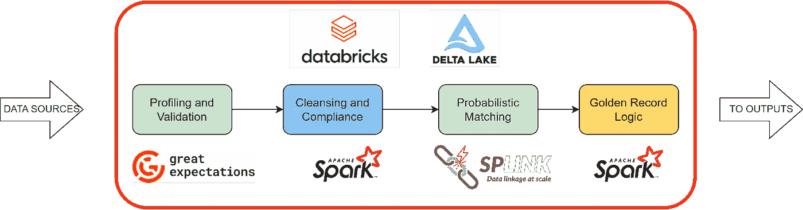
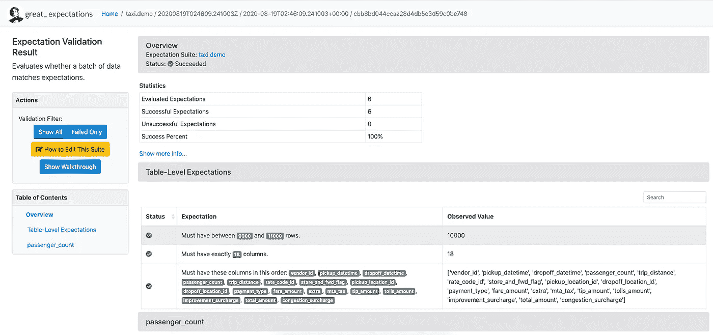
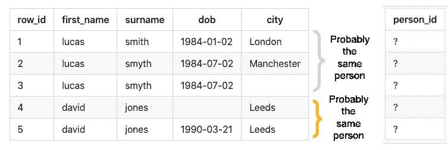
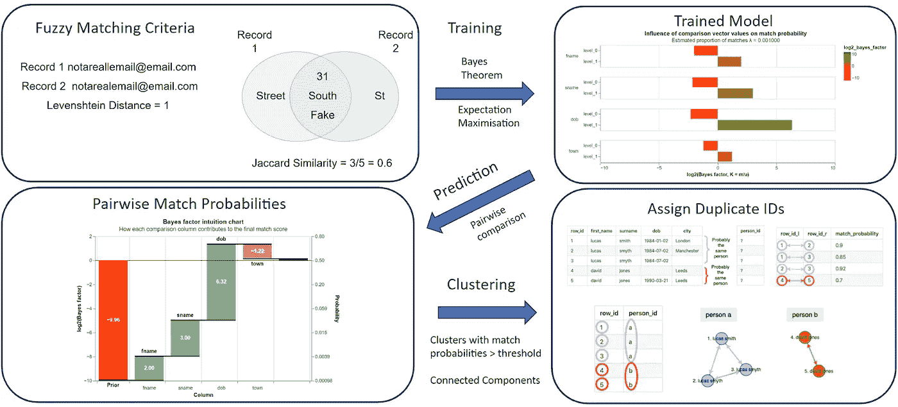
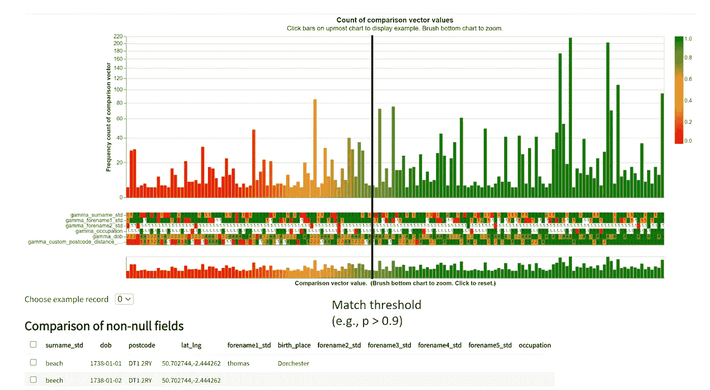
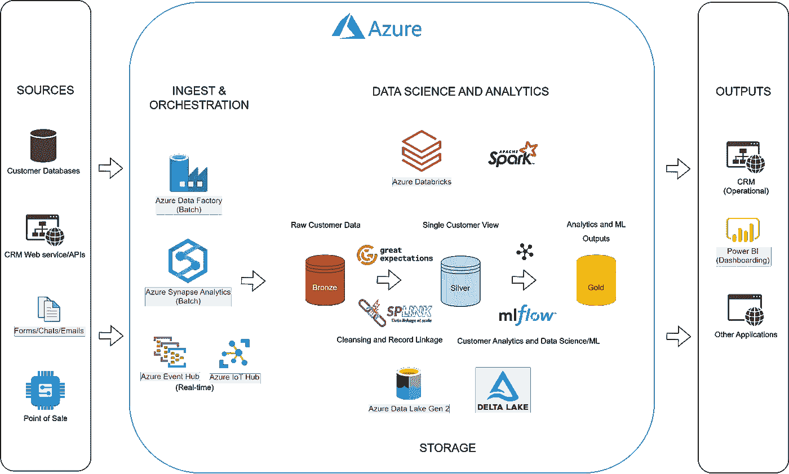

# 使用开源工具和 Databricks 构建单一客户视图

> 原文：[`towardsdatascience.com/building-a-single-customer-view-using-open-source-tools-and-databricks-ecc7d020ef4f?source=collection_archive---------1-----------------------#2023-11-06`](https://towardsdatascience.com/building-a-single-customer-view-using-open-source-tools-and-databricks-ecc7d020ef4f?source=collection_archive---------1-----------------------#2023-11-06)

## *一个可扩展的数据质量和记录链接工作流，使客户数据科学成为可能*

[](https://medium.com/@rjconstable1989?source=post_page-----ecc7d020ef4f--------------------------------)[](https://towardsdatascience.com/?source=post_page-----ecc7d020ef4f--------------------------------) [Robert Constable](https://medium.com/@rjconstable1989?source=post_page-----ecc7d020ef4f--------------------------------)

·

[关注](https://medium.com/m/signin?actionUrl=https%3A%2F%2Fmedium.com%2F_%2Fsubscribe%2Fuser%2Fccf6eef145fa&operation=register&redirect=https%3A%2F%2Ftowardsdatascience.com%2Fbuilding-a-single-customer-view-using-open-source-tools-and-databricks-ecc7d020ef4f&user=Robert+Constable&userId=ccf6eef145fa&source=post_page-ccf6eef145fa----ecc7d020ef4f---------------------post_header-----------) 发表在 [Towards Data Science](https://towardsdatascience.com/?source=post_page-----ecc7d020ef4f--------------------------------) ·11 分钟阅读·2023 年 11 月 6 日[](https://medium.com/m/signin?actionUrl=https%3A%2F%2Fmedium.com%2F_%2Fvote%2Ftowards-data-science%2Fecc7d020ef4f&operation=register&redirect=https%3A%2F%2Ftowardsdatascience.com%2Fbuilding-a-single-customer-view-using-open-source-tools-and-databricks-ecc7d020ef4f&user=Robert+Constable&userId=ccf6eef145fa&source=-----ecc7d020ef4f---------------------clap_footer-----------)

--

[](https://medium.com/m/signin?actionUrl=https%3A%2F%2Fmedium.com%2F_%2Fbookmark%2Fp%2Fecc7d020ef4f&operation=register&redirect=https%3A%2F%2Ftowardsdatascience.com%2Fbuilding-a-single-customer-view-using-open-source-tools-and-databricks-ecc7d020ef4f&source=-----ecc7d020ef4f---------------------bookmark_footer-----------)

# 介绍

单一客户视图是对客户与业务所有互动的全面数据表示。它将来自多个来源的数据，如购买记录、网站互动、社交媒体、电子邮件咨询、反馈和其他数据源，整合为每个独特客户的单一记录[1]。一旦实现单一客户视图，就能为精准营销、提高客户保留率和最大化客户生命周期价值提供许多机会[2]。然而，实现并维护单一客户视图可能会面临挑战，包括数据质量限制、多种第三方主数据管理（MDM）工具的许可成本，以及处理个人数据时的客户隐私和合规性考虑，这些都使得构建单一客户视图变得复杂。本文提供了一种构建单一客户视图的数据质量和记录链接管道的方法，考虑了这些挑战，并提供了使用基于 Spark 的云计算平台 Databricks 的低成本开源方法。

# 解决方案概述

下图总结了一种使用 Databricks 生成单一客户视图的开源方法。在一系列连接在工作流中的 Databricks 笔记本中，我们可以借助 Great Expectations 库实现数据分析和验证检查，解决任何数据质量问题，并确保在清洗和合规笔记本中遵守数据保护和保留政策，使用 Splink 库进行客户数据表之间或内部的概率记录链接，最终应用黄金记录逻辑并连接所有客户记录，以去重并链接不同的客户数据集，从而生成单一客户视图。



*Databricks 中开源数据质量和记录链接工作流的概述。图像作者提供*

所有转换都在使用 Pyspark/Spark SQL 编写的查询中实现，或利用任何开源组件的 Spark 后端，从而利用 Databricks 的并行计算能力来扩展各阶段所需的处理，以适应可能的大规模客户数据集。通过使用 Lakehouse 架构来存储所有中间表和最终输出，我们可以从对所有数据操作的审计日志中受益，如果需要遵守合规性要求，可以永久删除客户数据，同时保留用于分析目的的匿名信息，并享受 Delta 表格式的性能和可靠性[3]。数据从源系统（例如，Dynamics 365 或 Salesforce 等客户关系管理（CRM）工具）进入流程，并以单一客户视图的形式输出，准备用于分析或操作用例，例如客户画像仪表板、推荐引擎等机器学习应用，以及通过电子邮件、短信或邮寄的自动化营销和追加销售。

# 使用 Great Expectations 进行数据分析和验证

Great Expectations 是一个开源的 Python 库 [4]，它允许你以编程方式为数据管道创建自动化测试，确保数据的有效性、完整性以及一致的模式。用户可以为数据中的字段定义期望字典，然后将数据与这些期望进行测试。

```py
# contactid
custom_expectation_suite.add_expectation(
ExpectationConfiguration(
expectation_type = "expect_column_values_to_not_be_null", 
kwargs = {'column':'contactid'}, 
meta = {'reason':'contactid is the unique ID for D365 contacts, 
this should not be null'})
)
```

*使用 Great Expectations 定义期望的示例*

该库提供了多种现成的期望，如测试空值、唯一值和数值范围；如果标准集没有提供所需的期望，用户还可以创建自定义期望。Great Expectations 支持各种数据源，包括数据库、CSV 文件，以及 Pandas 或 Pyspark 数据框，并在使用 Databricks 时可以利用 Spark 后端。运行验证测试后，用户将获得一个基于网页的数据验证报告，报告中突出显示了哪些字段通过了期望套件，哪些字段未通过，并说明了原因，如下例所示。



*使用 Great Expectations 生成的数据验证报告* [`docs.greatexpectations.io/docs/`](https://docs.greatexpectations.io/docs/)

Great Expectations 还提供数据分析功能，使用户能够深入了解其数据集，例如总结统计信息（均值、中位数和标准差）、完整性和唯一性，并提供一套可视化工具，帮助用户探索数据并识别潜在问题。这些洞察可能会突出需要在期望套件中添加额外期望或向数据管理员发送警报的需求，如果客户数据的后续迭代超出了预期值。

在构建单一客户视图的背景下，Great Expectations 可以帮助你了解客户数据集的组成和质量，并在数据传递到管道的后续步骤或交给下游应用程序之前验证输出。Great Expectations 可以用来在第一次处理客户数据集时初步发现数据质量问题，并且在生产环境中可以与 CI/CD 工具集成，以便将数据集的单元测试作为部署管道的一部分。

# 清洗和合规性

清洗和合规阶段涉及解决分析和验证中突出的数据质量问题，并确保存储的客户数据符合数据保留的任何限制（例如 GDPR [5]）。在 Databricks 中，可以使用 Pyspark/Spark SQL 查询，通过选择、过滤或映射字段或值来提供所需的数据清洗操作。

客户数据集包含个人身份信息（姓名、电子邮件地址、电话号码和邮政地址），这些信息对于从多个来源链接客户数据至关重要。每个客户数据集还将包含与每个客户相关的属性，例如交易日志、偏好设置、指示会员资格/状态的标志和指示与他们沟通时间的时间戳。为了准备单一客户视图的数据，这些数据集可能需要汇总，以便将任何时间序列或事件日志数据集总结成每个实体的单行表，这些表随后可以在概率匹配阶段进行连接和/或去重/链接。

数据保留策略也可以在此阶段程序化实施，并且可以处理特定用户删除请求的代码。Delta Lake 提供了优化，使得数据湖中的点删除更加高效，使用数据跳过 [6]。如果个人身份信息对于客户数据的后续使用不是必要的，它可以在此阶段被永久匿名化，或者被伪匿名化/拆分为具有不同权限级别的敏感和非敏感表，从而限制对原始客户数据的访问 [3]。

```py
%sql
DELETE FROM data WHERE email = 'customer@exampledomain.com';
VACUUM data;
```

*Delta 表中客户数据的点删除示例*

# 使用 Splink 的概率记录匹配

客户数据集通常包含每个唯一客户的重复记录；客户可能手动输入他们的详细信息，导致拼写错误，随着时间的推移，客户可能更换地址或更改账户信息，造成多个记录中只有一个是有效且最新的，并且当客户在多个数据集中出现时，这些表之间显然会有多个记录需要进行链接。这个去重和记录链接的问题可以通过使用 Splink [7]来解决，Splink 是一个开源的概率记录匹配算法，基于 Spark 实现，由英国司法部团队创建，用于协助司法应用中的记录匹配。



*需要去重和链接的客户数据集示例* [`github.com/moj-analytical-services/splink`](https://github.com/moj-analytical-services/splink)

Splink 使用贝叶斯算法将多个字段中的模糊匹配分数组合成总体匹配概率，使用户能够使用这些匹配概率阈值标记客户记录在表格之间的链接或表格内给定个体的重复记录。用户可以定义一套需要计算的模糊匹配分数，例如 Jaccard 相似性和 Levenshtein 距离，应用于各种个人数据字段，如姓名、电子邮件、电话号码和地址，以及阻断规则，这些规则通过将模糊匹配比较限制在其他字段上有精确匹配的记录，从而降低匹配过程的计算复杂性。使用期望最大化训练概率记录链接模型，并用来生成预测阻断规则中每对比较的匹配概率。此预测阶段的输出表示一个图数据结构，其中所有记录的配对比较作为节点，用边连接，边表示它们的配对匹配概率，这个图可以通过连接组件算法被解析成匹配概率大于用户定义阈值的高度连接相似记录的簇。



*典型 Splink 去重工作流概述。* [`github.com/moj-analytical-services/splink`](https://github.com/moj-analytical-services/splink) *经作者许可编辑。*

尽管 Splink 需要用户做出大量决策以成功进行记录匹配，尤其是在选择接受或拒绝跨匹配概率范围的匹配的置信水平时，但作为一个开源项目，Splink 不需要商业记录匹配工具所需的许可费用，只要选择合适的匹配规则和阻断规则，并适当设置匹配概率阈值，它就能很好地工作。为了评估 Splink 提供的链接质量，数据管理员理想情况下应该手动验证一组随机样本的匹配质量，以建立对输出结果的信心，并根据数据最终应用的关键性来权衡假阳性和假阴性率。



*通过检查不同匹配概率下的随机样本对的匹配准确性。* [`github.com/moj-analytical-services/splink`](https://github.com/moj-analytical-services/splink) *经作者许可编辑。*

# 黄金记录逻辑

一旦识别出重复记录或表之间的关联记录，构建单一客户视图的最后阶段是实施黄金记录逻辑，将每个唯一客户的所有记录统一为一行，并定义一组字段以包含所有相关的客户数据用于后续使用[8]。决定哪些字段和哪些客户信息副本作为黄金记录继续使用，将取决于数据的使用方式、记录实践的知识和相关性标准。在下面的示例中，在 Splink 中去重的客户数据集上应用了自定义的黄金记录逻辑（在此处，唯一客户已分配了唯一的“cluster_id”），选择每个客户的最新和最完整的重复记录。其他应用可能会看到多个记录和字段，来自多个表，合并成一个复合记录。此外，可能会在相同的数据上应用多个黄金记录定义，并用于不同的目的（例如，与非会员相比，会员可能会应用不同的黄金记录逻辑）。通常，给定的营销用例会需要特定的客户数据子集，并且可能从同一数据集中派生出多个营销用例；对于这些营销用例中的每一个，可以在此阶段实施不同的标志，以便在后续选择时方便使用。

```py
# count nulls
df_nulls_counted = df.withColumn('numNulls', sum(df[col].isNull().cast('int') for col in df.columns)*-1)

# flag most complete
df_most_complete = df_nulls_counted.withColumn("row_number",f.row_number()\
.over(Window.partitionBy(df_nulls_counted.cluster_id)\
.orderBy(df_nulls_counted.numNulls.desc()))).cache()\
.withColumn('most_complete', f.when(f.col("row_number")==1, 1).otherwise(0)).drop("row_number")

# flag most recent
df_most_complete_most_recent = df_most_complete.withColumn("row_number",f.row_number()\
.over(Window.partitionBy(df_most_complete.cluster_id)\
.orderBy(df_most_complete.createdon_timestamp.desc()))).cache()\
.withColumn('most_recent', f.when(f.col("row_number")==1, 1).otherwise(0)).drop("row_number")

# order by number of nulls
df_golden = df_most_complete_most_recent.withColumn("row_number",f.row_number()\
.over(Window.partitionBy(df_most_complete_most_recent.cluster_id)\
.orderBy(*[f.desc(c) for c in ["numNulls","createdon_timestamp"]]))).cache()\
.withColumn('golden_record', f.when(f.col("row_number")==1, 1).otherwise(0)).drop("row_number")

# add splink duplicate flag
df_golden = df_golden.select('*', f.count('cluster_id')\
.over(Window.partitionBy('cluster_id')).alias('dupeCount'))\
.withColumn('splink_duplicate', f.when(f.col('dupeCount') > 1, 1).otherwise(0))
```

*使用 Pyspark 窗口函数和二进制标志实现的示例黄金记录逻辑*

# 集成与应用案例

如下所示的 Azure 架构可以用于单一客户视图的云部署，作为客户分析和数据科学用例的平台 [9]。使用像 Azure 这样的云平台，可以以具有成本效益的方式进行扩展，同时简化与存储和使用客户数据相关的数据保护和合规方面。Azure 还提供了一套 ETL 和数据科学组件来实施解决方案。各种客户数据源，如 CRM 和销售点系统，可以通过 Azure 中的编排工具，如 Synapse Analytics 和 Data Factory 进行批量加载，Event Hubs 和 Delta Live Tables 用于流数据源，将数据存储在数据湖存储账户中。使用 Databricks lakehouse 架构，使得将多种客户数据类型合并到一个共同的存储账户中变得更加容易，并根据奖牌模式结构化后续转换，包括一个原始铜区、一个具有定义模式的银色单一客户视图区和一个用于任何分析视图或数据科学输出的金色区域，这些区域可以进行维度建模，以便于下游用例，如 CRM 系统中的数据操作用于营销活动、客户分析仪表板帮助你定量理解客户基础，以及基于客户数据构建的其他应用程序，如流失模型或推荐引擎。



*Azure 上专注于单一客户视图的分析和数据科学平台的云架构。* [*https://learn.microsoft.com/en-us/azure/architecture/solution-ideas/articles/azure-databricks-modern-analytics-architecture*](https://learn.microsoft.com/en-us/azure/architecture/solution-ideas/articles/azure-databricks-modern-analytics-architecture) *经作者许可编辑。*

通过在云中存储和处理客户数据，你将部分客户数据安全的责任委托给云服务提供商（如微软），并可以在可能的情况下使用 Azure 环境的私有网络和更高的加密标准，以确保客户数据的安全。通过配置访问控制，可以限制对客户数据的访问，因此，虽然企业内部的广泛受众可以查看匿名化或聚合的客户数据，但原始客户数据的访问可以限制在需要用于营销目的或解决方案维护的业务人员中，从而最大限度地减少泄漏风险。

一旦整理好，单一客户视图就会开启许多数据科学应用的门路，比如按人口统计进行客户画像分析、客户生命周期价值分析或近期-频率-货币价值分析、市场篮子分析（购买模式和共同购买商品组的倾向分析），以及用于流失预测的 ML 建模，从而进行及时的电子邮件干预，如折扣和优惠，以提高客户保留率和推荐引擎，匹配客户和他们在客户生命周期中的特定时间点最有可能购买的产品。单一客户视图的其他分析应用包括汇总客户数据的仪表板，以理解购买趋势和季节性，以及对客户反馈的文本分析，以了解业务可以改进服务的领域；从 CRM 系统的操作角度来看，单一客户视图也是非常有用的，因为它将提高营销活动和其他干预措施的效率，特别是在联系客户的成本较高的情况下，如邮寄营销或冷拨电话/SMS 消息，通过减少对重复客户或过时地址/电话号码的联系。

# 结论

+   使用开源工具、Databricks 和其他 Azure 组件，可以建立一种具有成本效益且可扩展的单一客户视图，并以安全且合规的方式将其部署到云端。

+   提议的解决方案是高代码的，需要领域专业知识，并且涉及数据管理员在清洗和处理不同客户数据集时的决策。

+   然而，这种解决方案相较于商业产品也有许多优势，如较低的许可费用和运行成本、解决方案的可定制性，以及与其他云组件的便捷集成，以部署分析和数据科学用例。

+   单一客户视图开启了多种具有影响力的数据科学和分析用例的大门，这些用例可以帮助企业更有效地进行市场营销，理解客户并提供更好的服务。

感谢阅读，如果你有兴趣讨论或进一步阅读，请联系我或查看下面的一些参考资料。

[`www.linkedin.com/in/robert-constable-38b80b151/`](https://www.linkedin.com/in/robert-constable-38b80b151/)

# 参考文献

[1] [`www.informatica.com/content/dam/informatica-com/en/collateral/white-paper/improve-service-with-single-view-of-customer_white-paper_2446.pdf`](https://www.informatica.com/content/dam/informatica-com/en/collateral/white-paper/improve-service-with-single-view-of-customer_white-paper_2446.pdf)

[2] [`www.experian.co.uk/assets/about-us/white-papers/single-customer-view-whitepaper.pdf`](https://www.experian.co.uk/assets/about-us/white-papers/single-customer-view-whitepaper.pdf)

[3] [`www.databricks.com/blog/2022/03/23/implementing-the-gdpr-right-to-be-forgotten-in-delta-lake.html`](https://www.databricks.com/blog/2022/03/23/implementing-the-gdpr-right-to-be-forgotten-in-delta-lake.html)

[4] [`docs.greatexpectations.io/docs/`](https://docs.greatexpectations.io/docs/)

[5] [`gdpr-info.eu/`](https://gdpr-info.eu/)

[6] [`docs.databricks.com/en/security/privacy/gdpr-delta.html`](https://docs.databricks.com/en/security/privacy/gdpr-delta.html)

[7] [`github.com/moj-analytical-services/splink`](https://github.com/moj-analytical-services/splink)

[8] [`www.informatica.com/blogs/golden-record.html`](https://www.informatica.com/blogs/golden-record.html)

[9] [`learn.microsoft.com/en-us/azure/architecture/solution-ideas/articles/azure-databricks-modern-analytics-architecture`](https://learn.microsoft.com/en-us/azure/architecture/solution-ideas/articles/azure-databricks-modern-analytics-architecture)
