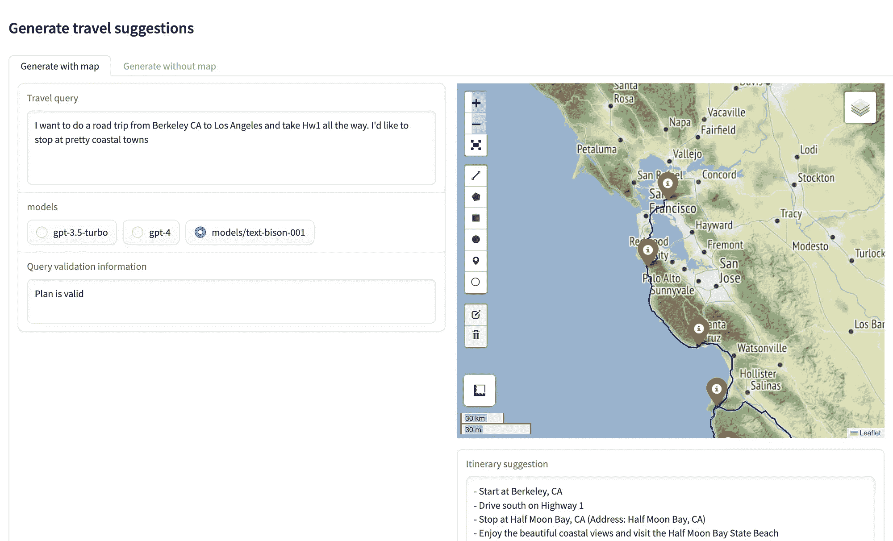

# 使用 LangChain、Google Maps API 和 Gradio 构建智能旅行行程建议器（第一部分）

> 原文：[`towardsdatascience.com/building-a-smart-travel-itinerary-suggester-with-langchain-google-maps-api-and-gradio-part-1-4175ff480b74?source=collection_archive---------1-----------------------#2023-09-26`](https://towardsdatascience.com/building-a-smart-travel-itinerary-suggester-with-langchain-google-maps-api-and-gradio-part-1-4175ff480b74?source=collection_archive---------1-----------------------#2023-09-26)

## 了解如何构建一个可能激发你下一次公路旅行灵感的应用程序

[](https://medium.com/@rmartinshort?source=post_page-----4175ff480b74--------------------------------)[](https://towardsdatascience.com/?source=post_page-----4175ff480b74--------------------------------) [Robert Martin-Short](https://medium.com/@rmartinshort?source=post_page-----4175ff480b74--------------------------------)

·

[关注](https://medium.com/m/signin?actionUrl=https%3A%2F%2Fmedium.com%2F_%2Fsubscribe%2Fuser%2F83d38eb39498&operation=register&redirect=https%3A%2F%2Ftowardsdatascience.com%2Fbuilding-a-smart-travel-itinerary-suggester-with-langchain-google-maps-api-and-gradio-part-1-4175ff480b74&user=Robert+Martin-Short&userId=83d38eb39498&source=post_page-83d38eb39498----4175ff480b74---------------------post_header-----------) 发表在 [Towards Data Science](https://towardsdatascience.com/?source=post_page-----4175ff480b74--------------------------------) ·13 分钟阅读·2023 年 9 月 26 日[](https://medium.com/m/signin?actionUrl=https%3A%2F%2Fmedium.com%2F_%2Fvote%2Ftowards-data-science%2F4175ff480b74&operation=register&redirect=https%3A%2F%2Ftowardsdatascience.com%2Fbuilding-a-smart-travel-itinerary-suggester-with-langchain-google-maps-api-and-gradio-part-1-4175ff480b74&user=Robert+Martin-Short&userId=83d38eb39498&source=-----4175ff480b74---------------------clap_footer-----------)

--

[](https://medium.com/m/signin?actionUrl=https%3A%2F%2Fmedium.com%2F_%2Fbookmark%2Fp%2F4175ff480b74&operation=register&redirect=https%3A%2F%2Ftowardsdatascience.com%2Fbuilding-a-smart-travel-itinerary-suggester-with-langchain-google-maps-api-and-gradio-part-1-4175ff480b74&source=-----4175ff480b74---------------------bookmark_footer-----------)

> **本文是一个三部分系列的第一部分，我们将使用 OpenAI 和 Google APIs 构建一个旅行行程建议器应用程序，并在 Gradio 生成的简单 UI 中展示它。在这一部分，我们首先讨论了这个项目的提示工程。只想查看代码？请点击** [**这里**](https://github.com/rmartinshort/travel_mapper)**.**

# **1\. 动机**

自 2022 年底 ChatGPT 发布以来，对大型语言模型（LLMs）及其在面向消费者的产品（如聊天机器人和搜索引擎）中的应用兴趣激增。不足一年，我们已经可以访问大量来自[Hugging Face](https://huggingface.co/models)的开源 LLM、[Lamini](https://www.lamini.ai/)等模型托管服务以及 OpenAI 和 PaLM 等付费 API。看到这一领域的发展如此迅速，新的工具和开发范式似乎每几周就会出现，既令人兴奋又有些不知所措。

在这里，我们将仅仅采样这些工具中的一小部分，构建一个有用的应用程序，帮助我们进行旅行规划。在计划度假时，得到曾经去过那里的人建议往往很不错，看到这些建议在地图上展示更好。在没有这种建议的情况下，我有时会浏览 Google 地图，在我想要访问的一般区域内随意选择一些看起来有趣的地方。也许这个过程很有趣，但它效率低且可能会遗漏一些东西。拥有一个能够根据几个高层次偏好提供大量建议的工具岂不是很好吗？

这正是我们尝试构建的系统：一个能够根据一些高层次的偏好提供旅行行程建议的系统，例如*“我有 3 天时间探索旧金山，并且喜欢艺术博物馆”*。Google 搜索的生成 AI 功能和 ChatGPT 已经可以为类似的查询提供创造性的结果，但我们希望更进一步，生成一个包含旅行时间和美观地图的实际行程，帮助用户定位。



这就是我们将构建的系统：一个生成旅行建议的系统，配有基本地图，显示由 LLM 提供的路线和中途点。

目标更多是熟悉构建此类服务所需的工具，而不是实际部署应用程序，但在此过程中我们将了解一些关于提示工程、与 LangChain 协调的 LLM、使用 Google Maps API 提取方向以及使用 [leafmap](https://leafmap.org/) 和 [gradio](https://www.gradio.app/) 显示结果的知识。令人惊叹的是，这些工具能够如此快速地为此类系统构建一个 POC，但真正的挑战总是出现在评估和边缘情况管理上。我们将构建的工具远非完美，如果有人有兴趣进一步帮助我开发，那将是非常棒的。

# 2\. 提示策略

该项目将使用 OpenAI 和 Google PaLM API。你可以通过在[这里](https://platform.openai.com/account/members)和[这里](https://makersuite.google.com/app/home)注册账户来获取 API 密钥。撰写时，Google API 的通用可用性有限，并且有等待名单，但获取访问权限通常只需几天时间。

使用 `[dotenv](https://pypi.org/project/python-dotenv/)` 是避免将 API 密钥复制粘贴到开发环境中的一种简单方法。在创建了一个包含以下行的 .env 文件之后

```py
OPENAI_API_KEY = {your open ai key}
GOOGLE_PALM_API_KEY = {your google palm api key}
```

我们可以使用这个函数来加载变量，以便 `LangChain` 等下游使用。

```py
from dotenv import load_dotenv
from pathlib import Path

def load_secets():
    load_dotenv()
    env_path = Path(".") / ".env"
    load_dotenv(dotenv_path=env_path)

    open_ai_key = os.getenv("OPENAI_API_KEY")
    google_palm_key = os.getenv("GOOGLE_PALM_API_KEY")

    return {
        "OPENAI_API_KEY": open_ai_key,
        "GOOGLE_PALM_API_KEY": google_palm_key,
    }
```

那么，我们应该如何设计旅行代理服务的提示呢？用户将可以输入他们想要的任何文本，因此我们首先要能够确定他们的查询是否有效。我们肯定要标记任何包含有害内容的查询，例如具有恶意意图的行程请求。

我们还想过滤掉与旅行无关的问题——毫无疑问，大语言模型可以回答这些问题，但这些问题超出了本项目的范围。最后，我们还希望识别出不合理的请求，例如 *“我想飞到月球”* 或 *“我想进行从纽约到东京的三天公路旅行”*。对于这样的不合理请求，如果模型能够解释为何不合理并提出有帮助的修改建议，那将是很好的。

一旦请求被验证，我们可以继续提供建议的行程，理想情况下应该包含路线点的具体地址，以便可以将其发送到诸如 Google Maps 的映射或导航 API。

行程应该是人类可读的，包含足够的细节，使用户能够将其作为独立建议使用。像 ChatGPT 这样的庞大、经过指令调优的大语言模型似乎在提供这样的回应方面表现出色，但我们需要确保路线点地址以一致的方式提取。

因此，这里有三个不同的阶段：

1.  验证查询

1.  生成行程

1.  以 Google Maps API 可以理解的格式提取路线点

可能设计一个能够一次完成所有三项工作的提示，但为了便于调试，我们将其拆分为三个大语言模型调用，每个部分一个。

幸运的是，LangChain 的 `[PydanticOutputParser](https://python.langchain.com/docs/modules/model_io/output_parsers/pydantic)` 确实可以提供帮助，通过提供一组预设的提示，鼓励大语言模型以符合输出模式的方式格式化其回应。

# **3\. 验证提示**

让我们看看验证提示，我们可以将其包装在一个模板类中，以便更容易包含和迭代不同的版本。

```py
from langchain.prompts.chat import (
    ChatPromptTemplate,
    SystemMessagePromptTemplate,
    HumanMessagePromptTemplate,
)
from langchain.output_parsers import PydanticOutputParser
from pydantic import BaseModel, Field

class Validation(BaseModel):
    plan_is_valid: str = Field(
        description="This field is 'yes' if the plan is feasible, 'no' otherwise"
    )
    updated_request: str = Field(description="Your update to the plan")

class ValidationTemplate(object):
    def __init__(self):
        self.system_template = """
      You are a travel agent who helps users make exciting travel plans.

      The user's request will be denoted by four hashtags. Determine if the user's
      request is reasonable and achievable within the constraints they set.

      A valid request should contain the following:
      - A start and end location
      - A trip duration that is reasonable given the start and end location
      - Some other details, like the user's interests and/or preferred mode of transport

      Any request that contains potentially harmful activities is not valid, regardless of what
      other details are provided.

      If the request is not valid, set
      plan_is_valid = 0 and use your travel expertise to update the request to make it valid,
      keeping your revised request shorter than 100 words.

      If the request seems reasonable, then set plan_is_valid = 1 and
      don't revise the request.

      {format_instructions}
    """

        self.human_template = """
      ####{query}####
    """

        self.parser = PydanticOutputParser(pydantic_object=Validation)

        self.system_message_prompt = SystemMessagePromptTemplate.from_template(
            self.system_template,
            partial_variables={
                "format_instructions": self.parser.get_format_instructions()
            },
        )
        self.human_message_prompt = HumanMessagePromptTemplate.from_template(
            self.human_template, input_variables=["query"]
        )

        self.chat_prompt = ChatPromptTemplate.from_messages(
            [self.system_message_prompt, self.human_message_prompt]
        )
```

我们的 `Validation` 类包含查询的输出模式定义，这将是一个包含两个键 `plan_is_valid` 和 `updated_request` 的 JSON 对象。在 `ValidationTemplate` 中，我们使用 LangChain 的有用模板类来构造提示，并创建一个带有 `PydanticOutputParser` 的解析器对象。这将 `Pydantic` 代码转换为可以与查询一起传递给 LLM 的一组指令。然后，我们可以在系统模板中引用这些格式指令。每次调用 API 时，我们希望 `system_message_prompt` 和 `human_message_prompt` 都发送给 LLM，这就是为什么我们将它们打包在 `chat_prompt` 中。

由于这实际上并不是一个聊天机器人应用程序（虽然可以将其制作成一个！），我们可以将系统和人工模板放在同一个字符串中，以获得相同的响应。

现在，我们可以创建一个使用 LangChain 调用 LLM API 的 `Agent` 类。这里我们使用 `ChatOpenAI`，但如果你更喜欢，也可以用 `GooglePalm` 替代。

请注意，我们这里还使用了 Langchain 的 `LLMChain` 和 `SequentialChain`，尽管我们只是进行了一次 LLM 调用。这可能有些过度，但如果未来我们想添加另一个调用（例如，在验证链运行之前调用 [OpenAI moderation API](https://platform.openai.com/docs/guides/moderation/overview?lang=python)），这可能会有帮助。

```py
import openai
import logging
import time
# for Palm
from langchain.llms import GooglePalm
# for OpenAI
from langchain.chat_models import ChatOpenAI
from langchain.chains import LLMChain, SequentialChain

logging.basicConfig(level=logging.INFO)

class Agent(object):
    def __init__(
        self,
        open_ai_api_key,
        model="gpt-3.5-turbo",
        temperature=0,
        debug=True,
    ):
        self.logger = logging.getLogger(__name__)
        self.logger.setLevel(logging.INFO)
        self._openai_key = open_ai_api_key

        self.chat_model = ChatOpenAI(model=model, temperature=temperature, openai_api_key=self._openai_key)
        self.validation_prompt = ValidationTemplate()
        self.validation_chain = self._set_up_validation_chain(debug)

    def _set_up_validation_chain(self, debug=True):

        # make validation agent chain
        validation_agent = LLMChain(
            llm=self.chat_model,
            prompt=self.validation_prompt.chat_prompt,
            output_parser=self.validation_prompt.parser,
            output_key="validation_output",
            verbose=debug,
        )

        # add to sequential chain 
        overall_chain = SequentialChain(
            chains=[validation_agent],
            input_variables=["query", "format_instructions"],
            output_variables=["validation_output"],
            verbose=debug,
        )

        return overall_chain

    def validate_travel(self, query):
        self.logger.info("Validating query")
        t1 = time.time()
        self.logger.info(
            "Calling validation (model is {}) on user input".format(
                self.chat_model.model_name
            )
        )
        validation_result = self.validation_chain(
            {
                "query": query,
                "format_instructions": self.validation_prompt.parser.get_format_instructions(),
            }
        )

        validation_test = validation_result["validation_output"].dict()
        t2 = time.time()
        self.logger.info("Time to validate request: {}".format(round(t2 - t1, 2)))

        return validation_test
```

要运行示例，我们可以尝试以下代码。设置 `debug=True` 将激活 LangChain 的调试模式，该模式会打印查询文本在通过各种 LangChain 类时的进展情况。

```py
secrets = load_secets()
travel_agent = Agent(open_ai_api_key=secrets[OPENAI_API_KEY],debug=True)

query = """
        I want to do a 5 day roadtrip from Cape Town to Pretoria in South Africa.
        I want to visit remote locations with mountain views
        """

travel_agent.validate_travel(query)
```

这个查询似乎合理，因此我们得到如下结果

```py
INFO:__main__:Validating query
INFO:__main__:Calling validation (model is gpt-3.5-turbo) on user input
INFO:__main__:Time to validate request: 1.08
{'plan_is_valid': 'yes', 'updated_request': ''}
```

现在我们通过将查询更改为不那么合理的内容来进行测试，例如

```py
query = """
        I want to walk from Cape Town to Pretoria in South Africa.
        I want to visit remote locations with mountain views
        """
```

响应时间较长，因为 ChatGPT 正在尝试提供有关查询为何无效的解释，因此生成了更多的标记。

```py
INFO:__main__:Validating query
INFO:__main__:Calling validation (model is gpt-3.5-turbo) on user input
INFO:__main__:Time to validate request: 4.12
{'plan_is_valid': 'no',
 'updated_request': 'Walking from Cape Town to Pretoria in South Africa is not ...' a
```

# 4. 行程提示

如果查询有效，它可以传递到下一个阶段，即行程提示。在这里，我们希望模型返回详细的建议旅行计划，形式应为包含途经地址和有关每个地点活动建议的项目符号列表。这实际上是项目的主要“生成”部分，有很多方法可以设计查询以获得良好的结果。我们的 `ItineraryTemplate` 看起来像这样

```py
class ItineraryTemplate(object):
    def __init__(self):
        self.system_template = """
      You are a travel agent who helps users make exciting travel plans.

      The user's request will be denoted by four hashtags. Convert the
      user's request into a detailed itinerary describing the places
      they should visit and the things they should do.

      Try to include the specific address of each location.

      Remember to take the user's preferences and timeframe into account,
      and give them an itinerary that would be fun and doable given their constraints.

      Return the itinerary as a bulleted list with clear start and end locations.
      Be sure to mention the type of transit for the trip.
      If specific start and end locations are not given, choose ones that you think are suitable and give specific addresses.
      Your output must be the list and nothing else.
    """

        self.human_template = """
      ####{query}####
    """

        self.system_message_prompt = SystemMessagePromptTemplate.from_template(
            self.system_template,
        )
        self.human_message_prompt = HumanMessagePromptTemplate.from_template(
            self.human_template, input_variables=["query"]
        )

        self.chat_prompt = ChatPromptTemplate.from_messages(
            [self.system_message_prompt, self.human_message_prompt]
        )
```

请注意，这里不需要 `Pydantic` 解析器，因为我们希望输出是一个字符串，而不是 JSON 对象。

要使用这个，我们可以向 `Agent` 类添加一个新的 LLMChain，如下所示

```py
 travel_agent = LLMChain(
            llm=self.chat_model,
            prompt=self.itinerary_prompt.chat_prompt,
            verbose=debug,
            output_key="agent_suggestion",
        )
```

我们在实例化 `chat_model` 时没有设置 `max_tokens` 参数，这允许模型决定其输出的长度。特别是对于 GPT4，这可能使响应时间相当长（有时超过 30 秒）。有趣的是，PaLM 的响应时间明显较短。

# **5\. 航点提取提示**

使用行程提示可能会给我们一个很好的航点列表，可能是这样的。

```py
- Day 1:
  - Start in Berkeley, CA
  - Drive to Redwood National and State Parks, CA (1111 Second St, Crescent City, CA 95531)
  - Explore the beautiful redwood forests and enjoy nature
  - Drive to Eureka, CA (531 2nd St, Eureka, CA 95501)
  - Enjoy the local cuisine and explore the charming city
  - Overnight in Eureka, CA

- Day 2:
  - Start in Eureka, CA
  - Drive to Crater Lake National Park, OR (Crater Lake National Park, OR 97604)
  - Marvel at the stunning blue lake and hike the scenic trails
  - Drive to Bend, OR (Bend, OR 97701)
  - Indulge in the local food scene and explore the vibrant city
  - Overnight in Bend, OR

- Day 3:
  - Start in Bend, OR
  - Drive to Mount Rainier National Park, WA (55210 238th Ave E, Ashford, WA 98304)
  - Enjoy the breathtaking views of the mountain and hike the trails
  - Drive to Tacoma, WA (Tacoma, WA 98402)
  - Sample the delicious food options and explore the city's attractions
  - Overnight in Tacoma, WA

- Day 4:
  - Start in Tacoma, WA
  - Drive to Olympic National Park, WA (3002 Mount Angeles Rd, Port Angeles, WA 98362)
  - Explore the diverse ecosystems of the park and take in the natural beauty
  - Drive to Seattle, WA (Seattle, WA 98101)
  - Experience the vibrant food scene and visit popular attractions
  - Overnight in Seattle, WA

- Day 5:
  - Start in Seattle, WA
  - Explore more of the city's attractions and enjoy the local cuisine
  - End the trip in Seattle, WA
```

现在我们需要提取航点的地址，以便可以进行下一步操作，即将它们绘制在地图上，并调用 Google Maps 方向 API 以获取它们之间的路线。

为此，我们将进行另一次 LLM 调用，并再次使用`PydanticOutputParser`以确保我们的输出格式正确。为了理解这里的格式，简要考虑一下我们在项目的下一阶段（第二部分中介绍）要做的事情是有用的。我们将调用[Google Maps Python API](https://github.com/googlemaps/google-maps-services-python)，其形式如下。

```py
import googlemaps

gmaps = googlemaps.Client(key=google_maps_api_key)

directions_result = gmaps.directions(
            start,
            end,
            waypoints=waypoints,
            mode=transit_type,
            units="metric",
            optimize_waypoints=True,
            traffic_model="best_guess",
            departure_time=start_time,
)
```

其中，start 和 end 是地址字符串，waypoints 是要访问的中间地址列表。

我们请求的航点提取提示的模式因此如下所示。

```py
class Trip(BaseModel):
    start: str = Field(description="start location of trip")
    end: str = Field(description="end location of trip")
    waypoints: List[str] = Field(description="list of waypoints")
    transit: str = Field(description="mode of transportation")
```

这将使我们能够将 LLM 调用的输出插入到方向调用中。

对于这个提示，我发现添加一个一次性示例真的有助于模型符合期望的输出。对较小的开源 LLM 进行微调以使用这些 ChatGPT/PaLM 的结果提取航点列表可能是一个有趣的衍生项目。

```py
class MappingTemplate(object):
    def __init__(self):
        self.system_template = """
      You an agent who converts detailed travel plans into a simple list of locations.

      The itinerary will be denoted by four hashtags. Convert it into
      list of places that they should visit. Try to include the specific address of each location.

      Your output should always contain the start and end point of the trip, and may also include a list
      of waypoints. It should also include a mode of transit. The number of waypoints cannot exceed 20.
      If you can't infer the mode of transit, make a best guess given the trip location.

      For example:

      ####
      Itinerary for a 2-day driving trip within London:
      - Day 1:
        - Start at Buckingham Palace (The Mall, London SW1A 1AA)
        - Visit the Tower of London (Tower Hill, London EC3N 4AB)
        - Explore the British Museum (Great Russell St, Bloomsbury, London WC1B 3DG)
        - Enjoy shopping at Oxford Street (Oxford St, London W1C 1JN)
        - End the day at Covent Garden (Covent Garden, London WC2E 8RF)
      - Day 2:
        - Start at Westminster Abbey (20 Deans Yd, Westminster, London SW1P 3PA)
        - Visit the Churchill War Rooms (Clive Steps, King Charles St, London SW1A 2AQ)
        - Explore the Natural History Museum (Cromwell Rd, Kensington, London SW7 5BD)
        - End the trip at the Tower Bridge (Tower Bridge Rd, London SE1 2UP)
      #####

      Output:
      Start: Buckingham Palace, The Mall, London SW1A 1AA
      End: Tower Bridge, Tower Bridge Rd, London SE1 2UP
      Waypoints: ["Tower of London, Tower Hill, London EC3N 4AB", "British Museum, Great Russell St, Bloomsbury, London WC1B 3DG", "Oxford St, London W1C 1JN", "Covent Garden, London WC2E 8RF","Westminster, London SW1A 0AA", "St. James's Park, London", "Natural History Museum, Cromwell Rd, Kensington, London SW7 5BD"]
      Transit: driving

      Transit can be only one of the following options: "driving", "train", "bus" or "flight".

      {format_instructions}
    """

        self.human_template = """
      ####{agent_suggestion}####
    """

        self.parser = PydanticOutputParser(pydantic_object=Trip)

        self.system_message_prompt = SystemMessagePromptTemplate.from_template(
            self.system_template,
            partial_variables={
                "format_instructions": self.parser.get_format_instructions()
            },
        )
        self.human_message_prompt = HumanMessagePromptTemplate.from_template(
            self.human_template, input_variables=["agent_suggestion"]
        )

        self.chat_prompt = ChatPromptTemplate.from_messages(
            [self.system_message_prompt, self.human_message_prompt]
        )
```

现在，让我们向`Agent`类添加一个新方法，该方法可以使用 SequentialChain 顺序调用`ItineraryTemplate`和`MappingTemplate`来调用 LLM。

```py
def _set_up_agent_chain(self, debug=True):

    # set up LLMChain to get the itinerary as a string
    travel_agent = LLMChain(
            llm=self.chat_model,
            prompt=self.itinerary_prompt.chat_prompt,
            verbose=debug,
            output_key="agent_suggestion",
        )

    # set up LLMChain to extract the waypoints as a JSON object
    parser = LLMChain(
            llm=self.chat_model,
            prompt=self.mapping_prompt.chat_prompt,
            output_parser=self.mapping_prompt.parser,
            verbose=debug,
            output_key="mapping_list",
        )

    # overall chain allows us to call the travel_agent and parser in
    # sequence, with labelled outputs.
    overall_chain = SequentialChain(
            chains=[travel_agent, parser],
            input_variables=["query", "format_instructions"],
            output_variables=["agent_suggestion", "mapping_list"],
            verbose=debug,
        )

    return overall_chain
```

要进行这些调用，我们可以使用以下代码。

```py
agent_chain = travel_agent._set_up_agent_chain()
mapping_prompt = MappingTemplate()

agent_result = agent_chain(
                {
                    "query": query,
                    "format_instructions": mapping_prompt.parser.get_format_instructions(),
                }
            )

trip_suggestion = agent_result["agent_suggestion"]
waypoints_dict = agent_result["mapping_list"].dict()
```

`waypoints_dict`中的地址应该已经足够格式化以便与 Google Maps 一起使用，但它们也可以进行地理编码，以减少调用方向 API 时出现错误的可能性。航点字典应该类似于这样。

```py
{
'start': 'Berkeley, CA', 
'end': 'Seattle, WA', 
'waypoints': [
'Redwood National and State Parks, 1111 Second St, Crescent City, CA 95531', 
'Crater Lake National Park, Crater Lake National Park, OR 97604', 
'Mount Rainier National Park, 55210 238th Ave E, Ashford, WA 98304', 
'Olympic National Park, 3002 Mount Angeles Rd, Port Angeles, WA 98362'
], 
'transit': 'driving'
}
```

# **6\. 将所有内容整合在一起**

我们现在能够使用 LLM 验证旅行查询，生成详细的行程并提取航点作为可以传递下游的 JSON 对象。你会看到在代码中，几乎所有这些功能都由`Agent`类处理，该类在`TravelMapperBase`中实例化并如下使用。

```py
travel_agent = Agent(
   open_ai_api_key=openai_api_key,
   google_palm_api_key=google_palm_api_key,
   debug=verbose,
)

itinerary, list_of_places, validation = travel_agent.suggest_travel(query)
```

使用 LangChain 使得替换使用的 LLM 变得非常简单。对于 PALM，我们只需声明。

```py
from langchain.llms import GooglePalm

Agent.chat_model = GooglePalm(
   model_name="models/text-bison-001",
   temperature=0,
   google_api_key=google_palm_api_key,
)
```

对于 OpenAI，我们可以使用上述部分中描述的`ChatOpenAI`或`OpenAI`。

现在，我们准备进入下一阶段：我们如何将地点列表转换为一组方向，并在地图上绘制它们以供用户查看？这将在本三部分系列的[第二部分](https://medium.com/towards-data-science/building-a-smart-travel-itinerary-suggester-with-langchain-google-maps-api-and-gradio-part-2-86e9d2bcae5)中介绍。

感谢阅读！请随时在这里探索完整的代码库 [`github.com/rmartinshort/travel_mapper`](https://github.com/rmartinshort/travel_mapper)。任何改进建议或功能扩展将不胜感激！
