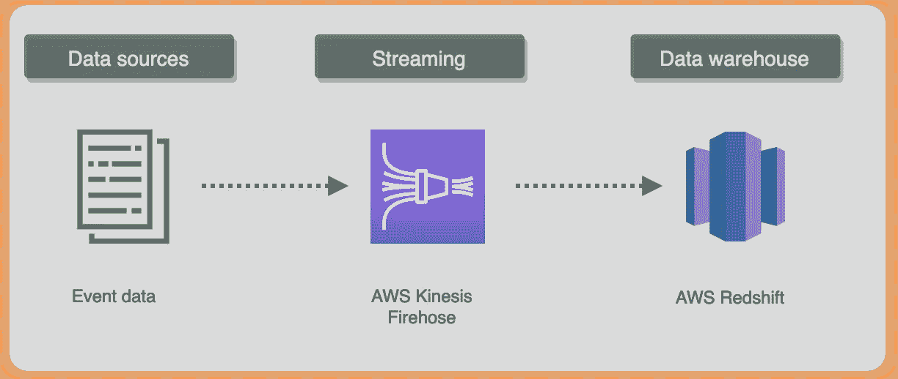
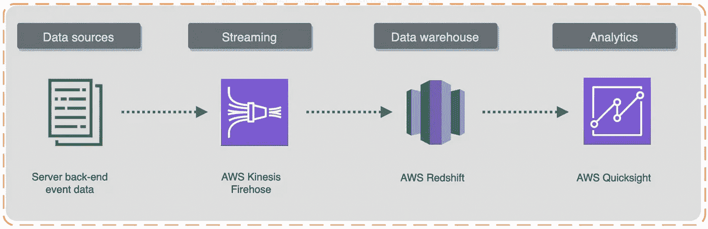
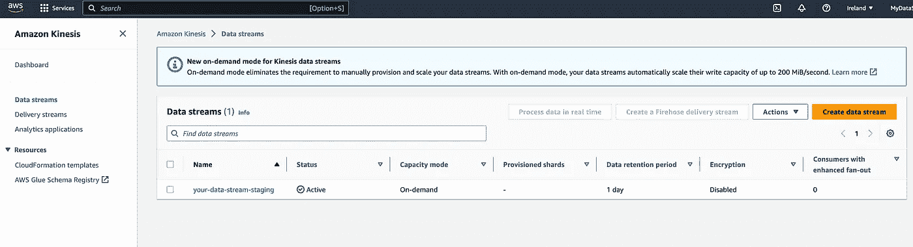
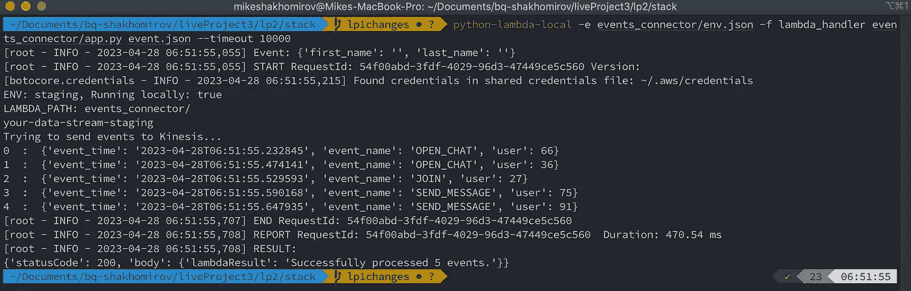
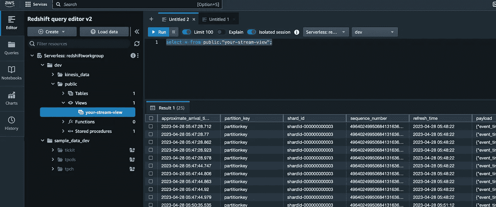

# 使用 Redshift Serverless 和 Kinesis 构建流数据管道

> 原文：[`towardsdatascience.com/building-a-streaming-data-pipeline-with-redshift-serverless-and-kinesis-04e09d7e85b2`](https://towardsdatascience.com/building-a-streaming-data-pipeline-with-redshift-serverless-and-kinesis-04e09d7e85b2)

## 面向初学者的完整教程

[](https://mshakhomirov.medium.com/?source=post_page-----04e09d7e85b2--------------------------------)[](https://towardsdatascience.com/?source=post_page-----04e09d7e85b2--------------------------------) [💡Mike Shakhomirov](https://mshakhomirov.medium.com/?source=post_page-----04e09d7e85b2--------------------------------)

·发表于[Towards Data Science](https://towardsdatascience.com/?source=post_page-----04e09d7e85b2--------------------------------) ·阅读时间 9 分钟·2023 年 10 月 6 日

--


图片由[Sebastian Pandelache](https://unsplash.com/@pandelache?utm_source=medium&utm_medium=referral)拍摄，来源于[Unsplash](https://unsplash.com/?utm_source=medium&utm_medium=referral)

在本文中，我将讨论最受欢迎的数据管道设计模式之一——事件流。除了其他好处，它还支持超快的数据分析，我们可以创建实时更新结果的报告仪表盘。我将演示如何通过构建一个使用 AWS Kinesis 和 Redshift 的流数据管道来实现这一点，并且可以通过几次点击使用基础设施即代码进行部署。我们将使用 AWS CloudFormation 来描述我们的数据平台架构并简化部署过程。

想象一下，作为数据工程师，你的任务是创建一个将服务器事件流与数据仓库解决方案（Redshift）连接起来的数据管道，以便转换数据并创建分析仪表盘。



管道基础设施。图片来源：作者。

> 什么是数据管道？
> 
> 它是一个数据处理步骤的序列。由于这些阶段之间的***逻辑数据流连接***，每个阶段生成一个**输出**，作为下一个阶段的**输入**。

我之前在这篇文章中写过相关内容：

[](/data-pipeline-design-patterns-100afa4b93e3?source=post_page-----04e09d7e85b2--------------------------------) ## 数据管道设计模式

### 选择合适的架构及示例

towardsdatascience.com

例如，事件数据可以由后端的源创建，使用 Kinesis Firehose 或 Kafka 流构建事件流。然后它可以馈送到多个不同的消费者或目的地。

流式处理是企业数据的“必备”解决方案，因其流数据处理能力。它能够实现实时数据分析。

在我们的用例场景中，我们可以设置一个**ELT 流式**数据管道到 AWS Redshift。AWS Firehose 流可以提供这种无缝集成，当数据流被直接上传到数据仓库表时。然后，数据可以被转换以使用 AWS Quicksight 作为 BI 工具来创建报告，例如。



添加了 BI 组件。图片来源于作者。

> 本教程假设学习者熟悉 AWS CLI 并且具有基本的 Python 知识。

## 工作流程

1\. 首先，我们将使用 AWS CloudFormation 创建 Kinesis 数据流。

2\. 我们将使用 AWS Lambda 向此事件流发送示例数据事件。

3\. 最后，我们将配置 AWS Redshift 集群并测试我们的流式管道。

## 创建 AWS Kinesis 数据流

AWS Kinesis Data Streams 是一个 Amazon Kinesis 实时数据流解决方案。它提供了出色的可扩展性和耐用性，数据流可以被任何消费者访问。

我们可以使用 CloudFormation 模板来创建它。下面的命令行脚本将触发 AWS CLI 命令进行部署：

```py
KINESIS_STACK=YourRedshiftDataStream
ENV=staging
aws \
cloudformation deploy \
--template-file kinesis-data-stream.yaml \
--stack-name $KINESIS_STACK \
--capabilities CAPABILITY_IAM \
--parameter-overrides \
"Environment"=$ENV
```

并且模板 kinesis-data-stream.yaml 将如下所示：

```py
AWSTemplateFormatVersion: 2010-09-09
Description: >
  Firehose resources relating to statistics generation.
  Repository - https://github.com/your_repository.

Parameters:
  Environment:
    AllowedValues:
      - staging
      - production
    Description: Target environment
    Type: String
    Default: 'staging'

Resources:
  MyKinesisStream:
    Type: AWS::Kinesis::Stream
    Properties: 
      Name: !Sub 'your-data-stream-${Environment}'
      RetentionPeriodHours: 24 
      StreamModeDetails:
        StreamMode: ON_DEMAND
      # ShardCount: 1
      Tags: 
        -
          Key: Environment
          Value: Production
```

非常简单。如果一切顺利，我们将看到我们的 Kinesis 流被部署：



流已创建。图片来源于作者。

## 2\. 创建 AWS Lambda 函数以模拟事件流

现在我们希望将一些事件发送到我们的 Kinesis 数据流。为此，我们可以创建一个无服务器应用程序，例如 AWS Lambda。我们将使用`boto3`库（AWS 的 Python SDK）来构建一个数据连接器与 AWS Kinesis 进行数据源连接。



本地运行应用以模拟事件流。图片来源于作者。

我们的应用程序文件夹结构可以如下所示：

```py
.
├── app.py
├── config
│   └── staging.yaml
├── env.json
└── requirements.txt
```

我们的`app.py`必须能够向 Kinesis 数据流发送事件：

```py
# Make sure boto3 is installed locally, i.e. pip install boto3
import json
import random
import boto3

kinesis_client = boto3.client('kinesis', region_name='eu-west-1')
# Constants:
STREAM_NAME = "your-data-stream-staging"

def lambda_handler(event, context):
    processed = 0
    print(STREAM_NAME)
    try:
        print('Trying to send events to Kinesis...')
        for i in range(0, 5):
            data = get_data()
            print(i, " : ", data)
            kinesis_client.put_record(
                StreamName=STREAM_NAME,

                Data=json.dumps(data),
                PartitionKey="partitionkey")
            processed += 1
    except Exception as e:
        print(e)
    message = 'Successfully processed {} events.'.format(processed)
    return {
        'statusCode': 200,
        'body': { 'lambdaResult': message }
    }

```

我们希望添加一个帮助函数来生成一些随机事件数据。例如：

```pypython
# Helpers:
def get_data():
    return {
        'event_time': datetime.now().isoformat(),
        'event_name': random.choice(['JOIN', 'LEAVE', 'OPEN_CHAT', 'SUBSCRIBE', 'SEND_MESSAGE']),
        'user': round(random.random() * 100)}
```

我们可以使用`python-lambda-local`库本地运行和测试 AWS Lambda，方法如下：

```py
pip install python-lambda-local
cd stack
python-lambda-local -e events_connector/env.json -f lambda_handler events_connector/app.py event.json --timeout 10000
# -e is for environment variables if you choose to use them.
#  event.json - sample JSON event to invoke our Lambda with.
```

`env.json` 只是一个事件负载，用于本地运行 Lambda。

`config/staging.yaml` 可以包含我们应用程序未来可能需要的任何环境特定设置。例如：

```py
# staging.yaml
Kinesis:
  DataStreamNsme: your-data-stream-staging
```

如果你需要使用`requirements.txt`，它可以如下所示：

```py
requests==2.28.1
pyyaml==6.0
boto3==boto3-1.26.90
python-lambda-local==0.1.13
```

在你的命令行中运行这个：

```py
 cd stack
pip install -r events_connector/requirements.txt
```

这种方法很有用，因为我们可能希望将无服务器应用程序部署到云中并进行调度。我们可以使用 CloudFormation 模板来实现这一点。我之前在这里写过：

[## Infrastructure as Code for Beginners](https://levelup.gitconnected.com/infrastructure-as-code-for-beginners-a4e36c805316?source=post_page-----04e09d7e85b2--------------------------------)

### 使用这些模板像专业人士一样部署数据管道

[levelup.gitconnected.com](https://levelup.gitconnected.com/infrastructure-as-code-for-beginners-a4e36c805316?source=post_page-----04e09d7e85b2--------------------------------)

当我们使用 CloudFormation 模板时，应用程序可以通过类似的 shell 脚本进行部署：

```py
PROFILE=your-aws-profile
STACK_NAME=YourStackNameLive
LAMBDA_BUCKET=your-lambdas-bucket.aws # Make sure it exists

date

TIME=`date +"%Y%m%d%H%M%S"`

base=${PWD##*/}
zp=$base".zip"
echo $zp

rm -f $zp

pip install --target ./package -r requirements.txt

cd package
zip -r ../${base}.zip .

cd $OLDPWD

zip -r $zp ./events_connector -x __pycache__ 

aws --profile $PROFILE s3 cp ./${base}.zip s3://${LAMBDA_BUCKET}/events_connector/${base}${TIME}.zip

aws --profile $PROFILE \
cloudformation deploy \
--template-file stack.yaml \
--stack-name $STACK_NAME \
--capabilities CAPABILITY_IAM \
--parameter-overrides \
"StackPackageS3Key"="events_connector/${base}${TIME}.zip" \
"Environment"="staging" \
"Testing"="false"
```

这是一个灵活的设置，允许我们创建强大的 CI/CD 管道。我记得我在下面的帖子中创建了一个。

## Continuous Integration and Deployment for Data Platforms

### 数据工程师和 ML Ops 的 CI/CD

[towardsdatascience.com

## 创建 Redshift Serverless 资源

现在我们需要为我们的流数据管道创建 Redshift Serverless 集群。我们可以手动或使用 CloudFormation 模板配置 Redshift Workgroup、创建 Namespace 和其他所需资源。

Redshift Serverless 仅仅是一个数据仓库解决方案。它可以执行任何规模的分析工作负载，无需数据仓库基础设施管理。Redshift 运行迅速，并能在几秒钟内从巨量数据中生成洞察。它会自动扩展，为即使是最苛刻的应用程序提供快速性能。



例子视图显示了我们应用程序的事件。图像来源于作者。

在我们的案例中，我们可以使用 CloudFormation 模板定义来部署 Redshift 资源。

```py
AWSTemplateFormatVersion: 2010-09-09
Parameters:
  DatabaseName:
    Description: The name of the first database in the Amazon Redshift Serverless environment.
    Type: String
    Default: dev
    MaxLength: 127
    AllowedPattern: '[a-zA-Z][a-zA-Z_0-9+.@-]*'
  AdminUsername:
    Description: The administrator's user name for Redshift Serverless Namespace being created.
    Type: String
    Default: admin
    AllowedPattern: '[a-zA-Z][a-zA-Z_0-9+.@-]*'
  AdminUserPassword:
    Description: The password associated with admin user.
    Type: String
    NoEcho: 'true'
    Default: Admin123
    MinLength: 8
    MaxLength: 64
    # AllowedPattern: '^(?=.*[a-z])(?=.*[A-Z])(?=.*\d)[^\x00-\x20\x22\x27\x2f\x40\x5c\x7f-\uffff]+'
  NamespaceName:
    Description: A unique identifier that defines the Namespace.
    Default: rswg
    Type: String
    MinLength: 3
    MaxLength: 64
    AllowedPattern: '^[a-z0-9-]+$'
  WorkgroupName:
    Description: A unique identifier that defines the Workspace.
    Default: redshiftworkgroup
    Type: String
    MinLength: 3
    MaxLength: 64
    AllowedPattern: '^[a-z0-9-]*$'
  BaseRPU:
    Description: Base RPU for Redshift Serverless Workgroup.
    Type: Number
    MinValue: 8
    MaxValue: 512
    Default: 8
    AllowedValues: [8,16,32,40,48,56,64,72,80,88,96,104,112,120,128,136,144,152,160,168,176,184,192,200,208,216,224,232,240,248,256,264,272,280,288,296,304,312,320,328,336,344,352,360,368,376,384,392,400,408,416,424,432,440,448,456,464,472,480,488,496,504,512]
  PubliclyAccessible:
    Description: Redshift Serverless instance to be publicly accessible.
    Type: String
    Default: true
    AllowedValues:
      - true
      - false

  SubnetId:
    Description: You must have at least three subnets, and they must span across three Availability Zones
    Type: List<AWS::EC2::Subnet::Id>
  SecurityGroupIds:
    Description: The list of SecurityGroupIds in your Virtual Private Cloud (VPC).
    Type: List<AWS::EC2::SecurityGroup::Id>
  LogExportsList:
    Description: Provide comma seperate values from list "userlog","connectionlog","useractivitylog".  E.g userlog,connectionlog,useractivitylog.  If left blank, LogExport is turned off.
    Type: CommaDelimitedList 
    Default: userlog,connectionlog,useractivitylog
  EnhancedVpcRouting:
    Description: The value that specifies whether to enable enhanced virtual private cloud (VPC) routing, which forces Amazon Redshift Serverless to route traffic through your VPC.
    Type: String
    AllowedValues:
      - true
      - false
    Default: false    
Metadata:
  'AWS::CloudFormation::Interface':
    ParameterGroups:
      - Label:
          default: Namespace parameters
        Parameters:
          - NamespaceName
          - DatabaseName
          - AdminUsername
          - AdminUserPassword
          - IAMRole
          - LogExportsList          
      - Label:
          default: Workgroup parameters
        Parameters:
            - WorkgroupName
            - BaseRPU
            - PubliclyAccessible
            - SubnetId
            - SecurityGroupIds
            - EnhancedVpcRouting            
    ParameterLabels:
      DatabaseName:
        default: "Database Name"
      AdminUsername:
        default: "Admin User Name"
      AdminUserPassword:
        default: "Admin User Password"
      NamespaceName:
        default: "Namespace"
      WorkgroupName:
        default: "Workgroup"
      BaseRPU:
        default: "Base RPU"
      PubliclyAccessible:
        default: "Publicly accessible"
      SubnetId:
        default: "Subnet Ids (Select 3 Subnet Ids spanning 3 AZs)"
      SecurityGroupIds:
        default: "Security Group Id"
      IAMRole:
        default: "Associate IAM Role"
      EnhancedVpcRouting:
        default: "Enhanced VPC Routing"  
      LogExportsList:
        default: "Log Export List"
Resources:
  RedshiftAccessRole:
    Type: AWS::IAM::Role
    Properties:
      ManagedPolicyArns: 
          - arn:aws:iam::aws:policy/service-role/AWSGlueServiceRole
          - arn:aws:iam::aws:policy/AmazonRedshiftAllCommandsFullAccess

      AssumeRolePolicyDocument:
        Version: 2012-10-17
        Statement:
          -
            Effect: Allow
            Principal:
              Service:
                - redshift.amazonaws.com
            Action:
              - sts:AssumeRole
  RedshiftRolePolicy:
    Type: AWS::IAM::Policy
    Properties:
      PolicyName: RedshiftRolePolicy
      PolicyDocument:
        Version: 2012-10-17
        Statement:
          -
            Effect: Allow
            Action: s3:ListAllMyBuckets
            Resource: arn:aws:s3:::*
          -
            Effect: Allow
            Action:
              - 's3:Get*'
              - 's3:List*'
            Resource: '*'
          -
            Effect: Allow
            Action: cloudwatch:*
            Resource: "*"
          -
            Effect: Allow
            Action: kinesis:*
            Resource: "*"
      Roles:
        - !Ref RedshiftAccessRole
  RedshiftServerlessNamespace:
    DependsOn: RedshiftAccessRole
    Type: 'AWS::RedshiftServerless::Namespace'
    Properties:
      AdminUsername:
        Ref: AdminUsername
      AdminUserPassword:
        Ref: AdminUserPassword
      DbName:
        Ref: DatabaseName
      NamespaceName:
        Ref: NamespaceName
      IamRoles:
        - !GetAtt [ RedshiftAccessRole, Arn ]
      LogExports:
        Ref: LogExportsList        
  RedshiftServerlessWorkgroup:
    Type: 'AWS::RedshiftServerless::Workgroup'
    Properties:
      WorkgroupName:
        Ref: WorkgroupName
      NamespaceName:
        Ref: NamespaceName
      BaseCapacity:
        Ref: BaseRPU
      PubliclyAccessible:
        Ref: PubliclyAccessible
      SubnetIds:
        Ref: SubnetId
      SecurityGroupIds:
        Ref: SecurityGroupIds
      EnhancedVpcRouting:
        Ref: EnhancedVpcRouting        
    DependsOn:
      - RedshiftServerlessNamespace
Outputs:
  ServerlessNamespace:
    Description: Name of the namespace
    Value: !Ref NamespaceName
  ServerlessWorkgroup:
    Description: Name of the workgroup
    Value: !Ref WorkgroupName
```

所以如果我们在命令行中运行这段代码，它将部署这个堆栈：

```py
STACK=YourRedshiftServerless
SUBNETID=subnet-1,subnet-2,subnet-3
SECURITYGROUPIDS=sg-your-security-group
aws \
cloudformation deploy \
--template-file redshift-serverless.yaml \
--stack-name $STACK \
--capabilities CAPABILITY_IAM \
--parameter-overrides \
"SubnetId"=$SUBNETID \
"SecurityGroupIds"=$SECURITYGROUPIDS
```

通常，我们希望在私有子网中部署数据库。然而，在开发的早期阶段，你可能希望从开发机器直接访问 Redshift。

> 这不推荐用于生产环境，但在这种开发情况下，你可以先将 Redshift 放入我们的 `default` VPC 子网。
> 
> 现在，当所有所需的管道资源成功配置后，我们可以连接我们的 Kinesis 流和 Redshift 数据仓库。

然后我们可以使用 SQL 语句在 Redshift 中创建 `kinesis_data` 模式：

```py
CREATE EXTERNAL SCHEMA kinesis_data
FROM KINESIS
IAM_ROLE 'arn:aws:iam::123456789:role/rs3-RedshiftAccessRole-1TU31HQNXM0EK';
;
CREATE MATERIALIZED VIEW "your-stream-view" AUTO REFRESH YES AS
    SELECT approximate_arrival_timestamp,
           partition_key,
           shard_id,
           sequence_number,
           refresh_time,
           JSON_PARSE(kinesis_data) as payload
      FROM kinesis_data."your-data-stream-staging";
;
```

这段 SQL 的第一部分将设置 AWS Kinesis 作为数据源。第二部分将创建一个包含我们应用程序事件数据的视图。

确保创建一个具有 `AmazonRedshiftAllCommandsFullAccess` AWS 管理策略的 AWS Redshift 角色。

```py
{
    "Version": "2012-10-17",
    "Statement": [
        {
            "Action": "s3:ListAllMyBuckets",
            "Resource": "arn:aws:s3:::*",
            "Effect": "Allow"
        },
        {
            "Action": [
                "s3:Get*",
                "s3:List*"
            ],
            "Resource": "*",
            "Effect": "Allow"
        },
        {
            "Action": "cloudwatch:*",
            "Resource": "*",
            "Effect": "Allow"
        },
        {
            "Action": "kinesis:*",
            "Resource": "*",
            "Effect": "Allow"
        }
    ]
}
```

就这样。一切准备好运行应用程序以模拟事件数据流。这些事件会立即出现在我们刚刚创建的 Redshift 视图中：


应用程序在本地运行。图像来源于作者。


示例视图显示了来自我们应用程序的事件。图片由作者提供。

# 结论

我们创建了一个简单而可靠的流数据管道，从使用 AWS Lambda 创建的无服务器应用程序到 AWS Redshift 数据仓库，在那里数据实时转化和摄取。它能够轻松捕获、处理和存储任何规模的数据流。对于任何机器学习（ML）管道都非常适用，其中模型用于检查数据并预测推理端点，因为数据流向其目标。

我们使用基础设施即代码来部署数据管道资源。这是部署不同数据环境中资源的首选方法。

# 推荐阅读

/continuous-integration-and-deployment-for-data-platforms-817bf1b6bed1?source=post_page-----04e09d7e85b2--------------------------------) [## 数据平台的持续集成和部署

### 数据工程师和 ML 运维的 CI/CD

[Towards Data Science /data-platform-architecture-types-f255ac6e0b7?source=post_page-----04e09d7e85b2--------------------------------) [## 数据平台架构类型

### 它能多大程度上满足你的业务需求？选择的困境。

[Towards Data Science [`levelup.gitconnected.com/infrastructure-as-code-for-beginners-a4e36c805316?source=post_page-----04e09d7e85b2--------------------------------) [## 初学者的基础设施即代码

### 使用这些模板像专业人士一样部署数据管道

[LevelUp`](https://levelup.gitconnected.com/infrastructure-as-code-for-beginners-a4e36c805316?source=post_page-----04e09d7e85b2--------------------------------)
