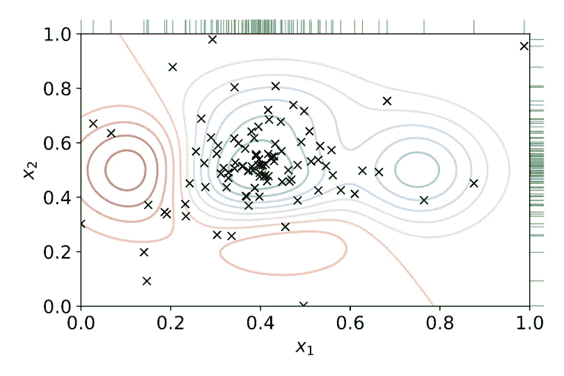
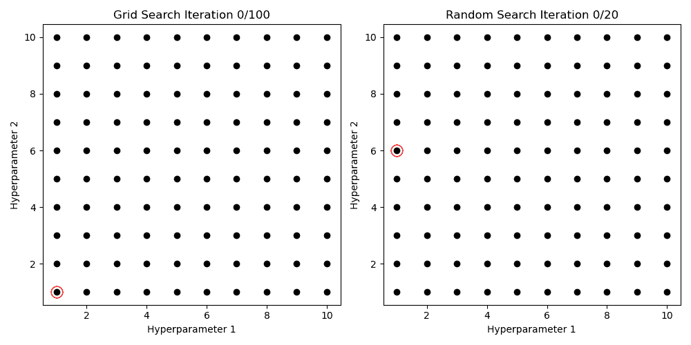
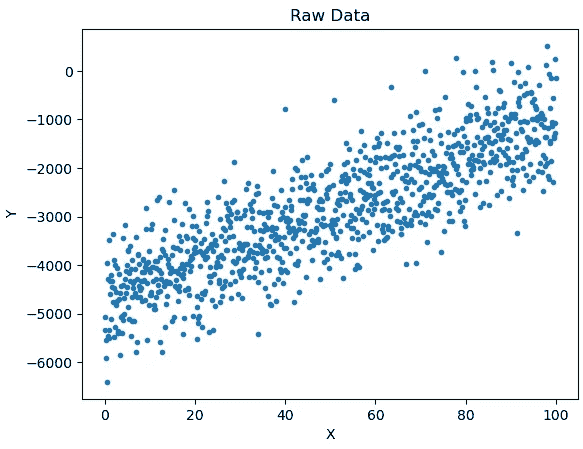
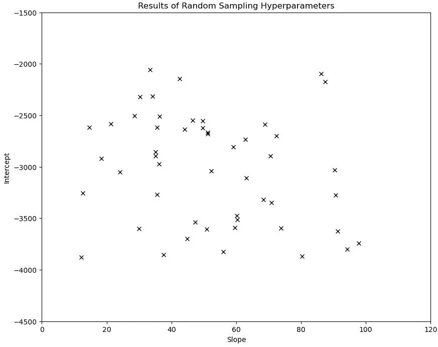
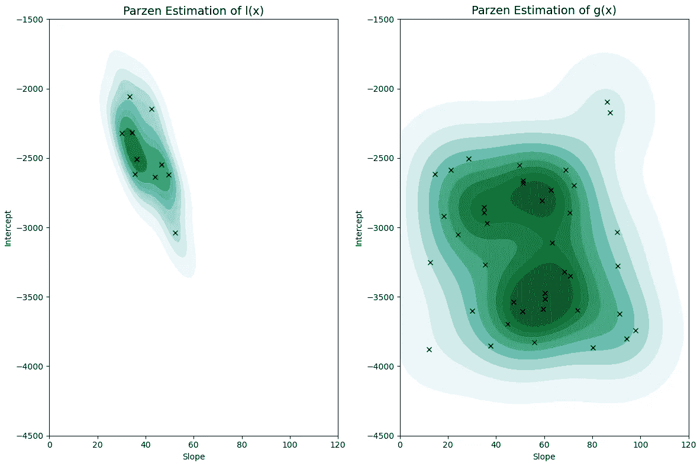
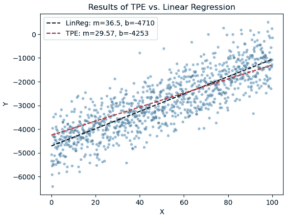
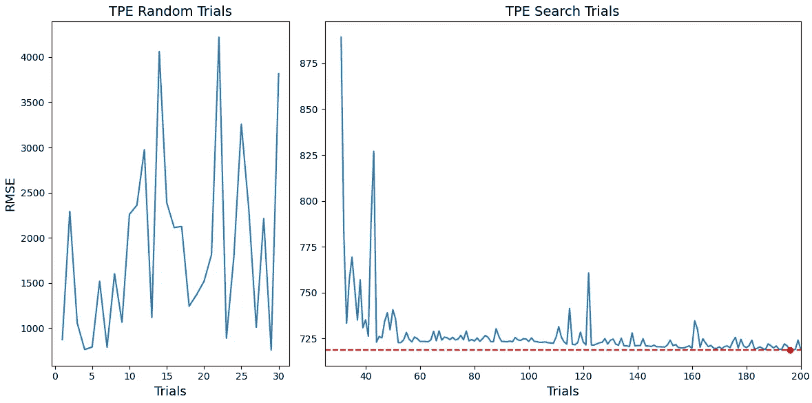
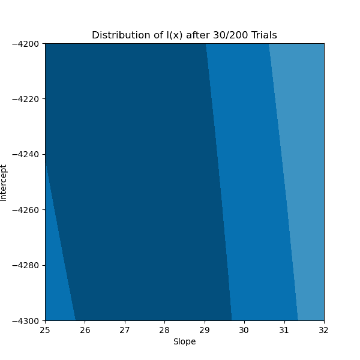

# 从头开始构建树状 Parzen 估计器（有点像）

> 原文：[`towardsdatascience.com/building-a-tree-structured-parzen-estimator-from-scratch-kind-of-20ed31770478?source=collection_archive---------4-----------------------#2023-04-04`](https://towardsdatascience.com/building-a-tree-structured-parzen-estimator-from-scratch-kind-of-20ed31770478?source=collection_archive---------4-----------------------#2023-04-04)

## 传统超参数调整方法的替代方案

[](https://medium.com/@coljhor?source=post_page-----20ed31770478--------------------------------)[](https://towardsdatascience.com/?source=post_page-----20ed31770478--------------------------------) [Colin Horgan](https://medium.com/@coljhor?source=post_page-----20ed31770478--------------------------------)

·

[关注](https://medium.com/m/signin?actionUrl=https%3A%2F%2Fmedium.com%2F_%2Fsubscribe%2Fuser%2F8d3875046cb&operation=register&redirect=https%3A%2F%2Ftowardsdatascience.com%2Fbuilding-a-tree-structured-parzen-estimator-from-scratch-kind-of-20ed31770478&user=Colin+Horgan&userId=8d3875046cb&source=post_page-8d3875046cb----20ed31770478---------------------post_header-----------) 发布于 [Towards Data Science](https://towardsdatascience.com/?source=post_page-----20ed31770478--------------------------------) · 9 分钟阅读 · 2023 年 4 月 4 日[](https://medium.com/m/signin?actionUrl=https%3A%2F%2Fmedium.com%2F_%2Fvote%2Ftowards-data-science%2F20ed31770478&operation=register&redirect=https%3A%2F%2Ftowardsdatascience.com%2Fbuilding-a-tree-structured-parzen-estimator-from-scratch-kind-of-20ed31770478&user=Colin+Horgan&userId=8d3875046cb&source=-----20ed31770478---------------------clap_footer-----------)

--

[](https://medium.com/m/signin?actionUrl=https%3A%2F%2Fmedium.com%2F_%2Fbookmark%2Fp%2F20ed31770478&operation=register&redirect=https%3A%2F%2Ftowardsdatascience.com%2Fbuilding-a-tree-structured-parzen-estimator-from-scratch-kind-of-20ed31770478&source=-----20ed31770478---------------------bookmark_footer-----------)

2 维超参数调整的 TPE 可视化。图片由 [Alexander Elvers via Wikipedia Commons](https://commons.wikimedia.org/wiki/File:Hyperparameter_Optimization_using_Tree-Structured_Parzen_Estimators.svg) 提供。

机器学习模型如何适应数据由一组称为超参数的初始条件决定。超参数有助于限制模型的学习行为，以便它（希望）能够很好地拟合数据并在合理的时间内完成。找到最佳的超参数集（通常称为“调优”）是建模任务中最重要且耗时的部分之一。历史上，超参数调优的方法涉及对超参数组合网格进行暴力搜索或随机搜索，分别称为网格搜索和随机搜索。尽管受欢迎，网格搜索和随机搜索方法缺乏收敛到一个合理的超参数集的方法——也就是说，它们完全是试错法。本文将探讨一种相对较新的超参数调优方法——树结构帕尔岑估计器（TPE）——并通过逐步实现的 Python 代码深入了解其功能。



图 1：网格搜索和随机搜索技术的动画。

TPE 是一种贝叶斯优化算法。这意味着它允许我们从一些关于最佳模型超参数的初始信念开始，并在学习不同超参数如何影响模型性能时，以有原则的方式更新这些信念。这已经比网格搜索和随机搜索有了显著的改进！我们可以通过尝试更多导致良好模型的超参数组合，而不是通过试错法来确定最佳超参数集。

TPE 得名于两个主要思想：1\. 使用帕尔岑估计来建模我们对最佳超参数的信念（稍后会详细介绍）和 2\. 使用一种称为后验推断图的树状数据结构来优化算法运行时间。在这个例子中，我们将忽略“树结构”部分，因为它与超参数调优本身无关。此外，我们不会深入讨论贝叶斯统计、期望改进等内容。这里的目标是对 TPE 及其工作原理有一个高层次的概念理解。有关这些主题的更深入讨论，请参阅 J. Bergstra 和同事关于 TPE 的原始论文 [[1]](https://proceedings.neurips.cc/paper/2011/hash/86e8f7ab32cfd12577bc2619bc635690-Abstract.html)。

# 设置示例

为了构建我们的 TPE 实现，我们需要一个玩具示例来操作。假设我们想通过一些随机生成的数据找到最佳拟合线。在这个例子中，我们有两个超参数需要调优——线的斜率 *m* 和截距 *b*。

```py
import numpy as np

#Generate some data
np.random.seed(1)
x = np.linspace(0, 100, 1000)
m = np.random.randint(0, 100)
b = np.random.randint(-5000, 5000)
y = m*x + b + np.random.randn(1000)*700
```



图 2：用于 TPE 的随机生成线性数据。

由于 TPE 是一种优化算法，我们还需要一些指标来优化。我们将使用均方根误差（RMSE）。让我们定义函数 `rmse` 来计算这个指标，如下所示：

```py
def rmse(m, b):
    '''
    Consumes coeffiecients for our linear model and returns RMSE.

    m (float): line slope
    m (float): line intercept
    y (np.array): ground truth for model prediction
    '''
    preds = m*x + b
    return np.sqrt(((preds - y)**2).sum()/len(preds))
```

我们需要的最后一件事是一些关于最佳超参数的初步信念。假设我们认为最佳拟合线的斜率在 (10,100) 区间上是一个均匀随机变量，而截距也在 (-6000, -3000) 区间上是一个均匀随机变量。这些分布称为先验分布。它们是均匀随机变量等同于说我们认为最佳超参数的真实值在各自的区间内有相同的可能性。我们将实现一个类来封装这些变量，并使用它们来定义我们的初始搜索空间。

```py
class UniformDist:
    '''
    Class encapsulates behavior for a uniform distribution.
    '''
    def __init__(self, min_, max_):
        '''
        Initializes our distribution with provided bounds
        '''
        self.min = min_
        self.max = max_

    def sample(self, n_samples):
        '''
        Returns samples from our distribution
        '''
        return np.random.uniform(self.min, self.max, n_samples)
```

```py
#Define hyperparameter search space
search_space = {'m':UniformDist(10,100), 'b':UniformDist(-6000,-3000)}
```

完成所有这些设置后，我们可以继续编写算法本身。

# **步骤 1：随机探索**

TPE 的第一步是从我们的先验分布中随机采样超参数集合。这个过程给了我们一个关于哪些搜索空间区域能够生成良好模型的初步估计。函数 `sample_priors` 消耗我们的初始搜索空间和要从中抽取的随机样本数。然后它使用我们的目标函数 `rmse` 评估生成的模型，并返回一个包含每次试验的斜率、截距和 RMSE 的 Pandas 数据框。

```py
import pandas as pd

def sample_priors(space, n_samples):
    '''
    Consumes search space defined by priors and returns
    n_samples.
    '''
    seed = np.array([space[hp].sample(n_samples) for hp in space])

    #Calculate rmse for each slope intercept pair in the seed
    seed_rmse = np.array([rmse(m, b) for m, b in seed.T]) 

    #Concatenate and convert to dataframe
    data = np.stack([seed[0], seed[1], seed_rmse]).T
    trials = pd.DataFrame(data, columns=['m', 'b', 'rmse'])

    return trials
```



图 3：30 次迭代的随机采样超参数结果。每个‘x’表示一个超参数样本。

# 步骤 2：划分搜索空间和 Parzen 估计

在从我们的先验分布生成一些初始样本后，我们现在使用分位数阈值 γ 将超参数搜索空间分成两个部分，其中 γ 在 0 和 1 之间。我们可以任意选择 γ=0.2。那些产生模型表现位于我们目前创建的所有模型的前 20% 的超参数组合被归入“良好”分布 l(x)。所有其他超参数组合则归入“差”分布 g(x)。



图 4：经过 30 轮随机选择超参数后的 l(x) 和 g(x) 分布的 KDE。颜色较深的区域表示密度较高。

结果表明，下一组要测试的最佳超参数组合由 g(x)/l(x) 的最大值给出（如果您想查看推导过程，请参见 [[1]](https://proceedings.neurips.cc/paper/2011/hash/86e8f7ab32cfd12577bc2619bc635690-Abstract.html)）。这在直观上是合理的。我们希望超参数在我们的“好”分布 l(x) 下很可能，而在我们的“坏”分布 g(x) 下不太可能。我们可以使用 Parzen 估计器建模 g(x) 和 l(x)，这就是“TPE”中的“PE”来自哪里。Parzen 估计的粗略思路即核密度估计（或 KDE）是我们将对一系列正态分布取平均，每个分布以属于 g(x) 或 l(x) 的观察值为中心。结果分布在我们的搜索空间中样本接近的区域具有高密度，而在样本远离的区域具有低密度。为了执行 Parzen 估计，我们将使用 SKLearn 库中的 `KernelDensity` 对象。函数 `segment_distributions` 消耗我们的试验数据框和我们的阈值 γ，并返回 l(x) 和 g(x) 的 Parzen 估计器。结果分布在图 4 中可视化。

```py
from sklearn.neighbors import KernelDensity

def segment_distributions(trials, gamma):
    '''
    Splits samples into l(x) and g(x) distributions based on our
    quantile cutoff gamma (using rmse as criteria).

    Returns a kerned density estimator (KDE) for l(x) and g(x), 
    respectively.
    '''
    cut = np.quantile(trials['rmse'], gamma)

    l_x = trials[trials['rmse']<cut][['m','b']]
    g_x = trials[~trials.isin(l_x)][['m','b']].dropna()

    l_kde = KernelDensity(kernel='gaussian', bandwidth=5.0)
    g_kde = KernelDensity(kernel='gaussian', bandwidth=5.0)

    l_kde.fit(l_x)
    g_kde.fit(g_x)

    return l_kde, g_kde 
```

# 第 3 步：确定要测试的下一个“最佳”超参数

如第 2 步所述，下一组要测试的最佳超参数集最大化 g(x)/l(x)。我们可以通过以下方式确定这一组超参数。首先，我们从 l(x) 中抽取 N 个随机样本。然后，对于每一个样本，我们评估其相对于 l(x) 和 g(x) 的对数似然，选择最大化 g(x)/l(x) 的样本作为下一组要测试的超参数组合。我们决定使用的 SKLearn `KernelDensity` 实现使得这一计算非常简单。

```py
def choose_next_hps(l_kde, g_kde, n_samples):
    '''
    Consumes KDE's for l(x) and g(x), samples n_samples from 
    l(x) and evaluates each sample with respect to g(x)/l(x).
    The sample which maximizes this quantity is returned as the
    next set of hyperparameters to test.
    '''
    samples = l_kde.sample(n_samples)

    l_score = l_kde.score_samples(samples)
    g_score = g_kde.score_samples(samples)

    hps = samples[np.argmax(g_score/l_score)]

    return hps
```

# 现在汇总

我们需要做的就是将之前讨论的所有组件串联起来，得到 TPE 的实现！我们需要做出的决定是我们想要进行多少轮随机探索，算法要完成多少次迭代，以及我们的截止阈值 γ 将是多少（是的，即使是 TPE 也有超参数）。在选择这些数量时，有几个方面需要考虑。

1.  如果在开始 TPE 之前，您的先验没有捕捉到“最佳”超参数集，那么算法可能会很难收敛。

1.  你进行的随机探索轮次越多，对 g(x) 和 l(x) 的初步近似就会越准确，这可能会改善`tpe`的结果。

1.  γ 的值越高，最终落在 l(x) 中的样本就会越少。仅有少量样本用于估计 l(x) 可能会导致 `tpe` 选择不佳的超参数。

```py
def tpe(space, n_seed, n_total, gamma):
    '''
    Consumes a hyperparameter search space, number of iterations for seeding
    and total number of iterations and performs Bayesian Optimization. TPE
    can be sensitive to choice of quantile cutoff, which we control with gamma.
    '''

    #Seed priors
    trials = sample_priors(space, n_seed)

    for i in range(n_seed, n_total):

        #Segment trials into l and g distributions
        l_kde, g_kde = segment_distributions(trials, gamma)

        #Determine next pair of hyperparameters to test
        hps = choose_next_hps(l_kde, g_kde, 100)

        #Evaluate with rmse and add to trials
        result = np.concatenate([hps, [rmse(hps[0], hps[1])]])

        trials = trials.append(
            {col:result[i] for i, col in enumerate(trials.columns)},
            ignore_index=True
        )

    return trials
```

# 结果

要对我们之前创建的合成数据执行 TPE，我们运行如下：

```py
#Define hyperparameter search space
np.random.seed(1)
search_space = {'m':UniformDist(10,100), 'b':UniformDist(-6000,-3000)}

df = tpe(search_space, 
         n_seed=30, 
         n_total=200, 
         gamma=.2)
```

就这些！我们现在可以分析我们的结果。为了简洁起见，生成以下可视化所用的代码将不予展示。然而，源代码可以在此项目的 GitHub 仓库中找到。

首先，让我们将 TPE 的最佳超参数设置与回归求解器得到的实际最佳斜率和截距进行比较。



图 5：使用 TPE 和线性回归获得的超参数的最佳拟合线。

从图 5 中可以看出，使用 TPE 我们能够密切接近我们线性回归模型的最佳超参数设置。我们不期望 TPE 能超越回归求解器，因为线性回归有一个封闭形式的解。然而，在无限次的试验中，我们期望它会收敛到类似的解。

TPE 是一种优化算法，因此我们不仅关心是否能够找到一组不错的超参数。我们还需要检查在 200 次迭代中我们的目标函数是否降低。图 6 展示了在初始 30 个随机样本之后，我们的 TPE 实现有一个明确的（或大致上）趋势来最小化我们的目标函数。



图 6：所有 TPE 试验中的 RMSE。注意左侧和右侧图中 y 轴刻度的差异。红点表示具有最低 RMSE 的试验。

到目前为止一切看起来都很棒！我们最后要检查的是我们关于超参数“最佳”分布的信念在 200 次迭代中的变化。



图 7：我们 TPE 算法在 200 次迭代中的 l(x)的 Parzen 估计。

如图 7 所示，我们从一个非常宽泛的 l(x)分布开始，迅速收敛到接近最终结果的分布。图 6 和图 7 清楚地说明了 TPE 的三个简单步骤如何组合成一个能够以复杂但直观的方式探索搜索空间的算法。

# **结论**

超参数调优是建模过程中的关键部分。尽管网格搜索和随机搜索方法易于实现，但 TPE 作为替代方案提供了一个更有原则的超参数调优方法，从概念上也比较简单。许多 Python 库都很好的实现了 TPE，包括[Hyperopt](https://github.com/hyperopt/hyperopt)（由[1]的作者创建并维护）和[Optuna](https://optuna.org/)。无论是像我们的玩具示例一样简单，还是像神经网络超参数调优一样复杂，TPE 都是一个多功能、有效且简单的技术，近年来在数据科学和机器学习领域越来越受欢迎。下次当你在调整模型超参数时，或许可以跳过网格搜索。

# 参考文献

1.  Bergstra, J., Bardenet, R., Bengio, Y., & Kégl, B., 超参数优化算法 (2011)，*神经信息处理系统进展*，*24*。

*除非另有说明，否则所有图像均由作者提供。*
