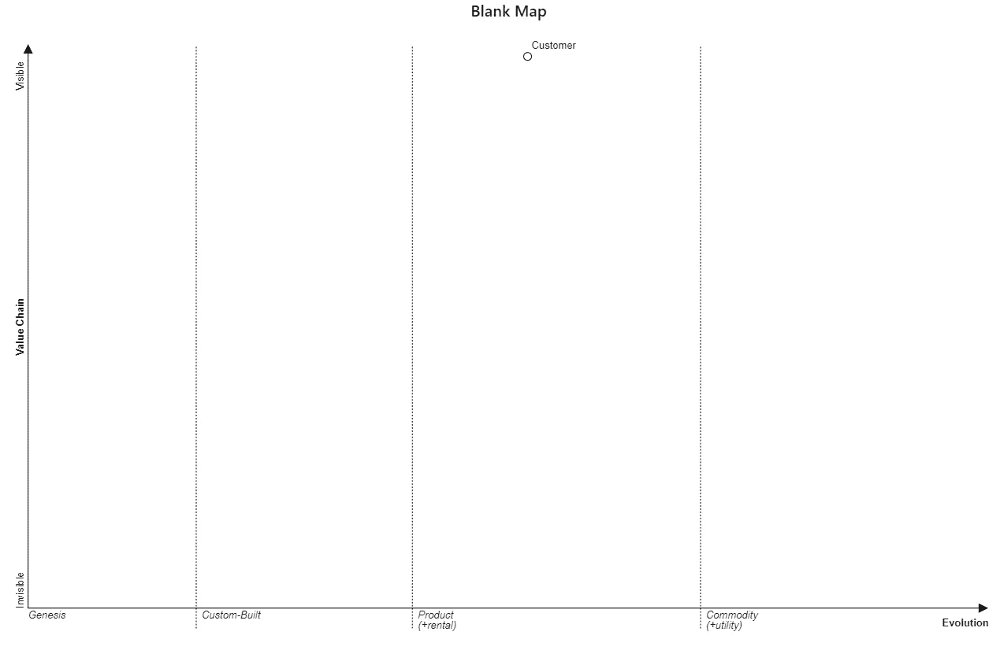
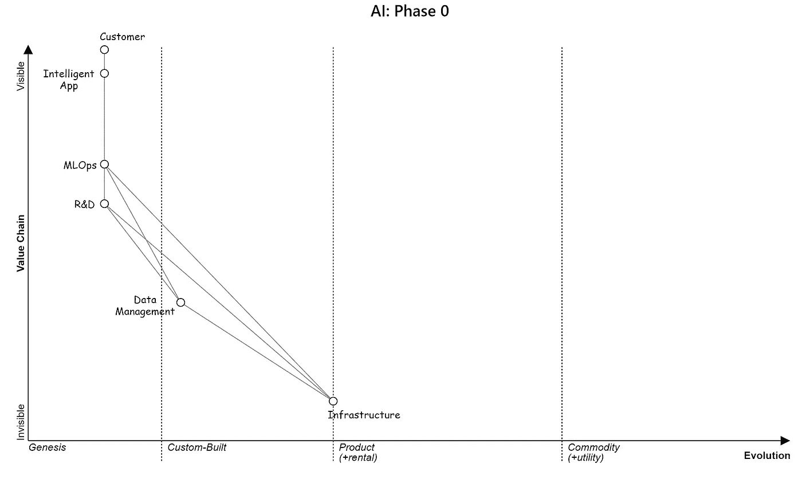
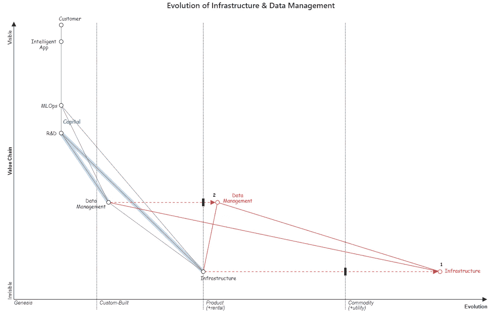
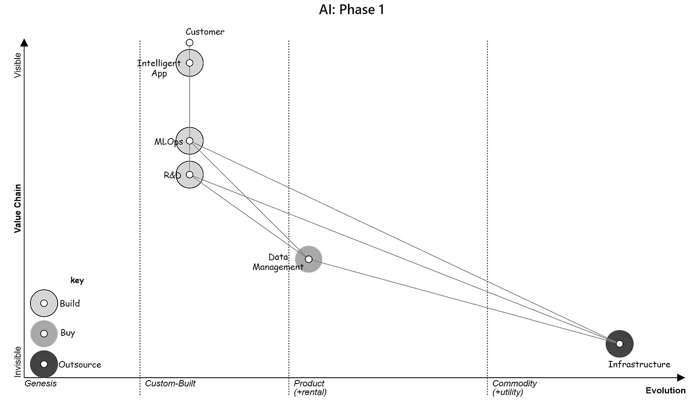
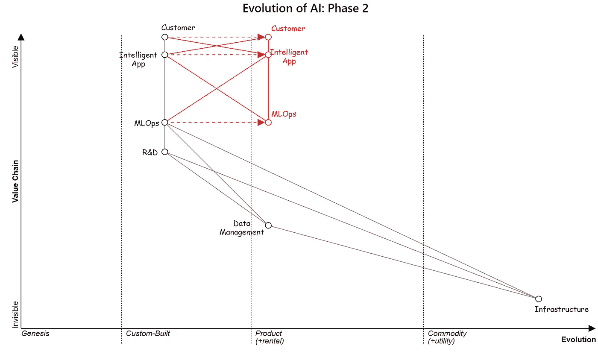
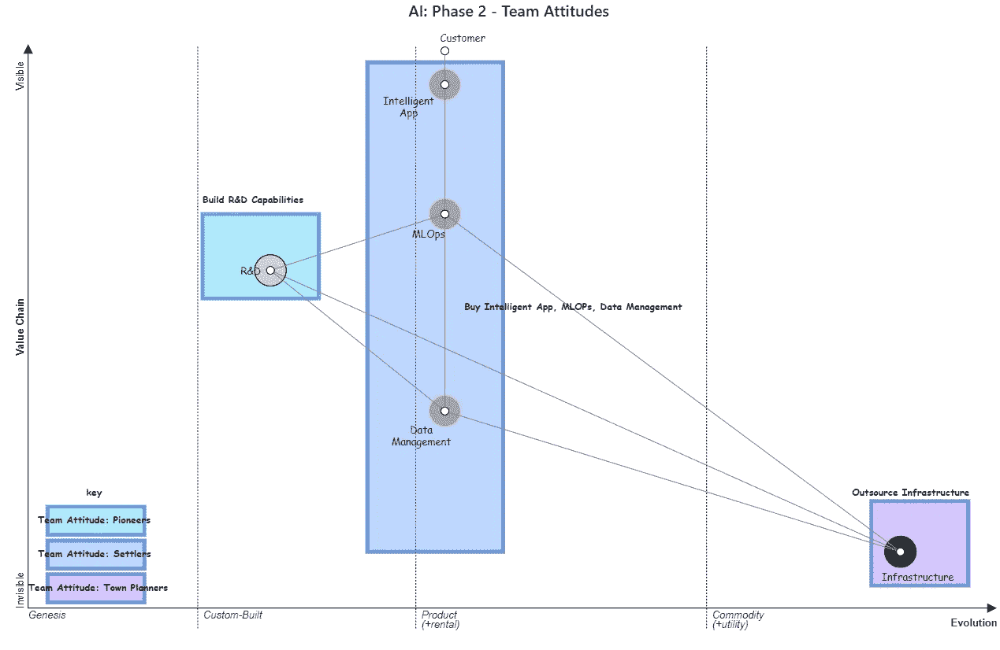
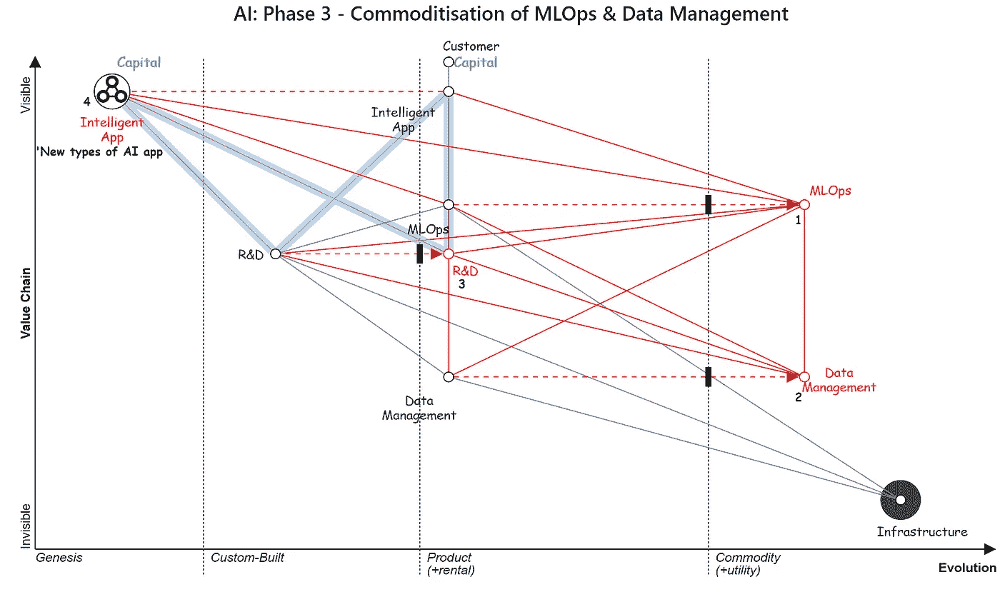

# 为企业构建人工智能战略

> 原文：[`towardsdatascience.com/building-ai-strategies-for-businesses-7b2e900399b7`](https://towardsdatascience.com/building-ai-strategies-for-businesses-7b2e900399b7)

## 通过沃德利地图制定人工智能战略的艺术

 [John Adeojo](https://johnadeojo.medium.com/?source=post_page-----7b2e900399b7--------------------------------)

·发表于[Towards Data Science](https://towardsdatascience.com/?source=post_page-----7b2e900399b7--------------------------------) ·阅读时间 13 分钟·2023 年 6 月 6 日

--

图片由作者提供：通过 Midjourney 生成

# 背景——在一家成熟银行主导人工智能战略

在创办 Data-Centric Solutions 之前，我负责了一家成熟银行的人工智能战略的开发、执行和实施。尽管在这种规模的交付上相对较为青涩，但我还是充满热情地接受了这份工作。消除了最初的冒名顶替综合症，我安慰自己，即使最坏的情况也不过是犯几个错误、吸取教训并实现专业成长。

人工智能战略显然比我最初认为的要复杂得多。在我的职业生涯中，我有幸参与了成功和不成功的战略。我希望分享一些我获得的宝贵见解，并希望这能为他人提供一个基础。

# 灵感来源于沃德利地图

我最初是通过一位值得信赖的导师推荐发现了[沃德利地图](https://medium.com/wardleymaps/on-being-lost-2ef5f05eb1ec)的。对于那些不熟悉的人，沃德利地图是一种系统映射的方法。顾名思义，这种方法是由西蒙·沃德利开发的。

起初，我有些怀疑，但随着深入了解，我越来越认识到它的价值。我发现这些不仅是阐述战略的绝佳方式，而且是不可或缺的工具。

让我信服的是沃德利的棋类比喻。作为一个狂热的国际象棋爱好者，我在能抽出时间时都会下棋，这个比喻让我深感触动。国际象棋虽然比商业简单得多，但仍是一种战略游戏。沃德利强调，能够在国际象棋中制定和实施战略是因为存在一张地图，即棋盘本身！

*如果你愿意，你可以阅读 Wardley 的* [*国际象棋类比*](https://medium.com/wardleymaps/on-being-lost-2ef5f05eb1ec#:~:text=the%20same%20time.-,A%20game%20of%20chess,-I%E2%80%99m%20going%20to)*，像我一样，你可能会被说服去追求这种方法！*

# 什么构成了一个图？

根据 Wardley，以下六个组件对于任何图来说都是有用的：

1.  图是**可视化**的，这在棋盘上无可否认。

1.  图是**上下文的**。我们承认棋盘与国际象棋游戏有关。

1.  图使**位置的理解**成为可能。我们安排棋盘，以便理解棋子的摆放。

1.  图**参考一个锚点**。锚点是板上固有的，根据板在玩家和棋子之间的位置为我们提供方向感。

1.  图允许**运动的理解**。棋盘的设计模式让我们理解运动。

1.  图包含**组件**。在棋类比中，棋子就是组件。

# 理解 Wardley 图

在我们深入探讨我创建的策略图之前，我想让读者对 Wardley 图有一个基本的直觉。

## 简要定义

Wardley 图应被解读为对业务价值链或服务的战略可视化，突出其组件的成熟度和演变。这有助于理解依赖关系，识别机会，并做出关于在哪里集中创新、资源和开发工作的明智决策。

图 1：作者提供的图像 — 空白 Wardley 图，客户是锚点，因此位于图的顶部

让我们详细说明 Wardley 图的属性：

**锚点**：在我们所有的图中，锚点是客户。图上所有组件的位置都是相对于客户的。

**组件**：组件代表为满足客户需求而进行的技术、实践或活动。关联的组件以某种方式相互依赖，主要通过使能。资本、数据和风险可以在关联组件之间流动。

在 AI 策略的目的下，我定义了以下组件：

+   **智能应用**：提供给客户的 AI 驱动应用。我保持了这一点的通用性，但读者可以想象任何类型的 AI 驱动应用。这是价值链中最可见的部分，因此在图中最接近客户。

+   **机器学习操作（MLOps）**：使机器学习/AI 模型在生产中得到管理的实践、人员和技术。要了解更详细的解释，[阅读此文](https://ml-ops.org/)。

+   **研究与开发（R&D）**：发现和原型新 AI/ML 模型的实践。这些活动通常在实验室或“沙坑”环境中进行。

+   **数据管理**：数据管理涉及以高效、安全的方式组织、存储、检索和维护数据，以确保用户能够访问、可靠和及时获取数据。

+   **基础设施**：指所有其他组件所建立的技术 IT 基础设施。

**可见性**：组件的位置由 y 轴决定，代表沿价值链的可见性。组件距离客户越近，它的可见性就越高。

**进化**：运动受限于 x 轴，代表地图上给定组件的进化阶段（成熟度）。组件会因外部因素而随着时间发展。

任何组件都有四个进化阶段：

+   **创生**：创建新颖、独特的组件或技术。

+   **定制构建：** 组件被更好地理解，但仍需针对每个使用场景进行定制。

+   **产品**：组件变得标准化，转变为广泛分发的产品或服务。

+   **实用性**：组件高度商品化，作为以效率和成本降低为重点的公用服务提供。

现在我们对地图有了基本了解，让我们一起探索 AI 的格局吧！

*注意：这是对 Wardley 映射的简化理解，但足以理解我为本文创建的地图。如果你想了解更多，我建议你阅读完整的博客。*

# 阶段 0 的 AI：恐龙时代

我被招聘到一个阶段 0 的公司来构建 AI 战略。我们拥有大量的遗留基础设施，有限的现代技术栈访问权限，以及很少的内部专家来构建智能应用。我怀疑许多读者可以与阶段 0 相关联。

图 2 — 作者提供的图像：阶段 0 的 AI

*请花一些时间理解这个阶段 0 公司的地图。*

**基础设施**：有大量的遗留本地技术基础设施。这些是几十年前由第三方构建的产品，大多数现在已不再得到支持，只有少数几个非常昂贵的专家可以维护。没有人真正理解它们，人们也不愿意干预这些系统，以免引发重大问题。它们几乎被 IT 部门保护，以防止“崩溃”。这些遗留基础设施是可靠的、静态的，显然不利于创新。

**数据管理**：数据管理系统建立在遗留基础设施之上。几代分析师和工程师构建了定制的数据管道、表视图、仪表盘和报告层，且大多未有文档记录。我们的本地数据仓库被戏称为“数据沼泽”。数据几乎像是无序的西部，一旦有人更改了管道而未通知任何人，你建立的仪表盘可能会随机失败。沼泽中的数据是不可信的。

我偶尔听到有人把自由格式文本字段或 CSV 文件称为杂乱数据。相比之下，我在这里描述的杂乱程度，类似于石油泄漏；自由格式文本输入就像洒出的牛奶。

## Phase 0 AI 战略

我们意识到研发、MLOps 和智能应用不能超越数据管理的演变。为了启动 AI 战略，我们首先需要解决这个问题。

作为一个数据科学职能，我们需要对原型所需的数据有更多的控制。我们利用了一款现成的分析工具，允许我们连接到源源不断的数据来源。有限的存储和计算意味着我们需要利用统计方法来适当地抽样数据源。使用开源分析工具进行了数据质量检查。有效地说，我们为研发创建了一个定制的数据管理解决方案。

研发开始时是发现阶段，我们花时间与客户交谈，试图了解智能应用如何能给他们带来好处。我们制定了框架来评估可行性与价值，以便为我们提供一种优先考虑开发计划的方法。

凭借我们临时的数据管理方法和数据实验室，我们设法开发了一些原型应用。然而，从 AI 战略的角度来看，我们遇到了瓶颈。我们已经用尽了所有的途径，下一步的逻辑是从 Phase 0 发展。

# 基础设施与数据管理的演变

我希望你暂时设想一下你是一个 Phase 0 业务的首席技术官 (CTO)。外部技术的发展会如何影响你的业务？

图 3 — 作者图像 — 红线表示过渡到未来状态，蓝线表示资本流动，黑色矩形表示对变化的阻力（惯性）

**点 1** — 第一个明显的点涉及技术基础设施，它已经被云服务提供商商品化。计算和存储可以作为一种公用事业获得。

**点 2** — 因此，数据管理的工具和方法也在不断演变。撰写时，存在流行的云原生数据湖，可以满足广泛的数据管理需求。尽管这还未完全商品化。

考虑到这一点，一个精明的 CTO 可以将他们的 Phase 0 业务的未来状态表示如图 3 所示。

作为 CTO，关注竞争对手，你应该能够预见到更小、更灵活的公司可能已经是云原生的。这将使它们能够投资于研发活动和 MLOps，因为它们的数据管理和基础设施的演变使这成为可能，并且可能具有盈利潜力。该地图将使你能够预测竞争对手如何通过比你更快地开发智能应用来抢占你的市场份额。你可以论证投资于基础设施和数据管理的重要性。

你可能还会预见到可能会有一些对演变的抵制，无论是由于内部摩擦还是之前对自己定制解决方案的成功。在我的阶段 0 经历中，数据沼泽确实受到了一些人的喜爱。有政治力量会拖慢迁移到更高效的数据管理方法的进程。

图 3 中展示的地图帮助你看到，为了推进你的 AI 战略，你应该优先考虑技术基础设施和数据管理的演变。这正是我在阶段 0 银行经历的情况，该战略从实验性 AI 转向了技术基础设施和数据管理方法的成熟。

# 在阶段 1 业务中的 AI：技术精通、混乱和热情

我有幸参与了阶段 1 银行的战略。我觉得这是大多数刚刚从博士或硕士课程中毕业的数据科学家设想自己能到达的地方。这家银行已经将其技术基础设施外包给了云服务提供商。他们还利用了“产品化”的基于云的数据管理解决方案。

没有公司是完美的，但老实说，这与阶段 0 的银行相差甚远，对我个人来说非常有趣。公司里有数百名数据科学家在探索机器学习和人工智能的新领域。我已经记不清在创新会议上看到的令人惊叹的场景了。然而，前方也有一些大问题。

图 4——作者提供的图像——阶段 1 公司快照

## AI，只是昂贵的科学实验？

我记得曾经与创新团队的高级成员一起开会。我们每个人都在挠头，试图弄清楚如何将这些精彩的模型投入生产。这些原型都很出色，但说实话，它们对客户没有任何价值。我们不如说是在做昂贵的科学实验。此时，我希望你能想象自己是 CTO 或创新负责人。你会如何解决生产问题？

# Wardley 地图：AI 的演变——阶段 2

在撰写本文时，云服务提供商、扩展公司和初创公司一直在解决将人工智能投入生产的问题。一些提供商承诺处理部署机器学习模型所涉及的所有复杂性，而另一些提供商则承诺处理从部署到监控再到重新训练的整个模型生命周期。

图 5 — 作者提供的图像 — AI 阶段 2 的进化，MLOps 被产品化并作为服务由第三方提供。

考虑到这一点，阶段 1 银行的 CTO 理解了进化的必要性。CTO 选择与云服务提供商合作，构建产品化的 MLOps 服务。这将真正帮助他们在竞争中脱颖而出，因为没有多少建立的银行在大规模交付智能应用。但这不仅仅是构建新技术那么简单。

从战略角度来看，经营阶段 2 的业务需要以完全不同于阶段 1 的方式组织团队。整个业务所需的人才类型也大相径庭。让我们稍微绕一点路来理解这一点。

## 简要绕行至团队态度

Wardley 绘图给我们提供了态度的概念。态度帮助我们概念化团队在不同进化阶段的工作方式。这里是三种态度的简要概述：

+   **先驱者**：先驱者是富有创意的个体，他们探索未知领域，通过核心研究使未来的成功成为可能，尽管面临频繁的失败。

+   **定居者**：定居者是实用的远见者，他们通过应用研究和差异化，将原型转化为有利可图的产品，弥合可能与实际之间的差距。

+   **城镇规划者**：城镇规划者是效率专家，他们将产品工业化，通过工业研究最大化规模经济，使创新对大众变得可及、可靠且经济实惠。

# 领导阶段 2 业务

在第一阶段，银行有两种类型的员工：先驱者和城镇规划者。先驱者是进行研发和建立酷炫原型的数据科学家。城镇规划者则管理 IT 基础设施。在我与这家银行合作期间，讨论的重点是如何整合这两个阵营。我们的 Wardley 图会如何建议我们解决这个问题？

图 6 — 作者提供的图像 — 领导阶段 2 业务，态度已绘制。关键在左下角

## 引入定居者

在构建智能应用的背景下，定居者实际上就是你的机器学习和数据工程师。他们的激励是将研究成果转化为价值。作为关注外部因素的尽责 CTO，我们可以看到从我们定制的 MLOps 平台转向更标准化的方法的必要性。

更标准化的方法需要从先驱者转变为定居者。当我们理解这一点后，招聘方法也调整以引进定居者。许多公司犯的错误是让他们的研发数据科学家变成定居者。成功的过渡需要两者，而这些态度往往不会存在于同一个人身上。

# 阶段 3 的 AI：在 AI 应用中开拓未知领域

图 7 描绘了从第 2 阶段到第 3 阶段业务的演变。作为首席技术官，我们可以利用这种映射方法来预测变化，并重新调整我们的战略。

**第 1 点** — 随着 MLOps 整个领域变得像公用事业一样。你可以想象一个情况，其中模型被第三方 API 消耗。

***部署***：与其让企业开发自己的基础设施来部署机器学习模型，MLOps 实用服务提供商将提供无缝、可扩展的部署解决方案。这可能包括实时预测、批量评分或将模型嵌入应用程序中。

***监控***：机器学习模型需要对其性能随时间的漂移或输入数据的变化进行监控。作为服务的一部分，提供商将跟踪这些指标，识别问题，并在模型需要调整或重新训练时通知企业。

***重新训练***：随着新数据的出现或模型性能随时间下降，模型可能需要重新训练。MLOps 实用服务提供商可以处理这一过程，在新数据上重新训练模型，并在对业务操作造成最小干扰的情况下更新部署的模型。

**第 2 点** — 数据管理作为公用事业将数据处理视为一种服务，类似于水或电。公司订阅这种服务，可能包括数据存储、安全、处理和分析。这使企业能够专注于其核心竞争力，而公用事业提供商则确保数据管理的质量，提供可扩展性、成本效益和可靠性。

图 7 — 作者提供的图像 — 第 3 阶段

## 先锋的角色再探

第 3 点——在第 3 阶段，先锋（数据科学家）的角色将再次成为焦点。然而，这次他们将拥有更好的装备。他们对 AI 未知领域的探索将不再受到同时开发强大操作流程的需要的限制。相反，他们将能够自由创造和创新。由于潜在的高回报，资本将流入这一新的潜在价值领域。

## 新市场和专业知识

第 4 点——随着 AI 应用的普及，并开始更深刻地影响社会的各个方面，AI 伦理的重要性也将增加。确保开发的 AI 应用是公平、透明和尊重隐私将变得至关重要。组织需要将 AI 伦理嵌入其创新过程，从设计和开发阶段一直到部署和监控。我们甚至可能看到围绕 AI 伦理和安全创建新的客户需求和市场。

# 最终思考

随着 MLOps 成为一种实用工具，AI 领域可能会经历显著的变革。AI 的民主化，加上对创新 AI 应用开发的关注以及 AI 伦理的重要性日益增长，预示着未来 AI 将越来越多地融入我们的日常生活。展望未来，企业的任务很明确：通过培养创新导向的思维方式、建立强大的先锋和开拓者团队，并关注不断发展的 AI 伦理领域，为实用 MLOps 时代做好准备。

最后，我要感谢 [Simon Wardley](https://medium.com/@swardley) 与世界分享这一方法。

感谢阅读。

*关注我在* [*LinkedIn*](https://www.linkedin.com/in/john-adeojo/)

*订阅 Medium 以获取更多我的见解：*

 [## 通过我的推荐链接加入 Medium - John Adeojo

### 我分享数据科学项目、经验和专业知识，以帮助您在旅程中前进。您可以通过…

[johnadeojo.medium.com](https://johnadeojo.medium.com/membership?source=post_page-----7b2e900399b7--------------------------------)

*如果您有兴趣将 AI 或数据科学整合到您的业务运营中，我们邀请您预约一次免费的初步咨询：*

 [## 在线预约 | 数据驱动解决方案

### 发现我们在帮助企业实现雄心勃勃目标方面的专业知识，提供免费咨询。我们的数据科学家和…

[www.data-centric-solutions.com](https://www.data-centric-solutions.com/book-online?source=post_page-----7b2e900399b7--------------------------------)
