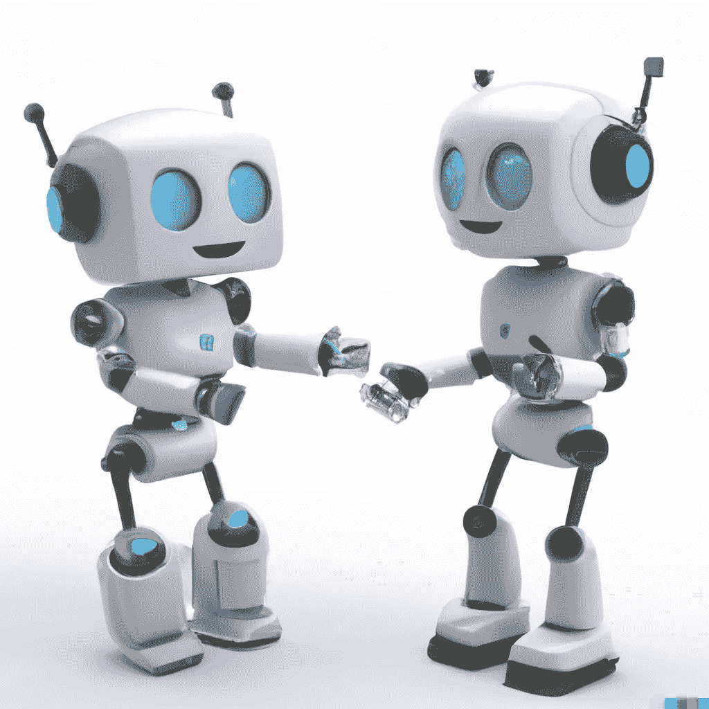
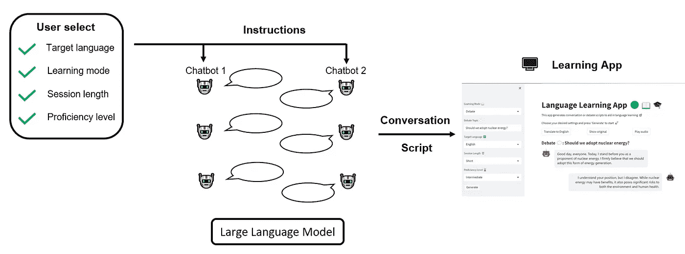
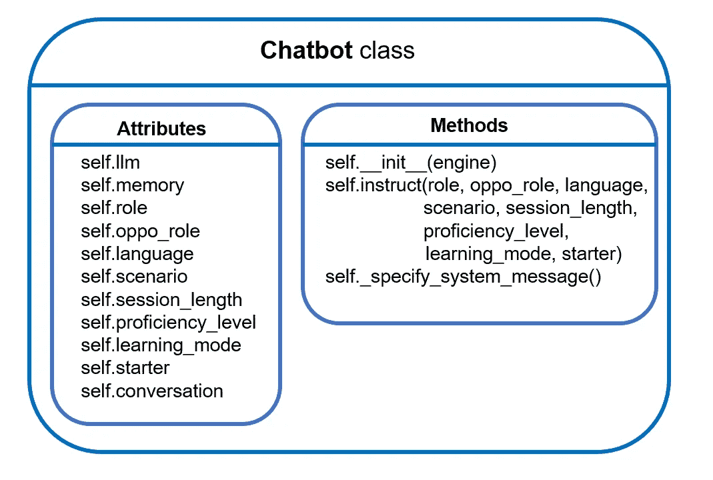
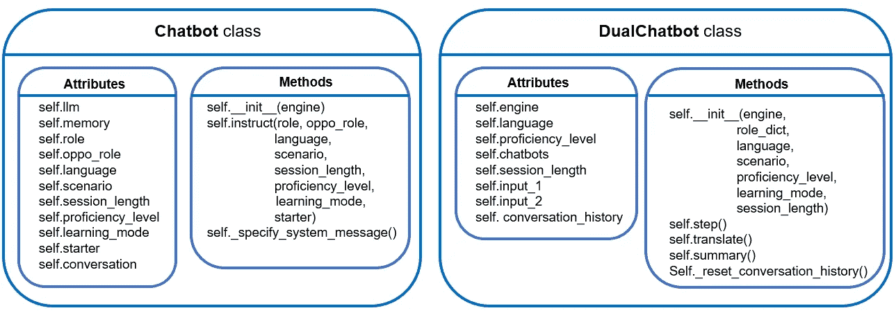
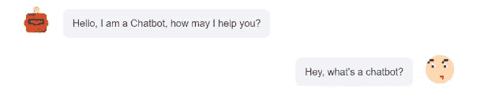
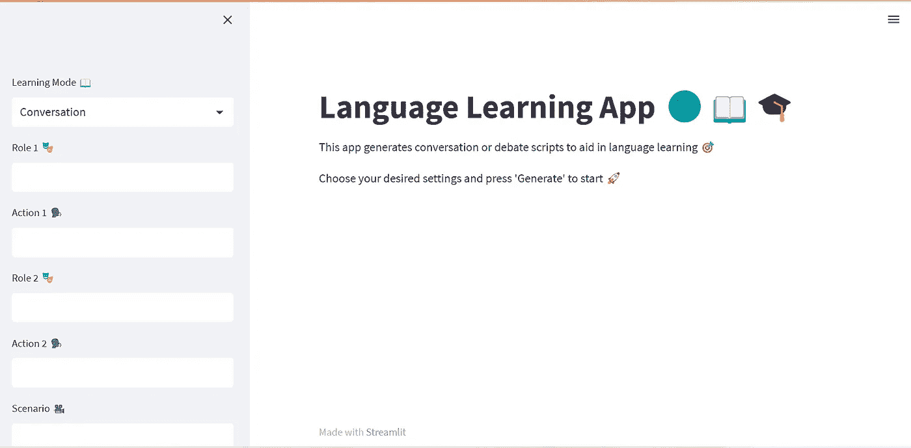

# 构建一个 AI 驱动的语言学习应用：从两个 AI 聊天中学习

> 原文：[`towardsdatascience.com/building-an-ai-powered-language-learning-app-learning-from-two-ai-chatting-6db7f9b0d7cd`](https://towardsdatascience.com/building-an-ai-powered-language-learning-app-learning-from-two-ai-chatting-6db7f9b0d7cd)

## 创建一个双聊天机器人语言学习应用的逐步教程，使用 Langchain、OpenAI、gTTS 和 Streamlit

[](https://shuaiguo.medium.com/?source=post_page-----6db7f9b0d7cd--------------------------------)[](https://towardsdatascience.com/?source=post_page-----6db7f9b0d7cd--------------------------------) [Shuai Guo](https://shuaiguo.medium.com/?source=post_page-----6db7f9b0d7cd--------------------------------)

·发表于 [Towards Data Science](https://towardsdatascience.com/?source=post_page-----6db7f9b0d7cd--------------------------------) ·25 分钟阅读·2023 年 6 月 26 日

--



DALL-E 提示：两个友好的机器人相互交谈。

当我第一次开始学习一门新语言时，我喜欢购买那些“对话练习”书籍。我发现这些书籍非常有用，因为它们帮助我理解了语言的运作——不仅仅是语法和词汇，还有人们在日常生活中如何实际使用它。

现在随着大型语言模型（LLMs）的兴起，我想到一个问题：我是否可以以一种更互动、动态和可扩展的形式来复制这些语言学习书籍？我能否利用 LLM 创建一个生成新鲜、按需对话的工具，为语言学习者提供帮助？

这个想法激发了我今天想与大家分享的项目——一个由人工智能驱动的语言学习应用程序，在这个应用中，学习者可以观察并学习两个 AI 聊天机器人进行的用户定义的**对话**或**辩论**。

关于所使用的技术栈，我使用了 Langchain、OpenAI API、gTTS 和 Streamlit 来创建这个应用，用户可以定义角色、场景或辩论主题，让 AI 生成内容。

开发的语言学习应用程序演示。（视频由作者提供）

如果你对它的工作原理感到好奇，那就跟随我一步一步了解构建这个互动双聊天机器人系统的过程 🗺️📍🚶‍♀️。

> 你可以在[这里](https://github.com/ShuaiGuo16/language_learning_app)*💻*找到完整的源代码。在这篇博客中，我们还将介绍关键的代码片段以解释这些想法。

既然如此，我们开始吧！

**内容目录**

· 1\. 项目概述

· 2\. 前置条件

∘ 2.1 LangChain

∘ 2.2 ConversationChain

· 3\. 项目设计

∘ 3.1 开发单一聊天机器人

∘ 3.2 开发双聊天机器人系统

· 4\. 使用 Streamlit 的应用界面设计

· 5\. 学习成果与未来扩展

· 6\. 结论

# 1\. 项目概述

如前所述，我们的目标是创建一个由两个对话式 AI 或聊天机器人驱动的独特语言学习应用程序。这个应用程序的创新之处在于让这些聊天机器人相互互动，创造出逼真的目标语言对话。用户可以观察这些 AI 驱动的对话，将其作为语言学习资源，并理解所选语言的实际使用。

在我们的应用程序中，用户应具备根据自身需求定制学习体验的灵活性。他们可以调整多个设置，包括目标语言、学习模式、会话时长和熟练程度。

## **目标语言** 🔤

用户可以选择他们希望学习的语言。这个选择将指导聊天机器人在互动过程中使用的语言。目前，我已经支持了英语——‘en’，德语——‘de’，西班牙语——‘es’，和法语——‘fr’，但只要 GPT 模型对这些语言有足够的知识，添加更多语言是微不足道的。

## 学习模式 📖

这个设置允许用户选择聊天机器人之间的对话风格。在**“对话”**模式下，用户可以定义**角色**（例如，顾客和服务员）和**动作**（点餐和接单），并指定一个**场景**（在餐厅），聊天机器人将模拟一个逼真的对话。在**“辩论”**模式下，用户被提示输入一个辩论**话题**（我们是否应该采用核能？）。然后，聊天机器人会围绕提供的话题进行激烈的辩论。

应用程序的界面应该是响应式的，并根据用户选择的学习模式动态调整，以提供无缝的用户体验。

## 会话时长 ⏰

会话时长设置让用户控制每次聊天机器人对话或辩论的持续时间。这意味着他们可以进行简短的快速对话，或根据个人喜好进行更长时间、更深入的讨论。

## 熟练程度 🏆

这个设置将聊天机器人的对话复杂性量身定制为用户的语言能力水平。初学者可能更喜欢简单的对话，而更高级的学习者则可以处理复杂的辩论或讨论。

一旦用户指定了这些设置，他们就可以启动会话，观看 AI 聊天机器人如何根据用户的偏好进行动态和互动的对话。我们的整体工作流程可以如下所示：



工作流程概述。用户指定的设置将用于配置提示，这些提示将提供给聊天机器人以生成对话。获得的脚本（连同用户设置）将用于填充应用程序界面。（图片由作者提供）

# 2\. 前提条件

在我们深入开发应用程序之前，让我们熟悉一下我们将使用的工具。在这一部分，我们将简要介绍 LangChain 库，特别是 `ConversationChain` 模块，它作为我们应用程序的核心部分。

## 2.1 LangChain

构建一个由大型语言模型（LLMs）驱动的应用程序涉及许多复杂性。你需要通过 API 调用与语言模型提供者进行接口连接，将这些模型与各种数据源连接，处理用户互动的历史记录，并设计执行复杂任务的管道。这正是 LangChain 库发挥作用的地方。

[**LangChain**](https://python.langchain.com/docs/get_started/introduction)是一个旨在简化基于大语言模型（LLM）应用程序开发的框架。它提供了一系列组件，解决了上述常见痛点。无论是管理与语言模型提供者的互动，组织数据连接，维护历史互动的记忆，还是定义复杂的任务管道，LangChain 都能应对自如。

LangChain 介绍的一个关键概念是“**Chain**”。本质上，链允许我们将多个组件组合在一起，以创建一个统一的应用程序。例如，LangChain 中的一个基本链类型是 `LLMChain`。它创建了一个管道，首先使用用户提供的输入键值格式化提示模板，然后将格式化的指令传递给 LLM，最后返回 LLM 的输出。

LangChain 主持各种链类型，包括 `RetrievalQAChain`，用于对文档进行问答，`SummarizationChain`，用于总结多个文档，以及我们今天的重点，即 `ConversationChain`。

## 2.2 ConversationChain

`ConversationChain` 用于通过提供一个消息交换和存储对话历史的框架来促进互动对话。以下是一个示例代码片段，以说明其用法：

```py
from langchain.chains import ConversationChain

# Create conversation chain
conversation = ConversationChain(memory, prompt, llm)

# Run conversation chain
conversation.predict(input="Hi there!")

# Obtain the LLM response: "Hello! How can I assist you today?"

# We can keep calling conversation chain
conversation.predict(input="I'm doing well! Just having a conversation with an AI.")
# Obtain the LLM response: "That sounds like fun! I'm happy to chat with you. Is there anything specific you'd like to talk about?"
```

在这个示例中，`ConversationChain` 接受三个输入，*memory*，一个持有互动历史的 LangChain 组件；*prompt*，输入到 LLM 的内容；以及 *llm*，核心的大型语言模型（例如，GPT-3.5-Turbo 等）。

一旦 `ConversationChain` 对象被实例化，我们只需使用用户输入调用 `conversation.predict()` 即可获得 LLM 的响应。`ConversationChain` 的便利之处在于，我们实际上可以多次调用 `conversation.predict()`，它会自动在后台记录消息历史。

在下一部分，我们将利用 `ConversationChain` 的强大功能创建我们的聊天机器人，并深入探讨记忆、提示模板和 LLM 的定义与使用。

> 如果你想了解更多关于 LangChain 的信息，可以查看他们的[官方文档](https://python.langchain.com/docs/get_started/introduction.html)。此外，这个[YouTube 播放列表](https://youtube.com/playlist?list=PLqZXAkvF1bPNQER9mLmDbntNfSpzdDIU5)也提供了全面的实践介绍。

# 3\. 项目设计

既然我们对要构建的内容和工具有了明确的了解，就该动手编写代码了！在这一部分，我们将专注于创建双聊天机器人交互的细节。首先，我们将探讨单一聊天机器人的类定义，然后扩展这一定义以创建一个双聊天机器人类，使我们的两个聊天机器人能够互相互动。我们将把使用 Streamlit 设计应用界面的工作留到第四部分。

## 3.1 开发一个单一的聊天机器人

在这一小节中，我们将一起开发一个单一的聊天机器人，随后将其集成到双聊天机器人系统中。让我们从整体的类设计开始，然后将注意力转向提示工程。

🏗️ **类设计**

我们的聊天机器人类应该能够管理一个单独的聊天机器人。这包括实例化一个以用户指定的 LLM 作为基础的聊天机器人，根据用户的意图提供指令，并支持交互式的多轮对话。考虑到这一点，让我们开始编码吧。

首先，导入必要的库：

```py
import os
import openai
from langchain.prompts import (
    ChatPromptTemplate, 
    MessagesPlaceholder, 
    SystemMessagePromptTemplate, 
    HumanMessagePromptTemplate
)
from langchain.prompts import PromptTemplate
from langchain.chains import LLMChain
from langchain.chains import ConversationChain
from langchain.chat_models import ChatOpenAI
from langchain.memory import ConversationBufferMemory
```

接下来，我们定义类构造函数：

```py
class Chatbot:
    """Class definition for a single chatbot with memory, created with LangChain."""

    def __init__(self, engine):
        """Select backbone large language model, as well as instantiate 
        the memory for creating language chain in LangChain.
        """

        # Instantiate llm
        if engine == 'OpenAI':
            # Reminder: need to set up openAI API key 
            # (e.g., via environment variable OPENAI_API_KEY)
            self.llm = ChatOpenAI(
                model_name="gpt-3.5-turbo",
                temperature=0.7
            )

        else:
            raise KeyError("Currently unsupported chat model type!")

        # Instantiate memory
        self.memory = ConversationBufferMemory(return_messages=True)
```

目前，你只能选择使用原生的 OpenAI API。然而，添加更多后端 LLM 是很简单的，因为 LangChain 支持多种类型（例如 Azure OpenAI 端点、Anthropic 聊天模型、Google Vertex AI 上的 PaLM API 等）。

除了 LLM，我们还需要实例化另一个重要的组件——*记忆*，它跟踪对话历史。在这里，我们使用`ConversationBufferMemory`来实现这一目的，它仅仅是在聊天机器人的当前输入前添加最后几条输入/输出。这是 LangChain 提供的最简单的记忆类型，对于我们当前的目的已经足够。

> 要全面了解其他类型的记忆，请参考[官方文档](https://python.langchain.com/docs/modules/memory/)。

继续，我们需要一个类方法，允许我们给聊天机器人下达指令并与其对话。这就是`self.instruct()`的作用：

```py
def instruct(self, role, oppo_role, language, scenario, 
             session_length, proficiency_level, 
             learning_mode, starter=False):
    """Determine the context of chatbot interaction. 
    """

    # Define language settings
    self.role = role
    self.oppo_role = oppo_role
    self.language = language
    self.scenario = scenario
    self.session_length = session_length
    self.proficiency_level = proficiency_level
    self.learning_mode = learning_mode
    self.starter = starter

    # Define prompt template
    prompt = ChatPromptTemplate.from_messages([
        SystemMessagePromptTemplate.from_template(self._specify_system_message()),
        MessagesPlaceholder(variable_name="history"),
        HumanMessagePromptTemplate.from_template("{input}")
    ])

    # Create conversation chain
    self.conversation = ConversationChain(memory=self.memory, prompt=prompt, 
                                          llm=self.llm, verbose=False)
```

+   **我们定义了一些设置，以便用户可以自定义他们的学习体验。**

除了在“第一部分 项目概述”中提到的内容外，我们还有四个新的属性：

`self.role/self.oppo_role:` 这个属性的形式是一个字典，用于记录角色名称及其对应的动作。例如：

```py
self.role = {'name': 'Customer', 'action': 'ordering food'}
```

`self.oppo_role`表示与当前聊天机器人进行对话的另一个聊天机器人所扮演的角色。这是重要的，因为当前聊天机器人需要了解它正在与谁沟通，以提供必要的上下文信息。

`self.scenario` 为对话设置了场景。对于“对话”学习模式，`self.scenario` 代表对话发生的地方。

正在发生；对于“辩论”模式，`self.scenario` 代表辩论的话题。

最后，`self.starter` 只是一个布尔标志，用于指示当前聊天机器人是否会发起对话。

+   **我们为聊天机器人构建提示。**

在 OpenAI 中，一个聊天模型通常接受一系列消息作为输入，并返回模型生成的消息作为输出。LangChain 支持 `SystemMessage`、`AIMessage` 和 `HumanMessage`：`SystemMessage` 帮助设置聊天机器人的行为，`AIMessage` 存储以前聊天机器人的响应，`HumanMessage` 提供聊天机器人需要回应的请求或评论。

LangChain 方便地提供了 `PromptTemplate` 来简化提示生成和处理。对于聊天机器人应用，我们需要为所有三种消息类型指定 `PromptTemplate`。最关键的部分是设置 `SystemMessage`，它控制聊天机器人的行为。我们有一个单独的方法 `self._specify_system_message()` 来处理这个问题，稍后我们会详细讨论。

+   **最后，我们把所有部分整合在一起，构建一个** `ConversationChain`。

🖋️ **提示设计**

我们现在的重点是指导聊天机器人根据用户的需求参与对话。为此，我们有 `self._specify_system_message()` 方法。该方法的签名如下所示：

```py
def _specify_system_message(self):
    """Specify the behavior of the chatbot, which consists of the following
       aspects:

    - general context: conducting conversation/debate under given scenario
    - the language spoken
    - purpose of the simulated conversation/debate
    - language complexity requirement
    - exchange length requirement
    - other nuance constraints

    Outputs:
    --------
    prompt: instructions for the chatbot.
    """ 
```

本质上，这个方法编译一个字符串，然后将其输入到 `SystemMessagePromptTemplate.from_template()` 以指示聊天机器人，如上面 `self.instruct()` 方法的定义所示。我们将在接下来的部分中分析这个“长字符串”，以了解每个语言学习需求如何融入提示中。

1️⃣ 会话长度

会话长度通过直接指定在一个会话中可以发生的最大交换次数来控制。这些数字目前是硬编码的。

```py
# Determine the number of exchanges between two bots
exchange_counts_dict = {
    'Short': {'Conversation': 8, 'Debate': 4},
    'Long': {'Conversation': 16, 'Debate': 8}
}
exchange_counts = exchange_counts_dict[self.session_length][self.learning_mode]
```

2️⃣ 聊天机器人在一次交换中可以说的句子数量

除了限制允许的总交换次数外，限制聊天机器人在一次交换中可以说多少也是有益的，或者等效地，限制句子数量。

在我的实验中，通常不需要在“对话”模式中限制这个，因为聊天机器人模拟真实对话，往往会在合理的长度内发言。然而，在“辩论”模式下，需要施加限制，否则聊天机器人可能会继续发言，最终生成一篇“文章” 😆。

类似于限制会话长度，限制演讲长度的数字也是硬编码的，并且与用户在目标语言中的熟练程度相对应：

```py
# Determine number of sentences in one debate round
argument_num_dict = {
    'Beginner': 4,
    'Intermediate': 6,
    'Advanced': 8
} 
```

3️⃣ 确定演讲复杂度

在这里，我们调整聊天机器人可以使用的语言复杂度级别：

```py
if self.proficiency_level == 'Beginner':
    lang_requirement = """use as basic and simple vocabulary and
    sentence structures as possible. Must avoid idioms, slang, 
    and complex grammatical constructs."""

elif self.proficiency_level == 'Intermediate':
    lang_requirement = """use a wider range of vocabulary and a variety of sentence structures. 
    You can include some idioms and colloquial expressions, 
    but avoid highly technical language or complex literary expressions."""

elif self.proficiency_level == 'Advanced':
    lang_requirement = """use sophisticated vocabulary, complex sentence structures, idioms, 
    colloquial expressions, and technical language where appropriate."""

else:
    raise KeyError('Currently unsupported proficiency level!')
```

4️⃣ 把所有内容整合起来！

以下是不同学习模式下的指令示例：

```py
# Compile bot instructions 
if self.learning_mode == 'Conversation':
    prompt = f"""You are an AI that is good at role-playing. 
    You are simulating a typical conversation happened {self.scenario}. 
    In this scenario, you are playing as a {self.role['name']} {self.role['action']}, speaking to a 
    {self.oppo_role['name']} {self.oppo_role['action']}.
    Your conversation should only be conducted in {self.language}. Do not translate.
    This simulated {self.learning_mode} is designed for {self.language} language learners to learn real-life 
    conversations in {self.language}. You should assume the learners' proficiency level in 
    {self.language} is {self.proficiency_level}. Therefore, you should {lang_requirement}.
    You should finish the conversation within {exchange_counts} exchanges with the {self.oppo_role['name']}. 
    Make your conversation with {self.oppo_role['name']} natural and typical in the considered scenario in 
    {self.language} cultural."""

elif self.learning_mode == 'Debate':
    prompt = f"""You are an AI that is good at debating. 
    You are now engaged in a debate with the following topic: {self.scenario}. 
    In this debate, you are taking on the role of a {self.role['name']}. 
    Always remember your stances in the debate.
    Your debate should only be conducted in {self.language}. Do not translate.
    This simulated debate is designed for {self.language} language learners to 
    learn {self.language}. You should assume the learners' proficiency level in {self.language} 
    is {self.proficiency_level}. Therefore, you should {lang_requirement}.
    You will exchange opinions with another AI (who plays the {self.oppo_role['name']} role) 
    {exchange_counts} times. 
    Everytime you speak, you can only speak no more than 
    {argument_num_dict[self.proficiency_level]} sentences."""

else:
    raise KeyError('Currently unsupported learning mode!')
```

5️⃣ 谁先发言？

最后，我们指示聊天机器人是否应该先发言或等待对方 AI 的回应：

```py
# Give bot instructions
if self.starter:
    # In case the current bot is the first one to speak
    prompt += f"You are leading the {self.learning_mode}. \n"

else:
    # In case the current bot is the second one to speak
    prompt += f"Wait for the {self.oppo_role['name']}'s statement."
```

现在我们已经完成了提示设计🎉 简要总结一下，这就是我们迄今为止开发的内容：



单一聊天机器人类。（图片由作者提供）

## 3.2 开发双聊天机器人系统

现在我们来到了令人兴奋的部分！在这一小节中，我们将开发一个双聊天机器人类，让两个聊天机器人相互互动💬💬

🏗️ **类设计**

由于之前开发的单一聊天机器人类，我们可以轻松地在类构造函数中实例化两个聊天机器人：

```py
class DualChatbot:
    """Class definition for dual-chatbots interaction system, 
      created with LangChain."""

    def __init__(self, engine, role_dict, language, scenario, proficiency_level, 
                 learning_mode, session_length):

        # Instantiate two chatbots
        self.engine = engine
        self.proficiency_level = proficiency_level
        self.language = language
        self.chatbots = role_dict
        for k in role_dict.keys():
            self.chatbots[k].update({'chatbot': Chatbot(engine)})

        # Assigning roles for two chatbots
        self.chatbots['role1']['chatbot'].instruct(role=self.chatbots['role1'], 
                                                   oppo_role=self.chatbots['role2'], 
                                                   language=language, scenario=scenario, 
                                                   session_length=session_length, 
                                                   proficiency_level=proficiency_level, 
                                                   learning_mode=learning_mode, starter=True)

        self.chatbots['role2']['chatbot'].instruct(role=self.chatbots['role2'], 
                                                   oppo_role=self.chatbots['role1'], 
                                                   language=language, scenario=scenario, 
                                                   session_length=session_length, 
                                                   proficiency_level=proficiency_level, 
                                                   learning_mode=learning_mode, starter=False) 

        # Add session length
        self.session_length = session_length

        # Prepare conversation
        self._reset_conversation_history()
```

`self.chatbots`是一个字典，用于存储与两个机器人相关的信息：

```py
# For "conversation" mode
self.chatbots= {
                'role1': {'name': 'Customer', 
                          'action': 'ordering food',
                          'chatbot': Chatbot()},
                'role2': {'name': 'Waitstaff', 
                          'action': 'taking the order',
                          'chatbot': Chatbot()}
              }

# For "debate" mode
self.chatbots= {
                'role1': {'name': 'Proponent', 
                          'chatbot': Chatbot()},
                'role2': {'name': 'Opponent', 
                          'chatbot': Chatbot()}
              }
```

`self._reset_conversation_history`用于启动一个新的对话历史并提供初始指令给聊天机器人：

```py
def _reset_conversation_history(self):
    """Reset the conversation history.
    """    
    # Placeholder for conversation history
    self.conversation_history = []

    # Inputs for two chatbots
    self.input1 = "Start the conversation."
    self.input2 = "" 
```

为了促进两个聊天机器人之间的互动，我们使用了`self.step()`方法。此方法允许两个机器人之间进行一轮互动：

```py
def step(self):
    """Make one exchange round between two chatbots. 
    """        

    # Chatbot1 speaks
    output1 = self.chatbots['role1']['chatbot'].conversation.predict(input=self.input1)
    self.conversation_history.append({"bot": self.chatbots['role1']['name'], "text": output1})

    # Pass output of chatbot1 as input to chatbot2
    self.input2 = output1

    # Chatbot2 speaks
    output2 = self.chatbots['role2']['chatbot'].conversation.predict(input=self.input2)
    self.conversation_history.append({"bot": self.chatbots['role2']['name'], "text": output2})

    # Pass output of chatbot2 as input to chatbot1
    self.input1 = output2

    # Translate responses
    translate1 = self.translate(output1)
    translate2 = self.translate(output2)

    return output1, output2, translate1, translate2
```

请注意，我们嵌入了一个名为`self.translate()`的方法。此方法的目的是将脚本翻译成英语。此功能对于语言学习者可能很有用，因为他们可以理解在目标语言中生成的对话的含义。

为实现翻译功能，我们可以使用基本的`LLMChain`，它需要一个后台 LLM 模型和一个指令提示：

```py
 def translate(self, message):
      """Translate the generated script into English. 
      """        

      if self.language == 'English':
          # No translation performed
          translation = 'Translation: ' + message

      else:
          # Instantiate translator
          if self.engine == 'OpenAI':
              # Reminder: need to set up openAI API key 
              # (e.g., via environment variable OPENAI_API_KEY)
              self.translator = ChatOpenAI(
                  model_name="gpt-3.5-turbo",
                  temperature=0.7
              )

          else:
              raise KeyError("Currently unsupported translation model type!")

          # Specify instruction
          instruction = """Translate the following sentence from {src_lang} 
          (source language) to {trg_lang} (target language).
          Here is the sentence in source language: \n
          {src_input}."""

          prompt = PromptTemplate(
              input_variables=["src_lang", "trg_lang", "src_input"],
              template=instruction,
          )

          # Create a language chain
          translator_chain = LLMChain(llm=self.translator, prompt=prompt)
          translation = translator_chain.predict(src_lang=self.language,
                                              trg_lang="English",
                                              src_input=message)

      return translation
```

最后，语言学习者能够获得生成对话脚本的关键语言学习点的总结可能是有益的，无论是关键词汇、语法点还是功能短语。为此，我们可以包含一个`self.summary()`方法：

```py
def summary(self, script):
    """Distill key language learning points from the generated scripts. 
    """  

    # Instantiate summary bot
    if self.engine == 'OpenAI':
        # Reminder: need to set up openAI API key 
        # (e.g., via environment variable OPENAI_API_KEY)
        self.summary_bot = ChatOpenAI(
            model_name="gpt-3.5-turbo",
            temperature=0.7
        )

    else:
        raise KeyError("Currently unsupported summary model type!")

    # Specify instruction
    instruction = """The following text is a simulated conversation in 
    {src_lang}. The goal of this text is to aid {src_lang} learners to learn
    real-life usage of {src_lang}. Therefore, your task is to summarize the key 
    learning points based on the given text. Specifically, you should summarize 
    the key vocabulary, grammar points, and function phrases that could be important 
    for students learning {src_lang}. Your summary should be conducted in English, but
    use examples from the text in the original language where appropriate.
    Remember your target students have a proficiency level of 
    {proficiency} in {src_lang}. You summarization must match with their 
    proficiency level. 

    The conversation is: \n
    {script}."""

    prompt = PromptTemplate(
        input_variables=["src_lang", "proficiency", "script"],
        template=instruction,
    )

    # Create a language chain
    summary_chain = LLMChain(llm=self.summary_bot, prompt=prompt)
    summary = summary_chain.predict(src_lang=self.language,
                                    proficiency=self.proficiency_level,
                                    script=script)

    return summary
```

类似于`self.translate()`方法，我们使用了一个基本的`LLMChain`来执行所需的任务。请注意，我们明确要求语言模型根据用户的熟练程度总结关键的语言学习点。

有了这一点，我们已经完成了双聊天机器人类的开发🥂 简要总结一下，这就是我们迄今为止开发的内容：



单一聊天机器人 & 双聊天机器人类。（图片由作者提供）

# 4. 使用 Streamlit 进行应用程序界面设计

我们现在准备开发用户界面🖥️ 对于这个项目，我们将使用 Streamlit 库来构建前端。

如果你不熟悉，Streamlit 是一个开源 Python 库，用于创建专注于数据科学和机器学习的互动式 Web 应用程序。它通过提供易于使用的 API、即时更新的实时代码重载、用于用户输入的互动小部件、对数据可视化库的支持以及包含丰富媒体的能力，简化了构建和部署应用程序的过程。

让我们从一个新的 Python 脚本 app.py 开始，并导入必要的库：

```py
import streamlit as st
from streamlit_chat import message
from chatbot import DualChatbot
import time
from gtts import gTTS
from io import BytesIO
```

除了主要的`streamlit`库，我们还导入了`streamlit_chat`库，这是一个由社区构建的 Streamlit 组件，专门用于创建聊天机器人用户界面。我们之前开发的`DualChatbot`类存储在*chatbot.py*文件中，因此也需要导入该文件。最后，我们导入`gTTS`，即*Google Text-to-Speech*，以为这个项目中的机器人生成的对话脚本添加音频。

在配置 Streamlit 界面之前，让我们首先定义语言学习设置：

```py
# Define the language learning settings
LANGUAGES = ['English', 'German', 'Spanish', 'French']
SESSION_LENGTHS = ['Short', 'Long']
PROFICIENCY_LEVELS = ['Beginner', 'Intermediate', 'Advanced']
MAX_EXCHANGE_COUNTS = {
    'Short': {'Conversation': 8, 'Debate': 4},
    'Long': {'Conversation': 16, 'Debate': 8}
}
AUDIO_SPEECH = {
    'English': 'en',
    'German': 'de',
    'Spanish': 'es',
    'French': 'fr'
}
AVATAR_SEED = [123, 42]

# Define backbone llm
engine = 'OpenAI'
```

`AVATAR_SEED`用于为不同的聊天机器人生成不同的头像图标。

我们开始设置用户界面的基本布局，并建立供用户选择的选项：

```py
# Set the title of the app
st.title('Language Learning App 🌍📖🎓')

# Set the description of the app
st.markdown("""
This app generates conversation or debate scripts to aid in language learning 🎯 

Choose your desired settings and press 'Generate' to start 🚀
""")

# Add a selectbox for learning mode
learning_mode = st.sidebar.selectbox('Learning Mode 📖', ('Conversation', 'Debate'))

if learning_mode == 'Conversation':
    role1 = st.sidebar.text_input('Role 1 🎭')
    action1 = st.sidebar.text_input('Action 1 🗣️')
    role2 = st.sidebar.text_input('Role 2 🎭')
    action2 = st.sidebar.text_input('Action 2 🗣️')
    scenario = st.sidebar.text_input('Scenario 🎥')
    time_delay = 2

    # Configure role dictionary
    role_dict = {
        'role1': {'name': role1, 'action': action1},
        'role2': {'name': role2, 'action': action2}
    }

else:
    scenario = st.sidebar.text_input('Debate Topic 💬')

    # Configure role dictionary
    role_dict = {
        'role1': {'name': 'Proponent'},
        'role2': {'name': 'Opponent'}
    }
    time_delay = 5

language = st.sidebar.selectbox('Target Language 🔤', LANGUAGES)
session_length = st.sidebar.selectbox('Session Length ⏰', SESSION_LENGTHS)
proficiency_level = st.sidebar.selectbox('Proficiency Level 🏆', PROFICIENCY_LEVELS)
```

注意引入了`time_delay`变量。它用于指定显示两个连续消息之间的等待时间。如果此延迟设置为零，则两个聊天机器人之间生成的交换将迅速出现在应用程序中（仅受限于 OpenAI 的响应时间）。然而，为了用户体验，在下一次交换出现之前，允许用户有足够的时间阅读生成的消息可能是有益的。

接下来，我们初始化 Streamlit 会话状态以存储用户特定的会话数据：

```py
if "bot1_mesg" not in st.session_state:
    st.session_state["bot1_mesg"] = []

if "bot2_mesg" not in st.session_state:
    st.session_state["bot2_mesg"] = []

if 'batch_flag' not in st.session_state:
    st.session_state["batch_flag"] = False

if 'translate_flag' not in st.session_state:
    st.session_state["translate_flag"] = False

if 'audio_flag' not in st.session_state:
    st.session_state["audio_flag"] = False

if 'message_counter' not in st.session_state:
    st.session_state["message_counter"] = 0
```

在这里我们回答两个问题：

1️⃣ 首先，我们为什么需要“session_state”？

在 Streamlit 中，每次用户与应用程序交互时，Streamlit 会从头到尾重新运行整个脚本，更新应用程序的输出。然而，Streamlit 的这种反应性特征在你想要维护用户特定数据或在不同交互或页面之间保留状态时可能会成为挑战。由于 Streamlit 在每次用户交互时都会重新加载脚本，常规 Python 变量会丢失其值，应用程序将重置为初始状态。

这就是`session_state`发挥作用的地方。Streamlit 中的会话状态提供了一种存储和检索数据的方式，这些数据在用户会话期间会持久存在，即使应用程序被重新加载或用户在不同组件或页面之间导航时。它允许你保持状态信息并为每个用户保留应用程序的上下文。

2️⃣ 其次，`session_state`中存储了哪些变量？

“**bot1_mesg**”是一个列表，其中每个元素都是一个字典，包含第一台聊天机器人说的话。它具有以下键：“role”、“content”和“translation”。同样的定义适用于“**bot2_mesg**”。

“**batch_flag**” 是一个布尔标志，用于指示对话交流是否一次性显示或有时间延迟。在当前设计中，当两个聊天机器人之间的对话首次生成时，它们的聊天将会有时间延迟地出现。之后，用户可能希望查看生成对话的翻译或添加音频，存储的对话消息（在“**bot1_mesg**”和“**bot2_mesg**”中）将一次性显示。这是有利的，因为我们不需要再次调用 OpenAI API，从而减少成本和延迟。

“**translate_flag**” 和 “**audio_flag**” 用于指示翻译和/或音频是否会显示在原始对话旁边。

“**message_counter**” 是一个计数器，每当一个来自聊天机器人的消息显示时，它会加一。这个想法是将消息 ID 与此计数器关联，因为 Streamlit 要求每个 UI 组件必须有唯一的 ID。

现在我们可以引入让两个聊天机器人互动并生成对话的逻辑：

```py
if 'dual_chatbots' not in st.session_state:

    if st.sidebar.button('Generate'):

        # Add flag to indicate if this is the first time running the script
        st.session_state["first_time_exec"] = True 

        with conversation_container:
            if learning_mode == 'Conversation':
                st.write(f"""#### The following conversation happens between 
                                {role1} and {role2} {scenario} 🎭""")

            else:
                st.write(f"""#### Debate 💬: {scenario}""")

            # Instantiate dual-chatbot system
            dual_chatbots = DualChatbot(engine, role_dict, language, scenario, 
                                        proficiency_level, learning_mode, session_length)
            st.session_state['dual_chatbots'] = dual_chatbots

            # Start exchanges
            for _ in range(MAX_EXCHANGE_COUNTS[session_length][learning_mode]):
                output1, output2, translate1, translate2 = dual_chatbots.step()

                mesg_1 = {"role": dual_chatbots.chatbots['role1']['name'], 
                        "content": output1, "translation": translate1}
                mesg_2 = {"role": dual_chatbots.chatbots['role2']['name'], 
                        "content": output2, "translation": translate2}

                new_count = show_messages(mesg_1, mesg_2, 
                                          st.session_state["message_counter"],
                                          time_delay=time_delay, batch=False,
                                          audio=False, translation=False)
                st.session_state["message_counter"] = new_count

                # Update session state
                st.session_state.bot1_mesg.append(mesg_1)
                st.session_state.bot2_mesg.append(mesg_2)
```

当第一次运行脚本时，会话状态中将没有“**dual_chatbots**”键（因为双聊天机器人尚未创建）。因此，当用户点击侧边栏上的“**Generate**”按钮时，上述代码片段将被执行。两个聊天机器人将往返聊天给定次数，所有对话消息都记录在会话状态中。`show_message()` 函数是一个辅助函数，旨在成为唯一的接口来样式化消息显示。我们将在本节末尾再次回到它。

现在，如果用户与应用互动并更改一些设置，Streamlit 将从头开始重新运行整个脚本。由于我们已经生成了所需的对话脚本，因此无需再次调用 OpenAI API。相反，我们可以简单地检索存储的信息：

```py
if 'dual_chatbots' in st.session_state:  

    # Show translation 
    if translate_col.button('Translate to English'):
        st.session_state['translate_flag'] = True
        st.session_state['batch_flag'] = True

    # Show original text
    if original_col.button('Show original'):
        st.session_state['translate_flag'] = False
        st.session_state['batch_flag'] = True

    # Append audio
    if audio_col.button('Play audio'):
        st.session_state['audio_flag'] = True
        st.session_state['batch_flag'] = True

    # Retrieve generated conversation & chatbots
    mesg1_list = st.session_state.bot1_mesg
    mesg2_list = st.session_state.bot2_mesg
    dual_chatbots = st.session_state['dual_chatbots']

    # Control message appearance
    if st.session_state["first_time_exec"]:
        st.session_state['first_time_exec'] = False

    else:
        # Show complete message
        with conversation_container:

            if learning_mode == 'Conversation':
                st.write(f"""#### {role1} and {role2} {scenario} 🎭""")

            else:
                st.write(f"""#### Debate 💬: {scenario}""")

            for mesg_1, mesg_2 in zip(mesg1_list, mesg2_list):
                new_count = show_messages(mesg_1, mesg_2, 
                                        st.session_state["message_counter"],
                                        time_delay=time_delay,
                                        batch=st.session_state['batch_flag'],
                                        audio=st.session_state['audio_flag'],
                                        translation=st.session_state['translate_flag'])
                st.session_state["message_counter"] = new_count
```

请注意会话状态中还有一个名为“**first_time_exec**”的标志。这个标志用于指示原始生成的脚本是否已经在应用中显示。如果我们去掉这个检查，应用第一次运行时相同的消息将会出现两次。

剩下的唯一任务是在 UI 中加入关键学习点的总结。为此，我们可以使用 `st.expander`。在 Streamlit 中，`st.expander` 对于我们希望以简洁形式呈现的大量内容或信息很有用，最初隐藏视图。当用户点击扩展器时，内容将展开或折叠，从而显示或隐藏额外的细节。

```py
 # Create summary for key learning points
    summary_expander = st.expander('Key Learning Points')
    scripts = []
    for mesg_1, mesg_2 in zip(mesg1_list, mesg2_list):
        for i, mesg in enumerate([mesg_1, mesg_2]):
            scripts.append(mesg['role'] + ': ' + mesg['content'])

    # Compile summary
    if "summary" not in st.session_state:
        summary = dual_chatbots.summary(scripts)
        st.session_state["summary"] = summary
    else:
        summary = st.session_state["summary"]

    with summary_expander:
        st.markdown(f"**Here is the learning summary:**")
        st.write(summary)
```

由于关键学习点的总结也是通过调用 OpenAI API 生成的，我们可以将生成的总结保存到会话状态中，以便如果脚本第二次运行时可以检索这些内容。

最后，让我们用辅助函数 `show_message` 完成 Streamlit UI 设计：

```py
def show_messages(mesg_1, mesg_2, message_counter,
                  time_delay, batch=False, audio=False,
                  translation=False):
    """Display conversation exchanges. This helper function supports
    displaying original texts, translated texts, and audio speech.

    Output:
    -------
    message_counter: updated counter for ID key
    """    

    for i, mesg in enumerate([mesg_1, mesg_2]):
        # Show original exchange ()
        message(f"{mesg['content']}", is_user=i==1, avatar_style="bottts", 
                seed=AVATAR_SEED[i],
                key=message_counter)
        message_counter += 1

        # Mimic time interval between conversations
        # (this time delay only appears when generating 
        # the conversation script for the first time)
        if not batch:
            time.sleep(time_delay)

        # Show translated exchange
        if translation:
            message(f"{mesg['translation']}", is_user=i==1, avatar_style="bottts", 
                    seed=AVATAR_SEED[i], 
                    key=message_counter)
            message_counter += 1

        # Append autio to the exchange
        if audio:
            tts = gTTS(text=mesg['content'], lang=AUDIO_SPEECH[language])  
            sound_file = BytesIO()
            tts.write_to_fp(sound_file)
            st.audio(sound_file)

    return message_counter
```

有几个要点需要进一步解释：

1️⃣ `message()` 对象

这部分属于 `streamlit_chat` 库，用于显示消息。在最简单的形式下，我们有：

```py
import streamlit as st
from streamlit_chat import message

message("Hellp, I am a Chatbot, how may I help you?") 
message("Hey, what's a chatbot", is_user=True) 
```



(图片来自 streamlit_chat [GitHub 仓库](https://github.com/AI-Yash/st-chat))

其中参数 `is_user` 决定消息是左对齐还是右对齐。在我们的 `show_message` 代码片段中，我们还指定了 `avatar_style` 和 `seed` 来设置两个聊天机器人的头像图标。`key` 参数仅用于为每条消息分配唯一的 ID，这是 Streamlit 所要求的。

2️⃣ 语音合成

在这里，我们使用 gTTS 库基于生成的脚本创建目标语言的音频语音。这个库使用起来非常简单，但它有一个限制：你只能使用一种声音。在生成音频对象后，我们可以使用 `st.audio` 为应用中的每条消息创建一个音频播放器。

太棒了！我们现在已经完成了 UI 设计 :) 在终端中输入以下命令：

```py
streamlit run app.py
```

你应该能在浏览器中看到应用，并能够与其互动。干得好！



开发的语言学习应用界面。（作者提供的图片）

# 5\. 学习与未来扩展

在结束之前，我想与你分享一些来自这个项目的关键学习和未来扩展的潜在方向。

1️⃣ 如何结束对话？

如果想要正确实现，这个问题实际上比看起来要复杂得多。理想情况下，我们希望对话自然结束。然而，在我的一些实验中，我注意到聊天机器人在对话结束时会不断互相说“谢谢”或“再见”，这不必要地延长了对话。一些可能的解决方案包括：

1.  交换轮次的硬限制：这可能是最简单的解决方案，也是我们在这个项目中采用的解决方案。然而，它可能并不总是理想的，因为它可能导致对话被过早终止。作为解决方法，我们已经在 `SystemMessage` 中指示机器人在设定的交换轮次内完成对话。

1.  使用“信号词”：聊天机器人可以被编程以在认为对话自然结束时说出特定的“信号词”（例如，“对话结束”）。然后可以实现逻辑来检测这些“信号词”并相应地结束循环。

1.  对话的后处理：一旦聊天机器人生成了对话，可以部署另一个 LLM 作为“编辑器”来修剪对话。这可能是一个有效的方法。然而，其缺点可能包括设计额外的提示、调用 OpenAI API 可能产生的额外费用以及增加的延迟。

2️⃣ 如何控制语言复杂性？

根据我的经验，开发的聊天机器人似乎在遵循语言复杂度的指示方面存在困难：有时即使熟练度设定为“初学者”，也会出现“中级”语言使用。这可能是因为当前的提示设计不足以明确区分不同复杂度级别之间的细微差别。

解决这个问题有几种方法：首先，我们可以进行*上下文学习*。也就是说，我们提供示例给聊天机器人，并展示我们期望在不同复杂度级别中使用的语言。另一种方法与我们之前讨论的类似：我们可以使用另一个 LLM 来调整对话的复杂性。实质上，这个额外的 LLM 可以利用生成的脚本作为起点，并重写一个新的脚本，以匹配用户期望的熟练程度。

3️⃣ 更好的文本到语音库？

当前项目仅使用了简单的 gTTS 库来合成语音，还有改进的空间。更先进的库提供了多语言支持、多说话者支持以及更自然的语音。比如：[*pyttsx3*](https://github.com/nateshmbhat/pyttsx3)、*Amazon Polly*、*IBM Watson TTS*、*Microsoft Azure Cognitive Services TTS*、[*Coqui.ai-TTS*](https://github.com/coqui-ai/TTS)，以及 Meta 最近发布的[*Voicebox*](https://ai.facebook.com/blog/voicebox-generative-ai-model-speech/)。

4️⃣ 更多不同场景的测试？

由于时间限制，我只测试了几个场景，以确定聊天机器人是否能够生成有意义的对话。这些测试发现了我最初提示设计中的问题，提供了改进的机会。额外的场景测试可能会揭示被忽视的领域，并提出改进提示的方法。我已编制了一份[全面的列表](https://github.com/ShuaiGuo16/language_learning_app/blob/main/Scenario_ideas.pdf) ，包括典型的“对话”场景和“辩论”话题。随意尝试这些场景，并评估当前提示设计的表现。

5️⃣ 包含其他形式的生成型 AI？

这个项目主要探索了文本到文本（聊天机器人）和文本到语音的生成型 AI 技术。我们可以通过利用其他形式的生成型 AI，如**文本到图像**或**文本到视频**，进一步提升用户体验。

+   **文本到图像**：对于每个用户输入的场景，我们可以使用文本到图像模型来创建相应的图像。将这些图像与生成的对话一起展示，可以提供视觉上下文并增强语言学习的参与感。像*StableDiffusion*、*Midjourney*和*DALL-E*这样的模型可以用于此目的。

+   **文本转视频**：为了让应用更具多媒体功能，我们可以根据输入场景生成视频。像[*RunwayML*](https://runwayml.com/)这样的工具可以帮助实现这一点。此外，我们甚至可以尝试创建数字人来呈现对话，如果执行得当，这可能会大大提升用户体验。[*Synthesia*](https://www.synthesia.io/tools/digital-human?utm_term=digital+avatar&utm_campaign=Basic+Search&utm_source=google&utm_medium=cpc&hsa_acc=5132031546&hsa_cam=17790491238&hsa_grp=142067774834&hsa_ad=611252817304&hsa_src=g&hsa_tgt=aud-2090130405830%3Akwd-625911181570&hsa_kw=digital+avatar&hsa_mt=p&hsa_net=adwords&hsa_ver=3&gclid=Cj0KCQjw4s-kBhDqARIsAN-ipH35DgWBi1zs_i0xDB5FBPvzMRgKLYsLvuN2d8MEAdKbw9jFL1TYB2saAsy-EALw_wcB)可能是一个合适的工具。

6️⃣ 更多语言学习设置？

目前，我们的应用主要集中于“对话”和“辩论”学习模式。然而，增长潜力巨大。例如，我们可以引入其他学习模式，如“讲故事”和“文化学习”。此外，我们可以扩展聊天机器人的互动，以适应更多专业和技术场景。这些可能包括会议、谈判，或销售与市场、法律、工程等领域。这样的功能可能对那些希望提升*专业*语言能力的语言学习者有帮助。

# 6\. 结论

哇，多么精彩的旅程！非常感谢你一直陪伴我 :) 从设计提示到创建聊天机器人，我们确实覆盖了很多领域。使用 LangChain 和 Streamlit，我们构建了一个功能齐全的双聊天机器人系统，可以用于语言学习，不错吧！

如果你觉得我的内容有用，可以通过[这里](https://www.buymeacoffee.com/Shuaiguo09f)买杯咖啡给我🤗 非常感谢你的支持！
