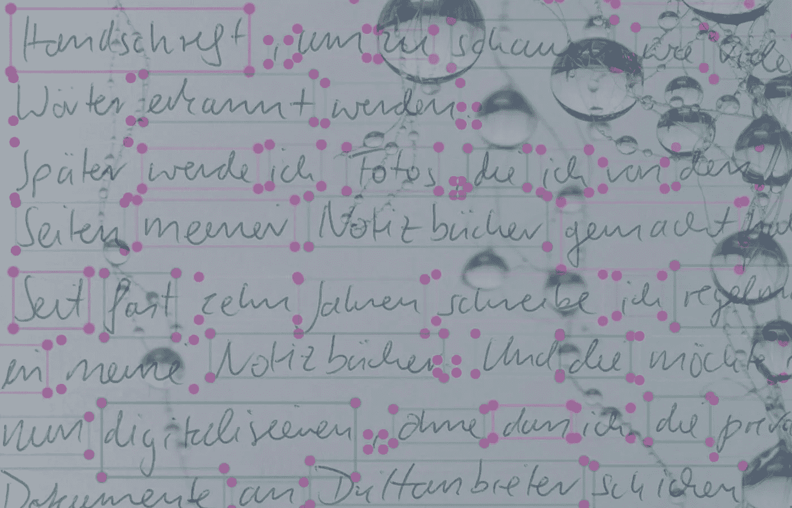

# 建立一个识别我手写字迹的人工智能 — 第一部分

> 原文：[`towardsdatascience.com/building-an-ai-to-recognize-my-handwriting-part-i-7bef0d3cdc46?source=collection_archive---------1-----------------------#2023-04-02`](https://towardsdatascience.com/building-an-ai-to-recognize-my-handwriting-part-i-7bef0d3cdc46?source=collection_archive---------1-----------------------#2023-04-02)

## 理论（及实践）起点

 [Jonas Schröder](https://jonas-schroeder.medium.com/?source=post_page-----7bef0d3cdc46--------------------------------)

·

[关注](https://medium.com/m/signin?actionUrl=https%3A%2F%2Fmedium.com%2F_%2Fsubscribe%2Fuser%2F76922c5a6a05&operation=register&redirect=https%3A%2F%2Ftowardsdatascience.com%2Fbuilding-an-ai-to-recognize-my-handwriting-part-i-7bef0d3cdc46&user=Jonas+Schr%C3%B6der&userId=76922c5a6a05&source=post_page-76922c5a6a05----7bef0d3cdc46---------------------post_header-----------) 发表在 [Towards Data Science](https://towardsdatascience.com/?source=post_page-----7bef0d3cdc46--------------------------------) ·12 分钟阅读·2023 年 4 月 2 日

--

图片由作者提供

大约十年前，受到蒂姆·费里斯和其他自助类书籍作者的启发，我开始定期在笔记本（实体书）上手写。我现在应该已经填满了 10 到 15 本书。将这些内容数字化岂不是很好吗？

本系列文章记录了我在开发一个能够**将我的手写笔记转换为标准文本文件**的人工智能的过程。根据我的手写字迹的样子，这将是非常具有挑战性的。

本篇文章，即第一部分，将涵盖基础知识。我将首先**进一步解释我的动机**，然后介绍**理论框架**，阐述如何处理这一问题。

我将简要介绍**卷积神经网络（CNNs）**，这是一种专门用于图像识别的人工神经网络。之后，我将尝试一种自动化的“识别”我手写文字的方法，目标是避免手动标注和注释输入数据。

随后的部分将更加实际，实际使用 CNNs 与训练数据。但我认为第一部分作为必要的基础，即使它以一个小失落结束，也能帮助理解。
