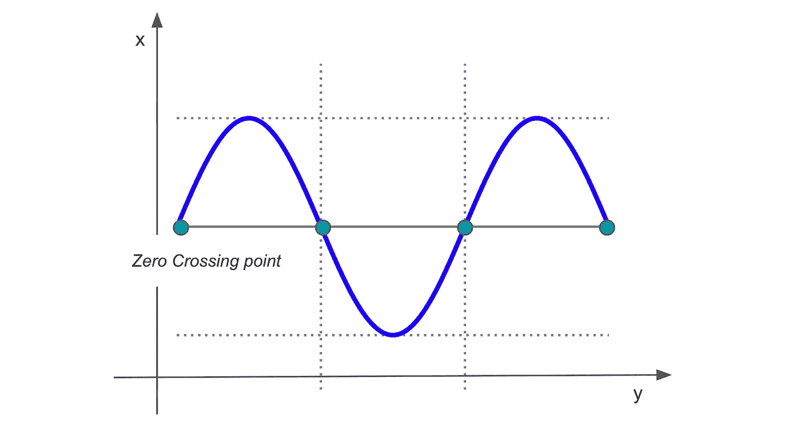
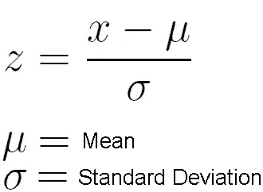
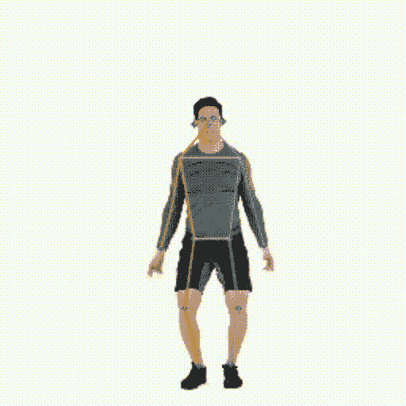
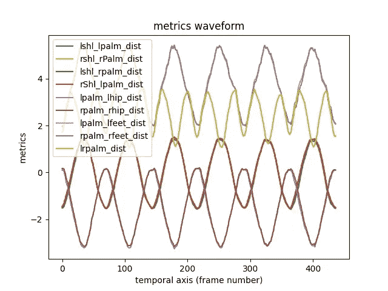
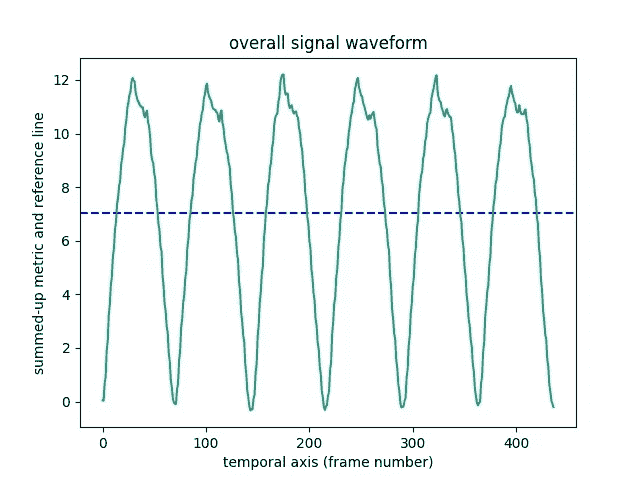
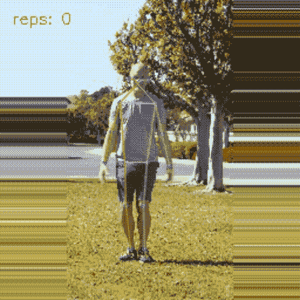
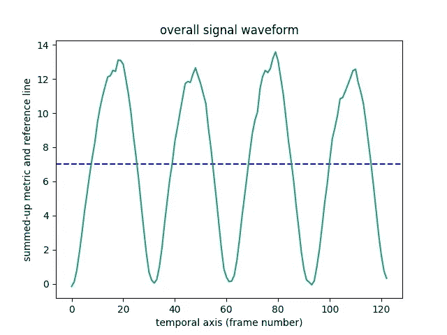

# 使用信号处理思想构建锻炼次数计数器

> 原文：[`towardsdatascience.com/building-an-exercise-rep-counter-using-ideas-from-signal-processing-fcdf14e76f81?source=collection_archive---------16-----------------------#2023-01-17`](https://towardsdatascience.com/building-an-exercise-rep-counter-using-ideas-from-signal-processing-fcdf14e76f81?source=collection_archive---------16-----------------------#2023-01-17)

## 使用零交叉方法设计特定类别的计数器

 [Aakash Agrawal](https://medium.com/@aakashagrawal?source=post_page-----fcdf14e76f81--------------------------------)

·

[关注](https://medium.com/m/signin?actionUrl=https%3A%2F%2Fmedium.com%2F_%2Fsubscribe%2Fuser%2F93ce827b6548&operation=register&redirect=https%3A%2F%2Ftowardsdatascience.com%2Fbuilding-an-exercise-rep-counter-using-ideas-from-signal-processing-fcdf14e76f81&user=Aakash+Agrawal&userId=93ce827b6548&source=post_page-93ce827b6548----fcdf14e76f81---------------------post_header-----------) 发表在 [Towards Data Science](https://towardsdatascience.com/?source=post_page-----fcdf14e76f81--------------------------------) ·7 分钟阅读·2023 年 1 月 17 日

--

照片由 [Karsten Winegeart](https://unsplash.com/@karsten116) 在 Unsplash.com 提供

*在这篇博客文章中，我讨论了一种非常新颖和独特的方法来构建实时锻炼次数计数器，这种方法在姿态估计的基础上应用了信号处理的思想。这种方法可以轻松地适应于构建其他类别的计数器。*

从进行健身活动时计数某种运动的次数，到测量生物事件（如心跳和脉搏计数），重复计数有着无数的应用，近年来在这一领域的研究获得了大量关注。在这篇博客中，我讨论了使用信号处理领域的一些简单概念来构建一个快速而准确的重复计数器的方法。

我将首先迅速覆盖基础知识，然后介绍基于信号的重复计数公式。该方法的实现可以在[这里](https://github.com/aakash2016/blog-codes/tree/master/signal-rep-count)找到。让我们从信号处理领域讨论一些可以用来构建重复计数器的概念开始。

## **零交叉**

数学函数或波形穿越轴的交点的参考点（交点不一定是 0）。该术语通常用于电子学中，指的是周期性电压和电流中的没有信号的点。

图：零交叉。图片由作者提供。

## **峰值检测**

在信号或波形中检测峰值（或位置），即观察到的突然偏离（你会看到尖峰）正常行为。检测这种偏差的技术是通过计算**z-score**，它捕捉信号的均值和标准差来计算偏差。

图：z-score 公式。图片由作者提供。

1.  在信号的任何位置，z-score 算法本质上计算前一个数据点窗口的滞后平均值和滞后标准差。

1.  通过计算范围 ***滞后平均值 +/- (阈值 * 滞后标准差);*** 来识别信号中的峰值；如果当前点的值超出了范围，则认为它是异常的一部分。

算法的更多细节和数学内容可以在[这里](https://stackoverflow.com/a/22640362/18635156)找到。

# 重复计数 <> 信号处理

读者自然会产生一个问题，即零交叉和峰值检测算法如何用于重复计数。我们来看看：

## 假设

认为一个人/物体由一组关键点（关注点）组成。例如，这些关键点可以是肩膀、臀部等人体关节。

为了简化，我将问题限制为运动重复计数，因为人体关键点的可获得性较高（这一思路可以很容易地扩展到其他关键点易于获得的对象）。我们可以使用开源姿态估计模型来计算身体关键点的空间位置。我在这篇博客中使用了 Tensorflow 的[**Movenet**](https://www.tensorflow.org/hub/tutorials/movenet)姿态估计模型进行说明。这个模型相当快速和准确。

我们**假设**任何重复的运动，例如锻炼，都可以看作是关键点或函数（度量）在关键点上的一组正弦波形。这些度量包括不同身体关键点组合之间的角度和距离。

## 算法

基本思想是在实时移动的时间窗口中检测这些信号度量的零交叉点。

使用零交叉点进行重复计数是一个两阶段的过程：

## 阶段 1：参考计算

这个阶段是给定锻炼的**一次性**活动。我们首先使用参考视频找到一个零交叉线，也就是参考线（对于锻炼重复计数器，它可以是教练的视频）。大多数步骤将在重复计数阶段中使用。

**a)** 我们使用 Movenet 姿势估计模型实时观察人体关键点。请考虑以下参考：

图：使用 Movenet 模型进行身体关键点估计。教练正在做跳跃杰克。GIF 由作者提供。

**b)** 然后，我们使用不同身体关键点的组合计算**度量**。度量可以是关键点之间的距离或角度。一些度量示例：左肩到左掌的距离（欧几里得/y 轴）、左肩处的夹角等。

这个想法是使用能够覆盖广泛运动范围的度量。我通常更喜欢面对前置摄像头进行锻炼；因此，选择欧几里得距离和 y 轴距离度量即可。如果您希望为侧面锻炼建立重复计数器，您可能需要考虑 x 轴距离。我还通过肩膀到肩膀的距离来规范化度量，以便重复计数不会受到摄像头距离的影响。

**c)** 帧级姿势估计会导致身体关键点的抖动，从而导致计算度量的抖动。我们使用低通滤波器使度量平滑，并去除度量距离和角度中的抖动，这使得参考计算和重复计数更加准确。有关该技术的更多详细信息，请参见[这里](https://medium.com/towards-data-science/towards-a-more-applicative-pose-estimation-bf18bc311228)。确保在计算度量之前身体关键点在框架内。

**d)** 接下来，我们筛选出静止的度量信号。我们计算这些信号的标准差，并去除低于固定阈值的信号。如果没有度量被筛选出去，我们使用标准差最大的前 3 个度量。对于锻炼重复计数器，我们考虑总共**18**个度量。对于上述参考和标准差阈值为**0.4**的情况，我们最终得到**8**个对重复性贡献最大的度量。

图：度量波形。图片由作者提供。

**e)** 最后，我们将所有剩余的非平稳度量在时间上相加，并计算使用总和信号的均值作为参考线。我们将这些度量和参考线（均值）的 ID 保存到一个***配置字典***中，以便在重复计数时使用。教练视频的参考线：

图：参考视频的整体信号波形。图片来源：作者。

仔细查看参考视频可以看出，总共有 6 个重复。这些重复实际上对应于上面整体信号中观察到的峰值。

## 阶段 2：重复计数

这一阶段的大部分步骤与参考计算阶段是相同的。

**a)** 给定一个测试视频，我们首先实时计算关键点和归一化度量（与前一步相同）。

**b)** 我们使用参考计算阶段的配置字典来确定此练习所需的非平稳度量，然后将这些度量在时间上相加，创建一个综合的整体信号。

**c)** 我们实时创建一个固定大小的**移动窗口**，并检查它与**参考线，即零交叉线**的**交集**。对于任何重复的动作，通常有两种状态，一种是运动的上升状态，另一种是下降状态，任意一种都是正常状态。

因此，对于一个重复动作，整体信号波形与参考线有两个交点。第一个交点表明该人已经达到动作的上升状态，第二个交点则表明该人回到正常状态，这个重复动作完成了。

就这样！

## 结果

让我们查看这种方法在测试视频上的表现。

图：使用零交叉技术进行的重复计数。GIF 来源：作者。

结果看起来不错，对吧？😎。这是上述测试视频的整体信号波形。直观地看，四个峰值对应于四个重复。

图：测试视频的整体信号波形。图片来源：作者。

## **方法的优点**

1.  这个算法相当**快速**和**准确**。

1.  这个想法是**直观的**，实现起来很简单。

1.  这种方法在生产环境中易于集成。

## **方法的缺点**

1.  不是一个**通用的**重复计数器（但这个想法可以适用于其他类别）。

1.  需要使用每个练习/类别的参考视频来计算零交叉线，因此难以**扩展**到大量的练习数据。

1.  在背景噪声较大的地方，姿态估计可能效果不好，从而导致重复计数结果不佳。

1.  对于那些整体信号由于不同度量最终相互平均而变得平坦的练习，这可能不起作用。

在这篇博客中，我强调了使用零交叉点来计数重复次数的想法；然而，另一种技术——**峰值检测**，我们在开始时简要讨论过，也可以用来实时检测重复次数。

# 有用的参考资料

[1]. [使用低通滤波器使姿态估计更有效](https://medium.com/towards-data-science/towards-a-more-applicative-pose-estimation-bf18bc311228)

[2]. [鲁棒的峰值检测算法（使用 z-分数）](https://stackoverflow.com/questions/22583391/peak-signal-detection-in-realtime-timeseries-data/22640362#22640362)

[3]. [MoveNet: 超快速且准确的姿态检测模型](https://www.tensorflow.org/hub/tutorials/movenet)

[4]. 该方法的实现可以在[这里](https://github.com/aakash2016/blog-codes)找到；请阅读库中的说明以获取使用方法。

希望你能理解如何使用信号处理技术来构建一个特定类别的重复计数器。我很想了解阅读这篇博客的人的反馈。我很乐意回答有关上述概念的任何疑问/问题。欢迎反馈。你可以通过 [Linkedin](https://www.linkedin.com/in/akash2016123/) 联系我。

# 谢谢！
