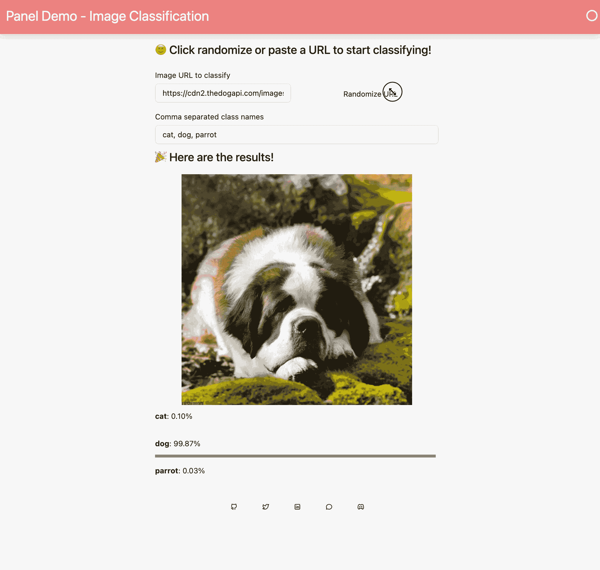

# 在 Panel 中构建交互式 ML 仪表板

> 原文：[`towardsdatascience.com/building-an-interactive-ml-dashboard-in-panel-d3e344ea7126`](https://towardsdatascience.com/building-an-interactive-ml-dashboard-in-panel-d3e344ea7126)

[](https://sophiamyang.medium.com/?source=post_page-----d3e344ea7126--------------------------------)[](https://towardsdatascience.com/?source=post_page-----d3e344ea7126--------------------------------) [Sophia Yang, Ph.D.](https://sophiamyang.medium.com/?source=post_page-----d3e344ea7126--------------------------------)

·发表于 [Towards Data Science](https://towardsdatascience.com/?source=post_page-----d3e344ea7126--------------------------------) ·阅读时长 6 分钟·2023 年 6 月 6 日

--

作者：[Andrew Huang](https://www.linkedin.com/in/huangandrew12/)、[Sophia Yang](https://www.linkedin.com/in/sophiamyang/)、[Philipp Rudiger](https://www.linkedin.com/in/philippjfr/)



图像分类应用演示。

HoloViz Panel 是一个多功能的 Python 库，能够让开发人员和数据科学家轻松构建交互式可视化。无论你是在进行机器学习项目、开发 web 应用，还是设计数据仪表板，Panel 提供了一套强大的工具和功能，以增强你的数据探索和展示能力。在这篇博客文章中，我们将深入探讨 HoloViz Panel 的激动人心的功能，探索它如何彻底改变你的数据可视化工作流程，并演示如何用大约 100 行代码制作这样的应用。

尝试应用并查看代码：

+   [Hugging Face Space](https://huggingface.co/spaces/Panel-Org/panel-template)

+   [Anaconda 上的应用](https://heroic-milk-snake.anacondaapps.cloud/test-image-classification)

+   [Hugging Face 上的应用](https://panel-org-panel-template.hf.space/app)

+   [Anaconda Notebook 上的代码](https://anaconda.cloud/api/nbserve/launch_notebook?nb_url=https%3A%2F%2Fanaconda.cloud%2Fapi%2Fprojects%2F7c7966e4-0696-4900-b148-7bbd13543c15%2Fversions%2F81e7ac6b-cd37-4f0d-9626-19c05845d3f3%2Ffiles%2Ftest-image-classification.ipynb)

+   [Hugging Face 上的代码](https://huggingface.co/spaces/Panel-Org/panel-template/blob/main/app.py)

# 充分利用 ML/AI 的力量

ML/AI 已成为数据分析和决策过程中的重要组成部分。借助 Panel，你可以将 ML 模型和结果无缝集成到你的可视化中。在这篇博客文章中，我们将探讨如何使用 OpenAI CLIP 模型进行图像分类任务。

CLIP 在大量的图像-文本对数据集上进行预训练，使其能够理解图像和相应的文本描述，并适用于各种下游任务，如图像分类。

我们使用了两个与 ML 相关的函数来执行图像分类任务。第一个函数`load_processor_model`使我们能够从 Hugging Face 加载预训练的 CLIP 模型。第二个函数`get_similarity_score`计算图像与提供的类别标签列表之间的相似度。

```py
@pn.cache
def load_processor_model(
    processor_name: str, model_name: str
) -> Tuple[CLIPProcessor, CLIPModel]:
    processor = CLIPProcessor.from_pretrained(processor_name)
    model = CLIPModel.from_pretrained(model_name)
    return processor, model

def get_similarity_scores(class_items: List[str], image: Image) -> List[float]:
    processor, model = load_processor_model(
        "openai/clip-vit-base-patch32", "openai/clip-vit-base-patch32"
    )
    inputs = processor(
        text=class_items,
        images=[image],
        return_tensors="pt",  # pytorch tensors
    )
    outputs = model(**inputs)
    logits_per_image = outputs.logits_per_image
    class_likelihoods = logits_per_image.softmax(dim=1).detach().numpy()
    return class_likelihoods[0]py
```

# 为交互性绑定小部件

Panel 的一个关键优势是其将小部件绑定到函数的能力。这种功能为用户提供了一个直观的界面，以便操作底层数据并通过交互获得更深入的见解。

## Python 函数

在我们的示例中，我们有一个`process_input`函数，它将从图像分类模型获得的相似度分数格式化为具有良好 UI 的 Panel 对象。实际函数利用了 async；如果你不熟悉 async，不用担心！我们将在后面的部分解释它，但请注意 async**不是**使用 Panel 的要求——Panel 只是支持它！

```py
async def process_inputs(class_names: List[str], image_url: str):
    """
    High level function that takes in the user inputs and returns the
    classification results as panel objects.
    """
    ...
    yield results
```

## 面板小部件

我们使用了两个小部件来与此函数进行交互。

1.  `image_url`是一个 TextInput 小部件，允许输入任何字符串作为图像 URL。

1.  `class_names`是另一个 TextInput 小部件，它接受模型分类的可能类名。

```py
image_url = pn.widgets.TextInput(
    name="Image URL to classify",
    value=pn.bind(random_url, randomize_url),
)
class_names = pn.widgets.TextInput(
    name="Comma separated class names",
    placeholder="Enter possible class names, e.g. cat, dog",
    value="cat, dog, parrot",
)
```

根据`process_inputs`函数签名，它接受两个参数：`class_names`和`image_url`。我们可以使用`pn.bind`将每个参数/关键字参数绑定到一个小部件，如下所示：

```py
interactive_result = pn.panel(
    pn.bind(process_inputs, image_url=image_url, class_names=class_names),
    height=600,
)
```

+   第一个位置参数是函数名。

+   关键字参数在匹配函数签名后，组件的值会绑定到函数的关键字参数上。

为了澄清，如果小部件命名为`image_url_input`而不是`image_url`，则调用将是：

```py
pn.bind(process_inputs, image_url=image_url_input, ...)
```

# 添加模板设计样式

应用程序和仪表板的美观在吸引观众方面发挥了关键作用。Panel 使你能够根据流行的设计（如 Material 或 Fast）为你的可视化添加样式，使你能够创建视觉上吸引人且专业的界面。

在这个示例中，我们使用了一个`bootstrap`模板，我们可以控制在多个区域（如`title`和`main`）显示的内容，并可以为各种组件指定尺寸和颜色：

```py
pn.extension(design="bootstrap", sizing_mode="stretch_width")
```

我们还将`Progress`条设计设置为`Material`。

```py
row_bar = pn.indicators.Progress(
    ...
    design=pn.theme.Material,
)
```

注意，你也可以使用`styles`和`stylesheets`！

# 计算密集型任务的缓存

一些数据处理任务可能计算成本高，导致性能缓慢。Panel 提供了缓存机制，使你可以存储昂贵计算的结果，并在需要时重用它们，从而显著提高应用程序的响应速度。

在我们的示例中，我们使用 `pn.cache` 装饰器缓存了 `load_processor_model` 的输出。这意味着我们不需要多次下载和加载模型。这一步骤将使你的应用程序感觉更加响应迅速！

附加说明：为了进一步响应性，还可以参考 [defer_loading](https://panel.holoviz.org/how_to/callbacks/load.html) 和 [加载指示器](https://panel.holoviz.org/how_to/param/examples/loading.html)。

```py
@pn.cache
def load_processor_model(
    processor_name: str, model_name: str
) -> Tuple[CLIPProcessor, CLIPModel]:
    processor = CLIPProcessor.from_pretrained(processor_name)
    model = CLIPModel.from_pretrained(model_name)
    return processor, model
```

# 使用 JavaScript 实现功能桥接

虽然 Panel 提供了丰富的互动功能，但你可能偶尔需要通过 JavaScript 实现额外的功能。将 JavaScript 代码与 Panel 可视化集成非常简单，从而扩展其功能。通过弥合 Python 和 JavaScript 之间的差距，你可以创建更高级的可视化效果，添加超出 Panel 原生功能范围的互动元素。

在我们应用程序的底部，你可能会看到一组图标，代表 Panel 的社交媒体账户，包括 LinkedIn 和 Twitter。当你点击这些图标中的任何一个时，你会被自动重定向到相应的社交媒体个人资料。这个无缝的点击和重定向功能是通过 Panel 的 JavaScript 集成 `js_on_click` 方法实现的：

```py
footer_row = pn.Row(pn.Spacer(), align="center")
for icon, url in ICON_URLS.items():
    href_button = pn.widgets.Button(icon=icon, width=35, height=35)
    href_button.js_on_click(code=f"window.open('{url}')")
    footer_row.append(href_button)
footer_row.append(pn.Spacer())
```

# 理解同步与异步支持

异步编程因其高效处理并发任务的能力而受到欢迎。我们将讨论同步与异步执行的差异，并探索 Panel 对异步操作的支持。理解这些概念将使你能够在 Panel 中利用异步功能，提高应用程序的性能和响应性。

使用 `async` 使你的函数可以在单线程内进行协作多任务处理，并允许 IO 任务在后台进行。例如，当我们从互联网获取一张随机图片时，我们不知道需要等待多久，并且我们不希望在等待时停止程序。异步实现了并发执行，使我们在等待时可以执行其他任务，确保应用程序的响应性。记得添加相应的 await。

```py
async def open_image_url(image_url: str) -> Image:
    async with aiohttp.ClientSession() as session:
        async with session.get(image_url) as resp:
            return Image.open(io.BytesIO(await resp.read()))
```

如果你对异步不熟悉，也可以将其改写为同步！异步**不是**使用 Panel 的必需条件！

```py
def open_image_url(image_url: str) -> Image:
    with requests.get(image_url) as resp:
        return Image.open(io.BytesIO(resp.read()))
```

# 其他尝试的想法

在这里，我们仅探讨了一个想法；你可以尝试更多：

+   互动文本生成：利用 Hugging Face 强大的语言模型，如 GPT 或 Transformer，生成互动文本。结合 Panel 的小部件绑定功能与 Hugging Face 模型，创建动态界面，让用户输入提示或调整参数以生成自定义文本输出。

+   情感分析和文本分类：使用 Hugging Face 的预训练情感分析或文本分类模型构建互动仪表盘。使用 Panel，用户可以输入文本样本，展示预测的情感或类别概率，并通过互动可视化探索模型预测。

+   语言翻译：利用 Hugging Face 的翻译模型创建互动语言翻译界面。使用 Panel，用户可以输入一种语言的文本并可视化翻译后的输出，方便实验和探索翻译质量。

+   命名实体识别（NER）：将 Hugging Face 的 NER 模型与 Panel 结合，构建互动 NER 可视化。用户可以输入文本并可视化识别的实体，突出实体范围，并通过直观界面探索模型预测。

+   聊天机器人和对话 AI：使用 Hugging Face 的对话模型，你可以创建互动聊天机器人或对话代理。Panel 使用户能够与聊天机器人进行互动对话，展示响应，并通过互动小部件自定义聊天机器人的行为。

+   模型微调和评估：使用 Panel 创建互动界面，以微调和评估 Hugging Face 模型。用户可以输入自定义训练数据，调整超参数，展示训练进展，并通过互动可视化评估模型性能。

+   模型比较和基准测试：使用 Panel 构建互动界面，以比较和基准测试不同 Hugging Face 模型在特定 NLP 任务中的表现。用户可以输入样本数据，比较模型预测，展示性能指标，并探索不同模型之间的权衡。

查看我们的应用程序画廊以获取其他创意！祝实验愉快！

# 加入我们的社区

Panel 社区充满活力和支持，经验丰富的开发者和数据科学家乐于帮助和分享他们的知识。加入我们并与我们联系：

+   [Discord](https://discord.com/invite/aRFhC3Dz9w)

+   [Discourse](https://discourse.holoviz.org/)

+   [Twitter](https://twitter.com/Panel_Org)

+   [LinkedIn](https://www.linkedin.com/company/panel-org)

+   [Github](https://github.com/holoviz/panel)

*最初发布于* [*https://blog.holoviz.org*](https://blog.holoviz.org/building_an_interactive_ml_dashboard_in_panel.html)*。*

作者 [Andrew Huang](https://www.linkedin.com/in/huangandrew12/)、[Sophia Yang](https://www.linkedin.com/in/sophiamyang/)、[Philipp Rudiger](https://www.linkedin.com/in/philippjfr/)

Sophia Yang 是高级数据科学家。通过 [LinkedIn](https://www.linkedin.com/in/sophiamyang/)、[Twitter](https://twitter.com/sophiamyang) 和 [YouTube](https://www.youtube.com/SophiaYangDS) 与我联系，并加入 DS/ML [书籍俱乐部](https://dsbookclub.github.io/) ❤️
