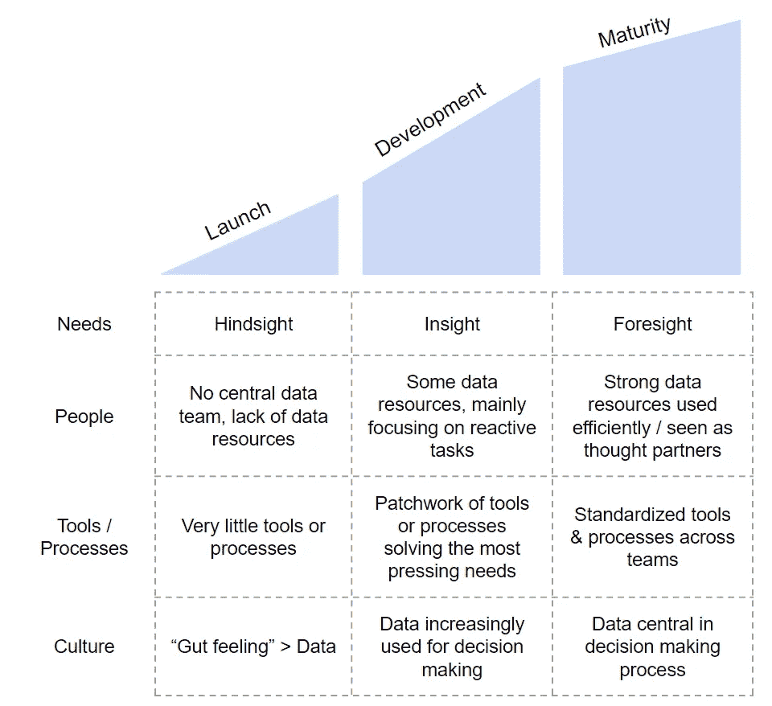
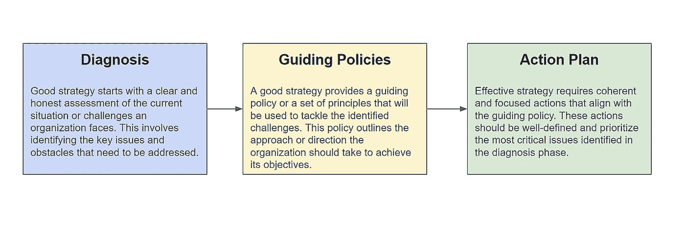

# 建立分析成熟的组织（AMO）

> 原文：[`towardsdatascience.com/building-analytically-mature-organizations-amo-b54f8243ef3a?source=collection_archive---------1-----------------------#2023-10-30`](https://towardsdatascience.com/building-analytically-mature-organizations-amo-b54f8243ef3a?source=collection_archive---------1-----------------------#2023-10-30)

## 一些简单的框架可以帮助确定您组织的分析需求以及如何使其更具数据驱动性

 [Jordan Gomes](https://medium.com/@jordangom?source=post_page-----b54f8243ef3a--------------------------------)

·

[关注](https://medium.com/m/signin?actionUrl=https%3A%2F%2Fmedium.com%2F_%2Fsubscribe%2Fuser%2Fbd72dcfe2a5a&operation=register&redirect=https%3A%2F%2Ftowardsdatascience.com%2Fbuilding-analytically-mature-organizations-amo-b54f8243ef3a&user=Jordan+Gomes&userId=bd72dcfe2a5a&source=post_page-bd72dcfe2a5a----b54f8243ef3a---------------------post_header-----------) 发表在 [Towards Data Science](https://towardsdatascience.com/?source=post_page-----b54f8243ef3a--------------------------------) ·13 分钟阅读·2023 年 10 月 30 日

--

了解您组织的分析成熟度可以为您作为数据专业人士提供强大的优势。它将使您的“非分析”决策更为明智（从“项目优先级”到“如何展示您的发现”），并帮助您制定长期目标。这确实是一种优势——并非所有数据专业人士都愿意退一步设计长期目标（更少的人能实现这些长期目标）。

本文分为 3 部分：

+   第一部分：理解分析成熟度

+   第二部分：移动阶段

+   第三部分：“成熟”组织是什么

让我们深入探讨！

# 了解分析成熟度

**任何组织（团队、产品、公司等）在某个时间点都会处于特定的分析成熟度阶段。就像人类“爬行、走路然后跑步”一样，组织也经历相同的阶段。这是自然界的定律之一：一切都经历创作、发展和成熟。**

有[一些有趣的框架](https://www.mdpi.com/2078-2489/11/3/142)¹与分析成熟度相关，具有不同的组件和重点。从个人经验来看，我发现通过以下 4 个组件来看待一个组织是最有用和可操作的：

+   其需求：Robert D. Peng 和 Elizabeth Matsui 在“[数据的艺术](https://www.amazon.com/Art-Data-Science-Roger-Peng/dp/1365061469)”中写道，主要有 6 种类型的问题：描述性问题、探索性问题、推论性问题、预测性问题、因果性问题和机制性问题。你被问到的问题类型通常是组织成熟度水平的一个很好的指标——一个低成熟度的组织通常对描述性和探索性数据研究感兴趣，而一个高级成熟度的组织会提出更多预测性和因果性问题。

+   其人员：另一个分析成熟度的关键组件是人员，包括能力和资源。取决于组织拥有多少数据资源以及他们的能力有多强。

+   其工具和流程：是否有标准化的工具供数据专业人员使用？我们是否有标准化的流程（例如，优先级、模板等）供数据团队使用？

+   其文化：在决策过程中直觉与数据的分配比例如何？

根据你所在组织在这些组件上的评分，它将落入这三个阶段之一：

+   **启动阶段：** 在这个阶段，组织需要基本的报告来了解已经发生了什么（“事后诸葛亮”）。没有中央数据团队，可能甚至没有数据分析师——数据研究由一些数据敏锐的操作人员在他们的 9 到 5 工作之外完成。也没有工具，没有流程，没有关于查看特定现象时应使用什么视角的明确一致意见。这导致了很多噪音（例如，不同团队有不同的流失定义，导致后续意见不一致）。在文化方面，尽管每个人都同意数据应该指导决策过程，但由于数据不足（或对数据的不信任），很多决策都是通过“有依据的直觉”来做出的。

+   **发展阶段：** 组织对市场及其应该跟踪的一些关键指标有了良好的可见性。现在，它需要理解为什么事情以某种方式发展（“洞察”）。团队开始得到数据专业人士的支持（无论是嵌入在团队内部还是在集中式数据团队中）。数据基础设施正从 Google Spreadsheets 缓慢转变为更为强大的工具。为了分类和优先处理所有的数据请求，首批数据专业人士建立了基本的优先级原则和票务系统（即 Google Form）。各团队开始采用共同的视角，因此数据在决策中越来越被依赖。非数据专业人士在数据问题上变得更聪明，通过工具，非数据专业人士可以自己查看数据。

+   **成熟阶段：** 组织理解了为什么事情以某种方式发展，并现在可以预测和影响未来的变化（“前瞻性”）。集中式数据团队开始形成，充当主动的思想合作伙伴（与之前阶段的“被动支持”相比）。工具、流程和指标正在标准化。数据在每个决策过程中都被期待。

了解分析成熟度（图片由作者提供）

上面的图像是对现实生活的简化。实际上，组织在每个组件上的评分可能非常不同——但你可以大致理解其要点。这个框架的美妙之处在于：

+   它为你提供了一种结构化的方式来发现阻碍组织分析成长的关键因素。

+   它可以帮助你精准定位组织在其旅程中的位置——以及下一步是什么。

这正是你在知道如何使用这个框架时获得强大优势的原因：它提供了一种方式来理解你当前的位置和你可能达到的目标，并诊断为何尚未达到目标。你的任务则是“仅仅”制定一个策略来去除障碍——这正是我们在接下来要探讨的内容。

# 阶段推进

理查德·鲁梅特在[《好战略，坏战略》](https://www.amazon.com/Good-Strategy-Bad-Difference-Matters/dp/0307886239)中写道：“战略工作的核心始终是相同的：发现情况中的关键因素，并设计协调和聚焦行动的方法以应对这些因素”。

当你想提升组织的分析成熟度时，这同样适用：你需要找出帮助你迈向下一步的关键因素，并设计一个计划来实现目标。我们上面看到的框架——将分析成熟度分解为 4 个组件：组织的需求、数据资源、流程与工具以及数据文化——可以帮助你找出组织中的差距——但找出差距只是工作中的 20%。让我们讨论剩下的 80%。

## 好战略，坏战略框架

我喜欢理查德·鲁梅尔特的书，我认为它提供了一个出色的框架来思考这个问题。他解释说，一个好的战略有三个要素：

+   **诊断**：框架中最重要的部分是诊断——它是你整个逻辑方法的基础。你的诊断应当使你能够了解当前的情况，同时也能了解组织存在的原因和“为什么”。

+   **一些指导原则**：从这些诊断中，你可以得出一些指导原则——一旦你开始提升分析成熟度，这些原则将帮助你使决策过程更简单，并帮助你在时间上保持正确的轨道。

+   **遵循上述的连贯行动计划**：凭借你的诊断和指导原则，你的主要任务是决定你希望在什么时间范围内达到什么目标，以及你将如何实现这一目标。

良好战略与差劲战略框架（图源：作者）

## 从诊断开始

“表述清楚的问题已解决一半”——约翰·杜威

思路是理解当前情况及其背后的真正“原因”。你不想解决症状——你的目标是深入根本原因，并修复需要修复的地方。

这里有一些进行良好诊断的技巧：

1.  从我们之前看到的 4 个维度出发：需求/人员/工具与流程/文化，使用这些视角评估你的组织，并找出每个领域的根本原因。

1.  获取当前痛点和解决方案的数据：

1.  采访人员：了解人们，他们的工作，他们的决策过程，以及他们如何在日常工作中使用数据。

1.  影子观察：类似地，影子观察可以是深入了解他们日常工作的好方法，并且可以发现仅通过采访无法获得的见解。

1.  发送调查问卷：根据你的组织规模，发送调查问卷可以帮助你获取更多的定量数据。附加好处：它还可以让你开始跟踪组织对“分析”的感受，并给你一个可以后续报告的基准。

1.  做“文献回顾”，既包括内部（回顾之前的工作，了解人们如何尝试解决之前的问题，成功与否，以及原因），也包括外部（网上有很多免费的内容，你考虑的问题很可能已经被记录和讨论过（无论是在 HBR 上的一篇好文章，还是在一个晦涩的分析爱好者论坛上）。获取他人对不同问题解决方案的看法总是非常有帮助的）。

1.  练习 5 个“为什么”：每次你发现新的见解时，问自己为什么。你需要从整体的角度来看待问题，理解组织所处状况的关键原因。请注意，这不是一件容易的任务，尤其是当你在公司待了很长时间，并且习惯了现状时。

## 推导指导政策

“每个人都有计划，直到他们被打了一拳” —— 迈克·泰森

诊断将揭示一些模式，这些模式应该能让你推导出指导原则。这些指导原则在几种不同的情况下会很有用：

+   在定义你的行动计划时：将这些视为高速公路上的“护栏”：它们将帮助你始终保持正轨，确保你诊断的问题能够得到解决

+   当面临你未预料到的情况时：你可以利用不同的原则来促进和指导你的决策——这将为你带来无比的安心

+   在进行权衡或对利益相关者说“不”时：说“不”总是很复杂——但这是良好战略的核心。通过明确你的原则并让利益相关者同意它们，拒绝他们的要求会更容易被他们接受。

指导原则中最难的部分是坚持这些原则——就像生活中一样。

## 制定行动计划

这个行动计划需要一致性和连贯性，并覆盖分析成熟度的不同组件。

如何制定行动计划：

1.  找到你所支持组织中的主题专家，并与他们一起制定计划：

1.  向他们介绍你的诊断和指导原则，并与他们一起头脑风暴下一步该做什么以及时间框架。

1.  如果你在一个快速发展的组织中，考虑优化选择性——为你提供时间来推动组织的成熟度，同时也能应对“火警演习”或时间敏感的问题

1.  超越你的组织思考：如果你支持的是更大公司的某一部分，还需要考虑如何与你的其他分析职能进行互动，并将这些添加到你的计划中

1.  设置成功标准：每当有定性工作进行时，不要忘记设置成功标准。就像其他工作一样，你应该能够在完成后判断这是否成功。因此，设置一个二元成功标准，以便告诉你完成得如何。认真思考一下——确保标准能够准确代表你要解决的问题。

1.  设置报告流程和时间表：完成工作很重要，但如果没有人知道或使用你所建立的内容，你是否真的在创造价值？设置一个适当的报告流程将使你能够一次实现多个目标：

1.  让你的工作获得更大受众的可见性，并促进合作机会

1.  为你的新分析产品提供市场推广策略（因为你有一个展示新仪表板和报告的场所）

1.  确保领导层的支持：没有领导的支持，你无法围绕数据建立文化。向他们展示计划，并获得他们的支持，以确保顺利实现你的目标

## 成功的公式

[FS 新闻通讯](https://fs.blog/newsletter/) 之前分享了一个小小的想法：

“成功的秘诀：

+   勇于开始。

+   专注的纪律。

+   有解决问题的信心。

+   有耐心去了解进展并不总是显而易见。

+   即使在糟糕的日子里，也要有坚持下去的毅力。

最终——这就是全部的核心。你需要有勇气开始讨论你组织的分析成熟度及其应该达到的水平，具备制定行动计划的纪律（同时处理即时的紧急问题），有信心找到合适的解决方案，尽管可能会有反对意见，还需要有耐心和坚持不懈地向前推进。

希望你能达到最终目标：建立一个分析成熟的组织。

# 最终目标：分析成熟组织（AMO）。

我一直在谈论 AMO（分析成熟组织），我们也见证了如何发展它——但我从未具体说明什么是分析成熟的组织，以及它为何如此出色。所以这是第三部分——提供了分析成熟组织与众不同的具体例子！

## 一个 AMO 是一个了解其市场复杂动态的组织，以及哪些活动可以影响它的组织。

分析成熟的组织清楚地了解其活动（“输入指标”）如何驱动短期结果（“输出指标”），而这些短期结果又进一步驱动长期成果（“成果指标”）。

+   例如：一个分析成熟的市场营销组织将知道发送促销邮件（输入：发送邮件的数量）对推动新注册用户（输出：注册用户的数量）的影响，以及这些注册用户在未来转化为付费用户（成果：付费用户数量）的程度。他们会使用不同的比率（注册 vs 发送）并对其不同的活动进行基准测试，帮助他们提高技能。

成熟的组织还将对影响其主要指标的关键因素有清晰的理解。他们可以无缝地进行根本原因分析，以了解这些主要指标的演变，并采取纠正措施。

+   例如：一个销售组织将能够根据可能存在的困难或有利机会，确定优先考虑哪些渠道和客户群体。他们已经完善了调查过程——到达能够自动化它的程度，此时，一个算法可以直接将正确的洞察信息呈现给正确的人。

数据需求已经转向更多的“复杂”问题——例如机会规模、因果影响跟踪等。更困难的问题——需要深入的领域专业知识以及先进的统计方法。

+   例如：一个分析成熟的人力资源组织会希望开始研究如何驱动员工留存和/或成功——为此，它将开始进行因果影响分析，以提取预测成功的关键因素。

## 一个分析成熟的组织是一个少数专业数据团队协作的组织。

+   一个分析成熟组织的整体框架依赖于干净的数据——这就是为什么在一个分析成熟的组织中，你有数据工程师正在创建管道、数据集和数据库，并且承诺遵守非常严格的规则和“服务级别协议”（SLA），以便下游团队（如数据科学或商业智能）可以轻松使用这些数据。

+   你还有产品经理，与数据工程师一起工作，确保构建正确的数据库来解决组织最紧迫的痛点，并建立工具以改善数据可发现性（即使在一个非常成熟的组织中，这始终是一个复杂的话题）。

+   你有数据科学家，他们消耗所有这些数据并将其转化为更深入的见解，以供产品和业务用户使用——使组织能够做出更好的决策。他们通常是一个相当核心的团队，其工作会影响上游和下游团队的路线图（即，他们的需求将影响数据工程团队的路线图，而他们的发现通常会影响其他分析团队的工作）。

+   最后，你有业务/数据/财务分析师，他们支持战略决策和日常运营。

举一个大型零售商的具体例子：

+   数据工程师将构建合适的管道，以确保我们拥有每日数据库，其中包括商店名称、位置、库存、每件商品的销售数量等。

+   数据科学家将使用这些数据库进行“市场篮子分析”——以揭示哪些商品最常一起购买。

+   业务分析师将这些发现转化为如何在不同的商店中实施的计划。他们将建立指标来跟踪“实施情况”（并可能为不同商店设定 OKR）。

## 一个分析成熟的组织是一个拥有强大工具和标准化流程的组织——这使得不同团队能够更快、更高质量地得出洞察。

+   在一个 AMO 中，已经实施了强大的数据治理流程，使人们更容易使用数据。分析师不必花费数小时逐一检查每个数据源——他们可以信任几个经过认证的数据库和指标，这大大节省了他们宝贵的时间。

+   已经建立（或实施）了多个工具来标准化典型的数据研究——这减少了个人贡献者出错的可能性，并使更多人能够获得所需的洞察。

+   例如：你不再需要为 A/B 测试进行统计测试，而是有一个工具，你只需输入数据，它会自动为你完成这些操作。

+   同样，从项目管理的角度来看——研究的常规“步骤”已经被映射、正式化和标准化（从优先级决策过程到研究的内部市场推广）。得益于这些正式化的流程，组织更容易理解谁在做什么，如何与不同的数据团队进行协作。

## 最终，一个分析成熟的组织是一个每个人都具备数据敏锐性的组织。

+   知识管理已经成为优先事项（而不仅仅是事后的思考），因此人们发现很容易找到资源和支持来回答他们的数据请求。

+   还有一些令人鼓舞的、经验丰富的“数据领袖”已经开始组织一个内部的“数据爱好者”生态系统（更多内容请参见下一篇文章！）

+   内部培训是可用的，并且在提升人们的技能——无论他们在数据旅程中的哪个阶段。

+   数据论坛是“酷”的地方——这里是精彩对话和重大决策的场所。数据团队被视为“思想伙伴”，在关键决策时会被召集到讨论桌前。每一个决策都是以数据为基础，甚至是由数据驱动的。

总结来说，你有一个运转良好的系统。一切都设定得如此，以便数据团队可以专注于生成高质量的洞见，数据使用的门槛也被降低，使得有兴趣的个人可以开始提取洞见并改善他们的日常工作。这是一种乌托邦。

*本文已转载至* [*Analytics Explained*](https://analyticsexplained.substack.com/)*，这是一个我总结了在各种分析角色中所学的知识（从新加坡的初创公司到旧金山的大型科技公司），并回答读者关于分析、增长和职业的问题的通讯。*

¹: *分析成熟度模型概述* 由 Karol Król 和 Dariusz Zdonek 撰写。
