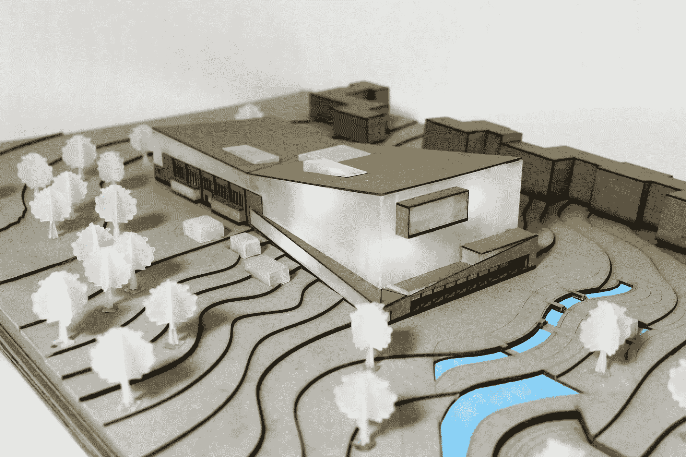

# 用维度建模构建更好的数据仓库：数据工程师的指南

> 原文：[`towardsdatascience.com/building-better-data-warehouses-with-dimensional-modeling-a-guide-for-data-engineers-422b3cd52df4?source=collection_archive---------7-----------------------#2023-05-08`](https://towardsdatascience.com/building-better-data-warehouses-with-dimensional-modeling-a-guide-for-data-engineers-422b3cd52df4?source=collection_archive---------7-----------------------#2023-05-08)

## 数据仓库维度建模设计 101

 [赵成志](https://chengzhizhao.medium.com/?source=post_page-----422b3cd52df4--------------------------------)

·

[关注](https://medium.com/m/signin?actionUrl=https%3A%2F%2Fmedium.com%2F_%2Fsubscribe%2Fuser%2Ff956c63a9571&operation=register&redirect=https%3A%2F%2Ftowardsdatascience.com%2Fbuilding-better-data-warehouses-with-dimensional-modeling-a-guide-for-data-engineers-422b3cd52df4&user=Chengzhi+Zhao&userId=f956c63a9571&source=post_page-f956c63a9571----422b3cd52df4---------------------post_header-----------) 发表在 [Towards Data Science](https://towardsdatascience.com/?source=post_page-----422b3cd52df4--------------------------------) ·9 min 阅读·2023 年 5 月 8 日

--

摄影师 [Erin Doering](https://unsplash.com/@edoering?utm_source=unsplash&utm_medium=referral&utm_content=creditCopyText) 在 [Unsplash](https://unsplash.com/photos/wSWWyNJSL40?utm_source=unsplash&utm_medium=referral&utm_content=creditCopyText) 上的照片

在设计数据密集型应用系统时，通常有两个选择：写优化或读优化。

没有一个数据库设计可以同时优化写入和读取。就像所有系统设计的观点一样，没有绝对对错之分，只有利弊。作为从事数据模型设计的数据专业人士，角色中的一个关键部分是识别用例，并进一步确定应该应用哪种设计原则。

数据仓库历来作为为最终用户提供数据的层，它是将数据转化为洞察的最后一步。**拉尔夫·金鲍尔**开发了一个著名的建模设计技术，称为[维度建模](https://en.wikipedia.org/wiki/Dimensional_modeling)。他的[《数据仓库工具包：维度建模的权威指南，第 3 版》](https://www.amazon.com/Data-Warehouse-Toolkit-Definitive-Dimensional/dp/1118530802/ref=asc_df_1118530802/?tag=hyprod-20&linkCode=df0&hvadid=312128454859&hvpos=&hvnetw=g&hvrand=12986151952939713448&hvpone=&hvptwo=&hvqmt=&hvdev=c&hvdvcmdl=&hvlocint=&hvlocphy=9032171&hvtargid=pla-396828635481&psc=1)是维度建模领域最重要的书籍。

尽管大数据和云计算技术使我们能够使用更多的计算能力和更便宜的存储，但新的或甚至经验丰富的数据工程师在数据仓库建模设计方面往往忽视了一些问题。很少有人关注**慢变维度**（SCD）、**代理键**、**表粒度**等概念……
