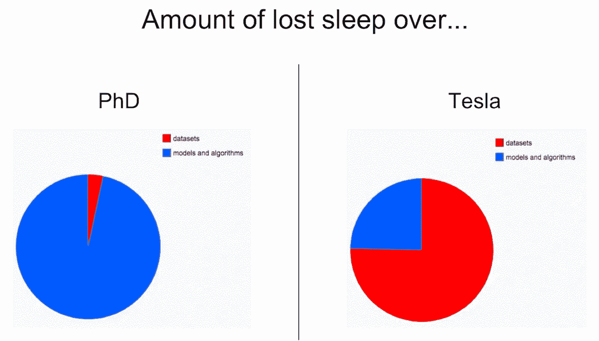
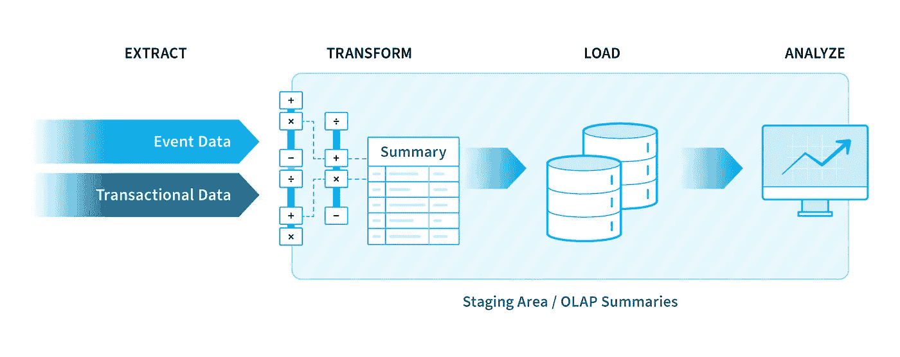
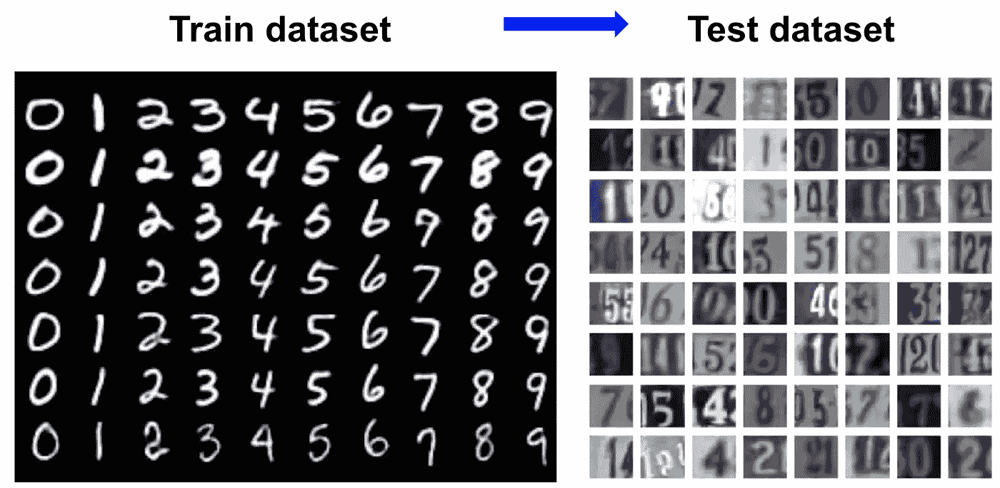
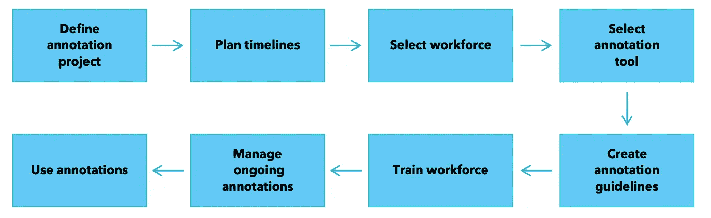

# 《构建更好的机器学习系统》—— 第二章：驯服数据混乱

> 原文：[`towardsdatascience.com/building-better-ml-systems-chapter-2-taming-data-chaos-841d5a04b39?source=collection_archive---------8-----------------------#2023-05-24`](https://towardsdatascience.com/building-better-ml-systems-chapter-2-taming-data-chaos-841d5a04b39?source=collection_archive---------8-----------------------#2023-05-24)

## *关于数据中心的人工智能、训练数据、数据标注和清洗、合成数据，以及一些数据工程和 ETL。*

 [Olga Chernytska](https://olga-chernytska.medium.com/?source=post_page-----841d5a04b39--------------------------------)

·

[关注](https://medium.com/m/signin?actionUrl=https%3A%2F%2Fmedium.com%2F_%2Fsubscribe%2Fuser%2Fcc932e019245&operation=register&redirect=https%3A%2F%2Ftowardsdatascience.com%2Fbuilding-better-ml-systems-chapter-2-taming-data-chaos-841d5a04b39&user=Olga+Chernytska&userId=cc932e019245&source=post_page-cc932e019245----841d5a04b39---------------------post_header-----------) 发表在 [Towards Data Science](https://towardsdatascience.com/?source=post_page-----841d5a04b39--------------------------------) ·12 分钟阅读·2023 年 5 月 24 日

--

照片由 [charlesdeluvio](https://unsplash.com/@sloppyperfectionist?utm_source=medium&utm_medium=referral%5C) 拍摄，来自 [Unsplash](https://unsplash.com/?utm_source=medium&utm_medium=referral)

构建机器学习系统远不仅仅是迭代酷炫的最先进算法。

研究或学习项目以演示结束。在商业项目中，模型会发布给成千上万，甚至是百万用户，他们以各种可想象和不可想象的方式使用你的模型，并期望其始终快速、准确、公正地工作。一旦预测错误，可能会导致人员伤亡、数百万美元的损失，或严重损害公司的声誉。

在这个系列中，我们讨论了构建良好的机器学习系统所需解决的重要主题：商业价值和需求、数据收集和标注、模型开发、实验跟踪、在线和离线评估、部署、监控、再训练以及更多。

在上一章中，我们了解到每个项目都必须从计划开始，因为机器学习系统过于复杂，不能随意实现。我们回顾了机器学习项目的生命周期，讨论了为什么以及如何估计项目的商业价值，如何收集需求，然后冷静地重新评估是否真的需要机器学习。我们学习了如何通过“PoC”和“MVP”等概念从小处着手，快速失败。最后，我们谈到了规划阶段设计文档的重要性。

本章完全关于数据。我们将深入探讨机器学习系统中数据的各个方面——数据中心 AI、训练数据、数据标注和清洗、合成数据，以及一些数据工程和 ETL。本帖是系列中最长的一篇，但原因正当：数据科学家的大部分工作时间都投入在数据上。

所以让故事开始吧。

# 数据中心 AI

提高模型准确性的两种方法是：

1.  收集更多数据或清理现有数据，同时保持模型不变。

1.  使用更高级的算法或调整当前模型的超参数，同时保持数据集不变。

第一种方法被称为数据中心，第二种方法是模型中心。现在机器学习社区倾向于数据中心 AI；许多研究人员和从业者已经得出结论，**改进数据比改进算法更能显著提高模型的准确性**。你听过无数次的“垃圾进，垃圾出”这一说法正在重新焕发光彩。

这是 DeepLearning.AI 和 Landing AI 创始人 Andrew Ng 的观点：

*“与其专注于代码，公司应该专注于开发系统化的工程实践，以可靠、高效、系统的方式改进数据。换句话说，公司需要从以模型为中心的方法转向以数据为中心的方法。”*

建立优秀 AI 产品的公司也采用数据中心方法。前特斯拉 AI 总监安德烈·卡帕西（Andrey Karpathy）分享了他在特斯拉的大部分时间都投入在数据上。

*图片。优秀的 AI 公司更关注数据而非算法。*

来源：“*[*构建软件 2.0 堆栈*](https://www.youtube.com/watch?v=y57wwucbXR8&ab_channel=Databricks)*”作者：Andrej Karpathy*。

数据驱动的 AI 已经变得如此流行，以至于它最近演变成了一个研究改进数据集技术的独立学科。为了与 ML 社区保持一致，我强烈建议你参加 MIT 提供的这个优秀的免费课程：[数据驱动 AI 介绍](https://dcai.csail.mit.edu/)。

# 数据管道

一切都是数据。系统生成的日志、银行交易、网站数据、用户输入数据和客户数据只是你们业务可能涉及的一些例子。

到达的数据通常是混乱的、无结构的和脏的。它来自多个数据源，这可能会很棘手；有时它是加密的，或者可能缺少某些片段。数据可以是字节流、文本文件、表格、图像、语音和视频录音的形式；它可以是二进制的或人类可读的。

在数据科学家和机器学习工程师可以利用这些数据之前，数据需要经过处理、转换、清理、聚合和存储。

**数据管道是一种组织数据流的方法。**

ETL（提取-转换-加载）是一个广泛用于数据分析和机器学习的数据管道示例。在 ETL 中，数据以以下方式组织：

+   首先，你需要确定要收集哪些数据以及从哪些来源收集。

+   接下来，你合并这些数据源，将数据转换为所需格式，解决不一致性，并修复错误。

+   之后，你设计数据存储，并将处理和清理后的数据存储在那里。

+   最后，你自动化整个过程，使其无需人工干预即可运行。数据管道应周期性地或在特定事件发生时自动触发。

要深入了解 ETL，请查看 NIX United 的文章 [什么是 ETL 过程：概述、工具和最佳实践](https://nix-united.com/blog/what-is-etl-process-overview-tools-and-best-practices/)。

*图像。ETL 管道。* [*图像由 NIX United 提供*](https://nix-united.com/blog/what-is-etl-process-overview-tools-and-best-practices/)*。*

这是一种高层次的数据管道概述。这个话题要广泛得多，更加复杂，因此越来越多的公司正在雇用数据工程师来处理数据存储和管道，同时让数据科学家和机器学习工程师专注于数据分析和建模。

如果你对数据工程师的技能集感到好奇，可以阅读 [现代数据工程师路线图](https://github.com/datastacktv/data-engineer-roadmap) 由 datastack.tv 提供。我很高兴看到这个领域内专业角色的兴起，也很高兴数据科学家不再需要了解所有的东西了。这真是太让人松了一口气！

在我们深入讨论训练数据和标签之前，还有一件重要的事情：

**如果数据管道设置得当，即使没有先进的机器学习，你的公司也能从数据中受益。** 所以在采用机器学习之前，公司通常会从报告、指标和基础分析开始。

# 训练数据

为了训练“猫与狗”分类器，你需要向模型展示大量的猫图片，同时说“这是一只猫”，并展示大量的狗图片，同时说“这是一只狗”。不提供任何规则或解释，让模型决定如何进行预测。从数学上讲，这意味着模型调整其参数，直到输入与训练数据的预期输出匹配。

**模型基于训练数据建立对世界的理解，假设训练数据代表了现实世界，并且正确地代表了它。** 这就是为什么训练数据的质量非常重要。

+   “猫与狗”模型无法预测品种或分类其他动物，因为这些信息在训练集中不存在。

+   如果标签中存在错误，某些猫被标记为狗，反之亦然，模型会感到困惑，无法达到高准确率。非随机错误对模型可能极具破坏性。例如，如果所有吉娃娃都被标记为猫，模型将学习将吉娃娃预测为猫。

+   现实世界的数据包含偏见。例如，[女性薪资更低](https://www.pewresearch.org/short-reads/2023/03/01/gender-pay-gap-facts/)。所以，如果你训练一个模型来预测公司员工的薪资，模型可能会预测女性的薪资较低，因为这正是数据中所体现的，并且模型假设应该是这样。

+   如果某些类别或分段在训练数据中表现不足或缺失，模型将无法很好地学习这些类别，并会产生不正确的预测。

训练数据应该是相关的、一致的、具有代表性的和全面的。这些术语的含义在 Amal Joby 的文章[什么是训练数据？它在机器学习中的作用](https://learn.g2.com/training-data)中解释得很好。

在我们都一致同意在高质量数据上训练模型至关重要之后，让我分享一些实用的技巧。

**在收集训练数据之前，了解业务任务，然后将其框定为机器学习问题**：应预测什么，以及从什么输入中预测。几乎任何业务任务都可以根据要求和限制以不同方式表示。在进行计算机视觉项目时，我通常在目标检测、分割和分类之间进行选择，并决定类别数量。

**训练数据必须与模型在生产中‘看到’的数据非常相似。** 从理论上讲，模型可以推广到未见过的数据，但在实践中，这种推广能力是相当有限的。例如，如果你为室内环境训练一个计算机视觉模型，它在户外效果会很差。类似地，在推特上训练的情感模型对于分析经典文学文本片段也不会有效。我个人经历过计算机视觉模型在面对较小的差异时，如光照、肤色、天气条件和压缩方法的微小变化，难以推广的情况。为了克服训练数据和生产数据之间的差异，一种流行的方法是使用生产中的最新数据作为训练数据集。

*图像。训练数据和生产（测试）数据之间的不匹配示例。来源：* [*Google Research Blog*](https://ai.googleblog.com/2020/10/estimating-impact-of-training-data-with.html)*。*

**一个小而干净的数据集比一个大但脏的数据集更好。** 对于大多数项目而言，数据标注是一个瓶颈。数据标注是一个极其复杂、缓慢且昂贵的过程（下一部分将专门讨论）。拥有一个巨大的干净数据集是只有庞大的科技公司才能负担得起的奢侈品。其他所有公司都必须在规模和质量之间做出选择，你应该始终选择质量，**特别是**对于用于评估模型的数据集。

**没有人能真正确定需要多少数据。** 这取决于预测的现实世界现象的复杂性、训练数据的变异性以及所需的模型准确性。找到这个答案的唯一方法是通过反复试验。因此……

**分块获取数据。** 从一个小数据集开始，标注它，训练一个模型，检查准确性，分析错误，并计划下一轮的数据收集和标注。

**训练数据不是静态的。** 正如你从前一章中回忆的那样，你将在研究阶段和模型已投入生产时多次训练和重新训练模型。每次新的迭代和模型更新时，都需要一个新的训练数据集。没有休息的机会，记住了吗？ :)

# 数据标注

目前，大多数生产中的机器学习模型是监督学习。这意味着需要标注数据来训练和评估模型。即使在无监督学习的情况下，模型从未标注的数据中学习模式和结构，仍然需要标注数据来评估模型的准确性；否则，你怎么知道它是否足够好以用于生产？

**标签有两种类型：人工标签和自然标签。**

一些机器学习任务涉及预测未来。例如，预测股票价格、客户流失、到达时间、欺诈交易和推荐。一旦未来到来，我们就知道真实的标签。这些标签被称为自然标签，我们只需在它们到来时进行收集。

在计算机视觉和自然语言处理（NLP）中，我们不是预测未来，而是对图像和文本进行分类、分析和检索信息。这就是为什么我们无法获得自然标签，必须严重依赖人工标签。

**人工数据标注是一个极其复杂、缓慢且昂贵的过程。** 不要把它当作机器学习项目中的一个任务来考虑；最好将其视为一个独立的数据注释项目，具有自己的范围、预算、时间线、团队、工具和关键绩效指标（KPI）。

*图像。数据注释项目的阶段。来源：* [*管理数据注释项目的最佳实践*](https://arxiv.org/abs/2009.11654)

如果你与数据注释紧密合作，我推荐你查看 Tina Tseng 等人关于[数据注释项目管理最佳实践](https://arxiv.org/abs/2009.11654)的 30 页报告。对于较短版本和我自己的见解，请继续阅读这篇文章。

**首先要决定的是：谁来标注数据？** 需要考虑三个选项：众包、供应商和内部标注团队。我记得大约五年前，围绕像[亚马逊机械土耳其](https://www.mturk.com/)这样的众包工具的兴奋。然而，很快发现众包标注只适用于需要最少或不需要员工培训的非常简单的任务。因此，大多数公司在供应商和内部标注团队之间进行选择。初创公司通常倾向于选择供应商，因为这提供了一个更简单的起点，而大型 AI 公司则建立自己的标注团队，以控制过程并实现更高的标注质量。举例来说，[特斯拉有 1000 名全职员工在其人工数据标注团队中](https://techcrunch.com/2021/08/19/top-five-highlights-of-elon-musks-tesla-ai-day/#:~:text=The%20company%20flexed%20its%20over%201%2C000%2Dperson%20manual%20data%20labeling%20team%20and%20walked%20the%20audience%20through%20how%20Tesla%20auto%2Dlabels%20certain%20clips)。仅仅是个例子。

**创建指导方针并根据它们培训标注者。** 指导方针是提供应标注内容及其方式的解释和视觉示例的文件。然后，将指导方针转化为标注者在进行实际标注任务之前必须完成的培训材料。如果你与供应商合作，请确保他们的员工培训过程设置得当。

现实世界的数据是模糊和混乱的，因此允许标注者说：“我不知道如何标注这个样本。” 然后，收集这些混淆样本，并用它们来改进指导方针。

**标注工具很重要**。标注员通常按小时计费，因此帮助他们更快、更准确地标注会节省你很多钱。在大规模上，标注员每小时标注 100 个样本与 300 个样本的差别尤其明显。所以明智选择，并关注以下几点：

+   标注单个样本所需的时间。一些工具专门为 NLP 任务开发；完全不同的工具用于 2D 或 3D 计算机视觉。

+   是否支持 AI 驱动的标注。这是你想要使用的功能。该工具可能通过用户点击对象来预测分割掩码，或者允许你部署自己的模型来协助标注过程。

+   它与您的基础设施的契合程度。标注工具将集成到数据管道中。一旦数据到达，它会自动采样并发送给标注员。他们标注数据，标签会自动存储在数据库中。一些工具可能比其他工具更适合你的基础设施，考虑一下这一点。

[开源标注工具列表在这里](https://github.com/fuzzylabs/awesome-open-mlops#data-annotation)，[这里有一个不错的比较](https://www.v7labs.com/blog/best-image-annotation-tools)介绍了一些免费的和付费的工具。

**估算成本和时间线。** 你会惊讶于数据标注的缓慢和昂贵（我就是）。因此，最好做好准备（并提前准备你的经理）。

这里是大致估算成本和时间的公式：

1.  标注时间（工时）= 标注一个样本的时间（小时） * 数据集大小（样本数量） + 预留的训练和错误修正时间（工时）

1.  标注时间（工作天数）= 标注时间（工时） / 员工人数 / 8 小时

1.  成本（$）= 标注员的小时费率（$） * 标注时间（工时）

**无论你多么努力，数据标签不可避免地会出现错误。** 人类会犯错，他们可能会分心或误解任务。因此，检查标签的质量是必需的。当然，你为此选择的算法或工具也必须集成到数据管道中。我会一再强调：一切必须自动化。

一个这样的工具是[Cleanlab](https://github.com/cleanlab/cleanlab)。它由麻省理工学院毕业生开发，最近获得了很大的人气。Cleanlab 使用统计方法和机器学习算法改进图像、文本和表格数据的标签（有关它能做什么的示例，请查看[Cleanlab 博客](https://cleanlab.ai/blog/)）。

关于数据标注的最后一点，我推荐这篇 Synced 的深刻文章——[数据标注：AI 突破背后的十亿美元生意](https://medium.com/syncedreview/data-annotation-the-billion-dollar-business-behind-ai-breakthroughs-d929b0a50d23)。标题已经很自解释了，文章确实值得一读。

# 合成数据

将所有上述数据标注的挑战，添加数据隐私问题以及现实世界数据中的严重[类别不平衡](https://developers.google.com/machine-learning/data-prep/construct/sampling-splitting/imbalanced-data)，你就会明白为什么合成数据变得越来越受欢迎。

合成数据通常是使用一些游戏引擎、生成对抗网络的组合，或许再加上一点魔法来生成的。在自动驾驶汽车行业中，合成数据已经变得至关重要。查看一下[NVIDIA](https://www.youtube.com/watch?v=gPaFgNEF82Q&ab_channel=NVIDIA)和[Tesla](https://youtu.be/j0z4FweCy4M?t=5724)已经在做的事情。

一旦合成数据生成设置好，就可以相对快速且经济地获得大量多样化的数据集，并且具有极高的标签准确性。即使合成数据看起来不完美，它仍然可以用于模型的预训练。

如果你对扩展这一主题的知识感兴趣，这里有一个很好的资源：[什么是合成数据？](https://blogs.nvidia.com/blog/2021/06/08/what-is-synthetic-data/) 由 NVIDIA 提供。

# 结论

在这一章中，我们讨论了行业中的新趋势——以数据为中心的人工智能，这是一种构建机器学习系统的方法，认为干净的数据比先进的机器学习算法更重要。我们涉及了数据管道，旨在组织混乱和非结构化的数据流，以便这些数据可以用于分析。我们了解到，训练数据应该是相关的、均匀的、具有代表性的和全面的，因为模型是基于这些数据建立对世界的理解的。我们回顾了两种类型的标签——人工标签和自然标签——并讨论了获取人工标签的复杂、缓慢且昂贵的过程，以及使这一过程不那么痛苦的最佳实践。最后，我们讨论了真实数据和人工标注的替代方案：合成数据。

在接下来的帖子中，你将学习到模型开发、实验跟踪、在线和离线评估、部署、监控、再训练等多个方面——这些都将帮助你构建更好的机器学习系统。

下一章已经可以阅读：

[## 构建更好的机器学习系统 — 第三章：建模。让乐趣开始](https://towardsdatascience.com/building-better-ml-systems-chapter-3-modeling-let-the-fun-begin-73059c75e1d5?source=post_page-----841d5a04b39--------------------------------)

### 关于基准、实验跟踪、适当的测试集和指标。关于让算法发挥作用。

towardsdatascience.com
