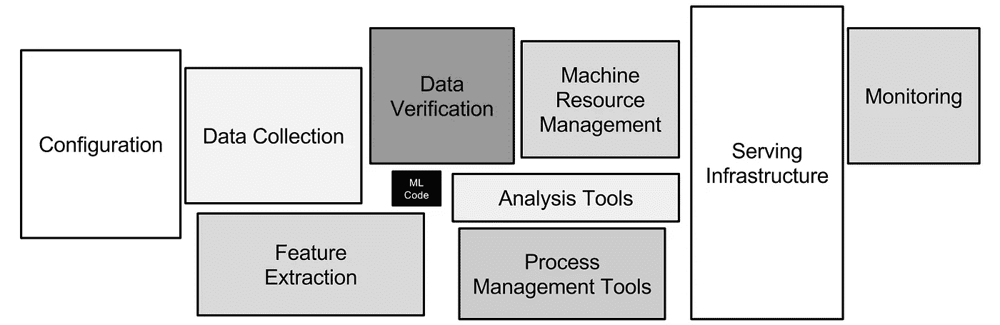
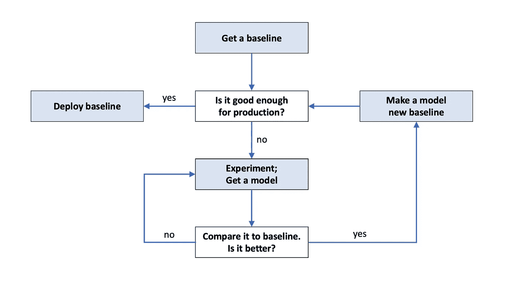
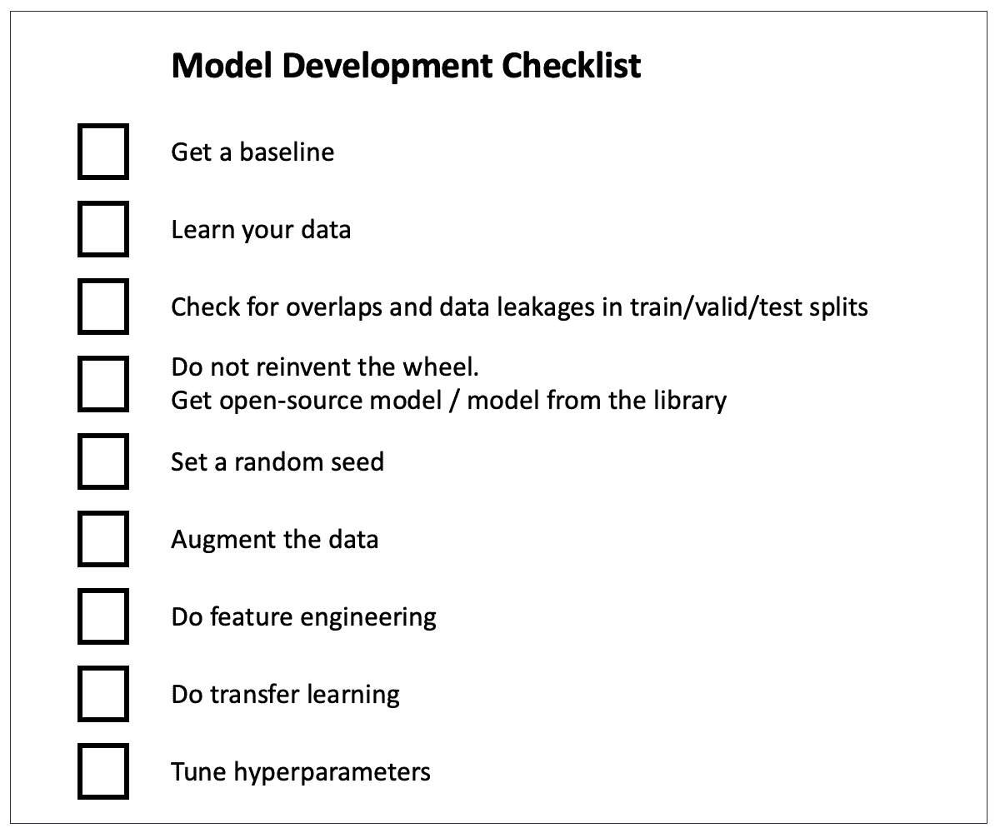
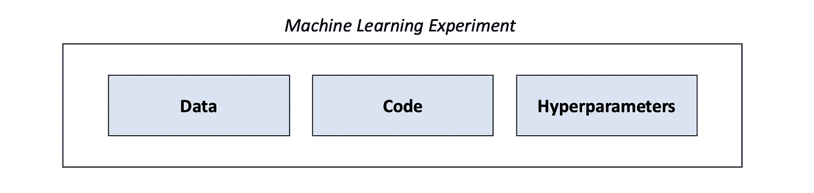
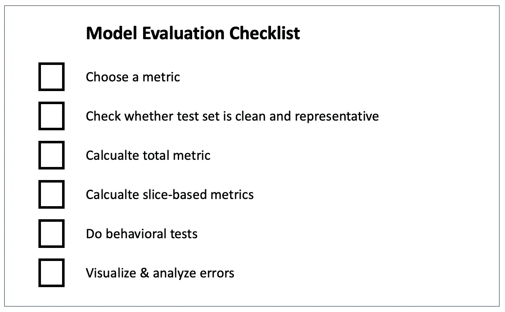

# 构建更好的机器学习系统 — 第三章：建模。让乐趣开始

> 原文：[`towardsdatascience.com/building-better-ml-systems-chapter-3-modeling-let-the-fun-begin-73059c75e1d5?source=collection_archive---------7-----------------------#2023-08-25`](https://towardsdatascience.com/building-better-ml-systems-chapter-3-modeling-let-the-fun-begin-73059c75e1d5?source=collection_archive---------7-----------------------#2023-08-25)

## *关于基线、实验跟踪、适当的测试集和指标。关于让算法发挥作用。*

 [Olga Chernytska](https://olga-chernytska.medium.com/?source=post_page-----73059c75e1d5--------------------------------)

·

[关注](https://medium.com/m/signin?actionUrl=https%3A%2F%2Fmedium.com%2F_%2Fsubscribe%2Fuser%2Fcc932e019245&operation=register&redirect=https%3A%2F%2Ftowardsdatascience.com%2Fbuilding-better-ml-systems-chapter-3-modeling-let-the-fun-begin-73059c75e1d5&user=Olga+Chernytska&userId=cc932e019245&source=post_page-cc932e019245----73059c75e1d5---------------------post_header-----------) 发布于 [Towards Data Science](https://towardsdatascience.com/?source=post_page-----73059c75e1d5--------------------------------) ·15 min read·2023 年 8 月 25 日

--

[图片来源](https://unsplash.com/photos/vXInUOv1n84)

你好，很高兴再次见到你。我非常欣赏你想成为更好专业人士、做得更好以及构建更好机器学习系统的愿望。你很棒，继续保持！

在这个系列中，我尽力帮助你掌握设计和构建机器学习系统的艺术、科学和（有时的）魔法。在这里，我们讨论业务价值和需求、数据收集与标记、模型开发、实验跟踪、在线和离线评估、部署、监控、再训练，以及更多内容。

这是第三章，专注于模型开发。**一个机器学习算法只是机器学习系统的一小部分。** 没有精心设计的系统，即使是完美准确的算法也无法服务于客户，也不会为公司带来利润。在这篇文章中，我将从一个不同的角度展示：如何选择、开发和评估算法，同时考虑算法的主要目标是为业务带来价值。最终，无论你是用线性回归还是最先进的神经网络解决业务问题，都不重要。

*一个机器学习算法（中间的黑盒）只是机器学习系统的一小部分。* [*图片来源*](https://proceedings.neurips.cc/paper_files/paper/2015/file/86df7dcfd896fcaf2674f757a2463eba-Paper.pdf)

在我们继续之前，让我们快速回顾一下我们已经学到的内容。

第一章 讲的是规划。我们了解到每个项目必须从计划开始，因为机器学习系统过于复杂，不能以临时的方式实施。我们回顾了机器学习项目生命周期，讨论了估算项目业务价值的原因和方法，如何收集需求，然后以冷静的头脑重新评估机器学习是否真的必要。我们学习了如何从小处着手，并利用“PoC”和“MVP”等概念快速失败。最后，我们谈到了在规划阶段设计文档的重要性。

第二章 讲的是数据。我们讨论了行业中的新趋势——数据中心人工智能，这是一种将干净的数据视为比先进的机器学习算法更重要的构建机器学习系统的方法。我们介绍了数据管道，这些管道旨在组织混乱和非结构化数据的流动，以便数据可以用于分析。我们了解到，训练数据应该是相关的、一致的、具有代表性的和全面的，因为模型基于这些数据建立对世界的理解。我们回顾了两种标签——人工标签和自然标签——并探讨了获取人工标签的复杂、缓慢和昂贵的过程，并讨论了使这一过程更少痛苦的最佳实践。最后，我们讨论了真实数据和人工标记的替代品：合成数据。

如果你不小心错过了之前的帖子，我建议你在继续之前阅读它们。我会在这里等你。

现在，让我们开始享受乐趣吧。

# 如何选择一个 ML 算法

没有一种算法适用于所有问题。你需要尝试几种方法，真正了解你的数据和领域，直到找到有效的方法。

思考、头脑风暴、与同事讨论、询问 ChatGPT，然后写下你打算尝试的三种方法：1) 一种非常简单的方法；2) 一种非常流行的方法；3) 一种新颖且有创意的方法。

1.  一种非常简单的方法。算法中引入的每一种复杂性都必须是有理由的。从一个简单的方法开始（甚至可能是非 ML 的），评估它，并将其作为基线与其他所有模型进行比较。

1.  一种非常流行的方法。如果你看到、听到或读到许多人使用特定算法解决相同的业务任务 — 确保将其添加到你的实验列表中。利用集体智慧！我对流行的方法总是充满期望，在大多数情况下，它们效果很好。

1.  一种新颖且有创意的方法。尽管试试看。如果你通过击败典型的流行方法建立了竞争优势，你的老板和公司会很高兴。

**提醒：不要重复发明轮子**。有成百上千的开源库和代码库，已经实现了你可能想到的大多数算法、数据采样策略或训练循环。不要自己编写 K-means 聚类算法 — 使用[scikit-learn](https://scikit-learn.org/stable/modules/generated/sklearn.cluster.KMeans.html)中的现成实现。不要从头开始编写 ResNet50 — 使用[PyTorch](https://pytorch.org/vision/main/models/generated/torchvision.models.resnet50.html)中的现成实现。在实现最新的论文之前，检查一下[PapersWithCode](https://paperswithcode.com/)，我敢打赌有人已经做过了。

做研究和发明新东西令人兴奋。从零开始实现算法，理解每一行代码，确实很有吸引力。然而，研究通常适合大学和大型科技公司。对于初创公司来说，每一美元都很重要，因此他们根本无法投资成功几率很低的东西（研究通常涉及 100 次尝试和 1 次成功）。

**小心“最先进技术”**。假设你正在使用[YOLOv7](https://github.com/WongKinYiu/yolov7)进行目标检测，然后你听说[YOLOv8](https://github.com/ultralytics/ultralytics)已经发布，预计会更好。这是否意味着你需要升级所有的生产管道以支持 YOLOv8？不一定。

在大多数情况下，这种“更好”意味着在静态基准数据集上提升 1-2%，例如[COCO](https://cocodataset.org/#home)。由于你的数据和业务问题在各个方面都不同，模型在你数据上的准确性可能更好、略好，甚至更差。此外，从本系列的第二章中，你应该记住：提升数据质量比改善算法能显著提高模型准确性。想办法清理训练数据——你会看到准确率提高 5-10%。

# 如何开发机器学习算法

首先，获取一个基准。基准是你将要与之竞争的模型。基准有两个逻辑选择：

1.  从生产环境中获取一个现有的模型（如果你有的话）。我们想要改进现有的模型，这就是为什么我们需要与之进行比较。

1.  一个非常简单且易于部署的模型。如果业务任务可以通过简单的方法解决，何必费劲训练复杂的模型？花几天时间寻找并实现一个简单的解决方案。

现在开始实验。你设计所有实验以在基准之上进行改进。找到一个有前途的算法？很好，评估并与基准进行比较。你的模型更好？恭喜你，它现在是你的新基准，考虑进行实验以进一步改进它。

*算法开发是一个迭代的过程。图像由作者提供*

算法开发是一个迭代的过程。你要么找到一个足够好的算法投入生产，要么耗尽时间。两种情况都是可能的。

**自然地，你尝试的大多数想法都会失败**。所以不要为此沮丧，也不要把它当成个人问题。我们都是这样工作的：找到一个好点子，试一试，发现这个点子实际上很糟糕，然后想出一个新的、希望这次好的点子，再试一试，发现它也不起作用，再找一个新点子，……

我的建议是：给单一想法的努力设定时间框架。如果你不能在 N 天内（提前选择你的 N 值）使这个想法奏效，就结束它并转向另一个想法。如果你真的想要成功，你需要经历许多不同的想法，因为，正如我之前所说，大多数你尝试的想法都会失败。

**真正真正地了解你的数据。** 可视化样本和标签，绘制特征分布，确保你理解特征的含义，探索每个类别的样本，了解数据收集策略，阅读提供给标注员的数据标注说明……训练自己预测模型应该预测的内容。如果你想创建一个好的算法，开始像算法一样思考（我不是在开玩笑）。所有这些都将帮助你发现数据中的问题、调试模型，并提出实验想法。

**将数据划分为训练集、验证集和测试集**。在训练集上训练，在验证集上选择超参数，在测试集上评估。确保这些划分之间没有重叠或数据泄漏。有关更多信息，请查看这篇文章：[《机器学习中的训练、验证和测试划分》](https://blog.roboflow.com/train-test-split/) 作者 Jacob Solawetz。

**方法：使用开源模型，先用默认参数运行，然后进行超参数调整**。使用来自机器学习库的算法，例如[scikit-learn](https://scikit-learn.org/stable/)、[PyTorch](https://pytorch.org/)、[OpenCV](https://opencv.org/)，或者来自 GitHub 上拥有大量 stars、良好 readme 和允许商业使用的许可证的仓库。用默认超参数在你的数据上训练并进行评估。算法的默认超参数是为了在基准数据集（ImageNet, COCO）上最大化准确性，因此在大多数情况下，它们不适合你的数据和任务。详细了解每个超参数的含义及其对训练/推理的影响，以便进行超参数优化。典型的超参数优化方法包括[Grad Student Descent](https://sciencedryad.wordpress.com/2014/01/25/grad-student-descent/)、随机/网格/贝叶斯搜索和进化算法。永远不要在进行超参数优化之前就声称算法不起作用。欲了解更多信息，请查看 Pier Paolo Ippolito 的这篇文章：《超参数优化》。

**更加深入地处理你的数据：进行特征工程和数据增强。** 特征工程指的是转换现有特征和创建新特征。特征工程是一项关键技能，因此我向你推荐两篇可以帮助你掌握这项技能的优秀文章：

- 《机器学习特征工程的基本技术》 作者 Emre Rençberoğlu

- 《高级特征工程和预处理的 4 个技巧》 作者 Maarten Grootendorst

数据增强是一种从现有数据中创建新训练样本的技术，使得模型在训练过程中“看到”更多样本。增加训练集是提高模型准确性的最简单方法，因此你应该在可能的情况下始终进行数据增强。例如，在计算机视觉领域，几乎没有人会在没有基本图像增强（如旋转、缩放、裁剪、翻转等）的情况下训练模型。有关更多细节，请查看我的文章：《计算机视觉数据增强完全指南》。

如果你对自然语言处理中的数据增强方法感到好奇，可以阅读 Shahul ES 的[《NLP 中的数据增强：Kaggle 大师的最佳实践》](https://neptune.ai/blog/data-augmentation-nlp)。

**迁移学习是你的朋友。零样本学习是你最好的朋友。** 迁移学习是一种流行的提高模型准确性的技术。实际上，这意味着你使用某个数据集上预训练的模型，继续用你的数据进行训练（“转移知识”）。即使你的数据与 COCO 或 ImageNet 数据集的图片看起来相差甚远，来自这些数据集的权重仍然可以改善你的模型。

零样本学习是一种无需训练即可在你的数据上工作的算法。怎么做到的？通常，它是一个在巨大样本数据集上预训练的模型。你的数据可能类似于这个模型已经训练过的内容；模型已经“见过”了大量样本，因此能够很好地泛化到新数据上。零样本学习听起来可能像是一个梦想，但确实有一些超级模型存在：[Segment Anything](https://github.com/facebookresearch/segment-anything)、大多数[词嵌入](https://huggingface.co/blog/getting-started-with-embeddings)模型，ChatGPT。

为你的方便准备的模型开发清单。图片来源于作者

关于模型开发还有很多要说的，但我们需要总结，以留出时间讨论实验跟踪和评估的话题。如果你仍然渴望知识，可以查看 Andrej Karpathy 的这篇精彩文章：[训练神经网络的配方](http://karpathy.github.io/2019/04/25/recipe)。

# 实验跟踪

实验跟踪是将实验信息保存到某个仪表板或文件中的过程，以便你将来可以查看。这就像软件开发中的日志记录。训练和测试数据集的链接、超参数、git 哈希、测试数据上的指标——这些都是你可能跟踪的内容示例。

**你必须跟踪你运行的所有实验**。如果出于某种原因你的团队没有这样做，立即安排一个团队会议讨论这件事的重要性。你会感谢我的 :)

那么，我们为什么要进行实验跟踪呢？

+   **为了比较不同实验之间的差异**。当你开发模型时，你会训练和评估许多不同的算法，尝试不同的数据预处理技术，使用不同的超参数，采用各种创造性的技巧。最终，你希望看到你尝试了什么，哪些有效，哪些获得了最佳准确率。也许以后你会想回到某个实验，重新审视其结果。模型开发可能会持续几周甚至几个月，因此如果没有适当的实验跟踪，你会忘记你做了什么，并且不得不重新做实验。

+   **为了重现实验**。如果你不能重现它，那就不算数。检查一下：你能回到你最成功的实验，重新运行它并获得相同的准确率吗？如果答案是“不能”，可能是因为你没有对代码和数据进行版本控制，没有保存所有超参数，或者没有设置随机种子。

    随机种子的设置重要性在 Cecelia Shao 的文章中解释得很好：[在 ML 实验中正确设置随机种子。并不像你想象的那么简单](https://opendatascience.com/properly-setting-the-random-seed-in-ml-experiments-not-as-simple-as-you-might-imagine/)。

+   **调试实验**。有时实验无法正常工作：算法不收敛，预测结果异常，准确率接近随机。如果没有保存实验信息，几乎不可能理解失败的原因。保存超参数列表、样本和数据增强的可视化、损失图等可能会给你一些线索，帮助你找到问题所在。

既然你已经相信实验追踪的重要性，我们来谈谈如何实际操作。

有很多免费的和付费的实验追踪工具，你可以选择适合你要求和预算的工具。可能最受欢迎的是[Weights&Biases](https://wandb.ai/site)；我用过很多次，它很好。有关其他工具的评论，请查看[15 个最佳 ML 实验追踪和管理工具](https://neptune.ai/blog/best-ml-experiment-tracking-tools)由 Patrycja Jenkner 撰写。

**机器学习实验由数据、代码和超参数组成**。确保你使用版本控制工具管理代码，如 Github 或 Gitlab，并在开发过程中提交所有更改。能够恢复到旧的代码版本以重新运行旧的实验是很重要的。对数据进行版本控制。最简单和最流行的方法是为每个数据集的新版本创建一个新文件夹或文件（最好是在云存储上，例如[Amazon S3](https://aws.amazon.com/pm/serv-s3/?trk=518a7bef-5b4f-4462-ad55-80e5c177f12b&sc_channel=ps&ef_id=CjwKCAjwloynBhBbEiwAGY25dBdVqyx2J5k5onI9hVa-eoxeKKXeUqCTPI_1no9-SETi0wuWkPCtKBoCTIQQAvD_BwE%3AG%3As&s_kwcid=AL%214422%213%21645186213484%21e%21%21g%21%21s3%2119579892800%21143689755565)或[Google Cloud Storage](https://cloud.google.com/storage))。有些人使用一个叫做[Data Version Control (DVC)](https://dvc.org/)的工具。

ML 实验由数据、代码和超参数组成。图片由作者提供

你究竟应该追踪什么呢？嗯，**追踪你能追踪的所有内容并非坏主意** :) 大多数时候，除非实验失败且失败非常严重，否则你不会用到所有这些信息。

以下是你可能需要考虑追踪的事项列表：

+   提交的 Git 哈希值

+   训练、验证和测试数据集的链接

+   超参数及其随时间的变化（模型结构、学习率、批量大小、数据增强等）

+   训练和验证集上的损失图

+   训练和验证集上的指标图

+   测试集上的指标

+   带标签的训练样本可视化（包括和不包括应用的数据增强）

+   测试集上的错误可视化

+   环境（操作系统、CUDA 版本、软件包版本、环境变量）

+   训练速度、内存使用、CPU/GPU 利用率

一次性设置实验跟踪，享受其永久的好处。

# 模型评估

在将模型部署到生产环境之前，必须彻底评估模型。这种评估称为“离线”评估。相比之下，“在线”评估则是检查已经在生产环境中运行的模型。在线评估将在本系列的下一章中讨论，今天我们只关注离线评估。

**要进行离线评估，我们需要一个指标和一个数据集。**

模型在测试数据集上进行评估，这是你在训练和调整超参数时留出的数据集。假设 1）测试集足够大且极其干净；2）模型从未见过测试数据；3）测试数据代表生产数据。如果其中一个假设被违反，评估就会不正确，存在获得过于乐观的指标并部署差模型的高风险。

在小规模测试集上进行评估可能会偶然得到一个好的指标。对脏数据的评估不会展示模型的真实表现。虽然训练集中出现错误更具包容性（你可以在干净标签、脏标签甚至无标签上进行训练），但测试集中出现错误可能是有害的。重要提示：无监督模型也需要标记的测试集。否则，你如何知道你的模型是否足够好？

**确保你的模型没有“见过”测试数据**。始终过滤重复项，以避免相同样本出现在训练集和测试集中。不要随机拆分数据，改用基于时间或用户的拆分。基于时间的拆分意味着将较旧的数据放入训练集，将较新的数据放入测试集。基于用户的拆分意味着将同一用户的所有数据放在同一拆分中。要非常小心数据泄漏，更多详细信息请参阅 Prerna Singh 的 《机器学习中的数据泄漏：如何检测并减少风险》。

指标是一个假定与模型真实表现相关的数字：数字越高，模型越好。你可以选择一个或几个指标。例如，分类任务的典型指标有准确率、精确率、召回率和 F1 分数。选择一些简单且理想情况下可解释的指标，以便非技术经理和客户也能理解。

以下是 Shervin Minaee 关于各种任务和领域指标的优秀文章：

- 20 个流行的机器学习指标。第一部分：分类和回归评估指标

- 20 个热门机器学习指标。第二部分：排序和统计指标

**使用基于切片的指标并评估你能想到的每个数据片段**（除非你想陷入像“[Zoom 的虚拟背景功能不适用于黑人面孔](https://onezero.medium.com/zooms-virtual-background-feature-isn-t-built-for-black-faces-e0a97b591955)”这样的丑闻）。例如，面部检测系统必须分别评估不同种族、性别和年龄的人群。电子商务模型值得评估桌面与移动端、不同国家和浏览器的表现。仔细检查每个片段是否在测试集中得到充分代表。基于切片的指标也有助于解决[类别不平衡](https://developers.google.com/machine-learning/data-prep/construct/sampling-splitting/imbalanced-data)问题：分别查看每个类别的精确度和召回率比总的精确度/召回率更有意义。

避免丑闻的另一种方法（这次是“银行 ABC 的新信用评分系统歧视未婚女性”）是使用行为测试。一篇很棒的论文，[超越准确性：使用 CheckList 对 NLP 模型进行行为测试](https://arxiv.org/abs/2005.04118)，建议除了数值指标外，还使用最低功能性、不变性和方向期望测试。尽管这篇论文专注于自然语言处理，这些测试类型也可以很容易地应用于表格数据和图像。

在“银行 ABC 的新信用评分系统歧视未婚女性”的例子中，不变性行为测试可能会有很大帮助。保持所有特征不变，但改变婚姻状况和性别，并检查模型预测是否发生变化。如果你看到预测有显著差异（而应当是“不变”的），可能说明你的模型在训练数据中吸收了偏见；这需要修正，例如，通过完全移除模型输入中的敏感（易引起歧视的）特征。

**最后，可视化错误**。找到测试集中模型出错的样本；可视化这些样本并分析为何会发生这些错误。这是因为测试集仍然很脏吗？训练集中是否有足够相似的样本？模型错误是否存在某种模式？这种分析有助于发现测试集中可能的标注错误和训练过程中的漏洞，并提出进一步提高模型性能的想法。

方便使用的模型评估检查清单。图片由作者提供

# 结论

在本章中，我们学会了如何在开发模型时考虑到，机器学习算法只是机器学习系统的一部分。模型开发从创建一个简单的基准模型开始，并通过迭代改进不断推进。我们提出了最有效的方式：利用开源模型并围绕它进行实验，而不是重新发明轮子或陷入研究的泥潭。我们讨论了“最先进”算法的陷阱和数据增强及迁移学习的好处。我们一致认为实验跟踪的重要性，并学习了如何设置它。最后，我们讨论了离线评估——指标选择、适当的测试集、基于切片的评估和行为测试。

我们快到达目标了，只剩下最后一章。在下一篇（最后一篇）文章中，你将学习关于部署、监控、在线评估和再训练的内容——这些是帮助你构建更好机器学习系统的最后一块知识。

最终章将很快发布。订阅以保持关注。
