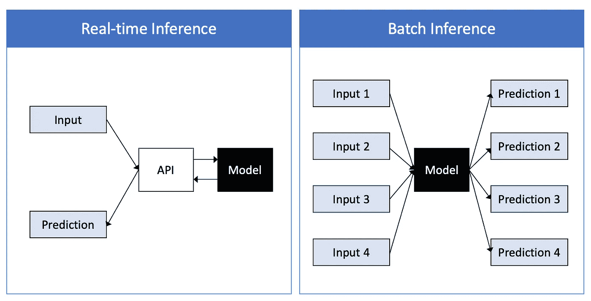
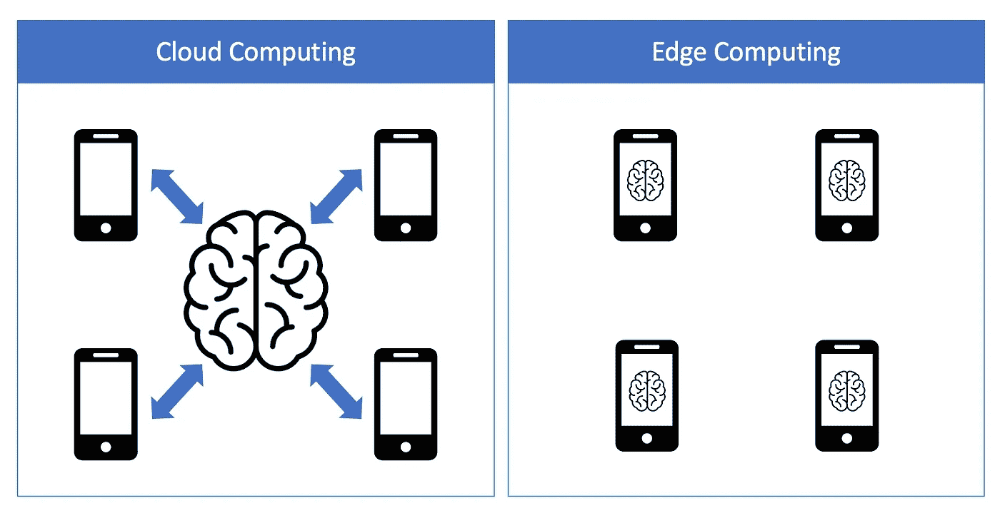
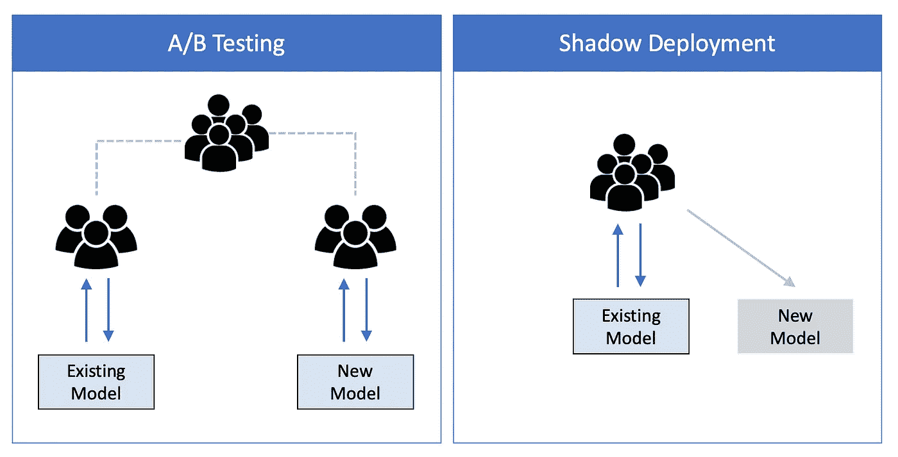

# 构建更好的 ML 系统——第四章：模型部署及其发展

> 原文：[`towardsdatascience.com/building-better-ml-systems-chapter-4-model-deployment-and-beyond-eae3a75496ec?source=collection_archive---------2-----------------------#2023-09-28`](https://towardsdatascience.com/building-better-ml-systems-chapter-4-model-deployment-and-beyond-eae3a75496ec?source=collection_archive---------2-----------------------#2023-09-28)

## *关于部署、监控、数据分布漂移、模型更新和生产环境中的测试。*

 [Olga Chernytska](https://olga-chernytska.medium.com/?source=post_page-----eae3a75496ec--------------------------------)

·

[关注](https://medium.com/m/signin?actionUrl=https%3A%2F%2Fmedium.com%2F_%2Fsubscribe%2Fuser%2Fcc932e019245&operation=register&redirect=https%3A%2F%2Ftowardsdatascience.com%2Fbuilding-better-ml-systems-chapter-4-model-deployment-and-beyond-eae3a75496ec&user=Olga+Chernytska&userId=cc932e019245&source=post_page-cc932e019245----eae3a75496ec---------------------post_header-----------) 发表在 [Towards Data Science](https://towardsdatascience.com/?source=post_page-----eae3a75496ec--------------------------------) ·13 分钟阅读·2023 年 9 月 28 日

--

[图片来源](https://unsplash.com/photos/iM8dxccK1sY)

**部署模型并在生产环境中支持它们更多是工程问题，而非机器学习问题。**

当一个 ML 项目接近生产阶段时，越来越多的人参与其中：后端工程师、前端工程师、数据工程师、DevOps、基础设施工程师……

他们选择数据存储，介绍工作流和管道，将服务集成到后端和 UI 代码库中，自动化发布，进行备份和回滚，决定计算实例，设置监控和警报……如今，几乎没有人期望数据科学家/机器学习工程师能做到这一切。即使在一个小型初创公司中，人们也在某种程度上有所专门化。

“数据科学家/机器学习工程师为什么需要了解生产环境？”——你可能会问。

这是我的回答：

拥有一个在生产环境中的模型并不意味着我们已经完成了所有与机器学习相关的任务。哈！远远没有。现在是时候面对一整套新的挑战了：如何在生产环境中评估你的模型并监控其准确性是否仍然令人满意，如何检测数据分布的变化并应对这些变化，多久重新训练一次模型，以及如何确保新训练的模型更好。这里有一些方法，我们将对此进行详细讨论。

在这篇文章中，我有意只专注于机器学习话题，并省略了许多工程概念或以高层次的方式进行介绍——以便使不同经验水平的人都能简单易懂。

这是“构建更好的机器学习系统”系列的最终篇。本系列旨在帮助你掌握设计和构建机器学习系统的艺术、科学和（有时的）魔法。在之前的章节中，我们已经讨论了项目规划和商业价值（第一章）；数据收集、标注和验证（第二章）；模型开发、实验跟踪和离线评估……（第三章）。如果你错过了之前的帖子，我建议你在阅读这篇之前或之后看看它们。

# 部署

在将模型部署到生产环境时，有两个重要的问题需要问：

1.  模型是否应该实时返回预测结果？

1.  模型是否可以部署到云端？

第一个问题迫使我们在实时推断与批量推断之间做出选择，第二个问题则在云计算与边缘计算之间做出选择。

## 实时与批量推断

实时推断是一种直接且直观的与模型互动的方式：你提供一个输入，它返回一个预测。这种方法在需要立即获取预测时使用。例如，银行可能会使用实时推断来验证一笔交易是否存在欺诈行为，然后再最终确认它。

批处理推断则更便宜且更容易实现。之前收集的输入会一次性处理。批处理推断用于评估（在静态测试数据集上运行时）、临时活动（如选择客户进行电子邮件营销活动）或在不需要立即预测的情况下。批处理推断也可以是实时推断的成本或速度优化：你提前计算预测并在请求时返回它们。

*实时推断与批处理推断。图片来源于作者*

实时推断比批处理推断要具有更大的挑战性和成本。这是因为模型必须始终在线并以低延迟返回预测。它需要一个聪明的基础设施和监控设置，这可能甚至在同一公司内部的不同项目中也会有所不同。因此，如果立即获得预测对业务并不关键——那么坚持使用批处理推断会更好。

然而，对于许多公司来说，实时推断在准确性和收入方面确实有所不同。这对搜索引擎、推荐系统和广告点击预测都是如此，因此投资于实时推断基础设施是非常值得的。

关于实时推断与批处理推断的更多详细信息，请查看这些帖子：

- [在生产环境中部署机器学习模型](https://learn.microsoft.com/en-us/azure/cloud-adoption-framework/innovate/best-practices/ml-deployment-inference) 作者: Microsoft

- [批处理推断与在线推断](https://mlinproduction.com/batch-inference-vs-online-inference/) 作者: Luigi Patruno

## **云计算与边缘计算**

在云计算中，数据通常通过互联网传输并在集中式服务器上处理。另一方面，在边缘计算中，数据在生成数据的设备上处理，每个设备以去中心化的方式处理其自身的数据。边缘设备的例子包括手机、笔记本电脑和汽车。

*云计算与边缘计算。图片来源于作者*

像 Netflix 和 YouTube 这样的流媒体服务通常在云端运行其推荐系统。它们的应用程序和网站将用户数据发送到数据服务器以获得推荐。云计算相对容易设置，你可以几乎无限制地扩展计算资源（或至少在经济上合理的情况下）。然而，云基础设施高度依赖稳定的互联网连接，敏感的用户数据不应通过互联网传输。

边缘计算的发展是为了克服云计算的局限性，并且能够在云计算无法工作的地方进行工作。自动驾驶引擎运行在汽车上，因此即使没有稳定的互联网连接也能快速工作。智能手机认证系统（如 iPhone 的 FaceID）运行在智能手机上，因为通过互联网传输敏感用户数据不是一个好主意，用户确实需要在没有互联网连接的情况下解锁手机。然而，为了使边缘计算可行，边缘设备需要足够强大，或者模型必须足够轻量和快速。这催生了模型压缩方法，如低秩近似、知识蒸馏、剪枝和量化。如果你想了解更多关于模型压缩的信息，这里是一个很好的起点：[超棒的机器学习模型压缩](https://github.com/cedrickchee/awesome-ml-model-compression)。

若要深入了解边缘计算和云计算，请阅读以下文章：

- [边缘计算与云计算有什么区别？](https://blogs.nvidia.com/blog/2022/01/05/difference-between-cloud-and-edge-computing/) 作者：NVIDIA

- [边缘计算与云计算：主要区别](https://www.knowledgehut.com/blog/cloud-computing/edge-computing-vs-cloud-computing) 作者：Mounika Narang

## **轻松部署与演示**

*“生产是一个连续体。对于一些团队来说，生产意味着从笔记本结果生成漂亮的图表来展示给业务团队。而对于其他团队来说，生产意味着确保你的模型每天能为数百万用户持续运行。”* Chip Huyen, [为什么数据科学家不必了解 Kubernetes](https://huyenchip.com/2021/09/13/data-science-infrastructure.html)

将模型部署以服务数百万用户是一个大团队的任务，因此作为数据科学家/机器学习工程师，你不会被单独留下。

然而，有时你确实需要单独进行部署。也许你正在进行一个个人或学习项目，并希望创建一个演示。也许你是公司里的第一位数据科学家/机器学习工程师，你需要在公司决定扩展数据科学团队之前带来一些业务价值。也许你的所有同事都忙于各自的任务，因此你在考虑是否自己进行部署而不等待支持。你不是第一个，也绝对不会是最后一个面对这些挑战的人，且有解决方案可以帮助你。

要部署一个模型，你需要一个运行模型的服务器（实例），一个与模型通信的 API（发送输入，获取预测），以及（可选的）一个用户界面，用于接收用户输入并展示预测结果。

**Google Colab** 是 Jupyter Notebook 的升级版。它是一个很棒的工具，可以创建你可以分享的演示。它不需要用户进行任何特定的安装，提供免费的 GPU 服务器来运行代码，并且你可以轻松定制它以接受用户的任何输入（文本文件、图像、视频）。它在学生和机器学习研究人员中非常受欢迎（[这是 DeepMind 研究人员如何使用它的](https://github.com/google-deepmind/tapnet#tapir-demos)）。如果你对了解更多关于 Google Colab 的信息感兴趣，请从 [这里](https://colab.research.google.com/) 开始。

**FastAPI** 是一个用于构建 Python API 的框架。你可能听说过 [Flask](https://flask.palletsprojects.com/en/2.3.x/)，FastAPI 类似，但代码更简单，更专注于 API，速度更快。有关更多详细信息，请查看 [官方文档](https://fastapi.tiangolo.com/)。有关实际示例，请阅读 [Goku Mohandas 的《模型服务的 API》](https://madewithml.com/courses/mlops/api/)。

**Streamlit** 是一个易于创建 Web 应用程序的工具。它很简单，我真的这么认为。应用程序看起来很漂亮且互动性强——有图像、图表、输入窗口、按钮、滑块等。Streamlit 提供 [Community Cloud](https://streamlit.io/cloud)，你可以免费发布应用程序。要开始使用，请参阅 [官方教程](https://docs.streamlit.io/library/get-started/create-an-app)。

**云平台**。Google 和 Amazon 在使部署过程无缝且易于访问方面做得很好。它们提供付费的端到端解决方案，用于训练和部署模型（存储、计算实例、API、监控工具、工作流等）。这些解决方案易于上手，并且功能广泛以支持特定需求，因此许多公司选择使用云服务提供商构建其生产基础设施。

如果你想了解更多内容，请查看以下资源：

- [以基本上免费的方式大规模部署你的副项目](https://alexolivier.me/posts/deploy-container-stateless-cheap-google-cloud-run-serverless/) 由 Alex Olivier 提供

- [由 Amazon 部署模型以进行推理](https://docs.aws.amazon.com/sagemaker/latest/dg/deploy-model.html)

- [将模型部署到端点](https://cloud.google.com/vertex-ai/docs/general/deployment) 由 Google 提供

# 监控

像所有生产中的软件系统一样，机器学习系统必须进行监控。这有助于快速检测和定位错误，防止系统发生灾难性故障。

从技术上讲，监控意味着收集日志，从中计算指标，将这些指标显示在类似于 [Grafana](https://grafana.com/) 的仪表板上，并设置警报以在指标超出预期范围时提醒。

**应该监控哪些指标？** 由于 ML 系统是软件系统的一个子类，因此可以从操作指标开始。示例包括机器的 CPU/GPU 利用率、内存和磁盘空间；发送到应用程序的请求数量和响应延迟、错误率；网络连接性。要深入了解操作指标的监控，请查看 Justin Ellingwood 的文章[指标、监控与警报介绍](https://www.digitalocean.com/community/tutorials/an-introduction-to-metrics-monitoring-and-alerting#what-type-of-information-is-important-to-track)。

操作指标关注机器、网络和应用程序的健康状态，而与 ML 相关的指标检查模型准确性和输入一致性。

**准确性是我们最关心的事情**。这意味着模型可能仍然会返回预测，但这些预测可能完全不准确，你直到模型被评估时才会意识到。如果你有幸在一个自然标签快速可用的领域工作（如推荐系统），只需收集这些标签，并持续评估模型。然而，在许多领域，标签可能需要很长时间才能到达，或者根本不会出现。在这种情况下，监控一些可能间接指示准确性下降的指标是有益的。

**为什么模型准确率会下降？最普遍的原因是生产数据已从训练/测试数据中漂移**。在计算机视觉领域，你可以直观地看到数据已经漂移：图像变得更暗或更亮，或分辨率发生变化，或现在室内图像比室外图像更多。

要自动检测数据漂移（也称为“数据分布变化”），需要持续监控模型的输入和输出。模型的输入应该与训练期间使用的一致；对于表格数据，这意味着列名以及特征的均值和方差必须相同。监控模型预测的分布也是有价值的。例如，在分类任务中，你可以跟踪每个类别预测的比例。如果发生了显著变化——比如一个模型以前将 5%的实例分类为 A 类，现在将 20%分类为 A 类——这就是一个明确的信号，表明确实发生了某些事情。要了解更多关于数据漂移的内容，请查看 Chip Huyen 的这篇精彩文章：[数据分布变化与监控](https://huyenchip.com/2022/02/07/data-distribution-shifts-and-monitoring.html)。

关于监控还有很多要说的内容，但我们必须继续前进。如果你觉得需要更多信息，可以查看这些文章：

- [监控机器学习系统](https://madewithml.com/courses/mlops/monitoring/) 作者：Goku Mohandas

- [关于如何监控生产环境中模型的综合指南](https://neptune.ai/blog/how-to-monitor-your-models-in-production-guide) 作者：Stephen Oladele

# 模型更新

**如果你将模型部署到生产环境中并不加以更新，它的准确性会随着时间的推移而降低。** 在大多数情况下，这可以通过数据分布的变化来解释。输入数据可能会改变格式。用户行为不断变化，没有有效的理由。流行病、危机和战争可能会突然发生，打破之前有效的所有规则和假设。“变化是唯一的不变。”- 赫拉克利特。

这就是为什么生产模型必须定期更新的原因。更新分为两种类型：模型更新和数据更新。在模型更新中，更改算法或训练策略。模型更新不需要定期进行，通常是根据具体情况进行的——当业务任务发生变化、发现错误或团队有时间进行研究时。相比之下，数据更新是在新数据上训练相同的算法。定期的数据更新是任何 ML 系统的必备条件。

**定期数据更新的前提是建立一个能够支持自动数据流、模型训练、评估和部署的基础设施。**

关键在于，数据更新应尽量减少人工干预。人工工作应主要用于数据标注（同时确保数据流向和来自标注团队的流动完全自动化），可能需要做出最终部署决策，并解决在训练和部署阶段可能出现的任何问题。

一旦基础设施建立起来，更新的频率只是你需要在配置文件中调整的一个值。**模型应该多频繁地用更新的数据进行更新？** 答案是：尽可能频繁且经济合理。如果增加更新频率带来的价值大于成本——绝对应该增加。然而，在某些情况下，即使训练每小时进行一次可能会非常有利，也可能不可行。例如，如果模型依赖于人工标注，这个过程可能会成为瓶颈。

**从头开始训练还是仅在新数据上进行微调？** 这不是一个二元的决策，而是两者的结合。频繁地对模型进行微调是合理的，因为它比从头开始训练更具成本效益且更快。然而，有时从头开始训练也是必要的。理解微调主要是对成本和时间的优化至关重要。通常，公司最初会采用从头开始训练的直接方法，随着项目的扩展和发展，逐渐纳入微调。

要了解有关模型更新的更多信息，请查看此帖子：

[重训练，还是不重训练？让我们分析一下 ML 模型更新](https://www.evidentlyai.com/blog/retrain-or-not-retrain) 由 Emeli Dral 等人编写。

# 测试生产环境

在将模型部署到生产环境之前，必须对其进行彻底评估。我们已经在上一篇文章中讨论了生产前（离线）评估（请参见“模型评估”部分）。然而，直到你将模型部署到生产环境，你永远不知道它在生产环境中的表现如何。这促生了生产环境中的测试，也称为在线评估。

在生产环境中测试并不意味着草率地将你可靠的旧模型替换为新训练的模型，然后焦急地等待第一次预测，随时准备在出现轻微问题时回滚。绝不要这样做。有更聪明、更安全的策略来在生产环境中测试你的模型，而不会冒着失去资金或客户的风险。

**A/B 测试**是业界最流行的方法。通过这种方法，流量在现有模型和新模型之间以某种比例随机划分。现有模型和新模型对真实用户进行预测，预测结果被保存并随后仔细检查。比较的不仅仅是模型准确性，还可以比较一些与业务相关的指标，如转化率或收入，这些有时可能与准确性负相关。

A/B 测试高度依赖于统计假设检验。如果你想了解更多，可以查看这篇文章：A/B 测试：统计检验的完整指南 作者：弗朗切斯科·卡萨列尼奥。有关 A/B 测试的工程实现，请查看[在线 AB 测试模式](https://github.com/mercari/ml-system-design-pattern/blob/master/QA-patterns/Online-ab-test-pattern/design_en.md)。

**Shadow 部署**是测试模型的最安全方式。其理念是将所有流量发送到现有模型，并以通常的方式将其预测返回给最终用户，同时也将所有流量发送到新的（Shadow）模型。Shadow 模型的预测不会被使用，仅仅是存储以备未来分析。

*A/B 测试与 Shadow 部署。图片由作者提供*

**Canary 发布**。你可以将其视为“动态”A/B 测试。新的模型与现有模型并行部署。一开始，只有一小部分流量（例如 1%）会发送到新模型，其余 99% 仍由现有模型提供服务。如果新模型的表现足够好，其流量份额会逐渐增加并再次评估，再次增加并评估，直到所有流量都由新模型提供服务。如果在某个阶段，新模型的表现不佳，它会被从生产环境中移除，所有流量将重新指向现有模型。

这里是进一步解释的文章：

[Shadow 部署与 ML 模型的 Canary 发布](https://www.qwak.com/post/shadow-deployment-vs-canary-release-of-machine-learning-models) 作者：巴尔托什·米库尔斯基。

# 结论

在这一章中，我们了解了一系列新的挑战，这些挑战在模型部署到生产环境后会出现。模型的运营和与 ML 相关的指标必须持续监控，以便快速检测和修复可能出现的错误。模型必须定期在更新的数据上重新训练，因为其准确性会随着时间的推移而降低，主要是由于数据分布的变化。我们讨论了在部署模型之前需要做出的高层次决策——实时推理与批量推理以及云计算与边缘计算，每种都有其自身的优点和限制。我们介绍了用于简单部署和演示的工具，当你必须单独完成时可以使用。我们了解到，模型必须在生产环境中进行评估，除了对静态数据集的离线评估外。你永远不知道模型在生产环境中的表现如何，直到你实际发布它。这一问题催生了“安全”和受控的生产测试——A/B 测试、影子部署和金丝雀发布。

这也是“打造更好的 ML 系统”系列的最后一章。如果你从一开始就跟随我，你现在应该知道，ML 系统远不只是一个复杂的算法。我真的希望这个系列对你有所帮助，拓宽了你的视野，并教会了你如何构建更好的 ML 系统。

感谢你的阅读！

如果你错过了前面的章节，这里是完整的列表：

[## 打造更好的 ML 系统。第一章：每个项目都必须从计划开始](https://towardsdatascience.com/building-better-ml-systems-chapter-1-every-project-must-start-with-a-plan-907a36774a32?source=post_page-----eae3a75496ec--------------------------------)

### 关于 ML 项目生命周期、设计文档、业务价值和需求。关于从小做起和快速失败。

[## 打造更好的 ML 系统。第二章：驯服数据混乱](https://towardsdatascience.com/building-better-ml-systems-chapter-2-taming-data-chaos-841d5a04b39?source=post_page-----eae3a75496ec--------------------------------)

### 关于以数据为中心的 AI、训练数据、数据标注和清洗、合成数据，以及一些数据工程和…

[## 打造更好的 ML 系统 — 第三章：建模。让乐趣开始](https://towardsdatascience.com/building-better-ml-systems-chapter-3-modeling-let-the-fun-begin-73059c75e1d5?source=post_page-----eae3a75496ec--------------------------------)

### 关于基准线、实验跟踪、适当的测试集和指标。关于让算法发挥作用。

[## 打造更好的 ML 系统。第三章：建模。让乐趣开始](https://towardsdatascience.com/building-better-ml-systems-chapter-3-modeling-let-the-fun-begin-73059c75e1d5?source=post_page-----eae3a75496ec--------------------------------)
