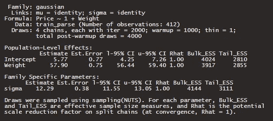

# 因果推断的构建模块——使用 LEGO 的 DAG 方法

> 原文：[`towardsdatascience.com/building-blocks-of-causal-inference-a-daggy-approach-using-lego-cac1372348f3`](https://towardsdatascience.com/building-blocks-of-causal-inference-a-daggy-approach-using-lego-cac1372348f3)

## 使用 DAG 和贝叶斯回归的因果推断简介

[](https://mmgillin.medium.com/?source=post_page-----cac1372348f3--------------------------------)[](https://towardsdatascience.com/?source=post_page-----cac1372348f3--------------------------------) [Murray Gillin](https://mmgillin.medium.com/?source=post_page-----cac1372348f3--------------------------------)

·发布于 [Towards Data Science](https://towardsdatascience.com/?source=post_page-----cac1372348f3--------------------------------) ·阅读时间 9 分钟·2023 年 2 月 4 日

--

因果推断是一个迷人的话题。因果模型旨在创建对变量关系的机械理解。最近我读了 [理查德·麦克艾勒斯的《统计思维》](https://xcelab.net/rm/statistical-rethinking/)，他那富有表现力且易于理解的写作改变了我对回归和统计分析以及生活的思考方式。

本文旨在探讨使用有向无环图（DAG）和 [brms](https://paul-buerkner.github.io/brms/) ([Buerkner](https://www.jstatsoft.org/article/view/v080i01)) 的因果建模。


图片由 [Markus Spiske](https://unsplash.com/@markusspiske?utm_source=medium&utm_medium=referral) 提供，[来源于 Unsplash](https://unsplash.com/?utm_source=medium&utm_medium=referral)

我发现了一篇由 Ziegler 等人撰写的精彩文章，旨在教导小学生多元线性回归模型的教学法。我将使用的数据集取自这篇文章，并在 CC BY 4.0 许可下提供。

[](https://www.tandfonline.com/doi/full/10.1080/26939169.2021.1946450?scroll=top&needAccess=true&role=tab&source=post_page-----cac1372348f3--------------------------------) [## 使用 LEGO 积木数据构建多元线性回归模型

### 摘要 我们提出了一项创新活动，利用关于 LEGO 积木的数据帮助学生自我发现多个…

[www.tandfonline.com](https://www.tandfonline.com/doi/full/10.1080/26939169.2021.1946450?scroll=top&needAccess=true&role=tab&source=post_page-----cac1372348f3--------------------------------)

## **加载包和数据**

```py
library(tidyverse)
library(tidybayes)
library(brms)
library(ggdag)
library(dagitty)

train <- read_csv('lego.population.csv')

train_parse <- 
train %>% 
  drop_na(Weight, Pieces) %>% 
  mutate(Weight = as.numeric(str_sub(Weight, 1, 3)),
         Price = as.numeric(str_remove(Price, '[^[:alnum:]]')),
         Amazon_Price = as.numeric(str_remove(Amazon_Price, '[^[:alnum:]]')),
         Price = coalesce(Price, Amazon_Price)) %>% 
  drop_na(Price, Weight) %>% 
  mutate(Weight_c = Weight/max(Weight),
         Price_c = Price/max(Price),
         Pieces_c = Pieces/max(Pieces)) %>% 
  drop_na(Weight, Pieces, Price)
```

我们进行了一些基本的数据清理，然后对变量进行最小/最大缩放，使它们在相同的尺度上，这样我们后续对贝塔后验均值的解释会更容易得多。

## 探索性数据分析

使用 GGally:ggpairs，我们生成了下面的变量对图。

```py
GGally::ggpairs(train_parse %>% 
                  select(Weight_c, Pieces_c, Price_c),
                aes(alpha = 1/3)) +
  theme_minimal() +
  labs(title = 'Pairplot for Weight, Pieces and Price')
```


使用最小-最大缩放变量的变量对图（图由作者提供）

没有特别有趣的内容需要注意，除了所有三个变量之间强正线性关系的存在。但正确的*因果*模型是什么？增加价格是否也会增加件数？我认为不是这样。

## 因果推断

使用加载的数据集，我们将创建一个关于价格的因果理解。这个数据集在因果关系上概念上很容易理解。

数以千计的乐高套装存在，从基本的儿童 Duplo 到像千年隼或死亡星这样的包含数千件的巨大套装。价格从$10–20 起步，对于限量版模型套装则高达数千美元。我们能否为给定套装的特征创建一个合理的因果模型？

## DAGs

在下文中，我们使用 daggity 包设置我们提议的 DAG，配以一些绘图坐标，然后使用 ggdag 绘制下面的图，描述了权重和件数如何影响乐高套装价格的所有不同路径。

```py
dag_coords <- 
  tibble(name = c("Pcs", 'W', 'Pr'),
         x = c(1, 2, 2),
         y = c(2, 2, 1))

dagify(Pr ~ Pcs,
       Pr ~ W, 
       W ~ Pcs,
       coords = dag_coords) %>% 
  ggplot(aes(x = x, y = y, xend = xend, yend = yend)) +
    geom_dag_point(color = 'dark red', alpha = 1/4, size = 20) +
    geom_dag_edges(edge_color = 'dark red') +
    geom_dag_text(color = 'dark red') +
    scale_x_continuous(NULL, breaks = NULL, expand = c(.1, .1)) +
    scale_y_continuous(NULL, breaks = NULL, expand = c(.1, .1)) +
    theme_bw() +
    theme(panel.grid = element_blank())
```

我们的任务现在是测试这些 DAG 的影响，然后最终确定一个最佳描述这些变量对价格影响的因果模型。首先，我们可以合理地说，件数与重量和价格正相关，即套装的件数越多，重量和价格也会更高。类似地，我们也可以推理出，较大、较重的套装应该价格更高。


权重、件数和价格的完整 DAG（图由作者提供）

## 对件数进行价格回归

自然的起点是将价格与件数进行回归，Pcs → Pr。贝叶斯分析的美妙之处在于能够在查看数据之前提供先验分布。集合价格的分布由正态分布描述，其中均值由拦截项和件数的梯度项的线性项描述。拦截项由一个相对宽泛的高斯分布描述，其均值为$20，标准差为$6。实质上，这描述了没有任何件数的乐高套装的基础价格分布。beta 项描述了每件的价值增加。谷歌搜索表明乐高件的平均价格为 11 美分，因此这是一个良好的起点，我们将使标准差足够宽泛。


Pcs → Pr 先验公式（图由作者提供）

```py
mP_Pr <- brm(Price ~ 1 + Pieces,
             family = gaussian,
             prior = c(prior(exponential(1), class = sigma),
                       prior(normal(20, 6), class = Intercept),
                       prior(normal(0.11, 0.04), class = b)
                       ),
             data = train_parse,
             warmup = 1000, iter = 2000, chains = 4, cores = 4, seed = 246) %>% 
  add_criterion(criterion = c('loo'))
summary(mP_Pr)
```


Pcs → Pr 的摘要输出（图由作者提供）

在接触数据后，我们的先验并没有偏离太远，截距项的后验均值代表了一个零件数为零的 Lego 套件的平均价格，每增加一个部件，套件的价值增加 8 分。后验分布在各自的尺度上具有相当离散的误差项，因此基于数据模型对这些值相当自信。

## 将价格回归于重量

类似于上述情况，设置一些合理但宽泛的先验，这些先验将被数据所淹没。我们假设与之前相同的截距先验，重量的 beta 项也很宽泛，均值为 $50/kg，标准差为 $15。


W → Pr 先验公式（图片由作者提供）

```py
mW_Pr <- brm(Price ~ 1 + Weight,
             family = gaussian,
             prior = c(prior(exponential(5), class = sigma),
                       prior(normal(20, 6), class = Intercept),
                       prior(normal(50, 15), class = b)),                       )
             data = train_parse,
             warmup = 1000, iter = 2000, chains = 4, cores = 4, seed = 246)
```



W → Pr 的总结输出（图片由作者提供）

这次截距项低于之前，后验均值为 $5.77，重量的梯度项后验均值为 $57.90/kg。注意这个模型更为自信，因为误差值比回归价格于部件数时更为离散。

## 将价格回归于部件数和重量

现在情况变得更加有趣了——我们为价格创建了两个贝叶斯回归模型，分别使用部件数和重量。这两个模型看起来都相当不错，但哪个是更好的因果模型呢？

遇到碰撞器，其中部件数和重量彼此独立（Pcs _||_ W）。鉴于我们对变量的机械知识，我们已经可以将这种形式排除，但让我们开发模型来支持这一点。


碰撞器 DAG 和 W → Pr ← Pcs 的公式（图片由作者提供）

```py
# The Colllider
mWP_Pr <- brm(
  Price ~ 1 + Pieces + Weight, 
  family = gaussian,
             prior = c(prior(exponential(5), class = sigma),
                       prior(normal(20, 6), class = Intercept),
                       prior(normal(50, 15), class = b, coef = Weight),
                       prior(normal(0.11, 0.04), class = b, coef = Pieces)
                       ),
  data = train_parse,
             warmup = 1000, iter = 4000, chains = 4, cores = 4, seed = 246)
```


W → Pr ← Pcs 的输出总结（图片由作者提供）

我们立刻注意到，截距的系数几乎没有变化——而且两个预测变量的系数都有所下降，这并不令人惊讶，因为它们的相关性非常强，这是多重共线性的一个例子。这足以证明碰撞器作为合适的因果模型是不成立的，违反了两个变量之间的独立性假设。下面我们将重量和部件数的后验分布一起可视化为散点图，以展示多重共线性，存在某种共享的方差轴。在右侧，我们还看到回归于重量与回归于重量和部件数一起的重量项的后验分布几乎没有差异。

```py
# LHS: Plot of Posterior Draws Weight vs. Pieces
as_draws_df(mWP_Pr) %>%
  ggplot(aes(x = b_Pieces_c, y=b_Weight_c)) +
    geom_point(alpha = 0.3) +
    labs(y = 'Weight', x = 'Pieces', title = 'Weight and Pieces Display Multicollinearity and Not Indpendant', subtitle = 'How Can Price per Piece Increase as Price per Unit Weight Decreases?') +
    theme_minimal()

# RHS: Comparison of Posterior Draws for Weight Across W → Pr ← Pcs & W → Pr
tidy_draws(mWP_Pr) %>% 
  select(b_Pieces_c, b_Weight_c) %>% 
  transmute(Pieces_Weight = b_Pieces_c + b_Weight_c,
         Weight = tidy_draws(mW_Pr) %>% select(b_Weight_c) %>% as_vector()) %>% 
  pivot_longer(1:2, names_to = 'Variable', values_to = 'posterior_samples') %>% 
  ggplot(aes(posterior_samples, fill = Variable)) +
           geom_density(alpha = 1/3) +
  theme_minimal() +
  labs(title = 'Addition of Pieces and Weight is Nearly Equivalent to Weight Alone',
       subtitle = 'Variables Min-Max Scaled',
       y = 'Density',
       x = 'Posterior Distribution')

#NB We've used models regenerated using min-max scaled variables. 
```


重量和部件数显示了多重共线性，变量经过最小-最大缩放（图片由作者提供）

下一个 DAG 被称为管道，其中**件数**在条件为**重量**时与**价格**独立（或 Pcs _||_ Pr | W）。换句话说，一旦知道一组的**重量**，知道**件数**对我们理解**价格**没有进一步的价值。


**管道 Pcs → W → Pr**（图像由作者提供）

以下我们将管道建立为贝叶斯模型，使用我们之前示例中的先验。

```py
# The Pipe
pr_model <- bf(Price ~ 1 + Weight)
w_model <- bf(Weight ~ 1 + Pieces)

mWP_Pr2 <- brm(pr_model + w_model + set_rescor(F),
    prior = c(prior(exponential(5), class = sigma, resp = Price),
              prior(exponential(5), class = sigma, resp = Weight),
              prior(normal(50, 15), class = b, coef = Weight, resp = Price),
              prior(normal(0.11, 0.04), class = b, coef = Pieces, resp = Weight)),
             family = gaussian,
             data = train_parse,
             warmup = 1000, iter = 4000, chains = 4, cores = 4, seed = 246)
```


**Pcs → W → Pr 的总结输出**（图像由作者提供）

由于我们在**重量**上回归，**价格**的截距保持不变，其后验均值实际上与我们的第一个模型 W → Pr 相同。**重量**截距的后验均值可能代表了在添加任何件数之前的包装重量。**件数**的回归系数相对较小（0.0014kg/1.4g 每件）。

让我们用一个反事实模型来测试隐含的条件独立性。我们建立新的数据，改变**件数**的同时保持**重量**恒定为 1 公斤。

```py
# Counterfactual Plot Pieces on Price, Holding Weight Consant
nd <- tibble(Pieces = seq(from = 0, to = 5000, length.out = 50),
             Weight = 1)

predict(mWP_Pr2, 
        resp = c('Price'),
        newdata = nd) %>% 
  as_tibble() %>% 
  bind_cols(nd) %>% 
  ggplot(aes(x = Pieces, y = Estimate, ymin = Q2.5, ymax = Q97.5)) +
    geom_smooth(stat = 'identity', alpha = 1/5, size = 1/4) +
    labs(y = 'Counterfactual Price', x = 'Manipulated Pieces')
```


**价格的影响因素图**（图像由作者提供）

由于**价格**的影响是通过**重量**间接体现的，因此在**重量**恒定的情况下，**价格**将保持不变，无论**件数**的多少。这支持了隐含的条件独立性，即在条件为**重量**时，**价格**与**件数**是独立的（或 Pcs _||_ Pr | W）。换句话说，一旦知道一组的**重量**，知道**件数**对我们理解**价格**没有进一步的信息增量。

**总结评论**

在本文中，我们展示了使用贝叶斯回归的因果建模的易于理解的入门介绍。我们开发了一个因果模型，用于分析物理变量（**件数**和**重量**）对**价格**的影响，并发现我们可以合理地认为，将**价格**回归到**重量**上是一个不错的因果模型。

我想借此机会感谢理查德·麦克埃尔瑞斯特（Richard McElreath）对因果建模的精彩著作和讲座，激发了我改变思维方式，采用更加严谨的贝叶斯方法来处理工作和生活。

谢谢。我希望你阅读这篇文章的乐趣与我写作时的乐趣一样。如果你还不是 Medium 的会员——使用我的推荐链接，定期获取我和其他优秀 Medium 作者的新出版物更新。

[](https://mmgillin.medium.com/membership?source=post_page-----cac1372348f3--------------------------------) [## 穆雷·吉林 - Medium

### 阅读穆雷·吉林在 Medium 上的文章。亚马逊澳大利亚的业务风险分析师 | 热情的数据分析师和机器学习专家…

[mmgillin.medium.com](https://mmgillin.medium.com/membership?source=post_page-----cac1372348f3--------------------------------)
