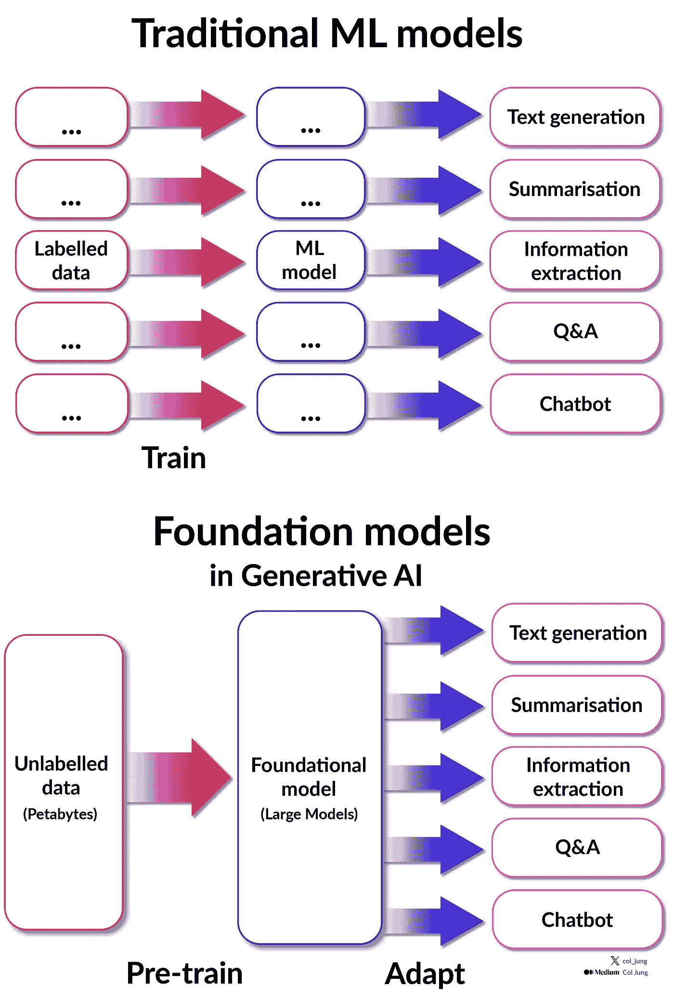
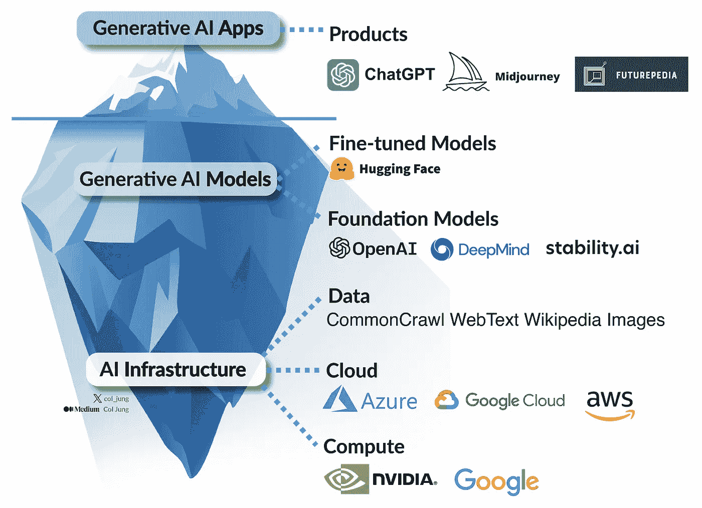
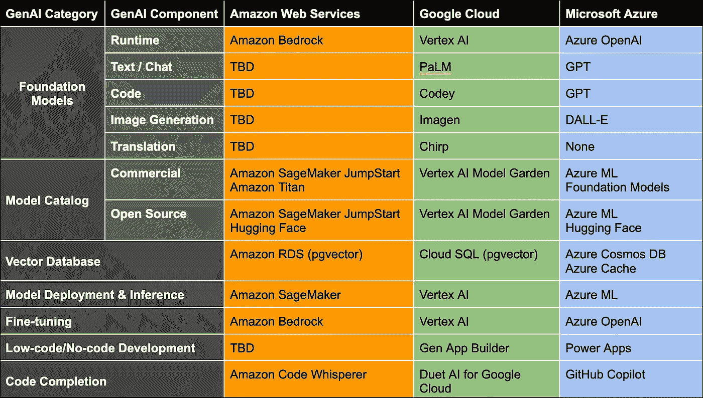
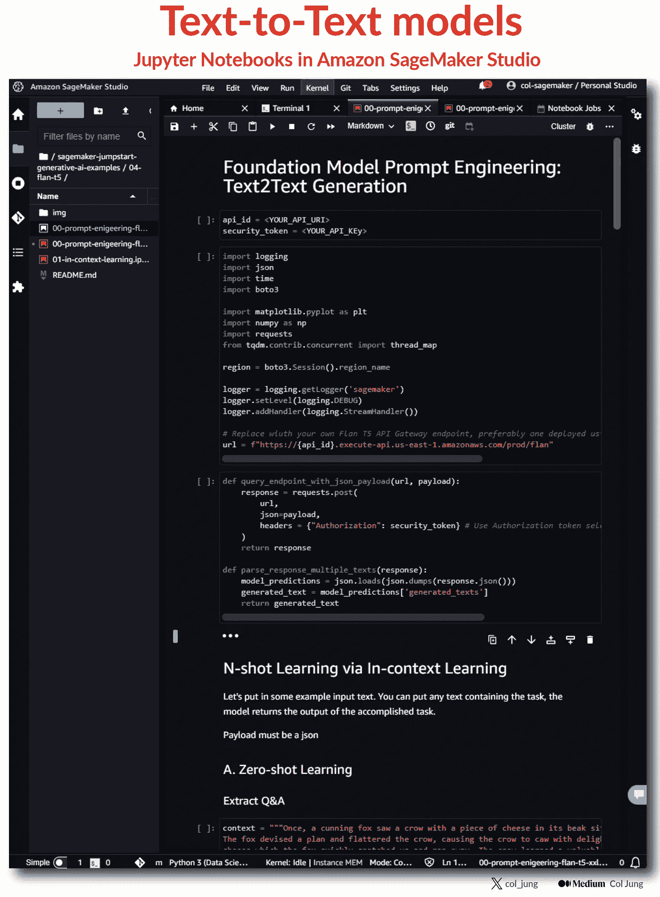
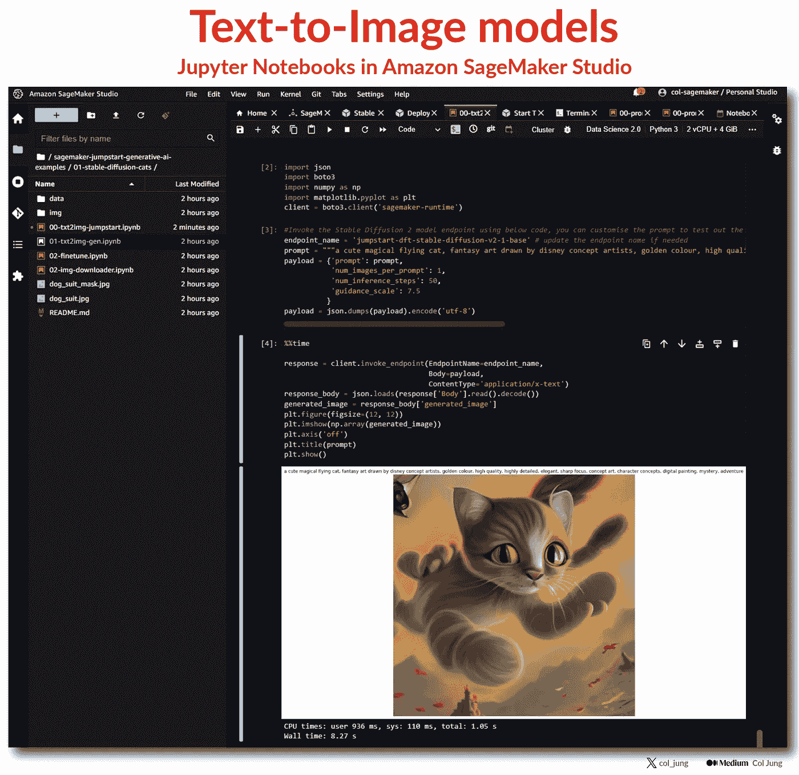
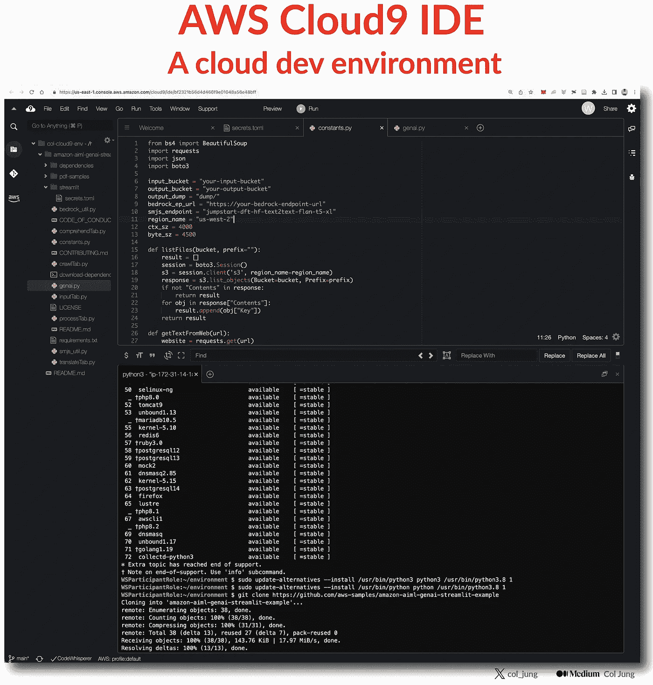
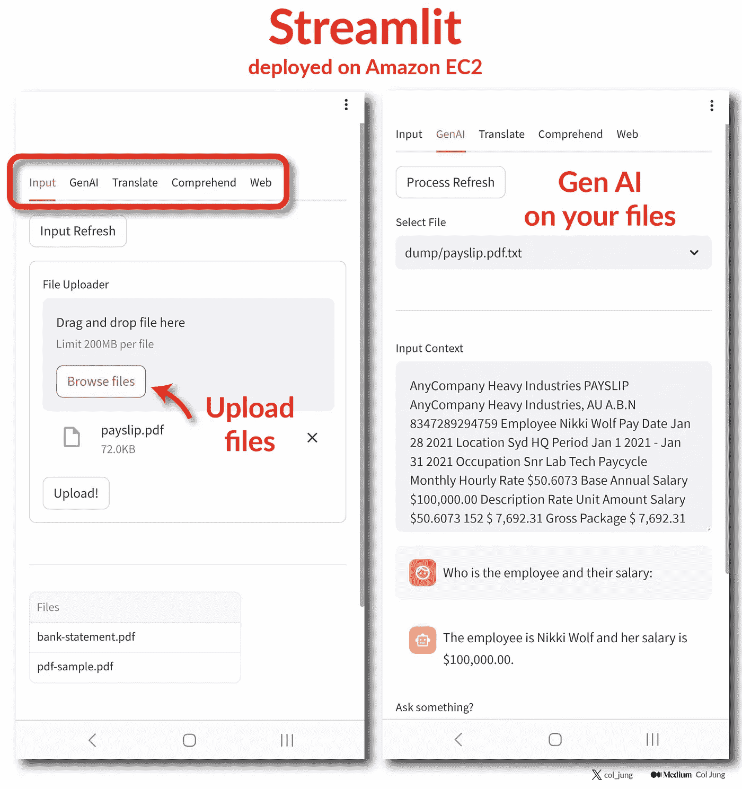
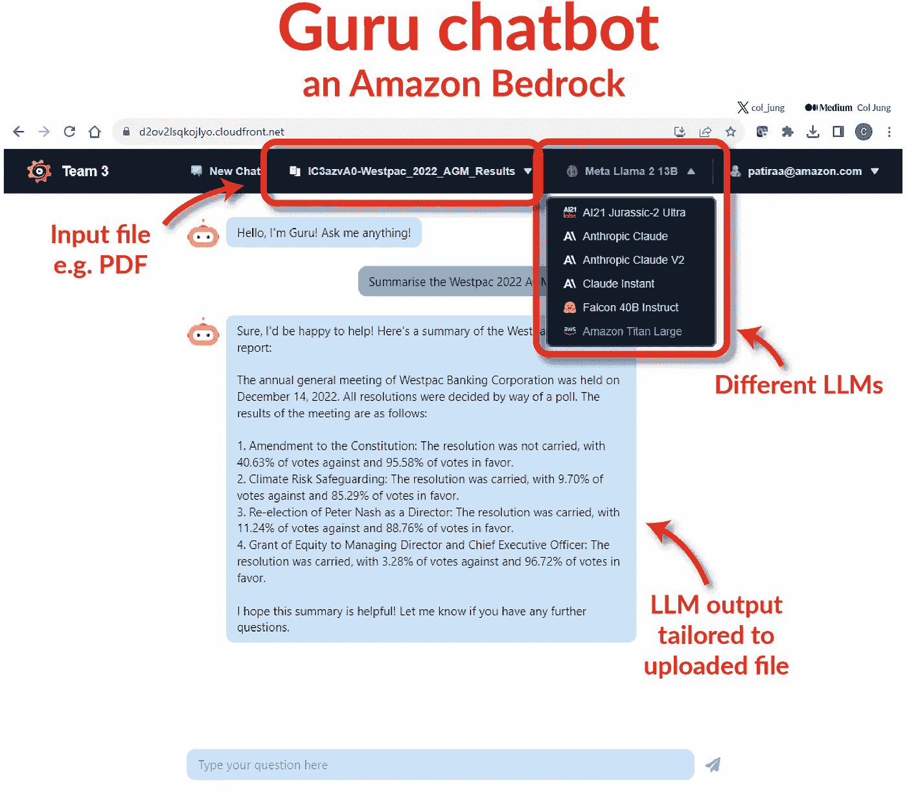

# 在亚马逊网络服务上构建生成型 AI 应用——我的第一次经历

> 原文：[`towardsdatascience.com/building-generative-ai-apps-on-amazon-web-services-my-first-experience-c54f60a21fb1`](https://towardsdatascience.com/building-generative-ai-apps-on-amazon-web-services-my-first-experience-c54f60a21fb1)

## 48 小时黑客马拉松：Amazon Bedrock & SageMaker

 [Col Jung](https://col-jung.medium.com/?source=post_page-----c54f60a21fb1--------------------------------)

·发表于 [Towards Data Science](https://towardsdatascience.com/?source=post_page-----c54f60a21fb1--------------------------------) ·阅读时间 11 分钟·2023 年 9 月 22 日

--

图片由以色列·安德拉德提供 ([Unsplash](https://unsplash.com/photos/YI_9SivVt_s))

大公司对生成型 AI 该如何处理还不完全确定，但他们想要做*一些*事情。

一些人正在通过**内部黑客马拉松**探索这项技术。

**更新**：我现在在 [YouTube](https://www.youtube.com/@col_builds) 上发布分析教程。

作为澳大利亚“四大”银行之一的工程师和数据科学家，在过去一个月里，我被卷入了三次这些令人兴奋的活动中。

为什么是黑客马拉松？

他们作为一种[绝佳方式](https://generativeai.pub/how-big-companies-are-scrambling-to-adopt-generative-ai-d52456fb4c69)，让公司的知识工作者——无论是技术还是非技术人员——头脑风暴生成型 AI 应用场景，测试市场上可用的 AI 工具，并快速制作一些工作原型供决策者审查。

这对你有什么好处？

+   脱离日常工作。（老板，这只是开玩笑！）

+   提升你的创业和创新技能。

+   生成型 AI 是一种颠覆性技术。赶上潮流，否则被抛在后面。

+   在不同的云服务供应商处获得**实践经验**，例如 *AWS* 与 *Microsoft*。

最后一项内容很重要。

不是每天都有公司付钱让你探索最新的企业生成型 AI 工具。

在这篇文章中，我想与我的分析师、工程师和数据科学家同行分享我玩转**亚马逊网络服务（AWS）** AI 工具栈的经验。

大型模型预示着机器学习的范式转变。作者提供的图片

AWS 的友善团队为我们黑客马拉松的参与者提供了以下资源：

1.  AWS *SageMaker JumpStart* 用于访问文本和图像基础模型；

1.  在 AWS *Bedrock* 上的*Guru* 来调整我们基于公司数据的聊天机器人；

1.  *Streamlit* 用于快速部署概念验证应用来推销我们的产品。

让我们深入了解吧！

# AWS 生成 AI 堆栈

生成 AI 需要大量的数据集和巨大的计算能力来训练这些数据上的巨大神经网络，这使得公共云成为一个[理想的](https://generativeai.pub/cloud-computing-unleashed-how-to-harness-the-power-of-cloud-for-your-business-f72e8e23be9)平台选择。

主要的公共云服务提供商，如*亚马逊*、*谷歌*和*微软*，正在激烈争夺开发者、企业和研究人员，通过提供训练和微调生成式 AI 模型的能力，并消费预训练的基础模型-*即服务*。

一系列后端的神奇技术支持生成 AI 产品。图片来源：作者

微软由于与*OpenAI* 的幸运合作，领先于其竞争对手——这是一项真正的[战略智慧](https://generativeai.pub/cloud-computing-unleashed-how-to-harness-the-power-of-cloud-for-your-business-f72e8e23be9)。

*OpenAI* 的旗舰产品 *ChatGPT* 在 2023 年的飞速崛起震惊了谷歌。CEO Sundai Pichai 认识到这对谷歌现有商业模式构成了生死威胁，发出了*红色警报*，呼吁全员动员，将追赶作为首要任务。

与此同时，亚马逊稍晚进入这个领域，但正在迅速追赶。

主要公共云服务提供商的 AI 堆栈。图片来源：[Ivana Tilca](https://ivanatilca.medium.com/aws-azure-and-google-ai-proposals-36631ac39629) ([合理使用](https://www.copyright.gov/fair-use/))

AWS 在生成 AI 的投资主要集中在三个领域：

+   **AWS Bedrock** 是一个完全托管的平台，旨在通过 API 轻松消费基础模型。亚马逊与*AI21Labs*、*Anthropic* 和*Stability AI*等生成 AI 初创公司合作，提供通过亚马逊*Bedrock* API 访问的文本和图像基础模型。*Bedrock* 被定位为微软*Azure OpenAI*平台的竞争对手——被认为是公共云中最成熟和可靠的生成 AI 平台。

+   **AWS SageMaker** 是一个提供用户访问、定制和部署机器学习模型的环境。亚马逊最近扩展了对基础模型的支持，允许用户利用和微调一些最受欢迎的开源模型。特别地，通过官方合作伙伴关系，它提供了对*Hugging Face* 模型广泛目录的轻松访问。

+   **Amazon Titan**，是由亚马逊内部研究人员精心打造的一系列基础模型。预计*TITAN*将整合各种亚马逊服务的模型，如*Alexa*、*CodeWhisperer*、*Polly*、*Rekognition*和其他 AI 服务。

背景介绍完毕，我将深入探讨我们在黑客马拉松中使用 AWS 工具的经验。

# AWS SageMaker JumpStart

简而言之，*SageMaker*使我们能够在 AWS 上部署基础模型，并通过 API 在*Jupyter Notebooks*中访问这些模型。

在黑客马拉松开始时，我们获得了访问[*AWS Workshop Studio*](https://workshops.aws/)的凭证，这是亚马逊用于培训和运行多天 AWS 研讨会的沙箱云环境。

实际上，我们的*Workshop Studio*环境配备了一个完整的 GenAI 课程，但考虑到我们只有 48 小时可以操作，AWS 的讲师为我们提供了一个快速的速成课程，帮助我们访问构建工作 GenAI 产品所需的基本内容。

*SageMaker*配备了一项名为***JumpStart***的功能，它正是这样做的：通过提供预训练的基础模型来快速启动 AI 和 ML 项目，使项目能够迅速起步。对于那些希望尽快开始而无需重新发明轮子的人来说，这是一个福音——考虑到从头训练**大型模型（LM）**所需的技术和计算工作，这一提议极具价值。

AWS 教会我们如何使用*JumpStart*访问一些 AWS 预训练的[文本到文本](https://generativeai.pub/the-road-to-chatgpt-gpt-4-how-deep-learning-revolutionised-natural-language-processing-835d89560577)基础模型，通过一种数据科学家熟悉的界面：**Jupyter Notebooks**。这一切都直接集成在*SageMaker*中。

我们获得了包含所有所需代码的笔记本，以使用**文本到文本**模型，包括亚马逊的*Titan*和 Meta 的*Llama*。

我们只需插入 AWS 提供的 API 密钥。很简单！

作者提供的图像

另一种受欢迎的 GenAI“类型”是文本到图像模型，例如 OpenAI 的*DALL-E*、Midjourney Inc 的*Midjourney*和 Stability AI 的开源*Stable Diffusion*。

再次通过熟悉的*Jupyter Notebooks*界面，我们迅速开始玩弄开源的图像合成 GenAI 模型，特别是稳定扩散模型。

作者提供的图像

**快速说明：** *Stable Diffusion*是 Stability AI 推出的产品，而“稳定扩散模型”实际上是一个市场营销术语，指的是将潜在扩散模型（解决了 GAN 的缺陷）与称为 CLIP 嵌入的技术相结合的模型。*DALL-E* V2、*Midjourney* V5 和*Stable Diffusion* **都**使用稳定扩散模型，这些模型目前是图像合成的最前沿技术。

有关文本到文本和文本到图像模型的技术深入，请参阅我的文章 [这里](https://generativeai.pub/the-road-to-chatgpt-gpt-4-how-deep-learning-revolutionised-natural-language-processing-835d89560577) 和 [这里](https://generativeai.pub/generative-ai-art-the-road-to-dall-e-midjourney-stable-diffusion-3b3219d97f02)。

总的来说，*SageMaker* 使我们能够快速利用 GenAI，因为…

1.  AWS 已经为我们在 *SageMaker JumpStart* 上部署了 6 到 7 个 LMs；

1.  它们可以通过熟悉的 *Jupyter Notebooks* 访问；

1.  我们被提供了立即使用这些模型所需的 Python 代码和 API 密钥。

这意味着那些技术背景不特别强的分析师可以很快开始使用 GenAI，并将更多宝贵的黑客马拉松时间用于用例构思、构建和推介。

# Streamlit & Cloud9

[Streamlit.io](https://streamlit.io/) 是一个开源的前端应用程序。

对于黑客马拉松参与者而言，*Streamlit* 是一种快速创建可以与我们构建的 Gen-AI 模型互动的可视化应用的好方法。

将我们的模型与*Streamlit*连接的最简单方法是使用亚马逊在线 IDE **AWS Cloud9** 进行编码，并将其部署到 AWS，更确切地说是 **Amazon EC2**。

为了揭开术语的面纱，*Cloud9* 是亚马逊自己提供的基于云的开发环境，而 EC2 (*Elastic Compute Cloud*) 是 AWS 颇受欢迎的云环境，个人和企业可以在其中部署应用，应用可以即时扩展到数百万用户。

图片由作者提供

在黑客马拉松中，我们学习了如何使用 *Streamlit* 指南 [这里](https://github.com/aws-samples/amazon-aiml-genai-streamlit-example/tree/main) 快速部署 Gen-AI 应用，这些指南是由我们的一位 AWS 教练编写的。

这使我们能够快速为我们的文本到文本模型创建一个用户友好的移动前端。

应用用户可以安全地上传公司文件，如政策文件，这些文件随后会调整底层 GenAI 模型，使其能够立即模拟经验丰富的公司员工的专业知识。

就像那些从 *The Matrix* 中瞬间下载的内容一样。

图片由作者提供

这种调整 Gen-AI 模型的方法被称为 **RAG 方法**，即…

1.  **获取**公司的企业知识库；

1.  **增强**基础模型与这些公司特定的数据；

1.  **生成**现在为公司量身定制的人类般的响应。

RAG 通过公司自己的数据增强基础模型的训练，从而获得最新和最可靠的信息。

企业拥抱 RAG，因为它目前在解决 **AI 幻觉** 方面排名前列，这对必须确保 AI 向重要客户和员工提供可靠信息的大公司来说可能会带来重大挑战。

# 亚马逊 Bedrock 上的 Guru Chatbot

AWS 团队还让我们访问了 *Guru*，这是一个集成到亚马逊 *Bedrock* 中的 *ChatGPT* 风格的机器人。

*Guru* 具有处理上传文档的能力，通过 RAG 方法进行 AI 调优，成为公司的专家，并根据上传的文档回应用户查询。

例如，我上传了我们公司详细的 2022 年年度股东大会报告，这是一份厚达 308 页的文件，***我绝对没有时间阅读*** 或者甚至适当地浏览。相反，我把它交给了 *Guru*，它轻松地消化了报告，并迅速为我提供了一个简明的总结。

图片来源：作者

亚马逊 *Bedrock* 的优势在于其管理方式，通过 API 便捷地访问预训练的基础模型。

选择“我希望哪个 AI”来总结我上传的文档非常简单。

我尝试了所有的模型：亚马逊 *Titan*、Meta 的 *Llama* 以及其他的，看到它们的反应非常有趣。

例如，‘更大的’模型听起来更好——更“像人类”——但延迟较高。确实，选择使用哪个 AI 模型并不总是倾向于选择最大和最强大的大语言模型；一个调优良好的、小型模型，能够提供亚秒级响应，往往更为合适。

在模型复杂性和用户体验之间存在微妙的平衡。

简而言之，*Guru* 是将公司数据与 GenAI 聊天机器人集成的最简单方法。不需要 *Jupyter Notebooks*，也无需构建或训练模型，一切——包括应用程序前端——都已部署并准备好使用。

# 结果

那么我们这些谦虚的黑客马拉松参与者表现如何呢？

在那 48 小时内，我们构建了什么，并向我们专注的首席技术官展示了？

我们四人团队模拟了一个可以发送 **个性化营销优惠** 的 AI。

在数字时代，大规模提供超个性化的产品和服务是数据驱动型组织的 [圣杯](https://generativeai.pub/modern-enterprise-data-strategy-a-guide-for-analysts-data-scientists-engineers-2d4b45a31427)。这需要大量的数据，提供“360 度视角”的客户信息，以及一个足够强大的数据和高级分析平台，以实时处理和行动这些见解。

我们利用亚马逊的 *SageMaker JumpStart* 预训练基础模型，将一些虚拟客户见解转化为个性化邮件，其中还包括专门为每位客户量身定制的 AI 生成的图片。目标是建立情感联系，推动销售，将体验从平凡普通提升到独特非凡。

忘掉那些千篇一律的“用我们来再融资你的抵押贷款！”广告，广告中有典型的白色栅栏、狗和 2.4 个孩子。在这里，我们希望传达一个能打动客户独特情况的提案，配有 AI 生成的完美房子。

等等，这不是有点让人毛骨悚然吗？

另外，如果我们获得的见解错误，最终冒犯了客户怎么办？

确实，事情可能会很糟糕。我们的 AI 会足够准确、公平和安全吗？我们拥有可信的 AI 吗？

然后就是隐私、安全和关于 GenAI***真正***提供价值的考虑。

这就是为什么我们将**虚拟客户见解**输入到我们的 AI 中，而**不是** ***实际生产客户数据***。

我们绝对不允许将敏感客户数据在生产环境中发送给公共云服务提供商，除非有一系列的安全控制。因此使用了虚拟数据。

我们很快意识到，GenAI 在我们的用例中的价值并不在于生成客户见解。那是我们的高级分析平台最擅长的——数据处理。GenAI 的超级能力在于***以人性化的方式传达***这些见解。

# 最终的话

生成性 AI 是新的，数据驱动的组织[极其渴望](https://generativeai.pub/how-big-companies-are-scrambling-to-adopt-generative-ai-d52456fb4c69)将这一颠覆性技术融入他们的业务中，*不知怎么的*。

黑客马拉松是公司一举多得的好方法：

+   挖掘最佳用例；

+   评估合适的云服务供应商；

+   识别创新员工。

我在亚马逊 GenAI 技术栈上的经验教会我，Gen-AI 时代的创新全在于**迅速组装合适的现成 AI 工具以创造价值**。

我们获得了实际操作经验，辨别 GenAI 在可信的方式下真正增加价值的地方，以及如何在保持安全性和合规性的同时无缝集成这项技术到公司基础设施中——这些考虑是采纳的成败之关键。

各个参与者都在 Amazon *Bedrock* 或 *SageMaker* 中快速拼凑出一些粗糙的东西，尽快向客户展示，并进行迭代。

他们说，快速失败并从失败中前进。

猜猜怎么着：我即将参加一个*微软*黑客马拉松，我一定会及时更新进展。真的很期待玩玩*Azure OpenAI*！

在[Twitter](https://twitter.com/col_jung)和 YouTube [这里](https://youtube.com/@col_builds)、[这里](https://youtube.com/@col_invests)和[这里](https://youtube.com/@col_shoots)找到我。

# 我受欢迎的 AI、ML 和数据科学文章

+   AI 与机器学习：快速入门 — [这里](https://col-jung.medium.com/ai-revolution-your-fast-paced-introduction-to-machine-learning-914ce9b6ddf)

+   机器学习与机制建模 — [这里](https://medium.com/swlh/differential-equations-versus-machine-learning-78c3c0615055)

+   数据科学：现代数据科学家的新技能 — 这里

+   生成性人工智能：大公司如何争相采用 — [这里](https://generativeai.pub/how-big-companies-are-scrambling-to-adopt-generative-ai-d52456fb4c69)

+   ChatGPT 与 GPT-4：OpenAI 如何赢得自然语言理解的战争 — [这里](https://col-jung.medium.com/the-road-to-chatgpt-gpt-4-how-deep-learning-revolutionised-natural-language-processing-835d89560577)

+   生成性 AI 艺术：DALL-E、Midjourney 和 Stable Diffusion 解析 — [这里](https://col-jung.medium.com/generative-ai-art-the-road-to-dall-e-midjourney-stable-diffusion-3b3219d97f02)

+   超越 ChatGPT：寻找真正的智能机器 — [这里](https://col-jung.medium.com/from-chatgpt-to-singularity-the-search-for-a-truly-intelligent-machine-856c8f4c5e63)

+   现代企业数据战略解析 — [这里](https://generativeai.pub/modern-enterprise-data-strategy-a-guide-for-analysts-data-scientists-engineers-2d4b45a31427)

+   从数据仓库和数据湖到数据网格 — 这里

+   从数据湖到数据网格：最新架构指南 — 这里

+   Azure Synapse Analytics 实战：7 个用例解析 — [这里](https://generativeai.pub/azure-synapse-analytics-in-action-7-real-world-use-cases-explored-c73ef231b408)

+   云计算基础知识：如何利用云服务助力您的业务 — [这里](https://generativeai.pub/cloud-computing-unleashed-how-to-harness-the-power-of-cloud-for-your-business-f72e8e23be9)

+   数据仓库与数据建模 — 快速速成课程 — 这里

+   数据产品：为分析构建坚实基础 — [这里](https://generativeai.pub/data-products-why-your-organisation-needs-them-4ac7bf2e5953)

+   数据民主化：5 种‘数据普及’战略 — 这里

+   数据治理：分析师常见的 5 个痛点 — 这里

+   数据讲故事的力量 — 卖故事，而非数据 — [这里](https://medium.com/swlh/power-of-storytelling-in-business-data-analytics-your-data-is-only-half-the-story-f50fadf9712b)

+   数据分析入门：谷歌方法 — 这里

+   Power BI — 从数据建模到令人惊艳的报告 — 这里

+   回归分析：使用 Python 预测房价 — 这里

+   分类：使用 Python 预测员工流失 — 这里

+   Python Jupyter Notebooks 与 Dataiku DSS —— 在这里

+   受欢迎的机器学习性能指标解释 —— 在这里

+   在 AWS 上构建 GenAI —— 我的第一次体验 —— [在这里](https://generativeai.pub/how-big-companies-are-scrambling-to-adopt-generative-ai-d52456fb4c69)

+   COVID-19 的数学建模与机器学习 —— [在这里](https://medium.com/swlh/math-modelling-and-machine-learning-for-covid-19-646efcbe024e)

+   工作的未来：在 AI 时代你的职业安全吗 —— [在这里](https://col-jung.medium.com/future-of-work-is-your-career-safe-in-the-age-of-chatgpt-gpt-4-122d5996bd57)
