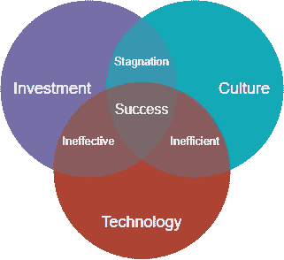
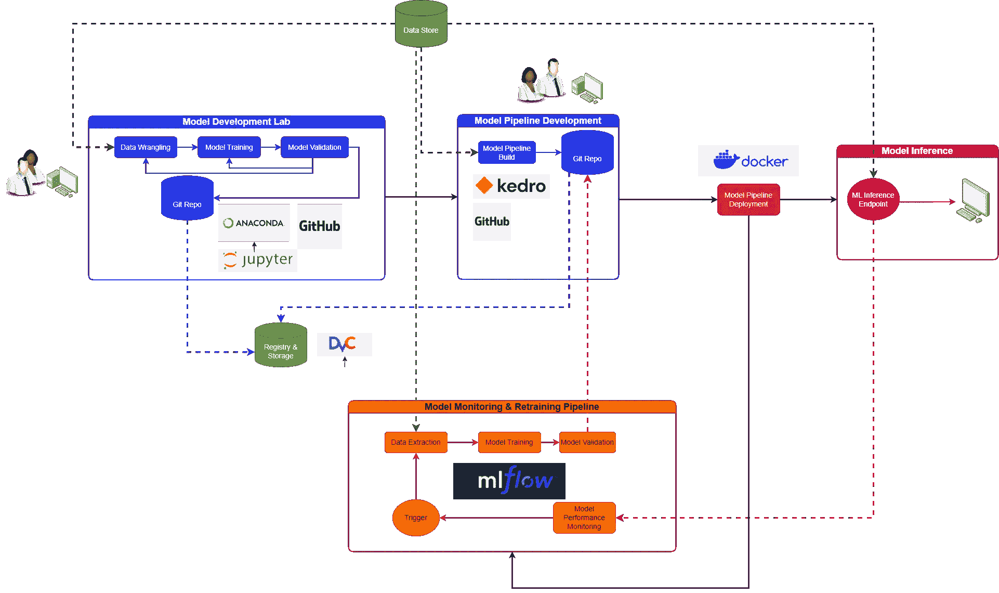
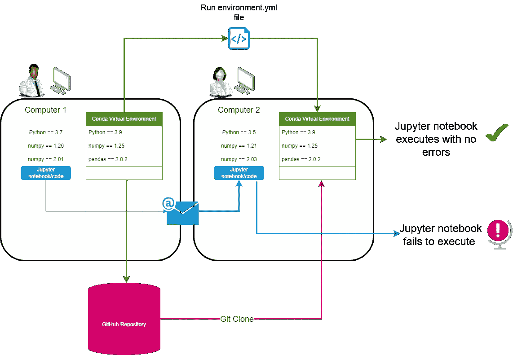
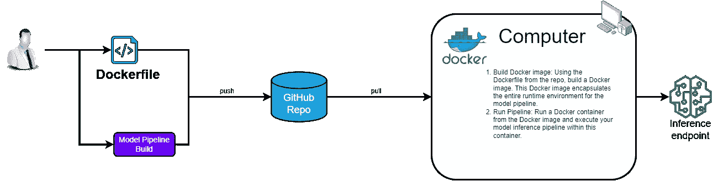

# 为企业建立机器学习操作

> 原文：[`towardsdatascience.com/building-machine-learning-operations-for-businesses-6d0bfbbf2139`](https://towardsdatascience.com/building-machine-learning-operations-for-businesses-6d0bfbbf2139)

## 支持你的 AI 策略的有效 MLOps 蓝图

[](https://johnadeojo.medium.com/?source=post_page-----6d0bfbbf2139--------------------------------)[](https://towardsdatascience.com/?source=post_page-----6d0bfbbf2139--------------------------------) [John Adeojo](https://johnadeojo.medium.com/?source=post_page-----6d0bfbbf2139--------------------------------)

·发布于 [Towards Data Science](https://towardsdatascience.com/?source=post_page-----6d0bfbbf2139--------------------------------) ·11 分钟阅读·2023 年 6 月 20 日

--


图片来源：由作者生成，使用 Midjourney

# 背景 — 探索 MLOps

在我的职业生涯中，我发现成功的 AI 策略的关键在于能够将机器学习模型部署到生产中，从而大规模释放其商业潜力。然而，这不是一件容易的事——它涉及各种技术、团队的整合，并且往往需要组织内部的文化转变，这个系统被称为 MLOps。

然而，没有一种通用的 MLOps 策略。在本文中，我提供了一个灵活的 MLOps 蓝图，可以作为起点或用来微调你当前的工作流程。尽管 MLOps 的旅程可能复杂，我强烈建议将其视为将 AI 融入业务的一个不可或缺的初步步骤，而不是一个次要考虑因素。

# MLOps 超越了技术



图片来源：成功 MLOps 策略的组成部分

在深入技术细节之前，我想分享一些我观察到的各种 MLOps 策略中的（非技术性）见解。MLOps 不仅仅是技术——它依赖于三个关键组成部分：投资、文化和技术。那些从一开始就考虑这三方面的公司往往在策略上更成功。我见过的一个常见错误是企业优先投资解决方案，而忽视了必要的文化变革。这种疏忽可能严重破坏你的策略，可能浪费资金并削弱高层管理人员或投资者的信心。

## 文化

向任何业务引入新文化绝非易事，需要全体员工的全力支持。我常见的一个常见陷阱是，当企业突然用新的、光鲜的工具替代旧工具时，往往忽视了文化变革。这种做法可能引发不满，导致这些工具被忽视或误用。

相反，成功管理文化变革的公司涉及终端用户参与制定 MLOps 策略，并赋予他们推动责任。此外，他们还提供了必要的支持和培训，以提升用户技能，激励他们参与这些举措。

解决方案可能在技术上确实更优，但如果不推动文化变革，它就有可能无效。毕竟，是人们操作技术，而不是技术操作人们。

## 技术

为了简明起见，我将技术定义为技术基础设施和数据管理服务的组合。

有效的 MLOps 策略建立在成熟的数据生态系统之上。通过利用数据管理工具，数据科学家应能够以安全且符合监管要求的方式访问数据进行模型开发。

从技术基础设施的角度来看，我们应当赋能数据科学家和机器学习工程师，提供所需的硬件和软件，以便促进 AI 产品的开发和交付。对许多公司而言，利用云基础设施是实现这一目标的关键。

## 投资

在 MLOps 中没有捷径，特别是在投资方面。高效的 MLOps 策略应优先考虑对人力和技术的投资。我遇到的一个常见问题是，由于预算限制，客户往往倾向于围绕单一数据科学家构建 MLOps 策略。在这种情况下，我通常建议重新评估，或至少调整预期。

从一开始，就必须明确你的创新投入的范围及其持续时间。实际上，如果你希望人工智能成为你运营的基础并带来相关好处，持续投资是至关重要的。

*有关开发 AI 策略的观点，您可能希望阅读我关于使用 Wardley 图绘制 AI 策略的文章：*

[](/building-ai-strategies-for-businesses-7b2e900399b7?source=post_page-----6d0bfbbf2139--------------------------------) ## 为企业建立 AI 策略

### 通过 Wardley 图绘制 AI 策略的艺术

[towardsdatascience.com

# MLOps 的高级蓝图

现在我们已经打下了基础，我们将深入探讨一些 MLOps 的技术组件。为了帮助可视化，我设计了一个流程图，说明了各个过程之间的关系。虚线表示数据流动，实线表示从一个活动到另一个活动的过渡。



作者提供的图像：高层次 MLOps 工作流程

# 模型开发实验室

模型开发过程本质上是不可预测和反复的。未能认识到这一点的公司将难以建立有效的 AI 策略。实际上，模型开发往往是工作流程中最混乱的部分，充满了实验、重复和频繁的失败。这些元素在探索新解决方案时是必不可少的；创新正是在这里诞生的。那么，数据科学家需要什么？实验、创新和合作的自由。

现在有一种普遍的看法，即数据科学家在编写代码时应遵循软件工程最佳实践。虽然我不反对这种观点，但每件事都有其时间和场所。我不认为模型开发实验室必然是这种实践的场所。与其试图平息这种混乱，我们应该将其视为工作流程的必要部分，并寻求利用能够帮助我们管理混乱的工具 — 一个有效的模型开发实验室应能提供这些。让我们探讨一些潜在的组件。

## 实验与原型开发 — Jupyter Labs

[Jupyter Labs](https://jupyter.org/) 提供了一个多功能的集成开发环境（IDE），适用于初步模型和概念验证的创建。它提供了对笔记本、脚本和命令行接口的访问，这些都是数据科学家熟悉的功能。

作为一个开源工具，Jupyter Labs 以其与 Python 和 R 的无缝集成，涵盖了当代数据科学模型开发任务的大部分。大多数数据科学工作负载可以在实验室 IDE 中进行。

## 环境管理 — Anaconda



作者提供的图像：Anaconda 虚拟环境及模型共享的示意图

有效的环境管理可以简化后续的 MLOps 工作流程步骤，重点关注安全访问开源库和再现开发环境。[Anaconda](https://docs.anaconda.com/)，作为一个包管理器，允许数据科学家创建虚拟环境，并使用其简单的命令行接口（CLI）安装模型开发所需的库和包。

Anaconda 还提供了代码库镜像，评估开源包的安全商业使用，尽管需要考虑第三方管理的相关风险。使用虚拟环境在管理实验阶段至关重要，本质上为特定实验提供了一个封闭的空间来容纳所有包和依赖项。

## 版本控制与协作 — GitHub Desktop

协作是成功的模型开发实验室的重要组成部分，利用 [GitHub Desktop](https://desktop.github.com/) 是促进这一点的有效方式。数据科学家可以通过 GitHub Desktop 为每个实验室创建一个仓库。每个仓库存储模型开发的笔记本或脚本，以及一个 *environment.yml* 文件，该文件指示 Anaconda 如何在另一台机器上重现笔记本开发时的环境。

Jupyter Labs、Anaconda 和 GitHub 这三种实验室组件的结合为数据科学家提供了一个安全的空间进行实验、创新和协作。

```py
#An example environment.yml file replicating a conda environment

name: myenv
channels:
  - conda-forge
dependencies:
  - python=3.9
  - pandas
  - scikit-learn
  - seaborn
```

# 模型管道开发

在与处于 MLOps 成熟初期的客户讨论时，似乎存在这样一种观点：数据科学家开发模型后，将其“交给”机器学习工程师进行“生产化”。这种做法不可行，而且很可能是最快丢失机器学习工程师的方式。没有人愿意处理他人的混乱代码，坦率地说，期望工程师处理这些代码是不公平的。

相反，组织需要培养一种文化，使数据科学家负责在数据实验室中开发模型，然后将其正式化为端到端模型管道。这是为什么：

+   数据科学家对他们的模型了解得比任何人都要多。让他们负责创建模型管道将提高效率。

+   你在每个开发阶段建立一种软件工程最佳实践的文化。

+   机器学习工程师可以专注于能够增加价值的工作，如资源配置、扩展和自动化，而不是重构他人的笔记本。

构建端到端的管道初看起来可能会令人畏惧，但幸运的是，有针对数据科学家的工具可以帮助他们实现这一目标。

## 模型管道构建 — Kedro

[Kedro](https://kedro.org/) 是一个由 [麦肯锡量子黑客](https://www.mckinsey.com/capabilities/quantumblack/how-we-help-clients) 提供的开源 Python 框架，用于帮助数据科学家构建模型管道。

```py
# Standard template for Kedro projetcs

{{ cookiecutter.repo_name }}     # Parent directory of the template
├── conf                         # Project configuration files
├── data                         # Local project data
├── docs                         # Project documentation
├── notebooks                    # Project related Jupyter notebooks
├── README.md                    # Project README
├── setup.cfg                    # Configuration options for tools 
└── src                          # Project source code
    └── {{ cookiecutter.python_package }}
       ├── __init.py__
       ├── pipelines
       ├── pipeline_registry.py
       ├── __main__.py
       └── settings.py
    ├── requirements.txt
    ├── setup.py
    └── tests
```

Kedro 提供了一个用于构建端到端模型管道的标准模板，结合了软件工程最佳实践。其背后的理念是鼓励数据科学家构建模块化、可重复和易维护的代码。一旦数据科学家完成了 Kedro 工作流，他们实际上构建了一个可以更容易地部署到生产环境的系统。以下是总体概念：

+   **项目模板**：Kedro 提供了一个标准且易于使用的项目模板，提升了结构性、协作性和效率。

+   **数据目录**：Kedro 中的数据目录是项目可以使用的所有数据源的注册表。它提供了一种简单的方法来定义数据的存储方式和位置。

数据工程目录由 Kedro 项目定义，详见 [`docs.kedro.org/en/0.18.1/faq/faq.html`](https://docs.kedro.org/en/0.18.1/faq/faq.html)

+   **管道**: Kedro 将数据处理结构化为一个依赖任务的管道，强制执行清晰的代码结构，并可视化数据流和依赖关系。

+   **节点**: 在 Kedro 中，节点是一个 Python 函数的包装器，指定该函数的输入和输出，作为 Kedro 管道的构建块。

+   **配置**: Kedro 管理不同环境（开发、生产等）的配置，而不需要将任何配置硬编码到代码中。

+   **输入/输出**: 在 Kedro 中，I/O 操作与实际计算相抽象，这增加了代码的可测试性和模块化，并简化了不同数据源之间的切换。

+   **模块化和可重用性**: Kedro 提倡模块化编码风格， resulting in reusable, maintainable and testable code.

+   **测试**: Kedro 集成了 Python 中的测试框架 PyTest，使得编写管道测试变得简单。

+   **版本控制**: Kedro 支持数据和代码的版本控制，使得能够重现管道的任何先前状态。

+   **日志记录**: Kedro 提供了标准化的日志记录系统，用于跟踪事件和变更。

+   **钩子和插件**: Kedro 支持钩子和插件，根据项目需求扩展框架功能。

+   **与其他工具的集成**: Kedro 可以与 Jupyter notebook、Dask、Apache Spark 等各种工具集成，以促进数据科学工作流的不同方面。

所有 Kedro 项目都遵循这一基本模板。对数据科学团队实施这一标准将实现可重复性和可维护性。

若要了解 Kedro 框架的更全面概述，请访问以下资源：

+   Kedro 文档: [link](https://docs.kedro.org/en/stable/)

+   数据工程中分层思维的重要性: link

## 注册与存储 — 数据版本控制 (DVC)

注册和存储是机器学习可重复性的基础，任何希望融入机器学习的企业都应牢记这一点。机器学习模型本质上由代码、数据、模型制品和环境组成 — 这些都必须可追溯，以实现可重复性。

[DVC](https://dvc.org/doc/start/data-management/data-versioning?tab=Windows-Cmd-) 是一个为模型和数据提供版本控制和跟踪的工具。虽然 GitHub 可能是一个替代方案，但它在存储大对象的能力上有限，对大量数据集或模型构成问题。DVC 实质上扩展了 Git，提供相同的版本控制能力，同时支持在本地或云端的 DVC 仓库中存储更大的数据集和模型。

在商业环境中，将代码版本控制在 Git 仓库中有明显的安全优势，同时将实际的模型制品和数据单独存储在受控环境中。

*记住，随着关于 AI 商业使用的法规日益严格，模型的可重复性将变得越来越重要。可重复性有助于审计。*

# 模型管道部署 — Docker



作者提供的图片：推理管道的 Docker 部署示意图。请注意，这种方法也可以应用于模型监控和再训练管道

部署不仅仅是一个单一任务，而是一个精心设计的工具、活动和过程的融合；[Docker](https://docs.docker.com/) 将这些都联系在一起，用于模型部署。对于具有众多依赖项的复杂 ML 应用程序，Docker 通过将应用程序与其环境封装在一起，确保了在任何机器上的一致性。

这个过程始于一个 Dockerfile；然后，Docker 使用其命令构建一个镜像，这是一个适用于任何启用 Docker 的机器的预打包模型管道。与 Kedro 的管道功能结合使用，Docker 可以高效地部署模型再训练和推理管道，确保 ML 工作流各个阶段的可重复性。

# 模型监控与再训练管道 — MLflow

随着时间的推移，机器学习模型的性能会受到退化的影响，这可能是由于[概念漂移](https://machinelearningmastery.com/gentle-introduction-concept-drift-machine-learning/)或[数据漂移](https://www.datacamp.com/tutorial/understanding-data-drift-model-drift)。我们希望能够监控模型性能何时开始下降，并在必要时重新训练它们。[MLflow](https://mlflow.org/docs/latest/index.html) 通过其跟踪 API 提供了这种能力。跟踪 API 应该被纳入数据科学家构建的模型训练和推理管道中。虽然我在模型监控和再训练管道中指定了 MLflow 进行跟踪，但跟踪也可以在模型开发实验室进行，特别是用于实验跟踪。

# 推理端点

鉴于推理管道已经被封装到 Dockerfile 中，我们可以在任何地方创建该管道的 Docker 镜像，以用作任何应用程序的 API 端点。根据使用情况，我们将不得不决定在哪里部署 Docker 镜像。不过，这超出了本文的范围。

# 角色与职责

在 MLOps 中分配明确的角色和责任对其成功至关重要。MLOps 的多面性跨越了多个学科，因此需要清晰的角色划分。这确保了每项任务的高效执行。此外，它还促进了责任的明确，从而更快地解决问题。最后，明确的委派减少了混乱和重叠，使团队更高效，并有助于维持和谐的工作环境。这就像一台运行良好的机器，每个齿轮都发挥着完美的作用。

## 数据科学家

+   **角色**：数据科学家在 MLOps 策略中的主要功能是专注于模型开发。这包括初步实验、原型设计和为经过验证的模型设置建模管道。

+   **职责**：数据科学家确保模型遵循机器学习最佳实践，并与业务案例对齐。除了实验室任务，他们还与业务利益相关者沟通，识别有影响的解决方案。他们对数据实验室负责，一个主数据科学家应该设定操作节奏和实验室设置的最佳实践。

## 机器学习工程师

+   **角色**：ML 工程师负责监督 MLOps 的技术基础设施，探索创新解决方案，与数据科学家共同制定策略，并提升流程效率。

+   **职责**：他们确保技术基础设施的功能，监控组件的性能以控制成本，并确认生产模型满足所需规模的需求。

## 数据治理专业人士

+   **角色**：数据治理专业人士维护安全性和数据隐私政策，在 MLOps 框架内安全传输数据方面发挥关键作用。

+   **职责**：虽然数据治理是每个人的责任，这些专业人士会制定政策并通过定期检查和审计确保合规。他们跟进法规，确保所有数据使用者的合规。

# 结论

在 MLOps 领域的导航是一项需要深思熟虑的规划、正确的技术与人才组合，以及支持变革和学习的组织文化的任务。

这个过程可能看起来很复杂，但通过采用精心设计的蓝图，并将 MLOps 视为一个整体的、迭代的过程而不是一次性的项目，你可以从你的 AI 策略中获得巨大的价值。然而，请记住，没有一种方法适用于所有情况。量体裁衣，调整你的策略以适应具体需求，并保持灵活应对变化的环境，这一点至关重要。

*在* [*LinkedIn*](https://www.linkedin.com/in/john-adeojo/) *上关注我*

*订阅 Medium 以获取更多我的见解：*

[](https://johnadeojo.medium.com/membership?source=post_page-----6d0bfbbf2139--------------------------------) [## 使用我的推荐链接加入 Medium — John Adeojo

### 我分享数据科学项目、经验和专业知识，以帮助你在旅途中取得成功。你可以通过…

[johnadeojo.medium.com](https://johnadeojo.medium.com/membership?source=post_page-----6d0bfbbf2139--------------------------------)

*如果你有兴趣将 AI 或数据科学融入到你的业务运营中，我们邀请你预约一次免费的初步咨询：*

[](https://www.data-centric-solutions.com/book-online?source=post_page-----6d0bfbbf2139--------------------------------) [## 在线预约 | 数据驱动解决方案

### 通过免费的咨询发现我们在帮助企业实现雄心目标方面的专业知识。我们的数据科学家和…

[www.data-centric-solutions.com](https://www.data-centric-solutions.com/book-online?source=post_page-----6d0bfbbf2139--------------------------------)
