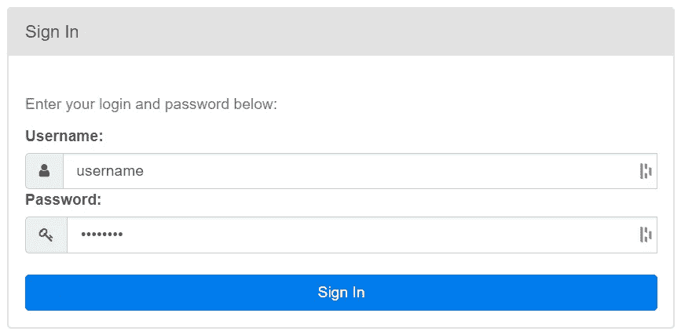

# 在 Apache Airflow 中构建管道 - 初学者指南

> 原文：[`towardsdatascience.com/building-pipelines-in-apache-airflow-for-beginners-58f87a1512d5`](https://towardsdatascience.com/building-pipelines-in-apache-airflow-for-beginners-58f87a1512d5)

## 一个快速简单的演示，展示如何在 Airflow 上运行 DAG

[](https://medium.com/@aashishnair?source=post_page-----58f87a1512d5--------------------------------)[](https://towardsdatascience.com/?source=post_page-----58f87a1512d5--------------------------------) [Aashish Nair](https://medium.com/@aashishnair?source=post_page-----58f87a1512d5--------------------------------)

·发表于 [Towards Data Science](https://towardsdatascience.com/?source=post_page-----58f87a1512d5--------------------------------) ·阅读时间 9 分钟 ·2023 年 3 月 15 日

--


图片由 [Kelly Sikkema](https://unsplash.com/@kellysikkema?utm_source=medium&utm_medium=referral) 提供，[Unsplash](https://unsplash.com/?utm_source=medium&utm_medium=referral)

Apache Airflow 在数据科学和数据工程领域非常受欢迎。它拥有许多功能，使用户能够以编程方式创建、管理和监控复杂的工作流。

然而，该平台的功能范围可能会无意中成为初学者的负担。新用户在浏览 Apache Airflow 的文档和教程时，可能会被新术语、工具和概念淹没。

为了提供一个更易于理解的入门介绍，我们提供了一个 Apache Airflow 演示的简化版本，该演示涉及编码和运行 Airflow 管道。

## 术语

熟悉以下 Airflow 术语后，将更容易跟随演示。

1.  **DAG：** DAG，意为有向无环图，是 Airflow 用来表示工作流的工具。DAG 由表示任务的节点和表示任务之间关系的箭头组成。


示例 DAG（作者创建）

**2\. 任务：** 任务是 DAG 中的一个工作单元。DAG 中的任务可以通过依赖关系连接在一起，确保按照特定顺序执行。

**3\. 操作符：** 操作符是用于实例化 DAG 中任务的工具。Airflow 提供了大量操作符，能够执行基本的工作，如执行 Python 代码、bash 命令和 SQL 查询。

**4\. 元数据数据库：** 元数据数据库存储用户创建和运行的 Airflow 管道的元数据。

**5\. Webserver：** Webserver 是一个方便的用户界面，使用户能够运行、监视和调试管道。

**6\. 调度器：** 调度器负责监控 DAG 并在其依赖关系满足时运行任务。

## 演示

演示的目标是使用 Python 创建一个 DAG 并在 Airflow 上运行。由于我们优先考虑简洁性，我们将创建一个仅包含两个任务的 DAG。

第一个任务运行一个名为 `pull_jokes` 的 Python 函数，它从 [官方笑话 API](https://github.com/15Dkatz/official_joke_api) 获取随机笑话并将其存储在文本文件中。

第二个任务运行一个 bash 命令，打印一句话：

```py
echo "The random jokes have been pulled"
```

最后，我们希望第二个任务（即 bash 命令）在第一个任务（即 Python 函数）之后立即执行。如果我们可视化这个 DAG，它会像这样：


演示 DAG（由作者创建）

很简单，对吧？我们开始吧。

## 第一部分 — 设置 Airflow

在开始创建任何 DAG 之前，我们需要在机器上设置 Airflow，这将需要使用命令行界面。

有几种方法可以安装 Apache Airflow，如 [文档](https://airflow.apache.org/docs/apache-airflow/stable/installation/index.html) 中所述。在这里，我们将使用 PyPI 方式进行安装。

1.  **激活 Windows 子系统 Linux（适用于 Windows 用户）**

如果你使用的是 Windows，你需要激活 Windows 子系统 Linux（WSL），这将需要先安装 Ubuntu。

要激活 WSL，请在 PowerShell 中输入 `wsl` 命令。

**2\. 创建虚拟环境**

接下来，创建我们将工作的虚拟环境。输入以下命令以安装 python-venv。

```py
sudo apt install python3-venv 
```

对于演示，我们将创建一个名为“airflow_venv”的虚拟环境并激活它。

```py
python -m venv airflow_venv
source airflow_venv/bin/activate
```


激活虚拟环境（由作者创建）

**3\. 选择 Airflow 的主目录（可选）**

重要的是要知道 Airflow 项目将存储在哪里，因为创建的工作流应存储和配置在这里。

默认情况下，Airflow 的主目录将是 `~/airflow` 目录。然而，用户可以使用以下命令更改 Airflow 的主目录：

```py
export AIRFLOW_HOME=<directory>
```

对于案例研究，项目将存储在 `~/airflowhome` 目录中。

**4\. 安装 Apache Airflow**

确认主目录后，使用以下命令通过 pip 安装 Apache Airflow：

```py
pip install apache-airflow 
```

此安装将在主目录中创建一个具有以下结构的项目：

```py
└── airflowhome/
    ├── airflow.cfg
    ├── logs/
    │   └── ...
    └── webserver_config.py
```


Airflow 主目录（由作者创建）

名为 `airflow.cfg` 的文件包含了所有 Airflow 的配置。它包含一个名为 `dags_folder` 的参数，显示所有创建的 DAG *必须* 存放的文件夹路径。

通过输入以下命令，你可以查看当前分配的目录：

`vim airflow.cfg`


代码输出（由作者创建）

如输出所示，所有用于此演示的 airflow DAG 必须位于`airflowhome`目录中的`dags`子目录中。

因此，我们将在同一目录中创建一个名为`dags`的文件夹，其中将包含随后创建的管道。

```py
mkdir dags
```

> 注意：您也可以更改 airflow.cfg 文件中分配给`*dags_folder*`参数的路径，选择您喜欢的路径。

项目结构应更新为如下：

```py
└── airflowhome/
    ├── airflow.cfg
    ├── logs/
    │   └── ...
    ├── dags/
    └── webserver_config.py
```

**5\. 初始化元数据数据库**

接下来，使用以下命令初始化数据库：

```py
airflow db init
```

初始化数据库后，airflow 主目录中现在应该有一个名为`airflow.db`的文件。

```py
└── airflowhome/
    ├── airflow.cfg
    ├── airflow.db
    ├── logs/
    │   └── ...
    ├── dags/
    └── webserver_config.py
```


Airflow 主目录（作者创建）

**6\. 创建用户。**

需要一个用户账户来访问网络服务器，因此我们可以使用以下命令创建一个。

```py
airflow users create --username <username> \ 
                     --password <password> \
                     --firstname <firstname> \
                     --lastname <lastname> \
                     --role <role> \
                     --email <email>
```

对于案例研究，我们将创建一个管理员账户。


创建用户（作者创建）

一旦创建了用户账户，可以使用以下命令进行验证：

```py
airflow users list
```


代码输出（作者创建）

**7\. 启动 Web 服务器和调度器**

可以通过一行命令打开 Airflow web 服务器。

```py
airflow webserver -p 8080
```

> 注意：默认端口为 8080，但您可以选择不同的端口。

在新的终端中，使用以下命令启动调度器：

```py
airflow scheduler
```

**9\. 登录到 Web 服务器**

启动 web 服务器后，在网页浏览器中访问“[`localhost:8080/`](http://localhost:8080/)”（或您选择的任何端口），您将被定向到登录页面，在那里输入您新创建的用户账户的登录凭据。



登录页面（作者创建）

输入详细信息后，您将被定向到主页。


Web 服务器（作者创建）

目前，只会有 Airflow 提供的示例 DAG，但一旦创建了您的 DAG，它们也会显示在 web 服务器上。

## 第二部分 — 创建 DAG

既然我们已经设置好了 Airflow，我们可以使用 Python 构建 DAG。此演示中创建的 DAG 将被称为“pulling_jokes_dag”。

以下名为`pull_jokes.py`的 Python 脚本创建了一个 DAG 实例及其任务：

这是一个小代码片段，但有很多内容。让我们一步步详细解读。

1.  **创建 DAG 实例**

首先，我们创建一个 DAG 实例，在其中确定 DAG 的配置。

一个 DAG 实例必须为两个参数分配值：`dag_id`和`start_date`。`dag_id`参数是 DAG 的唯一标识符，而`start_date`参数是 DAG 计划开始的日期。

为了简化操作，我们只会指定几个参数。`schedule` 参数定义 DAG 应运行的规则。`end_date` 参数表示 DAG 运行应停止的时间。`catchup` 参数表示调度程序是否应为自上次数据间隔以来未运行的任何数据间隔启动 DAG 运行。`tag` 参数为 DAG 分配标签，这将使其在 UI 中更易于找到。

对于那些对 DAG 实例所有可用参数感兴趣的人，可以访问 Airflow 的 [文档](https://airflow.apache.org/docs/apache-airflow/stable/_api/airflow/models/dag/index.html)。

**2. 创建第一个任务**

创建 DAG 实例后，我们可以创建第一个任务，该任务运行 `pull_jokes` 函数，使用 [Python Operator](https://airflow.apache.org/docs/apache-airflow/stable/howto/operator/python.html)。

`task_id` 参数是任务的唯一标识符，而 `python_callable` 参数包含应执行的函数。

**3. 创建第二个任务**

接下来，我们创建第二个任务，该任务执行 bash 命令，使用[Bash Operator](https://airflow.apache.org/docs/apache-airflow/stable/howto/operator/bash.html)。

再次地，`task_id` 参数是任务的唯一标识符，而 `bash_command` 参数包含应执行的 bash 脚本。

**4. 建立依赖关系**

创建任务后，需要设置依赖关系以确定任务的执行顺序。

我们可以使用 `>>` 操作符将任务 2 设置为在任务 1 *之后* 执行。

## 第三部分 — 在 Airflow 上运行 DAG

一旦创建了 DAG 的 Python 脚本，下一步是让 DAG 在 Airflow 上运行。

提醒一下，DAG 脚本 *必须* 放置在 `airflow.cfg` 文件中指定的位置。用于此案例研究的 `pull_jokes.py` 文件应位于此位置。


DAGs 目录（作者创建）

将 `pull_jokes.py` 文件移动到正确的位置后，项目目录结构应如下所示：

```py
└── airflowhome/
    ├── airflow.cfg
    ├── airflow.db
    ├── dags/
    │   └── pull_jokes.py
    ├── logs/
    │   └── ...
    └── webserver_config.py
```

现在，Airflow 应该可以访问 DAG。要确认这一点，只需输入以下命令：

```py
airflow dags list
```

我们现在应该能够在 Web 服务器中查看新添加的 DAG。使用以下命令启动 Web 服务器：

```py
airflow webserver -p 8080
```

在一个单独的终端中，启动调度程序

```py
airflow scheduler
```

你应该能够在 UI 中看到名为“pulling_jokes_dag”的 DAG。


Web 服务器中的 DAG（作者创建）

> 专业提示：虽然这是可选的，但最好为你的 DAG 分配标签。这将使其在 Web 服务器中更易于查找。

从技术上讲，DAG 可以仅通过命令行界面进行管理，但 Web 服务器中的功能使得访问和监控创建的管道变得更加容易。

一些功能包括但不限于：

+   **DAG 以网格形式的详细说明：**


网格视图（作者创建）

+   **DAG 的图形形式分析**


图形视图（作者创建）

+   **DAG 的底层 Python 代码**


代码（作者创建）

+   **审计日志**


审计日志（作者创建）

一旦 Airflow 访问到 DAG，它将根据提供的时间表执行 DAG 运行。

也可以通过点击网页服务器右上角的“播放按钮”手动运行 DAG。


运行 DAG（作者创建）

或者，可以使用 CLI 手动触发 DAG：

```py
airflow dags trigger <dag_id>
```

就这样，我们的 DAG 在 Airflow 上运行起来了！

## 结论


照片由[Prateek Katyal](https://unsplash.com/es/@prateekkatyal?utm_source=medium&utm_medium=referral)提供，来源于[Unsplash](https://unsplash.com/?utm_source=medium&utm_medium=referral)。

希望这对那些希望亲身体验 Apache Airflow 的人来说是一个有用的入门指南。

这个演示绝不是 Airflow 功能和能力的全面展示（我们只是初步了解），但它应该能帮助人们入门，这通常是最困难的部分。

在构建并运行第一个 DAG 后，你将建立一个坚实的基础，这将使你更容易设计和运行更复杂的工作流，体验更加顺畅。

祝你在数据科学的努力中好运！
