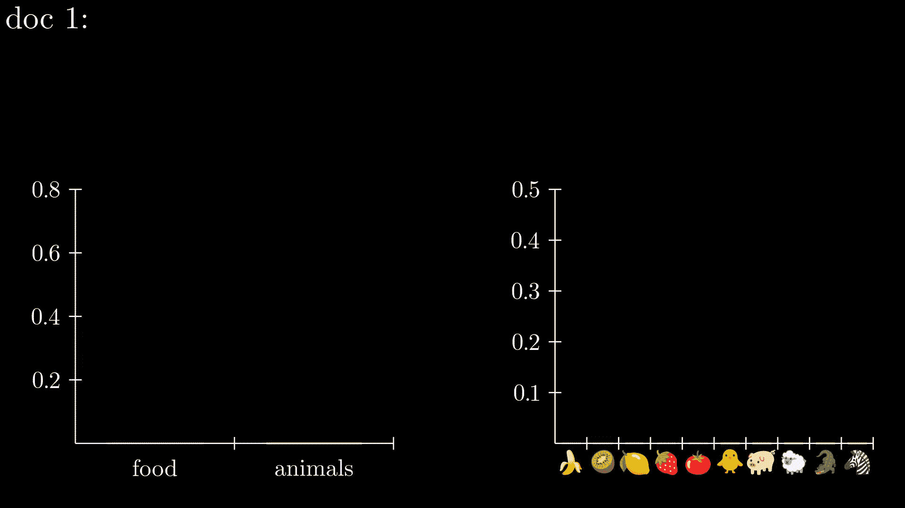

# 什么是 LDA？通过类似 3Blue1Brown 的数学动画来解释。

> 原文：[`towardsdatascience.com/but-what-is-lda-explained-using-mathematical-animation-like-3blue1brown-4e8825334d84?source=collection_archive---------8-----------------------#2023-06-05`](https://towardsdatascience.com/but-what-is-lda-explained-using-mathematical-animation-like-3blue1brown-4e8825334d84?source=collection_archive---------8-----------------------#2023-06-05)

 [Lan Chu](https://huonglanchu.medium.com/?source=post_page-----4e8825334d84--------------------------------)

·

[关注](https://medium.com/m/signin?actionUrl=https%3A%2F%2Fmedium.com%2F_%2Fsubscribe%2Fuser%2F3916743f0e10&operation=register&redirect=https%3A%2F%2Ftowardsdatascience.com%2Fbut-what-is-lda-explained-using-mathematical-animation-like-3blue1brown-4e8825334d84&user=Lan+Chu&userId=3916743f0e10&source=post_page-3916743f0e10----4e8825334d84---------------------post_header-----------) 发表在 [数据科学之道](https://towardsdatascience.com/?source=post_page-----4e8825334d84--------------------------------) ·13 分钟阅读·2023 年 6 月 5 日

--

并给你的同事留下深刻印象 ;)

你是否曾经为解释数学概念而苦恼？[3Blue1Brown](https://www.youtube.com/channel/UCYO_jab_esuFRV4b17AJtAw)是我最喜欢的 YouTube 频道，用于查找有趣的视频和动画来解释数学和统计主题。我曾经对二项分布一知半解，直到我在这个频道上看到了视觉化的解释 🤷‍♀️

如果你能学会这些动画是如何制作的，从而创建类似的动画来解释数据科学概念，给你的团队成员和经理留下深刻印象，那岂不是太棒了吗？🤩😍

LDA 生成过程。作者提供的动图。

很幸运，你可以使用[**Manim**](https://docs.manim.community/en/stable/)来完成这个任务！ 😍 它是一个免费的开源项目，允许我们使用 Python 创建数学动画，最初由[**Grant** **Sanderson**](https://twitter.com/3blue1brown)编写，现在由 Manim Community 维护。

在这篇文章中，我们将学习如何在 Manim 中创建一些基本元素，并将我们学到的内容应用于动画展示如何使用 Latent Dirichlet Allocation (LDA) 生成文档。如果你想了解 LDA 的工作原理，我有一篇[文章](https://medium.com/towards-data-science/what-do-countries-talk-about-at-the-un-general-debate-topic-modelings-using-lda-19873cf00fe0)对你会有帮助。在这篇文章中，我们将默认你已经理解 LDA 的工作原理。好了，开始吧。

# 什么是 Manim
